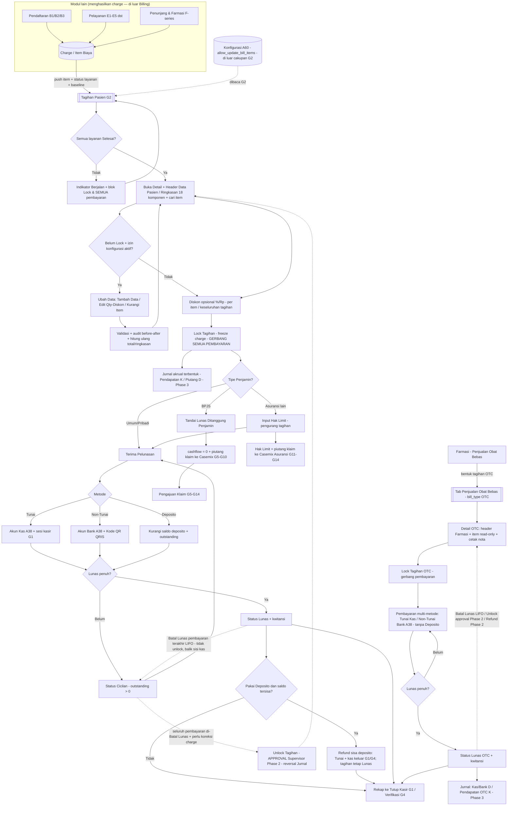

# PRD — Billing: Tagihan Pasien (G2)

**Related Document:** Related Feature: G2 Billing/Kasir > Billing > Tagihan Pasien. Sumber charge & referensi klinis: Pendaftaran/Admisi (B1/B2/B3), Pelayanan Utama (E1–E5 dst.), Penunjang & Farmasi (F-series). Master: A20 Tipe Penjamin, A38 Kas dan Bank, A43 Tarif Kamar, A58 Kelas, A59 Pengaturan Harga, G18 Paket Tarif, G21 Program Diskon, G22 Harga Jual Obat. Hilir: G1 Buka/Tutup Kasir, G3 Deposito/Wadiah Pasien, G4 Verifikasi Penerimaan Kas, G5–G10 Klaim BPJS, G11–G14 Klaim Asuransi Swasta.; A60 Pengaturan Tagihan Pasien v1.2
**Versi:** 5.5 — Pengubahan Data pra-Lock: Edit existing hanya Qty dan Diskon; Tambah Data memakai form lengkap; Catatan tampil di Rincian; diksi Komponen Casemix menjadi Jenis Pemeriksaan pada Rincian/Tambah Data. + 5.4 — Operator pada Detail Tagihan → Rincian Tagihan mendukung multi-tagging/multiple operator per item. + 5.3 — Parent-Child Billing untuk penagihan kolektif tanpa mencampur charge/casemix pasien; Detail Rincian dikelompokkan Unit → Tipe Pelayanan → konteks harga obat (penjamin/kelas). + 5.2 — OTC dipindah penuh ke PRD G2b: detail tab Penjualan Obat Bebas (FR-024, US-028..031, BR-031, §8.3.9, subgraph workflow, endpoint & discriminator bill_type=OTC) dikeluarkan dari G2 dan menjadi In Scope G2b. G2 kini murni Tagihan Pasien. + 5.1 — Klarifikasi: tab Deposito (G2a) = tampilan read-only; transaksi deposito (Top Up ber-metode/tujuan A38 + jurnal, pemakaian DEPOSITO, refund sisa) tetap scope G2. + v5.0 (pemekaran PRD anak G2a/G2b) + v4.9 (Top Up deposito ber-metode/tujuan A38 + jurnal) + v4.8
**Tanggal:** 21 Juli 2026

## 1. Metadata Dokumen

**Approval**

| PRD Approved By | Nama / Jabatan | Signature, Date |
|-----------------|----------------|-----------------|
| [1] | [PERLU KONFIRMASI] — Chief/Owner Produk | - |

**PIC**

| Nama | Role |
|------|------|
| [PERLU KONFIRMASI] | Product Owner |
| [PERLU KONFIRMASI] | System Analyst |

**Related Documents**
* **Modul Pendaftaran/Admisi** (B1 RJ, B2 RI, B3 IGD) — sumber *encounter*, penjamin, SEP/nomor kunjungan yang menjadi konteks tagihan; juga sumber **history perubahan kelas** (`encounter_class_change`) untuk Header Detail **Kelas Sebelumnya → Setelah** (FR-002 AC-5b).
* **Modul Pendaftaran — Data Sosial Pasien (D3)** — **sumber Data Sosial pasien** (read-only): endpoint D3 dipakai G2 untuk menampilkan **Data Sosial** pada Detail Tagihan (FR-002 AC-5c/§8.2).
* **Modul Pelayanan Utama & Penunjang** (E1–E5 dst., F-series Farmasi/Lab/Radiologi) — **sumber charge**: tiap tindakan/order/dispensing mendorong item biaya ke tagihan.
* **Entry Point Pembentukan Tagihan Pasien** (`example_prd/Entry Point Pembentukan Tagihan Pasien.xlsx`) — **daftar modul & pemicu (trigger)** yang memasukkan entry data ke Tagihan Pasien: Pendaftaran, Pelayanan RJ/IGD/VK/IBS(OK)/RI, Rehabilitasi Medis, Hemodialisa, **Laboratorium**, **Radiologi**, **Farmasi**, **Bank Darah**, Akomodasi Rawat Inap (termasuk **Naik Kelas BPJS**), Ambulance, Pemulasaraan Jenazah. Billing (G2) = **konsumen** charge & wajib **selalu sinkron** dengan modul-modul ini (BR-034/NFR-006).
* **Modul Farmasi — Penjualan Obat Bebas (OTC)** — **sumber data untuk tab sejawat OTC (G2b)**: penjualan obat bebas membentuk **tagihan OTC** (`bill_type=OTC`) yang dipetakan pada **tab Penjualan Obat Bebas / OTC** sebagai **child scope G2b**. Spesifikasi detail worklist/Detail/pembayaran/Lock/Unlock/Lunas/Batal Lunas/jurnal/cetak berada pada **PRD G2b** (FR-024/BR-031).
* **PRD G2a — Deposito Pasien (ANAK — tampilan read-only)** — PRD **anak** untuk **tab Deposito Pasien** yang bersifat **HANYA TAMPILAN read-only** (daftar pasien bersaldo deposito + data tagihan pasien yang memiliki nominal saldo deposito). **Seluruh transaksi deposito — Top Up saldo (FR-011 AC-1a/1b/1c), pemakaian saldo metode `DEPOSITO` (FR-011 AC-2..4/BR-013), dan Refund Sisa Deposito (FR-011 AC-5..7/BR-029) — adalah scope G2 (dokumen ini)**, diakses dari tab Tagihan Pasien; G2a hanya menampilkannya (FR-019 AC-6/BR-023).
* **PRD G2b — Penjualan Obat Bebas / OTC (ANAK)** — PRD **anak** yang memerinci **tab Penjualan Obat Bebas / OTC** sebagai **tab sejawat** pada workspace Kasir: worklist, Detail, pembayaran A38, Lock/Unlock, Batal Lunas LIFO, jurnal, dan cetak untuk tagihan `bill_type=OTC` dari Farmasi. G2 tetap memuat kerangka kerja & pola billing bersama; spesifikasi rinci → **G2b** (FR-024/BR-031/FR-019/BR-023).
* **Master Data — Tipe Penjamin (A20)** — klasifikasi pembayar (Umum/BPJS/Asuransi) yang menentukan alur penagihan.
* **Master Data — Kas dan Bank (A38)** — sumber **metode pembayaran & bank tujuan**; QRIS menampilkan Kode QR (`qris_code`).
* **Master Data — Tarif Layanan (A10)** — **master Item Pelayanan** (jasa/tindakan): sumber pilihan **Item Pelayanan** saat **Ubah Data/Tambah item** (FR-022 AC-4), pemasok `item_code`/`item_name`/`uom` (satuan)/**Jenis Pemeriksaan**/harga baseline, serta acuan pemetaan jenis pemeriksaan→COA (Phase 3).
* **Master Data — Barang (A3, A4, A5)** — **master item barang/farmasi/BMHP**: sumber pilihan **item barang** saat **Ubah Data/Tambah item** (FR-022 AC-4) untuk kategori barang, pemasok `item_code`/`item_name`/`uom`/**Jenis Pemeriksaan**/harga baseline (G22 utk obat), serta acuan pemetaan jenis pemeriksaan→COA (Phase 3).
* **Master Tarif & Harga** — A43 Tarif Kamar, A58 Kelas, A59 Pengaturan Harga, G18 Paket Tarif, G21 Program Diskon, G22 Harga Jual Obat.
* **Billing/Kasir hilir** — G1 Buka & Tutup Kasir, G3 Deposito/Wadiah Pasien, G4 Verifikasi Penerimaan Kas.
* **Casemix / Klaim** — G5–G10 (Klaim BPJS), G11–G14 (Klaim Asuransi Swasta) — penerima piutang klaim.
* **Pengaturan Tagihan — Section 1 (A60)** — **pemilik konfigurasi izin Pengubahan Data Tagihan** (mis. `allow_update_bill_items`, editor Manajer+A53, alasan/versi/audit konfigurasi). G2 **membaca & menegakkan** konfigurasi aktif; pengelolaannya **di luar cakupan G2**.

**Document Version**

| Tanggal | Versi | Deskripsi Perubahan |
|---------|-------|---------------------|
| 21 Juli 2026 | 5.5 | **Pengubahan Data Tagihan Pra-Lock diperjelas.** Untuk item yang sudah ada, aksi **Edit** hanya boleh mengubah kolom **Qty** dan **Diskon**; kolom lain tetap read-only/snapshot. Untuk **Tambah Data**, form wajib menyediakan input **Tanggal, Item Pelayanan, Jenis Pemeriksaan** (diksi pengganti **Komponen Casemix** pada tampilan Rincian/Tambah Data), **Operator** (opsional, mendukung multi-tagging), **Unit, Tipe Pelayanan, Kelas, Tipe Penjamin, Qty, Satuan, Harga, dan Catatan**. Field **Catatan** ditambahkan ke `bill_item` dan ditampilkan pada **Detail Tagihan → Rincian Tagihan**. |
| 21 Juli 2026 | 5.4 | **Multi-tagging Operator pada Detail Tagihan → Rincian Tagihan.** Kolom **Operator** dapat menampilkan **lebih dari satu operator** untuk satu item/tagihan, mis. dokter pengorder, perawat/petugas input, analis/radiografer/petugas pelaksana, atau operator koreksi Billing Manual. Ditambahkan aturan data `operator_ids`/`operator_tags`, filter Operator yang mencocokkan salah satu operator pada baris, serta UI Preview dengan badge multi-operator. |
| 21 Juli 2026 | 5.3 | **Parent-Child Billing kolektif (permintaan PO).** G2 mengakomodir relasi **parent-child tagihan** untuk kasus tagihan pendamping pasien, terutama **order menu makanan pendamping**, agar dapat **ditagihkan/dicetak kolektif** bersama tagihan pasien tanpa memasukkan item pendamping ke `bill_item` pasien dan tanpa mengganggu status/pending **Casemix** pasien. Ditambahkan **US-033, FR-017, BR-021**, model data `bill_relation` + `bill_payment_allocation`, API relasi kolektif, audit, serta aturan: parent dan child tetap tagihan terpisah, status/Lock/penjamin/casemix masing-masing tidak saling menimpa; pembayaran kolektif dialokasikan per bill. **Detail Tagihan → Rincian Tagihan** juga ditegaskan dikelompokkan **Unit → Tipe Pelayanan → konteks harga obat (Tipe Penjamin/Kelas)** sehingga item obat yang sama dengan penjamin/kelas berbeda tetap tampil sebagai baris/grup terpisah sesuai snapshot A59. UI Preview diperbarui. |
| 17 Juli 2026 | 5.1 | **Klarifikasi cakupan tab Deposito (permintaan PO).** Tab **Deposito Pasien (G2a) dipersempit menjadi HANYA TAMPILAN read-only**; **fitur Top Up saldo deposito, pemakaian saldo deposito untuk membayar tagihan, dan Refund Sisa Deposito ditegaskan sebagai SCOPE G2 (dokumen ini)** — bukan G2a. Tidak ada perubahan requirement G2 (transaksi deposito sudah dimiliki G2: FR-011 AC-1a/1b/1c untuk Top Up + metode/tujuan A38 + jurnal; FR-011 AC-2..4/BR-013 untuk pemakaian `DEPOSITO`; FR-011 AC-5..7/BR-029 untuk refund sisa). Diperbarui: tautan Related Documents G2a (jadi "tampilan read-only"). PRD G2a diselaraskan ke v2.0 (read-only). |
| 17 Juli 2026 | 5.0 | **Pemekaran PRD anak per tab.** Permintaan PO — tiap tab non-utama pada workspace Kasir dibuatkan **PRD terpisah (standalone)**, meskipun secara UI tetap satu halaman: **(1) PRD G2a — Deposito Pasien** (seluruh domain deposito: Top Up ber-metode/tujuan A38 + jurnal, pemakaian metode `DEPOSITO`, refund sisa Tunai, tab read-only); **(2) PRD G2b — Penjualan Obat Bebas / OTC** (penagihan `bill_type=OTC` dari Farmasi: worklist, Detail, pembayaran A38, Lock/Unlock, Batal Lunas LIFO, jurnal penerimaan, cetak). **G2 (dokumen ini) tetap utuh** sebagai induk — memuat ringkasan ketiga tab & titik akses aksi dari worklist; **spesifikasi rinci tab Deposito → G2a, tab OTC → G2b** (cross-reference dua arah). Ditambahkan tautan **Related Documents (+G2a, +G2b)**. Tab **Tagihan Pasien tetap didokumentasikan penuh di G2**. |
| 17 Juli 2026 | 4.9 | Permintaan PO — **Top Up Saldo Deposito kini merekam metode pembayaran & tujuan transaksi** (Kas / Bank BCA / Bank Mandiri sesuai **Master Data Kas dan Bank A38**) **seperti pembayaran tagihan**, dan **memicu Jurnal akuntansi**: **Kas/Bank (Debit, sesuai metode/akun A38) / Titipan Deposito Pasien (Kredit)** senilai nominal Top Up (liability titipan, bukan pendapatan; Top Up **bukan** metode `DEPOSITO` & tidak menyentuh `outstanding`). Diperbarui: **FR-011** (AC-1b metode/tujuan A38 + AC-1c jurnal), **BR-013** & **BR-020** (jurnal Top Up), **FR-016 AC-2** (trigger (e) Top Up pada Jurnal Terbentuk), **§8.2** API `POST /patients/{patientId}/deposit-topups`, **§8.1** tabel `deposit_topup` (metode/akun A38/jurnal/audit), asumsi. UI Preview: modal Top Up dengan pilihan metode + bank tujuan (A38) & entri Jurnal Top Up. |
| 16 Juli 2026 | 4.8 | Permintaan PO — enam penyesuaian pada workspace Kasir: **(1) Header Detail — Perubahan Kelas** (`Kelas Sebelumnya → Kelas Setelah Perubahan` + waktu efektif) bila ada kasus pindah kelas yang dieksekusi di **Pendaftaran**; read-only dari **history perubahan kelas** (`encounter_class_change`/A58) — **FR-002 AC-5b** + §8.3.4 (row `class_change_display`) + API `GET /bills/{id}/class-history` (BR-033). **(2) Akses Data Sosial** pasien (read-only) dari **Modul Pendaftaran — Data Sosial Pasien (D3)** — **FR-002 AC-5c** + §8.3.4 (row `social_data_access`) + API `GET /patients/{patientId}/social-data` + Related Documents (+D3). **(3) Cetak/Print per baris worklist** ditegaskan (Invoice Rekap/Rincian/Kwitansi diakses langsung dari baris) — **FR-001 AC-4** (reaffirm FR-013 AC-1). **(4) Kwitansi hanya setelah ada pembayaran** ditegaskan pada aksi cetak per baris — FR-001 AC-4 (reaffirm FR-013 AC-6/BR-017). **(5) Jurnal Terbentuk per baris worklist untuk SELURUH trigger** (Lock, Pembayaran, Unlock/reversal, Batal Lunas/reversal) — **FR-016 AC-2** + FR-001 AC-4 + API `/journal` diperluas (BR-020). **(6) Deposito**: **Top Up Saldo Deposito diakses per baris worklist** (tab Tagihan Pasien) — FR-011 AC-1a/FR-019 AC-6a; tab **Deposito Pasien (read-only)** kini **juga menampilkan data tagihan yang terkait saldo deposito** selain daftar pasien bersaldo — **FR-019 AC-6** + BR-013 + BR-023. |
| 16 Juli 2026 | 4.7 | Permintaan PO — enam penyesuaian: **(1) Biaya Selisih Naik Kelas BPJS** — **FR-025** + **BR-035** + **US-032** + field `is_class_upgrade`/`class_upgrade_diff`/`entitled_class_id`; bila pasien BPJS naik kelas rawat inap di atas hak kelas, selisih dihitung **sesuai aturan RS** sebagai bagian pasien (cashflow), hak kelas tetap ditanggung BPJS (tie-in FR-009 AC-3/BR-011). **(2) Mode cetak Invoice** — **FR-013 AC-7** + BR-017 + API `mode={1\|2}`: Mode 1 = rincian lengkap **+ tanggal transaksi**; Mode 2 = **hanya item tanpa tanggal**. **(3) Filter Dokter/DPJP/Operator** pada Detail Tagihan → Rincian — **FR-002 AC-6a** + §8.3.5 + API `?dpjp=&operator=`. **(4) Sinkronisasi wajib lintas-modul** (Farmasi, Lab, Radiologi, RJ, RI, Kamar Operasi) — **BR-034** diperluas (inbound+outbound) + **NFR-006**. **(5) Atomic transaction / rollback** seluruh proses pembayaran — **BR-036** + **NFR-005**. **(6) Pembulatan Dana Kebajikan DIKONFIRMASI tetap Rp 100** (BR-032, hapus [PERLU KONFIRMASI]). Selain PRD: file **`example_prd/Entry Point Pembentukan Tagihan Pasien.xlsx`** dilengkapi (tambah Laboratorium, Radiologi, Bank Darah, Akomodasi/Kamar harian, Naik Kelas BPJS + catatan sinkronisasi) & dirujuk pada Related Documents/BR-034. Preview: dialog mode cetak + filter DPJP/Operator pada Rincian. |
| 16 Juli 2026 | 4.6 | Permintaan PO — tiga penyesuaian: **(1) Audit trail komprehensif** (**BR-015** diperluas + **NFR-002** + tabel baru **`audit_log`**) untuk seluruh aktivitas kritikal: penambahan/perubahan/penghapusan tarif-item, perubahan diskon, pembayaran, pembatalan pembayaran, transaksi deposit (top-up/pakai/refund), dan lock/unlock billing — append-only & immutable dengan actor/role/waktu/sesi/alasan/before-after/ref-sumber. **(2) Pencarian pada Detail Tagihan** diperkuat (**FR-002 AC-6** + API): pencarian **lintas seluruh kolom Rincian** (Tanggal, Item, Casemix, Operator, Satuan, Tipe Pelayanan/Kelas, sumber) sebagai filter tampilan; total/Ringkasan/Dana Kebajikan tetap atas seluruh item. **(3) Dana Kebajikan DIKONFIRMASI** (BR-032): pembulatan ke atas Rp100 dihitung **SETELAH diskon** (atas `subtotal_net`) dan **HANYA untuk Tipe Penjamin = Umum**; BPJS/Asuransi/Pribadi = Rp0 (tanpa pembulatan) — diperbarui field `subtotal_rounded`/`benevolence_amount`, FR-002 AC-5a, §8.3.4, case-row, open-question. Ditambahkan definisi **BR-031** (OTC) yang sebelumnya hanya dirujuk. Preview diperbarui & lolos uji. |
| 16 Juli 2026 | 4.5 | Permintaan PO — lima penyesuaian: **(1) Dana Kebajikan** pada Header Detail Tagihan = akumulasi **selisih pembulatan harga item KE ATAS ke kelipatan Rp 100** (mis. Rp 10.002→Rp 10.100, Rp 1.505→Rp 1.600) — ditambah **BR-032**, field `benevolence_amount`/`unit_price_rounded` (`bill_item`) & `benevolence_fund`/`total_amount_rounded` (`bill`), FR-002 AC-5a, §8.3.4. **(2) Perubahan Kelas** diperlakukan **analog Perubahan Tipe Penjamin** (snapshot prospektif per charge, tanpa re-pricing retroaktif) — **BR-033**, FR-023 (rename + AC-1b), field snapshot Kelas pada `bill_item`, tabel `encounter_class_change` + API `/class-changes`·`/class-groups`, Kelas jadi variabel konteks harga A59. **(3) Rekonsiliasi Ubah Data ke entry point** — **BR-034**, FR-022 AC-11, event outbound `bill-item-changed` + API `/reconciliation` + rekomendasi sinkronisasi (event/provenance/konflik/laporan/idempotent). **(4) Tab OTC**: worklist tambah kolom **Jenis Kelamin** & **Usia** (dari input Farmasi) — FR-024 AC-1, §8.3.9, field `buyer_gender`/`buyer_age`. **(5) Ubah Data** item juga dari **Master Barang (A3/A4/A5)** selain A10 [DIKONFIRMASI PO] — FR-022 AC-4, §8.3.8, field `item_master_id`/`item_master_source`, API `/item-masters`, Related Documents. Ditambahkan pula definisi **BR-031** (OTC) yang sebelumnya hanya dirujuk. Preview diperbarui. |
| 16 Juli 2026 | 4.4 | Permintaan PO — dua penyesuaian: **(1) Spesifikasi Data Rincian Tagihan** (tabel item pada Detail Tagihan) ditetapkan dengan kolom: **Tanggal** (tanggal pelaksanaan layanan/obat dikonfirmasi — field baru `service_date`), **Item Pelayanan + Komponen Casemix**, **Operator** (user yang order/input layanan — field baru `operator_name`/`ordered_by`), **Qty**, **Satuan** (field baru `uom`), **Harga**, **Sub Total**. Ditambah **§8.3.5** baru (§8.3.5–8.3.8 lama digeser menjadi §8.3.6–8.3.9), field pada `bill_item`, dan FR-002 AC-1 diselaraskan. **(2) Ubah Data — Item Pelayanan dipilih dari Master Tarif Layanan (A10)**: lookup `service_tariff_id` (auto-isi item/uom/komponen/harga baseline) — FR-022 AC-4, §8.3.8, API `GET /service-tariffs`, `POST /bills/{id}/items` (body `service_tariff_id`), field `service_tariff_id` pada `bill_item`, dan A10 ditambahkan ke Related Documents sebagai master Item Pelayanan. |
| 16 Juli 2026 | 4.3 | Permintaan PO — **Tab Penjualan Obat Bebas (OTC) menjadi in-scope G2** (sebelumnya di-defer ke PRD F19). Penjualan obat bebas pada modul Farmasi **membentuk tagihan OTC** (`bill_type=OTC`) yang masuk ke tab Penjualan Obat Bebas. Fitur tab OTC: **daftar tagihan, Detail tagihan, pembayaran multi-metode** (samakan dg Tagihan Pasien — Tunai/Non-Tunai A38, tanpa Deposito), **Lock → Unlock**, **Lunas → Batal Lunas** (LIFO), **Jurnal** (Phase 3), **refund** (Phase 2), **cetak/print**; OTC tanpa charge klinis/encounter, penjamin/klaim, maupun deposito. Ditambah **FR-024**, **US-028–031**, **BR-031**, kolom `bill_type` pada `bill`, **§8.3.8** (spesifikasi data OTC), API `/bills?bill_type=OTC` & `/bills/otc`, baris Scope OTC, Related Documents (+Farmasi OTC); diperbarui FR-019 (AC-1/2/7), BR-023, Overview, flowchart/narasi §9, serta asumsi terkait. Preview: tab ke-3 Penjualan Obat Bebas. |
| 16 Juli 2026 | 4.2 | Permintaan PO — dua penyesuaian: **(1) Daftar Tagihan/Worklist**: tambah **kolom Nama Dokter DPJP** (bersumber modul Pelayanan/encounter, field `dpjp_doctor`) dan **filter Unit** (navigasi/penyaringan tampilan — **bukan** variabel harga; harga/grouping tetap memakai Tipe Pelayanan). Diperbarui FR-001 (AC-1/AC-2), §8.3.2, tabel Scope, `/bills` API, serta rekonsiliasi keputusan "Unit bukan variabel". **(2) Pengaturan Tagihan Pasien**: **pengelolaan/konfigurasi** izin Pengubahan Data **dipindahkan ke Out-of-Scope** — menjadi tanggung jawab **PRD Pengaturan Tagihan — Section 1 (A60)**; **in-scope G2 hanya eksekusi Pengubahan Data** (Ubah Data / tambah item / kurangi item) yang membaca & menegakkan konfigurasi A60. Diperbarui: FR-022 (retitle + AC-1 dependensi A60, hapus AC editor), US-022 dipindah ke A60, BR-007/BR-028, §8.1 tabel `patient_billing_setting` (jadi referensi A60), §8.3.7 (retitle + buang field konfigurasi), API config (PUT dihapus, GET read-only A60), Out-of-Scope #8 baru, Related Documents (+A60), flowchart & narasi §9, serta scope/asumsi terkait. |
| 16 Juli 2026 | 4.1 | Klarifikasi PO atas perilaku tab deposito: **Aksi Top Up Saldo Deposito (dan pembayaran metode Deposito) diakses pada tab Tagihan Pasien**, **tidak** pada tab **Deposito Pasien**. Tab **Deposito Pasien** kini bersifat **read-only** — **hanya menampilkan daftar pasien yang memiliki saldo deposito beserta nominal saldo**-nya (tanpa aksi transaksi). Diperbarui: FR-019 (AC-6 + AC-6a baru), FR-011 (AC-1a baru), BR-013, BR-023, tabel Scope, §5 (baris G3 + catatan tab sejawat), narasi §9, serta asumsi/pertanyaan-terbuka terkait. UI Preview disesuaikan. |
| 16 Juli 2026 | 4.0 | Penyesuaian atas permintaan PO: **Fitur Merge & Unmerge Tagihan DIHAPUS** — penggabungan tagihan pasien (parent–child), termasuk pengecualian **bayi baru lahir → ibu**, **tidak dibutuhkan**. Seluruh referensi dihapus: **FR-017, US-016, US-017, BR-021**; field `parent_bill_id`/`is_merge_parent`/`merge_group_id`/`merge_type`/`bill_relation`; enum `MERGED_CHILD`/`NEWBORN_MOTHER`/`SAME_PATIENT`; endpoint `/bills/merge` & `/bills/{parentId}/unmerge`; §8.3.6 (Relasi Tagihan/Merge) dihapus & §8.3.7 (Harga per Tipe Pelayanan) menjadi §8.3.6; baris scope/state-machine/case anti-fraud (#14/#15)/flowchart/alur/asumsi/pertanyaan-terbuka terkait Merge dihapus; UI Preview tidak memuat aksi Merge/Unmerge. |
| 15 Juli 2026 | 3.1 | Penegasan PO: **Unit bukan variabel pada G2**. Variabel bisnis untuk harga A59, snapshot charge, filter, dan pengelompokan Detail adalah **Tipe Pelayanan** (`RJ`/`RI`/`IGD`/`PENUNJANG`). `Unit/Ruang` hanya informasi lokasi encounter/traceability dan tidak memengaruhi harga atau konfigurasi. Field konteks harga disederhanakan menjadi `service_type`; tidak ada field Unit yang digunakan sebagai variabel. Seluruh contoh “beda harga antar-unit” direvisi menjadi “beda harga antar-Tipe Pelayanan”. |
| 15 Juli 2026 | 3.0 | Konfirmasi user: setelah tagihan **Lunas** dengan pembayaran `DEPOSITO`, sisa saldo deposito yang masih ada dapat dikembalikan **Tunai** oleh Kasir pada **Phase 1 tanpa approval**. Aksi wajib sesi G1 OPEN, validasi saldo/idempotensi atomik, kuitansi dan audit; dicatat sebagai kas keluar G1/G4, serta **bukan Batal Lunas** (FR-011 AC5–7, BR-029). |
| 15 Juli 2026 | 2.9 | Penambahan awal Pengaturan Tagihan Pasien: toggle Ubah Data (tambah/kurangi item tagihan) charge seluruh pelayanan; perubahan charge Kasir hanya sebelum Lock, alasan wajib, dan audit append-only. |
| 13 Juli 2026 | 2.8 | Penambahan atas permintaan PO: **Penanganan harga item per Tipe Pelayanan** — mengakomodir **item (obat) yang sama berharga berbeda antar-Tipe Pelayanan** sesuai **Pengaturan Harga (A59)** (mis. **Paracetamol 500mg** Rp 10.000 **Rawat Jalan** vs Rp 12.000 **Rawat Inap** setelah pasien dirawat inapkan). Ditetapkan **BR-027** (harga di-*snapshot* per charge oleh modul asal saat dispensing sesuai konteks Tipe Pelayanan; item sama pada Tipe Pelayanan berbeda = **baris `bill_item` terpisah**; **tanpa re-pricing retroaktif** & tanpa peleburan), **FR-002 AC 8** (Detail Tagihan mengelompokkan per Tipe Pelayanan + Harga Satuan), field `care_context`/`service_type`/`price_rule_ref`/`charged_at` pada `bill_item` (§8.1/§8.3.6), spesifikasi §8.3.6, anti-fraud #20, serta contoh pada UI Preview. |
| 13 Juli 2026 | 2.7 | Penyesuaian atas permintaan PO: **(1) Fitur Split Tagihan DIHAPUS** — pemecahan item ke tagihan baru (FR-018/BR-022/US-018) **tidak dibutuhkan**; seluruh referensi (FR-018, BR-022, US-018, field `split_from_bill_id`, enum `bill_relation=SPLIT`, endpoint `/bills/{id}/split`, baris scope/state-machine/case/flowchart terkait) dihapus. **(2) Penegasan konsep Merge Tagihan** — Merge = relasi **parent–child** antar-**tagihan berbeda** (satu jadi **parent**, lainnya **child**), **BUKAN** peleburan seluruh item menjadi satu tagihan; **informasi umum tiap tagihan tetap terjaga utuh** & dapat ditelusuri, parent hanya **mengagregasi** total/sisa untuk penagihan terpadu (FR-017/BR-021). |
| 10 Juli 2026 | 2.6 | Penyesuaian atas permintaan PO: **Tab Penjualan Obat Bebas (F19) diperluas** menjadi workspace serupa Tagihan Pasien (FR-019 AC7/BR-023) — **Detail** transaksi dengan **informasi header bersumber Pelayanan Farmasi → Penjualan Obat Bebas** (No. Nota, Tgl/Jam, Petugas Farmasi, Pembeli, Unit/Apotek, No. Antrian); **Lock Tagihan → Unlock Tagihan** (Unlock ber-approval, hanya setelah Batal Bayar); **Bayar → Batal Bayar**; **Jurnal** (Kas/Bank D / Pendapatan Penjualan OTC K, dibalik saat Batal Bayar); kwitansi. Preview G2 tab OTC dibangun sesuai. |
| 10 Juli 2026 | 2.5 | Konfirmasi PO: (1) **Cakupan tab workspace Kasir** (FR-019/BR-023) — **Deposito (G3)** = tab **navigasi** daftar pasien yang telah top-up + **saldo deposito**, yang **dipakai di Tagihan Pasien** untuk pembayaran metode Deposito; **Penjualan Obat Bebas (F19)** = tab **tempat pembayaran OTC** yang **memerlukan fitur serupa tab Tagihan Pasien** (worklist, Terima Pembayaran, Jurnal, kwitansi) tanpa alur charge klinis/Lock. (2) **Flag 'Cicilan?' pada pembayaran DIHAPUS** — sistem **otomatis** mendeteksi cicilan bila **nominal bayar < sisa tagihan** (`is_installment` diturunkan sistem) — BR-009, §8.3.1, FR-009 AC1. |
| 10 Juli 2026 | 2.4 | **Konfirmasi PO** atas 8 pertanyaan terbuka (jadi keputusan): (1) 18 komponen casemix **mengikuti Juknis INA-CBG**, pemilik pemetaan = **Casemix** (§8.3.3); (2) kanal **non-tunai dicatat manual** Kasir + **diverifikasi G4** (BR-008); (3) **refund ditangani di G2 (Phase 2)**; pembatalan pembayaran = **Batal Lunas** (FR-014); (4) **diskon hanya atas bagian pasien** (bukan bagian ditanggung) — BR-016; (5) **Batal Lunas non-tunai mengembalikan uang TUNAI** — jurnal **Kas (Kredit) / Piutang Pasien (Debit)** (FR-014 AC5/BR-018/BR-020); (6) pemetaan **komponen→COA** dari master **Tarif Layanan (A10)** & **Barang (A3/A4/A5)** — FR-016/BR-020; (7) **Merge penjamin campuran diizinkan** — pasien membayar **hanya yang tidak ditanggung**, sisanya piutang klaim per child (BR-021); (8) **Split wajib Tipe Penjamin identik** dengan asal (BR-022). |
| 10 Juli 2026 | 2.3 | Penyesuaian atas permintaan PO: **(1) Status Layanan per alur** (BR-026/FR-001) — indikator status tagihan menampilkan progres **Pelayanan** (Pendaftaran→Pemulangan), **Lab** (order→selesai), **Radiologi** (order→selesai), **Farmasi** (order resep→selesai pembuatan); **(2) Jurnal saat bayar** (BR-020) — tiap pembayaran memicu jurnal penyelesaian **Kas/Bank/Deposito (Debit) / Piutang Pasien (Kredit)** sesuai metode; **(3) Pembayaran Deposito** dipertegas (butuh saldo, mengurangi saldo G3) — FR-011/BR-013. |
| 9 Juli 2026 | 2.2 | Penyesuaian atas permintaan PO: **(1) Pembayaran & penyelesaian hanya SETELAH Lock** — seluruh pembayaran (termasuk **uang muka & cicilan**) dan penandaan **Lunas Ditanggung Penjamin (BPJS)** hanya boleh bila tagihan **sudah di-Lock** (`is_locked=true`); **izin uang muka/cicilan pra-Lock DIHAPUS** (mengubah BR-003/BR-009/BR-019, FR-005/006/007/009/010/011/020 AC, state machine, API). **(2) Skema Unlock Tagihan (baru, FR-021/BR-025)** — membuka kembali tagihan terkunci untuk koreksi charge; **perlu approval berjenjang** (Phase 2) & **hanya setelah Batal Lunas** (seluruh pembayaran dibatalkan → `total_paid=0`); memicu **reversal Jurnal** (Phase 3). Sifat Lock "freeze permanen tanpa unlock" (v1.3/1.4) **diganti** menjadi freeze dg jalur Unlock terkendali. |
| 8 Juli 2026 | 1.0 | Pembuatan awal dokumen. Menetapkan Tagihan Pasien sebagai **layar agregasi & penagihan** (read-only terhadap operasi klinis), indikator status layanan, Detail vs Ringkasan (18 komponen casemix), pembayaran tunai/non-tunai + bank tujuan (A38), cicilan, dan mekanisme penjamin BPJS (lunas tanpa cashflow). |
| 8 Juli 2026 | 1.1 | Penambahan atas permintaan PO: (1) **Input Diskon** berjenis **Persentase (%)** atau **Nominal (Rp)**, dapat diterapkan **per item** & **keseluruhan tagihan** di **Phase 1 tanpa approval** (tercatat audit) — FR-012/BR-016; (2) **Header Data Pasien** pada Detail Tagihan (No. RM, Nama, Unit, Tgl Masuk/Keluar, Kelas, Dokter DPJP, No. Kartu, Tgl Lahir, No. Pendaftaran) — §8.3.4; (3) **Pencarian item tagihan** pada Detail Tagihan. |
| 9 Juli 2026 | 1.9 | Penyesuaian atas permintaan PO: **Alur penagihan per Tipe Penjamin (A20) dipertegas** — **Umum diperlakukan identik dengan Pribadi** (dibayar penuh oleh pasien); **BPJS** dapat **dilunasi tanpa arus kas masuk** (Lunas Ditanggung Penjamin); **Asuransi selain Umum/Pribadi & BPJS** memakai **input Hak Limit** (nominal ditanggung asuransi) sebagai **pengurang tagihan**, dengan **sisa tagihan** dibayar melalui proses pembayaran biasa dan Hak Limit menjadi **piutang klaim** (G11–G14). Menambah FR-020, BR-024, US-020, field `guarantor_limit`, form Hak Limit, API `/guarantor-limit`, flowchart & open questions. |
| 9 Juli 2026 | 1.8 | Penyesuaian atas permintaan PO: **Batas tanggung jawab G2 ⟷ G3 dipertegas** — **Deposito Pasien (G3) hanya menerima top-up** saldo; **pembayaran tagihan menggunakan saldo deposito dilakukan di G2** melalui metode pembayaran `DEPOSITO` (pembayaran non-kas internal; mengurangi `outstanding_balance` tagihan **dan** saldo deposito G3). Status FR-011/BR-013 dinaikkan dari **[ASUMSI]** menjadi **keputusan**; pemakaian deposito ditegaskan sebagai fungsi **G2**. |
| 9 Juli 2026 | 1.6 | Penyesuaian atas permintaan PO: **Input diskon** (item & keseluruhan) dilakukan **langsung pada Layar Pembayaran** — **tanpa layar/modal terpisah** (§8.3.1/§8.3.5, FR-012 AC 2); **alasan diskon dihapus** (bukan input wajib/opsional) — field `discount_reason` dan referensi audit alasan dihapus (§8.3.5, FR-012 AC 5, BR-015/016). *(Lokasi input direvisi pada v2.0.)* |
| 9 Juli 2026 | 2.1 | Konfirmasi PO atas [PERLU KONFIRMASI] BR-024: **Hak Limit (Asuransi) = input manual Kasir** — Phase 1 **tanpa approval** (wajib audit trail), **tidak** divalidasi otomatis terhadap plafon polis/master asuransi; **validasi otomatis plafon polis = kandidat Phase 2** (opsional). (FR-020 AC 6 / BR-024). |
| 9 Juli 2026 | 2.0 | Penyesuaian atas permintaan PO (revisi v1.6): **Input diskon dipindah dari layar Pembayaran ke layar Detail Tagihan** (FR-002) — diskon **per item** (kolom Diskon pada tabel item) & **keseluruhan tagihan** (pada ringkasan/total), Persentase/Nominal, **tanpa layar/modal terpisah** & **tanpa alasan**; **tidak** lagi pada layar Pembayaran (FR-002 AC 7, FR-012 AC 2, §8.3.5, BR-016). |
| 9 Juli 2026 | 1.7 | Penyesuaian atas permintaan PO: **Merge lintas-pasien bayi baru lahir → ibu** — tagihan **bayi baru lahir** dapat digabung ke tagihan **ibunya** meski `patient_id` berbeda, sepanjang **relasi bayi–ibu tervalidasi** dari Pendaftaran; parent = **tagihan ibu**, tagihan bayi = **child** (identitas & penjamin tetap terpisah/utuh, piutang klaim per child), ditandai `merge_type=NEWBORN_MOTHER`. Menambah field `merge_type` (§8.3.6/model data), AC 1b (FR-017), penyesuaian API `/bills/merge`, BR-021, anti-fraud #14, flowchart & open questions. |
| 8 Juli 2026 | 1.2 | Penambahan atas permintaan PO: (1) **No. Pendaftaran** disertakan pada kolom **No. Tagihan** di worklist (sumber: modul Pendaftaran); (2) Fitur **Cetak / Export PDF** — **Invoice Rekap**, **Invoice Rincian**, dan **Kwitansi** — dapat **diunduh (.pdf)** maupun **dicetak**, diakses dari **Detail Tagihan** maupun **tiap baris worklist** (FR-013/BR-017). |
| 8 Juli 2026 | 1.3 | Penambahan atas permintaan PO: (1) **Batal Lunas** — pembatalan pembayaran, termasuk salah satu **angsuran** pada cicilan; **Phase 1 tanpa approval** (wajib alasan + audit) — FR-014/BR-018; (2) **Lock Tagihan** — mengunci/freeze tagihan (tak ada input charge apa pun dari modul pelayanan) dengan syarat **seluruh layanan Selesai**; bersifat **permanen** — FR-015/BR-019; (3) **Jurnal** otomatis yang terbentuk saat Lock, **ditampilkan per tagihan** di dashboard (**Phase 3**) — FR-016/BR-020. |
| 8 Juli 2026 | 1.4 | Perubahan alur atas permintaan PO: **Lock Tagihan menjadi prasyarat pelunasan/settlement penuh** — tagihan wajib **di-Lock** sebelum dapat berstatus **Lunas / Lunas (Ditanggung Penjamin)** (FR-015/BR-019); **uang muka & cicilan interim tetap boleh sebelum Lock** (FR-007/BR-009); **Batal Lunas kini diperbolehkan pasca-Lock** dan hanya membalik sisi kas — tidak lagi diblokir oleh Lock (FR-014/BR-018); **Jurnal Phase 3 = akrual** — Lock memicu pengakuan pendapatan (Pendapatan K / Piutang Pasien D), tiap pembayaran memposting Kas/Bank D / Piutang K (FR-016/BR-020). |
| 9 Juli 2026 | 1.5 | Penambahan atas permintaan PO: (1) **Batal Lunas dipertegas** — hanya **pembayaran terakhir** (urutan **LIFO**) yang dapat dibatalkan, dan Batal Lunas **TIDAK meng-unlock** tagihan (`is_locked` tetap `true`; hanya membalik sisi kas) — FR-014/BR-018; (2) **Merge Tagihan** — menggabungkan **≥2 tagihan pasien yang sama** menjadi satu tagihan **parent** untuk penagihan/pembayaran terpadu, sementara tiap tagihan asal tetap tersimpan sebagai **child** dengan informasi per-tagihan utuh, plus **Unmerge** untuk mengembalikan ke kondisi semula — FR-017/BR-021; (3) **Split Tagihan** — memecah **item** sebuah tagihan ke tagihan baru sementara **header/informasi umum (pasien, encounter, penjamin, kelas) tetap sama** — FR-018/BR-022; (4) **Pemisahan Tab** pada workspace Kasir menjadi **Tagihan Pasien (G2)**, **Deposito (G3)**, dan **Penjualan Obat Bebas (F19)** — FR-019/BR-023. |
| 15 Juli 2026 | 3.2 | Penambahan kasus perubahan Tipe Penjamin yang dieksekusi di Pendaftaran/Pelayanan. G2 menerima event old/new dan effective_at; setiap item obat menyimpan snapshot penjamin saat charge. Item sebelum perubahan tetap pada Penjamin Sebelumnya, item sesudah perubahan memakai Penjamin Setelah Perubahan. Keduanya dipisahkan sebagai grup dalam satu bill/encounter dengan subtotal, coverage, klaim, dan audit masing-masing; tidak ada reklasifikasi/re-pricing retroaktif (FR-023/BR-030). |
| 15 Juli 2026 | 3.3 | Konfirmasi A60: konfigurasi pertama seluruh toggle **nonaktif**; hanya role **Manajer ke atas** dengan permission eksplisit A53 yang mengubah A60; **alasan konfigurasi wajib Phase 1**; A60 tidak menetapkan limit qty/nominal maupun pengecualian kategori pelayanan. Kasir hanya menjalankan aksi G2 yang diizinkan konfigurasi aktif sebelum Lock. |

## 2. Overview & Background

**Overview / Brief Summary**

**Tagihan Pasien (G2)** adalah layar kerja utama **Kasir Rumah Sakit** pada modul **Billing/Kasir**. Fitur ini **mengagregasi seluruh biaya** yang timbul dari perjalanan pelayanan seorang pasien — mulai dari pendaftaran, tindakan, pemeriksaan penunjang, hingga obat & BMHP — menjadi **satu tagihan** yang siap ditagihkan dan dibayar.

Prinsip arsitektur yang WAJIB dipegang: **charge klinis tetap berasal dari modul pelayanan dan selalu traceable**, sedangkan **nilai charge Billing sebelum Lock dapat dikoreksi langsung oleh Kasir** sesuai **Pengaturan → Pengaturan Tagihan Pasien**. Konfigurasi ini berlaku untuk **seluruh pelayanan** dan mengatur kemampuan **Tambah Data, Edit terbatas, dan Kurangi item tagihan melalui Ubah Data**. Untuk item yang sudah ada, **Edit hanya boleh mengubah Qty dan Diskon**; kolom lain tetap snapshot/read-only. Untuk **Tambah Data**, Kasir mengisi kolom lengkap item tagihan termasuk Catatan yang tampil di Rincian. Perubahan di G2 hanya mengubah data penagihan (`bill_item`) dan **tidak mengubah rekam klinis/order/dispensing pada modul asal**; nilai sumber tetap disimpan sebagai baseline, alasan/catatan perubahan dan audit before/after tidak dapat dihapus. Setelah Lock, seluruh perubahan charge diblokir dan koreksi hanya melalui Batal Lunas lalu Unlock ber-approval.

G2 menyajikan tagihan dalam dua sudut pandang: **(a) Detail Tagihan** — daftar item granular yang tertaut ke dokumen/modul asalnya (traceable); dan **(b) Ringkasan Tagihan** — rekap nilai yang dikelompokkan ke dalam **18 komponen tarif casemix**. Pembayaran diakomodir secara **tunai maupun non-tunai** dengan **bank tujuan** yang diambil dari Master Data Kas dan Bank (**A38**), mendukung **cicilan**, serta menangani skenario **penjamin BPJS** di mana tagihan dinyatakan **lunas namun tanpa arus kas masuk** ke RS (nominal menjadi **piutang klaim**).

Untuk kebutuhan penagihan kolektif tanpa mencampur konteks klinis, G2 menyediakan **Parent-Child Billing**. Contoh utama: pendamping pasien memesan **menu makanan**. Tagihan pendamping tidak boleh dimasukkan ke tagihan pasien karena dapat mengganggu proses/pending Casemix pasien, tetapi tetap perlu ditagihkan dalam satu proses administrasi. Dengan Parent-Child Billing, tagihan pasien menjadi **parent**, tagihan pendamping menjadi **child**, keduanya tetap berdiri sendiri secara status, item, penjamin, audit, Casemix, dan jurnal; UI hanya menampilkan agregasi kolektif untuk cetak dan pembayaran teralokasi.

**Business Process (As-Is vs To-Be)**

* **As-Is (manual / masalah saat ini)** *(sebagian [ASUMSI], diturunkan dari kondisi umum RS Tipe C & D)*:
    * Kasir **merekap manual** biaya dari berbagai unit (nota poli, resep apotek, hasil lab/radiologi, lembar tindakan, karcis kamar) → lambat, rawan **item terlewat/dobel**.
    * Tidak ada **indikator apakah layanan pasien sudah selesai** → tagihan difinalisasi padahal masih ada tindakan/obat berjalan (khusus rawat inap).
    * Rekap ke **komponen tarif casemix** dihitung terpisah → menyulitkan verifikasi klaim BPJS.
    * Metode & tujuan setoran pembayaran tidak terstandar → **rekonsiliasi kas/bank** sulit, penerimaan tunai per kasir tidak terlacak.
    * **Cicilan** dan **piutang penjamin BPJS** dicatat di buku/berkas terpisah → saldo pasien tidak real-time.

* **To-Be (solusi digital yang diusulkan)**:
    * **Agregasi otomatis** — setiap charge dari modul pelayanan/penunjang/farmasi otomatis masuk ke tagihan pasien terkait (per *encounter*/kunjungan), lengkap dengan traceability ke dokumen sumber.
    * **Pengubahan Data Tagihan pra-Lock (Phase 1)** — saat tagihan **belum Lock**, Kasir dapat menjalankan aksi **Ubah Data / Tambah Data / Kurangi Item** **sesuai konfigurasi izin yang ditetapkan pada PRD Pengaturan Tagihan — Section 1 (A60)**; **layar & pengelolaan konfigurasi itu sendiri berada di luar cakupan G2** (milik A60). G2 hanya **membaca & menegakkan** konfigurasi aktif. Untuk item yang sudah ada, **Edit hanya mengakomodir Qty dan Diskon**; untuk **Tambah Data**, Kasir mengisi Tanggal, Item Pelayanan, **Jenis Pemeriksaan**, Operator opsional, Unit, Tipe Pelayanan, Kelas, Tipe Penjamin, Qty, Satuan, Harga, dan Catatan. Setiap perubahan charge menyimpan nilai original dan efektif, menghitung ulang total/ringkasan/penjamin, serta tercatat audit append-only. Item baru Kasir diberi sumber `BILLING_MANUAL`; perubahan tidak memutakhirkan data klinis pada modul asal. Validasi integritas charge tetap berlaku.
    * **Harga tersnapshot per Tipe Pelayanan (beda Tipe Pelayanan → harga sesuai A59)** — nilai jual tiap charge (mis. obat) **dikunci saat dispensing** oleh modul asal sesuai **Pengaturan Harga (A59)** pada konteks **Tipe Pelayanan** yang berlaku saat itu. Bila obat yang sama diberikan pada Tipe Pelayanan berbeda — mis. **Paracetamol 500mg Rp 10.000** ketika pasien di **Rawat Jalan**, lalu **Rp 12.000** setelah pasien **dirawat inapkan** (Rawat Inap) — G2 menerima **dua baris charge terpisah** dengan harga masing-masing, **tanpa menghitung ulang & tanpa melebur** baris (BR-001/BR-005/BR-027).
    * **Indikator status layanan** — Kasir melihat badge **Berjalan/Selesai** per layanan; **finalisasi tagihan** dikendalikan oleh kelengkapan layanan (BR-003).
    * **Detail & Ringkasan** — satu klik beralih antara item granular dan **Ringkasan 18 komponen tarif casemix**.
    * **Pembayaran terstandar** — pilih **metode & bank tujuan dari A38**; tunai → akun Kas, non-tunai → akun Bank; QRIS menampilkan Kode QR. Setiap penerimaan tertaut ke **sesi kasir aktif** (G1).
    * **Cicilan & saldo real-time** — **seluruh pembayaran (uang muka/cicilan/pelunasan) hanya dapat dilakukan setelah tagihan di-Lock**; pembayaran parsial menurunkan sisa, status **Lunas** saat `outstanding = 0` (BR-009/BR-019).
    * **Diskon fleksibel** — Kasir dapat menginput **diskon Persentase (%) atau Nominal (Rp)** pada item tertentu maupun keseluruhan tagihan; `outstanding` diperbarui real-time dan tercatat di audit (Phase 1, tanpa approval — FR-012/BR-016).
    * **Header Data Pasien & pencarian item** — Detail Tagihan menampilkan **identitas pasien** (No. RM, Nama, Unit, Tgl Masuk/Keluar, Kelas, Dokter DPJP, No. Kartu, Tgl Lahir, No. Pendaftaran) dan **kolom pencarian** untuk menyaring item saat jumlahnya banyak. Worklist juga menautkan **No. Pendaftaran** (dari modul Pendaftaran) pada kolom No. Tagihan.
    * **Perubahan Kelas & Data Sosial pada Header** — bila pasien **pindah kelas** selama encounter, Header Detail menampilkan **Kelas Sebelumnya → Kelas Setelah Perubahan** (read-only dari **history perubahan kelas Pendaftaran**); tersedia pula akses **Lihat Data Sosial** pasien dari **Pendaftaran — Data Sosial Pasien (D3)** (FR-002 AC-5b/5c).
    * **Cetak / Export PDF** — dokumen **Invoice Rekap**, **Invoice Rincian**, dan **Kwitansi** dapat **diunduh (.pdf)** atau **dicetak** langsung, diakses dari Detail Tagihan maupun tiap baris worklist (FR-013).
    * **Batal Lunas** — Kasir dapat **membatalkan pembayaran terakhir** yang sudah tercatat (transaksi/angsuran paling akhir yang masih `success`); pembatalan mengikuti urutan **LIFO** — untuk membatalkan angsuran sebelumnya, batalkan pembayaran **terakhir** lebih dulu agar riwayat tidak berlubang. Sisa tagihan dipulihkan & penerimaan sesi kasir dikoreksi. **Batal Lunas TIDAK meng-unlock tagihan** — `is_locked` tetap `true` (Lock membekukan **charge** secara permanen, terpisah dari transaksi pembayaran); pasca-Lock, void **hanya membalik sisi kas** (tidak mengubah charge/pengakuan pendapatan yang sudah final) (Phase 1, tanpa approval, wajib alasan + audit — FR-014/BR-018).
    * **Lock Tagihan (freeze) — gerbang pembayaran** — setelah **seluruh layanan Selesai**, Kasir **mengunci** tagihan: nilai tagihan menjadi **final** & **tidak ada charge baru** yang dapat masuk dari modul pelayanan mana pun. **Lock adalah prasyarat SELURUH pembayaran & penyelesaian** — tagihan **wajib di-Lock sebelum** menerima pembayaran apa pun/ditandai Lunas. Charge di-**freeze**; pembayaran & Batal Lunas dilakukan pasca-Lock. Untuk koreksi charge tersedia **Unlock Tagihan** (approval, hanya pasca Batal Lunas — FR-021/BR-025) (FR-015/BR-019).
    * **Unlock Tagihan (buka kunci — approval)** — bila charge perlu dikoreksi setelah Lock, Kasir mengajukan **Unlock** yang **memerlukan approval berjenjang** (Phase 2) dan **hanya dapat dilakukan setelah Batal Lunas** menihilkan seluruh pembayaran; Unlock membuka `is_locked` & me-reversal Jurnal, lalu tagihan di-Lock ulang (FR-021/BR-025).
    * **Jurnal otomatis (Phase 3, akrual)** — **Lock memicu Jurnal pengakuan pendapatan**: **Pendapatan per komponen (K)** lawan **Piutang Pasien (D)** / **Piutang Klaim (D)** untuk bagian penjamin, dengan **Diskon** sebagai kontra-pendapatan — sesuai Mapping COA. **Setiap pembayaran** (termasuk pasca-Lock) memposting **Kas/Bank (D) / Piutang (K)**. **Jurnal yang terbentuk ditampilkan per tagihan** — diakses via aksi **Jurnal Terbentuk** **pada tiap baris worklist** — mencakup jurnal dari **seluruh trigger** (**Lock**, **Pembayaran**, **Unlock**/reversal, **Batal Lunas**/reversal) (FR-016/BR-020).
    * **Penjamin BPJS** — tagihan ditandai **Lunas (Ditanggung Penjamin)** tanpa cashflow; nominal diteruskan sebagai **piutang klaim** ke modul Casemix (G5–G10).
    * **Siap akuntansi (Phase 3)** — tiap komponen tarif & metode bayar dipetakan ke **COA** untuk jurnal otomatis (pendapatan, kas/bank, piutang klaim).
    * **Tab Kasir terpisah** — workspace Kasir memisahkan fungsi ke dalam **tab** berbeda: **Tagihan Pasien**, **Deposito Pasien** (read-only daftar saldo), dan **Penjualan Obat Bebas / OTC** (tab sejawat). **G2 (dokumen ini) mencakup HANYA tab Tagihan Pasien**. Spesifikasi detail tab Penjualan Obat Bebas (**FR-024/BR-031**) dipindah penuh ke **PRD G2b**.

**Perubahan Tipe Penjamin — prospektif per charge:** perubahan dilakukan oleh Pendaftaran/Pelayanan, bukan Kasir G2. Sistem mencatat waktu efektif dan G2 memisahkan item obat menjadi grup Penjamin Sebelumnya (charge sebelum effective_at) dan Penjamin Setelah Perubahan (charge sesudahnya). Item lama mempertahankan penjamin, harga A59, dan coverage saat charge; tidak ada reklasifikasi atau re-pricing retroaktif. Kedua grup tetap berada dalam satu tagihan encounter dengan subtotal/tanggungan masing-masing (FR-023/BR-030).

## 3. Goals & Metrics

**Goals:** menyediakan layar penagihan tunggal bagi Kasir yang mengagregasi seluruh biaya pelayanan secara akurat & real-time; menjamin tagihan hanya difinalisasi saat layanan lengkap; menstandarkan pembayaran (metode + bank tujuan dari A38) dan penerimaan kas per sesi kasir; menyajikan ringkasan 18 komponen tarif casemix untuk mempermudah klaim; serta menangani cicilan dan piutang penjamin BPJS secara transparan.

| No | Metrics | Success Criteria |
|----|---------|------------------|
| 1 | Kelengkapan agregasi biaya | **100%** charge dari modul pelayanan/penunjang/farmasi muncul di tagihan pasien yang benar (0 item terlewat/dobel). |
| 2 | Akurasi ringkasan casemix | **100%** item tagihan terpetakan ke salah satu dari 18 komponen tarif; total Detail = total Ringkasan. |
| 3 | Kontrol finalisasi | **0%** tagihan difinalisasi saat masih ada layanan berstatus **Berjalan** (kecuali override sadar-risiko tercatat). |
| 4 | Kecepatan buka tagihan | Waktu memuat Detail + Ringkasan tagihan **< 3 detik**. |
| 5 | Ketertelusuran penerimaan | **100%** transaksi pembayaran tertaut ke **metode + bank tujuan (A38)** dan **sesi kasir (G1)**. |
| 6 | Akurasi penjamin BPJS | **100%** tagihan BPJS berstatus Lunas menghasilkan **cashflow_received = 0** dan **piutang klaim** yang benar. |
| 7 | Transparansi cicilan | **100%** sisa tagihan (`outstanding_balance`) akurat & real-time setelah tiap pembayaran parsial. |
| 8 | Konsistensi master | **100%** metode/bank & tarif mengacu master A38/A43/A59 (tanpa input bebas). |
| 9 | Akurasi refund sisa deposito | **100%** refund tunai hanya untuk tagihan Lunas yang pernah memakai DEPOSITO; saldo berkurang tepat nominal, tagihan tetap Lunas, dan kas keluar masuk rekap G1/G4. |
| 10 | Audit Pengubahan Data charge | **100%** aksi Ubah Data (Tambah Data, Edit Qty/Diskon, Kurangi Item) mencatat pelaku, waktu, catatan/alasan bila berlaku, versi konfigurasi A60 yang dibaca, referensi sumber, serta nilai sebelum/sesudah. (Audit pengelolaan konfigurasi berada di A60.) |
| 11 | Kepatuhan Lock | **0** aksi Ubah Data (Tambah Data, Edit Qty/Diskon, Kurangi Item) charge berhasil ketika `is_locked=true`; koreksi pasca-Lock hanya melalui Batal Lunas + Unlock ber-approval. |
| 12 | Konsistensi setelah perubahan | **100%** perubahan charge menghitung ulang Detail, Ringkasan 18 komponen, bagian penjamin, total, dan outstanding secara atomik tanpa selisih.
| 13 | Akurasi snapshot penjamin | 100% item obat memakai Tipe Penjamin efektif pada charged_at; 0 item lama direklasifikasi/re-price setelah perubahan. |
| 14 | Rekonsiliasi penjamin berubah | Total grup Penjamin Sebelumnya + Penjamin Setelah Perubahan = total bill; coverage/piutang/outstanding dapat ditelusuri per grup. |
| 15 | Akurasi relasi Parent-Child Billing | 100% tagihan child tertaut tetap memiliki item/status/casemix/jurnal terpisah; total kolektif = total parent + total child yang dipilih; pembayaran kolektif memiliki alokasi per bill. |

## 4. Scope Definition & Phasing

| Fitur/Modul | Phase 1 (MVP: CRUD & Penagihan Dasar) | Phase 2 (Advanced: Approval/Escalation) | Phase 3 (Accounting: Mapping COA) |
|-------------|----------------------------------------|------------------------------------------|-----------------------------------|
| Daftar Tagihan (Worklist Kasir) | List pasien + tagihan + kolom **Nama Dokter DPJP** (dari Pelayanan) + filter (**Unit**, Tipe Pelayanan, penjamin, status) + indikator status layanan | Filter lanjutan + ekspor | Badge status posting jurnal |
| Detail Tagihan | Tampilkan item granular + traceability ke modul asal; aksi **Pengubahan Data (Tambah Data / Edit Qty-Diskon / Kurangi Item)** langsung oleh Kasir muncul **sesuai konfigurasi yang diatur pada PRD Pengaturan Tagihan (A60)** dan hanya saat belum Lock | Koreksi pasca-Lock melalui Unlock ber-approval | Nilai efektif menjadi basis jurnal saat Lock |
| **Pengubahan Data Tagihan (Tambah Data / Edit Qty-Diskon / Kurangi Item)** | Eksekusi aksi Kasir pra-Lock: **Tambah Data** dengan form lengkap, **Edit** terbatas kolom Qty dan Diskon, serta **Kurangi Item** — validasi qty/nominal non-negatif, hitung ulang total, audit before/after. Ketersediaan aksi **mengikuti konfigurasi (`allow_update_bill_items`) yang ditetapkan di A60** (G2 hanya membaca/menegakkan) | Koreksi pasca-Lock via Unlock ber-approval | Nilai efektif menjadi basis jurnal saat Lock |
| Ringkasan Tagihan | Rekap **18 komponen tarif casemix** + total | — | Pemetaan komponen → **akun COA pendapatan** |
| **Parent-Child Billing Kolektif** | Tautkan tagihan pendamping pasien sebagai **child** dari tagihan pasien **parent**; tampilkan total kolektif, cetak invoice kolektif, dan pembayaran kolektif teralokasi per bill tanpa mencampur item/casemix | Relasi multi-child, approval unlink pasca-pembayaran, pembatasan kebijakan per jenis child | Alokasi pembayaran & jurnal/piutang tetap per bill; dokumen kolektif menjadi arsip pembayaran |
| Indikator Status Layanan (per alur) | Badge progres **per alur**: Pelayanan (daftar→pulang), Lab, Radiologi, Farmasi (order→selesai) — Berjalan/Selesai, read-only dari modul lain (BR-026) | — | — |
| Pembayaran Tunai | Terima tunai → akun **Kas** (A38); tertaut sesi kasir (G1); cetak kwitansi | — | Jurnal **Kas (D) / Piutang Pasien (K)** |
| Pembayaran Non-Tunai | QRIS/Debet/Transfer/VA/Kredit → akun **Bank** (A38); tampil Kode QR | — | Jurnal **Bank (D) / Piutang Pasien (K)** |
| Cicilan / Uang Muka | Pembayaran parsial + saldo berjalan (`outstanding`); **seluruh pembayaran (uang muka/cicilan/pelunasan) hanya pasca-Lock** (BR-009/BR-019) | Skema/plan cicilan terjadwal + reminder | Jurnal per angsuran (Kas/Bank D / Piutang K) |
| **Batal Lunas** (pembatalan pembayaran) | **Batalkan pembayaran terakhir** (void, urutan **LIFO**) — pulihkan sisa; **selalu pasca-Lock** (pembayaran hanya pasca-Lock) & **TIDAK meng-unlock** (`is_locked` tetap; hanya balik sisi kas); tanpa approval, wajib alasan + audit (FR-014/BR-018) | Refund/pembatalan pembayaran lainnya ber-approval | Jurnal balik (Kas/Bank) atas pembayaran yang dibatalkan |
| **Refund Sisa Deposito** | Setelah tagihan **Lunas** dengan minimal satu pembayaran `DEPOSITO`, Kasir dapat **mengembalikan sisa saldo deposito secara Tunai**; saldo > 0, sesi G1 OPEN, audit + kuitansi wajib; **tanpa approval** (FR-011/BR-029) | Kebijakan/approval untuk jenis refund selain sisa deposito | Jurnal Kas (K) / Titipan Deposito Pasien (D) |
| **Lock Tagihan** (freeze) — **gerbang pembayaran** | **Kunci tagihan** bila semua layanan Selesai → freeze charge (**wajib sebelum pembayaran/penyelesaian apa pun**) (FR-015/BR-019) | — | **Memicu Jurnal pengakuan pendapatan (akrual)** |
| **Unlock Tagihan** (buka kunci) | **Buka `is_locked`** untuk koreksi charge — **hanya setelah Batal Lunas** (pembayaran dinihilkan) → reversal Jurnal, lalu Lock ulang (FR-021/BR-025) | **Approval berjenjang** (Supervisor) — Phase 2 | **Reversal Jurnal pengakuan pendapatan** |
| **Jurnal Otomatis** | — (disiapkan: `journal_id`, mapping COA) | — | **Akrual**: Lock → pengakuan pendapatan (Pendapatan K / Piutang D); pembayaran → Kas/Bank D / Piutang K; **tampil per tagihan** (FR-016/BR-020) |
| Penjamin BPJS (lunas tanpa cashflow) | Tandai Lunas Ditanggung Penjamin; teruskan **piutang klaim** ke G5–G10 | Rekonsiliasi selisih klaim (iur/selisih kelas) | Jurnal **Piutang Klaim (D) / Pendapatan (K)** |
| **Penjamin Umum / Pribadi** | Dibayar **penuh oleh pasien** via pembayaran biasa (tunai/non-tunai/deposito); **Pribadi = Umum** (BR-024) | — | Jurnal **Kas/Bank (D) / Pendapatan (K)** |
| **Penjamin Asuransi (Hak Limit)** | **Input Hak Limit** (nominal ditanggung asuransi) = **pengurang tagihan**; **sisa tagihan** dibayar via pembayaran biasa; Hak Limit → **piutang klaim** G11–G14 — FR-020/BR-024 | Validasi Hak Limit dari plafon polis + rekonsiliasi selisih klaim | Jurnal **Piutang Klaim Asuransi (D) / Pendapatan (K)** |
| **Diskon (Persentase/Nominal)** | **Input diskon % atau Rp** — per item & keseluruhan tagihan (tanpa approval & tanpa plafon per role; maks = nilai tagihan; tidak menumpuk G21; tercatat audit) — FR-012/BR-016 | — | Jurnal **Potongan/Diskon Pendapatan** |
| Waiver / Refund / Koreksi Pasca-Lock | Perubahan charge langsung pra-Lock mengikuti FR-022 tanpa approval, wajib alasan + audit | **Approval berjenjang** untuk waiver, refund, Unlock, dan koreksi pasca-Lock | Reversal/penyesuaian jurnal |
| **Cetak / Export PDF** | **Invoice Rekap, Invoice Rincian, Kwitansi** — unduh (.pdf) & cetak; dari Detail & worklist (FR-013/BR-017) | Template kop/branding & tanda tangan digital | Tautan dokumen ke jurnal/arsip akuntansi |
| **Tab Kasir (Navigasi)** | **Pisahkan tab**: **Tagihan Pasien** / **Deposito Pasien**; tab **Deposito Pasien** = **read-only** daftar pasien bersaldo deposito + nominalnya (tanpa aksi transaksi). **Top Up & pembayaran deposito diakses di tab Tagihan Pasien** (FR-019/BR-023) | — | — |
| Top Up, Pemakaian & Refund Sisa Deposito Pasien | **Top Up Saldo Deposito** & **pembayaran tagihan memakai saldo deposito** (metode `DEPOSITO`, pengurang sisa tagihan) diakses di **tab Tagihan Pasien**. Setelah tagihan Lunas, sisa saldo dapat **dikembalikan Tunai** tanpa approval, tercatat sebagai kas keluar sesi G1/G4 (FR-011/BR-013/BR-029) | Approval untuk refund selain sisa deposito yang eligible | Jurnal titipan pasien & kas keluar refund |

**Out of Scope (dikerjakan modul lain — G2 hanya menerima informasi)**

| No | Scope | Penanggung jawab |
|----|-------|------------------|
| 1 | **Membuat/mengubah order & tindakan** (resep, lab, radiologi, operasi, darah) | Pelayanan Utama & Penunjang (E/F-series) |
| 2 | **Dispensing & pengurangan stok** obat/BHP | Farmasi & Inventory |
| 3 | **Penetapan tarif & harga** item | A43/A58/A59/G18/G21/G22 |
| 4 | **Pembuatan SEP / bridging BPJS** & pengajuan klaim | Pendaftaran (B*) & Casemix (G5–G14) |
| 5 | **Master metode pembayaran & rekening bank** | Kas dan Bank (A38) |
| 6 | **Tutup kasir & verifikasi penerimaan kas** (rekap akhir) | G1 / G4 |
| 7 | **Master COA & posting jurnal final** | Akuntansi/Keuangan (Phase 3) |
| 8 | **Pengaturan/Konfigurasi Tagihan Pasien** — layar & pengelolaan konfigurasi izin Pengubahan Data (mis. toggle `allow_update_bill_items`, editor Manajer+A53, alasan konfigurasi, versi & audit konfigurasi). G2 **hanya membaca & menegakkan** konfigurasi aktif, tidak mengelolanya | **PRD Pengaturan Tagihan — Section 1 (A60)** 
| 9 | Perubahan Tipe Penjamin (Pendaftaran/Pelayanan → G2) 
| 10 | Terima event perubahan + waktu efektif; snapshot penjamin per item obat; grup sebelum/sesudah dalam satu bill; subtotal/coverage per grup 
| 11 | Koreksi event setelah Lock melalui Unlock ber-approval 
| 12 | Jurnal/piutang klaim per grup penjamin snapshot

## 5. Related Features (Rekomendasi Relasi)

Tagihan Pasien adalah **titik temu** hampir seluruh modul transaksional. Tabel berikut adalah **rekomendasi fitur yang berelasi** (arah relasi: **⇐ sumber** memberi data ke G2, **⇒ hilir** menerima data dari G2, **↔ referensi** master).

**A. Sumber Charge (⇐) — dari modul Pelayanan; menghasilkan item tagihan**

| Code | Modul / Fitur | Relasi ke Tagihan Pasien |
|------|---------------|--------------------------|
| B1 / B2 / B3 | Pendaftaran RJ / RI / IGD | Membuka *encounter*/kunjungan + penjamin + kelas → **konteks & pengelompokan** tagihan; biaya administrasi/akomodasi awal. |
| E1 | Pelayanan > Tindakan & BHP | Tindakan medis + BMHP → komponen **Tindakan** & **BMHP**. |
| E2 | Pelayanan > Order Resep | Resep obat → dorong ke Farmasi; charge obat masuk komponen **Farmasi**. |
| E3 | Pelayanan > Order Lab | Pemeriksaan lab → komponen **Laboratorium/Patologi**. |
| E4 | Pelayanan > Order Radiologi | Pemeriksaan radiologi → komponen **Radiologi**. |
| E5 | Pelayanan > Order Darah | Pelayanan darah → komponen **Bank Darah**. |
| F-series | Penunjang & Farmasi (dispensing Lab/Radiologi/Farmasi) | **Konfirmasi layanan Selesai** + charge final (harga jual obat/BHP). |

**B. Master / Referensi (↔) — menentukan nilai & pilihan**

| Code | Modul / Fitur | Relasi ke Tagihan Pasien |
|------|---------------|--------------------------|
| **A20** | Master Data > Tipe Penjamin | Menentukan **alur penagihan** (BR-024): **Umum = Pribadi** (dibayar penuh pasien); **BPJS** lunas tanpa cashflow → klaim G5–G10; **Asuransi lain** memakai **input Hak Limit** (pengurang tagihan) → klaim G11–G14. |
| **A38** | Master Data > Kas dan Bank | Sumber **metode pembayaran & bank tujuan**; QRIS → tampil Kode QR (`qris_code`). |
| A43 | Master Data > Tarif Kamar | Tarif akomodasi (komponen **Akomodasi**). |
| A58 | Master Data > Kelas | Kelas perawatan → tarif & hak kelas penjamin. |
| A59 | Pengaturan Harga | Sumber harga item layanan/penunjang. |
| G18 | Facility Mgmt > Paket Tarif Layanan | Paket/bundling tarif. |
| G21 | Facility Mgmt > Program Diskon | Diskon terprogram yang boleh diterapkan otomatis. |
| G22 | Facility Mgmt > Harga Jual Obat (margin) | Harga jual obat → komponen **Farmasi**. |

**C. Hilir / Konsumen (⇒) — menerima hasil dari G2**

| Code | Modul / Fitur | Relasi ke Tagihan Pasien |
|------|---------------|--------------------------|
| **G1** | Billing > Buka & Tutup Kasir | Setiap penerimaan tunai **dan pengembalian tunai sisa deposito** tertaut ke **sesi kasir aktif**; dasar rekap Tutup Kasir.| Billing > Deposito Pasien | **Sumber saldo** deposito (titipan pasien). Di workspace G2, **Top Up saldo, pembayaran tagihan memakai deposito, dan refund sisa setelah tagihan Lunas diakses pada tab Tagihan Pasien**; tab **Deposito Pasien** hanya menampilkan **daftar pasien bersaldo deposito + nominalnya** (read-only). Refund mengurangi saldo titipan, bukan membatalkan pembayaran (FR-011/BR-013/BR-029). |
| **G4** | Billing > Verifikasi Penerimaan Kas | Verifikasi setoran kas/bank hasil penagihan G2, termasuk **kas keluar refund sisa deposito** yang dipisahkan dari penerimaan. |
| G5–G10 | Casemix > Pengelolaan Klaim BPJS | Penerima **piutang klaim** untuk tagihan BPJS (lunas tanpa cashflow). |
| G11–G14 | Casemix > Klaim Asuransi Swasta | Penerima piutang klaim asuransi swasta. |
| Keuangan/Akuntansi | Jurnal Otomatis & COA | Posting jurnal dari pembayaran & pengakuan pendapatan (Phase 3). |

> **Rekomendasi prioritas integrasi (MVP):** kunci lebih dulu **B1/B2/B3 (encounter & penjamin)**, **A20 (tipe penjamin)**, **A38 (metode & bank)**, **G1 (sesi kasir)**, dan **kontrak charge** dari **E1–E5 + F-series**, **G4 (verifikasi)**, dan **G5–G14 (klaim)** menyusul namun harus disiapkan kontraknya sejak awal (field `is_bpjs`, `outstanding_balance`, `cashier_session_id`).

> **Tab sejawat (workspace Kasir):** G2 mencakup **hanya tab Tagihan Pasien** (in-scope). Tab **Penjualan Obat Bebas / OTC** = **PRD G2b** (out-of-scope G2) dan tab **Deposito Pasien** = **PRD G2a** (**read-only** — daftar pasien bersaldo deposito + nominalnya; **Top Up & pembayaran deposito diakses di tab Tagihan Pasien**). Ketiga tab berada dalam satu workspace yang **berbagi sesi kasir (G1)** namun **konteks kerja terisolasi** (FR-019/BR-023).

* **A53 — RBAC Pengaturan & aksi charge**: role Kasir memperoleh hak granular `patient_billing_setting.edit`, `bill_item.add`, `bill_item.reduce`, dan `bill_item.update`; server tetap memvalidasi role, toggle konfigurasi, dan status Lock.
* **Seluruh modul pelayanan sumber**: tetap menjadi pemilik rekam klinis/order/dispensing dan referensi awal. Override Billing tidak mengubah data asal; sinkronisasi baru yang berkonflik harus ditandai untuk ditinjau Kasir sebelum Lock.

* **Pendaftaran/Pelayanan — pemilik perubahan Tipe Penjamin**: mengeksekusi perubahan, memvalidasi penjamin aktif A20/SEP/polis, dan menerbitkan event old/new + effective_at. G2 hanya mengonsumsi event dan tidak menyediakan edit Tipe Penjamin.
* **Farmasi/Pelayanan obat**: setiap dispensing/charge mengirim snapshot Tipe Penjamin yang efektif pada charged_at, termasuk referensi event penjamin, harga A59, dan coverage.

## 6. Business Process & User Stories

**State Machine — Entitas Tagihan (Bill)**

Status berlaku pada satu **tagihan** (per *encounter*/kunjungan). "Efek" = pengaruh pada aksi Kasir & arus kas.

| Status | Deskripsi | Efek (Data/Kas) | Transisi (Phase 1) | Transisi (Phase 2/3) |
|--------|-----------|-----------------|--------------------|----------------------|
| **Berjalan (Open)** | Layanan pasien masih berlangsung; item terus terakumulasi | Item bertambah otomatis; Kasir dapat Ubah Data (Tambah Data, Edit Qty/Diskon, Kurangi Item) sesuai konfigurasi; belum bisa Lock/pembayaran (BR-003/BR-028) | → Menunggu Pembayaran (semua layanan **Selesai**) | — |
| **Menunggu Pembayaran** | Seluruh layanan **Selesai**; tagihan siap di-**Lock** lalu dibayar | Total siap difinalisasi; Ubah Data (Tambah Data, Edit Qty/Diskon, Kurangi Item) masih tersedia sesuai konfigurasi sampai Lock; **wajib Lock sebelum pembayaran apa pun** (BR-019/BR-028); belum ada pembayaran | → **[Lock]** → Terkunci (baru bisa dibayar / ditandai Lunas Penjamin) | — |
| **Cicilan / Sebagian** | Sudah ada pembayaran parsial/uang muka (**pasca-Lock**) | `outstanding_balance` > 0; **selalu `is_locked=true`** | → **Lunas** (outstanding = 0) · → **Batal Lunas** angsuran **terakhir** (LIFO) → outstanding naik; **`is_locked` tetap** (BR-018) · → (semua pembayaran void) **Unlock** [approval] → Terbuka utk koreksi (FR-021) | Phase 2: plan cicilan terjadwal; Unlock |
| **Lunas (Tunai/Non-Tunai/Deposito)** | Terbayar penuh; **prasyarat: `is_locked=true`** (BR-019). Bila memakai `DEPOSITO` dan saldo titipan masih ada, refund sisa deposito dapat eligible. | `outstanding = 0`; kwitansi terbit; refund sisa deposito tidak mengubah status Lunas | → **Batal Lunas pembayaran terakhir** (Phase 1, LIFO; **TIDAK meng-unlock**) → Cicilan/Menunggu; atau → **Refund Sisa Deposito Tunai** (tetap Lunas) | Phase 2: refund lain via approval · Phase 3: jurnal Kas/Bank (D) / Piutang Pasien (K) |
| **Lunas (Ditanggung Penjamin)** | Ditanggung BPJS/Asuransi; **tanpa cashflow**; **prasyarat: `is_locked=true`** | `cashflow_received = 0`; **piutang klaim** dibuat → G5–G14 (BR-010) | (final) → penyesuaian selisih (Phase 2) | Phase 3: jurnal Piutang Klaim (D) / Pendapatan (K) saat **Lock** |
| **Batal (Void)** | Tagihan dibatalkan | Item non-aktif; tidak menagih | — | Phase 2: butuh approval pembatalan |

**State Layanan (indikator, read-only dari modul lain)** — ditampilkan per baris layanan pada Detail Tagihan:

| Status Layanan | Deskripsi | Sumber |
|----------------|-----------|--------|
| **Berjalan** | Order/tindakan/dispensing belum tuntas | Modul Pelayanan/Penunjang/Farmasi |
| **Selesai** | Layanan tuntas & charge final | Modul Pelayanan/Penunjang/Farmasi |

**Atribut Penguncian — `is_locked` (Lock Tagihan)** — melengkapi status di atas (bukan status terpisah):

| Kondisi | Deskripsi | Efek |
|---------|-----------|------|
| **Terbuka** (`is_locked = false`) | Default (atau hasil **Unlock** ber-approval); charge masih bisa masuk/dikoreksi; **belum bisa menerima pembayaran apa pun** | Nilai tagihan dapat bertambah; **seluruh pembayaran & penyelesaian diblokir** hingga di-Lock (BR-019) |
| **Terkunci** (`is_locked = true`) | Di-**Lock** setelah **seluruh layanan Selesai** (syarat) — **gerbang pembayaran** (BR-019) | **Freeze charge** (tak ada input baru dari modul mana pun); **membuka SELURUH pembayaran & penyelesaian**; **memicu Jurnal akrual** (Phase 3, BR-020); pembayaran & Batal Lunas boleh — Batal Lunas tidak mengubah `is_locked`. **Unlock** (approval, pasca Batal Lunas) mengembalikan ke **Terbuka** untuk koreksi charge (FR-021/BR-025) |

> Catatan Phasing: **Diskon (Persentase/Nominal)** dan **perubahan charge langsung pra-Lock yang diizinkan Pengaturan Tagihan Pasien** = **Phase 1** tanpa approval, tetapi wajib audit. Kasir dapat **Ubah Data (Tambah Data, Edit Qty/Diskon, Kurangi Item)** hanya saat `is_locked=false`; Catatan/alasan perubahan mengikuti jenis aksi dan baseline sumber tetap traceable. **Waiver, refund, Unlock, dan koreksi pasca-Lock** tetap **Phase 2** (approval berjenjang). **Seluruh pembayaran & penyelesaian (termasuk uang muka/cicilan) mensyaratkan tagihan sudah di-Lock** (BR-009/BR-019). **Unlock Tagihan** (buka kunci untuk koreksi charge) = **Phase 2** (approval berjenjang), hanya pasca Batal Lunas (FR-021/BR-025). Field `status_approval`/`role_approver` (Phase 2) & `coa_id`/`akun_debit`/`akun_kredit` (Phase 3) **disiapkan sejak Phase 1**.

**User Stories Utama**
* **US-001** — Sebagai **Kasir**, saya ingin melihat **daftar tagihan pasien** dengan indikator status layanan, agar tahu tagihan mana yang siap ditagih. *(P0)*
* **US-002** — Sebagai Kasir, saya ingin membuka **Detail Tagihan** yang tertaut ke modul asal, agar bisa menjelaskan rincian biaya ke pasien. *(P0)*
* **US-003** — Sebagai Kasir, saya ingin melihat **Ringkasan Tagihan per 18 komponen tarif casemix**, agar rekap biaya jelas & selaras klaim. *(P0)*
* **US-004** — Sebagai Kasir, saya ingin **menerima pembayaran tunai/non-tunai** dengan memilih **bank tujuan** dari master, agar penerimaan tercatat & terekonsiliasi — **pelunasan penuh dilakukan setelah tagihan di-Lock**. *(P0)*
* **US-005** — Sebagai Kasir, saya ingin **menerima pembayaran cicilan/uang muka** (setelah tagihan di-Lock) dan melihat sisa tagihan real-time, agar pasien bisa mengangsur (**seluruh pembayaran hanya setelah Lock**). *(P1)*
* **US-005a** — Sebagai Kasir, saya ingin mendapatkan opsi **Kembalikan Sisa Deposito (Tunai)** setelah tagihan Lunas memakai deposito dan saldo deposito masih tersisa, agar titipan pasien yang tidak terpakai dapat dikembalikan tanpa membatalkan pelunasan tagihan. *(P1, Phase 1)*
* **US-006** — Sebagai Kasir, saya ingin menandai tagihan **BPJS sebagai lunas ditanggung penjamin tanpa uang masuk**, agar tidak salah catat sebagai penerimaan kas. *(P0)*
* **US-007** — Sebagai Kasir, saya ingin **mencetak kwitansi/bukti bayar**, agar pasien punya bukti pembayaran. *(P1)*
* **US-008** — Sebagai **Supervisor Kasir**, saya ingin **menyetujui diskon/koreksi/refund** sebelum diterapkan, agar terkontrol. *(P2, Phase 2)*
* **US-009** — Sebagai **Kasir**, saya ingin sistem **mencegah finalisasi** saat masih ada layanan Berjalan, agar tidak ada biaya tertinggal. *(P1)*
* **US-010** — Sebagai **Kasir**, saya ingin **menginput diskon** (**Persentase %** atau **Nominal Rp**) pada **item tertentu** maupun **keseluruhan tagihan**, agar dapat memberi potongan harga sesuai kebijakan RS tanpa harus lewat modul lain. *(P1)*
* **US-011** — Sebagai **Kasir**, saya ingin melihat **Header Data Pasien** dan **mencari item** pada Detail Tagihan, agar cepat memverifikasi identitas & menemukan item saat tagihan berisi banyak baris. *(P1)*
* **US-012** — Sebagai **Kasir**, saya ingin **mencetak/mengunduh** dokumen tagihan sebagai **PDF** — **Invoice Rekap**, **Invoice Rincian**, atau **Kwitansi** — dari **halaman Detail** maupun langsung dari **baris worklist**, agar bisa memberi dokumen resmi ke pasien & arsip. *(P1)*
* **US-013** — Sebagai **Kasir**, saya ingin **membatalkan pembayaran terakhir** yang sudah tercatat (urutan **LIFO**) **tanpa meng-unlock tagihan**, agar salah input pembayaran dapat dikoreksi & sisa tagihan kembali akurat tanpa mengubah nilai charge/pengakuan pendapatan yang sudah final. *(P1)*
* **US-014** — Sebagai **Kasir**, saya ingin **mengunci (Lock) tagihan** setelah seluruh layanan Selesai **sebelum menerima pembayaran apa pun**, agar nilai tagihan **final & ter-freeze** dari perubahan charge modul lain dan pembayaran dilakukan atas nilai yang pasti. *(P0)*
* **US-021** — Sebagai **Supervisor Kasir**, saya ingin **menyetujui Unlock Tagihan** (buka kunci) yang diajukan Kasir — **hanya setelah Batal Lunas** menihilkan pembayaran — agar koreksi charge pada tagihan terkunci **terkontrol & teraudit**. *(P2, Phase 2)*
* **US-015** — Sebagai **Manajemen/Keuangan**, saya ingin melihat **Jurnal yang terbentuk** dari tiap tagihan (setelah Lock) di dashboard, agar pengakuan pendapatan & posting akuntansi tertelusur. *(P2, Phase 3)*
* **US-019** — Sebagai **Kasir**, saya ingin **tab terpisah** untuk **Tagihan Pasien, Deposito, dan Penjualan Obat Bebas**, agar konteks kerja tidak tercampur dan navigasi lebih cepat & aman. *(P1)*
* **US-020** — Sebagai **Kasir**, saya ingin sistem menyesuaikan **alur penagihan berdasarkan Tipe Penjamin (A20)** — **Umum/Pribadi** dibayar penuh oleh pasien, **BPJS** lunas ditanggung tanpa uang masuk, dan **Asuransi lain** memakai **input Hak Limit** (pengurang tagihan) dengan **sisa** dibayar biasa — agar penagihan tiap jenis penjamin benar & tidak salah catat penerimaan kas. *(P0)*

> *US-022 (pengelolaan konfigurasi Pengaturan Tagihan Pasien oleh Manajer) **dipindahkan ke luar cakupan G2** — menjadi tanggung jawab **PRD Pengaturan Tagihan — Section 1 (A60)**. G2 hanya membaca & menegakkan konfigurasi aktif.*
* **US-023** — Sebagai **Kasir**, saya ingin menambah, mengurangi, atau mengubah charge secara langsung sebelum Lock sesuai konfigurasi (A60), dengan alasan wajib, agar kesalahan penagihan dapat dikoreksi tanpa mengubah rekam klinis sumber. *(P0, Phase 1)*
* **US-024** — Sebagai **Kasir/Keuangan**, saya ingin melihat riwayat perubahan charge yang memuat nilai sebelum/sesudah, pelaku, waktu, alasan, dan referensi sumber, agar seluruh koreksi dapat diaudit. *(P1, Phase 1)*

* **US-025** — Sebagai Kasir, saya ingin melihat item obat dipisahkan menurut Penjamin Sebelumnya dan Penjamin Setelah Perubahan, agar harga serta pihak penanggung dapat dijelaskan tanpa mengubah histori charge. *(P0, Phase 1)*
* **US-026** — Sebagai Casemix/Keuangan, saya ingin subtotal, coverage, dan piutang klaim dihitung per snapshot penjamin, agar klaim dan bagian pasien akurat ketika penjamin berubah dalam satu encounter. *(P0, Phase 1/3)*
* **US-027** — Sebagai Petugas Pendaftaran/Pelayanan, saya ingin perubahan Tipe Penjamin berlaku mulai waktu efektif dan diteruskan ke G2, agar charge baru memakai penjamin baru tanpa memengaruhi charge lama. *(P0, Phase 1)*
* **US-028/US-029/US-030/US-031** — Spesifikasi terperinci tab **Penjualan Obat Bebas / OTC** dipindahkan ke **PRD G2b**. G2 hanya memanfaatkan pola shared billing yang sama dan menampilkan tab sejawat sebagai bagian dari workspace Kasir. *(Cakupan G2 = tab Tagihan Pasien)*
* **US-032** — Sebagai **Kasir**, saya ingin sistem **menghitung biaya selisih Naik Kelas** untuk pasien **BPJS** yang naik kelas rawat inap (sesuai aturan RS), agar bagian pasien (selisih) tertagih benar sementara nominal hak kelas tetap ditanggung BPJS. *(P1, Phase 1)*
* **US-033** — Sebagai **Kasir**, saya ingin menautkan **tagihan pendamping pasien** sebagai **child** dari tagihan pasien, agar menu makanan pendamping dapat dicetak/ditagihkan kolektif tanpa memasukkan item tersebut ke tagihan pasien dan tanpa mengganggu proses Casemix pasien. *(P1, Phase 1)*

## 7. Functional Requirements

### 7.1 Feature Requirements & Acceptance Criteria

**Fitur: Daftar Tagihan / Worklist Kasir (FR-001)**
* **User Story**: US-001. · **Prioritas**: P0. · **Fase**: Phase 1.
* **Acceptance Criteria**:
    * **AC 1**: Menu **Billing → Tagihan Pasien** menampilkan tabel: No, **No. Tagihan (+ No. Pendaftaran)**, No. RM, Nama Pasien, **Nama Dokter DPJP** (bersumber dari modul Pelayanan/encounter — lihat §8.3.2), **Tipe Pelayanan**, Unit/Ruang (informasi lokasi), Tipe Penjamin, **Status Layanan** (progres **per alur**: Pelayanan / Lab / Radiologi / Farmasi — Berjalan/Selesai, lihat **BR-026**), Total, Sisa, **Status Tagihan**. **No. Pendaftaran** ditampilkan menyertai No. Tagihan (sumber: modul Pendaftaran B*).
    * **AC 2 — Filter**: dapat difilter minimal per **Unit/Ruang**, **Tipe Pelayanan (RJ/RI/IGD/PENUNJANG), Tipe Penjamin (A20), dan Status Tagihan**, serta pencarian by No. RM / Nama / No. Tagihan / **Nama Dokter DPJP**. **Filter Unit** bersifat **navigasi/penyaringan tampilan** (menyaring baris berdasarkan snapshot Unit encounter) — **bukan variabel harga**: Unit tidak memengaruhi resolver harga atau snapshot charge. Pada **Detail Tagihan → Rincian Tagihan**, Unit boleh menjadi **grouping tampilan pertama** sebelum Tipe Pelayanan (lihat "Keputusan PO — variabel G2" §8.1).
    * **AC 3 — Indikator per alur**: Status Layanan ditampilkan sebagai **badge per alur** — **Pelayanan, Lab, Radiologi, Farmasi** — masing-masing **Berjalan** (badge kuning ⏳) atau **Selesai** (badge hijau ✓); alur yang tak berlaku (tanpa order) tidak ditampilkan. Tagihan dianggap siap **Lock/pembayaran** hanya bila **semua alur yang berlaku Selesai** (BR-003/BR-026).
    * **AC 4 — Aksi per baris** *(permintaan PO)*: tiap baris worklist menyediakan aksi **Detail** (buka tagihan), **Bayar** (jika siap), **Cetak/Print** (Invoice Rekap / Invoice Rincian / Kwitansi → unduh PDF/print — **diakses langsung dari baris tanpa membuka Detail**; **Kwitansi hanya aktif bila tagihan sudah ada pembayaran/penyelesaian** — FR-013/BR-017), **Jurnal Terbentuk** (lihat jurnal dari **seluruh trigger**: Lock, Pembayaran, Unlock/reversal, Batal Lunas/reversal — FR-016 AC-2), dan **Top Up Deposito** (setoran saldo titipan pasien — FR-011 AC-1a/BR-013). Aksi yang tidak berlaku dinonaktifkan sesuai status tagihan.
    * **AC 5 — Real-time**: charge baru dari modul pelayanan muncul tanpa refresh manual (atau ≤ interval polling yang disepakati) [ASUMSI].

**Fitur: Detail Tagihan (FR-002)**
* **User Story**: US-002. · **Prioritas**: P0. · **Fase**: Phase 1.
* **Acceptance Criteria**:
    * **AC 1 — Kolom Rincian Tagihan**: tabel Rincian menampilkan kolom (§8.3.5): **Tanggal** (tanggal pelaksanaan layanan / obat dikonfirmasi — `service_date`), **Item Pelayanan + Jenis Pemeriksaan** (kode & nama item; **Jenis Pemeriksaan** menggantikan diksi tampilan "Komponen Casemix"), **Operator** (multi-tagging; dapat berisi **lebih dari satu operator** yang terkait dengan baris, mis. dokter pengorder, petugas input, dan pelaksana — `operator_tags`/`operator_ids`), **Kelas Harga**, **Tipe Penjamin Harga**, **Rule Harga A59**, **Qty**, **Satuan** (`uom`), **Harga** (satuan, snapshot A59), **Diskon**, **Sub Total** (`qty × unit_price` setelah diskon bila ada), dan **Catatan** (`item_note`). Tiap baris tetap membawa **Status Layanan** dan indikator **Penjamin (ditanggung/tidak)**, tertaut **modul/lokasi asal** (traceability). Item dikelompokkan untuk tampilan dengan urutan **Unit → Tipe Pelayanan → konteks harga obat**; untuk item obat yang sama tetapi berbeda **Tipe Penjamin Harga** atau **Kelas Harga**, baris/grup tetap dipisah (BR-027/BR-033).
    * **AC 2 — Traceability**: tiap item menautkan **modul & referensi sumber** (mis. order lab #, resep #, tindakan #). Referensi dan baseline sumber read-only; nilai efektif Billing dapat berubah sesuai FR-022 tanpa mengubah data klinis asal (BR-001/BR-028).
    * **AC 3 — Aksi charge pra-Lock**: saat `is_locked=false`, Detail menampilkan **Tambah Data, Edit, dan Kurangi Item** sesuai konfigurasi izin **yang ditetapkan di A60** (dibaca G2). **Edit pada item yang sudah ada hanya boleh mengubah kolom Qty dan Diskon**; kolom Tanggal, Item Pelayanan, Jenis Pemeriksaan, Operator, Unit, Tipe Pelayanan, Kelas, Tipe Penjamin, Satuan, Harga, Rule A59, dan Catatan sumber bersifat read-only. Tambah Data menggunakan form lengkap (FR-022 AC-4). Setiap aksi memvalidasi qty/nominal non-negatif, menyimpan nilai sebelum/sesudah, menandai item manual/berubah, serta menghitung ulang total. Saat Lock, seluruh aksi nonaktif (FR-022/BR-019/BR-028).
    * **AC 4**: Menampilkan subtotal tampilan per **Unit → Tipe Pelayanan** dan, khusus item obat, per kombinasi **Tipe Penjamin Harga × Kelas Harga** bila berbeda; total Detail **sama dengan** total Ringkasan (BR-004). Unit hanya grouping/navigasi tampilan, bukan variabel resolver harga.
    * **AC 5 — Header Data Pasien**: bagian atas Detail Tagihan menampilkan panel **Data Pasien** (read-only, bersumber dari Pendaftaran B*/encounter) berisi: **No. RM, Nama Pasien, Unit/Ruang, Tanggal Masuk, Tanggal Keluar, Kelas** (dengan indikator **Perubahan Kelas** bila ada — lihat **AC-5b**), **Dokter DPJP, No. Kartu (penjamin/BPJS), Tanggal Lahir, No. Pendaftaran** (§8.3.4), serta akses **Lihat Data Sosial** pasien (**AC-5c**). Untuk pasien rawat jalan, Tanggal Keluar dapat kosong/sama dengan Tanggal Masuk [ASUMSI].
    * **AC 5a — Dana Kebajikan (header)**: Header Detail Tagihan **juga menampilkan** nilai **Dana Kebajikan** (`benevolence_fund`) = **akumulasi selisih pembulatan KE ATAS ke kelipatan Rp 100 atas nilai item SETELAH diskon** — **hanya bila Tipe Penjamin = Umum** (mis. `subtotal_net` Rp 10.002 → Rp 10.100). Untuk **BPJS/Asuransi/Pribadi** nilai Dana Kebajikan = **Rp 0** (tanpa pembulatan). Nilai ini **dihitung sistem G2** (bukan dari Pendaftaran), read-only, dan direkalkulasi tiap Tambah Data, perubahan Qty, perubahan Diskon, atau Kurangi Item (BR-032).
    * **AC 5b — Perubahan Kelas (Sebelumnya → Setelah Perubahan)** *(permintaan PO)*: bila pasien mengalami **pindah/naik-turun kelas** selama encounter (kasus **perubahan kelas yang dieksekusi di modul Pendaftaran**), Header Detail Tagihan menampilkan informasi **`Kelas Sebelumnya → Kelas Setelah Perubahan`** (mis. **Kelas 2 → Kelas 1**) beserta **tanggal/waktu efektif** perubahan. Data bersumber **read-only dari modul Pendaftaran / history perubahan kelas** (`encounter_class_change` — B*/A58, §8.2 `GET /bills/{id}/class-history`). Bila terjadi **≥2 kali** perubahan, tampilkan **kelas awal → kelas terkini** dan sediakan **riwayat lengkap** (semua transisi berurutan) via tooltip/panel; bila tak ada perubahan, tampilkan **Kelas** tunggal. Konsisten dengan **snapshot kelas per charge** (BR-033) dan menjadi konteks **Biaya Selisih Naik Kelas BPJS** (FR-025/BR-035). G2 **tidak** mengedit kelas (read-only, BR-001).
    * **AC 5c — Akses Data Sosial Pasien (D3)** *(permintaan PO)*: Header/Detail Tagihan menyediakan akses **Lihat Data Sosial** (tombol/panel) yang menampilkan **Data Sosial Pasien** (mis. pekerjaan, pendidikan, status perkawinan, agama, kewarganegaraan, alamat sosial, penanggung jawab/keluarga — sesuai master **D3**) **read-only**, bersumber dari **Modul Pendaftaran — Data Sosial Pasien (D3)** via endpoint D3 (§8.2 `GET /patients/{patientId}/social-data`). Data ditampilkan sesuai `patient_id`/`registration_id` tagihan; G2 **hanya membaca** (tidak mengubah Data Sosial — BR-001). Akses mengikuti **RBAC** (A53) [PERLU KONFIRMASI cakupan field D3 yang ditampilkan].
    * **AC 6 — Pencarian pada Detail Tagihan**: tersedia kolom **search** pada layar Detail Tagihan untuk **menyaring baris Rincian Tagihan** saat item sangat banyak — pencarian mencakup **seluruh kolom Rincian (§8.3.5)**: **Tanggal, Kode/Nama Item Pelayanan, Jenis Pemeriksaan, seluruh Operator pada `operator_tags`, Unit, Tipe Pelayanan, Satuan, Kelas Harga, Tipe Penjamin Harga, Rule Harga A59, Catatan, dan modul/sumber asal**. Hasil **live-filter** (mengetik langsung menyaring baris). Pencarian bersifat **filter tampilan saja**: **subtotal, total, Ringkasan Jenis Pemeriksaan, Dana Kebajikan, dan `outstanding` tetap dihitung atas SELURUH item** (bukan hanya yang tampil) agar rekonsiliasi (BR-004) tidak terganggu. Bila tidak ada yang cocok, tampilkan pesan kosong; menghapus kata kunci mengembalikan seluruh baris.
    * **AC 6a — Filter Rincian: Dokter / DPJP / Operator** *(permintaan PO)*: pada layar **Detail Tagihan → Rincian Tagihan** tersedia **filter dropdown** untuk menyaring baris item per **Dokter DPJP** (`dpjp_doctor`) dan per **Operator**. Operator mendukung **multi-tagging** (`operator_tags`/`operator_ids` — dokter/petugas yang meng-order, menginput, memverifikasi, atau melaksanakan layanan); bila satu baris memiliki beberapa operator, baris tersebut tampil ketika filter memilih **salah satu** operator yang ada pada tag tersebut. Nilai opsi diturunkan dari seluruh operator pada item tagihan tsb. Filter dapat dikombinasikan dengan pencarian (AC-6). Sama seperti pencarian, filter bersifat **tampilan saja**: total/Ringkasan/Dana Kebajikan/outstanding tetap dihitung atas seluruh item (BR-004).
    * **AC 7 — Input Diskon (Phase 1)**: diskon **per item** (kolom **Diskon** pada tabel item — pilih **Persentase (%)** / **Nominal (Rp)** + nilai) **dan** diskon **keseluruhan tagihan** (pada ringkasan/total tagihan) diinput **langsung di layar Detail Tagihan ini** — **tanpa layar/modal terpisah** & **tanpa alasan**. Perhitungan, batas, dan audit mengikuti **FR-012/BR-016**. Diskon **tidak** diinput pada layar Pembayaran.
    * **AC 8 — Harga per Tipe Pelayanan/Penjamin/Kelas (snapshot A59)**: bila **item yang sama** di-charge dengan harga berbeda sesuai **Pengaturan Harga (A59)** — karena berbeda **Tipe Pelayanan**, **Tipe Penjamin**, atau **Kelas** — Detail Tagihan menampilkannya sebagai **baris-baris terpisah**. Urutan grouping tampilan: **Unit → Tipe Pelayanan → konteks harga obat (Tipe Penjamin Harga × Kelas Harga)**. Contoh: **Paracetamol 500mg** dapat muncul sebagai baris **BPJS/Kelas 3**, **Asuransi/Kelas 1**, dan **Umum/VIP** dengan harga satuan berbeda. G2 tidak menyatukan baris dan tidak melakukan *re-pricing* retroaktif otomatis. **Harga snapshot item existing bersifat read-only**; Kasir tidak boleh mengubah Harga melalui Edit existing. Harga hanya diinput saat **Tambah Data** manual dan tersimpan sebagai snapshot manual beserta audit (BR-005/BR-027/BR-028).
* **User Story**: US-003. · **Prioritas**: P0. · **Fase**: Phase 1.
* **Acceptance Criteria**:
    * **AC 1**: Menampilkan tabel **18 komponen tarif casemix** (§8.3.3) dengan nilai agregat per komponen + **Total**.
    * **AC 2**: Setiap item Detail **terpetakan tepat ke satu** komponen; komponen tanpa nilai tampil Rp0 atau disembunyikan (opsi) (BR-004).
    * **AC 3**: Σ(18 komponen) = Total Detail = Total Tagihan (rekonsiliasi internal).
    * **AC 4** [PERLU KONFIRMASI]: penamaan & jumlah komponen mengikuti daftar resmi RS/INA-CBG — dikonfirmasi tim Casemix.

**Fitur: Indikator Status Proses Layanan (FR-004)**
* **User Story**: US-009. · **Prioritas**: P1. · **Fase**: Phase 1.
* **Acceptance Criteria**:
    * **AC 1**: Menampilkan status **Berjalan/Selesai** per layanan berdasarkan data modul asal (read-only).
    * **AC 2**: Tagihan hanya boleh **difinalisasi/settlement penuh** bila **seluruh layanan Selesai** (BR-003).
    * **AC 3**: Bila masih ada layanan Berjalan, sistem menampilkan peringatan & **memblokir Lock dan seluruh pembayaran** (pembayaran hanya setelah Lock — BR-003/BR-019) [ASUMSI].

**Fitur: Pembayaran Tunai (FR-005)**
* **User Story**: US-004. · **Prioritas**: P0. · **Fase**: Phase 1.
* **Acceptance Criteria**:
    * **AC 1**: Kasir memilih metode **Tunai** → sistem menautkan ke **akun Kas** (A38, kategori KAS) — Tunai hanya untuk akun Kas (BR-008).
    * **AC 2**: Input **nominal diterima**, sistem menghitung **kembalian** (untuk pembayaran penuh) atau menurunkan **sisa** (cicilan).
    * **AC 3**: Transaksi tertaut ke **sesi kasir aktif** (G1) & user Kasir; bila kasir belum buka sesi → blokir (BR-006).
    * **AC 4 — Prasyarat Lock untuk SEMUA pembayaran**: **seluruh pembayaran** (uang muka, parsial, maupun pelunasan penuh) hanya dapat dilakukan bila tagihan **sudah di-Lock** (`is_locked = true`, BR-019). Bila belum di-Lock, tombol **Terima Pembayaran non-aktif** & sistem memandu Kasir **Lock dulu** (butuh semua layanan Selesai). Setelah pembayaran → `cashflow_received += nominal`; saat `outstanding = 0` → **Lunas** & **kwitansi** dapat dicetak (FR-008).

**Fitur: Pembayaran Non-Tunai (FR-006)**
* **User Story**: US-004. · **Prioritas**: P0. · **Fase**: Phase 1.
* **Acceptance Criteria**:
    * **AC 1**: Kasir memilih metode **Non-Tunai** (QRIS/Debet/Transfer/Virtual Account/Kredit) → sistem menampilkan pilihan **bank tujuan** dari **akun Bank A38** yang mendukung metode tsb (BR-008).
    * **AC 2 — QRIS**: bila QRIS, sistem **menampilkan Kode QR** (`qris_code`) dari akun A38 terpilih (selaras A38 BR-013).
    * **AC 3**: Kasir mencatat **referensi transaksi** (No. approval EDC/ID transaksi) [ASUMSI]; nominal & bank tujuan tersimpan.
    * **AC 4**: Non-tunai **tidak** boleh memilih akun Kas; hanya akun Bank (BR-008).
    * **AC 5 — Prasyarat Lock**: sama seperti Tunai — **seluruh pembayaran** non-tunai (uang muka/parsial/pelunasan) hanya dapat dilakukan setelah tagihan **di-Lock** (`is_locked = true`, BR-019/BR-009).

**Fitur: Pembayaran Cicilan (FR-007)**
* **User Story**: US-005. · **Prioritas**: P1. · **Fase**: Phase 1.
* **Acceptance Criteria**:
    * **AC 1**: Kasir dapat menerima **pembayaran parsial** (< sisa tagihan); sistem menurunkan `outstanding_balance` dan **otomatis menandai cicilan** (tanpa centang 'Cicilan?') (BR-009).
    * **AC 2**: Selama `outstanding > 0` → status **Cicilan/Sebagian** (angsuran/uang muka **hanya pasca-Lock**, BR-019); transisi ke **Lunas** saat `outstanding = 0` (tetap `is_locked = true`).
    * **AC 3**: Riwayat angsuran (tanggal, metode, bank, nominal, kasir) tercatat & dapat dilihat.
    * **AC 4** *(Phase 2)*: penjadwalan plan cicilan & reminder = di luar Phase 1.

**Fitur: Penjamin BPJS — Lunas Tanpa Cashflow (FR-009)**
* **User Story**: US-006. · **Prioritas**: P0. · **Fase**: Phase 1.
* **Acceptance Criteria**:
    * **AC 1**: Untuk tagihan **Tipe Penjamin = BPJS** (A20) yang ditanggung, Kasir menandai **Lunas (Ditanggung Penjamin)** — penandaan ini = finalisasi → **mensyaratkan tagihan sudah di-Lock** (`is_locked = true`, BR-019); sistem set `is_bpjs = true`, `cashflow_received = 0` (BR-010).
    * **AC 2**: Nominal ditanggung dicatat sebagai **piutang klaim** & diteruskan ke modul **Casemix/Klaim BPJS (G5–G10)**.
    * **AC 3**: Bila ada **iur biaya / selisih kelas / naik kelas APS**, bagian pasien ditagih tunai/non-tunai (cashflow) dan sisanya piutang klaim (BR-011). **Biaya selisih Naik Kelas BPJS** dihitung terpisah sesuai aturan RS — lihat **FR-025/BR-035**.
    * **AC 4**: Tagihan BPJS Lunas **tidak** menambah penerimaan kas sesi kasir; hanya bagian pasien (bila ada) yang menambah.

**Fitur: Penagihan per Tipe Penjamin & Input Hak Limit Asuransi (FR-020)** *(permintaan PO)*
* **User Story**: US-020. · **Prioritas**: P0. · **Fase**: Phase 1.
* **Acceptance Criteria**:
    * **AC 1 — Umum/Pribadi (out-of-pocket)**: Bila **Tipe Penjamin (A20) = Umum** atau **Pribadi**, tagihan dibayar **penuh oleh pasien** melalui proses pembayaran biasa (tunai/non-tunai/deposito). **Pribadi diperlakukan IDENTIK dengan Umum** — tidak ada bagian penjamin/piutang klaim (BR-024).
    * **AC 2 — BPJS (lunas tanpa cashflow)**: Bila **Tipe Penjamin = BPJS**, tagihan dapat **dilunasi tanpa penerimaan kas/bank** (Lunas Ditanggung Penjamin) — lihat FR-009/BR-010; nominal ditanggung → piutang klaim G5–G10.
    * **AC 3 — Asuransi (selain Umum/Pribadi & BPJS) — Input Hak Limit**: Bila Tipe Penjamin = **Asuransi** (jenis penjamin lain pada A20), sistem menampilkan **input Hak Limit** yang **wajib** diisi Kasir = **nominal yang ditanggung asuransi**. Hak Limit menjadi **pengurang tagihan**: `covered_by_guarantor = min(Hak Limit, total setelah diskon)`, sehingga `outstanding_balance` = tagihan yang menjadi **tanggungan pasien** (BR-024).
    * **AC 4 — Sisa tagihan → pembayaran biasa**: **Sisa tagihan** setelah dikurangi Hak Limit dibayar melalui **proses pembayaran biasa** (tunai/non-tunai/deposito; cicilan diizinkan). Bila **Hak Limit ≥ total tagihan** → sisa = 0 dan tagihan menjadi **Lunas (Ditanggung Penjamin)** tanpa cashflow (BR-024).
    * **AC 5 — Piutang klaim asuransi**: Nominal Hak Limit (yang ditanggung) dicatat sebagai **piutang klaim** & diteruskan ke **Casemix/Klaim Asuransi Swasta (G11–G14)**; **tidak** menambah penerimaan kas sesi kasir.
    * **AC 6 — Kondisional & validasi**: Field **Hak Limit** hanya **muncul & wajib** bila Tipe Penjamin = **Asuransi** (disembunyikan untuk Umum/Pribadi/BPJS); nilai **≥ 0** dan **≤ total tagihan (setelah diskon)**. Hak Limit = **input manual Kasir** (Phase 1, **tanpa approval**; **tidak** divalidasi otomatis terhadap plafon polis/master asuransi — validasi otomatis plafon = kandidat Phase 2). Penetapan/perubahan Hak Limit tercatat **audit trail** (BR-015/BR-024).
    * **AC 7 — Prasyarat Lock**: Finalisasi/pelunasan (termasuk **Lunas Ditanggung Penjamin** bila Hak Limit menutup penuh) tetap mensyaratkan tagihan sudah **di-Lock** (`is_locked = true`, BR-019).

**Fitur: Cetak Kwitansi / Bukti Bayar (FR-008)**
* **User Story**: US-007. · **Prioritas**: P1. · **Fase**: Phase 1.
* **Acceptance Criteria**:
    * **AC 1**: Setiap pembayaran (penuh/cicilan) dapat mencetak **kwitansi** berisi: No. kwitansi, identitas pasien, rincian/Ringkasan, metode & bank tujuan, nominal, sisa, kasir, tanggal/jam.
    * **AC 2**: Untuk BPJS lunas ditanggung penjamin, dokumen menyatakan **"Ditanggung Penjamin — tanpa penerimaan tunai"**.
    * **AC 3**: Kwitansi dihasilkan & diunduh/dicetak sebagai **PDF** melalui fitur **Cetak (FR-013)** — bersama Invoice Rekap & Invoice Rincian.

**Fitur: Waiver / Koreksi Item / Refund / Pembatalan (FR-010) — Phase 2**
* **User Story**: US-008. · **Prioritas**: P2. · **Fase**: Phase 2.
* **Acceptance Criteria**:
    * **AC 1**: **Waiver, refund, Unlock, dan koreksi pasca-Lock** memerlukan approval role berwenang (`role_approver`). **Ubah Data (Tambah Data, Edit Qty/Diskon, Kurangi Item) charge pra-Lock** yang diizinkan Pengaturan Tagihan Pasien dikecualikan dari approval Phase 2 dan mengikuti FR-022/BR-028.
    * **AC 2**: Semua approval + alasan tercatat di **audit trail**.
    * **AC 3**: Catatan: **diskon (Persentase/Nominal)** BUKAN bagian FR-010 — diskon ditangani **FR-012 di Phase 1 tanpa approval** (BR-016).

**Fitur: Pemakaian Deposito Pasien untuk Pembayaran (FR-011)** *(DIKONFIRMASI PO — fungsi milik G2)*
* **User Story**: turunan US-004. · **Prioritas**: P1. · **Fase**: Phase 1 (pakai saldo untuk membayar tagihan) / Phase 2 (refund approval).
* **Acceptance Criteria**:
    * **AC 1**: Bila pasien memiliki **saldo deposito**, Kasir dapat memakainya sebagai **metode pembayaran** (`DEPOSITO`) untuk **melunasi/mencicil tagihan** — pengurang sisa tagihan (`outstanding_balance`). **Pemakaian deposito untuk membayar tagihan adalah tanggung jawab G2** (DIKONFIRMASI PO).
    * **AC 1a — Top Up saldo diakses di tab Tagihan Pasien (dari worklist)**: aksi **Top Up Saldo Deposito** (setoran saldo titipan pasien) diakses dari tab **Tagihan Pasien** — **langsung dari baris worklist** (aksi per baris, FR-001 AC-4) maupun dari Detail — dan **bukan** dari tab **Deposito Pasien**. Top Up **menambah** saldo deposito pasien, **tidak** mengurangi sisa tagihan, dan tercatat sebagai penerimaan pada **sesi kasir aktif (G1)** untuk rekonsiliasi (BR-013).
    * **AC 1b — Metode & tujuan transaksi Top Up (A38)** *(permintaan PO)*: saat Top Up, Kasir **memilih metode pembayaran** dan **tujuan transaksi** — **sama seperti pembayaran tagihan** (FR-005/FR-006): **Tunai → akun Kas**; **Non-Tunai (QRIS/Debet/Transfer/Virtual Account/Kredit) → akun Bank** (mis. **Bank BCA**, **Bank Mandiri**) — seluruh pilihan bersumber **Master Data Kas dan Bank (A38)** sesuai metode (QRIS menampilkan Kode QR). Sistem mencatat metode, akun/bank tujuan (`cash_bank_account_id`), nominal, referensi transaksi (non-tunai), sesi kasir aktif (G1), dan audit (BR-008/BR-013). **Berbeda dari pembayaran tagihan**, Top Up **bukan** metode `DEPOSITO` (deposito adalah tujuan/saldo, bukan sumber dana) dan **tidak** mengurangi `outstanding` tagihan.
    * **AC 1c — Jurnal Top Up (Phase 3)** *(permintaan PO)*: setiap Top Up **memicu Jurnal akuntansi** — **akun Debit sesuai metode/tujuan** (Tunai → **Kas**; Non-tunai → **Bank** akun A38 terpilih) lawan **Titipan Deposito Pasien (Kredit)** senilai nominal Top Up (liability titipan, **bukan** pendapatan). Σ Debit = Σ Kredit; jurnal ini tampil pada **Jurnal Terbentuk** (FR-016 AC-2) dan mengikuti Mapping COA (BR-020). Read-only di G2.
    * **AC 2**: Pembayaran via deposito **mengurangi saldo deposito pasien di Tab Deposito** senilai nominal terpakai & tercatat sebagai **pembayaran non-kas internal** (tidak menambah penerimaan tunai sesi kasir; tetap tertaut sesi kasir aktif G1 untuk audit).
    * **AC 3**: Pemakaian deposito **tidak boleh melebihi** saldo tersedia (saldo Deposito tidak boleh negatif) maupun sisa tagihan; bila saldo < sisa tagihan → sisanya dibayar dengan metode lain (tunai/non-tunai) atau dicicil (BR-009/BR-014).
    * **AC 4**: Pembayaran memakai deposito (uang muka/cicilan/pelunasan) hanya dapat dilakukan setelah tagihan **di-Lock** (`is_locked = true`, BR-019/BR-009) — sama seperti metode lain.
    * **AC 5 — Opsi refund sisa deposito**: Setelah pembayaran `DEPOSITO` membuat `outstanding_balance = 0`, sistem menghitung **sisa saldo deposito**. Bila nilainya > 0, Detail/Riwayat Pembayaran menampilkan aksi **Kembalikan Sisa Deposito (Tunai)** dengan nominal maksimum = saldo tersedia dan dialog konfirmasi.
    * **AC 6 — Kelayakan & efek**: Aksi refund hanya dapat dilakukan bila tagihan **Lunas**, terdapat minimal satu `bill_payment` aktif bermetode `DEPOSITO`, saldo deposito saat eksekusi > 0, dan sesi Kasir G1 berstatus OPEN. Refund selalu bermetode **Tunai**, mengurangi saldo deposito secara atomik tanpa negatif, mencatat kas keluar pada sesi aktif, dan **tidak** mengubah `bill_payment`, `total_paid`, `outstanding_balance`, `bill_status`, atau `is_locked`.
    * **AC 7 — Bukti & idempotensi**: Refund menghasilkan nomor transaksi/kuitansi unik dan audit before/after. Sistem menolak nominal > saldo, tagihan belum Lunas, tidak ada pembayaran Deposito, sesi kasir tidak aktif, atau pengajuan ulang/double submit yang menyebabkan saldo sudah berubah.

**Fitur: Input Diskon Tagihan — Persentase / Nominal (FR-012)**
* **User Story**: US-010. · **Prioritas**: P1. · **Fase**: Phase 1.
* **Acceptance Criteria**:
    * **AC 1 — Jenis diskon**: Kasir dapat menginput diskon dengan memilih **jenis Persentase (%)** atau **Nominal (Rp)** (BR-016).
    * **AC 2 — Level penerapan & lokasi input**: diskon dapat diterapkan **per item tagihan** (baris `bill_item`) **dan/atau** pada **keseluruhan tagihan** (`bill`) — keduanya didukung (BR-016). Input diskon dilakukan **langsung pada layar Detail Tagihan** (FR-002) — **tanpa layar/modal terpisah**: **kolom diskon per baris item** pada tabel Detail & **input diskon keseluruhan** pada ringkasan/total tagihan. Diskon **tidak** diinput pada layar Pembayaran.
    * **AC 3 — Perhitungan**: bila **Persentase** → `nilai_diskon = persen × basis` (basis = subtotal item pada diskon level item, atau total-setelah-diskon-item pada diskon level tagihan); bila **Nominal** → nilai diskon = angka Rp yang diinput. Sistem menghitung `total_discount` dan memperbarui `outstanding_balance` **real-time**.
    * **AC 4 — Batas & integritas**: Persentase dibatasi **0–100%**; Nominal **≤ basis**; hasil akhir **tidak boleh membuat `outstanding_balance` negatif** (BR-014/BR-016). Input di luar batas ditolak dengan pesan validasi.
    * **AC 5 — Tanpa approval (Phase 1) + audit**: Kasir dapat menerapkan/mengubah/menghapus diskon **langsung tanpa approval**; setiap aksi diskon **wajib tercatat di audit trail** (jenis, nilai, basis, nominal hasil, user, waktu) — NFR-002/BR-015.
    * **AC 6 — Diskon terprogram (G21) & batas**: diskon manual **tidak menumpuk** dengan diskon terprogram **G21** (eksklusif — terapkan salah satu, bukan dijumlah). **Batas maksimum diskon = nilai tagihan/item** (maks 100% atau ≤ basis); **tanpa plafon/otoritas khusus per role** — semua Kasir berwenang.
    * **AC 7 — Tampilan**: diskon tercermin pada Detail (baris item menampilkan subtotal, diskon, subtotal-net), Ringkasan (total sebelum & sesudah diskon), dan **kwitansi/invoice** (FR-008/FR-013).

**Fitur: Cetak / Export PDF — Invoice Rekap, Invoice Rincian, Kwitansi (FR-013)**
* **User Story**: US-012. · **Prioritas**: P1. · **Fase**: Phase 1.
* **Acceptance Criteria**:
    * **AC 1 — Titik akses**: fitur **Cetak** dapat diakses dari **(a) halaman Detail Tagihan** dan **(b) tiap baris worklist** (per rawat RJ/RI/IGD) — tanpa harus membuka Detail.
    * **AC 2 — Tiga jenis dokumen**: (i) **Invoice Rekap** — ringkasan tagihan per **18 komponen casemix** + total (bruto/diskon/neto); (ii) **Invoice Rincian** — seluruh **item granular** (kode/nama, komponen, qty, harga, diskon, subtotal-net) + total; (iii) **Kwitansi** — bukti pembayaran (per pembayaran/rekap) berisi metode & bank tujuan, nominal, sisa, kasir, tanggal/jam.
    * **AC 3 — Output PDF**: setiap dokumen dapat **diunduh sebagai berkas .pdf** **dan** dapat **dicetak** langsung (print).
    * **AC 4 — Isi dokumen**: memuat **kop/identitas RS**, **Data Pasien** (§8.3.4), **No. Tagihan + No. Pendaftaran**, Tipe Penjamin, serta **diskon** (bila ada) dan status tagihan (Lunas/Belum Lunas/Ditanggung Penjamin).
    * **AC 5 — Kwitansi khusus penjamin**: untuk **BPJS/penjamin lunas ditanggung**, Kwitansi menyatakan **"Ditanggung Penjamin — tanpa penerimaan tunai"** (selaras FR-008 AC2/BR-010).
    * **AC 6 — Kwitansi bergantung pembayaran**: Kwitansi hanya dapat dicetak untuk tagihan yang **sudah memiliki pembayaran/penyelesaian** (Lunas/Cicilan/Lunas Penjamin); tagihan tanpa pembayaran → Kwitansi dinonaktifkan (Invoice Rekap/Rincian tetap bisa) (BR-017).
    * **AC 7 — Mode cetak Invoice (pilihan user)** *(permintaan PO)*: saat mencetak **Invoice Rincian**, user dapat **memilih mode tampilan**: **(Mode 1) Rincian transaksi lengkap + tanggal transaksi** — menampilkan seluruh kolom termasuk **kolom Tanggal** (`service_date`) tiap item; **(Mode 2) Ringkas — hanya daftar item TANPA tanggal transaksi** — menampilkan Item Pelayanan/qty/satuan/harga/subtotal tanpa kolom Tanggal. Mode dipilih pada dialog cetak (default = Mode 1); kedua mode tetap memuat kop RS, Data Pasien, No. Tagihan, total, diskon & status. Pilihan mode **hanya memengaruhi tampilan cetak**, tidak mengubah data tagihan (BR-017).

**Fitur: Batal Lunas — Pembatalan Pembayaran (FR-014)**
* **User Story**: US-013. · **Prioritas**: P1. · **Fase**: Phase 1.
* **Acceptance Criteria**:
    * **AC 1 — Hanya pembayaran terakhir (LIFO)**: pada **riwayat pembayaran** tagihan, Kasir hanya dapat membatalkan **pembayaran terakhir** yang masih `success` (transaksi paling akhir). Untuk membatalkan angsuran sebelumnya, pembatalan dilakukan **berurutan mundur dari yang terakhir** (**LIFO**) — sistem **menonaktifkan** tombol Batal Lunas pada pembayaran yang **bukan** transaksi terakhir aktif, agar riwayat pembayaran tidak berlubang & rekonsiliasi tetap runtut (BR-018).
    * **AC 2 — Efek**: pembayaran yang dibatalkan → `status = void`; `total_paid`/`cashflow_received` **berkurang** sebesar nominal; `outstanding_balance` **dihitung ulang**; status tagihan turun sesuai sisa (**Lunas → Cicilan/Menunggu Pembayaran**) (BR-018/BR-009).
    * **AC 3 — Alasan & audit (Phase 1 tanpa approval)**: Kasir **wajib mengisi alasan**; aksi tercatat di **audit trail** (transaksi, nominal, alasan, user, sesi kasir, waktu, before/after). **Tanpa approval** di Phase 1.
    * **AC 4 — Koreksi kas sesi**: pembatalan **mengurangi rekap penerimaan sesi kasir (G1)** aktif → tercermin di Tutup Kasir & Verifikasi Penerimaan Kas (G4).
    * **AC 5 — Non-tunai → refund TUNAI**: Batal Lunas atas pembayaran non-tunai **mengembalikan uang secara TUNAI** (kas keluar) — tidak menunggu reversal kanal. **Jurnal**: **Kas (Kredit)** atas kas keluar & **Piutang Pasien (Debit)** bertambah (BR-020). Reversal kanal (EDC/QRIS/VA) **dicatat manual** oleh Kasir & **diverifikasi di G4** [DIKONFIRMASI PO].
    * **AC 6 — Selalu pasca-Lock; Batal Lunas ≠ Unlock**: karena pembayaran hanya terjadi **setelah** Lock (BR-019), Batal Lunas selalu dilakukan saat tagihan **terkunci** dan **TIDAK mengubah `is_locked`** — tagihan **tetap terkunci**. Void **hanya membalik transaksi pembayaran/sisi kas** (Kas/Bank) — **tidak** mengubah charge maupun pengakuan pendapatan (Phase 3: reversal baris jurnal Kas/Bank saja). Untuk membuka kembali charge, gunakan **Unlock Tagihan** (approval, hanya setelah seluruh pembayaran dibatalkan — FR-021/BR-025) (BR-018/BR-020).
    * **AC 7 — Read-only charge**: Batal Lunas hanya membalik **transaksi pembayaran** — tidak menambah/mengubah/menghapus item/charge, dan **tidak** membuka Lock dengan sendirinya (Unlock = aksi terpisah ber-approval, FR-021) (BR-001/BR-019/BR-025).

**Fitur: Lock Tagihan — Freeze & Prasyarat Pelunasan (FR-015)**
* **User Story**: US-014. · **Prioritas**: P0. · **Fase**: Phase 1.
* **Acceptance Criteria**:
    * **AC 1 — Prasyarat**: tombol **Lock Tagihan** hanya aktif bila **seluruh `bill_item.service_status = SELESAI`** (BR-003); bila masih ada **Berjalan** → diblokir + peringatan (BR-019).
    * **AC 2 — Freeze charge**: setelah Lock, `is_locked = true` — modul Pelayanan/Penunjang/Farmasi/Akomodasi maupun Kasir G2 **tidak dapat lagi menambah, mengurangi, atau mengubah charge** untuk encounter ini (endpoint konsumsi charge menolak) (BR-019).
    * **AC 3 — Freeze charge (dapat di-Unlock via approval)**: setelah Lock, charge di-**freeze**; koreksi charge dilakukan lewat **Unlock Tagihan** (approval berjenjang, **hanya pasca Batal Lunas** — FR-021/BR-025) atau reversal akuntansi Phase 2/3. **Pembayaran & Batal Lunas dilakukan pasca-Lock** — Lock membekukan **charge**, bukan transaksi pembayaran.
    * **AC 4 — Trigger Jurnal (akrual)**: Lock **memicu Jurnal pengakuan pendapatan** — Pendapatan per komponen (K) lawan Piutang Pasien/Piutang Klaim (D), diskon kontra-pendapatan — sesuai Mapping COA — **Phase 3** (FR-016/BR-020).
    * **AC 5 — Jejak**: badge **Terkunci** ditampilkan; `locked_at`/`locked_by` tercatat audit.
    * **AC 6 — Gerbang pembayaran & penyelesaian**: **Lock adalah prasyarat SELURUH pembayaran & penyelesaian** — tagihan **wajib di-Lock sebelum** menerima **pembayaran apa pun** (uang muka/cicilan/pelunasan) maupun ditandai **Lunas** / **Lunas (Ditanggung Penjamin)** (BR-019). **Sebelum Lock, tidak ada pembayaran** yang dapat diterima (izin uang muka/cicilan pra-Lock **dihapus**, BR-009).

**Fitur: Unlock Tagihan — Buka Kunci untuk Koreksi Charge (FR-021)** *(permintaan PO)*
* **User Story**: US-021. · **Prioritas**: P2. · **Fase**: Phase 2 (approval).
* **Acceptance Criteria**:
    * **AC 1 — Prasyarat Batal Lunas**: Unlock hanya tersedia bila tagihan **terkunci** (`is_locked = true`) **dan** seluruh pembayaran telah **dibatalkan (Batal Lunas)** sehingga `total_paid = 0` & `cashflow_received = 0` (tagihan **tidak** LUNAS/LUNAS_PENJAMIN). Untuk BPJS/penjamin, penyelesaian penjamin dibatalkan lebih dulu. Bila masih ada pembayaran/penyelesaian aktif → tombol Unlock **non-aktif** + pesan "Batal Lunas dulu" (BR-025).
    * **AC 2 — Approval berjenjang (Phase 2)**: Unlock **memerlukan approval** — Kasir mengajukan (dengan alasan), **Supervisor Kasir/role berwenang** menyetujui (`status_approval`/`role_approver`); tanpa approval, Unlock tidak dieksekusi (BR-025/BR-007).
    * **AC 3 — Efek**: setelah disetujui, `is_locked = false` — modul sumber kembali dapat mengirim charge; Kasir G2 kembali dapat Ubah Data (Tambah Data, Edit Qty/Diskon, Kurangi Item) sesuai konfigurasi, dan diskon dapat disunting lagi; **Jurnal pengakuan pendapatan di-reversal** (Phase 3, BR-020). Setelah koreksi selesai, tagihan **di-Lock ulang** untuk menerima pembayaran (BR-019).
    * **AC 4 — Audit & jejak**: `unlocked_at`/`unlocked_by`/`unlock_reason` + persetujuan tercatat di **audit trail**; riwayat charge/pembayaran void tetap **traceable** (tidak dihapus) (BR-015).
    * **AC 5 — Batas**: Unlock **tidak** menghapus tagihan/riwayat; hanya membuka status kunci. Refund kas fisik atas pembayaran yang dibatalkan mengikuti Batal Lunas (FR-014, Phase 2).

**Fitur: Jurnal Otomatis — tampil per Tagihan (FR-016) — Phase 3**
* **User Story**: US-015. · **Prioritas**: P2. · **Fase**: Phase 3.
* **Acceptance Criteria**:
    * **AC 1 — Pembentukan (akrual)**: saat **Lock**, sistem membentuk **Jurnal pengakuan pendapatan** — **Pendapatan per komponen (Kredit)** lawan **Piutang Pasien (Debit)** untuk bagian pasien & **Piutang Klaim (Debit)** untuk bagian penjamin, dengan **Diskon** sebagai kontra-pendapatan — sesuai **Mapping COA** (`coa_id`) (BR-020).
    * **AC 2 — Tampil per tagihan / per baris worklist (seluruh trigger)** *(permintaan PO)*: **Jurnal yang terbentuk dapat dilihat per tagihan** (akun, debit, kredit, keterangan, tanggal, no. jurnal) melalui aksi **Jurnal Terbentuk** **pada tiap baris worklist** (tanpa membuka Detail) maupun dari Detail Tagihan. Viewer menampilkan **jurnal dari SELURUH trigger** yang membentuknya: **(a) Lock Tagihan** — jurnal pengakuan pendapatan akrual (Pendapatan K / Piutang Pasien & Piutang Klaim D, diskon kontra-pendapatan); **(b) Pembayaran** — jurnal penyelesaian tiap pembayaran (Kas/Bank/Titipan Deposito D / Piutang Pasien K sesuai metode); **(c) Unlock Tagihan** — **jurnal reversal** atas pengakuan pendapatan saat Lock; **(d) Batal Lunas** — **jurnal reversal** sisi kas (Kas K — kas keluar refund / Piutang Pasien D); **(e) Top Up Saldo Deposito** — jurnal penerimaan titipan (Kas/Bank D sesuai metode/akun A38 / Titipan Deposito Pasien K — FR-011 AC-1c/BR-013). Tiap entri menampilkan **jenis trigger, waktu posting, dan status** (posted/reversal), diurut kronologis; **Σ Debit = Σ Kredit** per entri. Read-only di G2 (koreksi via modul Akuntansi) — Phase 3 (BR-020).
    * **AC 3 — Seimbang**: **Σ debit = Σ kredit** pada tiap entri; Jurnal read-only di G2 (koreksi via modul Akuntansi).
    * **AC 4** [DIKONFIRMASI PO]: pemetaan **komponen tarif → akun COA** bersumber **master Tarif Layanan (A10)** (jasa/tindakan) & **master Barang (A3, A4, A5)** (barang/farmasi); pengakuan pendapatan mengikuti master tsb. **Reversal Jurnal saat Unlock** (FR-021/BR-025) & jurnal **Batal Lunas** (refund tunai: Kas K / Piutang D) mengikuti BR-020. (Uang muka pra-Lock tidak lagi berlaku — pembayaran hanya pasca-Lock.)
    * **AC 5 — Pembayaran & Batal Lunas**: setiap **pembayaran** (pasca-Lock) memposting **akun Debit sesuai metode** (Kas/Bank/Deposito) **/ Piutang Pasien (Kredit)**; **Batal Lunas** memposting **Kas (Kredit — kas keluar untuk refund) / Piutang Pasien (Debit — piutang bertambah)** meski pembayaran asal non-tunai — pengakuan pendapatan (dari Lock) tidak terpengaruh (BR-020).

**Fitur: Parent-Child Billing Kolektif (FR-017)**
* **User Story**: US-033. · **Prioritas**: P1. · **Fase**: Phase 1.
* **Konteks**: digunakan untuk menagihkan beberapa tagihan yang secara bisnis perlu dibayar/cetak bersama, tetapi tidak boleh dilebur menjadi satu daftar item. Contoh utama adalah **menu makanan pendamping pasien**: item pendamping tidak masuk ke tagihan pasien karena dapat mengganggu status/pending **Casemix**, namun Kasir tetap perlu menagihkan nilai pasien + pendamping secara kolektif.
* **Acceptance Criteria**:
    * **AC 1 — Relasi parent-child**: Kasir dapat menautkan tagihan lain sebagai **child** pada tagihan pasien **parent**. Parent umumnya adalah tagihan pasien encounter; child dapat berupa tagihan pendamping pasien, mis. **Menu Makanan Pendamping**. Relasi tersimpan sebagai metadata relasi, bukan pemindahan item.
    * **AC 2 — Tidak melebur item/casemix**: item child **tidak** masuk ke `bill_item` parent, tidak masuk Ringkasan 18 Komponen Casemix parent, tidak mengubah penjamin/kelas/status layanan parent, dan tidak memengaruhi pending Casemix pasien. Child memiliki item, total, status, penjamin, audit, dan jurnal sendiri.
    * **AC 3 — Tampilan kolektif**: pada Detail Tagihan parent, sistem menampilkan panel **Parent-Child Billing** berisi daftar child, jenis relasi, ringkasan item, status Lock/status tagihan, sisa child, serta **Total Kolektif = sisa parent + sisa seluruh child terpilih**.
    * **AC 4 — Cetak kolektif**: Invoice/Kwitansi kolektif dapat menampilkan parent dan child dalam satu dokumen, tetapi tetap memisahkan section **Tagihan Pasien** dan **Tagihan Pendamping/Child**. Dokumen wajib menyatakan bahwa child **tidak termasuk komponen Casemix pasien**.
    * **AC 5 — Pembayaran kolektif & alokasi**: saat pembayaran kolektif dilakukan, sistem membuat alokasi pembayaran per tagihan (`bill_payment_allocation`) sehingga pelunasan, outstanding, jurnal, dan audit tiap bill tetap akurat. Pembayaran kolektif tidak boleh menghasilkan outstanding negatif di parent maupun child.
    * **AC 6 — Validasi status**: parent/child yang dibayar kolektif harus memenuhi prasyarat pembayaran masing-masing (mis. `is_locked=true` untuk bill yang mensyaratkan Lock). Bila parent masih pending Casemix/belum Lock, child tetap tampil sebagai tagihan terhubung tetapi tidak dipaksa masuk ke parent; kebijakan apakah child boleh dibayar sendiri mengikuti status child dan aturan kasir.
    * **AC 7 — Unlink terbatas**: child dapat dilepas dari parent hanya bila belum ada pembayaran kolektif aktif pada relasi tersebut. Jika sudah ada pembayaran/alokasi, unlink membutuhkan approval Phase 2 dan reversal/alokasi ulang sesuai audit.
    * **AC 8 — Audit**: link, unlink, cetak kolektif, pembayaran kolektif, dan perubahan alokasi wajib tercatat audit append-only dengan actor, waktu, alasan, parent_bill_id, child_bill_id, nominal sebelum/sesudah, dan sesi kasir.

**Fitur: Navigasi Tab Kasir — Tagihan Pasien / Deposito / Penjualan Obat Bebas (FR-019)**
* **User Story**: US-019. · **Prioritas**: P1. · **Fase**: Phase 1.
* **Acceptance Criteria**:
    * **AC 1 — Tiga tab terpisah**: workspace Kasir menampilkan **tiga tab**: **(1) Tagihan Pasien** (in-scope G2), **(2) Deposito Pasien** (read-only daftar saldo), **(3) Penjualan Obat Bebas / OTC** (in-scope G2 — FR-024) (BR-023).
    * **AC 2 — Isolasi konteks**: berpindah tab **mengganti konteks kerja** (worklist, aksi, form) tanpa mencampur data antar fungsi. **G2 (dokumen ini) mencakup HANYA tab Tagihan Pasien**. Tab **Deposito Pasien** = read-only daftar saldo (AC-6), sementara tab **Penjualan Obat Bebas / OTC** = **PRD G2b** (AC-7).
    * **AC 3 — Sesi kasir bersama**: ketiga tab berbagi **sesi kasir aktif (G1)** yang sama — penerimaan dari tab manapun masuk **rekap sesi & Tutup Kasir** (BR-006) [ASUMSI].
    * **AC 4 — RBAC per tab**: tab yang tampil mengikuti **hak akses role** (mis. Kasir Farmasi vs Kasir Billing dapat berbeda) — mengacu A53 [PERLU KONFIRMASI].
    * **AC 5 — Keadaan tersimpan**: berpindah tab **tidak menghilangkan progres tak-tersimpan** pada tab lain (mis. draft pembayaran/pemilihan item) [ASUMSI].
    * **AC 6 — Tab Deposito Pasien = daftar saldo + tagihan bersaldo deposito (read-only)** [DIKONFIRMASI PO]: tab **Deposito Pasien** menampilkan (read-only, **tanpa aksi transaksi** — tidak ada tombol Top Up/pembayaran pada tab ini): **(i)** **daftar pasien yang memiliki saldo deposito** beserta **nominal saldo** masing-masing; dan **(ii)** **data tagihan (Tagihan Pasien) yang terkait saldo deposito** — mis. tagihan yang **memakai** metode pembayaran **Deposito** atau milik **pasien bersaldo deposito** — ditampilkan **read-only** (No. Tagihan, Nama/No. RM, Total, Sisa, saldo deposito terkait, status) sebagai **informasi**. Seluruh **aksi transaksi (Top Up & pembayaran Deposito) tetap dilakukan di tab Tagihan Pasien** (worklist). Informasi saldo **terintegrasi ke Tagihan Pasien** sebagai sumber metode pembayaran **Deposito** (pemakaian mengurangi saldo & `outstanding` — BR-013).
    * **AC 6a — Top Up deposito diakses di tab Tagihan Pasien (dari worklist)** [DIKONFIRMASI PO]: aksi **Top Up Saldo Deposito** (setoran saldo titipan pasien) diakses dari tab **Tagihan Pasien** — **langsung dari baris worklist** (FR-001 AC-4) — dan **bukan** dari tab **Deposito Pasien**. Top Up **tidak** mengurangi sisa tagihan; menambah saldo deposito pasien dan tercatat sebagai penerimaan pada sesi kasir aktif (G1) untuk rekonsiliasi (BR-013).
    * **AC 7 — Tab Penjualan Obat Bebas (OTC) = out-of-scope G2** [DIKONFIRMASI PO]: tab **Penjualan Obat Bebas / OTC** dipindah **sepenuhnya ke PRD G2b**. G2 hanya menampilkan tab sejawat untuk navigasi workspace; spesifikasi detail worklist/Detail/pembayaran/Lock/Unlock/Lunas/Batal Lunas/jurnal/cetak berada di **PRD G2b**.

**Fitur: Pengubahan Data Tagihan Pra-Lock (Ubah Data / Tambah / Kurangi Item) (FR-022)**
* **User Story**: US-023/US-024. · **Prioritas**: P0. · **Fase**: Phase 1.
* **Cakupan**: FR ini mencakup **eksekusi aksi Pengubahan Data** oleh Kasir (**Tambah Data, Edit Qty/Diskon, Kurangi Item**) pada Detail Tagihan sebelum Lock. **Layar & pengelolaan konfigurasi** izin ini (mis. toggle `allow_update_bill_items`, editor Manajer+A53, alasan/versi/audit konfigurasi) **berada di luar cakupan G2** dan dispesifikasikan pada **PRD Pengaturan Tagihan — Section 1 (A60)**; G2 hanya **membaca & menegakkan** konfigurasi aktif tersebut.
* **Acceptance Criteria**:
    * **AC 1 — Sumber konfigurasi (dependensi A60)**: ketersediaan aksi Pengubahan Data mengikuti konfigurasi `allow_update_bill_items` yang **ditetapkan & dikelola di A60** (default `false` = seluruh aksi Ubah Data diblokir). G2 **tidak** menyediakan layar untuk mengubah konfigurasi ini — G2 hanya membaca versi konfigurasi aktif untuk mengevaluasi hak.
    * **AC 3 — Evaluasi hak**: tombol **Ubah Data** pada Detail Tagihan hanya aktif bila user ber-role Kasir, `allow_update_bill_items=true` (dari A60), dan `is_locked=false`. Server melakukan validasi yang sama; UI bukan satu-satunya pengaman.
    * **AC 4 — Tambah Data (form lengkap)** [DIKONFIRMASI PO]: Melalui tombol **Ubah Data → Tambah Data**, Kasir menambah item dengan form lengkap berisi **Tanggal**, **Item Pelayanan**, **Jenis Pemeriksaan** (diksi pengganti **Komponen Casemix** pada tampilan), **Operator** *(opsional; dapat multi-tagging)*, **Unit**, **Tipe Pelayanan**, **Kelas**, **Tipe Penjamin**, **Qty**, **Satuan**, **Harga**, dan **Catatan**. **Item Pelayanan** tetap dapat dipilih dari **Tarif Layanan (A10)** untuk jasa/tindakan atau **Master Barang (A3/A4/A5)** untuk item barang/farmasi/BMHP; nilai dari master dapat menjadi default, tetapi seluruh kolom Tambah Data harus ditampilkan pada form untuk dikonfirmasi/dilengkapi Kasir. Validasi minimal: Tanggal wajib valid, Item Pelayanan wajib, Jenis Pemeriksaan wajib, Unit wajib, Tipe Pelayanan wajib, Kelas wajib, Tipe Penjamin wajib, Qty > 0, Satuan wajib, Harga ≥ 0, Catatan tersimpan ke `item_note` dan tampil di Rincian Tagihan. Sistem menambah `bill_item` dengan `source_module=BILLING_MANUAL`, referensi master (`service_tariff_id` **atau** `item_master_id`+`item_master_source`), identitas pelaku/waktu, serta menghitung subtotal.
    * **AC 5 — Kurangi Item**: Melalui tombol **Ubah Data**, Kasir memilih item dan jumlah pengurangan > 0; hasil qty/subtotal tidak boleh negatif atau melebihi nilai efektif. Bila qty efektif menjadi 0, baris berstatus `REDUCED_TO_ZERO` dan tetap tersedia dalam audit, bukan dihapus permanen. **Catatan/alasan perubahan** tersimpan di audit.
    * **AC 6 — Edit existing terbatas Qty dan Diskon**: Untuk item yang sudah ada, Kasir **hanya dapat mengubah kolom Qty dan Diskon**. Kolom **Tanggal, Item Pelayanan, Jenis Pemeriksaan, Operator, Unit, Tipe Pelayanan, Kelas, Tipe Penjamin, Satuan, Harga, Rule Harga A59, dan Catatan sumber** tidak dapat diedit melalui mode Edit existing. Perubahan Qty menghitung ulang subtotal; perubahan Diskon mengikuti FR-012/BR-016. Dialog/inline edit menampilkan nilai sebelum dan pratinjau nilai sesudah untuk Qty/Diskon serta menyimpan audit before/after.
    * **AC 7 — Recalculate atomik**: setiap aksi berhasil memperbarui Detail, Ringkasan Jenis Pemeriksaan, total, porsi penjamin, diskon terkait, dan `outstanding_balance` dalam satu transaksi. Bila rekonsiliasi gagal, seluruh perubahan dibatalkan.
    * **AC 8 — Audit append-only**: simpan `action_type`, bill/item, actor, waktu, alasan, versi konfigurasi, referensi sumber, serta snapshot JSON before/after dan delta. Audit tidak dapat diedit/dihapus dari UI G2.
    * **AC 9 — Lock**: ketika `is_locked=true`, seluruh aksi Ubah Data (Tambah Data, Edit Qty/Diskon, Kurangi Item) diblokir dengan pesan **Tagihan telah di-Lock; Batal Lunas lalu ajukan Unlock untuk koreksi**. Setelah Unlock disetujui, hak dievaluasi ulang dari konfigurasi A60 terbaru.
    * **AC 10 — Provenance & sinkronisasi**: perubahan langsung G2 tidak memutakhirkan order/tindakan/resep/dispensing sumber. Push terbaru yang berkonflik dengan override manual tidak menimpa diam-diam; item ditandai **Konflik Sumber** untuk ditinjau Kasir sebelum Lock.
    * **AC 11 — Rekonsiliasi ke Entry Point (BR-034)**: setiap **Tambah Data / Edit Qty / Kurangi Item** **menerbitkan event `bill_item.changed`** (jenis aksi + `source_module`/`source_ref_id` + before/after + catatan/alasan + actor + key idempotent) ke **modul asal (entry point)** untuk **ditinjau/di-acknowledge** — G2 **tidak menulis balik** rekam klinis. Item `BILLING_MANUAL`/override ditandai agar entry point mengenali perbedaan; konflik push sumber → `SOURCE_CONFLICT` (AC-10). Tersedia **laporan rekonsiliasi** selisih G2 vs entry point untuk audit. **Rekomendasi sinkronisasi lengkap di BR-034.** [PERLU KONFIRMASI kontrak event/acknowledgement dengan tim modul asal.]

### 7.2 Non-Functional Requirements (ringkas)
* **NFR-001 (Integritas)**: total Detail selalu = total Ringkasan = Σ pembayaran + outstanding (+ ditanggung penjamin). Tidak boleh imbalance.
* **NFR-002 (Audit trail komprehensif)**: **seluruh aktivitas kritikal** tercatat append-only & immutable — **penambahan/perubahan/penghapusan tarif-item, perubahan diskon, pembayaran, pembatalan pembayaran (Batal Lunas), transaksi deposit (top-up/pakai/refund), dan lock/unlock billing** — dengan user, waktu, sesi kasir, alasan/konfirmasi, before/after, versi konfigurasi, referensi sumber. Daftar lengkap & isi entri di **BR-015**.
* **NFR-003 (RBAC)**: hanya role **Kasir** yang menagih; **Supervisor** untuk approval (Phase 2) — mengacu A53 RBAC.
* **NFR-004 (Ketersediaan)**: mengingat konektivitas RS Tipe C&D, antrian charge & pembayaran harus tahan gangguan sesaat (retry/sinkronisasi) [ASUMSI].
* **NFR-005 (Atomic Transaction / Konsistensi Data)**: **seluruh proses pembayaran** dan proses kritikal (pembayaran, Batal Lunas, deposito, diskon, Ubah Data, Lock/Unlock, jurnal) bersifat **atomik (ACID)** — **apabila terjadi kegagalan pada salah satu proses maka seluruh transaksi dibatalkan (rollback)** untuk menjaga **konsistensi data**; tidak boleh ada commit sebagian. Idempotency key mencegah duplikat; audit ditulis hanya bila commit sukses (BR-036).
* **NFR-006 (Sinkronisasi lintas-modul)**: data Billing **harus selalu sinkron** dengan modul sumber **Farmasi, Laboratorium, Radiologi, Rawat Jalan, Rawat Inap, Kamar Operasi** — real-time/near-real-time via event + rekonsiliasi periodik (BR-034).

**Fitur: Perubahan Tipe Penjamin & Kelas — Snapshot Prospektif per Charge (FR-023)**
* **User Story**: US-025/US-026/US-027. · **Prioritas**: P0. · **Fase**: Phase 1.
* **Acceptance Criteria:**
    * **AC 1**: Perubahan Tipe Penjamin **maupun Kelas** hanya dieksekusi Pendaftaran/Pelayanan. G2 read-only dan tidak menyediakan tombol edit penjamin/kelas.
    * **AC 1b — Perubahan Kelas (analog penjamin)**: G2 menerima **event perubahan Kelas** (`old_class_id`/`new_class_id` A58, `effective_at`, source/ref, actor, reason, event key idempotent). Tiap `bill_item` menyimpan **snapshot Kelas saat charge** (`class_id_at_charge`, `class_period`): item **sebelum** `effective_at` = Kelas Sebelumnya (harga A59 lama), item **sesudahnya** = Kelas Setelah Perubahan — **tanpa reklasifikasi/re-pricing retroaktif**. Kelas adalah **variabel konteks harga A59** (bukan navigasi/filter). Detail dapat menampilkan **grup per Kelas**; event pasca-Lock ditolak; koreksi via Batal Lunas → Unlock ber-approval (BR-033).
    * **AC 2**: G2 menerima encounter_id, old/new guarantor, effective_at, source module/reference, actor, reason, dan event key idempotent.
    * **AC 3**: Setiap charge obat membawa charged_at serta snapshot penjamin efektif: sebelum effective_at = Penjamin Sebelumnya; sesudahnya = Penjamin Setelah Perubahan.
    * **AC 4**: Item lama tidak direklasifikasi, tidak dipindahkan coverage-nya, dan tidak di-reprice. Harga A59 tetap snapshot menurut Tipe Pelayanan, penjamin, dan kelas saat charge.
    * **AC 5**: Sistem tetap satu bill/encounter; Detail menampilkan grup Penjamin Sebelumnya/Setelah Perubahan dengan periode, subtotal, coverage, bagian pasien, dan status klaim.
    * **AC 6**: Ringkasan 18 komponen mendukung breakdown per grup penjamin; jumlah seluruh grup = total bill. Diskon manual hanya memakai basis bagian pasien pada grup terkait.
    * **AC 7**: BPJS menghasilkan piutang klaim G5–G10, Asuransi memakai Hak Limit/coverage pada grup terkait, dan Umum/Pribadi menjadi bagian pasien.
    * **AC 8**: Event penjamin setelah Lock ditolak untuk bill; koreksi historis mengikuti Batal Lunas lalu Unlock ber-approval.
    * **AC 9**: Audit menyimpan event sumber, effective_at, charged_at, old/new snapshot, serta hasil perhitungan; histori tidak dapat dihapus dari G2.

**Fitur: Tab Penjualan Obat Bebas / OTC — spesifikasi rinci (FR-024)** *(dipindah ke PRD G2b)*
* **Konteks**: spesifikasi worklist, Detail, pembayaran, Lock/Unlock, Lunas/Batal Lunas, jurnal, dan cetak untuk tagihan `bill_type=OTC` dipindahkan penuh ke **PRD G2b**. G2 (dokumen ini) hanya menampilkan tab sejawat sebagai bagian dari workspace Kasir dan memanfaatkan pola `bill`/`bill_payment`/Lock/void/print/journal yang sama.
* **Catatan cakupan**: tab OTC **tidak** menjadi bagian dari scope utama G2; seluruh requirement detail OTC berada di **G2b**.

**Fitur: Biaya Selisih Naik Kelas BPJS (FR-025)** *(permintaan PO)*
* **User Story**: US-032. · **Prioritas**: P1. · **Fase**: Phase 1.
* **Konteks**: Pasien **BPJS** yang **Naik Kelas Rawat Inap** (kelas rawat lebih tinggi dari **hak kelas** BPJS-nya, atas permintaan sendiri/APS) dikenakan **biaya selisih naik kelas** sesuai **aturan rumah sakit**. G2 menghitung selisih ini sebagai **bagian pasien (cashflow)**, terpisah dari nominal yang tetap **ditanggung BPJS** (piutang klaim). Perubahan kelas dieksekusi di modul Pelayanan/Pendaftaran (snapshot per charge — BR-033); G2 hanya **menghitung & menagih** selisihnya.
* **Acceptance Criteria**:
    * **AC 1 — Deteksi naik kelas**: bila **Tipe Penjamin = BPJS** dan **kelas rawat aktual > hak kelas** pasien (dari data encounter/Pendaftaran), sistem menandai **`is_class_upgrade = true`** dan menampilkan panel **Biaya Selisih Naik Kelas** pada Detail Tagihan.
    * **AC 2 — Perhitungan selisih (aturan RS)**: **biaya selisih** dihitung mengikuti **aturan rumah sakit** yang berlaku [PERLU KONFIRMASI formula resmi RS] — umumnya **selisih tarif** antara **kelas naik** dan **hak kelas** (mis. per komponen akomodasi/tarif yang terdampak, atau persentase tarif INA-CBG sesuai Perpres/Permenkes). Nilai selisih = **`class_upgrade_diff`**, menjadi **bagian pasien** (`cashflow`), **bukan** piutang klaim.
    * **AC 3 — Pemisahan tanggungan**: nominal **hak kelas** tetap **ditanggung BPJS** (piutang klaim G5–G10, `covered_by_guarantor`); **`class_upgrade_diff`** ditambahkan ke **`outstanding_balance`** (bagian pasien) dan ditagih via **pembayaran biasa** (tunai/non-tunai/deposito). Konsisten dengan **BR-011** (iur biaya/selisih kelas = cashflow pasien).
    * **AC 4 — Basis & snapshot**: perhitungan memakai **snapshot kelas per charge** (BR-033) — item yang di-charge saat kelas naik memakai tarif kelas baru; item sebelum naik tetap tarif hak kelas. Tidak ada re-pricing retroaktif.
    * **AC 5 — Tampilan & dokumen**: Detail/Ringkasan menampilkan baris **"Biaya Selisih Naik Kelas (BPJS)"** dengan nominalnya; Invoice/Kwitansi memuat rincian selisih & pemisahan (ditanggung BPJS vs bagian pasien).
    * **AC 6 — Non-BPJS**: untuk penjamin **non-BPJS**, panel ini **tidak berlaku** (naik kelas Umum/Asuransi ditangani via tarif kelas biasa/Hak Limit).
    * **AC 7 — Audit & Lock**: penetapan/perubahan biaya selisih tercatat **audit** (BR-015); finalisasi/pembayaran tetap mensyaratkan **Lock** (BR-019). *(BR-035)*

> **Kontrak A60 v1.2 (terkonfirmasi):** G2 hanya mengekspos satu tombol **Ubah Data** ketika `allow_update_bill_items=true`, Kasir berhak, dan tagihan belum Lock. Tombol tersebut hanya dapat menambah dan/atau mengurangi `bill_item`; tidak ada aksi update Data Pasien, pendaftaran/encounter, rekam klinis, maupun baseline/referensi sumber. Data Pasien pada Detail Tagihan selalu read-only.

## 8. Data & Technical Specifications

> G2 menyimpan **snapshot charge** yang didorong modul lain dan dapat menambah/mengurangi/mengubah nilai efektif Billing secara langsung oleh Kasir sebelum Lock **sesuai konfigurasi izin yang dikelola di A60** (di luar cakupan G2). Baseline dan referensi klinis sumber tidak dihapus; setiap perubahan wajib alasan + audit append-only. Nama tabel/kolom English; struktur final menyesuaikan tim dev.

### 8.1 Database Schema Suggestion

* **Table `bill`** (Tagihan — per encounter/kunjungan **atau** transaksi OTC)
    * `id`: UUID (PK)
    * `bill_number`: VARCHAR — auto-generate, unik
    * `billing_role`: ENUM `STANDALONE`/`PARENT`/`CHILD` — peran tagihan pada Parent-Child Billing kolektif (BR-021); default `STANDALONE`
    * `collective_group_id`: UUID nullable — id grup kolektif untuk display/cetak/pembayaran kolektif; detail relasi tetap disimpan di `bill_relation`
    * `child_bill_type`: ENUM `COMPANION_MEAL`/`OTHER_NON_CASEMIX` nullable — jenis tagihan child; null untuk parent/standalone
    * `bill_type`: ENUM `PATIENT`/`OTC` — jenis tagihan; `OTC` = penjualan obat bebas dari Farmasi (tab Penjualan Obat Bebas — FR-024/BR-031); default `PATIENT`
    * `patient_id`, `registration_id`, `encounter_id`: FK → Pendaftaran (B1/B2/B3) — **null bila `bill_type=OTC`** (tanpa encounter pasien)
    * `care_type`: ENUM `RJ`/`RI`/`IGD` — **null/N/A bila OTC**
    * `penjamin_type_id`: FK → Tipe Penjamin (A20) — **null/N/A bila OTC** (OTC dibayar penuh pembeli, tanpa penjamin/klaim)
    * `class_id`: FK → Kelas (A58) — hak kelas; **null bila OTC**
    * `bill_status`: ENUM `BERJALAN`/`MENUNGGU_BAYAR`/`CICILAN`/`LUNAS`/`LUNAS_PENJAMIN`/`BATAL` (OTC memakai subset: `BERJALAN`/`MENUNGGU_BAYAR`/`CICILAN`/`LUNAS`/`BATAL`; tanpa `LUNAS_PENJAMIN`)
    * `total_amount`: DECIMAL — Σ item
    * `bill_discount_type`: ENUM `PERSENTASE`/`NOMINAL`/`NONE` — jenis diskon **level tagihan** (BR-016, Phase 1)
    * `bill_discount_value`: DECIMAL — nilai input diskon level tagihan (persen 0–100 **atau** Rp, sesuai `bill_discount_type`)
    * `total_discount`: DECIMAL — **akumulasi seluruh diskon** = Σ diskon item (`bill_item.discount_amount`) + diskon level tagihan (dihitung dari `bill_discount_*`) + diskon G21; (Phase 2: penyesuaian approved) — BR-016
    * `benevolence_fund`: DECIMAL — **Dana Kebajikan** = Σ `bill_item.benevolence_amount` (akumulasi selisih pembulatan ke atas nilai **setelah diskon**, **hanya bila Penjamin = Umum**); ditampilkan pada **Header Detail Tagihan** (BR-032) · **[Phase 3]** dipetakan ke akun COA Dana Kebajikan
    * `total_amount_rounded`: DECIMAL — total tagihan = Σ `subtotal_rounded` (= `total_amount − total_discount + benevolence_fund`); menjadi basis `outstanding_balance` bila Penjamin = Umum (BR-032)
    * `total_paid`: DECIMAL — akumulasi pembayaran (cashflow)
    * `covered_by_guarantor`: DECIMAL — nominal ditanggung penjamin (piutang klaim); untuk **Asuransi** = `min(guarantor_limit, total setelah diskon)` (BR-024)
    * `guarantor_limit`: DECIMAL — **Hak Limit** (nominal ditanggung **Asuransi non-BPJS**, input Kasir); 0/null untuk Umum/Pribadi/BPJS — FR-020/BR-024
    * `is_class_upgrade`: BOOLEAN — **Naik Kelas BPJS**: true bila kelas rawat aktual > hak kelas pasien BPJS (BR-035); default false
    * `class_upgrade_diff`: DECIMAL — **biaya selisih naik kelas** (bagian pasien/cashflow) dihitung menurut **aturan RS**; menambah `outstanding_balance`, **tidak** menambah piutang klaim — FR-025/BR-035; 0 bila bukan naik kelas BPJS
    * `entitled_class_id`: FK → Kelas (A58) — **hak kelas** BPJS pasien (acuan hitung selisih); null bila non-BPJS
    * `outstanding_balance`: DECIMAL — sisa = total − diskon − total_paid − covered_by_guarantor
    * `is_bpjs`: BOOLEAN — penjamin BPJS
    * `cashflow_received`: DECIMAL — arus kas riil masuk (BPJS-lunas = 0) — BR-010
    * `casemix_group`: VARCHAR — kode INA-CBG (bila ada) [PERLU KONFIRMASI]
    * `is_locked`: BOOLEAN — **Lock Tagihan** (freeze charge); default false — BR-019
    * `locked_at`, `locked_by`: timestamp/FK User — kapan & siapa mengunci (audit)
    * `unlocked_at`, `unlocked_by`, `unlock_reason`: timestamp/FK User/teks — jejak **Unlock Tagihan** (buka kunci ber-approval, hanya pasca Batal Lunas); approval via `status_approval`/`role_approver` — FR-021/BR-025
    * `journal_id`: VARCHAR/FK → `journal` — **[Phase 3]** Jurnal yang terbentuk saat Lock (BR-020)
    * `status_approval`: ENUM `draft`/`approved` — **[Phase 2]** koreksi/refund
    * `role_approver`: VARCHAR — **[Phase 2]**
    * `created_at/by`, `updated_at/by`: audit

* **Table `bill_relation`** (Relasi Parent-Child Billing kolektif — BR-021/FR-017)
    * `id`: UUID (PK)
    * `parent_bill_id`: FK → `bill.id` — tagihan parent, umumnya tagihan pasien encounter
    * `child_bill_id`: FK → `bill.id` — tagihan child, mis. tagihan menu makanan pendamping pasien
    * `relation_type`: ENUM `COMPANION_MEAL`/`OTHER_COLLECTIVE`
    * `relation_status`: ENUM `ACTIVE`/`UNLINKED`/`VOID`
    * `collective_group_id`: UUID — pengelompokan dokumen/pembayaran kolektif
    * `note`: TEXT — alasan/keterangan relasi (mis. nama pendamping)
    * `created_at/by`, `unlinked_at/by`, `unlink_reason`: audit
    * Validasi: `parent_bill_id != child_bill_id`; child aktif hanya boleh memiliki satu parent aktif; relasi tidak memindahkan item/casemix/penjamin/status antar bill.

* **Table `bill_item`** (Detail Tagihan — baseline sumber + nilai efektif Billing)
    * `id`: UUID (PK) · `bill_id`: FK → bill
    * `source_module`: VARCHAR — mis. `PELAYANAN_E1`/`FARMASI`/`LAB`/`RADIOLOGI`/`AKOMODASI`; gunakan `BILLING_MANUAL` untuk item yang ditambah Kasir
    * `source_type`: ENUM `SOURCE`/`BILLING_MANUAL`; `manual_change_status`: ENUM `NONE`/`ADDED`/`REDUCED`/`REDUCED_TO_ZERO`/`SOURCE_CONFLICT`
    * `source_ref_id`: VARCHAR — id order/tindakan/dispensing asal (**traceability**, BR-004)
    * `service_date`: DATE/timestamp — **Tanggal pelaksanaan layanan / obat dikonfirmasi** (bukan `charged_at`; ditampilkan pada kolom **Tanggal** Rincian Tagihan) — sumber modul asal (§8.3.5)
    * `item_code`, `item_name`: VARCHAR — kode & nama **Item Pelayanan**; pada item sumber dari master **Tarif Layanan (A10)** / Barang; pada Ubah Data item baru dipilih via **A10** (`service_tariff_id`)
    * `examination_type_id`, `examination_type_name`: FK/teks — **Jenis Pemeriksaan** untuk tampilan Rincian dan form Tambah Data; menggantikan diksi tampilan **Komponen Casemix**. Dapat dipetakan dari master A10/Barang; field legacy `casemix_component_id` tetap dapat dipakai sebagai mapping teknis sampai migrasi.
    * `service_tariff_id`: FK → **Tarif Layanan (A10)** — referensi master item pelayanan/jasa (dipilih saat **Ubah Data/Tambah**; null bila item non-A10) — §8.3.8
    * `item_master_id`: FK → **Master Barang (A3/A4/A5)** — referensi master item barang/farmasi/BMHP saat Ubah Data (null bila bukan barang) · `item_master_source`: ENUM `A3`/`A4`/`A5` — sumber master barang — §8.3.8
    * `uom`: VARCHAR — **Satuan** item (mis. `Tindakan`/`Kali`/`Tablet`/`Botol`/`Hari`/`Buah`) — sumber master A10/Barang atau input pada Ubah Data (§8.3.5)
    * `operator_name`, `ordered_by`: VARCHAR/FK → User — **Operator utama/legacy**: user utama yang **meng-order/menginput** layanan di modul asal (read-only, traceability); tetap disediakan untuk backward compatibility (§8.3.5)
    * `operator_ids`: JSON/array FK → User — daftar user operator yang terkait dengan baris item; dapat berisi >1 user
    * `operator_tags`: JSON array object — multi-tagging Operator untuk tampilan Rincian, contoh `[{role:"ORDERING_DOCTOR", name:"dr. Hendra"}, {role:"INPUTTER", name:"Perawat Sari"}, {role:"EXECUTOR", name:"Bidan Lina"}]`; sumber modul asal/Billing Manual; read-only di G2 kecuali item `BILLING_MANUAL`
    * `casemix_component_id`: FK → `casemix_component` (legacy/mapping teknis 1 dari 18) — BR-004; label tampilan aktif = **Jenis Pemeriksaan**
    * `item_note`: TEXT nullable — **Catatan** item tagihan; diisi pada Tambah Data/manual atau diterima dari modul asal; ditampilkan pada kolom **Catatan** Rincian Tagihan
    * `original_qty`, `original_unit_price`, `original_subtotal`: DECIMAL — baseline immutable dari sumber (atau nilai awal saat `BILLING_MANUAL`)
    * `qty`: DECIMAL · `unit_price`: DECIMAL · `subtotal`: DECIMAL (= qty × unit_price) — nilai item Billing; flow Ubah Data hanya menambah item atau mengurangi qty sebelum Lock, dengan audit before/after
    * `subtotal_rounded`: DECIMAL — **nilai item setelah diskon, dibulatkan KE ATAS ke kelipatan Rp 100** — **hanya bila Penjamin = Umum** (mis. `subtotal_net` Rp 10.002 → Rp 10.100); untuk BPJS/Asuransi/Pribadi = `subtotal_net` (tanpa pembulatan) — BR-032
    * `benevolence_amount`: DECIMAL — **selisih pembulatan per item** = `subtotal_rounded − subtotal_net` (≥ 0; = 0 bila bukan Umum); diakumulasi ke `bill.benevolence_fund` sebagai **Dana Kebajikan** (BR-032)
    * `unit_id_at_charge`, `unit_name_at_charge`: FK/teks — **Unit/Ruang sumber charge** untuk grouping tampilan **Unit → Tipe Pelayanan**; bukan variabel harga A59
    * `service_type`: ENUM `RJ`/`RI`/`IGD`/`PENUNJANG` — **Tipe Pelayanan saat charge** (konteks resolusi harga A59); di-*snapshot* dari modul asal saat dispensing (BR-027)
    * `price_rule_ref`: VARCHAR — **referensi aturan harga A59** yang dipakai (id sel matriks + konteks pelayanan/penjamin/kelas) — menjelaskan **mengapa** item sama bisa berbeda harga antar-Tipe Pelayanan/Penjamin/Kelas (BR-005/BR-027)
    * `charged_at`: timestamp — **waktu charge/dispensing** (menegaskan `unit_price` = *snapshot* pada momen tsb; perubahan A59 setelahnya tidak mengubah baris ini — BR-027)
    * `discount_type`: ENUM `PERSENTASE`/`NOMINAL`/`NONE` — jenis diskon **level item** (BR-016, Phase 1) · `discount_value`: DECIMAL — nilai input (persen atau Rp) · `discount_amount`: DECIMAL — nominal diskon hasil hitung · `subtotal_net`: DECIMAL — `subtotal − discount_amount`
    * `service_status`: ENUM `BERJALAN`/`SELESAI` — indikator (read-only, dari modul asal) — BR-003
    * `guarantor_coverage`: ENUM `DITANGGUNG`/`TIDAK`/`SEBAGIAN`
    * `coa_id`: VARCHAR — **[Phase 3]** akun pendapatan komponen (Mapping COA)
    * `created_at`: timestamp

* **Table `patient_billing_setting`** (**milik A60 — di luar cakupan G2; hanya dibaca**)
    * Skema, pengelolaan, dan audit konfigurasi didefinisikan pada **PRD Pengaturan Tagihan — Section 1 (A60)**. G2 **membaca** `allow_update_bill_items` (BOOLEAN, default `false`) & `version` konfigurasi aktif untuk mengevaluasi hak aksi Ubah Data dan mencatat `setting_version` pada audit charge. **G2 tidak membuat/mengubah** baris tabel ini.

* **Table `bill_item_change_audit`** (append-only — khusus perubahan item/tarif)
    * `id`: UUID (PK) · `bill_id`, `bill_item_id`: FK
    * `action_type`: ENUM `ADD`/`UPDATE`/`REDUCE`/`REDUCE_TO_ZERO` · `reason`: TEXT wajib
    * `before_json`, `after_json`: JSONB · `delta_qty`, `delta_amount`: DECIMAL
    * `source_module`, `source_ref_id`: provenance · `setting_version`: INT
    * `actor_id`, `cashier_session_id`, `changed_at`: audit; record tidak boleh UPDATE/DELETE dari aplikasi.

* **Table `audit_log`** (append-only — **audit trail komprehensif seluruh aktivitas kritikal**, BR-015/NFR-002)
    * `id`: UUID (PK) · `bill_id`: FK (nullable utk aktivitas non-bill) · `entity_type`: ENUM `BILL`/`BILL_ITEM`/`PAYMENT`/`DEPOSIT`/`DISCOUNT`/`GUARANTOR`/`CONFIG` · `entity_ref_id`: VARCHAR
    * `event_type`: ENUM `TARIFF_ADD`/`TARIFF_UPDATE`/`TARIFF_DELETE`/`DISCOUNT_CHANGE`/`PAYMENT`/`PAYMENT_VOID`/`DEPOSIT_TOPUP`/`DEPOSIT_USE`/`DEPOSIT_REFUND`/`BILL_LOCK`/`BILL_UNLOCK`/`GUARANTOR_SETTLE`/`HAK_LIMIT_SET`/`RECONCILE_EVENT`
    * `before_json`, `after_json`: JSONB — nilai sebelum/sesudah (tagihan/item/saldo/status) · `amount_delta`: DECIMAL (bila relevan)
    * `reason`: TEXT (wajib bila aksi mensyaratkan alasan) · `source_module`, `source_ref_id`: provenance · `setting_version`: INT (bila relevan)
    * `actor_id`, `actor_role`, `cashier_session_id`, `logged_at`: audit — **immutable** (tidak boleh UPDATE/DELETE dari aplikasi). Dapat difilter per `bill_id`/`event_type`/rentang waktu.

* **Table `bill_payment`** (Pembayaran — tunai & non-tunai, termasuk angsuran)
    * `id`: UUID (PK) · `bill_id`: FK → bill · `payment_number`: VARCHAR unik
    * `payment_method`: ENUM `TUNAI`/`QRIS`/`DEBET`/`TRANSFER`/`VIRTUAL_ACCOUNT`/`KREDIT`/`DEPOSITO` — dari A38 (BR-008)
    * `cash_bank_account_id`: FK → **Kas dan Bank (A38)** — **bank/akun tujuan** (Tunai→Kas, Non-tunai→Bank)
    * `amount`: DECIMAL · `change_amount`: DECIMAL (kembalian, tunai)
    * `is_installment`: BOOLEAN — **diturunkan otomatis** (true bila `amount < outstanding` saat bayar; **bukan input**) · `installment_seq`: INT — urutan angsuran (BR-009)
    * `external_ref`: VARCHAR — No. approval EDC / ID QRIS/VA [ASUMSI]
    * `cashier_session_id`: FK → **Buka/Tutup Kasir (G1)** — sesi kasir (BR-006)
    * `received_by`: FK → User (Kasir)
    * `akun_debit`, `akun_kredit`: VARCHAR — **[Phase 3]** jurnal otomatis (Kas/Bank/Piutang D — Pendapatan K)
    * `status`: ENUM `success`/`void` — **Batal Lunas** men-set `void` (BR-018) · `paid_at`: timestamp
    * `void_reason`: VARCHAR — alasan Batal Lunas (wajib bila void) · `voided_at`, `voided_by`: timestamp/FK User — audit pembatalan (BR-018)

* **Table `bill_payment_allocation`** (Alokasi pembayaran kolektif Parent-Child — FR-017/BR-021)
    * `id`: UUID (PK) · `payment_id`: FK → `bill_payment`
    * `target_bill_id`: FK → `bill.id` — bill yang menerima alokasi pembayaran (parent atau child)
    * `bill_relation_id`: FK → `bill_relation.id` nullable — terisi bila pembayaran berasal dari mode kolektif
    * `allocated_amount`: DECIMAL (> 0)
    * `allocation_order`: INT — urutan alokasi sesuai kebijakan UI/server
    * `created_at/by`: audit
    * Validasi: Σ `allocated_amount` = `bill_payment.amount`; alokasi tidak boleh membuat outstanding target bill negatif; void pembayaran membalik alokasi sesuai urutan pembayaran (LIFO).

* **Table `deposit_refund`** (Refund sisa saldo deposito — **bukan** pembatalan pembayaran)
    * `id`: UUID (PK) · `refund_number`: VARCHAR unik · `bill_id`: FK → `bill` · `patient_deposit_id`: FK → saldo deposito 
    * `deposit_payment_id`: UUID (FK → `bill_payment`, metode `DEPOSITO`) — bukti bahwa tagihan pernah memakai deposito
    * `registration_id`, `patient_id`: FK — konteks pasien/kunjungan
    * `amount`: DECIMAL (> 0; ≤ saldo deposito tersedia saat eksekusi) · `refund_method`: ENUM `TUNAI` (tetap)
    * `cashier_session_id`: FK → G1 (wajib OPEN) · `refunded_by`: FK → User Kasir · `refunded_at`: timestamp
    * `receipt_number`: VARCHAR unik · `status`: ENUM `success`/`void` · `idempotency_key`: VARCHAR unik · `before_balance`, `after_balance`: DECIMAL — audit
    * Catatan: refund ini **tidak** memakai `bill_payment.change_amount` atau `bill_payment.status=void`, karena tagihan tetap Lunas dan pembayaran tidak dibatalkan (BR-029).

* **Table `deposit_topup`** (Setoran/Top Up saldo deposito — penerimaan titipan pasien; FR-011 AC-1b/1c · BR-013)
    * `id`: UUID (PK) · `topup_number`: VARCHAR unik · `patient_id`, `registration_id`: FK — pemilik saldo
    * `patient_deposit_id`: FK → saldo deposito (`patient_deposit`) — saldo yang bertambah
    * `amount`: DECIMAL (> 0) — nominal Top Up
    * `payment_method`: ENUM `TUNAI`/`QRIS`/`DEBET`/`TRANSFER`/`VIRTUAL_ACCOUNT`/`KREDIT` — **metode setoran** (sama seperti pembayaran tagihan; **tanpa** `DEPOSITO`) — A38 (BR-008)
    * `cash_bank_account_id`: FK → **Kas dan Bank (A38)** — **tujuan transaksi** (Tunai→Kas, Non-tunai→Bank mis. BCA/Mandiri)
    * `external_ref`: VARCHAR — No. approval EDC / ID QRIS/VA (non-tunai) [ASUMSI]
    * `cashier_session_id`: FK → **Buka/Tutup Kasir (G1)** — sesi kasir (BR-006) · `received_by`: FK → User (Kasir) · `topup_at`: timestamp
    * `akun_debit`, `akun_kredit`: VARCHAR — **[Phase 3]** jurnal (Kas/Bank **D** / Titipan Deposito Pasien **K**) — BR-020
    * `before_balance`, `after_balance`: DECIMAL — audit saldo · `idempotency_key`: VARCHAR unik · `receipt_number`: VARCHAR unik (kuitansi setoran)

* **Table `casemix_component`** (Master 18 komponen tarif — referensi) [DIKONFIRMASI PO: Juknis INA-CBG, pemilik Casemix]
    * `id`, `code`, `name`, `sort_order`, `coa_id` (**[Phase 3]**), `is_active`

* **Table `journal` / `journal_line`** (Jurnal otomatis saat Lock) — **[Phase 3]** (BR-020)
    * `journal`: `id` (PK) · `bill_id`: FK → bill · `journal_number`: VARCHAR unik · `posted_at`: timestamp (= saat Lock) · `posted_by` · `total_debit`, `total_credit`: DECIMAL (**wajib seimbang**) · `status`: ENUM `draft`/`posted`
    * `journal_line`: `id` (PK) · `journal_id`: FK → journal · `coa_id`: FK → COA (akun) · `account_name`: VARCHAR · `debit`: DECIMAL · `credit`: DECIMAL · `description`: VARCHAR (mis. "Pendapatan Farmasi", "Kas", "Piutang Klaim BPJS", "Diskon Penjualan")

> **Catatan**: (a) `outstanding_balance` dihitung ulang tiap pembayaran & tiap perubahan diskon (BR-009/016). (b) BPJS lunas → `covered_by_guarantor` naik, `cashflow_received` tetap, status `LUNAS_PENJAMIN` (BR-010). **Asuransi (non-BPJS)**: Kasir input **Hak Limit** (`guarantor_limit`) → `covered_by_guarantor = min(guarantor_limit, total setelah diskon)`; **sisa** (`outstanding`) dibayar pasien via pembayaran biasa; nominal Hak Limit = piutang klaim G11–G14. **Umum = Pribadi** (tanpa bagian penjamin) (BR-024). (c) `bill_item` menyimpan **baseline original yang immutable** dan **nilai efektif Billing**. Kasir dapat melakukan Ubah Data pra-Lock sesuai `patient_billing_setting` dengan batas: **Tambah Data** form lengkap, **Edit existing hanya Qty/Diskon**, dan **Kurangi Item** hanya mengurangi Qty efektif; catatan/alasan dan `bill_item_change_audit` wajib sesuai jenis aksi. Perubahan G2 tidak mengubah rekam klinis sumber. Field diskon tetap mengikuti BR-016. (d) Header **Data Pasien** tidak disimpan ulang di `bill` — dibaca via join ke Pendaftaran/encounter (§8.3.4). (e) **Batal Lunas** tidak menghapus baris `bill_payment` — mengubah `status`→`void` + isi `void_*` (jejak utuh), lalu `total_paid`/`outstanding` dihitung ulang (BR-018). (f) **Lock** (`is_locked=true`) menolak charge baru & memicu `journal` **pengakuan pendapatan akrual** (Phase 3, BR-020); Lock = **gerbang seluruh pembayaran & penyelesaian** — **pembayaran / `LUNAS` / `LUNAS_PENJAMIN` hanya saat terkunci** (BR-009/BR-019). **Pembayaran & Batal Lunas dilakukan pasca-Lock** (mengubah `bill_payment`/`total_paid`/`outstanding`, bukan charge). **Unlock** (`is_locked→false`; **approval**; hanya setelah Batal Lunas → `total_paid=0`) membuka kembali charge & me-**reversal** jurnal — FR-021/BR-025. (g) **Batal Lunas** hanya untuk **pembayaran terakhir** (LIFO) & **tidak mengubah `is_locked`** — void hanya menyentuh `bill_payment`/`total_paid`/`outstanding`, bukan Lock (BR-018). (h) **Harga A59 per Tipe Pelayanan/Penjamin/Kelas**: `unit_price` tiap `bill_item` = **snapshot** hasil resolver **A59** pada konteks `service_type` + penjamin + kelas saat charge; item yang sama pada konteks berbeda = **baris terpisah** (tidak dilebur), **tanpa re-pricing retroaktif**. Harga item existing read-only; Harga input hanya pada Tambah Data manual. Detail mengelompokkan tampilan **Unit → Tipe Pelayanan → konteks harga obat**; Unit bukan variabel harga (BR-027). (i) **Parent-Child Billing**: child bill tidak memindahkan item/casemix ke parent; pembayaran kolektif wajib memiliki alokasi per bill (BR-021).

> **Keputusan PO — variabel G2:** `service_type` (Tipe Pelayanan), `guarantor_type_id_at_charge`, dan `class_id_at_charge` adalah konteks utama **harga A59** pada item. `unit_room`/Unit/Ruang **tidak boleh** digunakan oleh resolver harga atau konfigurasi harga. **Pengecualian (DIKONFIRMASI PO):** Unit **boleh dipakai sebagai filter navigasi pada Daftar Tagihan/Worklist** dan sebagai **grouping tampilan pertama pada Detail Tagihan → Rincian Tagihan** (`Unit → Tipe Pelayanan → konteks harga obat`) — ini semata penyaringan/pengelompokan tampilan berbasis lokasi charge, **bukan** variabel harga.

### 8.2 API Endpoint Recommendations

| Method | Endpoint | Description |
|--------|----------|-------------|
| GET | `/api/v1/settings/patient-billing` | **Read-only (bersumber A60)** — baca konfigurasi aktif `allow_update_bill_items` + `version` untuk evaluasi hak aksi Ubah Data. **Pengelolaan (PUT/versioning/audit konfigurasi) berada di A60, bukan G2.** |
| GET | `/api/v1/service-tariffs?q={keyword}&active=true` | **Lookup Item Pelayanan/Jasa (Master Tarif Layanan A10)** untuk Ubah Data/Tambah Data — cari by kode/nama; mengembalikan `service_tariff_id`, `item_code`, `item_name`, `uom`, `examination_type_id/name` (atau `casemix_component_id` legacy), harga baseline. |
| GET | `/api/v1/item-masters?source={A3\|A4\|A5}&q={keyword}&active=true` | **Lookup Item Barang/Farmasi/BMHP (Master Barang A3/A4/A5)** untuk Ubah Data/Tambah Data — mengembalikan `item_master_id`, `item_master_source`, `item_code`, `item_name`, `uom`, `examination_type_id/name` (atau `casemix_component_id` legacy), harga baseline (G22 utk obat). |
| POST | `/api/v1/bills/{id}/items` | **Tambah Data item tagihan melalui Ubah Data** oleh Kasir pra-Lock; body minimal `{service_date, item_source_category, service_tariff_id? (A10) \| item_master_id?+item_master_source? (A3/A4/A5), item_code, item_name, examination_type_id/name, operator_tags?, unit_id/name, service_type, class_id/name, guarantor_type_id/name, qty, uom, unit_price, item_note}`. Wajib izin aktif; membuat `BILLING_MANUAL` + audit atomik + event rekonsiliasi (BR-034). |
| PATCH | `/api/v1/bills/{id}/items/{itemId}` | **Edit item existing pra-Lock**; hanya menerima perubahan `qty` dan/atau diskon item (`discount_type`, `discount_value`). Field lain ditolak server walau dikirim client. |
| POST | `/api/v1/bills/{id}/items/{itemId}/reduce` | **Kurangi item tagihan melalui Ubah Data** pra-Lock; body qty pengurangan + catatan/alasan audit. Tolak hasil negatif/melebihi nilai efektif; jangan menghapus audit. |
| GET | `/api/v1/bills/{id}/item-changes` | Riwayat append-only Ubah Data (Tambah Data, Edit Qty/Diskon, Kurangi Item) charge, termasuk actor, waktu, catatan/alasan, before/after, setting_version, dan referensi sumber. |
| POST | `/api/v1/events/bill-item-changed` *(outbound/internal)* | **Event rekonsiliasi ke entry point (BR-034)** — dipublikasikan tiap Tambah Data/Edit Qty/Kurangi Item: `{bill_id, bill_item_id, action, source_module, source_ref_id, before, after, item_note?, reason?, actor, idempotency_key}`. Modul asal meninjau/acknowledge; G2 **tidak** menulis balik rekam klinis. |
| GET | `/api/v1/bills/{id}/reconciliation` | **Laporan rekonsiliasi** selisih item/qty/nilai G2 vs entry point (untuk audit & tinjauan pra-Lock) — BR-034. |
| GET | `/api/v1/bills` | Worklist tagihan + filter (`unit_room`, `service_type`, penjamin, status) + search (No. RM/Nama/No. Tagihan/`dpjp_doctor`). Filter `unit_room` = navigasi tampilan (bukan variabel harga); kolom `dpjp_doctor` bersumber Pelayanan/encounter. |
| GET | `/api/v1/bills/{id}` | Header tagihan + status + **Data Pasien** (No. RM, Nama, Unit, Tgl Masuk/Keluar, Kelas, DPJP, No. Kartu, Tgl Lahir, No. Pendaftaran) via join Pendaftaran (§8.3.4). |
| GET | `/api/v1/bills/{id}/class-history` | **Riwayat Perubahan Kelas** encounter (read-only dari **Pendaftaran** / `encounter_class_change`) — transisi `old_class_id`→`new_class_id` (A58), `effective_at`, source/actor; menyuplai Header Detail **Kelas Sebelumnya → Setelah Perubahan** (FR-002 AC-5b/BR-033). |
| GET | `/api/v1/patients/{patientId}/social-data` *(proxy D3)* | **Data Sosial Pasien** (read-only) dari **Modul Pendaftaran — Data Sosial Pasien (D3)** — dipakai tombol **Lihat Data Sosial** pada Detail Tagihan (FR-002 AC-5c). G2 hanya **membaca**; sumber kebenaran = D3. |
| GET | `/api/v1/bills/{id}/items?q={keyword}&dpjp={doctor}&operator={operator}` | **Detail Tagihan** (item granular + status layanan + traceability). `q` = **pencarian Rincian** lintas kolom (Tanggal, kode/nama item, **Jenis Pemeriksaan**, **seluruh Operator pada `operator_tags`**, **Unit**, **Tipe Pelayanan**, **Kelas Harga**, **Tipe Penjamin Harga**, **Rule A59**, Satuan, Catatan, modul asal); `dpjp`/`operator` = **filter Rincian** per Dokter DPJP & Operator (FR-002 AC-6a). Parameter `operator` mencocokkan **salah satu** operator pada `operator_tags`/`operator_ids`, bukan hanya `operator_name` utama. Filter tampilan; total/Ringkasan tetap atas seluruh item (BR-004). |
| GET | `/api/v1/bills/{id}/summary` | **Ringkasan Tagihan** per **18 komponen casemix**. |
| GET | `/api/v1/bills/{id}/relations` | Ambil daftar **Parent-Child Billing** untuk bill parent/child: parent, child, relation_type, status, total/sisa masing-masing, dan total kolektif (FR-017/BR-021). |
| POST | `/api/v1/bills/{id}/children` | Tautkan child bill ke parent bill; body `{child_bill_id, relation_type, note, idempotency_key}`. Validasi child belum punya parent aktif, parent ≠ child, dan relasi tidak memindahkan item/casemix. |
| DELETE | `/api/v1/bills/{id}/children/{relationId}` | Lepas relasi child. Diizinkan langsung hanya bila belum ada pembayaran/alokasi kolektif; bila sudah ada alokasi, butuh approval Phase 2 dan koreksi/reversal. |
| POST | `/api/v1/bills/{id}/collective-payments` | Terima **pembayaran kolektif** parent-child; body `{amount, payment_method, cash_bank_account_id, allocations:[{bill_id, amount}], idempotency_key}`. Validasi Σ alokasi = nominal bayar, tiap target bill memenuhi prasyarat pembayaran, dan outstanding tidak negatif; membuat `bill_payment` + `bill_payment_allocation`. |
| GET | `/api/v1/bills/{id}/print?doc=collective-invoice&format=pdf` | Cetak/unduh **Invoice Kolektif Parent-Child**: parent dan child tampil dalam section terpisah; child menu pendamping diberi keterangan **tidak termasuk Casemix pasien**. |
| POST | `/api/v1/bills/{id}/payments` | Terima pembayaran (tunai/non-tunai/cicilan/uang muka) → validasi sesi kasir & metode↔akun A38. **SELURUH pembayaran ditolak bila `is_locked = false`** (wajib Lock dulu — tidak ada pembayaran pra-Lock, BR-009/BR-019). |
| POST | `/api/v1/bills/{id}/settle-guarantor` | Tandai **Lunas Ditanggung Penjamin** (BPJS) → cashflow 0 + piutang klaim. **Ditolak bila `is_locked = false`** (finalisasi mensyaratkan Lock, BR-019). |
| PUT | `/api/v1/bills/{id}/guarantor-limit` | **Set Hak Limit** (Tipe Penjamin **Asuransi** non-BPJS) — body: `{amount}`; set `guarantor_limit` + hitung `covered_by_guarantor = min(amount, total setelah diskon)` & `outstanding_balance`; nominal ditanggung → piutang klaim G11–G14. Ditolak bila penjamin bukan Asuransi atau `amount` > total setelah diskon (FR-020/BR-024). |
| PUT | `/api/v1/bills/{id}/discount` | **Diskon level tagihan** (Phase 1) — body: `{type: PERSENTASE\|NOMINAL, value}`; hitung `total_discount` + `outstanding` (BR-016). |
| PUT | `/api/v1/bills/{id}/items/{itemId}/discount` | **Diskon level item** (Phase 1) — body: `{type, value}`; hitung `discount_amount`/`subtotal_net` (BR-016). |
| DELETE | `/api/v1/bills/{id}/discount` *(& /items/{itemId}/discount)* | Hapus diskon (Phase 1) — kembalikan nilai penuh; tercatat audit. |
| GET | `/api/v1/bills/{id}/payments` | Riwayat pembayaran/angsuran (termasuk yang `void`). |
| POST | `/api/v1/bills/{id}/payments/{paymentId}/void` | **Batal Lunas** — batalkan **pembayaran terakhir** (LIFO — hanya transaksi `success` paling akhir; body: `{reason}`) → set void, pulihkan outstanding & sesi kasir; **selalu pasca-Lock** & **TIDAK meng-unlock** (`is_locked` tetap; hanya balik sisi kas). Ditolak bila `paymentId` **bukan** transaksi terakhir aktif (FR-014/BR-018). |
| POST | `/api/v1/patients/{patientId}/deposit-topups` | **Top Up Saldo Deposito** — body `{amount, payment_method, cash_bank_account_id, external_ref?, cashier_session_id, idempotency_key}`. Validasi metode↔akun A38 (Tunai→Kas, Non-tunai→Bank mis. BCA/Mandiri; QRIS→Kode QR) & sesi G1 OPEN; **menambah saldo deposito** + catat penerimaan sesi kasir + **Jurnal Kas/Bank (D) / Titipan Deposito Pasien (K)** (Phase 3) + audit before/after; **tidak** menyentuh tagihan/`outstanding` (FR-011 AC-1b/1c · BR-008/BR-013/BR-020). |
| GET | `/api/v1/bills/{id}/deposit-refund-eligibility` | Baca kelayakan refund sisa deposito: tagihan Lunas, pembayaran DEPOSITO aktif, saldo tersedia, refund sebelumnya, dan sesi G1. Mengembalikan nominal maksimum tanpa mengubah data. |
| POST | `/api/v1/bills/{id}/deposit-refunds` | Buat **refund sisa deposito Tunai**; body `{amount, idempotency_key}`. Validasi ulang kelayakan, sesi OPEN, dan saldo pada transaksi atomik; kurangi saldo deposito, catat kas keluar G1/G4, audit, dan kuitansi. Tidak mengubah pembayaran/tagihan (FR-011/BR-029). |
| GET | `/api/v1/bills/{id}/deposit-refunds/{refundId}/receipt` | Cetak kuitansi refund sisa deposito Tunai. |
| POST | `/api/v1/bills/{id}/lock` | **Lock Tagihan** — freeze charge (syarat: semua layanan Selesai); **gerbang seluruh pembayaran & penyelesaian**; memicu Jurnal akrual Phase 3 (FR-015/BR-019). |
| POST | `/api/v1/bills/{id}/unlock` | **Unlock Tagihan** — buka `is_locked` untuk koreksi charge; body `{reason, approver_id}`. **Ditolak bila `total_paid > 0`/`cashflow_received > 0` atau status LUNAS/LUNAS_PENJAMIN** (Batal Lunas dulu) & **wajib approval berjenjang** (Phase 2). Memicu **reversal** Jurnal pengakuan pendapatan (Phase 3) (FR-021/BR-025). |
| GET | `/api/v1/bills/{id}/journal` | **[Phase 3]** **Jurnal Terbentuk** untuk tagihan (akun, debit, kredit, keterangan, tgl, no. jurnal) dari **seluruh trigger** — **Lock** (pengakuan pendapatan), **Pembayaran** (penyelesaian), **Unlock** (reversal pengakuan pendapatan), **Batal Lunas** (reversal sisa kas) — tiap entri bertanda **jenis trigger & status** (posted/reversal), Σ Debit = Σ Kredit; diakses **per baris worklist** & Detail (FR-016 AC-2/BR-020). |
| GET | `/api/v1/bills/{id}/receipt/{paymentId}` | Cetak kwitansi (per pembayaran). |
| GET | `/api/v1/bills/{id}/print?doc={rekap\|rincian\|kwitansi}&mode={1\|2}&format=pdf` | **Cetak/Export PDF** — hasilkan dokumen **Invoice Rekap / Invoice Rincian / Kwitansi** untuk diunduh (.pdf) atau dicetak. `mode` khusus **Invoice Rincian**: **1** = lengkap + tanggal transaksi; **2** = hanya item tanpa tanggal (default 1) — FR-013 AC-7/BR-017. |
| GET | `/api/v1/cash-bank-accounts?active=true&method={m}` | Lookup **akun/bank tujuan** (A38) sesuai metode. |
| POST | `/api/v1/bills/{id}/charges` *(internal)* | **Endpoint konsumsi charge** dari modul pelayanan (push item) — baseline sumber tetap traceable; konflik dengan override manual ditandai untuk review. **Ditolak bila `is_locked = true`** (BR-019). |
| PATCH | `/api/v1/bills/{id}/adjustments` | **[Phase 2]** diskon/koreksi/refund (butuh approval). |
| GET | `/api/v1/bills?bill_type=OTC` | **Worklist Penjualan Obat Bebas (OTC)** — daftar tagihan `bill_type=OTC` + filter (Unit/Apotek, status, rentang tanggal) + search (No. Nota/Pembeli/Petugas). Pembayaran/Lock/Lunas/Batal Lunas/cetak memakai endpoint `/bills/{id}/...` yang sama (FR-024/BR-031). |
| POST | `/api/v1/bills/otc` *(internal)* | **Pembentukan tagihan OTC** dari modul Farmasi (Penjualan Obat Bebas) — body: header (No. Nota, Tgl/Jam, Petugas Farmasi, Pembeli, Unit/Apotek, No. Antrian) + item (obat, qty, harga snapshot). Membentuk `bill` `bill_type=OTC`; item read-only di G2 (BR-001/BR-031). |

### 8.3 Data & Business Rules

#### 8.3.1 Spesifikasi Data — Layar Pembayaran (Kasir)

| Field | Label | Tipe | Wajib | Validasi | Sumber |
|-------|-------|------|-------|----------|--------|
| payment_method | Metode Pembayaran | Dropdown | Ya | enum; sesuai kategori akun A38 (BR-008) | Master A38 |
| cash_bank_account_id | Bank/Akun Tujuan | Dropdown | Ya | akun A38 **Aktif** yg mendukung metode; Tunai→Kas, Non-tunai→Bank | Master A38 |
| amount | Nominal Bayar | Numerik | Ya | > 0; ≤ sisa (kecuali tunai boleh > sisa → kembalian) | input |
| guarantor_limit | Hak Limit (Asuransi) | Numerik | Ya (bila Tipe Penjamin = Asuransi) | ≥ 0; ≤ total tagihan setelah diskon; **muncul hanya** bila Tipe Penjamin = Asuransi (bukan Umum/Pribadi/BPJS); pengurang tagihan → piutang klaim G11–G14 | input (Kasir) — BR-024 |
| is_installment | Cicilan (otomatis) | Boolean (turunan) | — | **bukan input** — sistem menandai cicilan bila `amount < outstanding` (BR-009) | sistem |
| external_ref | Ref. Transaksi | Text | Non-tunai: Ya [ASUMSI] | No. approval EDC/ID QRIS/VA | input |
| qris_code | Kode QR | Display | — | tampil bila QRIS | A38 (`qris_code`) |
| cashier_session_id | Sesi Kasir | Lookup | Ya (sistem) | sesi G1 harus **OPEN** | G1 |
| status_approval | Status Approval | Enum | Tidak | draft/approved | **[Phase 2]** |
| akun_debit / akun_kredit | Mapping COA | Lookup | Tidak | akun COA valid | **[Phase 3]** |

**Aksi: Kembalikan Sisa Deposito (Tunai) — FR-011 / BR-029**
| Field | Label | Tipe | Wajib | Validasi | Sumber |
|-------|-------|------|-------|----------|--------|
| deposit_balance | Sisa Saldo Deposito | Display | — | > 0 agar aksi tersedia | (real-time) | saldo titipan setelah pembayaran deposito |
| refund_amount | Nominal Refund Tunai | Numerik | Ya | > 0 dan ≤ `deposit_balance`; default/maksimal = saldo tersedia | input Manajer | tidak boleh melebihi saldo saat submit |
| refund_method | Metode Refund | Display | Ya | tetap `TUNAI`; tidak dapat diubah | sistem | refund sisa deposito tidak boleh Non-Tunai |
| cashier_session_id | Sesi Kasir | Lookup | Ya | G1 harus OPEN | sistem | kas keluar tercatat ke sesi aktif |
| confirmation | Konfirmasi Refund | Dialog | Ya | Kasir menyetujui nominal dan konsekuensi kas keluar | input Manajer | bukan approval Supervisor |

> Tombol hanya tampil setelah tagihan **Lunas**, pernah memakai `DEPOSITO`, dan saldo deposito masih tersedia. Refund **bukan Batal Lunas**: tidak mem-void pembayaran dan tidak mengubah status/Lock tagihan.

#### 8.3.2 Spesifikasi Data — Daftar Tagihan (Worklist)

| Kolom | Sumber | Format | Filter/Sort |
|-------|--------|--------|-------------|
| No. Tagihan (+ No. Pendaftaran) | `bill_number` + `registration_no` (Pendaftaran B*) | teks | search (keduanya) |
| Nama / No. RM | Pendaftaran (B*) | teks | search |
| **Nama Dokter DPJP** | `dpjp_doctor` (modul Pelayanan/encounter) | teks | search |
| Tipe Pelayanan | `service_type` | badge RJ/RI/IGD/PENUNJANG | filter, sort |
| Unit/Ruang | encounter | teks lokasi | **filter (navigasi)** + sort; **bukan variabel/filter harga** |
| Tipe Penjamin | A20 | badge | filter |
| Status Layanan | Σ `service_status` | "x Selesai / y Berjalan" | filter (ada Berjalan?) |
| Total / Sisa | `total_amount`/`outstanding_balance` | Rp | sort |
| Status Tagihan | `bill_status` | badge | filter |

#### 8.3.3 Ringkasan Tagihan — 18 Komponen Tarif Casemix [DIKONFIRMASI PO: Juknis INA-CBG]

> Pengelompokan biaya untuk Ringkasan Tagihan & keselarasan klaim casemix. **[DIKONFIRMASI PO]** 18 komponen **mengikuti daftar baku Juknis INA-CBG**; **pemilik pemetaan item→komponen = tim Casemix**.

| No | Komponen Tarif | Sumber Charge (contoh) |
|----|----------------|------------------------|
| 1 | Administrasi & Registrasi | Pendaftaran (B1/B2/B3) |
| 2 | Akomodasi / Kamar Rawat Inap | Tarif Kamar (A43) |
| 3 | Jasa Pelayanan Dokter (Konsultasi/Visite) | Pelayanan (E) |
| 4 | Jasa Pelayanan Keperawatan | Pelayanan (E) |
| 5 | Tindakan Medis Operatif (Bedah) | E1 / IBS |
| 6 | Tindakan Medis Non-Operatif | E1 |
| 7 | Pemeriksaan Laboratorium (Patologi Klinik) | E3 / F Lab |
| 8 | Pemeriksaan Patologi Anatomi | E22 / F |
| 9 | Pemeriksaan Radiologi & Imaging | E4 / F Radiologi |
| 10 | Diagnostik Elektromedik (EKG/EEG/USG dll) | Pelayanan/Penunjang |
| 11 | Rehabilitasi Medik & Fisioterapi | Pelayanan (E) |
| 12 | Obat / Farmasi | E2 / F Farmasi (harga: G22) |
| 13 | Obat Kronis & Kemoterapi | Farmasi |
| 14 | Bahan Medis Habis Pakai (BMHP) | E1 / Farmasi-Inventory |
| 15 | Alat Kesehatan / Implant | Farmasi-Inventory |
| 16 | Pelayanan Darah (Bank Darah) | E5 |
| 17 | Pelayanan Ambulans & Transportasi | E6 / Support |
| 18 | Sewa Alat Medis / Lain-lain | Pelayanan/Penunjang |

#### 8.3.4 Spesifikasi Data — Header Data Pasien (Detail Tagihan)

> Panel identitas read-only di bagian atas Detail Tagihan. Seluruh field **dibaca dari modul Pendaftaran (B1/B2/B3)/encounter** — bukan input di G2 (BR-001).

| Field | Label | Tipe | Sumber | Keterangan |
|-------|-------|------|--------|------------|
| medical_record_no | No. RM | teks | Pendaftaran/Pasien | Nomor rekam medis unik pasien |
| patient_name | Nama Pasien | teks | Pendaftaran/Pasien | Nama lengkap |
| unit_room | Unit/Ruang (informasi lokasi) | teks | encounter | Poli/ruang rawat aktif; bukan variabel harga/filter G2 |
| admission_date | Tanggal Masuk | tanggal | encounter/registrasi | Tgl mulai kunjungan/rawat |
| discharge_date | Tanggal Keluar | tanggal | encounter | Tgl pulang; kosong bila belum pulang / RJ [ASUMSI] |
| class | Kelas | teks | A58 (via encounter) | Kelas perawatan/hak kelas |
| dpjp_doctor | Dokter DPJP | teks | encounter | Dokter Penanggung Jawab Pelayanan |
| guarantor_card_no | No. Kartu | teks | Pendaftaran (penjamin) | No. kartu BPJS/asuransi (bila ada) |
| birth_date | Tanggal Lahir | tanggal | Pasien | Tgl lahir pasien |
| registration_no | No. Pendaftaran | teks | Pendaftaran | Nomor pendaftaran/kunjungan |
| class_change_display | **Perubahan Kelas** (Sebelumnya → Setelah) | teks (display) | **Pendaftaran / `encounter_class_change`** (A58 · BR-033) | **Kelas Sebelumnya → Kelas Setelah Perubahan** + tgl/waktu efektif; **hanya tampil bila ada perubahan kelas** (≥1 transisi; ≥2 → kelas awal→terkini + riwayat). Read-only dari history perubahan kelas Pendaftaran (FR-002 AC-5b · §8.2 `/class-history`). |
| social_data_access | **Data Sosial** (akses) | tautan/panel | **Pendaftaran — Data Sosial Pasien (D3)** | Tombol **Lihat Data Sosial** membuka Data Sosial pasien **read-only** dari **D3** (FR-002 AC-5c · §8.2 `/social-data`). |
| benevolence_fund | **Dana Kebajikan** | Rp (display) | **sistem (dihitung G2)** | **Akumulasi selisih pembulatan ke atas nilai item SETELAH diskon** = Σ `bill_item.benevolence_amount` — **hanya bila Penjamin = Umum** (BR-032); BPJS/Asuransi/Pribadi = Rp 0. Ditampilkan pada Header Detail Tagihan; **bukan** dari Pendaftaran. Read-only. |

#### 8.3.5 Spesifikasi Data — Rincian Tagihan (tabel item Detail Tagihan)

> Kolom yang ditampilkan pada tabel **Rincian Tagihan** di layar **Detail Tagihan** (FR-002). Seluruh kolom **read-only dari modul asal** (traceable, BR-001/BR-004), kecuali **Qty** dan **Diskon** yang dapat diedit pra-Lock sesuai FR-022/FR-012. Sumber baris = `bill_item`. Item **dikelompokkan Unit → Tipe Pelayanan**, lalu khusus item obat dipisahkan lagi bila berbeda **Tipe Penjamin Harga** atau **Kelas Harga** (BR-027/BR-033). Diksi tampilan **Komponen Casemix** diganti menjadi **Jenis Pemeriksaan**.

| Kolom | Field `bill_item` | Tipe | Sumber | Keterangan |
|-------|-------------------|------|--------|------------|
| **Tanggal** | `service_date` | tanggal/datetime | modul asal | **Tanggal pelaksanaan layanan / obat dikonfirmasi** (mis. tanggal tindakan, tanggal resep dikonfirmasi/dispensing). Bukan `charged_at` maupun tanggal cetak. |
| **Item Pelayanan** | `item_code` + `item_name` | teks | A10 / Barang / modul asal | Kode & nama item pelayanan/obat/BMHP; tertaut master **Tarif Layanan (A10)** (`service_tariff_id`) bila berasal dari A10. Traceable ke `source_module`/`source_ref_id`. |
| **Jenis Pemeriksaan** | `examination_type_id`/`examination_type_name` (`casemix_component_id` legacy mapping) | badge/teks | A10 / Barang / pemetaan (BR-004) | Diksi tampilan pengganti **Komponen Casemix**. Ditampilkan menyertai Item Pelayanan dan dipakai pada Ringkasan Jenis Pemeriksaan. |
| **Operator** | `operator_tags` / `operator_ids` (`operator_name` sebagai legacy utama) | badge/list teks | modul asal (User) | **Multi-tagging operator**: dapat menampilkan **lebih dari satu operator** pada satu baris, mis. dokter pengorder, petugas input, analis/radiografer/pelaksana, atau Kasir untuk `BILLING_MANUAL`. Read-only, untuk traceability; filter Operator mencocokkan salah satu tag. |
| **Unit** | `unit_name_at_charge` | teks/group header | modul asal | Unit/Ruang sumber charge untuk grouping tampilan pertama. **Bukan** variabel harga A59. |
| **Tipe Pelayanan** | `service_type` | enum/group header | modul asal | Grouping kedua dan konteks harga A59 (`RJ`/`RI`/`IGD`/`PENUNJANG`). |
| **Kelas Harga** | `class_name_at_charge` | badge/teks | snapshot kelas | Kelas yang dipakai saat resolver A59 membentuk harga item; item lama tidak di-reprice saat kelas berubah (BR-033). |
| **Tipe Penjamin Harga** | `guarantor_name_at_charge` | badge/teks | snapshot penjamin | Penjamin yang dipakai saat resolver A59 membentuk harga item; item lama tidak direklasifikasi saat penjamin berubah (BR-030). |
| **Rule Harga A59** | `price_rule_ref` | teks | A59 | Referensi aturan harga yang menjelaskan perbedaan harga item sama antar Tipe Pelayanan/Penjamin/Kelas. |
| **Qty** | `qty` | numerik | modul asal / Ubah Data | Jumlah; nilai efektif Billing (Ubah Data hanya pra-Lock). |
| **Satuan** | `uom` | teks | master A10/Barang | **Satuan** item (mis. Tindakan/Kali/Tablet/Botol/Hari/Buah). |
| **Harga** | `unit_price` | Rp | A59 (snapshot) / input Tambah Data | Harga satuan hasil *snapshot* A59 saat charge. Untuk item existing bersifat read-only; untuk Tambah Data diinput/dikonfirmasi Kasir (§8.3.7/§8.3.8 · BR-027/BR-028). |
| **Sub Total** | `subtotal` (`= qty × unit_price`) / `subtotal_net` | Rp | sistem | Subtotal sebelum diskon = `qty × unit_price`; bila ada diskon item, **Sub Total efektif** = `subtotal_net` (§8.3.6). |
| **Catatan** | `item_note` | teks | modul asal / Tambah Data | Catatan item tagihan. Ditampilkan pada Rincian Tagihan; untuk Tambah Data diisi pada form, untuk item sumber dapat berasal dari modul asal. |

> **Catatan tampilan**: (a) tiap baris tetap membawa **status layanan** (`service_status`) & indikator **Ditanggung/Tidak** (`guarantor_coverage`) untuk konteks penjamin; (b) untuk item yang sama pada **Tipe Pelayanan, Tipe Penjamin Harga, atau Kelas Harga** berbeda, baris **tidak dilebur** (harga per baris berbeda sesuai A59 — BR-027/BR-033); (c) kolom **Qty** dan **Diskon** dapat diedit pra-Lock bila hak A60 aktif, sedangkan kolom existing lainnya read-only; (d) kolom **Catatan** tampil pada Rincian Tagihan; (e) subtotal & total tetap dihitung atas **seluruh item** meski daftar sedang difilter oleh pencarian/filter (BR-004); (f) tersedia **filter Rincian per Dokter DPJP & Operator** (FR-002 AC-6a) — nilai opsi Operator diturunkan dari seluruh `operator_tags`; satu baris tetap tampil bila salah satu operatornya cocok dengan filter.

#### 8.3.6 Spesifikasi Data — Input Diskon (Phase 1)

> Diskon diinput **langsung pada layar Detail Tagihan** (FR-002) — **tanpa layar/modal terpisah** (bukan pada layar Pembayaran) — pada **level item** (`bill_item`) dan/atau **level tagihan** (`bill`). Lihat BR-016.

| Field | Label | Tipe | Wajib | Validasi | Sumber |
|-------|-------|------|-------|----------|--------|
| discount_type | Jenis Diskon | Dropdown (`PERSENTASE`/`NOMINAL`/`NONE`) | Ya (bila diskon) | enum | input Manajer |
| discount_value | Nilai Diskon | Numerik | Ya (bila diskon) | Persentase: 0–100; Nominal: > 0 & ≤ basis (BR-016) | input Manajer |
| discount_amount | Nominal Diskon | Numerik (hitung) | — | = value% × basis **atau** = value (Rp); ≥ 0 | sistem |
| discount_scope | Level Diskon | Enum (`ITEM`/`BILL`) | Ya | menentukan basis (subtotal item vs total tagihan) | input Manajer |
| discount_by / discount_at | Oleh / Waktu | Lookup/Timestamp | Ya (sistem) | user Kasir + waktu | sistem |

#### 8.3.7 Spesifikasi Data — Harga per Tipe Pelayanan/Penjamin/Kelas (snapshot charge A59)

> Mengakomodir kasus **item (obat) yang sama berharga berbeda** karena konteks **Tipe Pelayanan**, **Tipe Penjamin**, atau **Kelas** pada **Pengaturan Harga (A59)**. Karena G2 **hanya menerima informasi** (BR-001) & harga bersumber master (BR-005), penanganan dilakukan lewat **snapshot harga per baris charge** oleh modul asal — **bukan** re-pricing di G2. Lihat **BR-027**.

| Field | Label | Tipe | Wajib | Validasi | Sumber |
|-------|-------|------|-------|----------|--------|
| service_type | Tipe Pelayanan (saat charge) | Enum (`RJ`/`RI`/`IGD`/`PENUNJANG`) | Ya | konteks resolusi harga A59 pada momen dispensing | modul asal (snapshot) |
| unit_id_at_charge / unit_name_at_charge | Unit sumber charge | FK/teks | Ya | grouping tampilan; bukan variabel harga A59 | modul asal (snapshot) |
| guarantor_type_id_at_charge / guarantor_name_at_charge | Tipe Penjamin Harga | FK/teks | Ya | konteks harga A59 dan coverage per item; tidak mengikuti header bila penjamin berubah setelah charge | modul asal/Pendaftaran |
| class_id_at_charge / class_name_at_charge | Kelas Harga | FK/teks | Ya | konteks harga A59; tidak mengikuti header bila kelas berubah setelah charge | modul asal/Pendaftaran |
| unit_price | Harga Satuan (snapshot) | Numerik | Ya | hasil resolver A59 (Tipe Pelayanan × Penjamin × Kelas) saat charge; **read-only** di G2 (BR-001/005) | A59 (via modul asal) |
| price_rule_ref | Referensi Aturan Harga | Teks | Tidak | id sel matriks A59 + konteks Tipe Pelayanan/Penjamin/Kelas — audit "mengapa beda harga" | A59 |
| charged_at | Waktu Charge | Timestamp | Ya (sistem) | menegaskan snapshot; perubahan A59 setelahnya tidak mengubah baris | sistem |

> **Contoh (skenario PO)**: **Paracetamol 500mg** dapat muncul beberapa kali dalam satu tagihan dengan harga berbeda, mis. **BPJS/Kelas 3**, **Asuransi/Kelas 1**, dan **Umum/VIP**, selama setiap baris merupakan snapshot A59 pada momen charge. Ketiga charge masuk sebagai baris `bill_item` terpisah dan Detail mengelompokkan **Unit → Tipe Pelayanan → konteks harga obat (Tipe Penjamin × Kelas)**. **Tidak ada re-pricing retroaktif**: perubahan penjamin/kelas/harga A59 setelah charge tidak mengubah baris lama (BR-027/BR-030/BR-033). Unit/Ruang hanya lokasi/grouping tampilan dan tidak memengaruhi harga.

#### 8.3.8 Spesifikasi Data — Pengubahan Data Tagihan (Ubah Data / Tambah / Kurangi Item)

> Field aksi Pengubahan Data yang **dieksekusi di G2** (in-scope). Field **konfigurasi izin** (`scope`, `allow_update_bill_items`, `setting_version`, editor/alasan konfigurasi) **dikelola di A60** (di luar cakupan G2 — lihat Out of Scope #8); G2 hanya **membaca** `allow_update_bill_items` & `setting_version` aktif untuk mengevaluasi hak dan mencatatnya pada audit charge sebagai bukti basis.

| Field | Label | Tipe | Wajib | Validasi | Sumber |
|-------|-------|------|-------|----------|--------|
| action_mode | Mode Aksi | Enum (`ADD`/`EDIT_QTY`/`EDIT_DISCOUNT`/`REDUCE`) | Ya | menentukan field yang aktif | sistem/UI |
| service_date | **Tanggal** | Date/Datetime | Ya pada Tambah Data | tanggal valid; tidak boleh melewati batas kebijakan backdate RS [PERLU KONFIRMASI] | input Kasir |
| item_source_category | **Kategori Sumber Item** | Dropdown (`A10 Jasa/Tindakan` / `A3·A4·A5 Barang`) | Ya pada Tambah Data | menentukan master yang dicari | pilihan Kasir |
| service_tariff_id | **Item Pelayanan (Master A10)** | Lookup → Tarif Layanan (A10) | Ya bila kategori = A10 | dipilih via pencarian master A10 aktif; mengisi default item/satuan/Jenis Pemeriksaan/harga | Master Tarif Layanan (A10) |
| item_master_id + item_master_source | **Item Barang (Master A3/A4/A5)** | Lookup → Master Barang | Ya bila kategori = Barang | dipilih via pencarian master Barang (A3/A4/A5); mengisi default item/satuan/Jenis Pemeriksaan/harga (G22 utk obat) | Master Barang (A3/A4/A5) |
| item_code / item_name | **Item Pelayanan** | Text/Lookup | Ya pada Tambah Data | dipilih/dikonfirmasi dari master; tersimpan pada `bill_item` manual | input Kasir + master |
| examination_type_id / examination_type_name | **Jenis Pemeriksaan** | Lookup/Dropdown | Ya pada Tambah Data | menggantikan diksi **Komponen Casemix** pada tampilan; default dari master, dapat dipilih bila data master belum lengkap | input Kasir + master |
| operator_tags / operator_ids | **Operator** | Multi-select/User tag | Tidak | opsional; boleh kosong; dapat lebih dari satu operator | input Kasir |
| unit_id_at_charge / unit_name_at_charge | **Unit** | Lookup Unit/Ruang | Ya pada Tambah Data | unit aktif; menjadi grouping Rincian, bukan variabel harga | input Kasir |
| service_type | **Tipe Pelayanan** | Enum (`RJ`/`RI`/`IGD`/`PENUNJANG`) | Ya pada Tambah Data | konteks harga dan grouping; harus sesuai episode/kebijakan RS | input Kasir |
| class_id_at_charge / class_name_at_charge | **Kelas** | Lookup Kelas (A58) | Ya pada Tambah Data | kelas aktif; menjadi konteks harga A59 | input Kasir |
| guarantor_type_id_at_charge / guarantor_name_at_charge | **Tipe Penjamin** | Lookup Tipe Penjamin (A20) | Ya pada Tambah Data | penjamin aktif; menjadi konteks harga/coverage | input Kasir |
| qty | **Qty** | Numerik | Ya pada Tambah/Edit/Kurangi | Tambah: >0; Edit/Kurangi: hasil akhir ≥0 dan tidak boleh melebihi kebijakan; satu-satunya kolom nilai existing yang boleh diedit selain Diskon | input Kasir |
| uom | **Satuan** | Teks/Lookup | Ya pada Tambah Data | mis. Tindakan/Kali/Tablet/Botol; default dari master, dapat dikonfirmasi pada form | input Kasir + master |
| unit_price | **Harga** | Numerik Rp | Ya pada Tambah Data | ≥0; input/dikonfirmasi hanya saat Tambah Data. Untuk item existing, Harga read-only dan tidak dapat diedit. | input Kasir + A59/master |
| discount_type / discount_value | **Diskon** | Dropdown + numerik | Tidak | hanya field existing yang dapat diedit selain Qty; validasi mengikuti FR-012/BR-016 | input Kasir |
| item_note | **Catatan** | Textarea | Tidak | tersimpan pada `bill_item.item_note`; tampil di Rincian Tagihan; bila kosong tampil `—` | input Kasir / modul asal |
| change_reason | Catatan/Alasan Audit | Textarea | Ya untuk Edit Qty/Kurangi bila kebijakan audit mewajibkan | trim, tidak kosong jika required; tidak selalu ditampilkan sebagai Catatan Rincian kecuali juga diisi ke `item_note` | input Kasir |
| before_json / after_json | Nilai Sebelum / Sesudah | JSON display | Ya (sistem) | append-only; tidak dapat diedit | sistem |
| actor / changed_at | Pelaku / Waktu | Lookup/Timestamp | Ya (sistem) | user Kasir + sesi G1 | sistem |
| setting_version | Versi Konfigurasi (dibaca dari A60) | Integer | Ya (sistem) | versi konfigurasi A60 yang mengizinkan aksi; **read-only di G2** | dibaca dari A60 |

> **Perilaku UI**: Detail Tagihan menampilkan satu tombol **Ubah Data** untuk **Tambah Data, Edit Qty/Diskon, dan Kurangi Item**, badge **Manual Billing/Dikurangi**, serta **Riwayat Perubahan Charge**. Mode **Edit existing hanya membuka Qty dan Diskon**; kolom lain read-only. Mode **Tambah Data** menampilkan seluruh kolom: Tanggal, Item Pelayanan, Jenis Pemeriksaan, Operator (optional), Unit, Tipe Pelayanan, Kelas, Tipe Penjamin, Qty, Satuan, Harga, dan Catatan. Semua kontrol disabled saat tagihan Lock, role/izin (A60) tidak memenuhi, atau sedang terjadi konflik sumber. **Layar Pengaturan/konfigurasi tidak ada di G2** — dikelola di A60.

#### 8.3.9 Spesifikasi Data — Tagihan Penjualan Obat Bebas (OTC)

> Tagihan `bill_type=OTC` dibentuk modul **Farmasi** (Penjualan Obat Bebas) dan ditagih pada tab **Penjualan Obat Bebas** (FR-024/BR-031). Header & item **read-only dari Farmasi**; pembayaran/Lock/Lunas/Batal Lunas/Jurnal mengikuti pola tab Tagihan Pasien. **Tanpa** penjamin/klaim, deposito, encounter, atau status-layanan klinis.

| Field/Kolom | Sumber | Format | Keterangan |
|-------------|--------|--------|------------|
| No. Nota / No. Tagihan OTC | Farmasi (`otc_note_no`) + `bill_number` | teks | search |
| Tgl / Jam | Farmasi | datetime | filter rentang tanggal, sort |
| Petugas Farmasi | Farmasi (`pharmacist_name`) | teks | search |
| Pembeli | Farmasi (`buyer_name`, opsional) | teks | search |
| **Jenis Kelamin** | Farmasi (`buyer_gender`) | enum L/P | filter |
| **Usia** | Farmasi (`buyer_age`) | numerik/teks (thn) | tampil/sort |
| Unit / Apotek | Farmasi (`pharmacy_unit`) | teks | filter |
| No. Antrian | Farmasi (`queue_no`) | teks | tampil |
| Item obat (kode/nama, qty, harga satuan, subtotal) | Farmasi (snapshot A59/G22) | tabel | read-only di G2 |
| Total / Sisa | `total_amount` / `outstanding_balance` | Rp | sort |
| Status Tagihan | `bill_status` (subset OTC) | badge | filter |

> **Field `bill` untuk OTC**: `bill_type=OTC`; `patient_id`/`encounter_id`/`penjamin_type_id`/`class_id` = **null**; pembayaran memakai `bill_payment` yang sama (metode Tunai/Non-Tunai A38, **bukan** DEPOSITO); Lock/Unlock/Lunas/Batal Lunas & audit mengikuti field bill yang sama (`is_locked`, `total_paid`, `void_*`, dst.). Jurnal OTC memakai `journal`/`journal_line` dengan akun **Pendapatan Penjualan OTC** (Phase 3, mapping COA [PERLU KONFIRMASI]).

**Business Rules**
* **BR-001 (Provenance sumber + perubahan Billing pra-Lock)**: charge klinis awal berasal dari modul Pelayanan/Penunjang/Farmasi/Akomodasi dan wajib mempertahankan `source_module`/`source_ref_id` serta baseline original. Sesuai **Pengaturan Tagihan Pasien**, Kasir dapat menjalankan **Tambah Data, Edit Qty/Diskon, dan Kurangi Item** hanya sebelum Lock. Untuk item existing, kolom selain **Qty** dan **Diskon** tetap read-only/snapshot. Perubahan G2 tidak mengubah rekam klinis/order/dispensing sumber; item Kasir ditandai `BILLING_MANUAL`; catatan/alasan + audit before/after wajib sesuai jenis aksi. Header Data Pasien dan status klinis tetap read-only dari modul sumber.
* **BR-002 (Agregasi per encounter)**: Semua charge sebuah kunjungan/rawat dikumpulkan ke **satu tagihan** (`bill`) berdasarkan `encounter_id`/`registration_id`.
* **BR-003 (Kontrol finalisasi via status layanan & Lock)**: Tagihan hanya boleh **di-Lock** bila **seluruh `bill_item.service_status = SELESAI`**. **Lock adalah gerbang pembayaran** — **seluruh pembayaran (termasuk uang muka/cicilan) & penyelesaian penjamin hanya dapat dilakukan setelah tagihan di-Lock** (BR-009/BR-010/BR-019). Selama ada **BERJALAN** (atau belum di-Lock): Lock, pembayaran, dan penyelesaian **diblokir** — tagihan hanya mengakumulasi charge (status Berjalan/Menunggu Pembayaran).
* **BR-004 (Detail vs Ringkasan & pemetaan komponen)**: Tiap item terpetakan ke **tepat satu** dari **18 komponen tarif casemix**; **Σ komponen = Σ item = total tagihan** (rekonsiliasi wajib).
* **BR-005 (Master tarif sebagai baseline)**: harga awal mengacu A43/A59/G18/G22 dan disimpan sebagai snapshot original. Pengaturan A60 tidak memberi hak untuk mengubah harga, master tarif, atau baseline item existing; Kasir hanya dapat **mengisi Harga saat Tambah Data manual**, mengubah **Qty**, mengubah **Diskon**, atau mengurangi qty item melalui Ubah Data sebelum Lock.
* **BR-006 (Sesi kasir wajib)**: Pembayaran hanya bisa diterima bila Kasir memiliki **sesi kasir OPEN** (G1); tiap pembayaran tunai menambah rekap penerimaan sesi tersebut. **Refund sisa deposito Tunai** juga hanya dapat dilakukan pada sesi OPEN dan dicatat sebagai **kas keluar** terpisah dari penerimaan (dasar Tutup Kasir & G4).
* **BR-007 (RBAC)**: Role Kasir menerima pembayaran, refund sisa deposito yang memenuhi BR-029, menerapkan diskon, serta menggunakan tombol Ubah Data untuk **Tambah Data, Edit Qty/Diskon, dan Kurangi Item** pra-Lock bila konfigurasi A60 aktif. **Pengelolaan konfigurasi Pengaturan Tagihan Pasien (oleh Manajer+A53) berada di A60, di luar cakupan G2.**
* **BR-008 (Metode ↔ akun A38)**: Metode & **bank tujuan** diambil dari **Kas dan Bank (A38)** aktif. **Tunai → akun Kas** saja; **Non-Tunai (QRIS/Debet/Transfer/VA/Kredit) → akun Bank** (selaras A38 BR-006). Bila **QRIS**, tampilkan **Kode QR** (`qris_code`) akun terkait (A38 BR-013). **[DIKONFIRMASI PO]** Penerimaan **non-tunai (EDC/QRIS/VA) dicatat manual** oleh Kasir (**tanpa rekonsiliasi otomatis** ke rekening bank) & **diverifikasi di G4**.
* **BR-009 (Cicilan, uang muka & saldo — hanya pasca-Lock)**: **Seluruh pembayaran (uang muka, cicilan/parsial, maupun pelunasan penuh) hanya dapat dilakukan bila tagihan sudah di-Lock** (`is_locked = true`, BR-019) — **tidak ada lagi pembayaran pra-Lock**. Pembayaran parsial/uang muka (pasca-Lock) menurunkan `outstanding_balance`; status **Cicilan/Sebagian** selama `outstanding > 0`, menjadi **Lunas** saat `outstanding = 0`. **[DIKONFIRMASI PO] Cicilan dideteksi OTOMATIS** — bila **nominal bayar < sisa tagihan** (`amount < outstanding`) sistem menandai pembayaran sebagai **cicilan**; **tidak ada flag/centang 'Cicilan?'** yang perlu diisi Kasir (`is_installment` diturunkan sistem). Tiap angsuran tercatat (metode, bank, nominal, kasir, waktu).
* **BR-010 (Penjamin BPJS — lunas tanpa cashflow)**: Untuk tagihan **BPJS** yang ditanggung, status menjadi **LUNAS_PENJAMIN**: `covered_by_guarantor` = nominal ditanggung, **`cashflow_received` tetap** (tidak bertambah dari bagian ini), dan nominal dicatat sebagai **piutang klaim** diteruskan ke **Casemix (G5–G10)**. **Tidak menambah penerimaan kas sesi kasir.** Penandaan **LUNAS_PENJAMIN** = finalisasi → **mensyaratkan `is_locked = true`** (BR-019).
* **BR-011 (Bagian pasien pada BPJS)**: Bila ada **iur biaya / selisih kelas / naik kelas APS**, bagian pasien ditagih sebagai **cashflow** (tunai/non-tunai) dan **menambah** `cashflow_received`; sisanya piutang klaim. **Biaya selisih Naik Kelas Rawat Inap BPJS** dihitung sesuai **aturan RS** dan menjadi bagian pasien — spesifikasi di **FR-025/BR-035**. [PERLU KONFIRMASI formula resmi RS untuk iur biaya lain di luar selisih kelas.]
* **BR-012 (Approval untuk pasca-Lock/waiver/refund)**: **waiver, refund selain refund sisa deposito yang memenuhi BR-029, Unlock, dan koreksi setelah Lock** memerlukan approval berjenjang (`status_approval`, `role_approver`) — Phase 2. **Refund sisa deposito Tunai** setelah tagihan Lunas adalah pengecualian **Phase 1 tanpa approval**, namun wajib validasi atomik, konfirmasi Kasir, kuitansi, dan audit. Ubah Data (**Tambah Data, Edit Qty/Diskon, Kurangi Item**) charge pra-Lock yang diizinkan konfigurasi dan diskon BR-016 juga Phase 1 tanpa approval, tetapi audit tetap wajib.
* **BR-013 (Deposito Pasien — Top Up, Pemakaian, & tampilan antar-tab)** *(DIKONFIRMASI PO)*: Dalam workspace Kasir G2, **aksi Top Up Saldo Deposito** (setoran) **dan** pembayaran tagihan memakai saldo deposito **diakses dari tab Tagihan Pasien**; tab **Deposito Pasien** bersifat **read-only** dan menampilkan **(i) daftar pasien yang memiliki saldo deposito beserta nominal saldo**-nya **dan (ii) data tagihan yang terkait saldo deposito** (mis. tagihan bermetode Deposito / milik pasien bersaldo — read-only: No. Tagihan, Nama/No. RM, Total, Sisa, saldo terkait, status) — **tanpa aksi transaksi** (Top Up & pembayaran Deposito tetap dilakukan di tab **Tagihan Pasien**/worklist). **Top Up** menambah saldo deposito pasien, **tidak** mengurangi sisa tagihan, dan tercatat sebagai penerimaan pada **sesi kasir aktif (G1)** untuk rekonsiliasi (BR-006). **Saat Top Up, Kasir memilih metode pembayaran & tujuan transaksi** (Tunai → akun **Kas**; Non-Tunai → akun **Bank** mis. **BCA/Mandiri**) dari **Master Data Kas dan Bank (A38)** — **sama seperti pembayaran tagihan** (BR-008); Top Up **bukan** metode `DEPOSITO`. Setiap Top Up **memicu Jurnal**: **Kas/Bank (Debit, sesuai metode/akun A38 terpilih) / Titipan Deposito Pasien (Kredit)** senilai nominal Top Up (liability titipan, bukan pendapatan; Phase 3 — BR-020). **Pembayaran tagihan menggunakan saldo deposito** melalui metode `DEPOSITO`: pemakaian mengurangi `outstanding_balance` tagihan **dan** saldo deposito pasien senilai nominal terpakai, dicatat sebagai **pembayaran non-kas internal** (tidak menambah penerimaan tunai sesi kasir, namun tertaut sesi kasir aktif G1 untuk audit — BR-006). Pemakaian **tidak boleh melebihi** saldo deposito tersedia (saldo tidak boleh negatif) maupun sisa tagihan (BR-014); kekurangan dibayar metode lain atau dicicil (BR-009). Pelunasan penuh via deposito tetap mensyaratkan Lock (BR-019). **Bila tagihan kemudian Lunas dan saldo deposito masih tersisa, refund Tunai mengikuti BR-029.**
* **BR-014 (Integritas non-negatif)**: `outstanding_balance` tidak boleh negatif; pembayaran tunai berlebih menghasilkan **kembalian** (bukan saldo negatif).
* **BR-015 (Audit trail komprehensif — seluruh aktivitas kritikal)**: G2 mencatat **audit trail append-only** (tidak dapat di-*edit*/dihapus dari aplikasi) untuk **seluruh aktivitas kritikal**. Setiap entri wajib memuat minimal: **user pelaku (actor)**, **peran/role**, **waktu (timestamp)**, **sesi kasir aktif (G1)**, **alasan/konfirmasi** (bila berlaku), **referensi sumber** (`source_module`/`source_ref_id`), **versi konfigurasi A60** (`setting_version`, bila relevan), serta **nilai sebelum & sesudah (before/after)** — untuk tagihan, item, saldo deposito, dan/atau status. Aktivitas kritikal yang **WAJIB** diaudit mencakup: **(1) Penambahan tarif/item** — Tambah Data `bill_item` via Ubah Data (`action_type=ADD`, sumber A10/A3/A4/A5, `BILLING_MANUAL`) dengan snapshot seluruh kolom form termasuk Tanggal, Item Pelayanan, Jenis Pemeriksaan, Operator, Unit, Tipe Pelayanan, Kelas, Tipe Penjamin, Qty, Satuan, Harga, dan Catatan; **(2) Perubahan item existing** — hanya **Qty** (`action_type=EDIT_QTY`) dan **Diskon** (`action_type=EDIT_DISCOUNT`) yang dapat berubah; audit menyimpan before/after field terkait; **(3) Penghapusan/pengurangan tarif/item** — kurangi qty / `REDUCED_TO_ZERO` (`action_type=REDUCE`; baris tidak dihapus fisik); **(4) Perubahan diskon** — penerapan/perubahan/penghapusan diskon per item & keseluruhan (jenis, nilai, basis, nominal hasil — BR-016); **(5) Pembayaran** — tiap `bill_payment` (metode, bank/akun A38, nominal, kembalian, cicilan turunan, ref transaksi, sesi kasir); **(6) Pembatalan pembayaran (Batal Lunas)** — `void` pembayaran (LIFO), alasan wajib, before/after `total_paid`/`outstanding` (BR-018); **(7) Transaksi deposit** — Top Up saldo, pemakaian metode `DEPOSITO`, dan **refund sisa deposito** (before/after saldo, sesi kasir — BR-013/BR-029); **(8) Lock / Unlock billing** — `is_locked` true/false, `locked_by`/`unlocked_by`, alasan & jejak approval Unlock (BR-019/BR-025). Selain itu tetap diaudit: penandaan **Lunas Ditanggung Penjamin**, penetapan/perubahan **Hak Limit** (BR-024), perubahan **konfigurasi A60** (dicatat di A60), serta **event rekonsiliasi** ke entry point (BR-034). Seluruh entri audit **immutable** (tidak boleh UPDATE/DELETE dari UI) dan dapat ditelusuri per tagihan (mendukung NFR-002).
* **BR-016 (Diskon — Persentase/Nominal, Phase 1 tanpa approval)**: Kasir dapat menerapkan diskon berjenis **Persentase (%)** atau **Nominal (Rp)** pada **item** (`bill_item`) dan/atau **keseluruhan tagihan** (`bill`). Perhitungan: **Persentase** → `discount_amount = round(discount_value/100 × basis)`; **Nominal** → `discount_amount = discount_value`. **Basis**: diskon level item = `subtotal` item; diskon level tagihan = total tagihan **setelah** diskon item diterapkan (diskon tidak ditumpuk-hitung ganda). **Batas**: Persentase 0–100%; Nominal ≤ basis; `total_discount` ≤ `total_amount` dan **`outstanding_balance` tidak boleh negatif** (BR-014). **Phase 1 tanpa approval**, namun **wajib tercatat audit trail** (BR-015). **Waiver, koreksi charge item, refund, pembatalan tetap Phase 2** (BR-012). **Batas maksimum diskon = nilai tagihan/item itu sendiri** (Persentase maks 100%, Nominal maks = basis) — tidak boleh melebihi; **tidak ada plafon khusus per role** (setiap Kasir berwenang penuh menerapkan diskon). **[DIKONFIRMASI PO] Diskon hanya atas bagian pasien** (out-of-pocket / iur / selisih) — **TIDAK** boleh diterapkan atas **bagian yang ditanggung penjamin** (BR-010); untuk tagihan berpenjamin, basis diskon = **porsi pasien** (`total setelah diskon − covered_by_guarantor`). Diskon manual **TIDAK menumpuk** dengan diskon terprogram **G21** — bersifat **eksklusif** (pilih salah satu, bukan dijumlahkan). **Input diskon dilakukan langsung pada layar Detail Tagihan** (FR-002) — **tanpa layar/modal terpisah** (kolom diskon per item pada tabel Detail & diskon keseluruhan pada ringkasan tagihan; **bukan** pada layar Pembayaran). **Alasan diskon TIDAK diinput** (tidak ada field `discount_reason`); audit cukup mencatat jenis/nilai/basis/nominal hasil/user/waktu.
* **BR-017 (Cetak / Export PDF)**: Sistem menghasilkan **tiga jenis dokumen** dari data tagihan — **Invoice Rekap** (per 18 komponen), **Invoice Rincian** (item granular), **Kwitansi** (bukti bayar) — yang dapat **diunduh (.pdf)** atau **dicetak**, diakses dari **Detail** maupun **baris worklist**. Dokumen memuat kop RS, Data Pasien (§8.3.4), **No. Tagihan + No. Pendaftaran**, diskon (bila ada), dan status. **Kwitansi** hanya tersedia bila tagihan **sudah ada pembayaran/penyelesaian** (Lunas/Cicilan/Lunas Penjamin); untuk **penjamin lunas ditanggung** dokumen menyatakan **"Ditanggung Penjamin — tanpa penerimaan tunai"** (BR-010). **Mode cetak Invoice Rincian (pilihan user, FR-013 AC-7)**: **Mode 1** = rincian transaksi **lengkap + tanggal transaksi**; **Mode 2** = **hanya daftar item tanpa tanggal transaksi** (default Mode 1). Cetak bersifat **read-only** (tidak mengubah data tagihan).
* **BR-018 (Batal Lunas — pembatalan pembayaran terakhir, Phase 1 tanpa approval)**: Kasir hanya dapat membatalkan **pembayaran terakhir** yang masih `success` (**LIFO** — transaksi paling akhir); untuk membatalkan angsuran sebelumnya, pembatalan dilakukan **mundur berurutan dari yang terakhir**, dan sistem **menonaktifkan** void pada pembayaran yang bukan transaksi terakhir aktif (mencegah riwayat berlubang). Pembatalan **tidak menghapus** baris `bill_payment` melainkan set `status = void` + isi `void_reason`/`voided_at`/`voided_by`. `total_paid` & `cashflow_received` dikurangi nominal void; `outstanding_balance` dihitung ulang (BR-009) & status tagihan diturunkan (**Lunas → Cicilan/Menunggu**). Rekap penerimaan **sesi kasir (G1)** dikoreksi. **Wajib alasan + audit trail** (BR-015); **tanpa approval** di Phase 1. **[DIKONFIRMASI PO] Batal Lunas mengembalikan uang secara TUNAI** (kas keluar) meski pembayaran asal **non-tunai** — **Jurnal: Kas (Kredit) / Piutang Pasien (Debit)** (BR-020); reversal kanal non-tunai (EDC/QRIS/VA) **dicatat manual & diverifikasi G4**. **Refund terjadwal/berjenjang lain** = **Phase 2**. **Pengecualian:** refund **sisa saldo deposito** yang memenuhi BR-029 dilakukan Tunai pada Phase 1 tanpa approval dan **bukan** Batal Lunas. Karena pembayaran hanya terjadi **pasca-Lock** (BR-019), Batal Lunas selalu dilakukan saat `is_locked = true`; Batal Lunas **TIDAK dengan sendirinya meng-unlock tagihan** — `is_locked` **tetap `true`** (Lock membekukan **charge**, terpisah dari transaksi pembayaran) dan void **hanya membalik transaksi pembayaran/sisi kas** (Kas/Bank) tanpa mengubah charge/pengakuan pendapatan (Phase 3: reversal baris jurnal Kas/Bank — BR-020). **Unlock** untuk mengoreksi charge adalah aksi **terpisah** yang **memerlukan approval** dan **hanya boleh setelah seluruh pembayaran dibatalkan** via Batal Lunas (`total_paid = 0`) — lihat **BR-025/FR-021**.
* **BR-023 (Pemisahan Tab Kasir)**: Workspace Kasir memisahkan **tiga fungsi** ke **tab** berbeda — **Tagihan Pasien (G2)**, **Deposito/Wadiah Pasien**, dan **Penjualan Obat Bebas (F19)** — sehingga konteks kerja (worklist, aksi, form) **tidak tercampur**, berbagi **sesi kasir aktif (G1)** yang sama (penerimaan dari tab manapun masuk rekap sesi & Tutup Kasir). **[DIKONFIRMASI PO] Cakupan tiap tab**: **(a) Deposito Pasien** = tab **read-only** yang menampilkan **daftar pasien bersaldo deposito + nominal saldo**-nya **dan data tagihan yang terkait saldo deposito** (tagihan bermetode Deposito / milik pasien bersaldo) — **tanpa aksi transaksi** (tidak ada Top Up/pembayaran pada tab ini); saldo & informasi ini **dipakai/ditransaksikan di tab Tagihan Pasien** sebagai metode pembayaran **Deposito** (BR-013). **Aksi Top Up Saldo Deposito** (setoran) diakses dari tab **Tagihan Pasien** (**per baris worklist**), **bukan** tab Deposito Pasien. **(b) Penjualan Obat Bebas (OTC)** = tab **in-scope G2** yang menampilkan **daftar tagihan OTC** terbentuk dari **modul Farmasi** (`bill_type=OTC`) dengan **fitur serupa Tagihan Pasien** — daftar tagihan, **Detail** (header bersumber **Pelayanan Farmasi → Penjualan Obat Bebas**: No. Nota, Tgl/Jam, Petugas Farmasi, Pembeli, Unit/Apotek, No. Antrian), **pembayaran multi-metode** (Tunai/Non-Tunai A38, **tanpa Deposito**), **Lock → Unlock** (approval), **Lunas → Batal Lunas** (LIFO), **Jurnal** penerimaan Phase 3 (Kas/Bank D / Pendapatan Penjualan OTC K), **refund** Phase 2, **cetak/print** — namun **tanpa charge klinis/encounter, penjamin/klaim, maupun deposito**; **spesifikasi rinci pada FR-024/BR-031**. Tampilan tab mengikuti **RBAC role** (A53) [PERLU KONFIRMASI].
* **BR-019 (Lock Tagihan — gerbang pembayaran & penyelesaian; freeze charge, dapat di-Unlock via approval)**: Lock hanya boleh saat **seluruh `bill_item.service_status = SELESAI`** (BR-003). **Lock adalah gerbang SELURUH pembayaran & penyelesaian** — tagihan **wajib di-Lock sebelum** dapat menerima **pembayaran apa pun** (uang muka/cicilan/pelunasan) maupun ditandai **LUNAS**/**LUNAS_PENJAMIN** (BR-009/BR-010). **Sebelum Lock, tombol pembayaran & Lunas Ditanggung Penjamin non-aktif**. Setelah Lock (`is_locked = true`): (a) endpoint konsumsi charge, modul pelayanan/penunjang/farmasi, dan UI/API Kasir G2 **menolak** penambahan/pengurangan/perubahan item untuk encounter tsb; (b) **diskon dikunci** (nilai tagihan final); (c) **pembayaran & Batal Lunas dapat dilakukan** (Lock membekukan **charge**, bukan transaksi pembayaran); (d) Lock **memicu Jurnal pengakuan pendapatan akrual** (BR-020). Freeze charge **tidak lagi permanen mutlak**: koreksi charge dilakukan lewat **Unlock Tagihan** (`is_locked → false`) yang **memerlukan approval berjenjang & hanya boleh setelah Batal Lunas** (lihat **BR-025/FR-021**), selain jalur reversal akuntansi Phase 2/3. `locked_at`/`locked_by` tercatat.
* **BR-020 (Jurnal otomatis — akrual, Phase 3)**: Saat **Lock**, sistem membentuk **Jurnal pengakuan pendapatan** (`journal`+`journal_line`) dari **Mapping COA** ([DIKONFIRMASI PO] bersumber master **Tarif Layanan A10** untuk jasa/tindakan & master **Barang A3/A4/A5** untuk barang/farmasi): **Pendapatan per komponen (Kredit)** lawan **Piutang Pasien (Debit)** untuk bagian pasien & **Piutang Klaim (Debit)** untuk bagian penjamin, dengan **Diskon** sebagai **kontra-pendapatan**. **Setiap pembayaran** (seluruhnya **pasca-Lock**) **memicu Jurnal penyelesaian**: **akun Debit sesuai metode bayar** (Tunai → **Kas**; Non-tunai → **Bank** akun A38; Deposito → **Titipan Deposito Pasien**) lawan **Piutang Pasien (Kredit)** senilai nominal bayar; **Top Up Saldo Deposito** memicu Jurnal **Kas/Bank (Debit, sesuai metode/akun A38 terpilih) / Titipan Deposito Pasien (Kredit)** senilai nominal Top Up (menambah liability titipan, bukan pendapatan; tidak menyentuh `outstanding` — FR-011 AC-1c/BR-013); **Unlock Tagihan** memicu **reversal** entri pengakuan pendapatan yang terbentuk saat Lock (FR-021/BR-025); **Batal Lunas** (refund **tunai** meski pembayaran asal non-tunai) memposting **Kas (Kredit — kas keluar untuk refund) / Piutang Pasien (Debit — piutang bertambah)**. **Σ Debit = Σ Kredit** (wajib seimbang) pada tiap entri. **Jurnal ditampilkan per tagihan** (akun/debit/kredit/keterangan) — dapat dibuka **per baris di dashboard**. Read-only di G2; koreksi via modul Akuntansi. **Phase 3.**
* **BR-021 (Parent-Child Billing kolektif — bukan merge item/casemix)**: Parent-Child Billing adalah **relasi penagihan kolektif antar-tagihan**, bukan penggabungan item menjadi satu tagihan. Parent dan child tetap memiliki `bill_id`, item, status, Lock, penjamin, kelas, Casemix, total, pembayaran, jurnal, dan audit masing-masing. Contoh: **Menu Makanan Pendamping** dibuat sebagai tagihan child dan ditautkan ke tagihan pasien parent; item menu tersebut **tidak masuk** `bill_item` pasien, **tidak masuk** Ringkasan 18 Komponen Casemix pasien, dan **tidak mengubah** status/pending Casemix pasien. UI boleh menampilkan **Total Kolektif** dan dokumen cetak kolektif, tetapi pembayaran kolektif wajib dialokasikan per bill melalui `bill_payment_allocation`. Relasi child tidak boleh dipakai untuk menyembunyikan charge klinis pasien atau menghindari validasi Lock/penjamin; tiap bill tetap memenuhi prasyarat pembayaran masing-masing. Unlink setelah ada pembayaran/alokasi memerlukan approval dan koreksi/reversal yang teraudit.
* **BR-024 (Alur penagihan per Tipe Penjamin A20 — Umum/Pribadi, BPJS, Asuransi + Hak Limit)** *(permintaan PO)*: Alur penagihan ditentukan oleh **Tipe Penjamin** pada master **A20**. **(a) Umum & Pribadi = IDENTIK** — tagihan **dibayar penuh oleh pasien** via pembayaran biasa (tunai/non-tunai/deposito); tidak ada bagian penjamin/piutang klaim. **(b) BPJS** — tagihan dapat **dilunasi tanpa arus kas masuk** (status `LUNAS_PENJAMIN`), nominal ditanggung → **piutang klaim G5–G10** (selaras BR-010). **(c) Asuransi (selain Umum/Pribadi & BPJS)** — Kasir menginput **Hak Limit** (`guarantor_limit`, nominal ditanggung asuransi) sebagai **pengurang tagihan**: `covered_by_guarantor = min(guarantor_limit, total setelah diskon)`, `outstanding_balance = total − diskon − covered_by_guarantor − total_paid`. **Sisa tagihan** (out-of-pocket pasien) dibayar via **proses pembayaran biasa** (cicilan diizinkan); bila **Hak Limit ≥ total** → outstanding = 0 & status `LUNAS_PENJAMIN` tanpa cashflow. Nominal Hak Limit dicatat sebagai **piutang klaim** → **Casemix/Klaim Asuransi Swasta (G11–G14)** dan **tidak menambah** penerimaan kas sesi kasir. **Validasi**: `guarantor_limit` ≥ 0 & ≤ total setelah diskon; field **hanya tampil/berlaku** untuk penjamin **Asuransi**. Penetapan/perubahan Hak Limit tercatat **audit trail** (BR-015). Finalisasi tetap mensyaratkan **Lock** (BR-019). **[DIKONFIRMASI PO]** Hak Limit = **input manual Kasir** pada Phase 1 (**tanpa approval**, wajib tercatat audit trail — BR-015) dan **TIDAK divalidasi otomatis** terhadap plafon polis/master asuransi pada MVP; **validasi otomatis plafon polis = kandidat Phase 2** (opsional).
* **BR-025 (Unlock Tagihan — buka kunci via approval, hanya pasca Batal Lunas)** *(permintaan PO)*: **Unlock** mengembalikan tagihan terkunci menjadi **Terbuka** (`is_locked = false`) agar **charge dapat dikoreksi kembali** sesuai batasan pra-Lock (menerima charge baru dari modul asal, Tambah Data manual, Edit Qty/Diskon, dan Kurangi Item). **Prasyarat**: (1) **approval berjenjang** — diajukan Kasir, disetujui **Supervisor Kasir/role berwenang** (`status_approval`/`role_approver`) — **Phase 2**; (2) **hanya boleh SETELAH Batal Lunas** menihilkan seluruh pembayaran aktif (`total_paid = 0` & `cashflow_received = 0`) sehingga tagihan **tidak** berstatus LUNAS/LUNAS_PENJAMIN — untuk BPJS/penjamin, **penyelesaian penjamin dibatalkan lebih dulu**. Bila masih ada pembayaran/penyelesaian aktif → **Unlock ditolak** (Batal Lunas dulu). **Efek**: `is_locked = false`; charge sumber kembali dapat masuk; Kasir kembali dapat Ubah Data sesuai konfigurasi; diskon dapat disunting lagi; **reversal Jurnal pengakuan pendapatan** yang terbentuk saat Lock (Phase 3, BR-020); setelah koreksi, tagihan **di-Lock ulang** untuk menerima pembayaran (BR-019). **Audit**: `unlocked_at`/`unlocked_by`/`unlock_reason` + jejak approval tercatat (BR-015); Unlock **tidak** menghapus riwayat (charge/pembayaran void tetap traceable).
* **BR-026 (Status Layanan per alur — Pelayanan/Lab/Radiologi/Farmasi)** *(permintaan PO)*: Indikator **Status Layanan** pada tagihan merangkum progres pelayanan pasien ke dalam **4 alur**, masing-masing **Berjalan** atau **Selesai** (read-only, bersumber dari modul terkait): **(a) Pelayanan** — **mulai** saat **Pendaftaran** (encounter dibuka), **selesai** saat **pemulangan pasien** dari modul Pelayanan (discharge); **(b) Lab** — **mulai** saat **order lab** dikirim, **selesai** saat **hasil laboratorium selesai**; **(c) Radiologi** — **mulai** saat **order radiologi**, **selesai** saat **pelayanan radiologi selesai**; **(d) Farmasi** — **mulai** saat **order resep** ke Farmasi, **selesai** saat **pembuatan resep selesai**. Alur yang **tidak berlaku** (tanpa order pada alur tsb) **tidak ditampilkan**. Tagihan hanya siap **di-Lock** (dan karenanya menerima pembayaran) bila **seluruh alur yang berlaku = Selesai** (BR-003/BR-019). Status per alur **read-only** di G2 (perubahan berasal dari modul asal, BR-001).
* **BR-027 (Harga per Tipe Pelayanan/Penjamin/Kelas — snapshot charge A59)** *(permintaan PO)*: Bila **item yang sama** (mis. obat) memiliki **harga berbeda** karena konteks **Tipe Pelayanan**, **Tipe Penjamin**, atau **Kelas** sesuai **Pengaturan Harga (A59)** — penanganan di G2 mengikuti prinsip **hanya menerima** (BR-001) & **harga dari master** (BR-005): **(a) Snapshot per charge** — harga tiap charge **dikunci oleh modul asal** (Farmasi/Pelayanan) saat **dispensing**, dengan resolver **A59** memakai konteks **Tipe Pelayanan** (`care_context`, `service_type`), **Tipe Penjamin**, & **kelas** yang berlaku **pada momen itu**, lalu disimpan ke `unit_price`; G2 tidak menghitung ulang harga secara otomatis. Snapshot A59 item existing tetap baseline dan **tidak dapat diedit** oleh Kasir; Harga hanya dapat diinput saat **Tambah Data** manual. **(b) Baris terpisah, tidak dilebur** — obat yang sama pada **Tipe Pelayanan, Tipe Penjamin, atau Kelas berbeda** menghasilkan **≥2 baris `bill_item` terpisah** dengan harga masing-masing; Detail Tagihan mengelompokkan tampilan **Unit → Tipe Pelayanan → konteks harga obat (Tipe Penjamin × Kelas)** dan menampilkan **Harga Satuan + `price_rule_ref`** untuk menjawab "mengapa obat sama berbeda harga". **(c) Tanpa re-pricing retroaktif** — item yang sudah ter-charge pada konteks lama tetap memakai harga lama walau pasien kemudian pindah Unit, Tipe Pelayanan, Penjamin, atau Kelas; hanya charge **baru** setelah perubahan memakai konteks baru. **(d) Tidak memecah tagihan** — perpindahan unit/mutasi ruang/naik rawat **tidak memecah tagihan**: seluruh charge tetap pada **satu `bill`** per encounter (BR-002); Unit hanya grouping tampilan/lokasi charge, **bukan** variabel harga. **(e) Encounter terpisah** — bila RS memperlakukan Rawat Jalan & Rawat Inap sebagai **encounter/tagihan terpisah**, masing-masing tetap menjadi tagihan tersendiri tanpa mengubah harga per baris. Audit harga master (siapa/kapan/dari→ke) berada di **A59**, bukan G2; audit harga manual hanya untuk Tambah Data `BILLING_MANUAL`.

* **BR-028 (Pengubahan Data Tagihan pra-Lock — eksekusi G2; konfigurasi milik A60)**: **Pengelolaan konfigurasi izin** (layar Pengaturan, toggle `allow_update_bill_items`, editor Manajer+A53, alasan/versi/audit konfigurasi) **berada di luar cakupan G2** dan didefinisikan pada **PRD Pengaturan Tagihan — Section 1 (A60)**; G2 hanya **membaca & menegakkan** konfigurasi aktif. **Eksekusi aksi Pengubahan Data** oleh Kasir hanya diizinkan ketika `allow_update_bill_items=true` (dari A60) dan `is_locked=false`, dengan batas: **(1) Tambah Data** harus menyediakan input Tanggal, Item Pelayanan, Jenis Pemeriksaan, Operator opsional, Unit, Tipe Pelayanan, Kelas, Tipe Penjamin, Qty, Satuan, Harga, dan Catatan; **(2) Edit existing hanya boleh mengubah Qty dan Diskon**; **(3) Kurangi Item hanya mengurangi Qty efektif**. Qty/nominal tidak boleh negatif; pengurangan tidak boleh melebihi nilai efektif; simpan perubahan + rekalkulasi Detail/Ringkasan/penjamin/outstanding + audit dilakukan atomik. Audit charge bersifat append-only dan memuat before/after, delta, actor, waktu, sesi, **versi konfigurasi A60 yang dibaca**, Catatan/alasan bila berlaku, serta referensi sumber. Lock memblokir seluruh aksi; koreksi pasca-Lock mengikuti BR-025. Konflik push sumber dengan perubahan manual tidak boleh menimpa diam-diam dan wajib ditinjau sebelum Lock.

* **BR-029 (Refund Sisa Deposito Tunai — Phase 1 tanpa approval)** *(DIKONFIRMASI USER)*: Setelah tagihan berstatus **Lunas** (`outstanding_balance = 0`) dan mempunyai minimal satu pembayaran aktif `DEPOSITO`, sistem mengecek saldo deposito pasien secara real-time. Bila saldo > 0, Kasir dapat memilih **Kembalikan Sisa Deposito (Tunai)** dengan nominal > 0 hingga maksimal saldo saat submit. Sistem wajib memvalidasi ulang tagihan Lunas, pembayaran Deposito aktif, sesi kasir G1 OPEN, saldo mencukupi, dan idempotency key dalam **satu transaksi atomik**; kemudian mengurangi saldo deposito, mencatat **kas keluar Tunai** pada sesi G1 untuk rekonsiliasi G4, membuat nomor refund/kuitansi unik, dan menyimpan audit saldo sebelum/sesudah. Refund ini **tidak mem-void/mengubah `bill_payment`, `total_paid`, `outstanding_balance`, `bill_status`, atau `is_locked`**; karena itu **bukan Batal Lunas**. Refund ditolak bila tagihan belum Lunas, tidak ada pembayaran Deposito, saldo nol/berubah, sesi tidak aktif, nominal melebihi saldo, atau permintaan duplikat. Tidak ada approval Supervisor untuk kasus ini; refund lain tetap mengikuti BR-012 Phase 2.

**Case & Mitigasi**

| No | Case | Dampak | Mitigasi |
|----|------|--------|----------|
| 1 | Tagihan difinalisasi padahal ada layanan Berjalan | Biaya tertinggal / tagih ulang | Blokir settlement penuh sampai semua **Selesai** (BR-003). |
| 2 | Non-tunai dipilih tapi akun tujuan = Kas | Rekonsiliasi bank salah | Validasi metode↔kategori akun A38 (BR-008). |
| 3 | BPJS lunas dicatat sebagai penerimaan kas | Kas overstate, klaim tak tertagih | `cashflow_received=0` + buat piutang klaim (BR-010). |
| 4 | Kasir mengubah charge tanpa hak/alasan atau melampaui nilai efektif | Manipulasi nilai / tagihan negatif | Validasi role + toggle + pra-Lock; alasan wajib; batas non-negatif; audit append-only before/after (BR-001/BR-028). |
| 5 | Pembayaran diterima tanpa sesi kasir | Penerimaan tak terlacak | Wajib sesi OPEN (BR-006). |
| 6 | Diskon (%/Rp) melebihi nilai tagihan/item | Outstanding negatif / RS rugi | Batasi Persentase 0–100%, Nominal ≤ basis; `total_discount` ≤ `total_amount`; outstanding non-negatif (BR-014/016). |
| 7 | Diskon disalahgunakan tanpa jejak | Kebocoran pendapatan | Phase 1 tanpa approval **tetapi wajib audit** (jenis/nilai/user/waktu); kebijakan batas/override menyusul Phase 2 (BR-015/016). |
| 8 | Batal Lunas dipakai menutupi selisih kas | Manipulasi penerimaan | Void wajib **alasan + audit** (before/after), koreksi sesi kasir tercatat → terlihat saat Tutup Kasir/G4 (BR-018). |
| 9 | Lock dilakukan padahal layanan masih Berjalan | Charge tertinggal & tak bisa ditagih | Lock **diblokir** hingga semua Selesai (BR-003/019); setelah Lock seluruh aksi charge diblokir; koreksi hanya melalui Unlock ber-approval. |
| 10 | Charge masuk setelah tagihan final | Nilai berubah pasca-Jurnal | Lock men-**freeze**: endpoint charge menolak input untuk encounter terkunci (BR-019). |
| 11 | Jurnal tidak seimbang (D≠K) | Laporan keuangan salah | Validasi **Σ Debit = Σ Kredit** saat pembentukan (BR-020, Phase 3). |
| 12 | Pembayaran dilakukan sebelum Lock (nilai belum final) | Bayar atas nilai yang masih bisa berubah | Sistem **menolak SELURUH pembayaran** (termasuk uang muka/cicilan) hingga `is_locked = true` (BR-003/BR-009/BR-019). |
| 13 | Refund sisa deposito saat tagihan belum Lunas/tidak pernah memakai Deposito | Kas keluar tanpa dasar pelunasan atau mengganggu metode bayar lain | Tampilkan aksi hanya bila Lunas + ada `bill_payment` DEPOSITO aktif; server memvalidasi ulang keduanya (BR-029). |
| 14 | Saldo deposito berubah atau refund dikirim ganda | Saldo negatif / kas keluar ganda | Lock transaksi saldo, validasi saldo terbaru, idempotency key unik, dan simpan audit before/after; permintaan kedua ditolak (BR-029). |
| 15 | Refund dicatat sebagai Batal Lunas | Tagihan kembali terutang padahal hanya saldo titipan dikembalikan | Gunakan `deposit_refund`, bukan `bill_payment.void`/`change_amount`; tagihan dan payment tetap Lunas/aktif (BR-018/BR-029). |
| 16 | Refund tanpa sesi kasir aktif | Kas keluar tidak masuk rekonsiliasi | Wajib sesi G1 OPEN; refund dikirim ke G4 sebagai kas keluar terpisah dari penerimaan (BR-006/BR-029). |
| 16 | **Unlock** disalahgunakan mengubah tagihan yang sudah dibayar | Manipulasi nilai pasca-bayar | Unlock **wajib approval berjenjang** & **hanya setelah Batal Lunas** (`total_paid=0`, tak lagi Lunas); reversal Jurnal & seluruh aksi tercatat audit (FR-021/BR-025). |
| 13 | Perlu koreksi pembayaran/charge setelah tagihan di-Lock | Salah bayar/charge terkunci | **Batal Lunas** membalik pembayaran (sisi kas) tanpa meng-unlock; untuk koreksi **charge**, gunakan **Unlock Tagihan** (approval, **hanya setelah seluruh pembayaran di-Batal Lunas** — FR-021/BR-025) (BR-018/BR-020). |
| 17 | Batal Lunas dipakai untuk meng-unlock tagihan | Charge final bisa diubah lagi | Void **tidak** mengubah `is_locked`; Lock freeze charge **permanen** (BR-018/BR-019). |
| 18 | Batal Lunas angsuran **tengah** (bukan terakhir) | Riwayat pembayaran berlubang, rekonsiliasi kacau | Batasi ke **pembayaran terakhir (LIFO)**; nonaktifkan void pada transaksi non-terakhir (BR-018). |
| 19 | Data antar-tab (Tagihan/Deposito/Obat Bebas) tercampur | Salah konteks/penerimaan | **Pisahkan tab**; sesi kasir bersama namun **konteks & aksi terisolasi** per tab (BR-023). |
| 20 | **Item (obat) sama berharga beda antar-Tipe Pelayanan/Penjamin/Kelas** dalam satu tagihan | Kasir/pasien mengira **duplikasi/salah tarif**; atau harga lama ikut ter-*update* saat konteks berubah | Harga **di-snapshot per charge** oleh modul asal sesuai A59; tampil sebagai **baris terpisah dikelompokkan Unit → Tipe Pelayanan → konteks harga obat (Penjamin × Kelas)** + `price_rule_ref`; **tanpa re-pricing retroaktif** & tanpa peleburan (BR-027/BR-001/BR-005). |
| 21 | Menu makanan pendamping dimasukkan ke tagihan pasien | Pending/rekap Casemix pasien terganggu dan invoice klinis tidak bersih | Buat tagihan child `COMPANION_MEAL`; tautkan ke parent melalui `bill_relation`; child tidak masuk `bill_item`/Ringkasan Casemix parent (FR-017/BR-021). |
| 22 | Pembayaran kolektif tidak teralokasi per bill | Outstanding/jurnal parent-child tidak akurat | Wajib `bill_payment_allocation`; Σ alokasi = nominal bayar; outstanding parent/child dihitung per bill; void mengikuti LIFO dan membalik alokasi (FR-017/BR-021/BR-020). |

### Penambahan Data — Snapshot Perubahan Tipe Penjamin & Kelas
* Tambah pada bill_item: guarantor_type_id_at_charge (FK A20), guarantor_name_at_charge, guarantor_category_at_charge, guarantor_period (BEFORE_CHANGE/AFTER_CHANGE/UNCHANGED), guarantor_change_event_id, serta charged_at. Coverage item selalu dinilai dari snapshot ini, bukan header bill terkini.
* **Tambah pada bill_item (Kelas — BR-033)**: `class_id_at_charge` (FK A58), `class_name_at_charge`, `class_period` (BEFORE_CHANGE/AFTER_CHANGE/UNCHANGED), `class_change_event_id`. Harga A59 tiap item di-*snapshot* menurut Kelas saat charge; item lama tidak di-reprice saat Kelas berubah.
* **Tambah untuk Parent-Child Billing (FR-017/BR-021)**: `bill.billing_role`, `bill.collective_group_id`, `bill.child_bill_type`, tabel `bill_relation`, dan tabel `bill_payment_allocation`. Relasi ini hanya untuk agregasi/cetak/pembayaran kolektif; item child tidak berpindah ke parent.
* Table encounter_guarantor_change: id, encounter_id, event_key unik/idempotent, old_guarantor_type_id, new_guarantor_type_id, effective_at, source_module, source_ref_id, changed_by, reason, received_at, status APPLIED/REJECTED_LOCKED/REVERSED. Event tidak meng-update snapshot item lama.
* **Table encounter_class_change (BR-033)**: id, encounter_id, event_key unik/idempotent, old_class_id, new_class_id (FK A58), effective_at, source_module, source_ref_id, changed_by, reason, received_at, status APPLIED/REJECTED_LOCKED/REVERSED. Event **prospektif** — tidak meng-update snapshot item lama.
* API internal POST /api/v1/bills/{id}/guarantor-changes menerima old/new guarantor, effective_at, source ref, reason, event key; ditolak bila bill Lock. GET /api/v1/bills/{id}/guarantor-groups mengembalikan grup sebelum/sesudah, item, subtotal, coverage, bagian pasien, piutang, dan referensi event.
* **API internal POST /api/v1/bills/{id}/class-changes** menerima old/new class (A58), effective_at, source ref, reason, event key; ditolak bila bill Lock. **GET /api/v1/bills/{id}/class-groups** mengembalikan grup per Kelas (sebelum/sesudah) dengan item, subtotal, dan referensi event (BR-033).
* **BR-030 (Perubahan Tipe Penjamin — prospektif)**: perubahan dieksekusi Pendaftaran/Pelayanan, bukan G2. Setiap item obat menyimpan snapshot penjamin menurut charged_at dibanding effective_at. Item lama tidak direklasifikasi, coverage tidak dipindah, dan harga tidak di-reprice. Satu bill tetap memiliki grup Penjamin Sebelumnya/Setelah Perubahan dengan subtotal, coverage, bagian pasien, dan piutang klaim masing-masing. Header bill boleh menunjukkan penjamin terkini tanpa menimpa snapshot item. Diskon, Hak Limit, outstanding, dan jurnal dihitung per grup lalu diakumulasi. Event pasca-Lock ditolak; koreksi mengikuti Unlock ber-approval.
| 23 | Penjamin berubah tetapi item lama ikut dipindah/re-price | Klaim salah dan histori harga hilang | Snapshot penjamin + harga per charged_at; perubahan prospektif; grup sebelum/sesudah; larang overwrite item lama (BR-030). |
| 24 | Event penjamin terlambat/duplikat/tidak berurutan | Item masuk grup salah | Event key idempotent, validasi urutan effective_at, rekonsiliasi sebelum Lock, audit source ref (BR-030). |
| 25 | **Kelas berubah** tetapi item lama ikut di-reprice | Harga item lama salah / histori hilang | Snapshot **Kelas per charge** (`class_id_at_charge`); perubahan prospektif; item sebelum effective_at tetap harga Kelas lama (BR-033). |
| 26 | **Dana Kebajikan** tidak tercatat / pembulatan tidak konsisten / diterapkan ke penjamin | Selisih pembulatan hilang / dasar klaim berubah | Pembulatan **ke atas kelipatan Rp 100** atas nilai **setelah diskon**, **hanya Penjamin Umum**; `benevolence_amount` per baris + akumulasi `benevolence_fund` + audit; BPJS/Asuransi/Pribadi = Rp 0 (BR-032). |
| 27 | Ubah Data G2 tidak tersinkron dengan entry point sumber | Data tagihan ≠ data modul asal | Event outbound `bill_item.changed` + provenance/flag + `SOURCE_CONFLICT` pra-Lock + rekonsiliasi periodik + audit idempotent (BR-034). |
* **BR-031 (Tagihan Penjualan Obat Bebas / OTC)**: penjualan obat bebas pada **modul Farmasi** membentuk **tagihan `bill_type=OTC`** yang ditagih pada tab **Penjualan Obat Bebas** (FR-024). Header & item **read-only dari Farmasi**; **tanpa** encounter pasien, penjamin/klaim, deposito, maupun status-layanan klinis. Alur Lock → pembayaran multi-metode (Tunai/Non-Tunai A38; tanpa Deposito) → Lunas/Batal Lunas (LIFO) → Jurnal penerimaan (Kas/Bank D / Pendapatan OTC K, Phase 3) → cetak nota; refund = Phase 2 ber-approval. Berbagi sesi kasir (G1) namun konteks terisolasi (BR-023).
* **BR-032 (Dana Kebajikan — pembulatan ke atas SETELAH diskon, hanya Penjamin Umum)** *(DIKONFIRMASI PO)*: **Dana Kebajikan** berasal dari **pembulatan KE ATAS ke kelipatan Rp 100** atas **nilai item setelah diskon** (`subtotal_net`), dan **hanya berlaku bila Tipe Penjamin = Umum**. **Urutan hitung**: **(1)** hitung `subtotal` (`qty × unit_price`) → **(2)** terapkan diskon item/tagihan (BR-016) → `subtotal_net` → **(3)** **bila `bill.penjamin_type = Umum`**, bulatkan ke atas: `subtotal_rounded = ceil(subtotal_net / 100) × 100` — mis. `subtotal_net` **Rp 10.002 → Rp 10.100**, **Rp 1.505 → Rp 1.600**. **Selisih per item** = `benevolence_amount = subtotal_rounded − subtotal_net` (≥ 0). **Dana Kebajikan** tagihan = `bill.benevolence_fund = Σ bill_item.benevolence_amount`, ditampilkan pada **Header Detail Tagihan** (§8.3.4) & **direkalkulasi otomatis** tiap perubahan item/qty/harga/diskon. Nilai yang **ditagih ke pasien** memakai nilai terbulatkan (`total_amount_rounded = Σ subtotal_rounded`). **Pengecualian**: untuk **BPJS / Asuransi / Pribadi** → **tidak ada pembulatan** (`benevolence_amount = 0`, `subtotal_rounded = subtotal_net`) agar tidak mengubah bagian yang ditanggung penjamin / dasar klaim. Nilai `subtotal_net` yang sudah kelipatan Rp 100 → `benevolence_amount = 0`. **[DIKONFIRMASI PO] Kelipatan pembulatan = Rp 100** (bukan Rp 500/1.000). Dana Kebajikan **[Phase 3]** dipetakan ke akun **COA Dana Kebajikan** terpisah dari Pendapatan; setiap pembentukan/perubahan Dana Kebajikan tercatat audit (BR-015).
* **BR-033 (Perubahan Kelas — snapshot prospektif per charge, analog BR-030)** *(permintaan PO)*: Sebagaimana perubahan **Tipe Penjamin** (BR-030), **perubahan Kelas** (mis. naik/turun kelas rawat) **dieksekusi di modul Pelayanan/Pendaftaran, bukan G2**. G2 menerima **event perubahan kelas** (`old_class_id`/`new_class_id`, `effective_at`, source, actor, reason, event key idempotent) dan menyimpan **snapshot Kelas saat charge** (`class_id_at_charge`, `class_period` = `BEFORE_CHANGE`/`AFTER_CHANGE`/`UNCHANGED`) pada tiap `bill_item`. **Item sebelum `effective_at` tetap pada Kelas & harga (A59) lama; item sesudahnya memakai Kelas baru** — **tanpa reklasifikasi/re-pricing retroaktif**. Satu bill tetap satu encounter; Detail dapat menampilkan **grup per Kelas** dengan subtotal/coverage masing-masing. Kelas menjadi **variabel konteks harga A59** (selain Tipe Pelayanan & Penjamin), **bukan** variabel navigasi/filter. Event pasca-Lock ditolak; koreksi via Batal Lunas → Unlock ber-approval; seluruh event teraudit.
* **BR-034 (Sinkronisasi & Rekonsiliasi Billing ⟷ Entry Point sumber)** *(permintaan PO)*: **Billing (G2) HARUS selalu sinkron** dengan seluruh modul sumber charge — **Farmasi, Laboratorium, Radiologi, Rawat Jalan, Rawat Inap, dan Kamar Operasi (OK)** — sehingga item/qty/nilai/status pada tagihan mencerminkan data modul asal secara real-time (atau ≤ interval polling yang disepakati). **(1) Inbound (sumber → G2)**: tiap tindakan/order/dispensing/akomodasi/operasi mendorong charge ke `bill` terkait (`encounter_id`) lengkap provenance (`source_module`/`source_ref_id`) & status layanan; charge baru muncul di Detail tanpa refresh manual. **Daftar entry point & pemicu per modul** didokumentasikan pada **`Entry Point Pembentukan Tagihan Pasien.xlsx`** (Pendaftaran, RJ/IGD/VK/IBS/RI, Rehab Medis, Hemodialisa, Laboratorium, Radiologi, Farmasi, Bank Darah, Akomodasi/Naik Kelas, Ambulance, Pemulasaraan Jenazah). **(2) Outbound (G2 → sumber)**: setiap **Tambah Data, Edit Qty, atau Kurangi Item** `bill_item` oleh Kasir **wajib dijaga konsisten** dengan entry point — karena G2 **tidak menulis balik** rekam klinis (BR-001), sinkronisasi dilakukan via **event/rekonsiliasi** (event `bill_item.changed` untuk ditinjau/di-acknowledge modul asal). **Rekomendasi mekanisme agar data G2 ⟷ entry point sinkron:** **(a) Event dua arah** (inbound charge + outbound change) idempotent; **(b) Provenance & flag** — item `BILLING_MANUAL`/perubahan manual ditandai agar entry point mengenali perbedaan vs data klinis; **(c) Two-way check pra-Lock** — push charge baru dari sumber yang berkonflik dengan perubahan manual → baris `SOURCE_CONFLICT`, **wajib ditinjau Kasir sebelum Lock** (tidak menimpa diam-diam); **(d) Rekonsiliasi periodik** — laporan selisih G2 vs tiap modul (Farmasi/Lab/Radiologi/RJ/RI/OK) untuk audit harian; **(e) Idempotent & audit** — setiap event membawa key idempotent + tercatat audit append-only. **Setelah Lock**, koreksi hanya via **Batal Lunas → Unlock ber-approval** yang juga memicu event rekonsiliasi. [PERLU KONFIRMASI: kontrak event/endpoint acknowledgement dengan tim tiap modul sumber — arah tulis-balik (write-back) rekam klinis tidak dilakukan G2.]
* **BR-035 (Biaya Selisih Naik Kelas BPJS)** *(permintaan PO)*: Bila **Tipe Penjamin = BPJS** dan **kelas rawat aktual > hak kelas** pasien (`entitled_class_id`), tagihan ditandai **`is_class_upgrade = true`** dan G2 menghitung **biaya selisih naik kelas** (`class_upgrade_diff`) mengikuti **aturan rumah sakit** [PERLU KONFIRMASI formula resmi RS — mis. selisih tarif kelas/komponen akomodasi terdampak atau persentase tarif INA-CBG per Perpres/Permenkes]. **Nominal hak kelas tetap DITANGGUNG BPJS** (piutang klaim G5–G10, `covered_by_guarantor`); **`class_upgrade_diff` = bagian pasien (cashflow)** yang **menambah `outstanding_balance`** dan ditagih via pembayaran biasa (tunai/non-tunai/deposito) — konsisten **BR-011** (iur/selisih kelas = cashflow pasien). Perhitungan memakai **snapshot kelas per charge** (BR-033) tanpa re-pricing retroaktif. Selisih ditampilkan sebagai baris **"Biaya Selisih Naik Kelas (BPJS)"** pada Detail/Ringkasan/Invoice; penetapan/perubahan tercatat **audit** (BR-015); finalisasi/pembayaran mensyaratkan **Lock** (BR-019). **Non-BPJS**: aturan ini tidak berlaku (naik kelas Umum/Asuransi via tarif kelas biasa/Hak Limit).
* **BR-036 (Atomic Transaction — pembayaran & proses kritikal)** *(permintaan PO)*: **Seluruh proses pembayaran** dan proses kritikal terkait (penerimaan pembayaran, Batal Lunas, pemakaian/refund deposito, penerapan diskon, Ubah Data charge, Lock/Unlock, pembentukan jurnal) dijalankan sebagai **transaksi atomik (ACID)**: seluruh langkah **berhasil bersama atau dibatalkan bersama (rollback)**. **Apabila terjadi kegagalan pada salah satu proses, seluruh transaksi dibatalkan (rollback)** sehingga **tidak ada perubahan sebagian** (partial commit) — menjaga **konsistensi data** (mis. `bill_payment` tercatat tetapi `total_paid`/`outstanding` tidak ter-update, atau saldo deposito berkurang tanpa pembayaran tercatat, **dilarang**). Setiap transaksi memakai **idempotency key** untuk mencegah **double-submit/duplikat**, mengunci baris terkait selama transaksi, memvalidasi ulang prasyarat (sesi G1 OPEN, Lock, saldo) di dalam transaksi, dan **menulis audit hanya bila commit sukses**. Kegagalan mengembalikan pesan jelas ke Kasir tanpa mengubah state. Konsisten dengan NFR-005.

> **Dependensi konfigurasi A60:** G2 membaca satu field `allow_update_bill_items` (default `false`) dari konfigurasi **A60** sebagai sumber izin tombol Ubah Data. **Pengelolaan konfigurasi (layar Pengaturan, editor Manajer+A53, alasan/versi/audit konfigurasi) berada di A60, bukan G2.**

## 9. Workflow / BPMN Interpretation

> Tidak ada BPMN khusus G2; alur diturunkan dari konteks (agregasi charge lintas modul + penagihan Kasir). Ditandai [ASUMSI] pada bagian turunan.

**Alur utama (narasi)**
1. **Charge terkumpul otomatis** — tiap tindakan/order/dispensing/akomodasi mendorong item biaya + status layanan + Tipe Pelayanan ke tagihan sebagai baseline traceable (BR-001/002).
2. **Baca konfigurasi izin dari A60** — G2 membaca konfigurasi `allow_update_bill_items` aktif (dikelola pada **PRD Pengaturan Tagihan — Section 1/A60**, di luar cakupan G2) untuk menentukan apakah aksi Ubah Data tersedia bagi Kasir.
3. **Pengubahan Data charge pra-Lock** — pada Detail Tagihan yang belum Lock, Kasir menjalankan aksi **Tambah Data**, **Edit Qty/Diskon**, atau **Kurangi Item** yang diizinkan konfigurasi A60. Catatan/alasan mengikuti jenis aksi; sistem memvalidasi batas, menyimpan before/after, menghitung ulang Detail/Ringkasan/penjamin/outstanding secara atomik, dan tidak mengubah rekam klinis sumber.
4. **Kasir membuka tagihan** — melihat **indikator status layanan**. Bila masih **Berjalan**, Lock & **seluruh pembayaran** diblokir (BR-003) — tagihan hanya mengakumulasi charge (belum ada pembayaran).
5. **Detail & Ringkasan** — Kasir meninjau **Header Data Pasien** (§8.3.4), item granular (traceable, dengan **Tipe Pelayanan** dan pencarian item), dan **Ringkasan 18 komponen casemix** (BR-004).
6. **Diskon (opsional, Phase 1)** — bila berlaku, Kasir menerapkan **diskon Persentase (%) atau Nominal (Rp)** pada item tertentu dan/atau keseluruhan tagihan; `outstanding` diperbarui real-time & tercatat audit (FR-012/BR-016).
7. **Lock Tagihan (gerbang pembayaran)** — setelah **seluruh layanan Selesai**, Kasir **mengunci** tagihan → nilai **final**, **freeze charge** (tak ada charge baru dari modul mana pun); Lock **memicu Jurnal pengakuan pendapatan akrual** (Phase 3). **Seluruh pembayaran & penyelesaian baru dapat dilakukan setelah langkah ini**; koreksi charge pasca-Lock lewat **Unlock** (approval, hanya pasca Batal Lunas — FR-021/BR-025) (FR-015/BR-019).
8. **Cek penjamin (A20)** — alur penagihan mengikuti Tipe Penjamin (BR-024):
   * **Umum/Pribadi** (identik) → tagihan dibayar **penuh oleh pasien** via **pelunasan biasa** (tunai/non-tunai/deposito).
   * **BPJS** → **Lunas (Ditanggung Penjamin)**: `cashflow=0` + piutang klaim ke Casemix G5–G10 (BR-010); bagian pasien (iur/selisih) ditagih bila ada (BR-011).
   * **Asuransi (selain Umum/Pribadi & BPJS)** → Kasir **input Hak Limit** (nominal ditanggung asuransi) sebagai **pengurang tagihan** (`covered_by_guarantor`); **sisa tagihan** dibayar via **pembayaran biasa**; nominal Hak Limit → piutang klaim G11–G14. Bila Hak Limit menutup penuh → **Lunas Ditanggung Penjamin** tanpa cashflow (FR-020/BR-024).
9. **Pelunasan** — pilih **metode + bank tujuan (A38)**: Tunai→Kas, Non-Tunai→Bank (QRIS tampil Kode QR). Bila pasien memiliki **saldo deposito**, Kasir dapat memilih metode **`DEPOSITO`** — **pembayaran non-kas internal** yang mengurangi sisa tagihan **dan** saldo deposito; **Top Up saldo & pemakaian deposito untuk membayar tagihan diakses pada tab Tagihan Pasien** (tab **Deposito Pasien** hanya menampilkan daftar saldo, read-only) (FR-011/BR-013). Transaksi tertaut **sesi kasir (G1)** (BR-006/008); **pelunasan hanya setelah Lock** (BR-019).
10. **Refund sisa deposito (bila eligible)** — setelah tagihan **Lunas** dan terdapat pembayaran `DEPOSITO`, sistem mengecek saldo deposito terbaru. Bila saldo > 0, Kasir mendapat opsi **Kembalikan Sisa Deposito (Tunai)**; setelah konfirmasi, server memvalidasi ulang kelayakan/sesi OPEN/saldo/idempotensi secara atomik → saldo titipan berkurang, **kas keluar** tercatat ke G1 dan G4, kuitansi refund diterbitkan, sedangkan tagihan dan payment **tetap Lunas/aktif** (FR-011 AC5–7, BR-029).
11. **Cicilan** — pembayaran parsial menurunkan `outstanding`; Lunas saat `outstanding=0` (**hanya bila sudah Lock**) (BR-009).
12. **Cetak / PDF** — **Invoice Rekap / Invoice Rincian / Kwitansi** dapat diunduh/dicetak (FR-013).
13. **Batal Lunas (bila perlu)** — Kasir membatalkan **pembayaran terakhir** yang salah (urutan **LIFO**) **setelah Lock**, namun **TIDAK meng-unlock** tagihan; sisa dipulihkan, penerimaan sesi kasir dikoreksi; pasca-Lock hanya membalik sisi kas; wajib alasan + audit (Phase 1, FR-014/BR-018).
13. **Jurnal (Phase 3, akrual)** — Lock memicu **pengakuan pendapatan** (Pendapatan K / Piutang D); tiap pembayaran memposting **Kas/Bank D / Piutang K**; **Jurnal ditampilkan per tagihan** di dashboard (FR-016/BR-020). Penerimaan tunai tetap masuk rekap **Tutup Kasir (G1)** → **Verifikasi Penerimaan Kas (G4)**; piutang klaim lanjut ke **Pengajuan Klaim (G5–G14)**.

**Alur pendukung**
14. **Tab Kasir** — alur di atas berlangsung pada tab **Tagihan Pasien**; tab **Penjualan Obat Bebas (OTC)** menjalankan alur serupa atas **tagihan OTC dari Farmasi** (daftar tagihan → Detail → Lock → pembayaran multi-metode → Lunas/Batal Lunas → cetak; Jurnal Phase 3, refund Phase 2 — FR-024/BR-031); tab **Deposito Pasien** = read-only. Ketiga tab **berbagi sesi kasir (G1)** namun konteks terisolasi (FR-019/BR-023).

**Alur perubahan Tipe Penjamin:** Pendaftaran/Pelayanan mengubah penjamin dan menerbitkan event old/new + effective_at. G2 menyimpan event sebagai read-only. Charge obat sebelum effective_at diberi grup Penjamin Sebelumnya; charge obat sesudahnya diberi grup Penjamin Setelah Perubahan. Detail/Ringkasan menampilkan subtotal, coverage, bagian pasien, dan piutang tiap grup; kedua grup tetap satu bill. Setelah Lock, event baru ditolak dan koreksi historis harus melalui Unlock ber-approval.

## Asumsi
- [ASUMSI] Tidak ada BPMN khusus untuk G2; alur diturunkan dari pola proses admisi & pelayanan (analogi) dan konteks user. Bagian turunan ditandai [ASUMSI].
- [PERLU KONFIRMASI] Daftar resmi & pemetaan pasti **18 komponen tarif casemix** (penamaan mengikuti Juknis INA-CBG / kebijakan tarif RS). Tabel §8.3.3 adalah representasi kerja yang WAJIB dikonfirmasi ke tim Casemix/Keuangan.
- [KEPUTUSAN] Charge klinis tetap berasal dari modul sumber dan baseline/referensinya immutable; namun Kasir dapat Ubah Data **sebelum Lock** sesuai Pengaturan Tagihan Pasien dengan batas: **Tambah Data** form lengkap, **Edit existing hanya Qty dan Diskon**, serta **Kurangi Item**. Perubahan tidak mengubah rekam klinis sumber dan wajib Catatan/alasan + audit append-only sesuai jenis aksi (BR-001/BR-028).
- [KEPUTUSAN] **Ringkasan Tagihan** mengelompokkan seluruh item ke **18 komponen tarif casemix**; **Detail Tagihan** menampilkan item granular yang tertaut (traceable) ke modul & dokumen asal (BR-004).
- [KEPUTUSAN] **Metode pembayaran & bank tujuan** bersumber dari Master Data Kas dan Bank (**A38**) yang berstatus Aktif. Tunai → akun Kas; Non-Tunai (QRIS/Debet/Transfer/Virtual Account/Kredit) → akun Bank. QRIS menampilkan `qris_code` dari A38 (BR-008, selaras A38 BR-006/013).
- [KEPUTUSAN] **Penjamin BPJS**: saat tagihan ditanggung penjamin, tagihan berstatus **Lunas (Ditanggung Penjamin)** TANPA arus kas masuk ke RS; nominal dicatat sebagai **piutang klaim** yang diteruskan ke modul Casemix/Klaim (G5–G10). `cashflow_received = 0` (BR-010).
- [KEPUTUSAN] **Alur penagihan per Tipe Penjamin (A20)** (permintaan PO): **Umum = Pribadi** (tagihan dibayar penuh oleh pasien via pembayaran biasa); **BPJS** = lunas tanpa arus kas masuk + piutang klaim (G5–G10); **Asuransi lain** = **input Hak Limit** (nominal ditanggung asuransi) sebagai **pengurang tagihan** (`covered_by_guarantor` & piutang klaim G11–G14), **sisa tagihan** dibayar biasa. Hak Limit ≥ 0 & ≤ total setelah diskon, hanya untuk penjamin Asuransi, tercatat audit (FR-020/BR-024).
- [KEPUTUSAN] **Cicilan & uang muka** didukung **hanya pasca-Lock**: seluruh pembayaran (uang muka/cicilan/pelunasan) menurunkan `outstanding_balance` **setelah** tagihan di-Lock; status **Cicilan/Sebagian** hingga `outstanding = 0` → **Lunas** (BR-009/BR-019).
- [KEPUTUSAN] **Lock = gerbang seluruh pembayaran** (permintaan PO): fitur **Bayar** & **Lunas Ditanggung Penjamin** wajib melalui **Lock Tagihan** lebih dulu — **tidak ada pembayaran apa pun (termasuk uang muka/cicilan) sebelum `is_locked = true`**. Lock butuh **seluruh layanan Selesai** (FR-015/BR-019).
- [ASUMSI] Setiap penerimaan tunai tertaut ke **sesi kasir aktif** (G1) sebagai dasar rekap Tutup Kasir & Verifikasi Penerimaan Kas (G4).
- [KEPUTUSAN] **Diskon (Persentase % atau Nominal Rp)** dapat diinput Kasir di **Phase 1 tanpa approval**, pada level **item** dan/atau **keseluruhan tagihan**; wajib tercatat audit trail (FR-012/BR-016). **Waiver, koreksi charge item, refund, dan pembatalan** tetap memerlukan approval — **Phase 2**. Di Phase 1 Kasir tidak mengubah charge dasar item (`qty`/`unit_price`/`subtotal`) selain menerapkan diskon. **Batas maksimum diskon = nilai tagihan itu sendiri** (Persentase maks 100%, Nominal ≤ basis); **tidak ada plafon/otoritas khusus per role**; diskon manual **tidak menumpuk** dengan diskon terprogram G21 (eksklusif).
- [KEPUTUSAN] **Detail Tagihan** menampilkan **Header Data Pasien** read-only dari Pendaftaran (No. RM, Nama, Unit, Tgl Masuk, Tgl Keluar, Kelas, Dokter DPJP, No. Kartu, Tgl Lahir, No. Pendaftaran — §8.3.4) serta **pencarian Rincian** lintas kolom (Tanggal/Item/Casemix/Operator/Satuan/Tipe Pelayanan) untuk memudahkan navigasi saat item banyak (FR-002 AC-6); pencarian = filter tampilan, total tetap atas seluruh item. Kolom **Operator** pada Rincian mendukung **multi-tagging** (`operator_tags`), sehingga satu item dapat menampilkan lebih dari satu operator dan filter Operator mencocokkan salah satu tag.
- [KEPUTUSAN] **Audit trail komprehensif** (BR-015/NFR-002) wajib untuk seluruh aktivitas kritikal: penambahan/perubahan/penghapusan tarif-item, perubahan diskon, pembayaran, pembatalan pembayaran, transaksi deposit (top-up/pakai/refund), dan lock/unlock billing — append-only & immutable (tabel `audit_log`).
- [KEPUTUSAN] **Batal Lunas** hanya untuk **pembayaran terakhir** (urutan **LIFO**) di **Phase 1 tanpa approval**, wajib alasan + audit; pembayaran di-set `void` (baris tidak dihapus), outstanding & sesi kasir dikoreksi (FR-014/BR-018). Refund kas fisik & reversal kanal non-tunai = Phase 2. **Diperbolehkan baik sebelum maupun sesudah Lock**, namun **TIDAK meng-unlock** tagihan (`is_locked` tetap `true`); pasca-Lock hanya membalik sisi kas (charge/pengakuan pendapatan tetap final).
- [KEPUTUSAN] **Tab Kasir dipisah** menjadi **Tagihan Pasien**, **Deposito Pasien**, dan **Penjualan Obat Bebas (OTC)**, berbagi **sesi kasir (G1)**. [DIKONFIRMASI PO] **Deposito Pasien** = tab **read-only** yang menampilkan **daftar pasien bersaldo deposito + nominalnya dan data tagihan yang terkait saldo deposito** (tanpa aksi transaksi); **aksi Top Up saldo & pembayaran deposito diakses di tab Tagihan Pasien** (metode Deposito, BR-013). **Penjualan Obat Bebas (OTC)** = tab **in-scope G2** untuk **tagihan OTC dari Farmasi** (`bill_type=OTC`) dengan **fitur serupa Tagihan Pasien** (daftar tagihan, Detail, pembayaran multi-metode, Lock/Unlock, Lunas/Batal Lunas, Jurnal Phase 3, refund Phase 2, cetak) — FR-024/BR-031.
- [KEPUTUSAN] **Lock Tagihan** hanya bila seluruh layanan Selesai; mem-**freeze charge** (tidak ada Tambah Data, Edit Qty/Diskon, atau Kurangi Item oleh modul sumber maupun Kasir); **pembayaran & Batal Lunas dilakukan pasca-Lock**. Koreksi charge pasca-Lock lewat **Unlock Tagihan** — **perlu approval & hanya setelah Batal Lunas** (`total_paid=0`), memicu reversal Jurnal (FR-021/BR-025), selain jalur reversal akuntansi Phase 2/3. Lock adalah **gerbang seluruh pembayaran** dan **memicu pembentukan Jurnal akrual** (FR-015/BR-019).
- [KEPUTUSAN] **Jurnal** otomatis (**akrual**) terbentuk saat **Lock**: pengakuan pendapatan (Pendapatan K / Piutang Pasien & Piutang Klaim D, diskon kontra-pendapatan); tiap **pembayaran** memposting **Kas/Bank D / Piutang K**, **Batal Lunas** memposting jurnal balik sisi kas. **Ditampilkan per tagihan** di dashboard — **Phase 3** (Mapping COA); Σ Debit = Σ Kredit; read-only di G2 (FR-016/BR-020).
- [KEPUTUSAN] **Batas tanggung jawab G2 ⟷ (DIKONFIRMASI USER)**: seluruh aksi deposito dalam workspace Kasir — **Top Up saldo, pembayaran tagihan memakai deposito, dan refund sisa deposito** — **diakses pada tab Tagihan Pasien (G2)**; tab **Deposito Pasien** menampilkan **daftar pasien bersaldo deposito + nominalnya dan data tagihan yang terkait saldo deposito** (read-only). Pembayaran `DEPOSITO` mengurangi `outstanding` tagihan & saldo deposito; setelah tagihan Lunas, sisa saldo dapat dikembalikan **Tunai pada Phase 1 tanpa approval** bila memenuhi BR-029. Refund tidak membatalkan payment/tagihan dan tercatat sebagai kas keluar G1/G4.
- [DIKONFIRMASI PO] Kebijakan **pembulatan → Dana Kebajikan**: pembulatan **ke atas kelipatan Rp 100** (dikonfirmasi tetap Rp 100, bukan Rp 500/1.000) atas nilai item **setelah diskon**, **hanya untuk Tipe Penjamin = Umum**; BPJS/Asuransi/Pribadi tanpa pembulatan (BR-032). [PERLU KONFIRMASI] **formula resmi RS** untuk **biaya selisih naik kelas BPJS** (FR-025/BR-035) & **iur biaya/urun biaya** peserta.
- [KEPUTUSAN] Direct charge change oleh Kasir hanya berlaku saat `is_locked=false`; setelah Lock koreksi mengikuti Batal Lunas lalu Unlock ber-approval.
- [KEPUTUSAN] Alasan wajib dan audit trail append-only menyimpan before/after, actor, waktu, sesi kasir, setting version, serta referensi sumber.
- [KEPUTUSAN] **Unit bukan variabel harga G2**: harga dan snapshot charge menggunakan konteks **Tipe Pelayanan** (`RJ`/`RI`/`IGD`/`PENUNJANG`), Tipe Penjamin, dan Kelas sesuai A59; Unit/Ruang tidak memengaruhi harga/konfigurasi. **[DIKONFIRMASI PO]** Unit boleh dipakai sebagai filter navigasi pada Daftar Tagihan/Worklist dan sebagai **grouping tampilan pertama** pada **Detail Tagihan → Rincian Tagihan** (`Unit → Tipe Pelayanan → konteks harga obat`), bukan variabel harga.
- [KEPUTUSAN] **Parent-Child Billing G2**: relasi parent-child hanya untuk penagihan/cetak/pembayaran kolektif. Child seperti **Menu Makanan Pendamping** tetap memiliki tagihan, item, status, Casemix, pembayaran, jurnal, dan audit terpisah dari tagihan pasien parent.
- [KEPUTUSAN] Perubahan Tipe Penjamin berlaku prospektif per charge: item obat sebelum effective_at tetap pada penjamin/harga/coverage lama; item sesudahnya memakai penjamin baru; tidak ada reklasifikasi/re-pricing retroaktif (BR-030).
- [KEPUTUSAN] Pemisahan item obat akibat perubahan penjamin berupa grup dalam satu bill/encounter, bukan bill baru atau parent-child.
- [DIKONFIRMASI] **Pengelolaan konfigurasi Pengaturan Tagihan Pasien = cakupan A60 (di luar G2).** Sebagai konteks dependensi: konfigurasi A60 pertama di-seed dengan Ubah Data (Tambah Data, Edit Qty/Diskon, Kurangi Item) nonaktif; hanya Manajer ke atas dengan permission eksplisit A53 dapat mengubahnya di A60, alasan konfigurasi wajib Phase 1. G2 hanya membaca/menegakkan konfigurasi aktif.
- [DIKONFIRMASI] A60 tidak menetapkan batas maksimum qty/nominal atau kategori pelayanan terlarang; G2 tetap memvalidasi nilai non-negatif dan pengurangan tidak melebihi nilai efektif.
- [DIKONFIRMASI] A60 hanya mengaktifkan/menonaktifkan tombol Ubah Data G2 untuk Tambah Data, Edit Qty/Diskon, dan Kurangi Item; Data Pasien dan data sumber selain field yang diizinkan tetap read-only.
- [KEPUTUSAN] (permintaan PO) **Header Detail Tagihan** menampilkan **Perubahan Kelas** (`Kelas Sebelumnya → Kelas Setelah Perubahan` + waktu efektif) bila ada, bersumber **read-only** dari **history perubahan kelas Pendaftaran** (`encounter_class_change`, A58/BR-033); serta akses **Lihat Data Sosial** pasien (read-only) dari **Modul Pendaftaran — Data Sosial Pasien (D3)** (FR-002 AC-5b/5c). **Jurnal Terbentuk** dapat dilihat **per baris worklist** untuk **seluruh trigger** (Lock, Pembayaran, Unlock/reversal, Batal Lunas/reversal — FR-016 AC-2). **Cetak/Print** (Invoice Rekap/Rincian/Kwitansi) diakses **per baris worklist**; **Kwitansi hanya aktif setelah ada pembayaran** (FR-013/BR-017). **Top Up Saldo Deposito** diakses **per baris worklist** di tab Tagihan Pasien; tab **Deposito Pasien** (read-only) juga menampilkan **data tagihan yang terkait saldo deposito** (BR-013/BR-023).
- [KEPUTUSAN] (permintaan PO) **Top Up Saldo Deposito** merekam **metode pembayaran & tujuan transaksi** dari **Master Data Kas dan Bank (A38)** — **sama seperti pembayaran tagihan** (Tunai → Kas; Non-Tunai → Bank mis. BCA/Mandiri; QRIS → Kode QR), tertaut sesi kasir G1 (BR-008). Top Up **bukan** metode `DEPOSITO` dan **tidak** mengurangi `outstanding`. Setiap Top Up **memicu Jurnal**: **Kas/Bank (Debit) / Titipan Deposito Pasien (Kredit)** senilai nominal Top Up (liability titipan, bukan pendapatan; Phase 3) — tampil pada Jurnal Terbentuk (FR-011 AC-1b/1c · BR-013/BR-020). Ditambah tabel `deposit_topup` & API `POST /patients/{id}/deposit-topups`.

## Pertanyaan Terbuka
- [TERJAWAB] Pembayaran sebelum Lock: **tidak diperbolehkan** — **seluruh pembayaran (termasuk uang muka/cicilan) & penyelesaian hanya setelah Lock**, dan Lock butuh **semua layanan Selesai** — BR-003/BR-009/BR-019.
- Untuk pasien BPJS dengan **iur biaya / selisih kelas / naik kelas atas permintaan sendiri (APS)** — bagian mana yang menjadi cashflow tunai/non-tunai pasien vs piutang klaim? (BR-010/BR-011).
- [DIKONFIRMASI PO] Penanganan **Tipe Penjamin** (A20): **Umum = Pribadi** (bayar penuh); **BPJS** lunas tanpa cashflow (klaim G5–G10); **Asuransi lain** memakai **input Hak Limit** manual (pengurang tagihan), **sisa** dibayar biasa, Hak Limit → piutang klaim G11–G14 (FR-020/BR-024). **Hak Limit = input manual Kasir** (Phase 1, tanpa approval, wajib audit); **tidak** divalidasi otomatis terhadap plafon polis/master asuransi pada MVP — **validasi otomatis plafon polis = kandidat Phase 2**.
- [DIKONFIRMASI PO] **18 komponen tarif casemix mengikuti daftar baku Juknis INA-CBG**; **pemilik pemetaan item→komponen = tim Casemix** (§8.3.3).
- [DIKONFIRMASI PO] Kanal penerimaan **non-tunai (EDC/QRIS/VA)** pada Phase ini **dicatat manual oleh Kasir** lalu **diverifikasi di G4** (Verifikasi Penerimaan Kas) — **tanpa rekonsiliasi otomatis** ke rekening bank A38 (rekonsiliasi otomatis = kandidat fase lanjutan).
- [DIKONFIRMASI USER] **Refund sisa deposito ditangani di G2 — Phase 1 tanpa approval**: setelah tagihan Lunas memakai Deposito dan saldo masih ada, pengembalian dilakukan **Tunai** serta tercatat sebagai kas keluar G1/G4 (BR-029). **Pembatalan pembayaran = 'Batal Lunas'** (FR-014; Phase 1 tanpa approval, LIFO) dan **bukan** refund sisa deposito; jenis refund lain tetap butuh approval Supervisor (Phase 2).
- [DIKONFIRMASI PO] Diskon manual **hanya boleh atas bagian pasien** (iur/selisih/out-of-pocket) — **tidak** atas bagian yang **ditanggung penjamin** (BR-010/BR-016).
- [TERJAWAB] Urutan **Lock vs pembayaran**: **Lock lebih dulu** — Lock adalah gerbang seluruh pembayaran (tagihan wajib di-Lock sebelum pembayaran/Lunas); saat Lock, sisa (`outstanding`) menjadi **piutang pasien** yang dibayar setelahnya, Batal Lunas boleh pasca-Lock, dan **Unlock** (approval, pasca Batal Lunas) membuka kembali charge untuk koreksi (FR-015/FR-021/BR-019/BR-025).
- [DIKONFIRMASI PO] **Batal Lunas** mengakomodir **pengembalian uang secara TUNAI** meski pembayaran sebelumnya **non-tunai**. Akuntansi mencatat: **Kas keluar untuk refund → Kredit Kas** dan **Piutang Pasien bertambah → Debit Piutang** akibat Batal Lunas. Reversal kanal non-tunai dicatat **manual** & diverifikasi **G4** (FR-014 AC5 / BR-018 / BR-020).
- [DIKONFIRMASI PO] Pemetaan **komponen tarif → akun COA** berada pada **master data**: **Tarif Layanan (A10)** untuk jasa/tindakan, dan **master Barang (A3, A4, A5)** untuk item barang/farmasi. Kebijakan pengakuan pendapatan mengikuti master tsb (FR-016/BR-020, Phase 3).
- [DIKONFIRMASI PO] **Cakupan tab workspace Kasir**: **(a) Deposito Pasien** = tab **read-only** yang menampilkan **daftar pasien yang memiliki saldo deposito beserta nominal saldo**-nya **dan data tagihan yang terkait saldo deposito** (tanpa aksi transaksi); **aksi Top Up saldo & pembayaran metode Deposito diakses di tab Tagihan Pasien** (BR-013). **(b) Penjualan Obat Bebas (OTC)** = tab **in-scope G2** untuk **daftar tagihan OTC dari Farmasi** (`bill_type=OTC`) dengan **fitur serupa tab Tagihan Pasien** (daftar tagihan, Detail, pembayaran multi-metode/A38, Lock/Unlock, Lunas/Batal Lunas, jurnal Phase 3, refund Phase 2, cetak) — FR-024/BR-031. Ketiga tab **berbagi sesi kasir (G1)** (FR-019/BR-023).
- [PERLU KONFIRMASI] Untuk item yang sudah masuk draft klaim BPJS/asuransi tetapi belum Lock, apakah perubahan charge Kasir harus memicu validasi/rekalkulasi khusus Casemix sebelum Lock?
- [PERLU KONFIRMASI] Bila push terbaru modul sumber berkonflik dengan override manual, siapa yang berwenang menyelesaikan status Konflik Sumber sebelum Lock: Kasir atau Supervisor?
- [PERLU KONFIRMASI] Apakah perubahan dari/ke BPJS memerlukan validasi SEP baru sebelum event effective_at diterima G2, dan bagaimana perlakuan charge pada jeda ketika SEP baru belum terbit?
