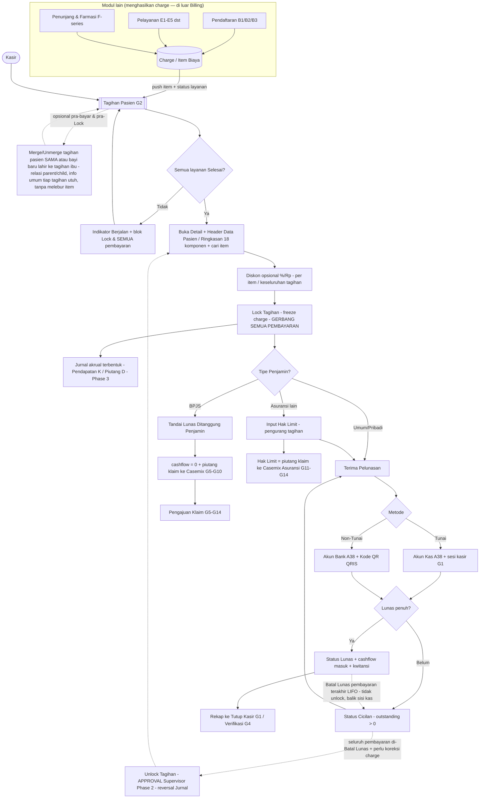

# PRD — Billing: Tagihan Pasien (G2)

**Related Document:** Related Feature: G2 Billing/Kasir > Billing > Tagihan Pasien. Sumber charge (Out of Scope operasi): Pendaftaran/Admisi (B1/B2/B3), Pelayanan Utama (E1–E5 dst.), Penunjang & Farmasi (F-series). Master: A20 Tipe Penjamin, A38 Kas dan Bank, A43 Tarif Kamar, A58 Kelas, A59 Pengaturan Harga, G18 Paket Tarif, G21 Program Diskon, G22 Harga Jual Obat. Hilir: G1 Buka/Tutup Kasir, G3 Deposito/Wadiah Pasien, G4 Verifikasi Penerimaan Kas, G5–G10 Klaim BPJS, G11–G14 Klaim Asuransi Swasta.
**Versi:** 2.7 - Penyesuaian (permintaan PO): **(1) Fitur Split Tagihan DIHAPUS** — memecah item ke tagihan baru (FR-018/BR-022/US-018) **tidak dibutuhkan**; seluruh referensi FR-018/BR-022/US-018, field `split_from_bill_id`, enum `SPLIT`, endpoint `/split`, dan alur terkait dihapus. **(2) Penegasan konsep Merge Tagihan** — Merge **BUKAN** menggabungkan seluruh item dua tagihan menjadi satu tagihan, melainkan menautkan **2 (atau lebih) tagihan berbeda** sebagai **tagihan parent** & **tagihan child** dalam relasi **parent–child**, dengan **informasi umum tiap tagihan tetap terjaga utuh** (parent hanya mengagregasi total/sisa untuk penagihan terpadu). 2.6 - Penyesuaian (permintaan PO): **Tab Penjualan Obat Bebas (F19) diperluas** — fitur serupa Tagihan Pasien: **Detail** (informasi header bersumber **Pelayanan Farmasi → Penjualan Obat Bebas**), **Lock Tagihan → Unlock Tagihan** (approval), **Bayar → Batal Bayar**, Jurnal (Kas/Bank D / Pendapatan Penjualan OTC K), kwitansi — FR-019 AC7/BR-023. 2.5 - Konfirmasi PO: (1) **Cakupan tab Kasir** — **Deposito (G3)** = tab navigasi daftar pasien ber-top-up + saldo (dipakai di Tagihan Pasien untuk metode Deposito); **Penjualan Obat Bebas (F19)** = tab pembayaran OTC dengan **fitur serupa Tagihan Pasien** (FR-019/BR-023); (2) **Flag 'Cicilan?' dihapus** — cicilan **dideteksi otomatis** bila nominal bayar < sisa tagihan (BR-009). 2.4 - Konfirmasi PO atas 8 pertanyaan terbuka: (1) 18 komponen casemix = **Juknis INA-CBG**, pemilik **Casemix** (§8.3.3); (2) non-tunai **dicatat manual + verifikasi G4** (BR-008); (3) **refund = G2 Phase 2**, pembatalan pembayaran = **Batal Lunas** (FR-014); (4) diskon **hanya bagian pasien** (BR-016); (5) **Batal Lunas non-tunai → refund TUNAI**, jurnal **Kas (K)/Piutang (D)** (FR-014 AC5/BR-018/BR-020); (6) pemetaan COA dari master **Tarif Layanan A10** & **Barang A3/A4/A5** (FR-016/BR-020); (7) **Merge penjamin campuran diizinkan** — pasien bayar yang **tidak ditanggung** saja (BR-021); (8) **Split wajib penjamin identik** (BR-022). 2.3 - Penyesuaian (permintaan PO): **(1) Status Layanan per alur** — indikator menampilkan progres 4 alur: **Pelayanan** (mulai=Pendaftaran, selesai=Pemulangan pasien), **Lab** (order→selesai), **Radiologi** (order→selesai), **Farmasi** (order resep→selesai pembuatan) — BR-026/FR-001; **(2) Jurnal saat bayar** — tiap pembayaran memicu jurnal penyelesaian **Kas/Bank/Deposito (Debit) / Piutang Pasien (Kredit)** sesuai metode bayar (BR-020); **(3) Pembayaran Deposito** dipertegas (butuh saldo, mengurangi saldo deposito G3) — FR-011/BR-013. 2.2 - Penyesuaian (permintaan PO): **(1) Pembayaran & penyelesaian hanya SETELAH Lock** — seluruh pembayaran (termasuk **uang muka/cicilan**) dan **Lunas Ditanggung Penjamin (BPJS)** hanya dapat dilakukan bila tagihan sudah **di-Lock** (`is_locked=true`); izin uang muka/cicilan **pra-Lock dihapus** — BR-003/BR-009/BR-019. **(2) Skema Unlock Tagihan (baru)** — membuka kembali tagihan terkunci untuk koreksi charge; **perlu approval berjenjang** (Phase 2) & **hanya dapat dilakukan setelah Batal Lunas** (seluruh pembayaran dibatalkan lebih dulu) — FR-021/BR-025 (mengganti sifat "freeze permanen tanpa unlock"). (v2.1) Konfirmasi PO: **Hak Limit (Asuransi) = input manual Kasir** (Phase 1, tanpa approval, wajib audit); **TIDAK** divalidasi otomatis terhadap plafon polis/master asuransi pada MVP — validasi otomatis plafon = kandidat Phase 2. Menuntaskan [PERLU KONFIRMASI] pada BR-024/FR-020. 2.0 - Penyesuaian (permintaan PO): **Input diskon dipindah ke layar Detail Tagihan** (FR-002) — diskon **item** & **keseluruhan** (Persentase/Nominal) diinput langsung pada Detail Tagihan, **tanpa layar/modal terpisah** dan **bukan** pada layar Pembayaran (mengganti keputusan v1.6) — FR-012/BR-016. (v1.9: Alur penagihan per Tipe Penjamin — FR-020/BR-024.) Penyesuaian (permintaan PO): **Alur penagihan per Tipe Penjamin (A20)** — (1) **Umum = Pribadi** (dibayar penuh oleh pasien via pembayaran biasa); (2) **BPJS** dapat dilunasi **tanpa uang kas/bank masuk** (Lunas Ditanggung Penjamin, piutang klaim G5–G10); (3) **Asuransi lain** (selain Umum/Pribadi & BPJS) memakai **input Hak Limit** (nominal ditanggung asuransi) sebagai **pengurang tagihan**, **sisa tagihan** dibayar via proses pembayaran biasa, Hak Limit → piutang klaim G11–G14 — FR-020/BR-024. (v1.8: Batas G2 ⟷ G3 dipertegas — Deposito Pasien (G3) hanya menerima top-up; pembayaran tagihan memakai deposito di G2 — FR-011/BR-013. v1.7: Merge lintas-pasien bayi baru lahir → ibu — FR-017/BR-021. v1.6: input diskon di Layar Pembayaran tanpa layar terpisah + alasan diskon dihapus — FR-012/BR-016. v1.5: Batal Lunas dipertegas LIFO & tidak meng-unlock — FR-014/BR-018; Merge/Unmerge tagihan pasien sama parent-child — FR-017/BR-021; Split item header sama — FR-018/BR-022; Pemisahan Tab Kasir — FR-019/BR-023. v1.4: Lock prasyarat pelunasan, Batal Lunas pasca-Lock, Jurnal akrual. v1.3: Batal Lunas, Lock Tagihan, Jurnal otomatis saat Lock. v1.2: No. Pendaftaran + Cetak/Export PDF. v1.1: diskon %/Rp Phase 1, header Data Pasien, pencarian item. v1.0: draft awal agregasi & penagihan Kasir).
**Tanggal:** 9 Juli 2026

## 1. Metadata Dokumen

**Approval**

| PRD Approved By | Nama / Jabatan | Signature, Date |
|-----------------|----------------|-----------------|
| [1] | [PERLU KONFIRMASI] — Chief/Owner Produk | - |

**PIC**

| Nama | Role |
|------|------|
| [PERLU KONFIRMASI] | Product Owner |
| [PERLU KONFIRMASI] | System Analyst |

**Related Documents**
* **Modul Pendaftaran/Admisi** (B1 RJ, B2 RI, B3 IGD) — sumber *encounter*, penjamin, SEP/nomor kunjungan yang menjadi konteks tagihan.
* **Modul Pelayanan Utama & Penunjang** (E1–E5 dst., F-series Farmasi/Lab/Radiologi) — **sumber charge**: tiap tindakan/order/dispensing mendorong item biaya ke tagihan.
* **Master Data — Tipe Penjamin (A20)** — klasifikasi pembayar (Umum/BPJS/Asuransi) yang menentukan alur penagihan.
* **Master Data — Kas dan Bank (A38)** — sumber **metode pembayaran & bank tujuan**; QRIS menampilkan Kode QR (`qris_code`).
* **Master Tarif & Harga** — A43 Tarif Kamar, A58 Kelas, A59 Pengaturan Harga, G18 Paket Tarif, G21 Program Diskon, G22 Harga Jual Obat.
* **Billing/Kasir hilir** — G1 Buka & Tutup Kasir, G3 Deposito/Wadiah Pasien, G4 Verifikasi Penerimaan Kas.
* **Casemix / Klaim** — G5–G10 (Klaim BPJS), G11–G14 (Klaim Asuransi Swasta) — penerima piutang klaim.

**Document Version**

| Tanggal | Versi | Deskripsi Perubahan |
|---------|-------|---------------------|
| 13 Juli 2026 | 2.7 | Penyesuaian atas permintaan PO: **(1) Fitur Split Tagihan DIHAPUS** — pemecahan item ke tagihan baru (FR-018/BR-022/US-018) **tidak dibutuhkan**; seluruh referensi (FR-018, BR-022, US-018, field `split_from_bill_id`, enum `bill_relation=SPLIT`, endpoint `/bills/{id}/split`, baris scope/state-machine/case/flowchart terkait) dihapus. **(2) Penegasan konsep Merge Tagihan** — Merge = relasi **parent–child** antar-**tagihan berbeda** (satu jadi **parent**, lainnya **child**), **BUKAN** peleburan seluruh item menjadi satu tagihan; **informasi umum tiap tagihan tetap terjaga utuh** & dapat ditelusuri, parent hanya **mengagregasi** total/sisa untuk penagihan terpadu (FR-017/BR-021). |
| 10 Juli 2026 | 2.6 | Penyesuaian atas permintaan PO: **Tab Penjualan Obat Bebas (F19) diperluas** menjadi workspace serupa Tagihan Pasien (FR-019 AC7/BR-023) — **Detail** transaksi dengan **informasi header bersumber Pelayanan Farmasi → Penjualan Obat Bebas** (No. Nota, Tgl/Jam, Petugas Farmasi, Pembeli, Unit/Apotek, No. Antrian); **Lock Tagihan → Unlock Tagihan** (Unlock ber-approval, hanya setelah Batal Bayar); **Bayar → Batal Bayar**; **Jurnal** (Kas/Bank D / Pendapatan Penjualan OTC K, dibalik saat Batal Bayar); kwitansi. Preview G2 tab OTC dibangun sesuai. |
| 10 Juli 2026 | 2.5 | Konfirmasi PO: (1) **Cakupan tab workspace Kasir** (FR-019/BR-023) — **Deposito (G3)** = tab **navigasi** daftar pasien yang telah top-up + **saldo deposito**, yang **dipakai di Tagihan Pasien** untuk pembayaran metode Deposito; **Penjualan Obat Bebas (F19)** = tab **tempat pembayaran OTC** yang **memerlukan fitur serupa tab Tagihan Pasien** (worklist, Terima Pembayaran, Jurnal, kwitansi) tanpa alur charge klinis/Lock. (2) **Flag 'Cicilan?' pada pembayaran DIHAPUS** — sistem **otomatis** mendeteksi cicilan bila **nominal bayar < sisa tagihan** (`is_installment` diturunkan sistem) — BR-009, §8.3.1, FR-009 AC1. |
| 10 Juli 2026 | 2.4 | **Konfirmasi PO** atas 8 pertanyaan terbuka (jadi keputusan): (1) 18 komponen casemix **mengikuti Juknis INA-CBG**, pemilik pemetaan = **Casemix** (§8.3.3); (2) kanal **non-tunai dicatat manual** Kasir + **diverifikasi G4** (BR-008); (3) **refund ditangani di G2 (Phase 2)**; pembatalan pembayaran = **Batal Lunas** (FR-014); (4) **diskon hanya atas bagian pasien** (bukan bagian ditanggung) — BR-016; (5) **Batal Lunas non-tunai mengembalikan uang TUNAI** — jurnal **Kas (Kredit) / Piutang Pasien (Debit)** (FR-014 AC5/BR-018/BR-020); (6) pemetaan **komponen→COA** dari master **Tarif Layanan (A10)** & **Barang (A3/A4/A5)** — FR-016/BR-020; (7) **Merge penjamin campuran diizinkan** — pasien membayar **hanya yang tidak ditanggung**, sisanya piutang klaim per child (BR-021); (8) **Split wajib Tipe Penjamin identik** dengan asal (BR-022). |
| 10 Juli 2026 | 2.3 | Penyesuaian atas permintaan PO: **(1) Status Layanan per alur** (BR-026/FR-001) — indikator status tagihan menampilkan progres **Pelayanan** (Pendaftaran→Pemulangan), **Lab** (order→selesai), **Radiologi** (order→selesai), **Farmasi** (order resep→selesai pembuatan); **(2) Jurnal saat bayar** (BR-020) — tiap pembayaran memicu jurnal penyelesaian **Kas/Bank/Deposito (Debit) / Piutang Pasien (Kredit)** sesuai metode; **(3) Pembayaran Deposito** dipertegas (butuh saldo, mengurangi saldo G3) — FR-011/BR-013. |
| 9 Juli 2026 | 2.2 | Penyesuaian atas permintaan PO: **(1) Pembayaran & penyelesaian hanya SETELAH Lock** — seluruh pembayaran (termasuk **uang muka & cicilan**) dan penandaan **Lunas Ditanggung Penjamin (BPJS)** hanya boleh bila tagihan **sudah di-Lock** (`is_locked=true`); **izin uang muka/cicilan pra-Lock DIHAPUS** (mengubah BR-003/BR-009/BR-019, FR-005/006/007/009/010/011/020 AC, state machine, API). **(2) Skema Unlock Tagihan (baru, FR-021/BR-025)** — membuka kembali tagihan terkunci untuk koreksi charge; **perlu approval berjenjang** (Phase 2) & **hanya setelah Batal Lunas** (seluruh pembayaran dibatalkan → `total_paid=0`); memicu **reversal Jurnal** (Phase 3). Sifat Lock "freeze permanen tanpa unlock" (v1.3/1.4) **diganti** menjadi freeze dg jalur Unlock terkendali. |
| 8 Juli 2026 | 1.0 | Pembuatan awal dokumen. Menetapkan Tagihan Pasien sebagai **layar agregasi & penagihan** (read-only terhadap operasi klinis), indikator status layanan, Detail vs Ringkasan (18 komponen casemix), pembayaran tunai/non-tunai + bank tujuan (A38), cicilan, dan mekanisme penjamin BPJS (lunas tanpa cashflow). |
| 8 Juli 2026 | 1.1 | Penambahan atas permintaan PO: (1) **Input Diskon** berjenis **Persentase (%)** atau **Nominal (Rp)**, dapat diterapkan **per item** & **keseluruhan tagihan** di **Phase 1 tanpa approval** (tercatat audit) — FR-012/BR-016; (2) **Header Data Pasien** pada Detail Tagihan (No. RM, Nama, Unit, Tgl Masuk/Keluar, Kelas, Dokter DPJP, No. Kartu, Tgl Lahir, No. Pendaftaran) — §8.3.4; (3) **Pencarian item tagihan** pada Detail Tagihan. |
| 9 Juli 2026 | 1.9 | Penyesuaian atas permintaan PO: **Alur penagihan per Tipe Penjamin (A20) dipertegas** — **Umum diperlakukan identik dengan Pribadi** (dibayar penuh oleh pasien); **BPJS** dapat **dilunasi tanpa arus kas masuk** (Lunas Ditanggung Penjamin); **Asuransi selain Umum/Pribadi & BPJS** memakai **input Hak Limit** (nominal ditanggung asuransi) sebagai **pengurang tagihan**, dengan **sisa tagihan** dibayar melalui proses pembayaran biasa dan Hak Limit menjadi **piutang klaim** (G11–G14). Menambah FR-020, BR-024, US-020, field `guarantor_limit`, form Hak Limit, API `/guarantor-limit`, flowchart & open questions. |
| 9 Juli 2026 | 1.8 | Penyesuaian atas permintaan PO: **Batas tanggung jawab G2 ⟷ G3 dipertegas** — **Deposito Pasien (G3) hanya menerima top-up** saldo; **pembayaran tagihan menggunakan saldo deposito dilakukan di G2** melalui metode pembayaran `DEPOSITO` (pembayaran non-kas internal; mengurangi `outstanding_balance` tagihan **dan** saldo deposito G3). Status FR-011/BR-013 dinaikkan dari **[ASUMSI]** menjadi **keputusan**; pemakaian deposito ditegaskan sebagai fungsi **G2**. |
| 9 Juli 2026 | 1.6 | Penyesuaian atas permintaan PO: **Input diskon** (item & keseluruhan) dilakukan **langsung pada Layar Pembayaran** — **tanpa layar/modal terpisah** (§8.3.1/§8.3.5, FR-012 AC 2); **alasan diskon dihapus** (bukan input wajib/opsional) — field `discount_reason` dan referensi audit alasan dihapus (§8.3.5, FR-012 AC 5, BR-015/016). *(Lokasi input direvisi pada v2.0.)* |
| 9 Juli 2026 | 2.1 | Konfirmasi PO atas [PERLU KONFIRMASI] BR-024: **Hak Limit (Asuransi) = input manual Kasir** — Phase 1 **tanpa approval** (wajib audit trail), **tidak** divalidasi otomatis terhadap plafon polis/master asuransi; **validasi otomatis plafon polis = kandidat Phase 2** (opsional). (FR-020 AC 6 / BR-024). |
| 9 Juli 2026 | 2.0 | Penyesuaian atas permintaan PO (revisi v1.6): **Input diskon dipindah dari layar Pembayaran ke layar Detail Tagihan** (FR-002) — diskon **per item** (kolom Diskon pada tabel item) & **keseluruhan tagihan** (pada ringkasan/total), Persentase/Nominal, **tanpa layar/modal terpisah** & **tanpa alasan**; **tidak** lagi pada layar Pembayaran (FR-002 AC 7, FR-012 AC 2, §8.3.5, BR-016). |
| 9 Juli 2026 | 1.7 | Penyesuaian atas permintaan PO: **Merge lintas-pasien bayi baru lahir → ibu** — tagihan **bayi baru lahir** dapat digabung ke tagihan **ibunya** meski `patient_id` berbeda, sepanjang **relasi bayi–ibu tervalidasi** dari Pendaftaran; parent = **tagihan ibu**, tagihan bayi = **child** (identitas & penjamin tetap terpisah/utuh, piutang klaim per child), ditandai `merge_type=NEWBORN_MOTHER`. Menambah field `merge_type` (§8.3.6/model data), AC 1b (FR-017), penyesuaian API `/bills/merge`, BR-021, anti-fraud #14, flowchart & open questions. |
| 8 Juli 2026 | 1.2 | Penambahan atas permintaan PO: (1) **No. Pendaftaran** disertakan pada kolom **No. Tagihan** di worklist (sumber: modul Pendaftaran); (2) Fitur **Cetak / Export PDF** — **Invoice Rekap**, **Invoice Rincian**, dan **Kwitansi** — dapat **diunduh (.pdf)** maupun **dicetak**, diakses dari **Detail Tagihan** maupun **tiap baris worklist** (FR-013/BR-017). |
| 8 Juli 2026 | 1.3 | Penambahan atas permintaan PO: (1) **Batal Lunas** — pembatalan pembayaran, termasuk salah satu **angsuran** pada cicilan; **Phase 1 tanpa approval** (wajib alasan + audit) — FR-014/BR-018; (2) **Lock Tagihan** — mengunci/freeze tagihan (tak ada input charge apa pun dari modul pelayanan) dengan syarat **seluruh layanan Selesai**; bersifat **permanen** — FR-015/BR-019; (3) **Jurnal** otomatis yang terbentuk saat Lock, **ditampilkan per tagihan** di dashboard (**Phase 3**) — FR-016/BR-020. |
| 8 Juli 2026 | 1.4 | Perubahan alur atas permintaan PO: **Lock Tagihan menjadi prasyarat pelunasan/settlement penuh** — tagihan wajib **di-Lock** sebelum dapat berstatus **Lunas / Lunas (Ditanggung Penjamin)** (FR-015/BR-019); **uang muka & cicilan interim tetap boleh sebelum Lock** (FR-007/BR-009); **Batal Lunas kini diperbolehkan pasca-Lock** dan hanya membalik sisi kas — tidak lagi diblokir oleh Lock (FR-014/BR-018); **Jurnal Phase 3 = akrual** — Lock memicu pengakuan pendapatan (Pendapatan K / Piutang Pasien D), tiap pembayaran memposting Kas/Bank D / Piutang K (FR-016/BR-020). |
| 9 Juli 2026 | 1.5 | Penambahan atas permintaan PO: (1) **Batal Lunas dipertegas** — hanya **pembayaran terakhir** (urutan **LIFO**) yang dapat dibatalkan, dan Batal Lunas **TIDAK meng-unlock** tagihan (`is_locked` tetap `true`; hanya membalik sisi kas) — FR-014/BR-018; (2) **Merge Tagihan** — menggabungkan **≥2 tagihan pasien yang sama** menjadi satu tagihan **parent** untuk penagihan/pembayaran terpadu, sementara tiap tagihan asal tetap tersimpan sebagai **child** dengan informasi per-tagihan utuh, plus **Unmerge** untuk mengembalikan ke kondisi semula — FR-017/BR-021; (3) **Split Tagihan** — memecah **item** sebuah tagihan ke tagihan baru sementara **header/informasi umum (pasien, encounter, penjamin, kelas) tetap sama** — FR-018/BR-022; (4) **Pemisahan Tab** pada workspace Kasir menjadi **Tagihan Pasien (G2)**, **Deposito (G3)**, dan **Penjualan Obat Bebas (F19)** — FR-019/BR-023. |

## 2. Overview & Background

**Overview / Brief Summary**

**Tagihan Pasien (G2)** adalah layar kerja utama **Kasir Rumah Sakit** pada modul **Billing/Kasir**. Fitur ini **mengagregasi seluruh biaya** yang timbul dari perjalanan pelayanan seorang pasien — mulai dari pendaftaran, tindakan, pemeriksaan penunjang, hingga obat & BMHP — menjadi **satu tagihan** yang siap ditagihkan dan dibayar.

Prinsip arsitektur yang WAJIB dipegang: **Tagihan Pasien hanya MENERIMA informasi.** Seluruh operasi yang *menghasilkan* biaya (order, tindakan, dispensing farmasi, akomodasi kamar) dieksekusi di **modul selain Billing**. Billing tidak menciptakan, mengubah, atau menghapus item pelayanan — ia **membaca, mengelompokkan, dan menagih**. Karena itu G2 menampilkan **indikator status proses layanan** per pasien (**Berjalan** / **Selesai**) yang bersumber dari modul pelayanan, agar Kasir tahu kapan sebuah tagihan sudah lengkap dan siap difinalisasi.

G2 menyajikan tagihan dalam dua sudut pandang: **(a) Detail Tagihan** — daftar item granular yang tertaut ke dokumen/modul asalnya (traceable); dan **(b) Ringkasan Tagihan** — rekap nilai yang dikelompokkan ke dalam **18 komponen tarif casemix**. Pembayaran diakomodir secara **tunai maupun non-tunai** dengan **bank tujuan** yang diambil dari Master Data Kas dan Bank (**A38**), mendukung **cicilan**, serta menangani skenario **penjamin BPJS** di mana tagihan dinyatakan **lunas namun tanpa arus kas masuk** ke RS (nominal menjadi **piutang klaim**).

**Business Process (As-Is vs To-Be)**

* **As-Is (manual / masalah saat ini)** *(sebagian [ASUMSI], diturunkan dari kondisi umum RS Tipe C & D)*:
    * Kasir **merekap manual** biaya dari berbagai unit (nota poli, resep apotek, hasil lab/radiologi, lembar tindakan, karcis kamar) → lambat, rawan **item terlewat/dobel**.
    * Tidak ada **indikator apakah layanan pasien sudah selesai** → tagihan difinalisasi padahal masih ada tindakan/obat berjalan (khusus rawat inap).
    * Rekap ke **komponen tarif casemix** dihitung terpisah → menyulitkan verifikasi klaim BPJS.
    * Metode & tujuan setoran pembayaran tidak terstandar → **rekonsiliasi kas/bank** sulit, penerimaan tunai per kasir tidak terlacak.
    * **Cicilan** dan **piutang penjamin BPJS** dicatat di buku/berkas terpisah → saldo pasien tidak real-time.

* **To-Be (solusi digital yang diusulkan)**:
    * **Agregasi otomatis** — setiap charge dari modul pelayanan/penunjang/farmasi otomatis masuk ke tagihan pasien terkait (per *encounter*/kunjungan), lengkap dengan traceability ke dokumen sumber.
    * **Indikator status layanan** — Kasir melihat badge **Berjalan/Selesai** per layanan; **finalisasi tagihan** dikendalikan oleh kelengkapan layanan (BR-003).
    * **Detail & Ringkasan** — satu klik beralih antara item granular dan **Ringkasan 18 komponen tarif casemix**.
    * **Pembayaran terstandar** — pilih **metode & bank tujuan dari A38**; tunai → akun Kas, non-tunai → akun Bank; QRIS menampilkan Kode QR. Setiap penerimaan tertaut ke **sesi kasir aktif** (G1).
    * **Cicilan & saldo real-time** — **seluruh pembayaran (uang muka/cicilan/pelunasan) hanya dapat dilakukan setelah tagihan di-Lock**; pembayaran parsial menurunkan sisa, status **Lunas** saat `outstanding = 0` (BR-009/BR-019).
    * **Diskon fleksibel** — Kasir dapat menginput **diskon Persentase (%) atau Nominal (Rp)** pada item tertentu maupun keseluruhan tagihan; `outstanding` diperbarui real-time dan tercatat di audit (Phase 1, tanpa approval — FR-012/BR-016).
    * **Header Data Pasien & pencarian item** — Detail Tagihan menampilkan **identitas pasien** (No. RM, Nama, Unit, Tgl Masuk/Keluar, Kelas, Dokter DPJP, No. Kartu, Tgl Lahir, No. Pendaftaran) dan **kolom pencarian** untuk menyaring item saat jumlahnya banyak. Worklist juga menautkan **No. Pendaftaran** (dari modul Pendaftaran) pada kolom No. Tagihan.
    * **Cetak / Export PDF** — dokumen **Invoice Rekap**, **Invoice Rincian**, dan **Kwitansi** dapat **diunduh (.pdf)** atau **dicetak** langsung, diakses dari Detail Tagihan maupun tiap baris worklist (FR-013).
    * **Batal Lunas** — Kasir dapat **membatalkan pembayaran terakhir** yang sudah tercatat (transaksi/angsuran paling akhir yang masih `success`); pembatalan mengikuti urutan **LIFO** — untuk membatalkan angsuran sebelumnya, batalkan pembayaran **terakhir** lebih dulu agar riwayat tidak berlubang. Sisa tagihan dipulihkan & penerimaan sesi kasir dikoreksi. **Batal Lunas TIDAK meng-unlock tagihan** — `is_locked` tetap `true` (Lock membekukan **charge** secara permanen, terpisah dari transaksi pembayaran); pasca-Lock, void **hanya membalik sisi kas** (tidak mengubah charge/pengakuan pendapatan yang sudah final) (Phase 1, tanpa approval, wajib alasan + audit — FR-014/BR-018).
    * **Lock Tagihan (freeze) — gerbang pembayaran** — setelah **seluruh layanan Selesai**, Kasir **mengunci** tagihan: nilai tagihan menjadi **final** & **tidak ada charge baru** yang dapat masuk dari modul pelayanan mana pun. **Lock adalah prasyarat SELURUH pembayaran & penyelesaian** — tagihan **wajib di-Lock sebelum** menerima pembayaran apa pun/ditandai Lunas. Charge di-**freeze**; pembayaran & Batal Lunas dilakukan pasca-Lock. Untuk koreksi charge tersedia **Unlock Tagihan** (approval, hanya pasca Batal Lunas — FR-021/BR-025) (FR-015/BR-019).
    * **Unlock Tagihan (buka kunci — approval)** — bila charge perlu dikoreksi setelah Lock, Kasir mengajukan **Unlock** yang **memerlukan approval berjenjang** (Phase 2) dan **hanya dapat dilakukan setelah Batal Lunas** menihilkan seluruh pembayaran; Unlock membuka `is_locked` & me-reversal Jurnal, lalu tagihan di-Lock ulang (FR-021/BR-025).
    * **Jurnal otomatis (Phase 3, akrual)** — **Lock memicu Jurnal pengakuan pendapatan**: **Pendapatan per komponen (K)** lawan **Piutang Pasien (D)** / **Piutang Klaim (D)** untuk bagian penjamin, dengan **Diskon** sebagai kontra-pendapatan — sesuai Mapping COA. **Setiap pembayaran** (termasuk pasca-Lock) memposting **Kas/Bank (D) / Piutang (K)**. **Jurnal yang terbentuk ditampilkan per tagihan** di dashboard (FR-016/BR-020).
    * **Penjamin BPJS** — tagihan ditandai **Lunas (Ditanggung Penjamin)** tanpa cashflow; nominal diteruskan sebagai **piutang klaim** ke modul Casemix (G5–G10).
    * **Siap akuntansi (Phase 3)** — tiap komponen tarif & metode bayar dipetakan ke **COA** untuk jurnal otomatis (pendapatan, kas/bank, piutang klaim).
    * **Merge Tagihan (parent-child)** — bila seorang pasien memiliki **beberapa tagihan** (mis. lintas kunjungan/encounter), Kasir dapat **menggabungkan ≥2 tagihan pasien yang sama** menjadi **satu tagihan parent** agar penagihan & pembayaran dilakukan sekali jalan. **Pengecualian bayi baru lahir**: tagihan **bayi baru lahir** dapat digabung ke tagihan **ibunya** walau `patient_id` berbeda (sepanjang relasi bayi–ibu tervalidasi dari Pendaftaran) — tagihan ibu menjadi **parent** (BR-021). Tiap tagihan asal **tetap tersimpan sebagai child** dengan seluruh informasinya (No. Tagihan asal, item, penjamin, subtotal) **utuh & dapat ditelusuri** — parent hanya **mengagregasi** total & sisa. **Merge bukan peleburan item**: sistem **tidak** menggabungkan seluruh item dua tagihan menjadi satu tagihan, melainkan **menautkan tagihan-tagihan berbeda** dalam relasi **parent–child** sehingga **informasi umum tiap tagihan tetap terjaga**. Kasir dapat **Unmerge** untuk membalikkan gabungan ke tagihan-tagihan semula. Merge/Unmerge hanya diizinkan **selama parent belum ada pembayaran & belum di-Lock** (FR-017/BR-021).
    * **Tab Kasir terpisah** — workspace Kasir memisahkan **tiga fungsi** ke dalam **tab** berbeda: **Tagihan Pasien (G2)**, **Deposito/Wadiah Pasien (G3)**, dan **Penjualan Obat Bebas (F19)** — agar konteks kerja jelas & tidak tercampur; G2 (dokumen ini) adalah isi tab **Tagihan Pasien** (FR-019/BR-023).

## 3. Goals & Metrics

**Goals:** menyediakan layar penagihan tunggal bagi Kasir yang mengagregasi seluruh biaya pelayanan secara akurat & real-time; menjamin tagihan hanya difinalisasi saat layanan lengkap; menstandarkan pembayaran (metode + bank tujuan dari A38) dan penerimaan kas per sesi kasir; menyajikan ringkasan 18 komponen tarif casemix untuk mempermudah klaim; serta menangani cicilan dan piutang penjamin BPJS secara transparan.

| No | Metrics | Success Criteria |
|----|---------|------------------|
| 1 | Kelengkapan agregasi biaya | **100%** charge dari modul pelayanan/penunjang/farmasi muncul di tagihan pasien yang benar (0 item terlewat/dobel). |
| 2 | Akurasi ringkasan casemix | **100%** item tagihan terpetakan ke salah satu dari 18 komponen tarif; total Detail = total Ringkasan. |
| 3 | Kontrol finalisasi | **0%** tagihan difinalisasi saat masih ada layanan berstatus **Berjalan** (kecuali override sadar-risiko tercatat). |
| 4 | Kecepatan buka tagihan | Waktu memuat Detail + Ringkasan tagihan **< 3 detik**. |
| 5 | Ketertelusuran penerimaan | **100%** transaksi pembayaran tertaut ke **metode + bank tujuan (A38)** dan **sesi kasir (G1)**. |
| 6 | Akurasi penjamin BPJS | **100%** tagihan BPJS berstatus Lunas menghasilkan **cashflow_received = 0** dan **piutang klaim** yang benar. |
| 7 | Transparansi cicilan | **100%** sisa tagihan (`outstanding_balance`) akurat & real-time setelah tiap pembayaran parsial. |
| 8 | Konsistensi master | **100%** metode/bank & tarif mengacu master A38/A43/A59 (tanpa input bebas). |

## 4. Scope Definition & Phasing

| Fitur/Modul | Phase 1 (MVP: CRUD & Penagihan Dasar) | Phase 2 (Advanced: Approval/Escalation) | Phase 3 (Accounting: Mapping COA) |
|-------------|----------------------------------------|------------------------------------------|-----------------------------------|
| Daftar Tagihan (Worklist Kasir) | List pasien + tagihan + filter (unit, penjamin, status) + indikator status layanan | Filter lanjutan + ekspor | Badge status posting jurnal |
| Detail Tagihan | Tampilkan item granular + traceability ke modul asal (read-only) | — | — |
| Ringkasan Tagihan | Rekap **18 komponen tarif casemix** + total | — | Pemetaan komponen → **akun COA pendapatan** |
| Indikator Status Layanan (per alur) | Badge progres **per alur**: Pelayanan (daftar→pulang), Lab, Radiologi, Farmasi (order→selesai) — Berjalan/Selesai, read-only dari modul lain (BR-026) | — | — |
| Pembayaran Tunai | Terima tunai → akun **Kas** (A38); tertaut sesi kasir (G1); cetak kwitansi | — | Jurnal **Kas (D) / Piutang Pasien (K)** |
| Pembayaran Non-Tunai | QRIS/Debet/Transfer/VA/Kredit → akun **Bank** (A38); tampil Kode QR | — | Jurnal **Bank (D) / Piutang Pasien (K)** |
| Cicilan / Uang Muka | Pembayaran parsial + saldo berjalan (`outstanding`); **seluruh pembayaran (uang muka/cicilan/pelunasan) hanya pasca-Lock** (BR-009/BR-019) | Skema/plan cicilan terjadwal + reminder | Jurnal per angsuran (Kas/Bank D / Piutang K) |
| **Batal Lunas** (pembatalan pembayaran) | **Batalkan pembayaran terakhir** (void, urutan **LIFO**) — pulihkan sisa; **selalu pasca-Lock** (pembayaran hanya pasca-Lock) & **TIDAK meng-unlock** (`is_locked` tetap; hanya balik sisi kas); tanpa approval, wajib alasan + audit (FR-014/BR-018) | Refund kas fisik ke pasien + reversal berjenjang | Jurnal balik (Kas/Bank) atas pembayaran yang dibatalkan |
| **Lock Tagihan** (freeze) — **gerbang pembayaran** | **Kunci tagihan** bila semua layanan Selesai → freeze charge (**wajib sebelum pembayaran/penyelesaian apa pun**) (FR-015/BR-019) | — | **Memicu Jurnal pengakuan pendapatan (akrual)** |
| **Unlock Tagihan** (buka kunci) | **Buka `is_locked`** untuk koreksi charge — **hanya setelah Batal Lunas** (pembayaran dinihilkan) → reversal Jurnal, lalu Lock ulang (FR-021/BR-025) | **Approval berjenjang** (Supervisor) — Phase 2 | **Reversal Jurnal pengakuan pendapatan** |
| **Jurnal Otomatis** | — (disiapkan: `journal_id`, mapping COA) | — | **Akrual**: Lock → pengakuan pendapatan (Pendapatan K / Piutang D); pembayaran → Kas/Bank D / Piutang K; **tampil per tagihan** (FR-016/BR-020) |
| Penjamin BPJS (lunas tanpa cashflow) | Tandai Lunas Ditanggung Penjamin; teruskan **piutang klaim** ke G5–G10 | Rekonsiliasi selisih klaim (iur/selisih kelas) | Jurnal **Piutang Klaim (D) / Pendapatan (K)** |
| **Penjamin Umum / Pribadi** | Dibayar **penuh oleh pasien** via pembayaran biasa (tunai/non-tunai/deposito); **Pribadi = Umum** (BR-024) | — | Jurnal **Kas/Bank (D) / Pendapatan (K)** |
| **Penjamin Asuransi (Hak Limit)** | **Input Hak Limit** (nominal ditanggung asuransi) = **pengurang tagihan**; **sisa tagihan** dibayar via pembayaran biasa; Hak Limit → **piutang klaim** G11–G14 — FR-020/BR-024 | Validasi Hak Limit dari plafon polis + rekonsiliasi selisih klaim | Jurnal **Piutang Klaim Asuransi (D) / Pendapatan (K)** |
| **Diskon (Persentase/Nominal)** | **Input diskon % atau Rp** — per item & keseluruhan tagihan (tanpa approval & tanpa plafon per role; maks = nilai tagihan; tidak menumpuk G21; tercatat audit) — FR-012/BR-016 | — | Jurnal **Potongan/Diskon Pendapatan** |
| Waiver / Koreksi Item / Refund / Pembatalan | — (nilai charge item read-only bagi Kasir) | **Approval berjenjang** waiver, koreksi item, refund, pembatalan | — |
| **Cetak / Export PDF** | **Invoice Rekap, Invoice Rincian, Kwitansi** — unduh (.pdf) & cetak; dari Detail & worklist (FR-013/BR-017) | Template kop/branding & tanda tangan digital | Tautan dokumen ke jurnal/arsip akuntansi |
| **Merge Tagihan** (parent-child) | **Gabung ≥2 tagihan pasien SAMA** → 1 tagihan **parent** (penagihan terpadu); **pengecualian: tagihan bayi baru lahir → tagihan ibu** (`patient_id` beda, relasi tervalidasi); tiap tagihan asal jadi **child** (info per-tagihan utuh & traceable); parent **mengagregasi** total/sisa; **Unmerge** membalikkan. Hanya bila parent **belum ada pembayaran & belum Lock** (FR-017/BR-021) | Approval merge lintas-penjamin + audit lanjutan | Jurnal mengikuti tagihan **parent** saat Lock |
| **Tab Kasir (Navigasi)** | **Pisahkan tab**: **Tagihan Pasien (G2)** / **Deposito (G3)** / **Penjualan Obat Bebas (F19)**; G2 = isi tab Tagihan Pasien (FR-019/BR-023) | — | — |
| Pemakaian Deposito Pasien (G3) | **Pembayaran tagihan memakai saldo deposito** (metode `DEPOSITO`, pengurang sisa tagihan) — G3 **hanya menerima top-up**, pemakaian deposito untuk **membayar tagihan = fungsi G2** (DIKONFIRMASI PO) — FR-011/BR-013 | Approval penarikan/refund deposito | Jurnal titipan pasien |

**Out of Scope (dikerjakan modul lain — G2 hanya menerima informasi)**

| No | Scope | Penanggung jawab |
|----|-------|------------------|
| 1 | **Membuat/mengubah order & tindakan** (resep, lab, radiologi, operasi, darah) | Pelayanan Utama & Penunjang (E/F-series) |
| 2 | **Dispensing & pengurangan stok** obat/BHP | Farmasi & Inventory |
| 3 | **Penetapan tarif & harga** item | A43/A58/A59/G18/G21/G22 |
| 4 | **Pembuatan SEP / bridging BPJS** & pengajuan klaim | Pendaftaran (B*) & Casemix (G5–G14) |
| 5 | **Master metode pembayaran & rekening bank** | Kas dan Bank (A38) |
| 6 | **Tutup kasir & verifikasi penerimaan kas** (rekap akhir) | G1 / G4 |
| 7 | **Master COA & posting jurnal final** | Akuntansi/Keuangan (Phase 3) |

## 5. Related Features (Rekomendasi Relasi)

Tagihan Pasien adalah **titik temu** hampir seluruh modul transaksional. Tabel berikut adalah **rekomendasi fitur yang berelasi** (arah relasi: **⇐ sumber** memberi data ke G2, **⇒ hilir** menerima data dari G2, **↔ referensi** master).

**A. Sumber Charge (⇐) — dari modul Pelayanan; menghasilkan item tagihan**

| Code | Modul / Fitur | Relasi ke Tagihan Pasien |
|------|---------------|--------------------------|
| B1 / B2 / B3 | Pendaftaran RJ / RI / IGD | Membuka *encounter*/kunjungan + penjamin + kelas → **konteks & pengelompokan** tagihan; biaya administrasi/akomodasi awal. |
| E1 | Pelayanan > Tindakan & BHP | Tindakan medis + BMHP → komponen **Tindakan** & **BMHP**. |
| E2 | Pelayanan > Order Resep | Resep obat → dorong ke Farmasi; charge obat masuk komponen **Farmasi**. |
| E3 | Pelayanan > Order Lab | Pemeriksaan lab → komponen **Laboratorium/Patologi**. |
| E4 | Pelayanan > Order Radiologi | Pemeriksaan radiologi → komponen **Radiologi**. |
| E5 | Pelayanan > Order Darah | Pelayanan darah → komponen **Bank Darah**. |
| F-series | Penunjang & Farmasi (dispensing Lab/Radiologi/Farmasi) | **Konfirmasi layanan Selesai** + charge final (harga jual obat/BHP). |

**B. Master / Referensi (↔) — menentukan nilai & pilihan**

| Code | Modul / Fitur | Relasi ke Tagihan Pasien |
|------|---------------|--------------------------|
| **A20** | Master Data > Tipe Penjamin | Menentukan **alur penagihan** (BR-024): **Umum = Pribadi** (dibayar penuh pasien); **BPJS** lunas tanpa cashflow → klaim G5–G10; **Asuransi lain** memakai **input Hak Limit** (pengurang tagihan) → klaim G11–G14. |
| **A38** | Master Data > Kas dan Bank | Sumber **metode pembayaran & bank tujuan**; QRIS → tampil Kode QR (`qris_code`). |
| A43 | Master Data > Tarif Kamar | Tarif akomodasi (komponen **Akomodasi**). |
| A58 | Master Data > Kelas | Kelas perawatan → tarif & hak kelas penjamin. |
| A59 | Pengaturan Harga | Sumber harga item layanan/penunjang. |
| G18 | Facility Mgmt > Paket Tarif Layanan | Paket/bundling tarif. |
| G21 | Facility Mgmt > Program Diskon | Diskon terprogram yang boleh diterapkan otomatis. |
| G22 | Facility Mgmt > Harga Jual Obat (margin) | Harga jual obat → komponen **Farmasi**. |

**C. Hilir / Konsumen (⇒) — menerima hasil dari G2**

| Code | Modul / Fitur | Relasi ke Tagihan Pasien |
|------|---------------|--------------------------|
| **G1** | Billing > Buka & Tutup Kasir | Setiap penerimaan **tunai** tertaut ke **sesi kasir aktif**; dasar rekap Tutup Kasir. |
| **G3** | Billing > Deposito Pasien | **Sumber saldo** deposito (titipan pasien); G3 **hanya menerima top-up**. **Pembayaran tagihan memakai saldo deposito dilakukan di G2** (metode `DEPOSITO`, pengurang sisa tagihan) — FR-011/BR-013 (DIKONFIRMASI PO). |
| **G4** | Billing > Verifikasi Penerimaan Kas | Verifikasi setoran kas/bank hasil penagihan G2. |
| G5–G10 | Casemix > Pengelolaan Klaim BPJS | Penerima **piutang klaim** untuk tagihan BPJS (lunas tanpa cashflow). |
| G11–G14 | Casemix > Klaim Asuransi Swasta | Penerima piutang klaim asuransi swasta. |
| Keuangan/Akuntansi | Jurnal Otomatis & COA | Posting jurnal dari pembayaran & pengakuan pendapatan (Phase 3). |

> **Rekomendasi prioritas integrasi (MVP):** kunci lebih dulu **B1/B2/B3 (encounter & penjamin)**, **A20 (tipe penjamin)**, **A38 (metode & bank)**, **G1 (sesi kasir)**, dan **kontrak charge** dari **E1–E5 + F-series**. **G3 (deposito)**, **G4 (verifikasi)**, dan **G5–G14 (klaim)** menyusul namun harus disiapkan kontraknya sejak awal (field `is_bpjs`, `outstanding_balance`, `cashier_session_id`).

> **Tab sejawat (workspace Kasir):** selain **Tagihan Pasien (G2)**, Kasir mengakses **Deposito/Wadiah Pasien (G3)** dan **Penjualan Obat Bebas (F19)** melalui **tab terpisah** dalam satu workspace yang **berbagi sesi kasir (G1)** — dipisah agar konteks kerja tidak tercampur (FR-019/BR-023).

## 6. Business Process & User Stories

**State Machine — Entitas Tagihan (Bill)**

Status berlaku pada satu **tagihan** (per *encounter*/kunjungan). "Efek" = pengaruh pada aksi Kasir & arus kas.

| Status | Deskripsi | Efek (Data/Kas) | Transisi (Phase 1) | Transisi (Phase 2/3) |
|--------|-----------|-----------------|--------------------|----------------------|
| **Berjalan (Open)** | Layanan pasien masih berlangsung; item terus terakumulasi | Item bertambah otomatis; belum bisa Lock/pembayaran (BR-003) | → Menunggu Pembayaran (semua layanan **Selesai**) | — |
| **Menunggu Pembayaran** | Seluruh layanan **Selesai**; tagihan siap di-**Lock** lalu dibayar | Total siap difinalisasi; **wajib Lock sebelum pembayaran apa pun** (BR-019); belum ada pembayaran | → **[Lock]** → Terkunci (baru bisa dibayar / ditandai Lunas Penjamin) | — |
| **Cicilan / Sebagian** | Sudah ada pembayaran parsial/uang muka (**pasca-Lock**) | `outstanding_balance` > 0; **selalu `is_locked=true`** | → **Lunas** (outstanding = 0) · → **Batal Lunas** angsuran **terakhir** (LIFO) → outstanding naik; **`is_locked` tetap** (BR-018) · → (semua pembayaran void) **Unlock** [approval] → Terbuka utk koreksi (FR-021) | Phase 2: plan cicilan terjadwal; Unlock |
| **Lunas (Tunai/Non-Tunai)** | Terbayar penuh; **ada cashflow masuk**; **prasyarat: `is_locked=true`** (BR-019) | `outstanding = 0`; kwitansi terbit | → **Batal Lunas pembayaran terakhir** (Phase 1, LIFO; **TIDAK meng-unlock** — `is_locked` tetap `true`) → Cicilan/Menunggu Pembayaran (BR-018) | Phase 2: refund kas fisik via approval · Phase 3: jurnal Kas/Bank (D) / Piutang Pasien (K) |
| **Lunas (Ditanggung Penjamin)** | Ditanggung BPJS/Asuransi; **tanpa cashflow**; **prasyarat: `is_locked=true`** | `cashflow_received = 0`; **piutang klaim** dibuat → G5–G14 (BR-010) | (final) → penyesuaian selisih (Phase 2) | Phase 3: jurnal Piutang Klaim (D) / Pendapatan (K) saat **Lock** |
| **Batal (Void)** | Tagihan dibatalkan | Item non-aktif; tidak menagih | — | Phase 2: butuh approval pembatalan |

**State Layanan (indikator, read-only dari modul lain)** — ditampilkan per baris layanan pada Detail Tagihan:

| Status Layanan | Deskripsi | Sumber |
|----------------|-----------|--------|
| **Berjalan** | Order/tindakan/dispensing belum tuntas | Modul Pelayanan/Penunjang/Farmasi |
| **Selesai** | Layanan tuntas & charge final | Modul Pelayanan/Penunjang/Farmasi |

**Atribut Penguncian — `is_locked` (Lock Tagihan)** — melengkapi status di atas (bukan status terpisah):

| Kondisi | Deskripsi | Efek |
|---------|-----------|------|
| **Terbuka** (`is_locked = false`) | Default (atau hasil **Unlock** ber-approval); charge masih bisa masuk/dikoreksi; **belum bisa menerima pembayaran apa pun** | Nilai tagihan dapat bertambah; **seluruh pembayaran & penyelesaian diblokir** hingga di-Lock (BR-019) |
| **Terkunci** (`is_locked = true`) | Di-**Lock** setelah **seluruh layanan Selesai** (syarat) — **gerbang pembayaran** (BR-019) | **Freeze charge** (tak ada input baru dari modul mana pun); **membuka SELURUH pembayaran & penyelesaian**; **memicu Jurnal akrual** (Phase 3, BR-020); pembayaran & Batal Lunas boleh — Batal Lunas tidak mengubah `is_locked`. **Unlock** (approval, pasca Batal Lunas) mengembalikan ke **Terbuka** untuk koreksi charge (FR-021/BR-025) |

**Atribut Relasi Tagihan — Merge (parent-child)** — struktur tautan antar-tagihan (bukan status siklus hidup). **Merge menautkan tagihan-tagihan berbeda sebagai parent–child, bukan melebur item menjadi satu tagihan**; informasi umum tiap tagihan tetap terjaga:

| Peran | Field kunci | Deskripsi | Efek |
|-------|-------------|-----------|------|
| **Tagihan Normal** | `parent_bill_id = null`, `bill_relation = NONE` | Tagihan mandiri (default) | Berperilaku normal |
| **Parent (hasil Merge)** | `is_merge_parent = true`, `merge_group_id`, `merge_type` | Tagihan gabungan penagihan atas **≥2 child pasien yang sama** — **atau** tagihan **ibu** pada pengecualian **bayi baru lahir → ibu** (`merge_type = NEWBORN_MOTHER`) | **Total/sisa = agregasi child**; **pembayaran & Lock dilakukan di parent** |
| **Child (dari Merge)** | `parent_bill_id` → parent, `bill_relation = MERGED_CHILD` | Tagihan asal yang digabung — **informasi umum tetap utuh** (No. Tagihan asal, item, penjamin, subtotal) | **Tidak menerima pembayaran sendiri** selama tergabung (ditagih via parent); dapat di-**Unmerge** kembali |

> Merge dan Unmerge hanya boleh dilakukan **sebelum ada pembayaran (`total_paid = 0`) & sebelum Lock (`is_locked = false`)** pada tagihan terkait (BR-021). Setelah tagihan memiliki pembayaran atau terkunci, gabungan **tidak dapat diubah** (koreksi via reversal/approval Phase 2).

> Catatan Phasing: **Diskon (Persentase/Nominal)** = **Phase 1** — Kasir dapat menginput diskon **tanpa approval**, tetapi **wajib tercatat di audit trail** (FR-012/BR-016). **Waiver, koreksi nilai/charge item, refund, dan pembatalan** tetap **Phase 2** (approval berjenjang). Selain menerapkan diskon, di Phase 1 Kasir **tidak** mengubah harga/charge dasar item (bersumber dari modul lain) — hanya menagih & menerima pembayaran. **Seluruh pembayaran & penyelesaian (termasuk uang muka/cicilan) mensyaratkan tagihan sudah di-Lock** (BR-009/BR-019). **Unlock Tagihan** (buka kunci untuk koreksi charge) = **Phase 2** (approval berjenjang), hanya pasca Batal Lunas (FR-021/BR-025). Field `status_approval`/`role_approver` (Phase 2) & `coa_id`/`akun_debit`/`akun_kredit` (Phase 3) **disiapkan sejak Phase 1**.

**User Stories Utama**
* **US-001** — Sebagai **Kasir**, saya ingin melihat **daftar tagihan pasien** dengan indikator status layanan, agar tahu tagihan mana yang siap ditagih. *(P0)*
* **US-002** — Sebagai Kasir, saya ingin membuka **Detail Tagihan** yang tertaut ke modul asal, agar bisa menjelaskan rincian biaya ke pasien. *(P0)*
* **US-003** — Sebagai Kasir, saya ingin melihat **Ringkasan Tagihan per 18 komponen tarif casemix**, agar rekap biaya jelas & selaras klaim. *(P0)*
* **US-004** — Sebagai Kasir, saya ingin **menerima pembayaran tunai/non-tunai** dengan memilih **bank tujuan** dari master, agar penerimaan tercatat & terekonsiliasi — **pelunasan penuh dilakukan setelah tagihan di-Lock**. *(P0)*
* **US-005** — Sebagai Kasir, saya ingin **menerima pembayaran cicilan/uang muka** (setelah tagihan di-Lock) dan melihat sisa tagihan real-time, agar pasien bisa mengangsur (**seluruh pembayaran hanya setelah Lock**). *(P1)*
* **US-006** — Sebagai Kasir, saya ingin menandai tagihan **BPJS sebagai lunas ditanggung penjamin tanpa uang masuk**, agar tidak salah catat sebagai penerimaan kas. *(P0)*
* **US-007** — Sebagai Kasir, saya ingin **mencetak kwitansi/bukti bayar**, agar pasien punya bukti pembayaran. *(P1)*
* **US-008** — Sebagai **Supervisor Kasir**, saya ingin **menyetujui diskon/koreksi/refund** sebelum diterapkan, agar terkontrol. *(P2, Phase 2)*
* **US-009** — Sebagai **Kasir**, saya ingin sistem **mencegah finalisasi** saat masih ada layanan Berjalan, agar tidak ada biaya tertinggal. *(P1)*
* **US-010** — Sebagai **Kasir**, saya ingin **menginput diskon** (**Persentase %** atau **Nominal Rp**) pada **item tertentu** maupun **keseluruhan tagihan**, agar dapat memberi potongan harga sesuai kebijakan RS tanpa harus lewat modul lain. *(P1)*
* **US-011** — Sebagai **Kasir**, saya ingin melihat **Header Data Pasien** dan **mencari item** pada Detail Tagihan, agar cepat memverifikasi identitas & menemukan item saat tagihan berisi banyak baris. *(P1)*
* **US-012** — Sebagai **Kasir**, saya ingin **mencetak/mengunduh** dokumen tagihan sebagai **PDF** — **Invoice Rekap**, **Invoice Rincian**, atau **Kwitansi** — dari **halaman Detail** maupun langsung dari **baris worklist**, agar bisa memberi dokumen resmi ke pasien & arsip. *(P1)*
* **US-013** — Sebagai **Kasir**, saya ingin **membatalkan pembayaran terakhir** yang sudah tercatat (urutan **LIFO**) **tanpa meng-unlock tagihan**, agar salah input pembayaran dapat dikoreksi & sisa tagihan kembali akurat tanpa mengubah nilai charge/pengakuan pendapatan yang sudah final. *(P1)*
* **US-014** — Sebagai **Kasir**, saya ingin **mengunci (Lock) tagihan** setelah seluruh layanan Selesai **sebelum menerima pembayaran apa pun**, agar nilai tagihan **final & ter-freeze** dari perubahan charge modul lain dan pembayaran dilakukan atas nilai yang pasti. *(P0)*
* **US-021** — Sebagai **Supervisor Kasir**, saya ingin **menyetujui Unlock Tagihan** (buka kunci) yang diajukan Kasir — **hanya setelah Batal Lunas** menihilkan pembayaran — agar koreksi charge pada tagihan terkunci **terkontrol & teraudit**. *(P2, Phase 2)*
* **US-015** — Sebagai **Manajemen/Keuangan**, saya ingin melihat **Jurnal yang terbentuk** dari tiap tagihan (setelah Lock) di dashboard, agar pengakuan pendapatan & posting akuntansi tertelusur. *(P2, Phase 3)*
* **US-016** — Sebagai **Kasir**, saya ingin **menggabungkan (Merge) beberapa tagihan milik pasien yang sama** ke dalam **satu tagihan parent** (relasi **parent–child**, **tanpa melebur item**) — termasuk **tagihan bayi baru lahir ke tagihan ibunya** — agar pasien/penanggung dapat membayar sekali jalan, sambil **informasi umum tiap tagihan asal tetap terjaga** & rinciannya dapat dilihat (child). *(P1)*
* **US-017** — Sebagai **Kasir**, saya ingin **membatalkan penggabungan (Unmerge)**, agar tagihan kembali seperti semula bila penggabungan keliru. *(P2)*
* **US-019** — Sebagai **Kasir**, saya ingin **tab terpisah** untuk **Tagihan Pasien, Deposito, dan Penjualan Obat Bebas**, agar konteks kerja tidak tercampur dan navigasi lebih cepat & aman. *(P1)*
* **US-020** — Sebagai **Kasir**, saya ingin sistem menyesuaikan **alur penagihan berdasarkan Tipe Penjamin (A20)** — **Umum/Pribadi** dibayar penuh oleh pasien, **BPJS** lunas ditanggung tanpa uang masuk, dan **Asuransi lain** memakai **input Hak Limit** (pengurang tagihan) dengan **sisa** dibayar biasa — agar penagihan tiap jenis penjamin benar & tidak salah catat penerimaan kas. *(P0)*

## 7. Functional Requirements

### 7.1 Feature Requirements & Acceptance Criteria

**Fitur: Daftar Tagihan / Worklist Kasir (FR-001)**
* **User Story**: US-001. · **Prioritas**: P0. · **Fase**: Phase 1.
* **Acceptance Criteria**:
    * **AC 1**: Menu **Billing → Tagihan Pasien** menampilkan tabel: No, **No. Tagihan (+ No. Pendaftaran)**, No. RM, Nama Pasien, Unit/Ruang, Tipe Penjamin, **Status Layanan** (progres **per alur**: Pelayanan / Lab / Radiologi / Farmasi — Berjalan/Selesai, lihat **BR-026**), Total, Sisa, **Status Tagihan**. **No. Pendaftaran** ditampilkan menyertai No. Tagihan (sumber: modul Pendaftaran B*).
    * **AC 2 — Filter**: dapat difilter minimal per **Unit/Ruang, Tipe Penjamin (A20), Status Tagihan, Rawat (RJ/RI/IGD)**, dan pencarian by No. RM / Nama / No. Tagihan.
    * **AC 3 — Indikator per alur**: Status Layanan ditampilkan sebagai **badge per alur** — **Pelayanan, Lab, Radiologi, Farmasi** — masing-masing **Berjalan** (badge kuning ⏳) atau **Selesai** (badge hijau ✓); alur yang tak berlaku (tanpa order) tidak ditampilkan. Tagihan dianggap siap **Lock/pembayaran** hanya bila **semua alur yang berlaku Selesai** (BR-003/BR-026).
    * **AC 4 — Aksi**: tiap baris punya tombol **Detail** (buka tagihan), **Bayar** (jika siap), dan **Cetak** (Invoice Rekap / Invoice Rincian / Kwitansi → unduh PDF/print — FR-013).
    * **AC 5 — Real-time**: charge baru dari modul pelayanan muncul tanpa refresh manual (atau ≤ interval polling yang disepakati) [ASUMSI].

**Fitur: Detail Tagihan (FR-002)**
* **User Story**: US-002. · **Prioritas**: P0. · **Fase**: Phase 1.
* **Acceptance Criteria**:
    * **AC 1**: Menampilkan **item granular**: Tanggal, Modul/Unit asal, Kode & Nama Item, Qty, Harga Satuan, Subtotal, **Komponen Casemix**, **Status Layanan**, Penjamin (ditanggung/tidak).
    * **AC 2 — Traceability**: tiap item menautkan **modul & referensi sumber** (mis. order lab #, resep #, tindakan #) — **read-only** (BR-001/004).
    * **AC 3**: Item TIDAK dapat ditambah/diubah/dihapus dari layar ini (nilai bersumber dari modul asal); perubahan hanya via modul sumber (BR-001).
    * **AC 4**: Menampilkan subtotal per unit + total keseluruhan; total Detail **sama dengan** total Ringkasan (BR-004).
    * **AC 5 — Header Data Pasien**: bagian atas Detail Tagihan menampilkan panel **Data Pasien** (read-only, bersumber dari Pendaftaran B*/encounter) berisi: **No. RM, Nama Pasien, Unit/Ruang, Tanggal Masuk, Tanggal Keluar, Kelas, Dokter DPJP, No. Kartu (penjamin/BPJS), Tanggal Lahir, No. Pendaftaran** (§8.3.4). Untuk pasien rawat jalan, Tanggal Keluar dapat kosong/sama dengan Tanggal Masuk [ASUMSI].
    * **AC 6 — Pencarian Item**: tersedia kolom **search** untuk menyaring baris item tagihan berdasarkan **kode/nama item, modul/unit asal, atau komponen casemix** — membantu saat item sangat banyak. Pencarian bersifat filter tampilan; **subtotal & total tetap dihitung atas seluruh item** (bukan hanya yang tampil) agar rekonsiliasi (BR-004) tidak terganggu.
    * **AC 7 — Input Diskon (Phase 1)**: diskon **per item** (kolom **Diskon** pada tabel item — pilih **Persentase (%)** / **Nominal (Rp)** + nilai) **dan** diskon **keseluruhan tagihan** (pada ringkasan/total tagihan) diinput **langsung di layar Detail Tagihan ini** — **tanpa layar/modal terpisah** & **tanpa alasan**. Perhitungan, batas, dan audit mengikuti **FR-012/BR-016**. Diskon **tidak** diinput pada layar Pembayaran.
* **User Story**: US-003. · **Prioritas**: P0. · **Fase**: Phase 1.
* **Acceptance Criteria**:
    * **AC 1**: Menampilkan tabel **18 komponen tarif casemix** (§8.3.3) dengan nilai agregat per komponen + **Total**.
    * **AC 2**: Setiap item Detail **terpetakan tepat ke satu** komponen; komponen tanpa nilai tampil Rp0 atau disembunyikan (opsi) (BR-004).
    * **AC 3**: Σ(18 komponen) = Total Detail = Total Tagihan (rekonsiliasi internal).
    * **AC 4** [PERLU KONFIRMASI]: penamaan & jumlah komponen mengikuti daftar resmi RS/INA-CBG — dikonfirmasi tim Casemix.

**Fitur: Indikator Status Proses Layanan (FR-004)**
* **User Story**: US-009. · **Prioritas**: P1. · **Fase**: Phase 1.
* **Acceptance Criteria**:
    * **AC 1**: Menampilkan status **Berjalan/Selesai** per layanan berdasarkan data modul asal (read-only).
    * **AC 2**: Tagihan hanya boleh **difinalisasi/settlement penuh** bila **seluruh layanan Selesai** (BR-003).
    * **AC 3**: Bila masih ada layanan Berjalan, sistem menampilkan peringatan & **memblokir Lock dan seluruh pembayaran** (pembayaran hanya setelah Lock — BR-003/BR-019) [ASUMSI].

**Fitur: Pembayaran Tunai (FR-005)**
* **User Story**: US-004. · **Prioritas**: P0. · **Fase**: Phase 1.
* **Acceptance Criteria**:
    * **AC 1**: Kasir memilih metode **Tunai** → sistem menautkan ke **akun Kas** (A38, kategori KAS) — Tunai hanya untuk akun Kas (BR-008).
    * **AC 2**: Input **nominal diterima**, sistem menghitung **kembalian** (untuk pembayaran penuh) atau menurunkan **sisa** (cicilan).
    * **AC 3**: Transaksi tertaut ke **sesi kasir aktif** (G1) & user Kasir; bila kasir belum buka sesi → blokir (BR-006).
    * **AC 4 — Prasyarat Lock untuk SEMUA pembayaran**: **seluruh pembayaran** (uang muka, parsial, maupun pelunasan penuh) hanya dapat dilakukan bila tagihan **sudah di-Lock** (`is_locked = true`, BR-019). Bila belum di-Lock, tombol **Terima Pembayaran non-aktif** & sistem memandu Kasir **Lock dulu** (butuh semua layanan Selesai). Setelah pembayaran → `cashflow_received += nominal`; saat `outstanding = 0` → **Lunas** & **kwitansi** dapat dicetak (FR-008).

**Fitur: Pembayaran Non-Tunai (FR-006)**
* **User Story**: US-004. · **Prioritas**: P0. · **Fase**: Phase 1.
* **Acceptance Criteria**:
    * **AC 1**: Kasir memilih metode **Non-Tunai** (QRIS/Debet/Transfer/Virtual Account/Kredit) → sistem menampilkan pilihan **bank tujuan** dari **akun Bank A38** yang mendukung metode tsb (BR-008).
    * **AC 2 — QRIS**: bila QRIS, sistem **menampilkan Kode QR** (`qris_code`) dari akun A38 terpilih (selaras A38 BR-013).
    * **AC 3**: Kasir mencatat **referensi transaksi** (No. approval EDC/ID transaksi) [ASUMSI]; nominal & bank tujuan tersimpan.
    * **AC 4**: Non-tunai **tidak** boleh memilih akun Kas; hanya akun Bank (BR-008).
    * **AC 5 — Prasyarat Lock**: sama seperti Tunai — **seluruh pembayaran** non-tunai (uang muka/parsial/pelunasan) hanya dapat dilakukan setelah tagihan **di-Lock** (`is_locked = true`, BR-019/BR-009).

**Fitur: Pembayaran Cicilan (FR-007)**
* **User Story**: US-005. · **Prioritas**: P1. · **Fase**: Phase 1.
* **Acceptance Criteria**:
    * **AC 1**: Kasir dapat menerima **pembayaran parsial** (< sisa tagihan); sistem menurunkan `outstanding_balance` dan **otomatis menandai cicilan** (tanpa centang 'Cicilan?') (BR-009).
    * **AC 2**: Selama `outstanding > 0` → status **Cicilan/Sebagian** (angsuran/uang muka **hanya pasca-Lock**, BR-019); transisi ke **Lunas** saat `outstanding = 0` (tetap `is_locked = true`).
    * **AC 3**: Riwayat angsuran (tanggal, metode, bank, nominal, kasir) tercatat & dapat dilihat.
    * **AC 4** *(Phase 2)*: penjadwalan plan cicilan & reminder = di luar Phase 1.

**Fitur: Penjamin BPJS — Lunas Tanpa Cashflow (FR-009)**
* **User Story**: US-006. · **Prioritas**: P0. · **Fase**: Phase 1.
* **Acceptance Criteria**:
    * **AC 1**: Untuk tagihan **Tipe Penjamin = BPJS** (A20) yang ditanggung, Kasir menandai **Lunas (Ditanggung Penjamin)** — penandaan ini = finalisasi → **mensyaratkan tagihan sudah di-Lock** (`is_locked = true`, BR-019); sistem set `is_bpjs = true`, `cashflow_received = 0` (BR-010).
    * **AC 2**: Nominal ditanggung dicatat sebagai **piutang klaim** & diteruskan ke modul **Casemix/Klaim BPJS (G5–G10)**.
    * **AC 3**: Bila ada **iur biaya / selisih kelas / naik kelas APS**, bagian pasien ditagih tunai/non-tunai (cashflow) dan sisanya piutang klaim (BR-011) [PERLU KONFIRMASI aturan].
    * **AC 4**: Tagihan BPJS Lunas **tidak** menambah penerimaan kas sesi kasir; hanya bagian pasien (bila ada) yang menambah.

**Fitur: Penagihan per Tipe Penjamin & Input Hak Limit Asuransi (FR-020)** *(permintaan PO)*
* **User Story**: US-020. · **Prioritas**: P0. · **Fase**: Phase 1.
* **Acceptance Criteria**:
    * **AC 1 — Umum/Pribadi (out-of-pocket)**: Bila **Tipe Penjamin (A20) = Umum** atau **Pribadi**, tagihan dibayar **penuh oleh pasien** melalui proses pembayaran biasa (tunai/non-tunai/deposito). **Pribadi diperlakukan IDENTIK dengan Umum** — tidak ada bagian penjamin/piutang klaim (BR-024).
    * **AC 2 — BPJS (lunas tanpa cashflow)**: Bila **Tipe Penjamin = BPJS**, tagihan dapat **dilunasi tanpa penerimaan kas/bank** (Lunas Ditanggung Penjamin) — lihat FR-009/BR-010; nominal ditanggung → piutang klaim G5–G10.
    * **AC 3 — Asuransi (selain Umum/Pribadi & BPJS) — Input Hak Limit**: Bila Tipe Penjamin = **Asuransi** (jenis penjamin lain pada A20), sistem menampilkan **input Hak Limit** yang **wajib** diisi Kasir = **nominal yang ditanggung asuransi**. Hak Limit menjadi **pengurang tagihan**: `covered_by_guarantor = min(Hak Limit, total setelah diskon)`, sehingga `outstanding_balance` = tagihan yang menjadi **tanggungan pasien** (BR-024).
    * **AC 4 — Sisa tagihan → pembayaran biasa**: **Sisa tagihan** setelah dikurangi Hak Limit dibayar melalui **proses pembayaran biasa** (tunai/non-tunai/deposito; cicilan diizinkan). Bila **Hak Limit ≥ total tagihan** → sisa = 0 dan tagihan menjadi **Lunas (Ditanggung Penjamin)** tanpa cashflow (BR-024).
    * **AC 5 — Piutang klaim asuransi**: Nominal Hak Limit (yang ditanggung) dicatat sebagai **piutang klaim** & diteruskan ke **Casemix/Klaim Asuransi Swasta (G11–G14)**; **tidak** menambah penerimaan kas sesi kasir.
    * **AC 6 — Kondisional & validasi**: Field **Hak Limit** hanya **muncul & wajib** bila Tipe Penjamin = **Asuransi** (disembunyikan untuk Umum/Pribadi/BPJS); nilai **≥ 0** dan **≤ total tagihan (setelah diskon)**. Hak Limit = **input manual Kasir** (Phase 1, **tanpa approval**; **tidak** divalidasi otomatis terhadap plafon polis/master asuransi — validasi otomatis plafon = kandidat Phase 2). Penetapan/perubahan Hak Limit tercatat **audit trail** (BR-015/BR-024).
    * **AC 7 — Prasyarat Lock**: Finalisasi/pelunasan (termasuk **Lunas Ditanggung Penjamin** bila Hak Limit menutup penuh) tetap mensyaratkan tagihan sudah **di-Lock** (`is_locked = true`, BR-019).

**Fitur: Cetak Kwitansi / Bukti Bayar (FR-008)**
* **User Story**: US-007. · **Prioritas**: P1. · **Fase**: Phase 1.
* **Acceptance Criteria**:
    * **AC 1**: Setiap pembayaran (penuh/cicilan) dapat mencetak **kwitansi** berisi: No. kwitansi, identitas pasien, rincian/Ringkasan, metode & bank tujuan, nominal, sisa, kasir, tanggal/jam.
    * **AC 2**: Untuk BPJS lunas ditanggung penjamin, dokumen menyatakan **"Ditanggung Penjamin — tanpa penerimaan tunai"**.
    * **AC 3**: Kwitansi dihasilkan & diunduh/dicetak sebagai **PDF** melalui fitur **Cetak (FR-013)** — bersama Invoice Rekap & Invoice Rincian.

**Fitur: Waiver / Koreksi Item / Refund / Pembatalan (FR-010) — Phase 2**
* **User Story**: US-008. · **Prioritas**: P2. · **Fase**: Phase 2.
* **Acceptance Criteria**:
    * **AC 1**: Perubahan nilai berupa **waiver (pembebasan tagihan), koreksi nilai/charge item, refund, dan pembatalan** memerlukan **approval** oleh role berwenang (`role_approver`); status `status_approval` berpindah draft→approved (BR-012).
    * **AC 2**: Semua approval + alasan tercatat di **audit trail**.
    * **AC 3**: Catatan: **diskon (Persentase/Nominal)** BUKAN bagian FR-010 — diskon ditangani **FR-012 di Phase 1 tanpa approval** (BR-016).

**Fitur: Pemakaian Deposito Pasien untuk Pembayaran (FR-011)** *(DIKONFIRMASI PO — fungsi milik G2)*
* **User Story**: turunan US-004. · **Prioritas**: P1. · **Fase**: Phase 1 (pakai saldo untuk membayar tagihan) / Phase 2 (refund approval).
* **Acceptance Criteria**:
    * **AC 1**: Bila pasien memiliki **saldo deposito** (di-top-up di G3), Kasir dapat memakainya sebagai **metode pembayaran** (`DEPOSITO`) untuk **melunasi/mencicil tagihan** — pengurang sisa tagihan (`outstanding_balance`). **Pemakaian deposito untuk membayar tagihan adalah tanggung jawab G2**; G3 **hanya menerima top-up** deposito (DIKONFIRMASI PO).
    * **AC 2**: Pembayaran via deposito **mengurangi saldo deposito pasien di G3** senilai nominal terpakai & tercatat sebagai **pembayaran non-kas internal** (tidak menambah penerimaan tunai sesi kasir; tetap tertaut sesi kasir aktif G1 untuk audit).
    * **AC 3**: Pemakaian deposito **tidak boleh melebihi** saldo tersedia (saldo G3 tidak boleh negatif) maupun sisa tagihan; bila saldo < sisa tagihan → sisanya dibayar dengan metode lain (tunai/non-tunai) atau dicicil (BR-009/BR-014).
    * **AC 4**: Pembayaran memakai deposito (uang muka/cicilan/pelunasan) hanya dapat dilakukan setelah tagihan **di-Lock** (`is_locked = true`, BR-019/BR-009) — sama seperti metode lain.

**Fitur: Input Diskon Tagihan — Persentase / Nominal (FR-012)**
* **User Story**: US-010. · **Prioritas**: P1. · **Fase**: Phase 1.
* **Acceptance Criteria**:
    * **AC 1 — Jenis diskon**: Kasir dapat menginput diskon dengan memilih **jenis Persentase (%)** atau **Nominal (Rp)** (BR-016).
    * **AC 2 — Level penerapan & lokasi input**: diskon dapat diterapkan **per item tagihan** (baris `bill_item`) **dan/atau** pada **keseluruhan tagihan** (`bill`) — keduanya didukung (BR-016). Input diskon dilakukan **langsung pada layar Detail Tagihan** (FR-002) — **tanpa layar/modal terpisah**: **kolom diskon per baris item** pada tabel Detail & **input diskon keseluruhan** pada ringkasan/total tagihan. Diskon **tidak** diinput pada layar Pembayaran.
    * **AC 3 — Perhitungan**: bila **Persentase** → `nilai_diskon = persen × basis` (basis = subtotal item pada diskon level item, atau total-setelah-diskon-item pada diskon level tagihan); bila **Nominal** → nilai diskon = angka Rp yang diinput. Sistem menghitung `total_discount` dan memperbarui `outstanding_balance` **real-time**.
    * **AC 4 — Batas & integritas**: Persentase dibatasi **0–100%**; Nominal **≤ basis**; hasil akhir **tidak boleh membuat `outstanding_balance` negatif** (BR-014/BR-016). Input di luar batas ditolak dengan pesan validasi.
    * **AC 5 — Tanpa approval (Phase 1) + audit**: Kasir dapat menerapkan/mengubah/menghapus diskon **langsung tanpa approval**; setiap aksi diskon **wajib tercatat di audit trail** (jenis, nilai, basis, nominal hasil, user, waktu) — NFR-002/BR-015.
    * **AC 6 — Diskon terprogram (G21) & batas**: diskon manual **tidak menumpuk** dengan diskon terprogram **G21** (eksklusif — terapkan salah satu, bukan dijumlah). **Batas maksimum diskon = nilai tagihan/item** (maks 100% atau ≤ basis); **tanpa plafon/otoritas khusus per role** — semua Kasir berwenang.
    * **AC 7 — Tampilan**: diskon tercermin pada Detail (baris item menampilkan subtotal, diskon, subtotal-net), Ringkasan (total sebelum & sesudah diskon), dan **kwitansi/invoice** (FR-008/FR-013).

**Fitur: Cetak / Export PDF — Invoice Rekap, Invoice Rincian, Kwitansi (FR-013)**
* **User Story**: US-012. · **Prioritas**: P1. · **Fase**: Phase 1.
* **Acceptance Criteria**:
    * **AC 1 — Titik akses**: fitur **Cetak** dapat diakses dari **(a) halaman Detail Tagihan** dan **(b) tiap baris worklist** (per rawat RJ/RI/IGD) — tanpa harus membuka Detail.
    * **AC 2 — Tiga jenis dokumen**: (i) **Invoice Rekap** — ringkasan tagihan per **18 komponen casemix** + total (bruto/diskon/neto); (ii) **Invoice Rincian** — seluruh **item granular** (kode/nama, komponen, qty, harga, diskon, subtotal-net) + total; (iii) **Kwitansi** — bukti pembayaran (per pembayaran/rekap) berisi metode & bank tujuan, nominal, sisa, kasir, tanggal/jam.
    * **AC 3 — Output PDF**: setiap dokumen dapat **diunduh sebagai berkas .pdf** **dan** dapat **dicetak** langsung (print).
    * **AC 4 — Isi dokumen**: memuat **kop/identitas RS**, **Data Pasien** (§8.3.4), **No. Tagihan + No. Pendaftaran**, Tipe Penjamin, serta **diskon** (bila ada) dan status tagihan (Lunas/Belum Lunas/Ditanggung Penjamin).
    * **AC 5 — Kwitansi khusus penjamin**: untuk **BPJS/penjamin lunas ditanggung**, Kwitansi menyatakan **"Ditanggung Penjamin — tanpa penerimaan tunai"** (selaras FR-008 AC2/BR-010).
    * **AC 6 — Kwitansi bergantung pembayaran**: Kwitansi hanya dapat dicetak untuk tagihan yang **sudah memiliki pembayaran/penyelesaian** (Lunas/Cicilan/Lunas Penjamin); tagihan tanpa pembayaran → Kwitansi dinonaktifkan (Invoice Rekap/Rincian tetap bisa) (BR-017).

**Fitur: Batal Lunas — Pembatalan Pembayaran (FR-014)**
* **User Story**: US-013. · **Prioritas**: P1. · **Fase**: Phase 1.
* **Acceptance Criteria**:
    * **AC 1 — Hanya pembayaran terakhir (LIFO)**: pada **riwayat pembayaran** tagihan, Kasir hanya dapat membatalkan **pembayaran terakhir** yang masih `success` (transaksi paling akhir). Untuk membatalkan angsuran sebelumnya, pembatalan dilakukan **berurutan mundur dari yang terakhir** (**LIFO**) — sistem **menonaktifkan** tombol Batal Lunas pada pembayaran yang **bukan** transaksi terakhir aktif, agar riwayat pembayaran tidak berlubang & rekonsiliasi tetap runtut (BR-018).
    * **AC 2 — Efek**: pembayaran yang dibatalkan → `status = void`; `total_paid`/`cashflow_received` **berkurang** sebesar nominal; `outstanding_balance` **dihitung ulang**; status tagihan turun sesuai sisa (**Lunas → Cicilan/Menunggu Pembayaran**) (BR-018/BR-009).
    * **AC 3 — Alasan & audit (Phase 1 tanpa approval)**: Kasir **wajib mengisi alasan**; aksi tercatat di **audit trail** (transaksi, nominal, alasan, user, sesi kasir, waktu, before/after). **Tanpa approval** di Phase 1.
    * **AC 4 — Koreksi kas sesi**: pembatalan **mengurangi rekap penerimaan sesi kasir (G1)** aktif → tercermin di Tutup Kasir & Verifikasi Penerimaan Kas (G4).
    * **AC 5 — Non-tunai → refund TUNAI**: Batal Lunas atas pembayaran non-tunai **mengembalikan uang secara TUNAI** (kas keluar) — tidak menunggu reversal kanal. **Jurnal**: **Kas (Kredit)** atas kas keluar & **Piutang Pasien (Debit)** bertambah (BR-020). Reversal kanal (EDC/QRIS/VA) **dicatat manual** oleh Kasir & **diverifikasi di G4** [DIKONFIRMASI PO].
    * **AC 6 — Selalu pasca-Lock; Batal Lunas ≠ Unlock**: karena pembayaran hanya terjadi **setelah** Lock (BR-019), Batal Lunas selalu dilakukan saat tagihan **terkunci** dan **TIDAK mengubah `is_locked`** — tagihan **tetap terkunci**. Void **hanya membalik transaksi pembayaran/sisi kas** (Kas/Bank) — **tidak** mengubah charge maupun pengakuan pendapatan (Phase 3: reversal baris jurnal Kas/Bank saja). Untuk membuka kembali charge, gunakan **Unlock Tagihan** (approval, hanya setelah seluruh pembayaran dibatalkan — FR-021/BR-025) (BR-018/BR-020).
    * **AC 7 — Read-only charge**: Batal Lunas hanya membalik **transaksi pembayaran** — tidak menambah/mengubah/menghapus item/charge, dan **tidak** membuka Lock dengan sendirinya (Unlock = aksi terpisah ber-approval, FR-021) (BR-001/BR-019/BR-025).

**Fitur: Lock Tagihan — Freeze & Prasyarat Pelunasan (FR-015)**
* **User Story**: US-014. · **Prioritas**: P0. · **Fase**: Phase 1.
* **Acceptance Criteria**:
    * **AC 1 — Prasyarat**: tombol **Lock Tagihan** hanya aktif bila **seluruh `bill_item.service_status = SELESAI`** (BR-003); bila masih ada **Berjalan** → diblokir + peringatan (BR-019).
    * **AC 2 — Freeze charge**: setelah Lock, `is_locked = true` — modul Pelayanan/Penunjang/Farmasi/Akomodasi **tidak dapat lagi menambah atau mengubah charge** untuk encounter ini (endpoint konsumsi charge menolak) (BR-019).
    * **AC 3 — Freeze charge (dapat di-Unlock via approval)**: setelah Lock, charge di-**freeze**; koreksi charge dilakukan lewat **Unlock Tagihan** (approval berjenjang, **hanya pasca Batal Lunas** — FR-021/BR-025) atau reversal akuntansi Phase 2/3. **Pembayaran & Batal Lunas dilakukan pasca-Lock** — Lock membekukan **charge**, bukan transaksi pembayaran.
    * **AC 4 — Trigger Jurnal (akrual)**: Lock **memicu Jurnal pengakuan pendapatan** — Pendapatan per komponen (K) lawan Piutang Pasien/Piutang Klaim (D), diskon kontra-pendapatan — sesuai Mapping COA — **Phase 3** (FR-016/BR-020).
    * **AC 5 — Jejak**: badge **Terkunci** ditampilkan; `locked_at`/`locked_by` tercatat audit.
    * **AC 6 — Gerbang pembayaran & penyelesaian**: **Lock adalah prasyarat SELURUH pembayaran & penyelesaian** — tagihan **wajib di-Lock sebelum** menerima **pembayaran apa pun** (uang muka/cicilan/pelunasan) maupun ditandai **Lunas** / **Lunas (Ditanggung Penjamin)** (BR-019). **Sebelum Lock, tidak ada pembayaran** yang dapat diterima (izin uang muka/cicilan pra-Lock **dihapus**, BR-009).

**Fitur: Unlock Tagihan — Buka Kunci untuk Koreksi Charge (FR-021)** *(permintaan PO)*
* **User Story**: US-021. · **Prioritas**: P2. · **Fase**: Phase 2 (approval).
* **Acceptance Criteria**:
    * **AC 1 — Prasyarat Batal Lunas**: Unlock hanya tersedia bila tagihan **terkunci** (`is_locked = true`) **dan** seluruh pembayaran telah **dibatalkan (Batal Lunas)** sehingga `total_paid = 0` & `cashflow_received = 0` (tagihan **tidak** LUNAS/LUNAS_PENJAMIN). Untuk BPJS/penjamin, penyelesaian penjamin dibatalkan lebih dulu. Bila masih ada pembayaran/penyelesaian aktif → tombol Unlock **non-aktif** + pesan "Batal Lunas dulu" (BR-025).
    * **AC 2 — Approval berjenjang (Phase 2)**: Unlock **memerlukan approval** — Kasir mengajukan (dengan alasan), **Supervisor Kasir/role berwenang** menyetujui (`status_approval`/`role_approver`); tanpa approval, Unlock tidak dieksekusi (BR-025/BR-007).
    * **AC 3 — Efek**: setelah disetujui, `is_locked = false` — modul Pelayanan/Penunjang/Farmasi kembali dapat menambah/mengubah charge & diskon dapat disunting lagi; **Jurnal pengakuan pendapatan di-reversal** (Phase 3, BR-020). Setelah koreksi selesai, tagihan **di-Lock ulang** untuk menerima pembayaran (BR-019).
    * **AC 4 — Audit & jejak**: `unlocked_at`/`unlocked_by`/`unlock_reason` + persetujuan tercatat di **audit trail**; riwayat charge/pembayaran void tetap **traceable** (tidak dihapus) (BR-015).
    * **AC 5 — Batas**: Unlock **tidak** menghapus tagihan/riwayat; hanya membuka status kunci. Refund kas fisik atas pembayaran yang dibatalkan mengikuti Batal Lunas (FR-014, Phase 2).

**Fitur: Jurnal Otomatis — tampil per Tagihan (FR-016) — Phase 3**
* **User Story**: US-015. · **Prioritas**: P2. · **Fase**: Phase 3.
* **Acceptance Criteria**:
    * **AC 1 — Pembentukan (akrual)**: saat **Lock**, sistem membentuk **Jurnal pengakuan pendapatan** — **Pendapatan per komponen (Kredit)** lawan **Piutang Pasien (Debit)** untuk bagian pasien & **Piutang Klaim (Debit)** untuk bagian penjamin, dengan **Diskon** sebagai kontra-pendapatan — sesuai **Mapping COA** (`coa_id`) (BR-020).
    * **AC 2 — Tampil per tagihan**: **Jurnal yang terbentuk dapat dilihat per tagihan** (akun, debit, kredit, keterangan) — diakses **per baris di dashboard/worklist** (Phase 3).
    * **AC 3 — Seimbang**: **Σ debit = Σ kredit** pada tiap entri; Jurnal read-only di G2 (koreksi via modul Akuntansi).
    * **AC 4** [DIKONFIRMASI PO]: pemetaan **komponen tarif → akun COA** bersumber **master Tarif Layanan (A10)** (jasa/tindakan) & **master Barang (A3, A4, A5)** (barang/farmasi); pengakuan pendapatan mengikuti master tsb. **Reversal Jurnal saat Unlock** (FR-021/BR-025) & jurnal **Batal Lunas** (refund tunai: Kas K / Piutang D) mengikuti BR-020. (Uang muka pra-Lock tidak lagi berlaku — pembayaran hanya pasca-Lock.)
    * **AC 5 — Pembayaran & Batal Lunas**: setiap **pembayaran** (pasca-Lock) memposting **akun Debit sesuai metode** (Kas/Bank/Deposito) **/ Piutang Pasien (Kredit)**; **Batal Lunas** memposting **Kas (Kredit — kas keluar untuk refund) / Piutang Pasien (Debit — piutang bertambah)** meski pembayaran asal non-tunai — pengakuan pendapatan (dari Lock) tidak terpengaruh (BR-020).

**Fitur: Merge Tagihan (Gabung ≥2 Tagihan Pasien) + Unmerge (FR-017)**
* **User Story**: US-016 (Merge), US-017 (Unmerge). · **Prioritas**: P1 (Merge) / P2 (Unmerge). · **Fase**: Phase 1.
* **Acceptance Criteria**:
    * **AC 1 — Pilih tagihan (default: pasien sama)**: dari worklist, Kasir memilih **≥2 tagihan** milik **pasien yang sama** (`patient_id` identik) untuk digabung. Sistem **menolak** bila `patient_id` berbeda — **kecuali** kasus **bayi baru lahir → ibu** (AC 1b) (BR-021).
    * **AC 1b — Pengecualian bayi baru lahir (lintas-pasien)**: tagihan **bayi baru lahir** dapat digabung ke tagihan **ibunya** meski `patient_id` berbeda, sepanjang terdapat **relasi bayi–ibu yang tervalidasi** dari Pendaftaran (mis. registrasi bayi baru lahir menaut `mother_patient_id`) [PERLU KONFIRMASI sumber field & aturan validasi]. Pada kasus ini **parent = tagihan ibu**, tagihan bayi menjadi **child** (`bill_relation = MERGED_CHILD`) dengan **identitas & penjamin pasien bayi tetap terpisah dan utuh**; Merge ditandai `merge_type = NEWBORN_MOTHER`. Bila relasi tak tervalidasi → Merge lintas-pasien **ditolak** (BR-021).
    * **AC 2 — Syarat kelayakan**: setiap tagihan calon **child** harus **belum ada pembayaran** (`total_paid = 0`), **belum di-Lock** (`is_locked = false`), dan **belum menjadi child/parent** gabungan lain. Bila salah satu tak memenuhi → Merge diblokir + alasan jelas (BR-021).
    * **AC 3 — Bentuk parent (agregasi)**: sistem menetapkan **tagihan parent** (`is_merge_parent = true`, `merge_group_id`) yang **mengagregasi** `total_amount`, `total_discount`, `covered_by_guarantor`, dan `outstanding_balance` dari seluruh child; tiap child di-set `parent_bill_id` + `bill_relation = MERGED_CHILD` (BR-021).
    * **AC 4 — Informasi umum tiap tagihan tetap terjaga**: tiap **child tetap dapat dibuka** dengan **seluruh informasinya** (No. Tagihan asal, item granular + traceability, Tipe Penjamin, subtotal, status layanan). Merge **tidak menggabung/mengubah item mentah** dan **BUKAN melebur seluruh item menjadi satu tagihan** — hanya **menautkan tagihan-tagihan berbeda dalam relasi parent–child** untuk penagihan terpadu, sehingga **informasi umum tiap tagihan tetap terjaga**. Detail parent menampilkan item **dikelompokkan per child** (BR-021).
    * **AC 5 — Penagihan via parent**: pembayaran, diskon level tagihan, **Lock**, dan pelunasan dilakukan **di parent**; **child tidak menerima pembayaran sendiri** selama tergabung. `outstanding` parent = Σ outstanding child.
    * **AC 6 — Penjamin campuran**: bila child memiliki **Tipe Penjamin berbeda**, parent ditandai **penjamin campuran** — bagian per penjamin & **piutang klaim tetap dihitung/dilacak per child** (tidak dilebur) [PERLU KONFIRMASI kebijakan penagihan campuran]. Berlaku juga pada kasus **bayi baru lahir → ibu**: penjamin bayi (mis. BPJS bayi baru lahir / umum) dapat berbeda dari penjamin ibu dan tetap **dihitung per child** [PERLU KONFIRMASI].
    * **AC 7 — Unmerge (kembalikan)**: Kasir dapat **membatalkan penggabungan** selama parent **belum ada pembayaran** & **belum di-Lock** → tiap child kembali menjadi **tagihan mandiri** (`parent_bill_id = null`, `bill_relation = NONE`) dan parent gabungan dibubarkan — **persis seperti kondisi sebelum Merge** (BR-021). Bila parent sudah ada pembayaran/Lock → Unmerge **diblokir** (Batal Lunas dulu bila perlu).
    * **AC 8 — Audit**: Merge & Unmerge tercatat di **audit trail** (daftar tagihan terlibat, user, waktu, before/after) (NFR-002/BR-015).

**Fitur: Navigasi Tab Kasir — Tagihan Pasien / Deposito / Penjualan Obat Bebas (FR-019)**
* **User Story**: US-019. · **Prioritas**: P1. · **Fase**: Phase 1.
* **Acceptance Criteria**:
    * **AC 1 — Tiga tab terpisah**: workspace Kasir menampilkan **tiga tab**: **(1) Tagihan Pasien (G2)**, **(2) Deposito / Wadiah Pasien (G3)**, **(3) Penjualan Obat Bebas (F19)** (BR-023).
    * **AC 2 — Isolasi konteks**: berpindah tab **mengganti konteks kerja** (worklist, aksi, form) tanpa mencampur data antar fungsi. **G2 (dokumen ini) = isi tab Tagihan Pasien**; fungsi **Deposito** & **Penjualan Obat Bebas** dispesifikasikan di **PRD masing-masing (G3 & F19)** — di sini G2 hanya mendefinisikan **kontainer/navigasi** tab.
    * **AC 3 — Sesi kasir bersama**: ketiga tab berbagi **sesi kasir aktif (G1)** yang sama — penerimaan dari tab manapun masuk **rekap sesi & Tutup Kasir** (BR-006) [ASUMSI].
    * **AC 4 — RBAC per tab**: tab yang tampil mengikuti **hak akses role** (mis. Kasir Farmasi vs Kasir Billing dapat berbeda) — mengacu A53 [PERLU KONFIRMASI].
    * **AC 5 — Keadaan tersimpan**: berpindah tab **tidak menghilangkan progres tak-tersimpan** pada tab lain (mis. draft pembayaran/pemilihan item) [ASUMSI].
    * **AC 6 — Tab Deposito (G3) = navigasi + info saldo** [DIKONFIRMASI PO]: tab **Deposito** menampilkan **daftar pasien yang telah top-up** beserta **saldo deposito** masing-masing (read view dari G3). Informasi saldo **terintegrasi ke Tagihan Pasien (G2)** sebagai sumber metode pembayaran **Deposito** (pemakaian mengurangi saldo & `outstanding` — BR-013). **Top-up/setoran** saldo tetap dilakukan di **G3**.
    * **AC 7 — Tab Penjualan Obat Bebas (F19) = tempat pembayaran OTC** [DIKONFIRMASI PO]: tab **F19** = tempat pembayaran penjualan obat bebas (OTC) dengan **fitur serupa tab Tagihan Pasien**: **worklist** transaksi; **Detail** dengan **informasi header** yang **bersumber dari Pelayanan Farmasi → Penjualan Obat Bebas** (mis. No. Nota, Tgl/Jam, **Petugas Farmasi**, Pembeli, Unit/Apotek, No. Antrian); **Lock Tagihan → Unlock Tagihan** (Unlock ber-**approval** Supervisor/Phase 2, hanya setelah **Batal Bayar**); **Bayar → Batal Bayar** (metode & bank A38 — BR-008); **Jurnal** penerimaan (**Kas/Bank Debit / Pendapatan Penjualan OTC Kredit**; Batal Bayar membalik); serta **kwitansi/cetak**. OTC **tanpa alur charge klinis/encounter pasien**; spesifikasi rinci di **PRD F19** [PERLU KONFIRMASI detail F19].

### 7.2 Non-Functional Requirements (ringkas)
* **NFR-001 (Integritas)**: total Detail selalu = total Ringkasan = Σ pembayaran + outstanding (+ ditanggung penjamin). Tidak boleh imbalance.
* **NFR-002 (Audit)**: setiap pembayaran/penandaan lunas/koreksi tercatat (user, waktu, sesi kasir).
* **NFR-003 (RBAC)**: hanya role **Kasir** yang menagih; **Supervisor** untuk approval (Phase 2) — mengacu A53 RBAC.
* **NFR-004 (Ketersediaan)**: mengingat konektivitas RS Tipe C&D, antrian charge & pembayaran harus tahan gangguan sesaat (retry/sinkronisasi) [ASUMSI].

## 8. Data & Technical Specifications

> Item layanan **tidak dibuat di sini** — G2 menyimpan **snapshot charge** yang didorong modul lain + transaksi **pembayaran**. Nama tabel/kolom English; struktur final menyesuaikan tim dev.

### 8.1 Database Schema Suggestion

* **Table `bill`** (Tagihan — per encounter/kunjungan)
    * `id`: UUID (PK)
    * `bill_number`: VARCHAR — auto-generate, unik
    * `patient_id`, `registration_id`, `encounter_id`: FK → Pendaftaran (B1/B2/B3)
    * `care_type`: ENUM `RJ`/`RI`/`IGD`
    * `penjamin_type_id`: FK → Tipe Penjamin (A20)
    * `class_id`: FK → Kelas (A58) — hak kelas
    * `bill_status`: ENUM `BERJALAN`/`MENUNGGU_BAYAR`/`CICILAN`/`LUNAS`/`LUNAS_PENJAMIN`/`BATAL`
    * `total_amount`: DECIMAL — Σ item
    * `bill_discount_type`: ENUM `PERSENTASE`/`NOMINAL`/`NONE` — jenis diskon **level tagihan** (BR-016, Phase 1)
    * `bill_discount_value`: DECIMAL — nilai input diskon level tagihan (persen 0–100 **atau** Rp, sesuai `bill_discount_type`)
    * `total_discount`: DECIMAL — **akumulasi seluruh diskon** = Σ diskon item (`bill_item.discount_amount`) + diskon level tagihan (dihitung dari `bill_discount_*`) + diskon G21; (Phase 2: penyesuaian approved) — BR-016
    * `total_paid`: DECIMAL — akumulasi pembayaran (cashflow)
    * `covered_by_guarantor`: DECIMAL — nominal ditanggung penjamin (piutang klaim); untuk **Asuransi** = `min(guarantor_limit, total setelah diskon)` (BR-024)
    * `guarantor_limit`: DECIMAL — **Hak Limit** (nominal ditanggung **Asuransi non-BPJS**, input Kasir); 0/null untuk Umum/Pribadi/BPJS — FR-020/BR-024
    * `outstanding_balance`: DECIMAL — sisa = total − diskon − total_paid − covered_by_guarantor
    * `is_bpjs`: BOOLEAN — penjamin BPJS
    * `cashflow_received`: DECIMAL — arus kas riil masuk (BPJS-lunas = 0) — BR-010
    * `casemix_group`: VARCHAR — kode INA-CBG (bila ada) [PERLU KONFIRMASI]
    * `is_locked`: BOOLEAN — **Lock Tagihan** (freeze charge); default false — BR-019
    * `locked_at`, `locked_by`: timestamp/FK User — kapan & siapa mengunci (audit)
    * `unlocked_at`, `unlocked_by`, `unlock_reason`: timestamp/FK User/teks — jejak **Unlock Tagihan** (buka kunci ber-approval, hanya pasca Batal Lunas); approval via `status_approval`/`role_approver` — FR-021/BR-025
    * `journal_id`: VARCHAR/FK → `journal` — **[Phase 3]** Jurnal yang terbentuk saat Lock (BR-020)
    * `parent_bill_id`: UUID/FK → `bill` (self) — **Merge**: tagihan **parent** dari child ini; null bila mandiri/parent (BR-021)
    * `is_merge_parent`: BOOLEAN — true bila tagihan ini **parent hasil Merge** (agregasi child); default false (BR-021)
    * `merge_group_id`: UUID — pengelompokan satu gabungan Merge (parent + semua child); null bila tak tergabung (BR-021)
    * `merge_type`: ENUM `SAME_PATIENT`/`NEWBORN_MOTHER` — jenis Merge; `NEWBORN_MOTHER` = pengecualian lintas-pasien **tagihan bayi baru lahir → tagihan ibu** (parent = ibu); default `SAME_PATIENT`; null bila tak tergabung (BR-021)
    * `bill_relation`: ENUM `NONE`/`MERGED_CHILD` — peran relasi tagihan; default `NONE` (BR-021)
    * `status_approval`: ENUM `draft`/`approved` — **[Phase 2]** koreksi/refund
    * `role_approver`: VARCHAR — **[Phase 2]**
    * `created_at/by`, `updated_at/by`: audit

* **Table `bill_item`** (Detail Tagihan — snapshot charge dari modul lain)
    * `id`: UUID (PK) · `bill_id`: FK → bill
    * `source_module`: VARCHAR — mis. `PELAYANAN_E1`/`FARMASI`/`LAB`/`RADIOLOGI`/`AKOMODASI`
    * `source_ref_id`: VARCHAR — id order/tindakan/dispensing asal (**traceability**, BR-004)
    * `item_code`, `item_name`: VARCHAR
    * `casemix_component_id`: FK → `casemix_component` (1 dari 18) — BR-004
    * `qty`: DECIMAL · `unit_price`: DECIMAL (dari A59/G22/A43) · `subtotal`: DECIMAL (= qty × unit_price, **read-only** dari modul asal)
    * `discount_type`: ENUM `PERSENTASE`/`NOMINAL`/`NONE` — jenis diskon **level item** (BR-016, Phase 1) · `discount_value`: DECIMAL — nilai input (persen atau Rp) · `discount_amount`: DECIMAL — nominal diskon hasil hitung · `subtotal_net`: DECIMAL — `subtotal − discount_amount`
    * `service_status`: ENUM `BERJALAN`/`SELESAI` — indikator (read-only, dari modul asal) — BR-003
    * `guarantor_coverage`: ENUM `DITANGGUNG`/`TIDAK`/`SEBAGIAN`
    * `coa_id`: VARCHAR — **[Phase 3]** akun pendapatan komponen (Mapping COA)
    * `created_at`: timestamp

* **Table `bill_payment`** (Pembayaran — tunai & non-tunai, termasuk angsuran)
    * `id`: UUID (PK) · `bill_id`: FK → bill · `payment_number`: VARCHAR unik
    * `payment_method`: ENUM `TUNAI`/`QRIS`/`DEBET`/`TRANSFER`/`VIRTUAL_ACCOUNT`/`KREDIT`/`DEPOSITO` — dari A38 (BR-008)
    * `cash_bank_account_id`: FK → **Kas dan Bank (A38)** — **bank/akun tujuan** (Tunai→Kas, Non-tunai→Bank)
    * `amount`: DECIMAL · `change_amount`: DECIMAL (kembalian, tunai)
    * `is_installment`: BOOLEAN — **diturunkan otomatis** (true bila `amount < outstanding` saat bayar; **bukan input**) · `installment_seq`: INT — urutan angsuran (BR-009)
    * `external_ref`: VARCHAR — No. approval EDC / ID QRIS/VA [ASUMSI]
    * `cashier_session_id`: FK → **Buka/Tutup Kasir (G1)** — sesi kasir (BR-006)
    * `received_by`: FK → User (Kasir)
    * `akun_debit`, `akun_kredit`: VARCHAR — **[Phase 3]** jurnal otomatis (Kas/Bank/Piutang D — Pendapatan K)
    * `status`: ENUM `success`/`void` — **Batal Lunas** men-set `void` (BR-018) · `paid_at`: timestamp
    * `void_reason`: VARCHAR — alasan Batal Lunas (wajib bila void) · `voided_at`, `voided_by`: timestamp/FK User — audit pembatalan (BR-018)

* **Table `casemix_component`** (Master 18 komponen tarif — referensi) [DIKONFIRMASI PO: Juknis INA-CBG, pemilik Casemix]
    * `id`, `code`, `name`, `sort_order`, `coa_id` (**[Phase 3]**), `is_active`

* **Table `journal` / `journal_line`** (Jurnal otomatis saat Lock) — **[Phase 3]** (BR-020)
    * `journal`: `id` (PK) · `bill_id`: FK → bill · `journal_number`: VARCHAR unik · `posted_at`: timestamp (= saat Lock) · `posted_by` · `total_debit`, `total_credit`: DECIMAL (**wajib seimbang**) · `status`: ENUM `draft`/`posted`
    * `journal_line`: `id` (PK) · `journal_id`: FK → journal · `coa_id`: FK → COA (akun) · `account_name`: VARCHAR · `debit`: DECIMAL · `credit`: DECIMAL · `description`: VARCHAR (mis. "Pendapatan Farmasi", "Kas", "Piutang Klaim BPJS", "Diskon Penjualan")

> **Catatan**: (a) `outstanding_balance` dihitung ulang tiap pembayaran & tiap perubahan diskon (BR-009/016). (b) BPJS lunas → `covered_by_guarantor` naik, `cashflow_received` tetap, status `LUNAS_PENJAMIN` (BR-010). **Asuransi (non-BPJS)**: Kasir input **Hak Limit** (`guarantor_limit`) → `covered_by_guarantor = min(guarantor_limit, total setelah diskon)`; **sisa** (`outstanding`) dibayar pasien via pembayaran biasa; nominal Hak Limit = piutang klaim G11–G14. **Umum = Pribadi** (tanpa bagian penjamin) (BR-024). (c) `bill_item` **field charge dasarnya imutabel di G2** (`qty`/`unit_price`/`subtotal` read-only dari modul asal) — koreksi charge lewat modul asal atau approval Phase 2 (BR-001/012). **Pengecualian**: field diskon (`discount_type`/`discount_value`/`discount_amount`) **boleh diisi Kasir di Phase 1** (BR-016). (d) Header **Data Pasien** tidak disimpan ulang di `bill` — dibaca via join ke Pendaftaran/encounter (§8.3.4). (e) **Batal Lunas** tidak menghapus baris `bill_payment` — mengubah `status`→`void` + isi `void_*` (jejak utuh), lalu `total_paid`/`outstanding` dihitung ulang (BR-018). (f) **Lock** (`is_locked=true`) menolak charge baru & memicu `journal` **pengakuan pendapatan akrual** (Phase 3, BR-020); Lock = **gerbang seluruh pembayaran & penyelesaian** — **pembayaran / `LUNAS` / `LUNAS_PENJAMIN` hanya saat terkunci** (BR-009/BR-019). **Pembayaran & Batal Lunas dilakukan pasca-Lock** (mengubah `bill_payment`/`total_paid`/`outstanding`, bukan charge). **Unlock** (`is_locked→false`; **approval**; hanya setelah Batal Lunas → `total_paid=0`) membuka kembali charge & me-**reversal** jurnal — FR-021/BR-025. (g) **Merge** tidak menyalin/menggabung baris `bill_item` — tiap **child** menyimpan itemnya sendiri; `bill` **parent** hanya **mengagregasi** total/diskon/piutang/outstanding via child (BR-021). **Merge/Unmerge** hanya saat `total_paid=0` & `is_locked=false` pada tagihan terkait, dan **pasien wajib sama** — **kecuali** pengecualian **bayi baru lahir → ibu** (`merge_type=NEWBORN_MOTHER`, relasi bayi–ibu tervalidasi). **Merge = relasi parent–child, BUKAN peleburan item** menjadi satu tagihan — informasi umum tiap tagihan tetap terjaga. (h) **Batal Lunas** hanya untuk **pembayaran terakhir** (LIFO) & **tidak mengubah `is_locked`** — void hanya menyentuh `bill_payment`/`total_paid`/`outstanding`, bukan Lock (BR-018).

### 8.2 API Endpoint Recommendations

| Method | Endpoint | Description |
|--------|----------|-------------|
| GET | `/api/v1/bills` | Worklist tagihan + filter (unit, penjamin, status, care_type) + search. |
| GET | `/api/v1/bills/{id}` | Header tagihan + status + **Data Pasien** (No. RM, Nama, Unit, Tgl Masuk/Keluar, Kelas, DPJP, No. Kartu, Tgl Lahir, No. Pendaftaran) via join Pendaftaran (§8.3.4). |
| GET | `/api/v1/bills/{id}/items?q={keyword}` | **Detail Tagihan** (item granular + status layanan + traceability). `q` = **pencarian item** (kode/nama item, unit asal, komponen casemix). |
| GET | `/api/v1/bills/{id}/summary` | **Ringkasan Tagihan** per **18 komponen casemix**. |
| POST | `/api/v1/bills/{id}/payments` | Terima pembayaran (tunai/non-tunai/cicilan/uang muka) → validasi sesi kasir & metode↔akun A38. **SELURUH pembayaran ditolak bila `is_locked = false`** (wajib Lock dulu — tidak ada pembayaran pra-Lock, BR-009/BR-019). |
| POST | `/api/v1/bills/{id}/settle-guarantor` | Tandai **Lunas Ditanggung Penjamin** (BPJS) → cashflow 0 + piutang klaim. **Ditolak bila `is_locked = false`** (finalisasi mensyaratkan Lock, BR-019). |
| PUT | `/api/v1/bills/{id}/guarantor-limit` | **Set Hak Limit** (Tipe Penjamin **Asuransi** non-BPJS) — body: `{amount}`; set `guarantor_limit` + hitung `covered_by_guarantor = min(amount, total setelah diskon)` & `outstanding_balance`; nominal ditanggung → piutang klaim G11–G14. Ditolak bila penjamin bukan Asuransi atau `amount` > total setelah diskon (FR-020/BR-024). |
| PUT | `/api/v1/bills/{id}/discount` | **Diskon level tagihan** (Phase 1) — body: `{type: PERSENTASE\|NOMINAL, value}`; hitung `total_discount` + `outstanding` (BR-016). |
| PUT | `/api/v1/bills/{id}/items/{itemId}/discount` | **Diskon level item** (Phase 1) — body: `{type, value}`; hitung `discount_amount`/`subtotal_net` (BR-016). |
| DELETE | `/api/v1/bills/{id}/discount` *(& /items/{itemId}/discount)* | Hapus diskon (Phase 1) — kembalikan nilai penuh; tercatat audit. |
| GET | `/api/v1/bills/{id}/payments` | Riwayat pembayaran/angsuran (termasuk yang `void`). |
| POST | `/api/v1/bills/{id}/payments/{paymentId}/void` | **Batal Lunas** — batalkan **pembayaran terakhir** (LIFO — hanya transaksi `success` paling akhir; body: `{reason}`) → set void, pulihkan outstanding & sesi kasir; **selalu pasca-Lock** & **TIDAK meng-unlock** (`is_locked` tetap; hanya balik sisi kas). Ditolak bila `paymentId` **bukan** transaksi terakhir aktif (FR-014/BR-018). |
| POST | `/api/v1/bills/{id}/lock` | **Lock Tagihan** — freeze charge (syarat: semua layanan Selesai); **gerbang seluruh pembayaran & penyelesaian**; memicu Jurnal akrual Phase 3 (FR-015/BR-019). |
| POST | `/api/v1/bills/{id}/unlock` | **Unlock Tagihan** — buka `is_locked` untuk koreksi charge; body `{reason, approver_id}`. **Ditolak bila `total_paid > 0`/`cashflow_received > 0` atau status LUNAS/LUNAS_PENJAMIN** (Batal Lunas dulu) & **wajib approval berjenjang** (Phase 2). Memicu **reversal** Jurnal pengakuan pendapatan (Phase 3) (FR-021/BR-025). |
| POST | `/api/v1/bills/merge` | **Merge Tagihan** — body: `{merge_type, patient_id?, parent_bill_id?, bill_ids:[...]}` (≥2; **default `SAME_PATIENT`** = pasien sama, **atau `NEWBORN_MOTHER`** = tagihan bayi baru lahir → ibu dg relasi tervalidasi; semua `total_paid=0` & `is_locked=false`) → tetapkan **parent** (tagihan ibu pada kasus bayi) + tautkan child (`bill_relation=MERGED_CHILD`). Ditolak bila pasien berbeda **tanpa** relasi bayi–ibu tervalidasi / ada yang sudah dibayar/di-Lock (FR-017/BR-021). |
| POST | `/api/v1/bills/{parentId}/unmerge` | **Unmerge** — bubarkan gabungan; tiap child kembali mandiri (`parent_bill_id=null`, `bill_relation=NONE`). Syarat: parent **belum ada pembayaran & belum Lock** (FR-017/BR-021). |
| GET | `/api/v1/bills/{id}/journal` | **[Phase 3]** Jurnal yang terbentuk (akun, debit, kredit) untuk tagihan — tampil per baris dashboard (FR-016/BR-020). |
| GET | `/api/v1/bills/{id}/receipt/{paymentId}` | Cetak kwitansi (per pembayaran). |
| GET | `/api/v1/bills/{id}/print?doc={rekap\|rincian\|kwitansi}&format=pdf` | **Cetak/Export PDF** — hasilkan dokumen **Invoice Rekap / Invoice Rincian / Kwitansi** untuk diunduh (.pdf) atau dicetak (FR-013/BR-017). |
| GET | `/api/v1/cash-bank-accounts?active=true&method={m}` | Lookup **akun/bank tujuan** (A38) sesuai metode. |
| POST | `/api/v1/bills/{id}/charges` *(internal)* | **Endpoint konsumsi charge** dari modul pelayanan (push item) — read-only bagi UI Kasir. **Ditolak bila `is_locked = true`** (BR-019). |
| PATCH | `/api/v1/bills/{id}/adjustments` | **[Phase 2]** diskon/koreksi/refund (butuh approval). |

### 8.3 Data & Business Rules

#### 8.3.1 Spesifikasi Data — Layar Pembayaran (Kasir)

| Field | Label | Tipe | Wajib | Validasi | Sumber |
|-------|-------|------|-------|----------|--------|
| payment_method | Metode Pembayaran | Dropdown | Ya | enum; sesuai kategori akun A38 (BR-008) | Master A38 |
| cash_bank_account_id | Bank/Akun Tujuan | Dropdown | Ya | akun A38 **Aktif** yg mendukung metode; Tunai→Kas, Non-tunai→Bank | Master A38 |
| amount | Nominal Bayar | Numerik | Ya | > 0; ≤ sisa (kecuali tunai boleh > sisa → kembalian) | input |
| guarantor_limit | Hak Limit (Asuransi) | Numerik | Ya (bila Tipe Penjamin = Asuransi) | ≥ 0; ≤ total tagihan setelah diskon; **muncul hanya** bila Tipe Penjamin = Asuransi (bukan Umum/Pribadi/BPJS); pengurang tagihan → piutang klaim G11–G14 | input (Kasir) — BR-024 |
| is_installment | Cicilan (otomatis) | Boolean (turunan) | — | **bukan input** — sistem menandai cicilan bila `amount < outstanding` (BR-009) | sistem |
| external_ref | Ref. Transaksi | Text | Non-tunai: Ya [ASUMSI] | No. approval EDC/ID QRIS/VA | input |
| qris_code | Kode QR | Display | — | tampil bila QRIS | A38 (`qris_code`) |
| cashier_session_id | Sesi Kasir | Lookup | Ya (sistem) | sesi G1 harus **OPEN** | G1 |
| status_approval | Status Approval | Enum | Tidak | draft/approved | **[Phase 2]** |
| akun_debit / akun_kredit | Mapping COA | Lookup | Tidak | akun COA valid | **[Phase 3]** |

#### 8.3.2 Spesifikasi Data — Daftar Tagihan (Worklist)

| Kolom | Sumber | Format | Filter/Sort |
|-------|--------|--------|-------------|
| No. Tagihan (+ No. Pendaftaran) | `bill_number` + `registration_no` (Pendaftaran B*) | teks | search (keduanya) |
| Nama / No. RM | Pendaftaran (B*) | teks | search |
| Unit/Ruang | encounter | teks | filter, sort |
| Tipe Penjamin | A20 | badge | filter |
| Status Layanan | Σ `service_status` | "x Selesai / y Berjalan" | filter (ada Berjalan?) |
| Total / Sisa | `total_amount`/`outstanding_balance` | Rp | sort |
| Status Tagihan | `bill_status` | badge | filter |

#### 8.3.3 Ringkasan Tagihan — 18 Komponen Tarif Casemix [DIKONFIRMASI PO: Juknis INA-CBG]

> Pengelompokan biaya untuk Ringkasan Tagihan & keselarasan klaim casemix. **[DIKONFIRMASI PO]** 18 komponen **mengikuti daftar baku Juknis INA-CBG**; **pemilik pemetaan item→komponen = tim Casemix**.

| No | Komponen Tarif | Sumber Charge (contoh) |
|----|----------------|------------------------|
| 1 | Administrasi & Registrasi | Pendaftaran (B1/B2/B3) |
| 2 | Akomodasi / Kamar Rawat Inap | Tarif Kamar (A43) |
| 3 | Jasa Pelayanan Dokter (Konsultasi/Visite) | Pelayanan (E) |
| 4 | Jasa Pelayanan Keperawatan | Pelayanan (E) |
| 5 | Tindakan Medis Operatif (Bedah) | E1 / IBS |
| 6 | Tindakan Medis Non-Operatif | E1 |
| 7 | Pemeriksaan Laboratorium (Patologi Klinik) | E3 / F Lab |
| 8 | Pemeriksaan Patologi Anatomi | E22 / F |
| 9 | Pemeriksaan Radiologi & Imaging | E4 / F Radiologi |
| 10 | Diagnostik Elektromedik (EKG/EEG/USG dll) | Pelayanan/Penunjang |
| 11 | Rehabilitasi Medik & Fisioterapi | Pelayanan (E) |
| 12 | Obat / Farmasi | E2 / F Farmasi (harga: G22) |
| 13 | Obat Kronis & Kemoterapi | Farmasi |
| 14 | Bahan Medis Habis Pakai (BMHP) | E1 / Farmasi-Inventory |
| 15 | Alat Kesehatan / Implant | Farmasi-Inventory |
| 16 | Pelayanan Darah (Bank Darah) | E5 |
| 17 | Pelayanan Ambulans & Transportasi | E6 / Support |
| 18 | Sewa Alat Medis / Lain-lain | Pelayanan/Penunjang |

#### 8.3.4 Spesifikasi Data — Header Data Pasien (Detail Tagihan)

> Panel identitas read-only di bagian atas Detail Tagihan. Seluruh field **dibaca dari modul Pendaftaran (B1/B2/B3)/encounter** — bukan input di G2 (BR-001).

| Field | Label | Tipe | Sumber | Keterangan |
|-------|-------|------|--------|------------|
| medical_record_no | No. RM | teks | Pendaftaran/Pasien | Nomor rekam medis unik pasien |
| patient_name | Nama Pasien | teks | Pendaftaran/Pasien | Nama lengkap |
| unit_room | Unit/Ruang | teks | encounter | Poli/ruang rawat aktif |
| admission_date | Tanggal Masuk | tanggal | encounter/registrasi | Tgl mulai kunjungan/rawat |
| discharge_date | Tanggal Keluar | tanggal | encounter | Tgl pulang; kosong bila belum pulang / RJ [ASUMSI] |
| class | Kelas | teks | A58 (via encounter) | Kelas perawatan/hak kelas |
| dpjp_doctor | Dokter DPJP | teks | encounter | Dokter Penanggung Jawab Pelayanan |
| guarantor_card_no | No. Kartu | teks | Pendaftaran (penjamin) | No. kartu BPJS/asuransi (bila ada) |
| birth_date | Tanggal Lahir | tanggal | Pasien | Tgl lahir pasien |
| registration_no | No. Pendaftaran | teks | Pendaftaran | Nomor pendaftaran/kunjungan |

#### 8.3.5 Spesifikasi Data — Input Diskon (Phase 1)

> Diskon diinput **langsung pada layar Detail Tagihan** (FR-002) — **tanpa layar/modal terpisah** (bukan pada layar Pembayaran) — pada **level item** (`bill_item`) dan/atau **level tagihan** (`bill`). Lihat BR-016.

| Field | Label | Tipe | Wajib | Validasi | Sumber |
|-------|-------|------|-------|----------|--------|
| discount_type | Jenis Diskon | Dropdown (`PERSENTASE`/`NOMINAL`/`NONE`) | Ya (bila diskon) | enum | input Kasir |
| discount_value | Nilai Diskon | Numerik | Ya (bila diskon) | Persentase: 0–100; Nominal: > 0 & ≤ basis (BR-016) | input Kasir |
| discount_amount | Nominal Diskon | Numerik (hitung) | — | = value% × basis **atau** = value (Rp); ≥ 0 | sistem |
| discount_scope | Level Diskon | Enum (`ITEM`/`BILL`) | Ya | menentukan basis (subtotal item vs total tagihan) | input Kasir |
| discount_by / discount_at | Oleh / Waktu | Lookup/Timestamp | Ya (sistem) | user Kasir + waktu | sistem |

#### 8.3.6 Spesifikasi Data — Relasi Tagihan (Merge)

> Field pada `bill` yang mengatur relasi **parent-child (Merge)** antar-tagihan berbeda. **Merge menautkan tagihan sebagai parent–child, bukan melebur item**; informasi umum tiap tagihan tetap terjaga. Lihat BR-021.

| Field | Label | Tipe | Wajib | Validasi | Sumber |
|-------|-------|------|-------|----------|--------|
| parent_bill_id | Tagihan Induk | FK (self) | Tidak | pasien sama dg parent (**atau** relasi bayi–ibu bila `merge_type=NEWBORN_MOTHER`); parent `is_merge_parent=true` | sistem (Merge) |
| is_merge_parent | Tagihan Gabungan? | Boolean | Tidak | true hanya utk parent hasil Merge | sistem |
| merge_group_id | Grup Merge | UUID | Tidak | sama utk parent + seluruh child | sistem |
| merge_type | Jenis Merge | Enum (`SAME_PATIENT`/`NEWBORN_MOTHER`) | Tidak | `NEWBORN_MOTHER` = tagihan bayi baru lahir → ibu (lintas-pasien, relasi tervalidasi); default `SAME_PATIENT` | sistem |
| bill_relation | Relasi Tagihan | Enum (`NONE`/`MERGED_CHILD`) | Ya | default `NONE` | sistem |

> **Syarat operasi**: **Merge/Unmerge hanya bila `total_paid = 0` & `is_locked = false`** pada tagihan terkait; **Merge** wajib `patient_id` sama **kecuali** pengecualian **bayi baru lahir → ibu** (`merge_type=NEWBORN_MOTHER`, relasi bayi–ibu tervalidasi). Merge **menautkan** tagihan sebagai **parent–child** (tidak melebur item) (BR-021).

**Business Rules**
* **BR-001 (Read-only / hanya menerima informasi)**: G2 **tidak** membuat/mengubah/menghapus item pelayanan maupun **charge dasarnya** (`qty`/`unit_price`/`subtotal`). Seluruh charge berasal dari modul lain (Pelayanan/Penunjang/Farmasi/Akomodasi). Koreksi charge dilakukan di modul asal atau via approval Phase 2 (BR-012). Kasir hanya **menagih, menerima pembayaran, dan menerapkan diskon** (Phase 1, BR-016). Header **Data Pasien** juga read-only (dibaca dari Pendaftaran, §8.3.4).
* **BR-002 (Agregasi per encounter)**: Semua charge sebuah kunjungan/rawat dikumpulkan ke **satu tagihan** (`bill`) berdasarkan `encounter_id`/`registration_id`.
* **BR-003 (Kontrol finalisasi via status layanan & Lock)**: Tagihan hanya boleh **di-Lock** bila **seluruh `bill_item.service_status = SELESAI`**. **Lock adalah gerbang pembayaran** — **seluruh pembayaran (termasuk uang muka/cicilan) & penyelesaian penjamin hanya dapat dilakukan setelah tagihan di-Lock** (BR-009/BR-010/BR-019). Selama ada **BERJALAN** (atau belum di-Lock): Lock, pembayaran, dan penyelesaian **diblokir** — tagihan hanya mengakumulasi charge (status Berjalan/Menunggu Pembayaran).
* **BR-004 (Detail vs Ringkasan & pemetaan komponen)**: Tiap item terpetakan ke **tepat satu** dari **18 komponen tarif casemix**; **Σ komponen = Σ item = total tagihan** (rekonsiliasi wajib).
* **BR-005 (Master tarif)**: Harga item mengacu master (A43 kamar, A59 harga, G18 paket, G22 obat) — **tidak diinput bebas** oleh Kasir.
* **BR-006 (Sesi kasir wajib)**: Pembayaran hanya bisa diterima bila Kasir memiliki **sesi kasir OPEN** (G1); tiap pembayaran tunai menambah rekap penerimaan sesi tersebut (dasar Tutup Kasir & G4).
* **BR-007 (RBAC)**: Hanya role **Kasir** yang menerima pembayaran & **menerapkan diskon** (Phase 1, BR-016); approval **waiver/koreksi item/refund/pembatalan** oleh **Supervisor** (Phase 2) — mengacu A53.
* **BR-008 (Metode ↔ akun A38)**: Metode & **bank tujuan** diambil dari **Kas dan Bank (A38)** aktif. **Tunai → akun Kas** saja; **Non-Tunai (QRIS/Debet/Transfer/VA/Kredit) → akun Bank** (selaras A38 BR-006). Bila **QRIS**, tampilkan **Kode QR** (`qris_code`) akun terkait (A38 BR-013). **[DIKONFIRMASI PO]** Penerimaan **non-tunai (EDC/QRIS/VA) dicatat manual** oleh Kasir (**tanpa rekonsiliasi otomatis** ke rekening bank) & **diverifikasi di G4**.
* **BR-009 (Cicilan, uang muka & saldo — hanya pasca-Lock)**: **Seluruh pembayaran (uang muka, cicilan/parsial, maupun pelunasan penuh) hanya dapat dilakukan bila tagihan sudah di-Lock** (`is_locked = true`, BR-019) — **tidak ada lagi pembayaran pra-Lock**. Pembayaran parsial/uang muka (pasca-Lock) menurunkan `outstanding_balance`; status **Cicilan/Sebagian** selama `outstanding > 0`, menjadi **Lunas** saat `outstanding = 0`. **[DIKONFIRMASI PO] Cicilan dideteksi OTOMATIS** — bila **nominal bayar < sisa tagihan** (`amount < outstanding`) sistem menandai pembayaran sebagai **cicilan**; **tidak ada flag/centang 'Cicilan?'** yang perlu diisi Kasir (`is_installment` diturunkan sistem). Tiap angsuran tercatat (metode, bank, nominal, kasir, waktu).
* **BR-010 (Penjamin BPJS — lunas tanpa cashflow)**: Untuk tagihan **BPJS** yang ditanggung, status menjadi **LUNAS_PENJAMIN**: `covered_by_guarantor` = nominal ditanggung, **`cashflow_received` tetap** (tidak bertambah dari bagian ini), dan nominal dicatat sebagai **piutang klaim** diteruskan ke **Casemix (G5–G10)**. **Tidak menambah penerimaan kas sesi kasir.** Penandaan **LUNAS_PENJAMIN** = finalisasi → **mensyaratkan `is_locked = true`** (BR-019).
* **BR-011 (Bagian pasien pada BPJS)**: Bila ada **iur biaya / selisih kelas / naik kelas APS**, bagian pasien ditagih sebagai **cashflow** (tunai/non-tunai) dan **menambah** `cashflow_received`; sisanya piutang klaim [PERLU KONFIRMASI aturan resmi].
* **BR-012 (Waiver/koreksi/refund — approval)**: Perubahan nilai tagihan berupa **waiver, koreksi nilai/charge item, refund, dan pembatalan** memerlukan **approval berjenjang** (`status_approval`, `role_approver`) — **Phase 2**. Semua tercatat di audit trail. (**Diskon Persentase/Nominal dikecualikan** — ditangani Phase 1 tanpa approval per BR-016.)
* **BR-013 (Pemakaian Deposito Pasien — G3 top-up, G2 pembayaran)** *(DIKONFIRMASI PO)*: Modul **Deposito Pasien (G3) hanya menerima top-up/setoran** saldo deposito. **Pembayaran tagihan menggunakan saldo deposito dilakukan di G2** melalui metode pembayaran `DEPOSITO`: pemakaian mengurangi `outstanding_balance` tagihan **dan** saldo deposito pasien di G3 senilai nominal terpakai, dicatat sebagai **pembayaran non-kas internal** (tidak menambah penerimaan tunai sesi kasir, namun tertaut sesi kasir aktif G1 untuk audit — BR-006). Pemakaian **tidak boleh melebihi** saldo deposito tersedia (saldo G3 tidak boleh negatif) maupun sisa tagihan (BR-014); kekurangan dibayar metode lain atau dicicil (BR-009). Pelunasan penuh via deposito tetap mensyaratkan Lock (BR-019). **Refund/pengembalian sisa deposito** butuh approval — **Phase 2**.
* **BR-014 (Integritas non-negatif)**: `outstanding_balance` tidak boleh negatif; pembayaran tunai berlebih menghasilkan **kembalian** (bukan saldo negatif).
* **BR-015 (Audit trail)**: Setiap pembayaran, penandaan lunas penjamin, approval, dan **penerapan/perubahan/penghapusan diskon** tercatat (user, waktu, sesi kasir, before/after).
* **BR-016 (Diskon — Persentase/Nominal, Phase 1 tanpa approval)**: Kasir dapat menerapkan diskon berjenis **Persentase (%)** atau **Nominal (Rp)** pada **item** (`bill_item`) dan/atau **keseluruhan tagihan** (`bill`). Perhitungan: **Persentase** → `discount_amount = round(discount_value/100 × basis)`; **Nominal** → `discount_amount = discount_value`. **Basis**: diskon level item = `subtotal` item; diskon level tagihan = total tagihan **setelah** diskon item diterapkan (diskon tidak ditumpuk-hitung ganda). **Batas**: Persentase 0–100%; Nominal ≤ basis; `total_discount` ≤ `total_amount` dan **`outstanding_balance` tidak boleh negatif** (BR-014). **Phase 1 tanpa approval**, namun **wajib tercatat audit trail** (BR-015). **Waiver, koreksi charge item, refund, pembatalan tetap Phase 2** (BR-012). **Batas maksimum diskon = nilai tagihan/item itu sendiri** (Persentase maks 100%, Nominal maks = basis) — tidak boleh melebihi; **tidak ada plafon khusus per role** (setiap Kasir berwenang penuh menerapkan diskon). **[DIKONFIRMASI PO] Diskon hanya atas bagian pasien** (out-of-pocket / iur / selisih) — **TIDAK** boleh diterapkan atas **bagian yang ditanggung penjamin** (BR-010); untuk tagihan berpenjamin, basis diskon = **porsi pasien** (`total setelah diskon − covered_by_guarantor`). Diskon manual **TIDAK menumpuk** dengan diskon terprogram **G21** — bersifat **eksklusif** (pilih salah satu, bukan dijumlahkan). **Input diskon dilakukan langsung pada layar Detail Tagihan** (FR-002) — **tanpa layar/modal terpisah** (kolom diskon per item pada tabel Detail & diskon keseluruhan pada ringkasan tagihan; **bukan** pada layar Pembayaran). **Alasan diskon TIDAK diinput** (tidak ada field `discount_reason`); audit cukup mencatat jenis/nilai/basis/nominal hasil/user/waktu.
* **BR-017 (Cetak / Export PDF)**: Sistem menghasilkan **tiga jenis dokumen** dari data tagihan — **Invoice Rekap** (per 18 komponen), **Invoice Rincian** (item granular), **Kwitansi** (bukti bayar) — yang dapat **diunduh (.pdf)** atau **dicetak**, diakses dari **Detail** maupun **baris worklist**. Dokumen memuat kop RS, Data Pasien (§8.3.4), **No. Tagihan + No. Pendaftaran**, diskon (bila ada), dan status. **Kwitansi** hanya tersedia bila tagihan **sudah ada pembayaran/penyelesaian** (Lunas/Cicilan/Lunas Penjamin); untuk **penjamin lunas ditanggung** dokumen menyatakan **"Ditanggung Penjamin — tanpa penerimaan tunai"** (BR-010). Cetak bersifat **read-only** (tidak mengubah data tagihan).
* **BR-018 (Batal Lunas — pembatalan pembayaran terakhir, Phase 1 tanpa approval)**: Kasir hanya dapat membatalkan **pembayaran terakhir** yang masih `success` (**LIFO** — transaksi paling akhir); untuk membatalkan angsuran sebelumnya, pembatalan dilakukan **mundur berurutan dari yang terakhir**, dan sistem **menonaktifkan** void pada pembayaran yang bukan transaksi terakhir aktif (mencegah riwayat berlubang). Pembatalan **tidak menghapus** baris `bill_payment` melainkan set `status = void` + isi `void_reason`/`voided_at`/`voided_by`. `total_paid` & `cashflow_received` dikurangi nominal void; `outstanding_balance` dihitung ulang (BR-009) & status tagihan diturunkan (**Lunas → Cicilan/Menunggu**). Rekap penerimaan **sesi kasir (G1)** dikoreksi. **Wajib alasan + audit trail** (BR-015); **tanpa approval** di Phase 1. **[DIKONFIRMASI PO] Batal Lunas mengembalikan uang secara TUNAI** (kas keluar) meski pembayaran asal **non-tunai** — **Jurnal: Kas (Kredit) / Piutang Pasien (Debit)** (BR-020); reversal kanal non-tunai (EDC/QRIS/VA) **dicatat manual & diverifikasi G4**. **Refund terjadwal/berjenjang lain** (mis. pengembalian saldo berlebih) = **Phase 2**. Karena pembayaran hanya terjadi **pasca-Lock** (BR-019), Batal Lunas selalu dilakukan saat `is_locked = true`; Batal Lunas **TIDAK dengan sendirinya meng-unlock tagihan** — `is_locked` **tetap `true`** (Lock membekukan **charge**, terpisah dari transaksi pembayaran) dan void **hanya membalik transaksi pembayaran/sisi kas** (Kas/Bank) tanpa mengubah charge/pengakuan pendapatan (Phase 3: reversal baris jurnal Kas/Bank — BR-020). **Unlock** untuk mengoreksi charge adalah aksi **terpisah** yang **memerlukan approval** dan **hanya boleh setelah seluruh pembayaran dibatalkan** via Batal Lunas (`total_paid = 0`) — lihat **BR-025/FR-021**.
* **BR-021 (Merge Tagihan — parent-child; pasien sama, dg pengecualian bayi baru lahir → ibu)**: Kasir dapat menggabungkan **≥2 tagihan milik pasien yang sama** (`patient_id` identik) menjadi satu tagihan **parent** (`is_merge_parent=true`, `merge_group_id`, `merge_type=SAME_PATIENT`), dengan tiap tagihan asal menjadi **child** (`parent_bill_id`, `bill_relation=MERGED_CHILD`). **Merge = menautkan tagihan-tagihan berbeda dalam relasi parent–child, BUKAN melebur seluruh item menjadi satu tagihan**: Merge **tidak mengubah/menggabung baris `bill_item`** — tiap child menyimpan seluruh informasinya (No. Tagihan asal, item granular, penjamin, subtotal) **utuh & traceable** sehingga **informasi umum tiap tagihan tetap terjaga**; **parent hanya mengagregasi** total/diskon/piutang/`outstanding` & menjadi titik **pembayaran, Lock, dan pelunasan** (child **tidak dibayar sendiri** selama tergabung). **Syarat Merge**: setiap tagihan calon child **belum ada pembayaran** (`total_paid=0`), **belum di-Lock** (`is_locked=false`), & belum tergabung dalam Merge lain. **Pengecualian bayi baru lahir (lintas-pasien)**: tagihan **bayi baru lahir** boleh digabung ke tagihan **ibu** meski `patient_id` berbeda **bila** terdapat **relasi bayi–ibu tervalidasi** dari Pendaftaran (registrasi bayi baru lahir menaut `mother_patient_id`) [PERLU KONFIRMASI sumber field & aturan validasi]; pada kasus ini **parent = tagihan ibu**, tagihan bayi = **child** dengan **identitas & penjamin pasien bayi tetap terpisah dan utuh** (penjamin dapat berbeda → **penjamin campuran**, piutang klaim tetap **per child**), dan Merge ditandai `merge_type=NEWBORN_MOTHER`. **Di luar kasus ini `patient_id` wajib identik** (Merge lintas-pasien lain **ditolak**). **Unmerge** membalikkan gabungan → tiap child kembali menjadi tagihan mandiri **persis seperti sebelum Merge**, **hanya bila parent belum ada pembayaran & belum Lock** (bila sudah → Unmerge diblokir). Bila penjamin antar-child berbeda → **penjamin campuran DIIZINKAN** [DIKONFIRMASI PO]; **pasien hanya membayar bagian yang TIDAK ditanggung**, sedangkan bagian **ditanggung** tiap child = **piutang klaim per child** (tidak dilebur). Merge/Unmerge tercatat audit (BR-015).
* **BR-023 (Pemisahan Tab Kasir)**: Workspace Kasir memisahkan **tiga fungsi** ke **tab** berbeda — **Tagihan Pasien (G2)**, **Deposito/Wadiah Pasien (G3)**, dan **Penjualan Obat Bebas (F19)** — sehingga konteks kerja (worklist, aksi, form) **tidak tercampur**, berbagi **sesi kasir aktif (G1)** yang sama (penerimaan dari tab manapun masuk rekap sesi & Tutup Kasir). **[DIKONFIRMASI PO] Cakupan tiap tab**: **(a) Deposito (G3)** = tab **navigasi** yang menampilkan **daftar pasien ber-top-up + saldo deposito**-nya; **saldo dipakai di Tagihan Pasien** sebagai metode pembayaran **Deposito** (BR-013) — top-up tetap di G3. **(b) Penjualan Obat Bebas (F19)** = tab **tempat pembayaran OTC** dengan **fitur serupa Tagihan Pasien** — worklist, **Detail** (header bersumber **Pelayanan Farmasi → Penjualan Obat Bebas**: No. Nota, Tgl/Jam, Petugas Farmasi, Pembeli, Unit/Apotek, No. Antrian), **Lock → Unlock** (approval), **Bayar → Batal Bayar** (metode/A38), **Jurnal** (Kas/Bank D / Pendapatan Penjualan OTC K), kwitansi — namun **tanpa charge klinis/encounter**; rincian di **PRD F19** [PERLU KONFIRMASI detail F19]. Tampilan tab mengikuti **RBAC role** (A53) [PERLU KONFIRMASI].
* **BR-019 (Lock Tagihan — gerbang pembayaran & penyelesaian; freeze charge, dapat di-Unlock via approval)**: Lock hanya boleh saat **seluruh `bill_item.service_status = SELESAI`** (BR-003). **Lock adalah gerbang SELURUH pembayaran & penyelesaian** — tagihan **wajib di-Lock sebelum** dapat menerima **pembayaran apa pun** (uang muka/cicilan/pelunasan) maupun ditandai **LUNAS**/**LUNAS_PENJAMIN** (BR-009/BR-010). **Sebelum Lock, tombol pembayaran & Lunas Ditanggung Penjamin non-aktif**. Setelah Lock (`is_locked = true`): (a) endpoint konsumsi charge & modul pelayanan/penunjang/farmasi **menolak** penambahan/perubahan item untuk encounter tsb; (b) **diskon dikunci** (nilai tagihan final); (c) **pembayaran & Batal Lunas dapat dilakukan** (Lock membekukan **charge**, bukan transaksi pembayaran); (d) Lock **memicu Jurnal pengakuan pendapatan akrual** (BR-020). Freeze charge **tidak lagi permanen mutlak**: koreksi charge dilakukan lewat **Unlock Tagihan** (`is_locked → false`) yang **memerlukan approval berjenjang & hanya boleh setelah Batal Lunas** (lihat **BR-025/FR-021**), selain jalur reversal akuntansi Phase 2/3. `locked_at`/`locked_by` tercatat.
* **BR-020 (Jurnal otomatis — akrual, Phase 3)**: Saat **Lock**, sistem membentuk **Jurnal pengakuan pendapatan** (`journal`+`journal_line`) dari **Mapping COA** ([DIKONFIRMASI PO] bersumber master **Tarif Layanan A10** untuk jasa/tindakan & master **Barang A3/A4/A5** untuk barang/farmasi): **Pendapatan per komponen (Kredit)** lawan **Piutang Pasien (Debit)** untuk bagian pasien & **Piutang Klaim (Debit)** untuk bagian penjamin, dengan **Diskon** sebagai **kontra-pendapatan**. **Setiap pembayaran** (seluruhnya **pasca-Lock**) **memicu Jurnal penyelesaian**: **akun Debit sesuai metode bayar** (Tunai → **Kas**; Non-tunai → **Bank** akun A38; Deposito → **Titipan Deposito Pasien**) lawan **Piutang Pasien (Kredit)** senilai nominal bayar; **Unlock Tagihan** memicu **reversal** entri pengakuan pendapatan yang terbentuk saat Lock (FR-021/BR-025); **Batal Lunas** (refund **tunai** meski pembayaran asal non-tunai) memposting **Kas (Kredit — kas keluar untuk refund) / Piutang Pasien (Debit — piutang bertambah)**. **Σ Debit = Σ Kredit** (wajib seimbang) pada tiap entri. **Jurnal ditampilkan per tagihan** (akun/debit/kredit/keterangan) — dapat dibuka **per baris di dashboard**. Read-only di G2; koreksi via modul Akuntansi. **Phase 3.**
* **BR-024 (Alur penagihan per Tipe Penjamin A20 — Umum/Pribadi, BPJS, Asuransi + Hak Limit)** *(permintaan PO)*: Alur penagihan ditentukan oleh **Tipe Penjamin** pada master **A20**. **(a) Umum & Pribadi = IDENTIK** — tagihan **dibayar penuh oleh pasien** via pembayaran biasa (tunai/non-tunai/deposito); tidak ada bagian penjamin/piutang klaim. **(b) BPJS** — tagihan dapat **dilunasi tanpa arus kas masuk** (status `LUNAS_PENJAMIN`), nominal ditanggung → **piutang klaim G5–G10** (selaras BR-010). **(c) Asuransi (selain Umum/Pribadi & BPJS)** — Kasir menginput **Hak Limit** (`guarantor_limit`, nominal ditanggung asuransi) sebagai **pengurang tagihan**: `covered_by_guarantor = min(guarantor_limit, total setelah diskon)`, `outstanding_balance = total − diskon − covered_by_guarantor − total_paid`. **Sisa tagihan** (out-of-pocket pasien) dibayar via **proses pembayaran biasa** (cicilan diizinkan); bila **Hak Limit ≥ total** → outstanding = 0 & status `LUNAS_PENJAMIN` tanpa cashflow. Nominal Hak Limit dicatat sebagai **piutang klaim** → **Casemix/Klaim Asuransi Swasta (G11–G14)** dan **tidak menambah** penerimaan kas sesi kasir. **Validasi**: `guarantor_limit` ≥ 0 & ≤ total setelah diskon; field **hanya tampil/berlaku** untuk penjamin **Asuransi**. Penetapan/perubahan Hak Limit tercatat **audit trail** (BR-015). Finalisasi tetap mensyaratkan **Lock** (BR-019). **[DIKONFIRMASI PO]** Hak Limit = **input manual Kasir** pada Phase 1 (**tanpa approval**, wajib tercatat audit trail — BR-015) dan **TIDAK divalidasi otomatis** terhadap plafon polis/master asuransi pada MVP; **validasi otomatis plafon polis = kandidat Phase 2** (opsional).
* **BR-025 (Unlock Tagihan — buka kunci via approval, hanya pasca Batal Lunas)** *(permintaan PO)*: **Unlock** mengembalikan tagihan terkunci menjadi **Terbuka** (`is_locked = false`) agar **charge dapat dikoreksi kembali** (menerima/mengubah item dari modul asal). **Prasyarat**: (1) **approval berjenjang** — diajukan Kasir, disetujui **Supervisor Kasir/role berwenang** (`status_approval`/`role_approver`) — **Phase 2**; (2) **hanya boleh SETELAH Batal Lunas** menihilkan seluruh pembayaran aktif (`total_paid = 0` & `cashflow_received = 0`) sehingga tagihan **tidak** berstatus LUNAS/LUNAS_PENJAMIN — untuk BPJS/penjamin, **penyelesaian penjamin dibatalkan lebih dulu**. Bila masih ada pembayaran/penyelesaian aktif → **Unlock ditolak** (Batal Lunas dulu). **Efek**: `is_locked = false`; charge kembali dapat masuk/diubah & diskon dapat disunting lagi; **reversal Jurnal pengakuan pendapatan** yang terbentuk saat Lock (Phase 3, BR-020); setelah koreksi, tagihan **di-Lock ulang** untuk menerima pembayaran (BR-019). **Audit**: `unlocked_at`/`unlocked_by`/`unlock_reason` + jejak approval tercatat (BR-015); Unlock **tidak** menghapus riwayat (charge/pembayaran void tetap traceable).
* **BR-026 (Status Layanan per alur — Pelayanan/Lab/Radiologi/Farmasi)** *(permintaan PO)*: Indikator **Status Layanan** pada tagihan merangkum progres pelayanan pasien ke dalam **4 alur**, masing-masing **Berjalan** atau **Selesai** (read-only, bersumber dari modul terkait): **(a) Pelayanan** — **mulai** saat **Pendaftaran** (encounter dibuka), **selesai** saat **pemulangan pasien** dari modul Pelayanan (discharge); **(b) Lab** — **mulai** saat **order lab** dikirim, **selesai** saat **hasil laboratorium selesai**; **(c) Radiologi** — **mulai** saat **order radiologi**, **selesai** saat **pelayanan radiologi selesai**; **(d) Farmasi** — **mulai** saat **order resep** ke Farmasi, **selesai** saat **pembuatan resep selesai**. Alur yang **tidak berlaku** (tanpa order pada alur tsb) **tidak ditampilkan**. Tagihan hanya siap **di-Lock** (dan karenanya menerima pembayaran) bila **seluruh alur yang berlaku = Selesai** (BR-003/BR-019). Status per alur **read-only** di G2 (perubahan berasal dari modul asal, BR-001).

**Case & Mitigasi**

| No | Case | Dampak | Mitigasi |
|----|------|--------|----------|
| 1 | Tagihan difinalisasi padahal ada layanan Berjalan | Biaya tertinggal / tagih ulang | Blokir settlement penuh sampai semua **Selesai** (BR-003). |
| 2 | Non-tunai dipilih tapi akun tujuan = Kas | Rekonsiliasi bank salah | Validasi metode↔kategori akun A38 (BR-008). |
| 3 | BPJS lunas dicatat sebagai penerimaan kas | Kas overstate, klaim tak tertagih | `cashflow_received=0` + buat piutang klaim (BR-010). |
| 4 | Item dikoreksi langsung oleh Kasir di layar tagihan | Manipulasi nilai | Item read-only; koreksi via modul asal / approval (BR-001/012). |
| 5 | Pembayaran diterima tanpa sesi kasir | Penerimaan tak terlacak | Wajib sesi OPEN (BR-006). |
| 6 | Diskon (%/Rp) melebihi nilai tagihan/item | Outstanding negatif / RS rugi | Batasi Persentase 0–100%, Nominal ≤ basis; `total_discount` ≤ `total_amount`; outstanding non-negatif (BR-014/016). |
| 7 | Diskon disalahgunakan tanpa jejak | Kebocoran pendapatan | Phase 1 tanpa approval **tetapi wajib audit** (jenis/nilai/user/waktu); kebijakan batas/override menyusul Phase 2 (BR-015/016). |
| 8 | Batal Lunas dipakai menutupi selisih kas | Manipulasi penerimaan | Void wajib **alasan + audit** (before/after), koreksi sesi kasir tercatat → terlihat saat Tutup Kasir/G4 (BR-018). |
| 9 | Lock dilakukan padahal layanan masih Berjalan | Charge tertinggal & tak bisa ditagih | Lock **diblokir** hingga semua Selesai (BR-003/019); Lock permanen. |
| 10 | Charge masuk setelah tagihan final | Nilai berubah pasca-Jurnal | Lock men-**freeze**: endpoint charge menolak input untuk encounter terkunci (BR-019). |
| 11 | Jurnal tidak seimbang (D≠K) | Laporan keuangan salah | Validasi **Σ Debit = Σ Kredit** saat pembentukan (BR-020, Phase 3). |
| 12 | Pembayaran dilakukan sebelum Lock (nilai belum final) | Bayar atas nilai yang masih bisa berubah | Sistem **menolak SELURUH pembayaran** (termasuk uang muka/cicilan) hingga `is_locked = true` (BR-003/BR-009/BR-019). |
| 16 | **Unlock** disalahgunakan mengubah tagihan yang sudah dibayar | Manipulasi nilai pasca-bayar | Unlock **wajib approval berjenjang** & **hanya setelah Batal Lunas** (`total_paid=0`, tak lagi Lunas); reversal Jurnal & seluruh aksi tercatat audit (FR-021/BR-025). |
| 13 | Perlu koreksi pembayaran/charge setelah tagihan di-Lock | Salah bayar/charge terkunci | **Batal Lunas** membalik pembayaran (sisi kas) tanpa meng-unlock; untuk koreksi **charge**, gunakan **Unlock Tagihan** (approval, **hanya setelah seluruh pembayaran di-Batal Lunas** — FR-021/BR-025) (BR-018/BR-020). |
| 14 | Merge tagihan **beda pasien** (di luar bayi–ibu) | Tagihan/piutang tercampur antar pasien | Validasi `patient_id` **identik**; tolak bila berbeda — **kecuali** pengecualian tervalidasi **bayi baru lahir → ibu** (`merge_type=NEWBORN_MOTHER`, wajib ada relasi bayi–ibu dari Pendaftaran); penjamin & piutang tetap **per child** (BR-021). |
| 15 | Unmerge setelah ada pembayaran/Lock | Realokasi pembayaran & jurnal jadi rumit/tak konsisten | Izinkan **hanya bila `total_paid=0` & `is_locked=false`**; jika sudah → Batal Lunas dulu / koreksi Phase 2 (BR-021). |
| 17 | Batal Lunas dipakai untuk meng-unlock tagihan | Charge final bisa diubah lagi | Void **tidak** mengubah `is_locked`; Lock freeze charge **permanen** (BR-018/BR-019). |
| 18 | Batal Lunas angsuran **tengah** (bukan terakhir) | Riwayat pembayaran berlubang, rekonsiliasi kacau | Batasi ke **pembayaran terakhir (LIFO)**; nonaktifkan void pada transaksi non-terakhir (BR-018). |
| 19 | Data antar-tab (Tagihan/Deposito/Obat Bebas) tercampur | Salah konteks/penerimaan | **Pisahkan tab**; sesi kasir bersama namun **konteks & aksi terisolasi** per tab (BR-023). |

## 9. Workflow / BPMN Interpretation

> Tidak ada BPMN khusus G2; alur diturunkan dari konteks (agregasi charge lintas modul + penagihan Kasir). Ditandai [ASUMSI] pada bagian turunan.

**Alur utama (narasi)**
1. **Charge terkumpul otomatis** — tiap tindakan/order/dispensing/akomodasi dari modul pelayanan mendorong item biaya + **status layanan** ke tagihan pasien terkait (per *encounter*). G2 **hanya menerima** (BR-001/002).
2. **Kasir membuka tagihan** — melihat **indikator status layanan**. Bila masih **Berjalan**, Lock & **seluruh pembayaran** diblokir (BR-003) — tagihan hanya mengakumulasi charge (belum ada pembayaran).
3. **Detail & Ringkasan** — Kasir meninjau **Header Data Pasien** (§8.3.4), item granular (traceable, dengan **pencarian item**), dan **Ringkasan 18 komponen casemix** (BR-004).
4. **Diskon (opsional, Phase 1)** — bila berlaku, Kasir menerapkan **diskon Persentase (%) atau Nominal (Rp)** pada item tertentu dan/atau keseluruhan tagihan; `outstanding` diperbarui real-time & tercatat audit (FR-012/BR-016).
5. **Lock Tagihan (gerbang pembayaran)** — setelah **seluruh layanan Selesai**, Kasir **mengunci** tagihan → nilai **final**, **freeze charge** (tak ada charge baru dari modul mana pun); Lock **memicu Jurnal pengakuan pendapatan akrual** (Phase 3). **Seluruh pembayaran & penyelesaian baru dapat dilakukan setelah langkah ini**; koreksi charge pasca-Lock lewat **Unlock** (approval, hanya pasca Batal Lunas — FR-021/BR-025) (FR-015/BR-019).
6. **Cek penjamin (A20)** — alur penagihan mengikuti Tipe Penjamin (BR-024):
   * **Umum/Pribadi** (identik) → tagihan dibayar **penuh oleh pasien** via **pelunasan biasa** (tunai/non-tunai/deposito).
   * **BPJS** → **Lunas (Ditanggung Penjamin)**: `cashflow=0` + piutang klaim ke Casemix G5–G10 (BR-010); bagian pasien (iur/selisih) ditagih bila ada (BR-011).
   * **Asuransi (selain Umum/Pribadi & BPJS)** → Kasir **input Hak Limit** (nominal ditanggung asuransi) sebagai **pengurang tagihan** (`covered_by_guarantor`); **sisa tagihan** dibayar via **pembayaran biasa**; nominal Hak Limit → piutang klaim G11–G14. Bila Hak Limit menutup penuh → **Lunas Ditanggung Penjamin** tanpa cashflow (FR-020/BR-024).
7. **Pelunasan** — pilih **metode + bank tujuan (A38)**: Tunai→Kas, Non-Tunai→Bank (QRIS tampil Kode QR). Bila pasien memiliki **saldo deposito (G3)**, Kasir dapat memilih metode **`DEPOSITO`** — **pembayaran non-kas internal** yang mengurangi sisa tagihan **dan** saldo deposito G3; **pemakaian deposito untuk membayar tagihan dilakukan di G2** (G3 hanya menerima top-up) (FR-011/BR-013). Transaksi tertaut **sesi kasir (G1)** (BR-006/008); **pelunasan hanya setelah Lock** (BR-019).
8. **Cicilan** — pembayaran parsial menurunkan `outstanding`; Lunas saat `outstanding=0` (**hanya bila sudah Lock**) (BR-009).
9. **Cetak / PDF** — **Invoice Rekap / Invoice Rincian / Kwitansi** dapat diunduh/dicetak (FR-013).
10. **Batal Lunas (bila perlu)** — Kasir membatalkan **pembayaran terakhir** yang salah (urutan **LIFO**) **baik sebelum maupun sesudah Lock**, namun **TIDAK meng-unlock** tagihan; sisa dipulihkan, penerimaan sesi kasir dikoreksi; pasca-Lock hanya membalik sisi kas; wajib alasan + audit (Phase 1, FR-014/BR-018).
11. **Jurnal (Phase 3, akrual)** — Lock memicu **pengakuan pendapatan** (Pendapatan K / Piutang D); tiap pembayaran memposting **Kas/Bank D / Piutang K**; **Jurnal ditampilkan per tagihan** di dashboard (FR-016/BR-020). Penerimaan tunai tetap masuk rekap **Tutup Kasir (G1)** → **Verifikasi Penerimaan Kas (G4)**; piutang klaim lanjut ke **Pengajuan Klaim (G5–G14)**.

**Alur pendukung (opsional, dilakukan pra-pembayaran & pra-Lock)**
12. **Merge Tagihan** — bila pasien memiliki beberapa tagihan, Kasir menggabungkan **≥2 tagihan pasien yang sama** (atau **tagihan bayi baru lahir → tagihan ibu**) ke dalam satu **parent** melalui relasi **parent–child** (**BUKAN melebur item menjadi satu tagihan**); tiap tagihan asal menjadi **child** dengan **informasi umumnya tetap utuh** (traceable). Penagihan, diskon tagihan, Lock, & pelunasan dilakukan **di parent**. **Unmerge** mengembalikan ke kondisi semula bila keliru — keduanya hanya selama **belum ada pembayaran & belum Lock** (FR-017/BR-021).
13. **Tab Kasir** — seluruh alur di atas berlangsung pada tab **Tagihan Pasien (G2)**; tab **Deposito (G3)** & **Penjualan Obat Bebas (F19)** terpisah namun **berbagi sesi kasir (G1)** yang sama (FR-019/BR-023).

## Asumsi
- [ASUMSI] Tidak ada BPMN khusus untuk G2; alur diturunkan dari pola proses admisi & pelayanan (analogi) dan konteks user. Bagian turunan ditandai [ASUMSI].
- [PERLU KONFIRMASI] Daftar resmi & pemetaan pasti **18 komponen tarif casemix** (penamaan mengikuti Juknis INA-CBG / kebijakan tarif RS). Tabel §8.3.3 adalah representasi kerja yang WAJIB dikonfirmasi ke tim Casemix/Keuangan.
- [KEPUTUSAN] **Tagihan Pasien hanya menerima informasi** — SELURUH operasi yang menghasilkan charge (order, tindakan, dispensing obat/BHP, akomodasi) dijalankan di modul lain. Billing tidak membuat/mengubah item layanan (BR-001).
- [KEPUTUSAN] **Ringkasan Tagihan** mengelompokkan seluruh item ke **18 komponen tarif casemix**; **Detail Tagihan** menampilkan item granular yang tertaut (traceable) ke modul & dokumen asal (BR-004).
- [KEPUTUSAN] **Metode pembayaran & bank tujuan** bersumber dari Master Data Kas dan Bank (**A38**) yang berstatus Aktif. Tunai → akun Kas; Non-Tunai (QRIS/Debet/Transfer/Virtual Account/Kredit) → akun Bank. QRIS menampilkan `qris_code` dari A38 (BR-008, selaras A38 BR-006/013).
- [KEPUTUSAN] **Penjamin BPJS**: saat tagihan ditanggung penjamin, tagihan berstatus **Lunas (Ditanggung Penjamin)** TANPA arus kas masuk ke RS; nominal dicatat sebagai **piutang klaim** yang diteruskan ke modul Casemix/Klaim (G5–G10). `cashflow_received = 0` (BR-010).
- [KEPUTUSAN] **Alur penagihan per Tipe Penjamin (A20)** (permintaan PO): **Umum = Pribadi** (tagihan dibayar penuh oleh pasien via pembayaran biasa); **BPJS** = lunas tanpa arus kas masuk + piutang klaim (G5–G10); **Asuransi lain** = **input Hak Limit** (nominal ditanggung asuransi) sebagai **pengurang tagihan** (`covered_by_guarantor` & piutang klaim G11–G14), **sisa tagihan** dibayar biasa. Hak Limit ≥ 0 & ≤ total setelah diskon, hanya untuk penjamin Asuransi, tercatat audit (FR-020/BR-024).
- [KEPUTUSAN] **Cicilan & uang muka** didukung **hanya pasca-Lock**: seluruh pembayaran (uang muka/cicilan/pelunasan) menurunkan `outstanding_balance` **setelah** tagihan di-Lock; status **Cicilan/Sebagian** hingga `outstanding = 0` → **Lunas** (BR-009/BR-019).
- [KEPUTUSAN] **Lock = gerbang seluruh pembayaran** (permintaan PO): fitur **Bayar** & **Lunas Ditanggung Penjamin** wajib melalui **Lock Tagihan** lebih dulu — **tidak ada pembayaran apa pun (termasuk uang muka/cicilan) sebelum `is_locked = true`**. Lock butuh **seluruh layanan Selesai** (FR-015/BR-019).
- [ASUMSI] Setiap penerimaan tunai tertaut ke **sesi kasir aktif** (G1) sebagai dasar rekap Tutup Kasir & Verifikasi Penerimaan Kas (G4).
- [KEPUTUSAN] **Diskon (Persentase % atau Nominal Rp)** dapat diinput Kasir di **Phase 1 tanpa approval**, pada level **item** dan/atau **keseluruhan tagihan**; wajib tercatat audit trail (FR-012/BR-016). **Waiver, koreksi charge item, refund, dan pembatalan** tetap memerlukan approval — **Phase 2**. Di Phase 1 Kasir tidak mengubah charge dasar item (`qty`/`unit_price`/`subtotal`) selain menerapkan diskon. **Batas maksimum diskon = nilai tagihan itu sendiri** (Persentase maks 100%, Nominal ≤ basis); **tidak ada plafon/otoritas khusus per role**; diskon manual **tidak menumpuk** dengan diskon terprogram G21 (eksklusif).
- [KEPUTUSAN] **Detail Tagihan** menampilkan **Header Data Pasien** read-only dari Pendaftaran (No. RM, Nama, Unit, Tgl Masuk, Tgl Keluar, Kelas, Dokter DPJP, No. Kartu, Tgl Lahir, No. Pendaftaran — §8.3.4) serta **pencarian item tagihan** untuk memudahkan navigasi saat item banyak.
- [KEPUTUSAN] **Batal Lunas** hanya untuk **pembayaran terakhir** (urutan **LIFO**) di **Phase 1 tanpa approval**, wajib alasan + audit; pembayaran di-set `void` (baris tidak dihapus), outstanding & sesi kasir dikoreksi (FR-014/BR-018). Refund kas fisik & reversal kanal non-tunai = Phase 2. **Diperbolehkan baik sebelum maupun sesudah Lock**, namun **TIDAK meng-unlock** tagihan (`is_locked` tetap `true`); pasca-Lock hanya membalik sisi kas (charge/pengakuan pendapatan tetap final).
- [KEPUTUSAN] **Merge Tagihan** menautkan **≥2 tagihan pasien yang SAMA** — **atau tagihan bayi baru lahir → tagihan ibu** (`merge_type=NEWBORN_MOTHER`, relasi tervalidasi) — ke dalam satu **parent** melalui relasi **parent–child**; **BUKAN menggabungkan seluruh item menjadi satu tagihan** — tiap tagihan asal menjadi **child** dengan **informasi umumnya tetap utuh & traceable**. Pembayaran/diskon-tagihan/Lock/pelunasan dilakukan **di parent** (agregasi). **Unmerge** membalikkan ke kondisi semula. Merge/Unmerge **hanya bila tagihan terkait belum ada pembayaran (`total_paid=0`) & belum di-Lock** (FR-017/BR-021). Penjamin campuran antar-child → bagian & piutang klaim tetap dihitung per child [PERLU KONFIRMASI].
- [KEPUTUSAN] **Tab Kasir dipisah** menjadi **Tagihan Pasien (G2)**, **Deposito/Wadiah Pasien (G3)**, dan **Penjualan Obat Bebas (F19)**, berbagi **sesi kasir (G1)**. [DIKONFIRMASI PO] **Deposito (G3)** = tab navigasi daftar pasien ber-top-up + saldo (dipakai di Tagihan Pasien utk metode Deposito); **Penjualan Obat Bebas (F19)** = tab tempat pembayaran OTC dengan **fitur serupa Tagihan Pasien** (worklist, terima pembayaran, jurnal, kwitansi) tanpa alur charge klinis/Lock (FR-019/BR-023).
- [KEPUTUSAN] **Lock Tagihan** hanya bila seluruh layanan Selesai; mem-**freeze charge** (tak ada charge baru dari modul mana pun); **pembayaran & Batal Lunas dilakukan pasca-Lock**. Koreksi charge pasca-Lock lewat **Unlock Tagihan** — **perlu approval & hanya setelah Batal Lunas** (`total_paid=0`), memicu reversal Jurnal (FR-021/BR-025), selain jalur reversal akuntansi Phase 2/3. Lock adalah **gerbang seluruh pembayaran** dan **memicu pembentukan Jurnal akrual** (FR-015/BR-019).
- [KEPUTUSAN] **Jurnal** otomatis (**akrual**) terbentuk saat **Lock**: pengakuan pendapatan (Pendapatan K / Piutang Pasien & Piutang Klaim D, diskon kontra-pendapatan); tiap **pembayaran** memposting **Kas/Bank D / Piutang K**, **Batal Lunas** memposting jurnal balik sisi kas. **Ditampilkan per tagihan** di dashboard — **Phase 3** (Mapping COA); Σ Debit = Σ Kredit; read-only di G2 (FR-016/BR-020).
- [KEPUTUSAN] **Batas tanggung jawab G2 ⟷ G3 (DIKONFIRMASI PO)**: Modul **Deposito Pasien (G3) hanya menerima top-up** saldo deposito; **pembayaran tagihan menggunakan saldo deposito dilakukan di G2** (metode `DEPOSITO`, pembayaran non-kas internal, mengurangi `outstanding` tagihan & saldo deposito G3). Pemakaian dibatasi saldo tersedia & sisa tagihan; **refund sisa deposito = Phase 2** (FR-011/BR-013).
- [PERLU KONFIRMASI] Kebijakan **pembulatan**, **selisih klaim BPJS vs tarif RS** (naik/turun kelas, iur biaya/selisih), dan **urun biaya** peserta — perlu aturan resmi RS.

## Pertanyaan Terbuka
- [TERJAWAB] Pembayaran sebelum Lock: **tidak diperbolehkan** — **seluruh pembayaran (termasuk uang muka/cicilan) & penyelesaian hanya setelah Lock**, dan Lock butuh **semua layanan Selesai** — BR-003/BR-009/BR-019.
- Untuk pasien BPJS dengan **iur biaya / selisih kelas / naik kelas atas permintaan sendiri (APS)** — bagian mana yang menjadi cashflow tunai/non-tunai pasien vs piutang klaim? (BR-010/BR-011).
- [DIKONFIRMASI PO] Penanganan **Tipe Penjamin** (A20): **Umum = Pribadi** (bayar penuh); **BPJS** lunas tanpa cashflow (klaim G5–G10); **Asuransi lain** memakai **input Hak Limit** manual (pengurang tagihan), **sisa** dibayar biasa, Hak Limit → piutang klaim G11–G14 (FR-020/BR-024). **Hak Limit = input manual Kasir** (Phase 1, tanpa approval, wajib audit); **tidak** divalidasi otomatis terhadap plafon polis/master asuransi pada MVP — **validasi otomatis plafon polis = kandidat Phase 2**.
- [DIKONFIRMASI PO] **18 komponen tarif casemix mengikuti daftar baku Juknis INA-CBG**; **pemilik pemetaan item→komponen = tim Casemix** (§8.3.3).
- [DIKONFIRMASI PO] Kanal penerimaan **non-tunai (EDC/QRIS/VA)** pada Phase ini **dicatat manual oleh Kasir** lalu **diverifikasi di G4** (Verifikasi Penerimaan Kas) — **tanpa rekonsiliasi otomatis** ke rekening bank A38 (rekonsiliasi otomatis = kandidat fase lanjutan).
- [DIKONFIRMASI PO] **Refund ditangani di G2 — Phase 2** (butuh approval). **Pembatalan pembayaran = 'Batal Lunas'** (FR-014; Phase 1 tanpa approval, LIFO — dijalankan Kasir); **refund (pengembalian dana) butuh approval Supervisor (Phase 2)**.
- [DIKONFIRMASI PO] Diskon manual **hanya boleh atas bagian pasien** (iur/selisih/out-of-pocket) — **tidak** atas bagian yang **ditanggung penjamin** (BR-010/BR-016).
- [TERJAWAB] Urutan **Lock vs pembayaran**: **Lock lebih dulu** — Lock adalah gerbang seluruh pembayaran (tagihan wajib di-Lock sebelum pembayaran/Lunas); saat Lock, sisa (`outstanding`) menjadi **piutang pasien** yang dibayar setelahnya, Batal Lunas boleh pasca-Lock, dan **Unlock** (approval, pasca Batal Lunas) membuka kembali charge untuk koreksi (FR-015/FR-021/BR-019/BR-025).
- [DIKONFIRMASI PO] **Batal Lunas** mengakomodir **pengembalian uang secara TUNAI** meski pembayaran sebelumnya **non-tunai**. Akuntansi mencatat: **Kas keluar untuk refund → Kredit Kas** dan **Piutang Pasien bertambah → Debit Piutang** akibat Batal Lunas. Reversal kanal non-tunai dicatat **manual** & diverifikasi **G4** (FR-014 AC5 / BR-018 / BR-020).
- [DIKONFIRMASI PO] Pemetaan **komponen tarif → akun COA** berada pada **master data**: **Tarif Layanan (A10)** untuk jasa/tindakan, dan **master Barang (A3, A4, A5)** untuk item barang/farmasi. Kebijakan pengakuan pendapatan mengikuti master tsb (FR-016/BR-020, Phase 3).
- [DIKONFIRMASI PO] **Merge dengan penjamin campuran DIIZINKAN** dalam satu parent. **Pasien hanya membayar bagian yang TIDAK ditanggung**; bagian yang **ditanggung** tiap child menjadi **piutang klaim per child** (tidak dilebur) (FR-017/BR-021).
- **Merge lintas-encounter/kunjungan** (pasien sama, pendaftaran berbeda): perlukah aturan khusus untuk **No. Pendaftaran/SEP** & kelompok casemix pada tagihan parent? (FR-017/BR-021).
- **Merge bayi baru lahir → ibu** (lintas-pasien): (a) **field/sumber relasi** bayi–ibu yang dipakai untuk validasi (`mother_patient_id` di Pendaftaran bayi baru lahir?); (b) perlakuan **penjamin bayi** (BPJS bayi baru lahir vs umum) — tagih ke pasien atau piutang klaim terpisah per child; (c) apakah **SEP/No. Pendaftaran** & casemix bayi tetap terpisah pada parent; (d) apakah butuh **approval** khusus untuk penggabungan lintas-pasien ini? (FR-017/BR-021).
- [DIKONFIRMASI PO] **Cakupan tab workspace Kasir**: **(a) Deposito (G3)** = tab **navigasi** yang menampilkan **daftar pasien yang telah top-up + saldo deposito**-nya; **informasi saldo dipakai di Tagihan Pasien (G2)** untuk pembayaran metode **Deposito** (BR-013). **(b) Penjualan Obat Bebas (F19)** = tab **tempat pembayaran penjualan obat bebas (OTC)** — **memerlukan fitur serupa tab Tagihan Pasien** (worklist transaksi, Terima Pembayaran, metode/A38, jurnal, kwitansi). Ketiga tab **berbagi sesi kasir (G1)** (FR-019/BR-023).