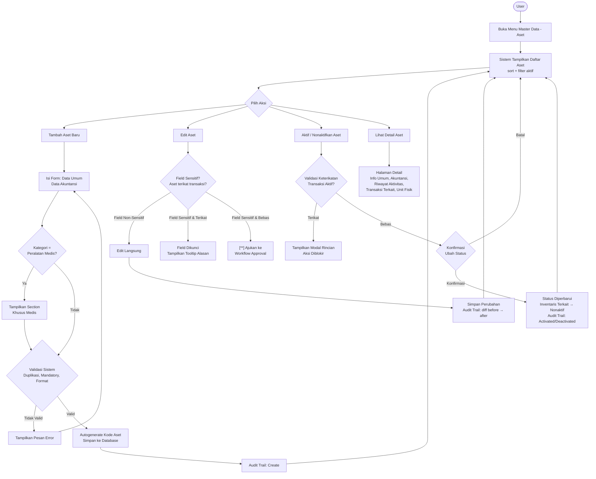

# Product Requirement Document
## Master Data Aset

---

**Related Document**

| Dokumen | Link/Keterangan |
| :------ | :-------------- |
| Design Figma | - |
| BPMN | - |

---

**Document Version**

| Tanggal | Versi | Keterangan |
| :------ | :---- | :--------- |
| 11 Juni 2026 | Versi 1.0 | Pembuatan awal dokumen (Input, Edit, Nonaktif, Daftar, Detail, Riwayat Aktivitas, Integrasi PO) |
| 12 Juni 2026 | Versi 2.0 | Pelengkapan alur bisnis dan behavior di fitur terkait |

---

**Approval**

| PRD Approved By | Nama / Jabatan | Signature, Date |
| :-------------- | :------------- | :-------------- |
| [1] | M. Sulthan Farras Nanz — Chief Strategy & Growth Officer, Tamtech International | - |

**PIC**

| Nama | Role |
| :--- | :--- |
| Ulfa | Product Owner |
| Arif | System Analyst |

---

## 1. Overview / Brief Summary

Modul **Master Data Aset** pada menu Master Data berfungsi sebagai repositori standar seluruh aset rumah sakit/klinik, mencakup:

- **Aset Tetap:** Tanah, Bangunan, Kendaraan, Mesin, Peralatan Medis, Peralatan Non Medis.
- **Aset Tidak Berwujud:** Lisensi, Hak Kekayaan Intelektual, Franchise, Goodwill.

Setiap transaksi pengadaan (PO), penerimaan aset, inventarisasi unit, pemeliharaan/kalibrasi, peminjaman aset, dan jurnal penyusutan/amortisasi **wajib** mereferensi data di modul ini. Hal tersebut memastikan konsistensi nomenklatur, akurasi laporan keuangan, dan kepatuhan terhadap PSAK 16 (Aset Tetap), PSAK 19 (Aset Tidak Berwujud), Permenkes terkait sarana-prasarana, serta standar akreditasi (KARS/JCI) terutama untuk manajemen peralatan medis.

> Master Data Aset menyimpan **definisi/templat aset** (bukan unit fisik individual). Unit fisik per aset dikelola di modul Manajemen Aset, sedangkan nilai perolehan, depresiasi, dan jurnal otomatis dikelola di modul Akuntansi.

---

## 2. Background

Saat ini pencatatan aset di rumah sakit umumnya tersebar di berbagai unit (keuangan, gudang, IT, pemeliharaan) dengan kode dan nomenklatur yang tidak seragam. Akibatnya:

- Duplikasi nama dan kode aset antar transaksi PO, penerimaan, dan inventaris.
- Tidak ada baseline data terstandar untuk perhitungan depresiasi/amortisasi sehingga laporan keuangan tidak konsisten dengan fisik aset.
- Inventarisasi fisik sulit direkonsiliasi dengan catatan akuntansi (gap data sering ditemukan saat audit).
- Manajemen pemeliharaan dan kalibrasi alat medis tidak terhubung dengan data master, meningkatkan risiko keselamatan pasien dan temuan akreditasi.
- Tidak ada audit trail perubahan data master, sehingga pertanggungjawaban perubahan sulit dilacak.
- Aset hasil hibah, KSO, atau merger tidak terbedakan dari aset operasional, mengganggu perlakuan akuntansi.
- Kepatuhan terhadap PSAK 16, PSAK 19, dan standar akreditasi rumah sakit (KARS/JCI) sulit dibuktikan secara sistematis.

Modul Master Data Aset memusatkan repositori aset dengan kontrol approval untuk field sensitif, audit trail lengkap, dan integrasi ke modul PO, Penerimaan, Inventaris, Pemeliharaan, Peminjaman Aset, serta Akuntansi.

---

## 3. In Scope

### 3.1 Scope Definition

**Legend Phase**

| Penanda | Phase |
| :------ | :---- |
| _(tanpa penanda)_ | Phase 1 |
| `[**]` | Phase 2 |
| `[***]` | Phase 3 |
| `[****]` | Phase 4 |

| No | Scope / Area | Phase |
| :- | :----------- | :---- |
| 1 | Daftar Master Data Aset (list, search, filter, sorting, pagination) | Phase 1 |
| 2 | Tambah Master Data Aset + autogenerate Kode Aset | Phase 1 |
| 3 | Detail Aset (info umum, riwayat aktivitas, daftar transaksi terkait) | Phase 1 |
| 4 | Edit Master Data Aset (field non-sensitif) | Phase 1 |
| 5 | Aktifkan / Nonaktifkan Aset (dengan validasi keterikatan transaksi) | Phase 1 |
| 6 | Field akuntansi: Masa Manfaat, Metode Penyusutan, Nilai Residu, Sumber Dana, COA mapping | Phase 1 |
| 7 | Field khusus Peralatan Medis: Klasifikasi Risiko, Nomor Izin Edar (NIE), Kebutuhan Kalibrasi | Phase 1 |
| 8 | Riwayat Aktivitas / Audit Trail (create, edit, activate, deactivate, delete) | Phase 2 `[**]` |
| 9 | Unduh Master Data (Excel) sesuai filter aktif | Phase 2 `[**]` |
| 10 | Quick-Add Aset dari form PO | Phase 2 `[**]` |
| 11 | Import Master Data (bulk via Excel) | Phase 2 `[**]` |
| 12 | Merge Master Data Duplikat | Phase 2 `[**]` |
| 13 | Asset Tag / QR Code | Phase 2 `[**]` |
| 14 | Notifikasi NIE Expired (H-90/H-30/H-0) | Phase 3 `[***]` |
| 15 | Compliance Dashboard NIE | Phase 4 `[****]` |

### 3.2 Out Scope

| No | Scope |
| :- | :---- |
| 1 | Pencatatan unit aset individual / inventarisasi fisik (dibahas di PRD Inventaris Aset). |
| 2 | Transaksi Purchase Order Aset (dibahas di PRD PO Aset). |
| 3 | Transaksi Penerimaan Aset (dibahas di PRD Penerimaan Aset). |
| 4 | Perhitungan dan posting jurnal depresiasi/amortisasi (dibahas di PRD Akuntansi Aset). |
| 5 | Manajemen pemeliharaan & kalibrasi alat medis (dibahas di PRD Pemeliharaan Aset, Phase 2). |
| 6 | Transaksi Peminjaman Aset (dibahas di PRD Peminjaman Aset). |
| 7 | Penghapusbukuan / disposal aset (dibahas di PRD Akuntansi Aset). |

---

## 4. Goals and Metrics

### Goals

- Menyediakan repositori master data aset yang konsisten, akurat, dan terintegrasi lintas modul (PO, Penerimaan, Inventaris, Pemeliharaan, Peminjaman, Akuntansi).
- Memastikan kepatuhan pencatatan aset terhadap PSAK 16, PSAK 19, Permenkes, dan standar akreditasi rumah sakit (KARS/JCI).
- Menyediakan audit trail penuh atas setiap perubahan data master untuk transparansi dan akuntabilitas.
- Mendukung manajemen risiko alat medis melalui klasifikasi risiko dan kebutuhan kalibrasi.

### Metrics

| No | Metrics | Success Criteria |
| :-: | :------ | :--------------- |
| 1 | Konsistensi referensi master | 100% transaksi PO, penerimaan, dan inventaris merujuk ke master data aset (tidak ada free-text aset). |
| 2 | Duplikasi data | 0% duplikasi Nama Aset & Kode Aset. |
| 3 | Waktu pencarian aset | Hasil search/filter tampil < 2 detik. |
| 4 | Audit trail coverage | 100% aksi (create/edit/activate/deactivate/delete) tercatat dengan user, waktu, dan diff field. |
| 5 | Klasifikasi lengkap | 100% aset memiliki Jenis dan Kategori; 100% peralatan medis memiliki Klasifikasi Risiko. |
| 6 | Kesiapan akuntansi | 100% aset (selain Tanah & Goodwill) memiliki Masa Manfaat, Metode Penyusutan, dan akun COA terisi. |
| 7 | Kecepatan operasional | Waktu menambah 1 master data aset baru < 2 menit (excluding field opsional). |

---

## 5. Related Feature

| No | Module | Feature |
| :-: | :----- | :------ |
| 1 | Master Data | Master Data Vendor/Supplier, Master Data Chart of Account (COA), Master Data Unit Kerja |
| 2 | Procurement | Purchase Order (PO) Aset — quick-add master dari form PO |
| 3 | Penerimaan | Penerimaan Aset — referensi master untuk pencatatan unit fisik |
| 4 | Inventory | Inventaris Aset — daftar unit fisik per master, lokasi, status |
| 5 | Pemeliharaan `[**]` | Pemeliharaan & Kalibrasi Alat Medis — reminder berbasis Frekuensi Kalibrasi |
| 6 | Peminjaman `[***]` | Peminjaman Aset — referensi master untuk pencatatan transaksi pinjam |
| 7 | Keuangan `[***]` | Depresiasi/Amortisasi Aset, Jurnal Otomatis — basis perhitungan dari master |
| 8 | Persetujuan `[**]` | Persetujuan Perubahan Master Data Aset (field sensitif) |
| 9 | Pengaturan `[**]` | Pengaturan Approval, Pengaturan Numbering Kode Aset |

---

## 6. Business Process

### A. As-Is

Pencatatan aset tersebar di berbagai unit (keuangan, gudang, IT, pemeliharaan) dengan kode dan nomenklatur yang tidak seragam dan tidak terhubung satu sama lain. Tidak ada sumber referensi tunggal, sehingga duplikasi data, inkonsistensi laporan keuangan, dan kesulitan rekonsiliasi audit menjadi masalah berulang.

### B. To-Be

**1. Penambahan Master Data Aset Baru**
- User (Admin / Staf Keuangan / Kepala Unit Keuangan / Staf Gudang) membuka menu Master Data → Aset, klik tombol Tambah (+).
- Isi field wajib: Nama Aset, Jenis, Kategori, Satuan, dan field akuntansi (Masa Manfaat, Metode Penyusutan, Sumber Dana).
- Bila Kategori = Peralatan Medis → sistem menampilkan section conditional: Klasifikasi Risiko, Memerlukan Kalibrasi, Frekuensi Kalibrasi, NIE.
- Sistem validasi duplikasi Nama Aset (case-insensitive) dan autogenerate Kode Aset. Klik **Simpan** → data masuk daftar dengan status Aktif. Audit trail mencatat aksi Create.

**2. Edit Master Data Aset**
- Field **non-sensitif** dapat diedit langsung: Deskripsi, Merek, Tipe/Model, Masa Manfaat (jika belum ada penyusutan), Metode Penyusutan, Frekuensi Kalibrasi, Standar Regulasi, NIE.
- Field **sensitif** (Nama Aset, Jenis, Kategori, Satuan, Kode Aset) dikunci jika aset sudah terikat transaksi; tooltip menampilkan alasan penguncian.
- `[**]` Perubahan field sensitif memerlukan persetujuan Manajer/CFO (workflow approval). Status sementara: *Menunggu Approval*.
- Klik **Simpan** → perubahan tersimpan; audit trail mencatat diff field (before → after).

**3. Aktifkan / Nonaktifkan Aset**
- Sistem memvalidasi keterikatan: (a) PO/peminjaman/perbaikan/CIP/sewa belum selesai, (b) nilai buku/depresiasi > 0, (c) aset KSO belum berakhir, (d) NIE masih berlaku dan alat masih dipakai.
- Bila terikat → modal peringatan beserta rincian transaksi ditampilkan; aksi diblokir.
- Bila bebas → aset langsung dinonaktifkan. Inventaris terkait otomatis ditandai Nonaktif. Aset nonaktif tidak muncul di dropdown PO/Penerimaan baru, namun tetap visible di laporan historis.

**4. Daftar, Pencarian, Filter & Detail**
- Daftar default diurutkan Nama Aset ascending. Search by Nama/Kode/Merek; filter by Jenis, Kategori (multi), Status, Sumber Dana.
- Halaman Detail menampilkan: semua field, riwayat aktivitas, daftar transaksi terkait (link ke PO, Penerimaan, Inventaris, Peminjaman, Pemeliharaan), dan daftar unit fisik di Inventaris.

---

## 7. Main Flow



**Alur Tambah Aset Baru**

1. Klik tombol **( + )** → form Tambah Aset muncul (3 section: Data Umum, Data Akuntansi, Data Khusus Medis jika relevan).
2. Isi semua field mandatory → klik **Simpan**.
3. Sistem validasi → jika valid: Kode Aset ter-autogenerate, data tersimpan, audit trail mencatat Create.

**Alur Edit Aset**

1. Klik baris atau tombol **Edit** → form Edit Aset terbuka.
2. Field non-sensitif dapat diedit langsung; field sensitif dikunci bila aset terikat transaksi.
3. `[**]` Perubahan field sensitif memicu workflow approval (status: *Menunggu Approval*).
4. Simpan → audit trail mencatat diff per field.

**Alur Aktifkan / Nonaktifkan**

1. Toggle status di baris daftar atau halaman detail.
2. Sistem cek keterikatan → jika terikat: tampilkan modal peringatan, aksi diblokir.
3. Jika bebas → konfirmasi → status berubah, inventaris terkait otomatis ditandai Nonaktif.

---

## 8. Requirement

### Level Prioritas

| Level | Deskripsi |
| :---- | :-------- |
| P0 | Critical — bagian dari MVP Product |
| P1 | Must Have — eksistensinya tidak sefatal P0 |
| P2 | Should Have — secara signifikan meningkatkan kenyamanan pengguna |
| P3 | Low — fitur tambahan atau kosmetik product |
| P4 | Enhancement — inovasi masa depan |

---

### US-001 — Daftar Master Data Aset

**User Story**
Sebagai user (Admin/Keuangan/Gudang/Manajer), saya ingin melihat seluruh master data aset agar mudah dicari dan dikelola lintas modul.

**Priority:** P0

**Criteria Details**

- Halaman Master Data → Aset menampilkan kolom: No, Kode Aset, Nama Aset, Jenis, Kategori, Satuan, Status, Aksi.
- Kolom Kode Aset, Nama Aset, Jenis, Kategori, Status dapat diklik untuk sorting ascending/descending.
- Default sort: Nama Aset ascending.
- Search by Nama Aset, Kode Aset.
- Filter: Jenis (Aset Tetap/Tidak Berwujud), Kategori (multi-select), Status, Sumber Dana (multi-select).
- Pagination: 10 / 20 / 50 / 100 data per halaman.
- Setiap baris memiliki tombol: Detail, Edit, Aktif/Nonaktif (toggle).
- Hak akses tombol berbeda per role (lihat Role Access Matrix di Data Requirements).

**Acceptance Criteria**
- Daftar tampil < 2 detik; sorting, search, dan filter berfungsi sesuai spesifikasi.

---

### US-002 — Tambah Master Data Aset

**User Story**
Sebagai staf keuangan/gudang, saya ingin menambahkan aset baru ke master data agar dapat dipakai di transaksi PO, Penerimaan, dan Inventaris.

**Priority:** P0

**Criteria Details**

- Klik tombol (+) menampilkan form Tambah Aset.
- Form terdiri dari 3 section: Data Umum, Data Akuntansi, Data Khusus Medis (muncul *conditional* jika Kategori = Peralatan Medis).
- Sistem validasi duplikasi Nama Aset (case-insensitive) dan format field.
- Sistem autogenerate Kode Aset (lihat ketentuan di Data Requirements E.1); dapat di-override manual saat create.
- Sistem auto-fill Akun COA dan default Masa Manfaat berdasarkan kategori.
- Klik **Simpan** → data masuk daftar dengan status Aktif default.

**Acceptance Criteria**
- Data tersimpan; Kode Aset ter-generate; muncul di Daftar Aset; audit trail mencatat aksi Create.

---

### US-003 — Detail Master Data Aset

**User Story**
Sebagai user, saya ingin melihat detail lengkap aset agar dapat memahami spesifikasi, riwayat, dan keterhubungan transaksi.

**Priority:** P0

**Criteria Details**

- Klik baris atau tombol **Detail** membuka halaman detail.
- Section **Info Umum:** semua field master.
- Section **Akuntansi:** COA mapping, Masa Manfaat, Metode Penyusutan, Sumber Dana.
- Section **Riwayat Aktivitas:** semua aksi (created, edited dengan diff, activated, deactivated, deleted, restored).
- Section **Transaksi Terkait:** daftar PO, Penerimaan, Inventaris, Peminjaman, Pemeliharaan terkait (link ke modul masing-masing).
- Section **Unit Fisik:** daftar unit aset di Inventaris (`[**]` Phase 2: live link).

**Acceptance Criteria**
- Detail lengkap tampil dengan semua section dan link transaksi berfungsi.

---

### US-004 — Edit Master Data Aset

**User Story**
Sebagai user, saya ingin mengedit data aset agar informasi tetap akurat sesuai kondisi terkini.

**Priority:** P0

**Criteria Details**

- Field **non-sensitif** dapat diedit bebas: Deskripsi, Merek, Tipe/Model, Masa Manfaat (jika depresiasi belum berjalan), Metode Penyusutan, Frekuensi Kalibrasi, NIE, Standar Regulasi.
- Field **sensitif** (Nama Aset, Kode Aset, Jenis, Kategori, Satuan) dikunci dengan tooltip alasan jika aset terikat transaksi.
- `[**]` Perubahan field sensitif memicu workflow approval (Manajer/CFO) sebelum efektif. Status sementara: *Menunggu Approval*.
- Klik **Simpan** → perubahan tersimpan; audit trail mencatat diff per field.

**Acceptance Criteria**
- Perubahan tersimpan; field sensitif terkunci sesuai aturan; audit trail mencatat diff.

---

### US-005 — Aktifkan / Nonaktifkan Aset

**User Story**
Sebagai user, saya ingin mengubah status aset agar dapat mengontrol penggunaan di transaksi yang akan datang.

**Priority:** P0

**Criteria Details**

- Toggle status pada baris daftar atau di halaman detail.
- Validasi keterikatan:
  - (a) PO/Peminjaman/Perbaikan/CIP/Sewa belum selesai.
  - (b) Depresiasi/amortisasi > 0.
  - (c) Aset KSO belum berakhir.
  - (d) NIE masih berlaku dan alat masih dipakai.
- Jika terikat → sistem menampilkan modal rincian dampak dan transaksi terkait; aksi diblokir.
- Jika bebas → status langsung berubah; inventaris yang terhubung otomatis ditandai Nonaktif.
- Aset nonaktif: tidak muncul di dropdown PO/Penerimaan baru; tetap visible di laporan dan transaksi historis.

**Acceptance Criteria**
- Status berubah sesuai validasi; aset nonaktif tidak muncul di pilihan transaksi baru.

---

### US-006 — Pencarian & Filter

**User Story**
Sebagai user, saya ingin mencari dan memfilter aset agar penemuan data cepat.

**Priority:** P0

**Criteria Details**

- Search by Nama Aset, Kode Aset, Merek (min 3 karakter).
- Filter: Jenis, Kategori (multi), Status, Sumber Dana (multi).
- Hasil tampil < 2 detik untuk 50.000 record.
- Filter aktif disimpan pada session yang sama (tidak reset saat refresh).

**Acceptance Criteria**
- Hasil sesuai keyword/filter; response time < 2 detik.

---

### US-007 — Unduh Master Data `[**]` (Phase 2)

**User Story**
Sebagai user, saya ingin mengunduh data aset untuk keperluan laporan offline atau verifikasi audit.

**Priority:** P0

**Criteria Details**

- Tombol **Unduh** mengekspor data sesuai filter aktif ke format Excel (.xlsx).
- Kolom unduhan: semua field master + Tanggal Created + User Created + Tanggal Last Edit.
- Maksimal 50.000 baris per unduhan; bila melebihi → sistem prompt untuk filter lebih spesifik.

**Acceptance Criteria**
- File Excel terunduh sesuai filter; format kolom sesuai spesifikasi.

---

### US-008 — Riwayat Aktivitas / Audit Trail `[**]` (Phase 2)

**User Story**
Sebagai Admin/Auditor, saya ingin melihat siapa dan kapan data master diubah agar kebutuhan audit dan akreditasi terpenuhi.

**Priority:** P0

**Criteria Details**

- Setiap aksi tercatat: Created, Edited (dengan diff before → after per field), Activated, Deactivated, Deleted, Restored.
- Format: `[Aksi] oleh [Nama User] pada dd/mm/yyyy HH:mm`.
- Audit trail bersifat **append-only**; tidak dapat dihapus user.
- Retensi audit trail minimum **5 tahun** (standar audit RS).

**Acceptance Criteria**
- Setiap aksi tercatat lengkap; audit trail tidak dapat dimanipulasi user.

---

### US-009 — Quick-Add dari PO `[**]` (Phase 2)

**User Story**
Sebagai staf gudang/keuangan, saat membuat PO dan aset belum ada di master, saya ingin menambahkan master baru langsung tanpa keluar dari form PO.

**Priority:** P1

**Criteria Details**

- Tombol **Tambah Master Data Aset Baru** muncul di dropdown aset pada form PO.
- Klik tombol → modal form Tambah Aset terbuka; setelah Simpan, modal tertutup dan aset baru terpilih otomatis di form PO.
- Validasi sama dengan jalur normal.

**Acceptance Criteria**
- Aset baru dapat ditambahkan tanpa kehilangan konteks form PO.

---

### US-010 — Import Master Data `[**]` (Phase 2)

**User Story**
Sebagai Admin, saya ingin melakukan import bulk untuk migrasi data awal atau penambahan masif.

**Priority:** P1

**Criteria Details**

- Tombol **Import** membuka modal upload.
- Template Excel resmi disediakan (dengan dropdown referensi kategori).
- Upload file → sistem validasi (duplikasi, format, mandatory, referensi) → preview hasil.
- User konfirmasi → import dijalankan; baris valid masuk, baris error muncul di error report (dapat diunduh).
- Maksimal 5.000 baris per import.

**Acceptance Criteria**
- Data bulk berhasil diimpor; error report jelas per baris.

---

### US-011 — Merge Master Data Duplikat `[**]` (Phase 2)

**User Story**
Sebagai Admin, saya ingin menggabungkan record duplikat dari data legacy agar konsistensi pulih tanpa menghancurkan referensi transaksi.

**Priority:** P2

**Criteria Details**

- Admin pilih 2+ record duplikat → klik **Merge** → pilih record "primer" (yang dipertahankan).
- Sistem mengalihkan seluruh referensi transaksi dari record sekunder ke record primer.
- Record sekunder otomatis dinonaktifkan permanen (tidak dapat diaktifkan kembali) dan ditandai label *"Merged into [Kode Aset Primer]"*.
- Audit trail merekam aksi merge beserta daftar transaksi yang dialihkan.

**Acceptance Criteria**
- Referensi transaksi teralihkan dengan benar; tidak ada broken link.

---

### US-012 — Asset Tag / QR Code `[**]` (Phase 2)

**User Story**
Sebagai staf gudang/inventaris, saya ingin mencetak label QR untuk aset fisik agar memudahkan stock opname dan tracking.

**Priority:** P3

**Criteria Details**

- Generate QR berisi Kode Aset (per unit fisik dari Inventaris).
- Cetak per aset atau bulk (sesuai filter).
- Format label: Kode Aset, Nama Aset, QR (mengarah ke halaman detail di aplikasi mobile).

**Acceptance Criteria**
- QR Code ter-generate dan label tercetak.

---

## 9. Data Requirements

### A. Daftar Aset (List)

| No | Kolom | Sumber Data | Keterangan |
| :- | :---- | :---------- | :--------- |
| 1 | No | Urutan 1, 2, 3... per halaman | - |
| 2 | Kode Aset | Autogenerated saat create | Format detail di section E.1 |
| 3 | Nama Aset | Master data aset → Nama Aset | - |
| 4 | Jenis Aset | Master → Jenis | Aset Tetap / Aset Tidak Berwujud |
| 5 | Kategori | Master → Kategori | - |
| 6 | Satuan | Master → Satuan | - |
| 7 | Status | Master → Status | Aktif (badge hijau) / Tidak Aktif (badge abu-abu) |
| 8 | Aksi | Tombol per baris | Detail, Edit, Aktif/Nonaktif (toggle); di-disable sesuai role |

---

### B. Form Tambah / Edit Aset — Section Data Umum

| No | Field | Tipe | Aturan |
| :- | :---- | :--- | :----- |
| 1 | Kode Aset | Autogenerate / Text Input | Default: autogenerate (lihat E.1). Mandatory. Dapat di-override manual saat create; tidak bisa diedit setelah aset terikat transaksi. Validasi unik global. |
| 2 | Nama Aset | Text Input | Default: kosong. Min 3, max 100 karakter. Mandatory. Validasi unik case-insensitive. |
| 3 | Jenis Aset | Dropdown | Default: kosong. Mandatory. Pilihan: Aset Tetap, Aset Tidak Berwujud. |
| 4 | Kategori Aset | Dropdown (conditional) | Default: kosong. Mandatory. Sesuai Jenis (lihat Lampiran 1). |
| 5 | Satuan | Dropdown | Default: kosong. Mandatory. Pilihan: M2, M3, Set, Pack, Pcs, Unit, Botol, Lembar, Kotak, Lainnya. |
| 6 | Merek | Text Input | Default: kosong. Max 50 karakter. Optional. |
| 7 | Tipe / Model | Text Input | Default: kosong. Max 50 karakter. Optional. |
| 8 | Deskripsi / Spesifikasi | Text Area | Default: kosong. Max 500 karakter. Optional. |
| 9 | Status | Radio Button | Default: Aktif (saat create). Mandatory. Pilihan: Aktif, Tidak Aktif. |

---

### C. Form Tambah / Edit Aset — Section Data Akuntansi

| No | Field | Tipe | Aturan |
| :- | :---- | :--- | :----- |
| 1 | Masa Manfaat (Tahun) | Numerik Input | Default: autofill per kategori (lihat Lampiran 2). Mandatory (kecuali Tanah dan Goodwill). Min 1, max 50. Referensi: PSAK 16 dan PMK terkait umur ekonomis aset. |
| 2 | Metode Penyusutan | Dropdown | Default: Garis Lurus (autofill); Tanah/Goodwill → Tanpa Penyusutan. Mandatory. Pilihan: Garis Lurus, Saldo Menurun, Unit Produksi, Tanpa Penyusutan. |
| 3 | Nilai Residu (%) | Numerik Input | Default: 0. Optional. Range 0–100. Persentase dari nilai perolehan sebagai nilai residu untuk perhitungan depresiasi. |
| 4 | Sumber Dana | Dropdown | Default: kosong. Optional. Pilihan: Operasional, APBN, APBD, Hibah, CSR, KSO, Pinjaman, Lainnya. Kritikal untuk audit RS dan perlakuan akuntansi (mis. aset KSO tidak disusutkan RS). |

---

### D. Form Tambah / Edit Aset — Section Khusus Peralatan Medis

> Section ini muncul **conditional** hanya jika Kategori = Peralatan Medis.

| No | Field | Tipe | Aturan |
| :- | :---- | :--- | :----- |
| 1 | Klasifikasi Risiko | Dropdown | Default: kosong. Mandatory. Pilihan: Kelas I (risiko rendah), Kelas II (risiko sedang), Kelas III (risiko tinggi). Mengacu Permenkes No. 62/2017. |
| 2 | Memerlukan Kalibrasi | Radio Button | Default: kosong. Mandatory. Pilihan: Ya / Tidak. |
| 3 | Frekuensi Kalibrasi (Bulan) | Numerik Input | Default: 12 (jika Memerlukan Kalibrasi = Ya). Mandatory jika Ya; disabled jika Tidak. Min 1, max 60. Basis jadwal kalibrasi di modul Pemeliharaan (Phase 2). |
| 4 | Nomor Izin Edar (NIE) | Text Input | Default: kosong. Optional (rekomendasi diisi untuk alkes wajib NIE Kemenkes). Max 50 karakter. |
| 5 | Tanggal Berakhir NIE | Date Picker | Default: kosong. Optional. `[***]` Phase 3: trigger notifikasi H-90/H-30/H-0. |
| 6 | Standar Regulasi | Multi-select Dropdown | Default: kosong. Optional. Pilihan: Permenkes 54/2015, KARS, JCI, ISO 13485, Lainnya. |

---

### E. Ketentuan Khusus

#### E.1 Format & Numbering Kode Aset

| Elemen | Keterangan |
| :----- | :--------- |
| Format | `[KodeJenis][KodeKategori]-YYYY-NNNN` (running 4 digit) |
| Kode Jenis | AT = Aset Tetap, AB = Aset Tidak Berwujud |
| Kode Kategori | TN=Tanah, BG=Bangunan, KD=Kendaraan, MS=Mesin, PM=Peralatan Medis, PN=Peralatan Non Medis, LS=Lisensi, HK=HKI, FR=Franchise, GW=Goodwill |
| Contoh | `ATPM-2026-0001` (Aset Tetap, Peralatan Medis, tahun 2026, urut ke-1) |
| Reset | Setiap pergantian tahun, urutan reset ke 0001 |
| Timing | Generated saat klik Simpan; dapat di-override manual sebelum Simpan |

#### E.2 Role Access Matrix

| Role | Akses |
| :--- | :---- |
| Admin | Full access: Lihat, Tambah, Edit (semua field), Aktif/Nonaktif, Import, Unduh, Audit Trail |
| Kepala Unit Keuangan / CFO | Lihat, Tambah, Edit (semua field termasuk akuntansi), Aktif/Nonaktif, Approve perubahan field sensitif `[**]`, Unduh, Audit Trail |
| Staf Keuangan | Lihat, Tambah, Edit (field non-sensitif), Aktif/Nonaktif (jika tidak terikat), Unduh |
| Staf Gudang / Inventaris | Lihat, Tambah, Edit (field non-sensitif & non-akuntansi), Aktif/Nonaktif (jika tidak terikat), Unduh |
| Manajer | Lihat, Aktif/Nonaktif, Approve perubahan field sensitif `[**]`, Unduh, Audit Trail |
| Auditor | Lihat (read-only), Audit Trail (read-only), Unduh |

---

## 10. Validasi

| Fitur | Kondisi | Pesan Error |
| :---- | :------ | :---------- |
| Tambah Aset | Nama Aset sudah ada (case-insensitive). | "Nama aset sudah terdaftar di master data. Gunakan nama lain atau aktifkan aset yang sudah ada." |
| Tambah / Edit Aset | Field mandatory belum diisi saat Simpan. | "Field [Nama Field] wajib diisi." |
| Tambah Aset | Karakter di luar batas (min/max). | "Nama aset minimal 3, maksimal 100 karakter." |
| Tambah Aset | Kode Aset manual sudah digunakan. | "Kode aset sudah digunakan. Gunakan kode lain atau biarkan kosong untuk autogenerate." |
| Tambah / Edit (Peralatan Medis) | Klasifikasi Risiko kosong saat Kategori = Peralatan Medis. | "Klasifikasi Risiko wajib diisi untuk kategori Peralatan Medis." |
| Edit Aset | User mencoba edit field sensitif pada aset yang sudah terikat transaksi. | "Field [Nama Field] tidak dapat diedit karena aset sudah digunakan dalam transaksi. Hubungi Admin untuk perubahan via workflow approval." |
| Nonaktifkan Aset | Aset masih terikat transaksi aktif (PO, Peminjaman, Perbaikan, CIP/Sewa, KSO). | "Aset masih digunakan di transaksi: [list]. Selesaikan transaksi terlebih dahulu sebelum menonaktifkan." |
| Nonaktifkan Aset | Aset masih memiliki nilai buku / depresiasi belum nol. | "Aset masih memiliki nilai buku > 0. Lakukan penghapusbukuan/disposal terlebih dahulu di modul Akuntansi." |
| Kategori = Goodwill | User mencoba mengisi Masa Manfaat. | "Goodwill tidak diamortisasi (PSAK 22). Field Masa Manfaat di-disable." |
| Import Master Data | Format file tidak sesuai template. | "Format file tidak sesuai. Gunakan template Excel resmi yang dapat diunduh dari tombol Template." |
| Import Master Data | Baris data duplikat dengan master existing. | "Baris [n]: Nama Aset '[X]' sudah ada di master data. Baris dilewati." |
| Import Master Data | Field mandatory kosong di baris. | "Baris [n]: Field [Y] wajib diisi." |
| Unduh Master Data | Hasil filter melebihi 50.000 baris. | "Data terlalu banyak. Gunakan filter lebih spesifik (maksimal 50.000 baris per unduhan)." |

---

## 11. Case & Mitigasi

| No | Case | Dampak | Mitigasi |
| :-: | :--- | :----- | :------- |
| 1 | Aset sudah pernah dipakai di PO/inventaris, ternyata kategori salah. | Inkonsistensi data laporan keuangan & akuntansi. | Field Kategori dikunci untuk aset terikat transaksi. `[**]` Workflow approval perubahan field sensitif dengan persetujuan Manajer/CFO + audit trail. |
| 2 | Aset dari KSO/merger/hibah perlu pemisahan perlakuan akuntansi. | Perhitungan depresiasi & laporan keuangan keliru. | Field Sumber Dana mandatory dengan opsi KSO/Hibah/Akuisisi. Aset KSO tidak disusutkan RS; aset hibah dinilai pada nilai wajar saat penerimaan. |
| 3 | Aset peralatan medis tidak terjadwal kalibrasi. | Risiko keselamatan pasien; potensi gagal akreditasi (KARS/JCI); risiko hukum. | Field Memerlukan Kalibrasi + Frekuensi Kalibrasi mandatory untuk Peralatan Medis. `[**]` Integrasi ke modul Pemeliharaan untuk reminder otomatis H-30/H-14/H-7/H-0. |
| 4 | Banyak data duplikat dari migrasi data legacy. | Pencatatan tumpang tindih; sulit rekonsiliasi. | `[**]` Fitur Merge Master Data — admin menggabungkan record duplikat; referensi transaksi diarahkan ke record primer; record sekunder dinonaktifkan permanen. |
| 5 | Aset hibah belum jelas nilainya saat input master. | Salah nilai buku awal; salah depresiasi. | Master hanya menyimpan definisi/templat; nilai perolehan dicatat di modul Penerimaan Aset berdasarkan nilai wajar/appraisal independen. |
| 6 | Alat medis dengan NIE sudah expired tapi masih beroperasi. | Risiko hukum (Permenkes 62/2017); temuan akreditasi; pembatalan klaim BPJS. | `[***]` Notifikasi otomatis H-90/H-30/H-0 ke staf pemeliharaan & manajer. `[****]` Compliance Dashboard menampilkan NIE expired. |
| 7 | Aset dijual/dihapus buku di akuntansi, tetapi master masih aktif. | Master tidak sesuai fisik; potensi salah pakai di transaksi baru. | Saat status di Inventaris Aset menjadi "Dihapus Buku" untuk seluruh unit, sistem otomatis trigger nonaktifkan master (jika tidak ada unit aktif lain). |
| 8 | User mencoba bypass validasi via API langsung untuk edit field sensitif. | Risiko integritas data; manipulasi tanpa approval. | Validasi field sensitif diterapkan di backend (bukan hanya frontend). Audit log mencatat semua percobaan akses (sukses/gagal) beserta IP dan user-agent. |
| 9 | Transfer aset antar unit kerja (mis. dari Rawat Inap ke IGD). | Master tidak berubah; lokasi/penanggung jawab unit berubah. | Transfer dikelola di modul Inventaris Aset (per unit fisik). Master data tidak terdampak. |
| 10 | Aset dalam proses perbaikan/CIP dinonaktifkan oleh user. | Inventaris dan jurnal CIP terganggu. | Validasi keterikatan: status perbaikan/CIP di-block. Hanya dapat dinonaktifkan setelah perbaikan/CIP selesai. |

---

## 12. Lampiran / Catatan

### Lampiran 1 — Mapping Jenis & Kategori Aset

| Jenis | Kategori |
| :---- | :------- |
| Aset Tetap | Tanah |
| Aset Tetap | Bangunan |
| Aset Tetap | Kendaraan |
| Aset Tetap | Mesin |
| Aset Tetap | Peralatan Medis |
| Aset Tetap | Peralatan Non Medis |
| Aset Tidak Berwujud | Lisensi |
| Aset Tidak Berwujud | Hak Kekayaan Intelektual |
| Aset Tidak Berwujud | Franchise |
| Aset Tidak Berwujud | Goodwill |

---

### Lampiran 2 — Referensi Default Masa Manfaat

_(Mengacu PSAK 16, PMK Penyusutan, dan praktik umum RS)_

| Kategori Aset | Masa Manfaat (Tahun) | Metode Penyusutan |
| :------------ | :------------------- | :---------------- |
| Tanah | Tidak terbatas | Tanpa Penyusutan |
| Bangunan | 10–20 (sesuai jenis bangunan) | Garis Lurus |
| Kendaraan | 4–8 (sesuai jenis kendaraan) | Garis Lurus |
| Mesin | 8–16 | Garis Lurus |
| Peralatan Medis | 4–8 (sesuai jenis alat) | Garis Lurus |
| Peralatan Non Medis | 4 | Garis Lurus |
| Lisensi Software | Sesuai masa lisensi (umumnya 1–5) | Garis Lurus |
| Hak Kekayaan Intelektual | Sesuai masa perlindungan | Garis Lurus |
| Franchise | Sesuai masa perjanjian | Garis Lurus |
| Goodwill | Tidak diamortisasi | Uji Impairment Tahunan |

---

### Lampiran 3 — Metode Perhitungan Penyusutan

#### 1. Garis Lurus (Straight Line)

Nilai aset disusutkan dengan jumlah yang sama setiap periode selama masa manfaatnya.

**Rumus:**

```
Penyusutan Tahunan = (Harga Perolehan - Nilai Residu) / Masa Manfaat
```

**Contoh — Ambulans:**
- Harga Perolehan: Rp 400.000.000
- Nilai Residu: Rp 40.000.000
- Masa Manfaat: 8 tahun
- Penyusutan per tahun: (400.000.000 - 40.000.000) / 8 = **Rp 45.000.000**

| Tahun | Nilai Buku Awal | Penyusutan | Nilai Buku Akhir |
| :---- | :-------------- | :--------- | :--------------- |
| 1 | Rp 400.000.000 | Rp 45.000.000 | Rp 355.000.000 |
| 2 | Rp 355.000.000 | Rp 45.000.000 | Rp 310.000.000 |
| 3 | Rp 310.000.000 | Rp 45.000.000 | Rp 265.000.000 |
| … | … | … | … |
| 8 | Rp 85.000.000 | Rp 45.000.000 | Rp 40.000.000 |

---

#### 2. Saldo Menurun (Declining Balance)

Penyusutan dihitung berdasarkan nilai buku yang tersisa; beban penyusutan lebih besar di tahun-tahun awal.

**Rumus:**

```
Penyusutan = Nilai Buku Awal × Tarif Penyusutan
```

**Contoh — Mesin Laundry:**
- Harga Perolehan: Rp 100.000.000
- Tarif Penyusutan: 25% per tahun

| Tahun | Nilai Buku Awal | Penyusutan (25%) | Nilai Buku Akhir |
| :---- | :-------------- | :--------------- | :--------------- |
| 1 | Rp 100.000.000 | Rp 25.000.000 | Rp 75.000.000 |
| 2 | Rp 75.000.000 | Rp 18.750.000 | Rp 56.250.000 |
| 3 | Rp 56.250.000 | Rp 14.062.500 | Rp 42.187.500 |
| 4 | Rp 42.187.500 | Rp 10.546.875 | Rp 31.640.625 |

---

#### 3. Unit Produksi (Units of Production)

Penyusutan dihitung berdasarkan tingkat penggunaan aset, bukan waktu.

**Rumus:**

```
Tarif per Unit = (Harga Perolehan - Nilai Residu) / Total Kapasitas Produksi
Penyusutan Periode = Tarif per Unit × Jumlah Unit yang Digunakan
```

**Contoh — Mesin Sterilisasi:**
- Harga Perolehan: Rp 120.000.000
- Nilai Residu: Rp 20.000.000
- Kapasitas Total: 100.000 siklus
- Tarif per siklus: (120.000.000 - 20.000.000) / 100.000 = **Rp 1.000**

| Periode | Pemakaian | Tarif | Penyusutan |
| :------ | :-------- | :---- | :--------- |
| Jan | 500 siklus | Rp 1.000 | Rp 500.000 |
| Feb | 800 siklus | Rp 1.000 | Rp 800.000 |
| Mar | 600 siklus | Rp 1.000 | Rp 600.000 |

---

### Lampiran 4 — Catatan Compliance & Best Practice Rumah Sakit

- **PSAK 16 (Aset Tetap):** Tanah tidak disusutkan; aset selain Tanah disusutkan secara sistematis selama masa manfaat; metode penyusutan harus mencerminkan pola pemakaian.
- **PSAK 19 (Aset Tak Berwujud):** Lisensi/HKI/Franchise diamortisasi selama masa manfaat; Goodwill tidak diamortisasi melainkan diuji impairment tahunan (PSAK 22).
- **Permenkes No. 62/2017 (Izin Edar Alat Kesehatan):** Alat kesehatan dikelompokkan menjadi Kelas I (risiko rendah), II (sedang), dan III (tinggi). NIE wajib untuk peredaran legal.
- **Permenkes No. 54/2015 (Kalibrasi Alat Kesehatan):** Alat ukur kesehatan wajib dikalibrasi minimal 1 kali setahun atau sesuai rekomendasi pabrikan.
- **Standar Akreditasi KARS/JCI:** RS wajib memiliki sistem inventarisasi peralatan medis, jadwal pemeliharaan & kalibrasi terdokumentasi, serta mekanisme pelaporan insiden alat.
- **Aset KSO:** Tidak dicatat sebagai aset RS dan tidak disusutkan oleh RS (tergantung perjanjian KSO).
- **Aset Hibah:** Dicatat pada nilai wajar saat penerimaan (PSAK 16); disusutkan normal.
- **Aset Merger/Akuisisi:** Goodwill diuji impairment tahunan, tidak diamortisasi (PSAK 22).
- **Retensi Audit Trail:** Minimum 5 tahun untuk dokumen keuangan (UU 8/1997 tentang Dokumen Perusahaan).

---

## Change Log

| No | Item | Perubahan | Tanggal |
| :-: | :--- | :-------- | :------ |
| 1 | Master Data Aset | Versi 1.0 - Pembuatan awal dokumen (Input, Edit, Nonaktif, Daftar, Detail, Riwayat Aktivitas, Integrasi PO). | 11 Juni 2026 |
| 2 | Master Data Aset | Versi 2.0 - Pelengkapan alur bisnis dan behavior di fitur terkait. | 12 Juni 2026 |
