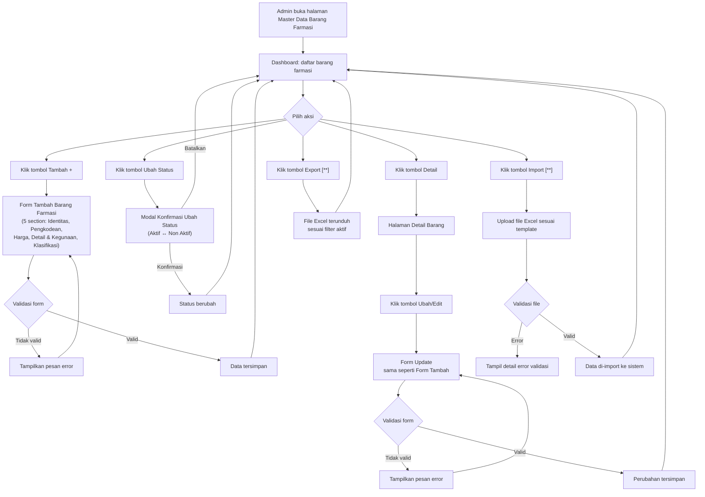

# PRD — Master Data Barang Farmasi

## Informasi Dokumen

| Atribut | Detail |
| --- | --- |
| Nama Produk | Master Data Barang Farmasi |
| Versi | 1.0 |
| Tanggal | 26 Mei 2026 |
| Status | Draft |
| Dibuat oleh | M. Sulthan Farras Nanz |
| Disetujui oleh | Sulthan Farras |
| Tanggal Persetujuan | 21 Oktober 2025 |
| PIC — Product Owner | Ulfa |
| PIC — System Analyst | Arif |

---

## Dokumen Terkait

| Nama Dokumen | Tautan |
| --- | --- |
| Design Figma | _(lihat tautan Figma di sumber)_ |
| MindMap Fitur RS | _(lihat tautan MindMap di sumber)_ |
| MindMap Barang Farmasi | _(lihat tautan MindMap Barang Farmasi di sumber)_ |
| Referensi BPJS | _(lihat tautan referensi BPJS di sumber)_ |
| Referensi Fornas | _(lihat tautan referensi Fornas di sumber)_ |
| Template Import Master Data Barang Farmasi | _(lihat tautan Template Import di sumber)_ |

---

## A. Latar Belakang

Pengelolaan data barang farmasi di rumah sakit selama ini masih dilakukan secara terpisah dan tidak terstandarisasi, menyebabkan inkonsistensi data antara bagian farmasi, keuangan, dan sistem peresepan. Kebutuhan integrasi dengan standar regulatif nasional seperti SATUSEHAT KFA dan BPJS DPHO semakin mendesak seiring meningkatnya tuntutan kepatuhan regulasi.

Modul Master Data Barang Farmasi hadir untuk menyediakan satu sumber kebenaran (single source of truth) bagi seluruh data obat di rumah sakit, sekaligus memfasilitasi integrasi dengan sistem eksternal secara terstruktur.

---

## B. Ruang Lingkup

### Dalam Scope

| Fase | Fitur |
| --- | --- |
| Phase 1 | Dashboard daftar barang farmasi |
| Phase 1 | Tambah barang farmasi |
| Phase 1 | Update/edit barang farmasi |
| Phase 1 | Riwayat Aktivitas (audit trail) |
| Phase 1 | Kelola Status (Aktif / Non Aktif) |
| Phase 2 [**] | Import data via Excel |
| Phase 2 [**] | Export data via Excel |
| Phase 3 [***] | Integrasi SATUSEHAT KFA |
| Phase 3 [***] | Integrasi BPJS DPHO |

### Di Luar Scope

- Modul Inventori / Gudang Farmasi
- Master Data Pabrik, Sediaan, Farmaco, Satuan, Kategori (dikelola di modul terpisah)
- Pengadaan farmasi
- Peresepan / EMR

---

## C. Tujuan

1. Menyediakan data barang farmasi yang terpusat dan terstandar di seluruh modul sistem.
2. Menjaga konsistensi data obat antara farmasi, keuangan, dan peresepan.
3. Memfasilitasi validasi regulatif (SATUSEHAT KFA, BPJS DPHO, Fornas).
4. Mendukung integrasi lintas modul (Inventori, Peresepan/EMR, Keuangan).
5. Menyediakan fasilitas import massal data barang farmasi melalui template Excel.

---

## D. Fitur Terkait

| Modul | Keterangan |
| --- | --- |
| Master Data — Pabrik | Sumber data dropdown field Pabrik |
| Master Data — Sediaan | Sumber data dropdown field Jenis Sediaan |
| Master Data — Farmaco | Sumber data dropdown field Farmakoterapi |
| Master Data — Satuan | Sumber data dropdown Satuan Dosis & Satuan Yang Digunakan |
| Master Data — Kategori | Sumber data dropdown field Kategori |
| Master Data — Grup Farmasi | Referensi pengelompokan obat |
| Master Data — Kelas Terapi | Referensi kelas terapi obat |
| Master Data — ROA Obat | Referensi route of administration |
| Inventori / Gudang Farmasi | Mengonsumsi data barang farmasi untuk stok |
| Peresepan / EMR | Mengonsumsi data barang farmasi untuk peresepan |
| Keuangan | Mengonsumsi data HNA dan harga untuk transaksi |
| Integrasi SATUSEHAT KFA | [***] Sinkronisasi kode obat nasional |
| Integrasi BPJS DPHO | [***] Sinkronisasi kode obat BPJS, harga plafon, restriksi |
| Pelaporan | Mengonsumsi data barang farmasi untuk laporan |

---

## E. Proses Bisnis

### E.1 As-Is

Sebelum sistem ini diimplementasikan, pendataan barang farmasi dilakukan secara manual atau menggunakan spreadsheet terpisah per bagian. Tidak ada sumber data tunggal yang menjadi acuan, sehingga:

- Data obat di farmasi, keuangan, dan peresepan sering tidak konsisten.
- Pembaruan data harus dilakukan berulang di banyak tempat.
- Tidak ada mekanisme validasi terhadap kode BPJS atau SATUSEHAT.
- Riwayat perubahan data tidak tercatat secara sistematis.

### E.2 To-Be

---

## F. Persyaratan Fungsional (User Stories)

### US-001 — Dashboard Barang Farmasi

| Atribut | Detail |
| --- | --- |
| ID | US-001 |
| Nama | Dashboard Barang Farmasi |
| Sebagai | Admin Master Data |
| Saya ingin | melihat daftar barang farmasi beserta informasi ringkasnya |
| Sehingga | saya dapat memantau dan mengelola data barang farmasi secara efisien |
| Prioritas | P0 |
| Fase | Phase 1 |

**Kriteria Penerimaan:**
- Halaman menampilkan tabel daftar barang farmasi dengan kolom: Nama Barang, Kategori, Dosis, Jenis Sediaan, Nama Pabrik, Status Fornas, Status Barang.
- Urutan default: barang Aktif ditampilkan di atas, lalu Non-Aktif, keduanya diurutkan Ascending berdasarkan Nama Barang.
- Tersedia fitur pencarian berdasarkan Nama Barang.
- Pagination: 10 data per halaman.
- Setiap baris memiliki tombol aksi: **Detail** dan **Ubah Status**.
- Tersedia tombol **Import** (untuk import Excel) dan tombol **+** (untuk tambah barang).

---

### US-002 — Tambah Barang Farmasi

| Atribut | Detail |
| --- | --- |
| ID | US-002 |
| Nama | Tambah Barang Farmasi |
| Sebagai | Admin Master Data |
| Saya ingin | menambahkan data barang farmasi baru ke sistem |
| Sehingga | data obat tersedia untuk digunakan di seluruh modul |
| Prioritas | P0 |
| Fase | Phase 1 |

**Kriteria Penerimaan:**
- Form tambah terdiri dari 5 section:
  - **Section 1 — Identitas Barang**: Nama Barang, Kategori, Dosis, Satuan Dosis, Jenis Sediaan, Pabrik, Barcode.
  - **Section 2 — Pengkodean**: Kode Obat (SatuSehat) [***], Kode Obat (BPJS) [***], Obat PRB [***], Obat Kronis [***], Obat Kemoterapi [***].
  - **Section 3 — Harga Barang**: HNA, Plafon BPJS [***], HET.
  - **Section 4 — Detail Dan Kegunaan**: Farmakoterapi, Indikasi, Kontra Indikasi, Efek Samping, Kandungan, Maksimal Peresepan, Maksimal Hari Terapi, Restriksi BPJS [***], Restriksi Fornas, Generik, Katastropik, Formularium RS, Formularium Nasional, High Alert Medicine, Obat Keras, VEN.
  - **Section 5 — Klasifikasi Dan Kemasan**: Rak, Status, Satuan Yang Digunakan.
- Validasi mandatory/optional sesuai ketentuan Data Requirements.
- Data tersimpan setelah semua validasi lolos.

---

### US-003 — Update Barang Farmasi

| Atribut | Detail |
| --- | --- |
| ID | US-003 |
| Nama | Update Barang Farmasi |
| Sebagai | Admin Master Data |
| Saya ingin | mengubah data barang farmasi yang sudah ada |
| Sehingga | informasi barang farmasi selalu akurat dan terkini |
| Prioritas | P0 |
| Fase | Phase 1 |

**Kriteria Penerimaan:**
- Halaman Detail menampilkan semua field barang farmasi dalam mode read-only.
- Tombol **Ubah/Edit** membuka form edit yang berisi semua field yang sama seperti form Tambah.
- Semua field dapat diedit.
- Setelah disimpan, perubahan langsung tercermin di halaman Detail dan Dashboard.

---

### US-004 — Ubah Status Barang Farmasi

| Atribut | Detail |
| --- | --- |
| ID | US-004 |
| Nama | Ubah Status Barang Farmasi |
| Sebagai | Admin Master Data |
| Saya ingin | mengubah status aktif/non-aktif suatu barang farmasi |
| Sehingga | barang yang tidak lagi digunakan tidak muncul sebagai pilihan di modul lain |
| Prioritas | P2 |
| Fase | Phase 1 |

**Kriteria Penerimaan:**
- Klik tombol **Ubah Status** menampilkan modal konfirmasi dengan peringatan dampak perubahan.
- Konfirmasi mengubah status: Aktif → Non Aktif, atau Non Aktif → Aktif.
- Perubahan status langsung tercermin di Dashboard.

---

### US-005 — Riwayat Aktivitas Barang Farmasi

| Atribut | Detail |
| --- | --- |
| ID | US-005 |
| Nama | Riwayat Aktivitas Barang Farmasi |
| Sebagai | Admin Master Data |
| Saya ingin | melihat riwayat perubahan data suatu barang farmasi |
| Sehingga | saya dapat melacak siapa yang mengubah apa dan kapan |
| Prioritas | P0 |
| Fase | Phase 1 |

**Kriteria Penerimaan:**
- Riwayat menampilkan `created_at` dan `updated_at` untuk setiap perubahan.
- Setiap entri riwayat menampilkan **diff** antara nilai sebelum dan sesudah perubahan.
- Data riwayat bersifat append-only (tidak dapat diedit atau dihapus).

---

### US-006 — Import Barang Farmasi via Excel `[**]`

| Atribut | Detail |
| --- | --- |
| ID | US-006 |
| Nama | Import Barang Farmasi via Excel |
| Sebagai | Admin Master Data |
| Saya ingin | mengimpor data barang farmasi secara massal melalui file Excel |
| Sehingga | saya dapat mengelola banyak data obat sekaligus secara efisien |
| Prioritas | P2 |
| Fase | Phase 2 [**] |

**Kriteria Penerimaan:**
- Tersedia tombol **Download Template** untuk mengunduh template Excel standar.
- Tersedia area upload file Excel yang telah diisi.
- Sistem melakukan validasi file sebelum import; error ditampilkan secara detail.
- Setelah berhasil diimport, data barang muncul di Dashboard.

---

### US-007 — Export Barang Farmasi via Excel `[**]`

| Atribut | Detail |
| --- | --- |
| ID | US-007 |
| Nama | Export Barang Farmasi via Excel |
| Sebagai | Admin Master Data |
| Saya ingin | mengekspor data barang farmasi ke file Excel |
| Sehingga | saya dapat mengelola dan menganalisis data obat secara offline |
| Prioritas | P1 |
| Fase | Phase 2 [**] |

**Kriteria Penerimaan:**
- Tombol **Export** mengunduh data barang farmasi dalam format Excel.
- File yang diunduh menyesuaikan filter yang sedang aktif di Dashboard.
- File diunduh ke penyimpanan lokal pengguna.

---

## G. Persyaratan Data

### G.1 Dashboard Barang Farmasi

| No | Field | Keterangan |
| --- | --- | --- |
| 1 | Nama Barang | Sumber: field Nama Barang pada Detail Barang |
| 2 | Kategori | Sumber: field Kategori pada Detail Barang |
| 3 | Dosis | Sumber: field Dosis + Satuan Dosis; Format: `(Dosis) (Satuan Dosis)` — Contoh: `10 Ampul` |
| 4 | Jenis Sediaan | Sumber: field Jenis Sediaan pada Detail Barang |
| 5 | Nama Pabrik | Sumber: field Pabrik pada Detail Barang |
| 6 | Status Fornas | Sumber: field Formularium Nasional |
| 7 | Status | Sumber: field Status pada Detail Barang |

---

### G.2 Tambah / Update Barang Farmasi

#### Section B.1 — Identitas Barang

| No | Field | Tipe Input | Keterangan |
| --- | --- | --- | --- |
| 1 | Nama Barang | Text Input | Min 3 karakter, Max 200 karakter; **Mandatory** |
| 2 | Kategori | Single Dropdown | Sumber: Master Data Kategori Barang; **Mandatory** |
| 3 | Dosis | Numerik | Default: `0`; Min: `0`; Max: `99999`; Bisa desimal (koma); Tidak boleh negatif; **Mandatory jika Kategori = Obat** |
| 4 | Satuan Dosis | Single Dropdown | Sumber: Master Data Satuan; **Mandatory** |
| 5 | Jenis Sediaan | Single Dropdown | Default: null/kosong; Sumber: Master Data Sediaan; **Optional** |
| 6 | Pabrik | Single Dropdown | Sumber: Master Data Pabrik; **Optional** |
| 7 | Barcode | Text Input | Default: null/kosong; Max 200 karakter; Digunakan untuk identifikasi saat penerimaan barang; **Optional** |

#### Section B.2 — Pengkodean `[***]`

| No | Field | Tipe Input | Keterangan |
| --- | --- | --- | --- |
| 1 | Kode Obat (SatuSehat) | Single Dropdown | Sumber: integrasi API KFA SatuSehat; Contoh: `93000220 Epirubicin Hydrochloride 2 mg/mL ...`; **Optional** |
| 2 | Kode Obat (BPJS) | Single Dropdown | Sumber: API BPJS endpoint `dpho`; Menyimpan field `kodeobat`; **Optional** |
| 3 | Obat PRB | Autofill Read-Only | Sumber: response BPJS endpoint `dpho` dari obat yang dipilih pada Kode Obat (BPJS); Digunakan sebagai kondisi default field Status Iter di peresepan rawat jalan; **Mandatory jika Kode Obat (BPJS) sudah diisi** |
| 4 | Obat Kronis | Radio Button | Pilihan: Ya / Tidak; Default: Tidak; Autofill dari response BPJS; **Mandatory jika Kode Obat (BPJS) sudah diisi** |
| 5 | Obat Kemoterapi | Autofill Read-Only | Sumber: response BPJS endpoint `dpho`; **Mandatory jika Kode Obat (BPJS) sudah diisi** |

#### Section B.3 — Harga Barang

| No | Field | Tipe Input | Keterangan |
| --- | --- | --- | --- |
| 1 | HNA | Numerik | Default: `0`; Min: `0`; Max: `999.999.999`; Format tampilan: `Rp xxx.xxx,xx`; Definisi: Harga Neto Apotik — harga resmi distributor ke apotek/faskes sebelum diskon dan PPN; **Mandatory** |
| 2 | Plafon BPJS `[***]` | Autofill Read-Only | Sumber: API BPJS endpoint `dpho`, field `harga`; **Mandatory jika Kode Obat (BPJS) sudah diisi** |
| 3 | HET | Numerik | Default: `0`; Min: `0`; Max: `999.999.999`; Format tampilan: `Rp xxx.xxx,xx`; **Optional** |

#### Section B.4 — Detail Dan Kegunaan Barang

| No | Field | Tipe Input | Keterangan |
| --- | --- | --- | --- |
| 1 | Farmakoterapi | Single Dropdown | Default: null/kosong; Sumber: Master Data Farmaco; **Optional** |
| 2 | Indikasi | Text Area | Max 999 karakter; **Optional** |
| 3 | Kontra Indikasi | Text Area | Max 999 karakter; **Optional** |
| 4 | Efek Samping | Text Area | Max 999 karakter; **Optional** |
| 5 | Kandungan | Text Area | Max 999 karakter; Ditampilkan saat search nama obat di fitur peresepan; **Optional** |
| 6 | Maksimal Peresepan | Pilihan Tipe | Lihat detail di bawah; **Optional** |
| 7 | Maksimal Hari Terapi | Numerik | Max 999; Format waktu: Hari; **Optional** |
| 8 | Restriksi BPJS `[***]` | Text Area | Sumber: API BPJS endpoint `dpho`, field `restriksi`; Max 999 karakter; **Optional** |
| 9 | Restriksi Fornas | Text Area | Sumber manual dari web Fornas; Max 999 karakter; **Optional** |
| 10 | Generik | Radio Button | Pilihan: Ya / Tidak; Default: Tidak; **Mandatory** |
| 11 | Katastropik | Radio Button | Pilihan: Ya / Tidak; Default: Tidak; **Mandatory** |
| 12 | Formularium RS | Radio Button | Pilihan: Ya / Tidak; Default: Tidak; **Mandatory** |
| 13 | Formularium Nasional | Radio Button | Pilihan: Ya / Tidak; Default: Tidak; **Mandatory** |
| 14 | High Alert Medicine | Radio Button | Pilihan: Ya / Tidak; Default: Tidak; **Mandatory** |
| 15 | Obat Keras | Radio Button | Pilihan: Ya / Tidak; Default: Tidak; **Mandatory** |
| 16 | VEN | Radio Button | Pilihan: Vital / Esensial / Non Esensial / Tidak VEN; Default: Tidak VEN; **Mandatory** |

**Detail Field — Maksimal Peresepan:**

Field ini memiliki dua pilihan tipe input:

| Tipe | Sub-Field | Keterangan |
| --- | --- | --- |
| Option 1 — Terstruktur | Jumlah Satuan | Numerik; Max 999; Tidak boleh negatif; Mandatory jika tipe ini dipilih |
| | Satuan Kemasan | Single Dropdown; Sumber: Master Data Satuan & Kemasan; Mandatory jika tipe ini dipilih |
| | Durasi Waktu Terapi | Numerik; Max 999; Tidak boleh negatif; Satuan: Hari; Mandatory jika tipe ini dipilih |
| Option 2 — Teks Bebas | Freetxt | Text; Min 0; Max 999 karakter |

Format tampilan Option 1: `Maksimal (Jumlah Satuan) (Satuan Kemasan) tiap (Durasi) Hari`
Contoh: Input 15 / Tablet / 30 → `Maksimal 15 Tablet tiap 30 Hari`

> **Catatan:** Jika salah satu sub-field pada Option 1 sudah diisi, semua sub-field lainnya menjadi mandatory.

#### Section B.5 — Klasifikasi Dan Kemasan

| No | Field | Tipe Input | Keterangan |
| --- | --- | --- | --- |
| 1 | Rak | Text Input | Default: null/kosong; Max 200 karakter; **Optional** |
| 2 | Status | Radio Button | Pilihan: Aktif / Non Aktif; Default: Aktif; **Mandatory** |
| 3 | Satuan Yang Digunakan | Kombinasi | Lihat detail di bawah |

**Detail Field — Satuan Yang Digunakan:**

| Jenis Satuan | Sub-Field | Keterangan |
| --- | --- | --- |
| Satuan Terkecil | Dropdown | Sumber: Master Data Satuan; Default: —; **Mandatory** |
| Satuan Lain _(opsional, klik ➕ untuk menambah)_ | Input 1 | Dropdown; Sumber: Satuan yang tersimpan di DB; **Mandatory jika baris ditambahkan** |
| | Input 2 | Numerik; Default: null; Min: 0; Max: 99999; Bisa desimal; **Mandatory jika baris ditambahkan** |
| | Input 3 | Dropdown; Sumber: Satuan Terkecil dan Input 1 yang telah diinput; **Mandatory jika baris ditambahkan** |

Cara membaca Satuan Lain: **Satuan (Input 1) berisi sejumlah (Input 2) (Input 3)**

Contoh:

| Input 1 | Input 2 | Input 3 | Hasil |
| --- | --- | --- | --- |
| Box | 10 | Strip | 1 Box berisi 10 Strip |
| Strip | 12 | Tablet | 1 Strip berisi 12 Tablet |

#### Section C — Detail Barang Farmasi

Data requirement untuk halaman Detail Barang Farmasi **sama seperti Section B (Tambah)** — semua field ditampilkan dalam mode read-only.

---

## H. Validasi

| No | Field | Aturan Validasi |
| --- | --- | --- |
| 1 | Nama Barang | Tidak boleh kosong; Min 3 karakter; Max 200 karakter |
| 2 | Kategori | Wajib dipilih |
| 3 | Dosis | Wajib diisi jika Kategori = Obat; Tidak boleh negatif; Max 99999; Bisa desimal |
| 4 | Satuan Dosis | Wajib dipilih |
| 5 | HNA | Wajib diisi; Tidak boleh negatif; Max 999.999.999 |
| 6 | Kode Obat (BPJS) | Jika diisi → Obat PRB, Obat Kronis, Obat Kemoterapi, Plafon BPJS menjadi mandatory (autofill) |
| 7 | Maksimal Peresepan — Option 1 | Jika satu sub-field diisi, semua sub-field (Jumlah Satuan, Satuan Kemasan, Durasi) wajib diisi |
| 8 | Satuan Lain | Jika baris Satuan Lain ditambahkan, Input 1, Input 2, dan Input 3 wajib diisi |
| 9 | Status | Wajib dipilih (default: Aktif) |
| 10 | Satuan Terkecil | Wajib dipilih |
| 11 | Generik, Katastropik, Formularium RS, Formularium Nasional, High Alert Medicine, Obat Keras, VEN | Semua wajib dipilih (default tersedia untuk masing-masing) |

---

## I. Case / Kasus

| No | Kondisi | Perilaku Sistem |
| --- | --- | --- |
| 1 | Kategori = Obat | Field **Dosis** menjadi mandatory |
| 2 | Kategori ≠ Obat | Field **Dosis** bersifat optional |
| 3 | Kode Obat (BPJS) diisi | **Obat PRB** dan **Obat Kemoterapi** ter-autofill (read-only) dari response BPJS; **Obat Kronis** ter-autofill dengan opsi override manual; **Plafon BPJS** ter-autofill (read-only) dari response BPJS |
| 4 | Kode Obat (BPJS) dikosongkan | Field Obat PRB, Obat Kronis, Obat Kemoterapi, Plafon BPJS dikosongkan dan menjadi optional |
| 5 | Maksimal Peresepan — Option 1 diisi sebagian | Semua sub-field Option 1 wajib diisi sebelum form dapat disimpan |
| 6 | Satuan Lain ditambahkan via ➕ | Ketiga Input (dropdown, numerik, dropdown) pada baris tersebut wajib diisi |
| 7 | Barang memiliki transaksi / stok aktif | Status tetap dapat diubah tetapi sistem menampilkan peringatan adanya transaksi aktif |
| 8 | Import Excel — file tidak sesuai template | Sistem menampilkan detail baris dan kolom yang menyebabkan error tanpa mengimport data apapun |

---

## J. Change Log

| Versi | Tanggal | Perubahan | Author |
| --- | --- | --- | --- |
| 1.0 | 26 Mei 2026 | Dokumen pertama kali dibuat | M. Sulthan Farras Nanz |

---

## K. Informasi Lain

- Field **HPP**, **HPP Non Diskon**, dan **Diskon Terakhir Supplier** (Section Harga Barang) telah dihapus dari spesifikasi ini. Field tersebut tidak ditampilkan di form Tambah maupun Detail.
- Field **Durasi Waktu Terapi** (Section Detail Dan Kegunaan) telah dihapus; fungsionalitasnya digabungkan ke dalam **Maksimal Peresepan Option 1**.
- Section **B.6 Aturan Stok** (Min. Stok dan Peringatan Kadaluarsa) telah dihapus dari scope modul ini. Pengelolaan stok minimum dilakukan di modul Inventori/Gudang Farmasi.
- Integrasi SATUSEHAT KFA dan BPJS DPHO (field Pengkodean, Plafon BPJS, Restriksi BPJS, Obat PRB/Kronis/Kemoterapi) dijadwalkan di **Phase 3** `[***]`.

---

## Lampiran

### Lampiran 1 — Daftar Endpoint API Eksternal

| API | Endpoint | Tujuan |
| --- | --- | --- |
| SATUSEHAT KFA | `https://api-satusehat-stg.dto.kemkes.go.id/kfa/products/atc` | Sumber data Kode Obat (SatuSehat) |
| BPJS DPHO | `{Base URL}/{Service Name}/referensi/dpho` | Sumber data Kode Obat (BPJS), Obat PRB, Obat Kronis, Obat Kemoterapi, Plafon BPJS, Restriksi BPJS |

### Lampiran 2 — Format Data Kode Obat BPJS

Field yang diambil dari response API BPJS endpoint `dpho`:

| Field Response | Digunakan untuk | Keterangan |
| --- | --- | --- |
| `kodeobat` | Kode Obat (BPJS) | Kode yang disimpan ke database |
| nilai boolean PRB | Obat PRB | `true` = Obat PRB; `false` = Non PRB |
| nilai boolean kronis | Obat Kronis | `true` = Obat Kronis; `false` = Non Kronis |
| nilai boolean kemoterapi | Obat Kemoterapi | `true` = Obat Kemoterapi; `false` = Non Kemoterapi |
| `harga` | Plafon BPJS | Harga plafon dari BPJS |
| `restriksi` | Restriksi BPJS | Contoh: `Maks. 90 butir/bulan` |
