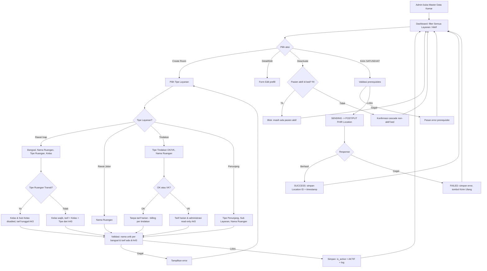

# PRD — Master Data Kamar (A16)

> Modul: **Control Panel > Master Data > Kamar** · Kode Fitur: **A16** · Cluster: **Control Panel** · Tribe: Backoffice Administrasi
> Tujuan: menjadi **acuan / single source of truth data kamar (ruangan) rumah sakit** — terstruktur per tipe layanan (Rawat Inap, Rawat Jalan, Tindakan, Penunjang) — dengan tarif harian otomatis dari Master Data Standar Tarif Kamar (A43), serta interoperabilitas SATUSEHAT & bridging MJKN.

---

## 1. Metadata Dokumen

* **Approval**: M. Sulthan Farras Nanz — Chief Strategy & Growth Officer, Tamtech International — [Tanggal: PERLU KONFIRMASI] · **PIC PRD**: Andini Rahmawati
* **Related Documents**:
    * PRD Standar Tarif Kamar v2 (A43) — sumber tarif harian & administrasi (single source of truth)
    * PRD Master Data Kamar v1 (baseline)
    * PRD Master Data Bangsal (A15) — pola integrasi SATUSEHAT self-service
    * SATUSEHAT — FHIR Location (physicalType = Room, kode `ro`) — reference prerequisite
    * List Fitur V2.xlsx (sheet MVP Fitur Operasional, kode A16)
* **Document Version**:

| Tanggal | Versi | Deskripsi Perubahan |
| --- | --- | --- |
| 18 Jun 2026 | 1.0 | Draft awal — integrasi tarif standar + restruktur data per tipe layanan |
| 1 Jul 2026 | 2.0 | Konversi ke format template (phasing, State Machine, skema DB/API English, Status Behavior) |

---

## 2. Overview & Background

* **Overview / Brief Summary**:
    Master Data Kamar (Kode **A16**, cluster **Control Panel > Master Data**) mengelola seluruh data ruangan RS dengan struktur **terpisah berdasarkan tipe layanan**: **Rawat Inap, Rawat Jalan, Tindakan, Penunjang**. Modul ini menjadi **referensi terpusat** bagi modul operasional yang membutuhkan informasi ruangan. Karakteristik utama:
    * **Tarif kamar harian otomatis** mengacu **Master Data Standar Tarif Kamar (A43)** sebagai *single source of truth* — tanpa input manual; perubahan tarif standar auto-propagasi ke seluruh kamar terkait.
    * Mendukung **perbedaan struktural**: ruangan bangsal Rawat Inap (Reguler/Intensive Care/Isolasi — perlu Kelas; Transit/Intermediate — tarif tunggal tanpa kelas) vs ruangan Tindakan (OK — per-tindakan tanpa tarif harian; VK — tarif harian dari A43, billing di modul Pelayanan VK).
    * Perubahan ruangan **terefleksi otomatis** ke modul: Pendaftaran RI, Update Ketersediaan Bed, Pelayanan RI, Jadwal Dokter, Display Antrian Poliklinik, Jadwal Operasi IBS.
    * **Interoperabilitas SATUSEHAT**: tiap kamar dikirim sebagai FHIR Location (`physicalType = ro`) *self-service* oleh user RS, `partOf` ke Location Bangsal induk (Rawat Inap) atau Instalasi terkait (Tindakan/Penunjang/Rawat Jalan).
    * **Bridging MJKN** granular per-ruangan (toggle + Kode Ruang MJKN).
    Konteks: **RS Tipe C & D** dengan SDM IT & anggaran terbatas — UI sederhana, interoperabilitas self-service agar tidak bergantung tim Backend.

* **Business Process (As-Is vs To-Be)**:
    * **As-Is** (kondisi saat ini):
        1. Tarif kamar harian **diinput manual** per kamar → ketidaksesuaian harga antar kamar sekelas, inkonsistensi, risiko salah input. Tarif Transit & VK belum terakomodir.
        2. **Struktur data tercampur** — ruangan semua tipe layanan dalam satu struktur, padahal kebutuhan field & integrasinya berbeda.
        3. **Kebutuhan billing per tipe ruangan** belum dibedakan (bangsal tarif harian vs OK per-tindakan vs VK tarif harian modul terpisah).
        4. **Interoperabilitas belum mandiri** — pengiriman ke SATUSEHAT masih perlu intervensi manual tim Backend.
        5. **Bridging MJKN belum granular** — belum ada mekanisme memilih ruangan mana yang di-sync.
    * **To-Be** (workflow digital baru):
        1. User buka **Master Data Kamar** → **Create Room** → pilih **Tipe Layanan** dulu → sistem menampilkan form sesuai tipe layanan.
        2. **Rawat Inap**: pilih Bangsal, Nama Ruangan, Tipe Ruangan (+ Kelas bila Reguler/IC/Isolasi; Transit → Kelas disabled). Tarif Harian, Administrasi Utama & Khusus **terisi otomatis (read-only)** dari A43.
        3. **Rawat Jalan**: cukup Nama Ruangan (tanpa bed/tarif/kelas).
        4. **Tindakan**: pilih Tipe Tindakan (OK / VK) → OK tanpa tarif harian (billing per-tindakan); VK tarif harian & administrasi read-only dari A43.
        5. **Penunjang**: pilih Tipe Penunjang (Lab/Radiologi), Sub Layanan (opsional), Nama Ruangan.
        6. **Simpan** → status default AKTIF → data langsung tampil di modul relevan. Perubahan tarif di A43 auto-update seluruh kamar terkait ≤ 1 menit (sesuai tanggal efektif).
        7. **SATUSEHAT (Phase 2)**: user klik **Kirim ke SATUSEHAT** (self-service) → validasi prerequisites → POST/PUT FHIR Location → status 5-state.
    > Konsistensi: To-Be selaras dengan **State Machine** (§6) & **Acceptance Criteria** (§7).

---

## 3. Goals & Metrics

| No | Metrics | Success Criteria |
|----|---------|------------------|
| 1 | Harga kamar RI tidak lagi diinput manual | 100% field tarif kamar read-only & terisi otomatis dari A43 |
| 2 | Tidak ada perbedaan tarif antar kamar sekelas | Selisih tarif kamar per kelas = 0 |
| 3 | Perubahan tarif standar berdampak ke seluruh kamar | 100% kamar ter-update otomatis ≤ 1 menit setelah perubahan A43 (sesuai tanggal efektif) |
| 4 | Penurunan kesalahan tarif pada billing RI | Penurunan insiden komplain/koreksi tarif ≥ 90% dibanding sebelum implementasi |
| 5 | Struktur data terpisah per tipe layanan | 100% ruangan baru memiliki tipe layanan valid & field sesuai tipenya; 0 kamar tanpa tipe |
| 6 | Integrasi ke modul terkait berjalan otomatis | Penambahan/non-aktivasi ruangan terefleksi ≤ 5 detik di modul relevan |
| 7 | Self-service pengiriman ke SATUSEHAT | 100% kamar baru dapat dikirim ke SATUSEHAT oleh user RS tanpa intervensi Backend |
| 8 | Tingkat keberhasilan pengiriman SATUSEHAT | ≥ 95% pengiriman berhasil pada percobaan pertama |
| 9 | Waktu pengiriman ke SATUSEHAT | < 10 detik dari klik hingga response (SLA konsisten A15) |
| 10 | Konfigurasi bridging MJKN per ruangan oleh user | 100% ruangan dapat dikonfigurasi bridging MJKN (toggle + kode mapping) tanpa error |

---

## 4. Scope Definition & Phasing

| Fitur/Modul | Phase 1 (MVP: CRUD + Tarif + MJKN) | Phase 2 (Advanced: Interoperabilitas & Escalation) |
|-------------|-------------------------------------|----------------------------------------------------|
| Restruktur UI/UX per tipe layanan | Tab/section: Rawat Inap, Rawat Jalan, Tindakan, Penunjang; form berbeda per tipe | — |
| CRUD Kamar | Tambah, ubah, detail, aktif/non-aktif per tipe layanan; status default AKTIF | Create/deactivate dengan **approval berjenjang** (skema siap) |
| Integrasi tarif otomatis (A43) | Tarif Harian, Administrasi Utama & Khusus **read-only** lookup dari A43 (kombinasi Kelas + Tipe Ruangan / tarif tunggal Transit/VK); auto-propagasi saat tarif standar berubah | — |
| Struktur bangsal vs tindakan | RI: bangsal (Reguler/IC/Isolasi/Transit). Tindakan: OK (per-tindakan) & VK (tarif harian A43) | — |
| Dashboard | List + search + filter (tipe layanan, status keaktifan) + toggle non-aktif | Bulk action |
| Logging | Audit perubahan kamar & tarif | Riwayat lengkap pengiriman SATUSEHAT per kamar |
| Bridging MJKN | Toggle per-ruangan + input Kode Ruang MJKN | Pengiriman aktual ke MJKN |
| Integrasi SATUSEHAT | — | **Kirim ke SATUSEHAT self-service** (FHIR Location `ro`), status 5-state, resend manual (POST/PUT), simpan Location ID/timestamp/error |
| Propagasi ke modul lain | RI → Pendaftaran RI, Ketersediaan Bed, Pelayanan RI; RJ → Jadwal Dokter, Display Antrian Poli; OK → Jadwal Operasi IBS | — |

> **Catatan phasing**: skema data Phase 1 **sudah menyiapkan** kolom `approval_status` & `approver_role_id` (§8.1) agar Phase 2 (approval berjenjang) tidak memerlukan migrasi struktur. Pengiriman SATUSEHAT & bulk send masuk Phase 2 (sejalan roadmap A15).

**Out of Scope**:
- Pengelolaan **tarif standar** itu sendiri (milik A43) & data **Bangsal** (A15) / **Bed** (A17) — A16 hanya me-*reference*.
- Perhitungan billing/charge pasien (milik Billing/Kasir); flow billing/posting/transaksi RI.
- Pengelolaan **tarif harian VK** & integrasi penuh modul **Pelayanan VK** (penempatan pasien obstetri, billing harian) — menunggu PRD Pelayanan VK.
- **Auto-sync** SATUSEHAT tanpa user trigger (background job) & **bulk send** → Phase 2 lanjutan.
- **Riwayat aktivitas** pengiriman SATUSEHAT lengkap → Phase 2 (versi ini hanya timestamp & error terakhir).
- **Migrasi data** eksisting dari struktur lama ke struktur baru → dokumen migrasi terpisah.
- Registrasi Location **Bangsal & Instalasi** ke SATUSEHAT (prasyarat di A15 & A19). [ASUMSI]

---

## 5. Related Features

| Kode | Menu / Fitur | Deskripsi Relasi Teknis/Bisnis dengan A16 |
|------|--------------|-------------------------------------------|
| **A15** | Master Data > Bangsal | **Induk** kamar Rawat Inap (lookup `ward_id`); `partOf` SATUSEHAT; pola integrasi self-service diadopsi dari A15. |
| **A17** | Master Data > Bed | **Anak** kamar Rawat Inap — bed child dari ruangan RI; non-aktif kamar → seluruh bed di dalamnya ikut non-aktif. |
| **A43** | Master Data > Tarif Kamar | *Single source of truth* tarif harian + Administrasi Utama/Khusus (lookup otomatis by Kelas + Tipe Ruangan / tarif tunggal Transit & VK). |
| **A19** | Master Data > Instalasi (New) | `partOf` SATUSEHAT untuk kamar Tindakan/Penunjang/Rawat Jalan; penanggung jawab ruangan. |
| **A3** | Master Data > Unit | Referensi unit/poli (Rawat Jalan) — field kanonik `unit`. |
| **A18** | Master Data > Role | Mendefinisikan role yang berhak CRUD master kamar. |
| **A37** | Master Data > Akses Menu (New) | Mengatur visibilitas menu Master Data > Kamar per role. |
| **A53** | Admin > RBAC | Menegakkan hak akses (create/read/update/deactivate) master kamar per user/role. |

**Referensi & integrasi lain (bukan A-code inti):** Master Sarana Index (Organization IHS Number — prasyarat SATUSEHAT `managingOrganization`); Integrasi **SATUSEHAT** (FHIR Location `ro`); Integrasi **MJKN** (bridging per-ruangan).
**Modul operasional yang mengonsumsi data kamar (propagasi otomatis):** Pendaftaran RI (`g-admisi-inpatient-registration`), Update Ketersediaan Bed, Pelayanan RI, Jadwal Dokter, Display Antrian Poliklinik, Jadwal Operasi IBS, Billing (tagihan RI).

---

## 6. Business Process & User Stories

* **State Machine Table — Status Keaktifan Kamar**:

| Status | Deskripsi | Efek Operasional | Transisi (Phase 1) | Transisi (Phase 2) |
|--------|-----------|------------------|--------------------|--------------------|
| `AKTIF` | Kamar operasional, tampil di modul konsumen | Bed dapat diisi (RI); ruangan jadi opsi di modul terkait | AKTIF → NON_AKTIF (toggle dashboard) | AKTIF → NON_AKTIF (setelah approval) |
| `NON_AKTIF` | Soft delete — hilang dari modul konsumen; historis dipertahankan | Seluruh bed di ruangan (RI) ikut non-aktif; tidak jadi opsi | NON_AKTIF → AKTIF (toggle dashboard) | NON_AKTIF → AKTIF (setelah approval) |

* **State Machine Table — Status Pengiriman SATUSEHAT (5-state, Phase 2)**:

| Status | Badge | Deskripsi | Aksi |
|--------|-------|-----------|------|
| `NOT_SENT` Belum Terkirim | abu | Kamar baru, belum pernah dikirim | Tombol **Kirim** aktif |
| `SENDING` Sedang Dikirim | kuning | API call in-progress | — |
| `SUCCESS` Berhasil Terkirim | hijau | + timestamp & Location ID | Tombol Kirim disabled |
| `FAILED` Gagal | merah | + pesan error dari SATUSEHAT | Tombol **Kirim Ulang** (POST) aktif |
| `NEEDS_UPDATE` Perlu Update | oranye | Data diubah pasca berhasil terkirim | Tombol **Kirim Ulang** (PUT) aktif |

> **Status Behavior (aturan wajib)**: form **Create Room tidak memerlukan pemilihan status** — `is_active` di-set **AKTIF** oleh sistem saat create. Aktivasi/penonaktifan dilakukan lewat **toggle/Edit di Dashboard**. Field tarif **read-only** (bukan input). `Tipe Layanan` **tidak dapat diubah** setelah tersimpan.

* **User Stories Utama** (Role — Task — Goal): lihat rincian + AC di §7. Ringkas:
    * Admin: harga kamar otomatis mengikuti standar tarif (tanpa input manual, konsisten).
    * Admin: input ruangan Rawat Inap (bangsal, nama, kelas, tipe ruangan) sebagai referensi modul RI.
    * User Pendaftaran/Pelayanan RI: hanya kamar aktif tampil di Pendaftaran RI, Ketersediaan Bed, Dashboard Pelayanan.
    * Admin/User RJ: input ruangan poli sederhana, terintegrasi Jadwal Dokter & Display Antrian Poli.
    * User IBS/VK: ruang OK terintegrasi Jadwal Operasi IBS; ruang VK tersimpan (tarif harian dari A43).
    * User Penunjang: input ruangan Lab/Radiologi + sub-layanan.
    * Admin: dashboard lihat/tambah/edit/non-aktif/search/filter per tipe layanan & status.
    * Admin: kirim/resend kamar ke SATUSEHAT mandiri + lihat indikator status.
    * Admin: konfigurasi bridging MJKN per ruangan.

---

## 7. Functional Requirements

### 7.1 Feature Requirements & Acceptance Criteria

---

**Fitur: Integrasi dengan Master Data Standar Tarif Kamar (A43)**
* **User Story**: Sebagai admin, saya ingin harga kamar otomatis mengikuti standar harga agar tidak perlu input manual dan tarif konsisten di seluruh sistem.
* **Prioritas**: P0 · **Fase**: Phase 1
* **Acceptance Criteria**:
    * **AC 1**: Tarif Kamar Harian, Administrasi Utama & Administrasi Khusus **tidak dapat diinput manual (read-only)**, terisi dari A43 sesuai kombinasi Kelas + Tipe Ruangan.
    * **AC 2**: Untuk Tipe Ruangan = Reguler/Intensive Care/Isolasi → tarif dari kombinasi **Kelas + Tipe Ruangan**.
    * **AC 3**: Untuk Tipe Ruangan = **Transit** dan **VK** → tarif **tunggal harian** tanpa input kelas; field Nama Kelas & Sub Kelas otomatis **disabled**.
    * **AC 4**: Sistem melakukan **auto-update** tarif kamar ketika harga standar di A43 berubah (≤ 1 menit, sesuai tanggal efektif), tanpa update manual per kamar.
    * **AC 5**: Kamar baru **default berstatus AKTIF**; toggle aktif/non-aktif berfungsi; setiap perubahan kamar/tarif tercatat di log.
    * **AC 6**: Waktu tambah/update data kamar ≤ 1 detik. Bila tarif belum ada di A43 → sistem menyarankan setting tarif dulu (lihat Validasi).

---

**Fitur: Input Master Data Kamar — Layanan Rawat Inap**
* **User Story**: Sebagai admin, saya ingin menginput ruangan rawat inap (bangsal, nama ruangan, kelas, tipe ruangan) sebagai referensi modul rawat inap.
* **Prioritas**: P0 · **Fase**: Phase 1
* **Acceptance Criteria**:
    * **AC 1**: Field: Tipe Layanan, Nama Bangsal, Nama Ruangan, Nama Kelas, Sub Kelas, Tipe Ruangan, Tarif Harian (read-only A43), Administrasi Utama/Khusus (read-only A43), Status MJKN, Status Keaktifan.
    * **AC 2**: Tiap ruangan RI menjadi **parent bed** (A17); tarif harian pasien mengacu ruang tempat bed berada.
    * **AC 3**: Sistem menolak **Nama Ruangan duplikat dalam satu Bangsal** (validasi).
    * **AC 4**: Autofill tarif sesuai Kelas + Tipe Ruangan; auto-update saat tarif A43 berubah.

---

**Fitur: Integrasi Kamar RI dengan Pendaftaran, Ketersediaan Bed & Pelayanan**
* **User Story**: Sebagai user Pendaftaran & Pelayanan RI, saya ingin hanya kamar aktif yang tampil di Pendaftaran RI, Update Ketersediaan Bed, dan Dashboard Pelayanan RI.
* **Prioritas**: P0 · **Fase**: Phase 1
* **Acceptance Criteria**:
    * **AC 1**: Perubahan nama kamar terefleksi **real-time** ke Pendaftaran, Ketersediaan Bed, Dashboard Pelayanan.
    * **AC 2**: Kamar baru **aktif + punya bed aktif** langsung muncul di fitur terkait.
    * **AC 3**: Non-aktif kamar → **seluruh bed** ikut non-aktif & hilang dari fitur terkait.
    * **AC 4**: Sistem **mencegah non-aktif** kamar bila masih ada pasien aktif menempati bed (pesan error).

---

**Fitur: Input Master Data Kamar — Layanan Rawat Jalan + Integrasi Jadwal Dokter**
* **User Story**: Sebagai admin/user RJ, saya ingin input ruangan poli sederhana yang terintegrasi Jadwal Dokter & Display Antrian Poli.
* **Prioritas**: P0 · **Fase**: Phase 1
* **Acceptance Criteria**:
    * **AC 1**: Field cukup: Tipe Layanan, Nama Ruangan, Status Keaktifan (tanpa kelas/tarif/bed).
    * **AC 2**: Tambah ruangan poli baru → muncul di Jadwal Dokter & Display Antrian Poliklinik.
    * **AC 3**: Non-aktif ruangan poli → hilang dari Jadwal Dokter & Display Antrian Poliklinik.
    * **AC 4**: Ruangan RJ **tidak memiliki bed** turunan.

---

**Fitur: Input Master Data Kamar — Layanan Tindakan + Integrasi Jadwal Operasi IBS**
* **User Story**: Sebagai user IBS & Pelayanan VK, saya ingin ruang OK & VK terintegrasi konfirmasi Jadwal Operasi IBS (OK) dan tersimpan untuk modul Pelayanan VK (VK).
* **Prioritas**: P0 · **Fase**: Phase 1
* **Acceptance Criteria**:
    * **AC 1**: Field: Tipe Layanan, Tipe Tindakan (OK / VK), Nama Ruangan, Status Keaktifan.
    * **AC 2**: Tipe Tindakan = **VK** → tampil field Tarif Harian, Administrasi Utama & Khusus (read-only A43, Tipe Ruangan = VK).
    * **AC 3**: Tipe Tindakan = **OK** → ketiga field tarif **hidden/disabled** (billing per-tindakan).
    * **AC 4**: OK baru muncul di konfirmasi Jadwal Operasi IBS; OK non-aktif tidak muncul.
    * **AC 5**: VK baru tersimpan + tarif/administrasi ter-link dari A43; VK non-aktif tetap tampil di dashboard dengan status non-aktif.
    * **AC 6**: Validasi bila tarif VK belum dikonfigurasi di A43.
    * **AC 7**: Ruangan Tindakan (OK/VK) **tidak memiliki bed** turunan.

---

**Fitur: Input Master Data Kamar — Layanan Penunjang**
* **User Story**: Sebagai user penunjang Lab/Radiologi, saya ingin menambah ruangan pemeriksaan beserta sub-layanan.
* **Prioritas**: P1 · **Fase**: Phase 1
* **Acceptance Criteria**:
    * **AC 1**: Field: Tipe Layanan, Tipe Penunjang (Laboratorium/Radiologi), Sub Layanan (opsional, mis. CT-Scan), Nama Ruangan, Status Keaktifan.
    * **AC 2**: Tambah/non-aktif ruangan Lab & Radiologi berfungsi; tambah ruangan per sub-layanan berfungsi.
    * **AC 3**: Ruangan Penunjang **tidak memiliki bed** turunan.

---

**Fitur: Dashboard Master Data Kamar**
* **User Story**: Sebagai admin, saya ingin melihat semua ruangan, menambah/edit/non-aktif, mencari, dan memfilter per tipe layanan & status.
* **Prioritas**: P0 · **Fase**: Phase 1
* **Acceptance Criteria**:
    * **AC 1**: List seluruh ruangan + tombol **Tambah**, aksi baris **Detail / Edit / Deactivate**.
    * **AC 2**: Pencarian berdasarkan **Nama Ruangan**.
    * **AC 3**: Filter **Tipe Layanan** (Rawat Inap/Rawat Jalan/Tindakan/Penunjang/Semua) & **Status Keaktifan** (Aktif/Non-aktif/Semua).
    * **AC 4**: Default filter saat buka menu: Tipe Layanan = **Semua**, Status = **Aktif**.

---

**Fitur: Kirim Master Data Kamar ke SATUSEHAT (Self-Service)** — *Phase 2*
* **User Story**: Sebagai Admin Master Data, saya dapat memicu pengiriman data kamar ke SATUSEHAT mandiri tanpa tim Backend.
* **Prioritas**: P1 · **Fase**: Phase 2
* **Acceptance Criteria**:
    * **AC 1**: Tombol **Kirim ke SATUSEHAT** di Dashboard (per baris) & Detail Kamar; aktif saat status = `NOT_SENT` atau `FAILED`.
    * **AC 2**: Validasi prerequisites: field mandatory terisi; Bangsal induk (RI) / Instalasi induk (non-RI) sudah punya Location ID; RS punya Organization IHS Number.
    * **AC 3**: Validasi gagal → pesan error spesifik + batalkan pengiriman.
    * **AC 4**: Validasi lolos → status `SENDING` → **POST** FHIR Location (payload §8.3 F). Berhasil → simpan Location ID, status `SUCCESS` + timestamp. Gagal → simpan error, status `FAILED`.
    * **AC 5**: SLA response ≤ 10 detik.

---

**Fitur: Resend / Kirim Ulang & Indikator Status SATUSEHAT** — *Phase 2*
* **User Story**: Sebagai Admin, saya dapat kirim ulang saat data berubah / gagal, dan melihat status pengiriman tiap kamar.
* **Prioritas**: P1 · **Fase**: Phase 2
* **Acceptance Criteria**:
    * **AC 1**: Tombol **Kirim Ulang** aktif saat `NEEDS_UPDATE` (→ **PUT** dengan Location ID tersimpan) atau `FAILED` (→ **POST** ulang). Trigger selalu manual.
    * **AC 2**: Field pemicu `NEEDS_UPDATE` bila diubah pasca `SUCCESS`: Nama Ruangan, Tipe Ruangan, Nama Kelas, Sub Kelas, Status Keaktifan, Nama Bangsal (RI).
    * **AC 3**: Badge 5-state di Dashboard & Detail; tooltip berisi timestamp terakhir, Location ID, pesan error.
    * **AC 4**: Location ID **tidak berubah** saat PUT; Detail Kamar menampilkan history singkat (tgl pertama berhasil, update terakhir, aksi terakhir POST/PUT).

---

**Fitur: Konfigurasi Bridging MJKN per Ruangan**
* **User Story**: Sebagai Admin, saya ingin mengonfigurasi tiap ruangan apakah di-bridge ke MJKN, agar hanya ruangan terpilih yang terefleksi di MJKN.
* **Prioritas**: P1 · **Fase**: Phase 1
* **Acceptance Criteria**:
    * **AC 1**: Toggle **Status Bridging MJKN** (Aktif/Non-aktif) di form Detail Kamar & Dashboard.
    * **AC 2**: Bila diaktifkan → tampil field **Kode Ruang MJKN** (+ field mapping MJKN lain), dapat diedit & tersimpan per ruangan.
    * **AC 3**: Dashboard menampilkan **kolom/badge status bridging MJKN** per ruangan.
    * **AC 4**: Perubahan konfigurasi dapat dilakukan kapan saja, **non-blocking** (tidak otomatis mengirim data ke MJKN).

---

**Validasi**

**A. Wording Validasi (Frontend)**

| Fitur | Kondisi | Error Message |
|-------|---------|---------------|
| Tambah Kamar | Tipe Layanan belum dipilih | "Tipe layanan wajib dipilih." |
| Tambah Kamar | Nama Ruangan kosong | "Nama ruangan wajib diisi." |
| Tambah Kamar | Nama Ruangan sudah ada di Bangsal sama (RI) | "Nama ruangan sudah digunakan di bangsal ini. Gunakan nama lain." |
| Tambah Kamar | Nama Bangsal belum dipilih (RI) | "Nama bangsal wajib dipilih untuk kamar rawat inap." |
| Tambah Kamar | Tipe Ruangan belum dipilih (RI) | "Tipe ruangan wajib dipilih untuk kamar rawat inap." |
| Tambah Kamar | Nama Kelas kosong saat Tipe Ruangan = Reguler/IC/Isolasi | "Kelas wajib dipilih untuk tipe ruangan ini." |
| Tambah Kamar | Tipe Tindakan belum dipilih (Tindakan) | "Tipe tindakan wajib dipilih." |
| Tambah Kamar | Tipe Penunjang belum dipilih (Penunjang) | "Tipe penunjang wajib dipilih." |
| Tambah Kamar | Tarif belum dikonfigurasi di A43 untuk kombinasi terpilih | "Tarif belum diatur di Master Data Standar Tarif Kamar untuk kombinasi ini. Silakan setting tarif terlebih dahulu." |
| Ubah Data Kamar | Ubah Tipe Layanan setelah tersimpan | "Tipe layanan tidak dapat diubah setelah data tersimpan. Buat data kamar baru jika perlu." |
| Ubah Data Kamar | Ubah Tipe Ruangan ke Transit padahal Kelas/Sub Kelas terisi | "Mengubah tipe ruangan ke Transit akan menghapus data Kelas dan Sub Kelas. Lanjutkan?" (konfirmasi) |
| Nonaktifkan Kamar | Kamar masih ditempati pasien aktif (RI) | "Kamar tidak dapat dinonaktifkan karena masih ditempati oleh pasien aktif. Tunggu hingga pasien selesai dirawat." |
| Nonaktifkan Kamar | Kamar masih memiliki bed aktif (RI) | "Menonaktifkan kamar akan otomatis menonaktifkan seluruh bed di dalamnya. Lanjutkan?" (konfirmasi) |
| Kirim ke SATUSEHAT | Bangsal induk belum terkirim (RI) | "Bangsal induk belum terdaftar di SATUSEHAT. Mohon kirim data Bangsal terlebih dahulu." |
| Kirim ke SATUSEHAT | Instalasi induk belum terkirim (non-RI) | "Instalasi induk belum terdaftar di SATUSEHAT. Mohon kirim data Instalasi terlebih dahulu." |
| Kirim ke SATUSEHAT | RS belum punya Organization IHS Number | "Rumah Sakit belum terdaftar di Master Sarana Index SATUSEHAT. Hubungi admin sistem." |
| Kirim ke SATUSEHAT | Timeout (>30s) / error 4xx-5xx | "Pengiriman ke SATUSEHAT gagal: [pesan error]. Silakan coba kirim ulang." |
| Kirim ke SATUSEHAT | Token expired (401) | "Otentikasi SATUSEHAT gagal. Sistem akan mencoba refresh token; jika tetap gagal, hubungi admin." (auto-retry 1x) |
| Kirim Ulang | Klik saat status SUCCESS (tanpa perubahan) | "Tidak ada perubahan data yang perlu di-update. Kamar sudah sinkron dengan SATUSEHAT." |
| Kirim Ulang | Location ID tidak ditemukan saat PUT | "Location ID SATUSEHAT tidak ditemukan. Sistem akan mencoba POST ulang." (fallback POST) |
| Konfigurasi MJKN | Bridging MJKN aktif tapi Kode Ruang MJKN kosong | "Kode Ruang MJKN wajib diisi jika bridging MJKN diaktifkan." |

---

## 8. Data & Technical Specifications

### 8.1 Database Schema Suggestion

* **Table Name**: `rooms`
* **Key Columns**:
    * `id`: UUID (Primary Key)
    * `service_type`: VARCHAR(20), NOT NULL — enum: INPATIENT / OUTPATIENT / PROCEDURE / SUPPORT (Rawat Inap/Rawat Jalan/Tindakan/Penunjang). **Immutable** setelah create.
    * `room_name`: VARCHAR(100), NOT NULL
    * `ward_id`: UUID (FK → `wards.id`, A15), NULL — hanya INPATIENT
    * `installation_id`: UUID (FK → `installations.id`, A19), NULL — parent non-INPATIENT
    * `room_type`: VARCHAR(20), NULL — INPATIENT: Reguler / Intensive Care / Isolasi / Transit
    * `room_class`: VARCHAR(20), NULL — Nama Kelas (Kelas 1/2/3/VIP/…); NULL bila Transit/non-INPATIENT
    * `sub_class`: VARCHAR(20), NULL
    * `procedure_type`: VARCHAR(20), NULL — PROCEDURE: OK / VK
    * `support_type`: VARCHAR(20), NULL — SUPPORT: Laboratorium / Radiologi
    * `sub_service`: VARCHAR(50), NULL — SUPPORT sub-layanan (mis. CT-Scan)
    * `tariff_ref_id`: UUID (FK → `room_tariff_standards.id`, A43), NULL — linkage auto-propagasi
    * `daily_tariff`: NUMERIC(15,0), NULL — **read-only**, snapshot dari A43 (≥ 0, non-desimal)
    * `main_admin_fee`: NUMERIC(15,0), NULL — read-only dari A43
    * `special_admin_fee`: NUMERIC(15,0), NULL — read-only dari A43
    * `mjkn_bridging_enabled`: BOOLEAN, default true
    * `mjkn_room_code`: VARCHAR(50), NULL — wajib bila `mjkn_bridging_enabled = true`
    * `mjkn_room_type`: VARCHAR(50), NULL
    * `is_active`: BOOLEAN, default true — soft delete (selalu true saat create)
    * **[SATUSEHAT — Phase 2]** `satusehat_status`: VARCHAR(15), default 'NOT_SENT' — NOT_SENT/SENDING/SUCCESS/FAILED/NEEDS_UPDATE
    * `satusehat_location_id`: VARCHAR(64), NULL · `satusehat_last_sent_at`: TIMESTAMP, NULL · `satusehat_last_error`: TEXT, NULL · `satusehat_first_success_at`: TIMESTAMP, NULL · `satusehat_last_action`: VARCHAR(4), NULL (POST/PUT)
    * **[Phase 2 approval-ready]** `approval_status`: VARCHAR(20), default 'APPROVED' — DRAFT/PENDING/APPROVED/REJECTED · `approver_role_id`: UUID (FK → `roles.id`, A18), NULL
    * `created_at`, `updated_at`, `created_by`, `updated_by`
* **Tabel pendukung**: `room_audit_logs` (id, room_id, action, diff_json, actor_id, created_at) — append-only (rename, aktif/non-aktif, ganti kelas/tipe, perubahan tarif).
* **Constraint**: UNIQUE(`ward_id`, `room_name`) untuk INPATIENT (nama ruangan unik per bangsal); CHECK tarif ≥ 0 & integer; index (`service_type`, `is_active`).

### 8.2 API Endpoint Recommendations

| Method | Endpoint | Description |
|--------|----------|-------------|
| GET | `/api/v1/rooms` | List (query: `?service_type=&is_active=&search=&page=`) |
| GET | `/api/v1/rooms/{id}` | Detail kamar |
| POST | `/api/v1/rooms` | Create (status di-set AKTIF oleh server; tarif di-lookup server dari A43) |
| PUT | `/api/v1/rooms/{id}` | Update metadata (service_type immutable, tarif read-only) |
| PATCH | `/api/v1/rooms/{id}/status` | Toggle Active/Inactive (cascade non-aktif bed RI) |
| GET | `/api/v1/rooms/{id}/audit-logs` | Riwayat perubahan |
| GET | `/api/v1/tariff-standards/lookup` | Lookup tarif A43 (`?room_type=&room_class=&sub_class=`) untuk autofill read-only |
| POST | `/api/v1/rooms/{id}/satusehat/send` | Kirim ke SATUSEHAT (POST FHIR Location) — *Phase 2* |
| POST | `/api/v1/rooms/{id}/satusehat/resend` | Kirim ulang (PUT bila NEEDS_UPDATE, POST bila FAILED) — *Phase 2* |
| PATCH | `/api/v1/rooms/{id}/mjkn-bridging` | Set toggle & Kode Ruang MJKN |

### 8.3 Data & Business Rules

#### 8.3.1 Spesifikasi Data — Form Input (Layar CREATE/EDIT) per Tipe Layanan

**(RI) Rawat Inap**

| Field | Label | Tipe | Wajib | Validasi/Sumber | Catatan |
|-------|-------|------|-------|-----------------|---------|
| service_type | Tipe Layanan | Radio | Ya | RI/RJ/Tindakan/Penunjang | Immutable pasca simpan ||
| room_name | Nama Ruangan | Text | Ya | unik per bangsal; alfanumerik | mis. "R.A1" |
| room_type | Tipe Ruangan | Multiple Select | Ya | Enum: HCU, Nifas, Perinatologi, Anak, NICU/PICU, Umum, ICU, ICCU, VK, Isolasi | Transit → Kelas disabled |
| room_class | Nama Kelas | Dropdown | Kondisional | Wajib bila Reguler/IC/Isolasi; disabled bila Transit (A43) | |
| sub_class | Sub Kelas | Dropdown | Tidak | opsi mengikuti kelas (A43); disabled bila Transit | |
| daily_tariff | Tarif Kamar Harian | Number | Ya | **read-only** dari A43 (Kelas+Tipe / tunggal Transit) | ≥ 0, non-desimal |
| main_admin_fee | Administrasi Utama | Number | Ya | **read-only** dari A43 | one-time saat masuk RI |
| special_admin_fee | Administrasi Khusus | Number | Tidak | **read-only** dari A43 | menggantikan Adm. Utama per tipe penjamin |
| mjkn_bridging_enabled | Status Bridging MJKN | Toggle | Ya | default Aktif | |
| mjkn_room_code | Kode Ruang MJKN | Text | Kondisional | wajib bila bridging aktif | |
| is_active | Status Keaktifan | (sistem) | — | default AKTIF (tidak diinput saat create) | toggle di dashboard |

**(RJ) Rawat Jalan**: `service_type`, `room_name` (wajib; mis. "Klinik Penyakit Dalam"), `mjkn_bridging_enabled` (+ `mjkn_room_code`), `is_active`. Tanpa kelas/tarif/bed.

**(Tindakan)**: `service_type`, `procedure_type` (Radio: Ruang Operasi (OK) / VK — wajib), `room_name` (wajib), + bila **VK**: `daily_tariff`, `main_admin_fee`, `special_admin_fee` (read-only A43, Tipe Ruangan=VK); bila **OK**: field tarif hidden. `mjkn_*`, `is_active`.

**(Penunjang)**: `service_type`, `support_type` (Radio: Laboratorium / Radiologi — wajib), `sub_service` (Text/Dropdown, opsional, mis. CT-Scan), `room_name` (wajib), `mjkn_*`, `is_active`. Tanpa bed.

**(F) Mapping SATUSEHAT FHIR Location** *(Phase 2)*: `identifier.use`='official'; `identifier.system`=`http://sys-ids.kemkes.go.id/location/{org-ihs}`; `identifier.value`=Nama Ruangan (unik dalam partOf); `status`=Aktif→active / Non-aktif→inactive; `name`=Nama Ruangan; `description`=komposisi otomatis "{Tipe Layanan} - {Tipe Ruangan/Tindakan/Penunjang} - Kelas {Kelas} {Sub Kelas}"; `mode`='instance'; `physicalType`='ro' (Room); `type.coding` (v3-RoleCode, mapping per tipe — perlu konfirmasi final SA); `partOf`=Location Bangsal (RI) / Instalasi (non-RI); `managingOrganization`=Organization IHS Number RS; `extension.serviceClass`=Kelas (hanya RI Reguler/IC/Isolasi; dihilangkan untuk Transit/VK/OK/RJ/Penunjang).

#### 8.3.2 Spesifikasi Data — Tampilan Daftar (List View / Dashboard)

| Kolom | Sumber Data | Format | Filter / Sort | Catatan |
|-------|-------------|--------|---------------|---------|
| Tipe Layanan | rooms.service_type | Text | Filter (RI/RJ/Tindakan/Penunjang/Semua) | |
| Nama Bangsal | wards.ward_name (A15) | Text | — | "-" bila non-RI |
| Nama Ruangan | rooms.room_name | Text | Search | |
| Nama Kelas | rooms.room_class | Text | — | "-" bila Transit/non-RI |
| Sub Kelas | rooms.sub_class | Text | — | "-" bila kosong |
| Tipe Ruangan | rooms.room_type / procedure_type | Text | — | "-" bila RJ/Penunjang |
| Tarif Kamar Harian | rooms.daily_tariff | Rp (number) | — | read-only |
| Status Bridging MJKN | rooms.mjkn_bridging_enabled | Badge (Aktif/Tidak) | — | |
| Status SATUSEHAT | rooms.satusehat_status | Badge 5-state + tooltip | — | *Phase 2* |
| Status Keaktifan | rooms.is_active | Radio/Badge | Filter (Aktif/Non-aktif/Semua) | default Aktif |
| Aksi | — | Button | — | Detail / Edit / Deactivate |

> Default filter saat membuka menu: **Tipe Layanan = Semua**, **Status = Aktif**.

* **Business Rules**:
    * **BR-01**: Tarif Harian, Administrasi Utama & Khusus **read-only** — selalu dari A43 (BR utama: 0 input tarif manual).
    * **BR-02**: Tarif = fungsi (Kelas + Tipe Ruangan); **Transit & VK** = tarif tunggal tanpa kelas (Nama Kelas & Sub Kelas disabled).
    * **BR-03**: Perubahan tarif di A43 **auto-propagasi** ke seluruh kamar dengan kombinasi terkait (≤ 1 menit, sesuai tanggal efektif) tanpa update manual.
    * **BR-04**: **Nama Ruangan unik** dalam satu Bangsal (RI).
    * **BR-05**: Non-aktif kamar RI → **cascade** non-aktif seluruh bed di dalamnya (A17).
    * **BR-06**: Kamar **tidak dapat dinonaktifkan** bila masih ada pasien aktif menempati bed.
    * **BR-07**: `service_type` **immutable** setelah tersimpan.
    * **BR-08**: OK = billing per-tindakan (tanpa tarif harian); VK = tarif harian A43 (billing di modul Pelayanan VK); RJ & Penunjang tanpa tarif & tanpa bed.
    * **BR-09**: Bila tarif kombinasi belum ada di A43 → sistem **mencegah** & menyarankan setting tarif dulu.
    * **BR-10**: Bridging MJKN aktif → **Kode Ruang MJKN wajib**; perubahan konfigurasi non-blocking (tidak auto-kirim ke MJKN).
    * **BR-11**: SATUSEHAT (Phase 2) — kirim self-service; prasyarat: parent Location (Bangsal/Instalasi) sudah terkirim + Organization IHS Number ada; `NEEDS_UPDATE` dipicu perubahan field kunci; resend PUT pakai Location ID tersimpan (tidak berubah).
    * **BR-12**: Kamar baru **default AKTIF**; status data (`is_active`) tidak diinput di form create — dikelola via toggle/Edit Dashboard (Status Behavior).
    * **BR-13** (konsistensi API↔tabel): `POST /rooms` mengabaikan tarif & status pada payload — server men-set `is_active=true`, `approval_status=APPROVED`, dan meng-*lookup* tarif dari A43.

#### 8.4 Non-Functional Requirements

- **NFR-01 (Performa)**: Tambah/update data kamar ≤ 1 detik; list/dashboard tampil < 2 detik untuk skala RS Tipe C&D. [ASUMSI]
- **NFR-02 (Integrasi)**: Auto-propagasi tarif ≤ 1 menit; perubahan ruangan terefleksi ≤ 5 detik ke modul konsumen.
- **NFR-03 (Keamanan/RBAC)**: CRUD & kirim SATUSEHAT dibatasi role berwenang (A18/A37/A53); kredensial SATUSEHAT terenkripsi; aksi ter-audit.
- **NFR-04 (Keandalan SATUSEHAT)**: SLA response < 10 detik; timeout > 30 detik → gagal; auto-retry 1x saat token expired (401).
- **NFR-05 (Usability)**: UI sederhana, form kondisional per tipe layanan, dapat dioperasikan 1 admin RS Tipe C&D tanpa bantuan IT.
- **NFR-06 (Auditability)**: Soft delete + log perubahan kamar & tarif dipertahankan.

---

## 9. Workflow / BPMN Interpretation

Alur To-Be mengonsumsi/menyuplai modul: Pendaftaran RI (`g-admisi-inpatient-registration`), Ketersediaan Bed, Pelayanan RI, Jadwal Dokter, Display Antrian Poli, Jadwal Operasi IBS.

**A. Tambah Kamar (per tipe layanan):** Create Room → pilih **Tipe Layanan** → sistem tampilkan form sesuai tipe → isi field → (RI/VK) tarif autofill read-only dari A43 → **Simpan** (validasi: nama unik per bangsal, tarif tersedia di A43) → status AKTIF → propagasi ke modul konsumen.

**B. Update Tarif (propagasi):** Admin ubah tarif di A43 (Kelas + Tipe Ruangan) → sistem auto-update tarif seluruh kamar dengan kombinasi terkait (≤ 1 menit, tanggal efektif) → simpan log — tanpa update manual per kamar.

**C. Non-aktifkan Kamar (RI):** Deactivate → cek pasien aktif? Ya: blok + pesan · Tidak: konfirmasi cascade bed → non-aktif kamar + seluruh bed → hilang dari modul konsumen.

**D. Kirim ke SATUSEHAT (Phase 2, self-service):** Klik Kirim → validasi prerequisites (parent Location + Org IHS) → `SENDING` → POST/PUT FHIR Location → `SUCCESS` (simpan Location ID + timestamp) / `FAILED` (simpan error) → bila data berubah pasca sukses → `NEEDS_UPDATE` → Kirim Ulang (PUT).

---

## Lampiran — Asumsi & Pertanyaan Terbuka

**Asumsi:**
- [ASUMSI] Registrasi Location Bangsal (A15) & Instalasi (A19) ke SATUSEHAT sudah tersedia sebagai prasyarat.
- [ASUMSI] Tarif harian VK dikonfigurasi di A43 (Tipe Ruangan = VK); billing VK di modul Pelayanan VK terpisah.
- [ASUMSI] Skema Phase 1 menyiapkan `approval_status`/`approver_role_id` untuk Phase 2 tanpa migrasi.
- [ASUMSI] Field kanonik (`unit`, `is_active`, audit) memakai definisi bersama lintas-PRD.

**Pertanyaan Terbuka:**
- Mapping `type.coding` (v3-RoleCode) final untuk tiap tipe ruangan (Transit→HOLD, Radiologi→RAD/RADO, HCU, dll) — perlu konfirmasi SA.
- Mapping `extension.serviceClass` resmi SATUSEHAT untuk kelas (VVIP/President Suite).
- Daftar enum Kelas & Tipe Ruangan final per RS (PKU/Afdila berbeda) — selaraskan dengan A43.
- Field mapping MJKN lengkap (selain Kode Ruang MJKN) & mekanisme pengiriman aktual ke MJKN (tahap berikutnya).
- Approver Phase 2: role berwenang menyetujui create/deactivate kamar (relasi A18/A53).
- Detail integrasi penuh ruang VK ke modul Pelayanan VK (menunggu PRD Pelayanan VK).
