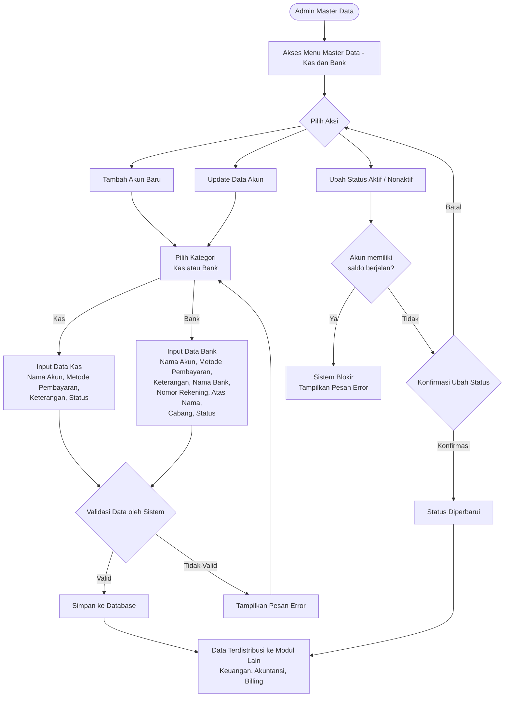
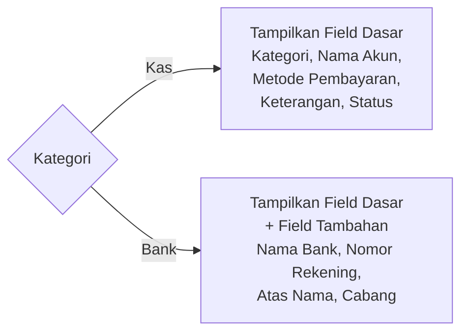

# Product Requirement Document
## Master Data - Kas dan Bank

---

**Related Document**

| Dokumen | Link/Keterangan |
| :------ | :-------------- |
| Design Figma | - |

---

**Document Version**

| Tanggal | Versi | Keterangan |
| :------ | :---- | :--------- |
| 24 Oktober 2025 | Versi 1.0 | Pembuatan Awal |

---

**Approval**

| PRD Approved By | Nama / Jabatan | Signature, Date |
| :-------------- | :------------- | :-------------- |
| [1] | M. Sulthan Farras Nanz — Chief Strategy & Growth Officer, Tamtech International | - |

**PIC**

| Nama | Role |
| :--- | :--- |
| Ulfa | Product Owner |
| Arif | System Analyst |

---

## 1. Overview / Brief Summary

Dalam operasional Rumah Sakit, hampir seluruh proses keuangan — mulai dari penerimaan pasien, pembayaran ke supplier, pengeluaran kas kecil, hingga rekonsiliasi — bergantung pada data Kas dan Bank yang valid dan terstruktur. Akun Kas dan Bank berperan sebagai sumber dana yang mencatat setiap aliran uang masuk dan keluar di rumah sakit.

Modul **Master Data - Kas dan Bank** pada Neurovi berfungsi sebagai pusat pengelolaan seluruh akun sumber dana, baik berupa **Kas** (tunai/kas kecil) maupun **Bank** (rekening giro/tabungan) yang digunakan pada berbagai unit dan transaksi keuangan.

Dengan adanya pengelolaan Kas dan Bank yang terpusat, sistem dapat memastikan keakuratan data pada setiap pencatatan transaksi, penjurnalan otomatis, hingga rekonsiliasi saldo — sehingga mendukung transparansi dan akuntabilitas keuangan rumah sakit.

---

## 2. Background

Sebelum pengembangan modul ini, data akun Kas dan Bank di masing-masing proses keuangan masih dikelola secara terpisah atau manual. Akibatnya:

- Terjadi duplikasi dan inkonsistensi data rekening antar unit.
- Kesulitan dalam melakukan rekonsiliasi dan penelusuran riwayat transaksi per akun.
- Tidak adanya kontrol terhadap saldo dan status akun yang masih aktif digunakan.
- Proses penjurnalan otomatis menjadi rumit karena tidak ada referensi akun Kas/Bank yang terstandar dan terhubung ke COA.

Modul ini dikembangkan untuk menjadi **sumber kebenaran tunggal (single source of truth)** bagi seluruh data Kas dan Bank di sistem Neurovi.

---

## 3. In Scope

### 3.1 Scope Definition

**Legend Phase**

| Penanda | Phase |
| :------ | :---- |
| _(tanpa penanda)_ | Phase 1 |
| `[**]` | Phase 2 |
| `[***]` | Phase 3 |

| No | Scope / Area | Phase |
| :- | :----------- | :---- |
| 1 | Dashboard - Master Data Kas dan Bank | Phase 1 |
| 2 | Tambah Data Kas/Bank | Phase 1 |
| 3 | Update Data Kas/Bank | Phase 1 |
| 4 | Aktif/Nonaktifkan Akun Kas/Bank | Phase 1 |
| 5 | Pengaturan Saldo Awal | Phase 1 |
| 6 | Ekspor Data Kas dan Bank | Phase 2 `[**]` |
| 7 | Pemetaan Akun COA | Phase 3 `[***]` |

### 3.2 Out Scope

| No | Scope |
| :- | :---- |
| 1 | Proses pencatatan transaksi kas masuk dan kas keluar (ditangani modul Keuangan). |
| 2 | Proses rekonsiliasi bank dan penjurnalan (ditangani modul Keuangan/Akuntansi). |
| 3 | Pengelolaan master data Chart of Account / COA (ditangani modul Akuntansi). |

---

## 4. Goals and Metrics

### Goals

- Menyediakan pusat pengelolaan data Kas dan Bank yang terstandar untuk seluruh proses keuangan rumah sakit.
- Memastikan setiap transaksi penerimaan dan pengeluaran mengacu pada akun Kas/Bank yang sama.
- Mempermudah proses rekonsiliasi, audit, dan pengendalian saldo akun.
- Mengintegrasikan informasi akun Kas/Bank dengan pemetaan COA untuk kebutuhan jurnal otomatis.
- Meningkatkan efisiensi dan akurasi pengelolaan keuangan antar unit di rumah sakit.

### Metrics

| No | Metrics | Success Criteria |
| :-: | :------ | :--------------- |
| 1 | Konsistensi data antar modul | 100% modul keuangan menggunakan referensi akun Kas/Bank yang sama. |
| 2 | Kemandirian user non-teknis | 100% user Admin RS mampu melakukan setup tanpa bantuan tim teknis. |
| 3 | Kecepatan update konfigurasi | 100% perubahan data langsung terbaca real-time tanpa restart sistem. |
| 4 | Pencarian akun | Waktu pencarian data Kas/Bank < 3 detik. |

---

## 5. Related Feature

| No | Module | Feature |
| :-: | :----- | :------ |
| 1 | Keuangan | Modul Kas dan Bank, Jurnal Otomatis |
| 2 | Akuntansi | Daftar Akun (COA) |
| 3 | Billing | Pembayaran, Uang Muka |

---

## 6. Business Process

### A. As-Is

Sebelum modul ini tersedia, data akun Kas dan Bank dikelola secara terpisah di masing-masing proses keuangan. Tidak ada referensi akun yang terstandar, sehingga terjadi duplikasi data rekening, inkonsistensi antar unit, serta sulitnya rekonsiliasi dan penjurnalan otomatis.

### B. To-Be

**Pengelolaan Data Kas dan Bank Terpusat**
User Admin RS atau Configuration Manager mengakses menu Master Data - Kas dan Bank. User dapat menambahkan, mengedit, atau menonaktifkan data akun Kas/Bank. Setiap akun memiliki atribut dasar: kategori, nama akun, metode pembayaran, keterangan, nomor rekening, nama bank, atas nama, cabang, dan status.

**Klasifikasi Berdasarkan Tipe Akun**
Saat membuat akun baru, user memilih Tipe Akun: Kas (tunai/kas kecil) atau Bank (rekening giro/tabungan). Tipe akun menentukan field tambahan yang ditampilkan — Nama Bank, Nomor Rekening, Atas Nama, dan Cabang hanya muncul untuk tipe Bank.

**Integrasi dengan Pemetaan COA**
Setiap penentuan nama akun terintegrasi secara langsung dengan akun pada modul Akuntansi - Daftar Akun.

**Validasi dan Kontrol Data**
Sistem memvalidasi agar tidak ada duplikasi nomor rekening atau nama akun. Status akun (Aktif/Nonaktif) memengaruhi ketersediaan akun pada pemilihan transaksi keuangan. Akun kas/bank dengan saldo aktif tidak dapat dinonaktifkan.

**Audit Trail dan Keamanan Data**
Setiap perubahan (tambah, ubah, nonaktifkan) terekam dalam audit trail. Hanya user dengan role Admin RS atau Configuration Manager yang dapat mengubah data Kas/Bank.

---

## 7. Main Flow



**Alur Tambah / Update Akun Kas**

1. Admin membuka menu **Master Data → Kas dan Bank**.
2. Klik tombol ➕ untuk tambah, atau tombol **Detail** untuk update.
3. Pilih **Kategori: Kas** → isi Nama Akun, Metode Pembayaran, Keterangan, Status.
4. Klik **Simpan** / **Update** → sistem validasi → data tersimpan dan terdistribusi.

**Alur Tambah / Update Akun Bank**

1. Pilih **Kategori: Bank** → isi field dasar + field tambahan: Nama Bank, Nomor Rekening, Atas Nama, Cabang.
2. Klik **Simpan** / **Update** → sistem validasi → data tersimpan dan terdistribusi.

**Alur Ubah Status Akun**

1. Dari Dashboard, klik tombol **Ubah Status** pada baris akun.
2. Sistem mengecek apakah akun memiliki saldo berjalan:
   - Jika ya → sistem memblokir dan menampilkan pesan error.
   - Jika tidak → tampilkan warning konfirmasi perubahan status.
3. Klik **Ubah Status** untuk konfirmasi, atau **Batal** untuk membatalkan.

---

## 8. Requirement

### Level Prioritas

| Level | Deskripsi |
| :---- | :-------- |
| P0 | Critical — bagian dari MVP Product |
| P1 | Must Have — eksistensinya tidak sefatal P0 |
| P2 | Should Have — secara signifikan meningkatkan kenyamanan pengguna |
| P3 | Low — fitur tambahan atau kosmetik product |
| P4 | Enhancement — inovasi masa depan |

---

### US-001 — Dashboard Master Data Kas dan Bank

**User Story**
Sebagai Admin Master Data, saya ingin melihat Dashboard data Kas dan Bank, agar data akun bisa terpantau dengan baik.

**Priority:** P0

**Criteria Details**

- Ketika klik menu **Master Data → Kas dan Bank**, menampilkan halaman Dashboard Data Kas dan Bank.
- Dashboard menampilkan tabel dengan kolom:
  - No
  - Kategori
  - Nama Akun
  - Nama Bank
  - Nomor Rekening
  - Saldo
  - Status
- Kolom Kategori, Nama Akun, dan Nama Bank dapat diklik untuk sorting (ascending/descending).
- Urutan default: dua sorting — **Kategori** lalu **Nama Akun**, keduanya **Ascending (A-Z)**.
- Terdapat kolom Pencarian berdasarkan: Kategori, Nama Akun, Nama Bank, Nomor Rekening, Status.
- Terdapat Pagination: 10 / 20 / 50 / 100 data per halaman.
- Setiap baris data memiliki tombol **Detail**.
- Terdapat tombol ➕ untuk menambah data baru (tooltip: "Tambah Kas/Bank").

**Acceptance Criteria**
- Menampilkan kumpulan data yang tersimpan dari proses Tambah Data sebelumnya.
- Pencarian sesuai dengan keyword yang dimasukkan.

---

### US-002 — Tambah Data Kas/Bank

**User Story**
Sebagai Admin Master Data, saya ingin menambahkan data Kas/Bank, agar data akun selalu update dengan data terbaru.

**Priority:** P0

**Criteria Details**

- Klik tombol ➕ menampilkan view **Tambah Kas/Bank** (overlay).
- Tooltip tombol ➕ → "Tambah Kas/Bank".
- Form berisi field: Kategori, Nama Akun, Metode Pembayaran, Keterangan, Status.
- Jika Kategori = **Bank**, muncul field tambahan: Nama Bank, Nomor Rekening, Atas Nama, Cabang.
- Detail requirement setiap field dibahas di bagian Data Requirements.

**Acceptance Criteria**
- Data tersimpan sesuai dengan inputan.

---

### US-003 — Update Data Kas/Bank

**User Story**
Sebagai Admin Master Data, saya ingin melihat sekaligus mengubah detail Kas/Bank apabila diperlukan, agar Detail akun selalu update dengan data terbaru.

**Priority:** P0

**Criteria Details**

- Klik tombol **Detail** menampilkan view **Detail Kas/Bank**.
- Semua kolom data dapat diedit (editable), **kecuali Nama Akun**.

**Acceptance Criteria**
- Data tersimpan sesuai dengan perubahan yang dilakukan.
- Perubahan data tercatat sebagai riwayat aktivitas.

---

### US-004 — Ubah Status Akun Kas/Bank

**User Story**
Sebagai Admin Master Data, saya ingin mengubah status akun dari Dashboard, agar status akun bisa diperbarui tanpa harus membuka Detail terlebih dahulu.

**Priority:** P2

**Criteria Details**

- Klik tombol **Ubah Status** menampilkan warning **Perubahan Status** disertai tombol **Batal** dan **Ubah Status**.
  - Jika status saat ini **Aktif** → warning perubahan menjadi **Nonaktif**.
  - Jika status saat ini **Nonaktif** → warning perubahan menjadi **Aktif**.
- Akun **tidak dapat dinonaktifkan** apabila terdapat saldo berjalan di daftar akun.

**Acceptance Criteria**
- Status berganti dari Aktif → Nonaktif maupun sebaliknya.

---

### US-005 — Riwayat Aktivitas

**User Story**
Sebagai Admin, saya ingin mengetahui kapan data tersebut dibuat/diubah/dinonaktifkan/diaktifkan, oleh siapa, dan data apa saja yang berubah.

**Priority:** P4

**Criteria Details**

Sistem menyimpan data history aktivitas berupa:

- **Tanggal & Waktu** — format `dd/mm/yyyy HH:mm`.
- **Nama** — user yang melakukan aksi.
- **Jenis Aktivitas:**
  - `Dibuat` (created_at)
  - `Diubah` (updated_at)

Contoh tampilan:
```
Dibuat oleh Agus pada 11/09/2026 13:13
```

**Acceptance Criteria**
- Menampilkan data riwayat aktivitas dari aktivitas dibuat dan diubah.

---

## 9. Data Requirements

### A. Dashboard Data Kas dan Bank

| No | Kolom | Sumber Data | Catatan |
| :- | :---- | :---------- | :------ |
| 1 | No | Urutan: 1, 2, 3, … | - |
| 2 | Kategori | Sesuai data Detail Kas/Bank - Kategori | - |
| 3 | Nama Akun | Sesuai data Detail Kas/Bank - Nama Akun | - |
| 4 | Nama Bank | Sesuai data Detail Kas/Bank - Nama Bank | Hanya tampil untuk Kategori = Bank |
| 5 | Nomor Rekening | Sesuai data Detail Kas/Bank - Nomor Rekening | Hanya tampil untuk Kategori = Bank |
| 6 | Saldo | Saldo berjalan akun | - |
| 7 | Status | Sesuai data Detail Kas/Bank - Status | - |

---

### B. Tambah Kas/Bank

#### B.1 Section Data Akun (Semua Kategori)

| No | Field | Tipe | Aturan |
| :- | :---- | :--- | :----- |
| 1 | Kategori | Dropdown / Radio | Mandatory. Pilihan: **Kas**, **Bank**. |
| 2 | Nama Akun | Dropdown | Mandatory. Sumber: Master Data Akun dengan kategori Kas dan Bank. Format: Nama Akun. Tidak boleh duplikat. |
| 3 | Metode Pembayaran | Multiselect Checkbox | Mandatory. Pilihan: Tunai, QRIS, Debet, Transfer, Virtual Account. Boleh memilih lebih dari satu. |
| 4 | Keterangan | Text Input | Optional. Min 3 karakter, max 100 karakter. |
| 5 | Status | Switch | Default: Aktif. Mandatory. Pilihan: Aktif / Nonaktif. Tidak dapat dinonaktifkan apabila terdapat saldo berjalan di daftar akun. |

#### B.2 Field Tambahan (Muncul Hanya Jika Kategori = Bank)

| No | Field | Tipe | Aturan |
| :- | :---- | :--- | :----- |
| 6 | Nama Bank | Text Input | Mandatory. Min 3 karakter, max 100 karakter. |
| 7 | Nomor Rekening | Numerik Input | Mandatory. Min 5 karakter, max 20 karakter. Tidak boleh duplikat. |
| 8 | Atas Nama | Text Input | Optional. Min 3 karakter, max 20 karakter. |
| 9 | Cabang | Text Input | Optional. Min 3 karakter, max 20 karakter. |



---

### C. Detail Kas/Bank

Data Requirements sama seperti **B. Tambah Kas/Bank**. Semua field dapat diedit, **kecuali Nama Akun (non-editable)**.

---

## 10. Validasi

| Fitur | Kondisi | Pesan Error |
| :---- | :------ | :---------- |
| Tambah / Update Kas/Bank | Nomor Rekening atau Nama Akun sudah ada di sistem. | "Data sudah digunakan, gunakan nomor rekening/nama lain." |
| Ubah Status | Akun dinonaktifkan padahal terdapat saldo berjalan. | "Akun tidak dapat dinonaktifkan karena masih memiliki saldo berjalan." |

---

## 11. Case & Mitigasi

| No | Case | Dampak | Mitigasi |
| :-: | :--- | :----- | :------- |
| 1 | Akun Kas/Bank dinonaktifkan padahal masih dipakai pada transaksi berjalan. | Transaksi yang sedang berjalan kehilangan referensi akun sumber dana. | Status nonaktif hanya mencegah pemilihan baru; transaksi berjalan tetap memakai data lama. |
| 2 | Duplikasi nomor rekening atau nama akun. | Data ganda dan kebingungan saat memilih akun sumber dana. | Validasi keunikan nomor rekening dan nama akun saat Simpan/Update. |
| 3 | Akun Kas/Bank dinonaktifkan dan terdapat saldo berjalan di daftar akun. | Transaksi imbalance. | Sistem memblokir nonaktivasi apabila terdapat saldo berjalan. |

---

## 12. Lampiran / Catatan

### Developer Requirement

**Table: cash_bank_accounts**

| Nama Kolom | Tipe Data | Behavior | Notes Dev |
| :--------- | :-------- | :------- | :-------- |
| id | uuid | PK | - |
| category | varchar(10) | Not null | - |
| account_id | varchar(255) | Not null | Finance service sudah bisa diakses Neurovi? |
| payment_method | varchar(255) | null | - |
| description | varchar(100) | null | - |
| bank_name | text | null | - |
| account_number | varchar(15) | null | - |
| account_holder | varchar(20) | null | - |
| branch | varchar(20) | null | - |
| is_active | bool | default true | - |
| is_deleted | bool | default false | - |
| created_at | timestamp | Nullable false | - |
| created_by | varchar(255) | Nullable false | - |
| updated_at | timestamp | - | - |
| updated_by | varchar(255) | - | - |
| deleted_at | timestamp | - | - |
| deleted_by | varchar(255) | - | - |

---

## Change Log

| No | Item | Perubahan | Tanggal |
| :-: | :--- | :-------- | :------ |
| 1 | Master Data Kas dan Bank | Versi 1.0 - Pembuatan awal dokumen. | 24 Oktober 2025 |
