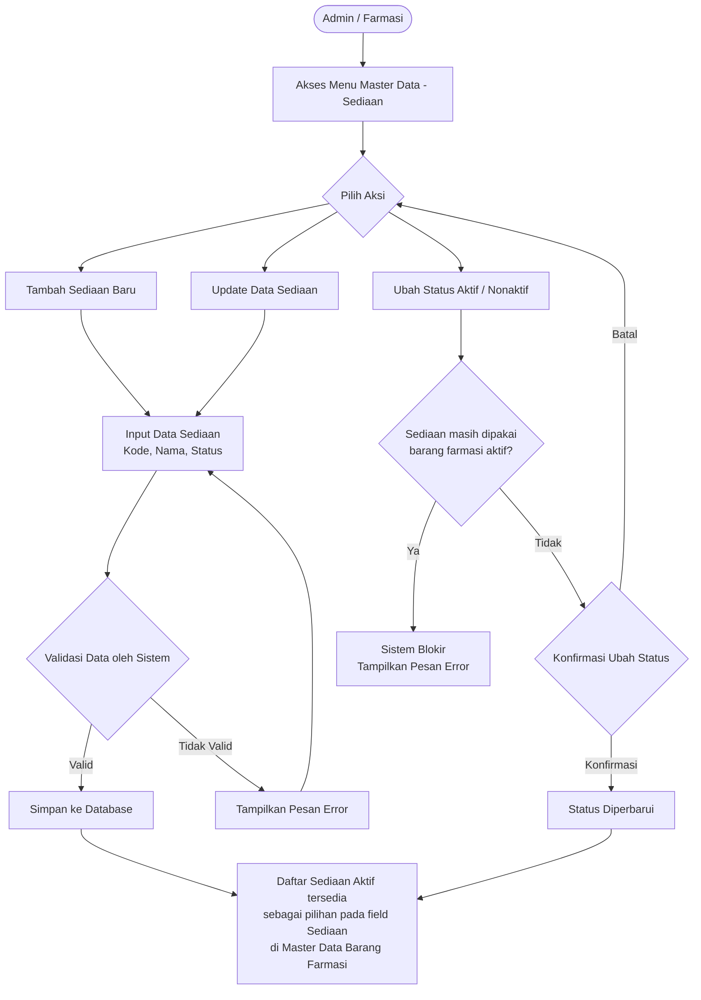

# Product Requirement Document
## Master Data - Sediaan

---

**Related Document**

| Dokumen | Link/Keterangan |
| :------ | :-------------- |
| Design Figma | - |

---

**Document Version**

| Tanggal | Versi | Keterangan |
| :------ | :---- | :--------- |
| 8 Juni 2026 | Versi 1.0 | Pembuatan Awal |

---

**Approval**

| PRD Approved By | Nama / Jabatan | Signature, Date |
| :-------------- | :------------- | :-------------- |
| [1] | M. Sulthan Farras Nanz — Chief Strategy & Growth Officer, Tamtech International | - |

**PIC**

| Nama | Role |
| :--- | :--- |
| Ulfa | Product Owner |
| Arif | System Analyst |

---

## 1. Overview / Brief Summary

Modul **Master Data - Sediaan** berfungsi sebagai master rujukan (*reference master*) yang menampung daftar jenis sediaan (bentuk sediaan obat), seperti Tablet, Kapsul, Sirup, Injeksi, dan Salep, yang digunakan di seluruh sistem.

Sebelumnya, pilihan jenis sediaan tertanam langsung (*hardcoded*) pada form input Master Data Barang Farmasi. Dengan modul ini, daftar sediaan dikelola secara terpusat sehingga dapat ditambah, diubah, atau dinonaktifkan tanpa perlu pengembangan ulang sistem.

Pada form Master Data Barang Farmasi, field "Sediaan" akan merujuk (mengambil pilihan) dari daftar sediaan berstatus Aktif yang dikelola pada modul ini, sehingga data sediaan konsisten di seluruh modul.

---

## 2. Background

Sebelum pengembangan modul ini, pilihan Sediaan pada Master Data Barang Farmasi berupa daftar statis. Akibatnya:

- Daftar sediaan sulit ditambah atau diperbarui karena tertanam (*hardcoded*) di dalam sistem.
- Penamaan sediaan rawan tidak konsisten antar input.
- Tidak ada satu sumber daftar sediaan yang dapat dirujuk modul lain.
- Setiap perubahan daftar sediaan membutuhkan keterlibatan tim teknis.

Modul ini dikembangkan untuk menjadi **sumber kebenaran tunggal (single source of truth)** bagi seluruh daftar jenis sediaan yang dirujuk oleh Master Data Barang Farmasi.

---

## 3. In Scope

### 3.1 Scope Definition

**Legend Phase**

| Penanda | Phase |
| :------ | :---- |
| _(tanpa penanda)_ | Phase 1 |
| `[**]` | Phase 2 |

| No | Scope / Area | Phase |
| :- | :----------- | :---- |
| 1 | Dashboard - Master Data Sediaan | Phase 1 |
| 2 | Tambah Data Sediaan | Phase 1 |
| 3 | Update Data Sediaan | Phase 1 |
| 4 | Aktif/Nonaktifkan Sediaan | Phase 1 |
| 5 | Penyediaan daftar Sediaan sebagai rujukan untuk Master Data Barang Farmasi | Phase 1 |
| 6 | Impor & Ekspor Data Sediaan | Phase 2 `[**]` |

### 3.2 Out Scope

| No | Scope |
| :- | :---- |
| 1 | Penetapan sediaan ke masing-masing barang (dilakukan pada form Master Data Barang Farmasi). |

---

## 4. Goals and Metrics

### Goals

- Menyediakan daftar jenis sediaan yang terpusat dan menjadi rujukan Master Data Barang Farmasi.
- Memastikan konsistensi penamaan sediaan di seluruh sistem.
- Mempermudah penambahan/perubahan sediaan tanpa pengembangan ulang sistem.
- Menghindari duplikasi data sediaan.

### Metrics

| No | Metrics | Success Criteria |
| :-: | :------ | :--------------- |
| 1 | Konsistensi data sediaan | 0% duplikasi nama sediaan di sistem. |
| 2 | Kemandirian user non-teknis | 100% user Farmasi/Admin mampu menambah sediaan tanpa bantuan tim teknis. |
| 3 | Rujukan oleh Master Data Barang Farmasi | 100% field Sediaan pada Master Data Barang Farmasi mengambil pilihan dari master ini. |
| 4 | Pencarian dan filter sediaan | Waktu pencarian data sediaan < 3 detik. |

---

## 5. Related Feature

| No | Module | Feature |
| :-: | :----- | :------ |
| 1 | Master Data Barang Farmasi | Field "Sediaan" merujuk pada daftar sediaan aktif dari modul ini. |

---

## 6. Business Process

### A. As-Is

Sebelum modul ini tersedia, daftar pilihan Sediaan pada form Master Data Barang Farmasi bersifat statis (*hardcoded*). Tidak ada pengelolaan terpusat, sehingga penambahan atau perubahan jenis sediaan mengharuskan keterlibatan tim teknis dan berpotensi menimbulkan inkonsistensi penamaan.

### B. To-Be

**Pengelolaan Daftar Sediaan Terpusat**
User Admin/Farmasi mengakses menu Master Data - Sediaan. User dapat menambah, mengubah, atau menonaktifkan jenis sediaan. Setiap sediaan memiliki atribut: Kode Sediaan, Nama Sediaan, dan Status.

**Rujukan pada Master Data Barang Farmasi**
Saat menambah/mengubah barang farmasi, field Sediaan menampilkan daftar sediaan berstatus Aktif dari modul ini.

**Validasi dan Kontrol Data**
Sistem memvalidasi agar tidak ada duplikasi nama sediaan. Sediaan yang masih dipakai barang farmasi aktif tidak dapat dinonaktifkan.

**Audit Trail dan Keamanan Data**
Setiap perubahan (tambah, ubah, nonaktif/aktif) terekam dalam audit trail.

---

## 7. Main Flow



**Alur Tambah / Update Sediaan**

1. Admin membuka menu **Master Data → Sediaan**.
2. Klik tombol ➕ untuk tambah, atau klik baris data untuk update.
3. Isi / ubah field: Kode Sediaan (autogenerate), Nama Sediaan, Status.
4. Klik **Simpan** / **Update** → sistem validasi → data tersimpan.
5. Daftar sediaan aktif langsung tersedia sebagai pilihan di Master Data Barang Farmasi.

**Alur Ubah Status Sediaan**

1. Dari Dashboard, klik tombol **Ubah Status** pada baris sediaan.
2. Sistem mengecek apakah sediaan masih dipakai barang farmasi aktif.
   - Jika ya → sistem memblokir dan menampilkan pesan error.
   - Jika tidak → tampilkan warning konfirmasi perubahan status.
3. Klik **Ubah Status** untuk konfirmasi, atau **Batal** untuk membatalkan.

---

## 8. Requirement

### Level Prioritas

| Level | Deskripsi |
| :---- | :-------- |
| P0 | Critical — bagian dari MVP Product |
| P1 | Must Have — eksistensinya tidak sefatal P0 |
| P2 | Should Have — secara signifikan meningkatkan kenyamanan pengguna |
| P3 | Low — fitur tambahan atau kosmetik product |
| P4 | Enhancement — inovasi masa depan |

---

### US-001 — Dashboard Master Data Sediaan

**User Story**
Sebagai Admin Master Data, saya ingin melihat Dashboard data Sediaan, agar seluruh jenis sediaan yang dirujuk Master Data Barang Farmasi dapat terpantau dengan baik.

**Priority:** P0

**Criteria Details**

- Ketika klik menu **Master Data → Sediaan**, menampilkan halaman Dashboard Data Sediaan.
- Dashboard menampilkan tabel dengan kolom:
  - Nomor
  - Kode
  - Nama Sediaan
  - Jumlah Barang
  - Status
- Kolom Nama Sediaan, Jumlah Barang, dan Status dapat diklik untuk sorting (ascending/descending).
- Urutan default: Nama Sediaan **Ascending (A-Z)**.
- Terdapat kolom Pencarian berdasarkan: Nama Sediaan, Status.
- Terdapat Pagination: 10 / 20 / 50 / 100 data per halaman.
- Terdapat tombol ➕ untuk menambah data baru.

**Acceptance Criteria**
- Menampilkan kumpulan data sediaan yang tersimpan dari proses Tambah Data sebelumnya.
- Pencarian sesuai dengan keyword yang dimasukkan.

---

### US-002 — Tambah Data Sediaan

**User Story**
Sebagai Admin Master Data, saya ingin menambahkan data Sediaan, agar jenis sediaan baru dapat dipilih pada Master Data Barang Farmasi.

**Priority:** P0

**Criteria Details**

- Klik tombol ➕ menampilkan view **Tambah Sediaan** (overlay).
- Form berisi field: Kode Sediaan, Nama Sediaan, Status.
- Detail requirement setiap field dibahas di bagian Data Requirements.

**Acceptance Criteria**
- Data tersimpan sesuai dengan inputan dan langsung tersedia sebagai pilihan pada field Sediaan di Master Data Barang Farmasi.

---

### US-003 — Update Data Sediaan

**User Story**
Sebagai Admin Master Data, saya ingin melihat sekaligus mengubah detail Sediaan apabila diperlukan, agar daftar sediaan selalu sesuai kebutuhan.

**Priority:** P0

**Criteria Details**

- Semua kolom data dapat diedit (editable).
- Perubahan nama sediaan akan langsung tercermin pada seluruh barang farmasi yang merujuk sediaan tersebut.

**Acceptance Criteria**
- Data tersimpan sesuai dengan perubahan yang dilakukan.
- Perubahan data tercatat sebagai riwayat aktivitas.

---

### US-004 — Ubah Status Sediaan

**User Story**
Sebagai Admin Master Data, saya ingin mengubah status Sediaan dari Dashboard, agar status sediaan bisa diperbarui tanpa harus membuka Detail terlebih dahulu.

**Priority:** P2

**Criteria Details**

- Klik tombol **Ubah Status** menampilkan warning **Perubahan Status** disertai tombol **Batal** dan **Ubah Status**.
  - Jika status saat ini **Aktif** → warning perubahan menjadi **Nonaktif**.
  - Jika status saat ini **Nonaktif** → warning perubahan menjadi **Aktif**.
- Sediaan **tidak dapat dinonaktifkan** apabila masih dipakai oleh barang farmasi yang aktif (Jumlah Barang > 0).

**Acceptance Criteria**
- Status berganti dari Aktif → Nonaktif maupun sebaliknya.
- Sediaan yang masih dipakai barang aktif tidak dapat dinonaktifkan.

---

### US-005 — Riwayat Aktivitas

**User Story**
Sebagai Admin, saya ingin mengetahui kapan data sediaan dibuat/diubah/dinonaktifkan/diaktifkan, oleh siapa, dan data apa saja yang berubah.

**Priority:** P4

**Criteria Details**

Sistem menyimpan data history aktivitas berupa:

- **Tanggal & Waktu** — format `dd/mm/yyyy HH:mm`.
- **Nama** — user yang melakukan aksi.
- **Jenis Aktivitas:**
  - `Dibuat` (created_at)
  - `Diubah` (updated_at)

Contoh tampilan:
```
Dibuat oleh Agus pada 11/09/2026 13:13
```

**Acceptance Criteria**
- Menampilkan data riwayat aktivitas dari aktivitas dibuat dan diubah.

---

## 9. Data Requirements

### A. Dashboard Data Sediaan

| No | Kolom | Sumber Data |
| :- | :---- | :---------- |
| 1 | Nomor | Urutan: 1, 2, 3, … |
| 2 | Kode | Sesuai data Detail Sediaan - Kode Sediaan |
| 3 | Nama Sediaan | Sesuai data Detail Sediaan - Nama Sediaan |
| 4 | Jumlah Barang | Jumlah barang farmasi aktif yang merujuk sediaan ini (dihitung dari Master Data Barang Farmasi) |
| 5 | Status | Sesuai data Detail Sediaan - Status |

---

### B. Tambah Sediaan

#### B.1 Section Data Sediaan

| No | Field | Tipe | Aturan |
| :- | :---- | :--- | :----- |
| — | Kode Sediaan | Autogenerate | Format: `SEDIAAN-0001`. Mandatory. Non-editable. |
| 1 | Nama Sediaan | Text Input | Default: kosong. Min 2 karakter, max 100 karakter. Mandatory. Tidak boleh duplikasi. Contoh: Tablet, Kapsul, Sirup, Injeksi, Salep, Krim, Suppositoria, Tetes Mata. |
| 2 | Status | Switch | Default: Aktif. Pilihan: Aktif / Nonaktif. Tidak dapat diset Nonaktif bila masih dipakai barang farmasi aktif (Jumlah Barang > 0). |

---

### C. Detail Sediaan

Data Requirements sama seperti **B. Tambah Sediaan**. Semua field dapat diedit (editable).

---

## 10. Validasi

| Fitur | Kondisi | Pesan Error |
| :---- | :------ | :---------- |
| Tambah / Update Sediaan | Nama Sediaan sudah ada di sistem. | "Data sudah digunakan, gunakan nama lain." |
| Ubah Status | Sediaan dinonaktifkan padahal masih dipakai barang farmasi aktif. | "Sediaan masih digunakan oleh barang farmasi aktif dan tidak dapat dinonaktifkan." |

---

## 11. Case & Mitigasi

| No | Case | Dampak | Mitigasi |
| :-: | :--- | :----- | :------- |
| 1 | Sediaan dinonaktifkan padahal masih dirujuk barang farmasi aktif. | Barang farmasi kehilangan pilihan sediaan yang valid. | Sistem mencegah nonaktif jika masih dipakai. |
| 2 | Nama sediaan diubah saat sudah dirujuk barang farmasi. | Perubahan langsung tercermin pada seluruh barang yang merujuk sediaan tersebut. | Karena disimpan sebagai rujukan, perubahan berlaku pada data historis maupun data baru; seluruh perubahan tercatat di audit trail. |

---

## 12. Lampiran / Catatan

### Data Awal Sediaan (Default Sistem)

| No | Nama Sediaan | No | Nama Sediaan |
| -: | :----------- | -: | :----------- |
| 1 | Concentrate | 33 | Puyer tidak terbagi |
| 2 | Diskus | 34 | Rectal Tube |
| 3 | Dragee | 35 | Salep |
| 4 | Drop | 36 | Salep Kulit |
| 5 | Emulgel | 37 | Salep Mata |
| 6 | Emulsi | 38 | Semprot Hidung |
| 7 | Enema | 39 | Serbuk |
| 8 | Enteric Coated Tablet | 40 | Serbuk Injeksi |
| 9 | Film Coated Caplet | 41 | Sirup |
| 10 | Film Coated Tablet | 42 | Sirup Kering |
| 11 | Flex Pen | 43 | Softbag |
| 12 | Gel | 44 | Softgel Kapsul |
| 13 | Infus | 45 | Solutio |
| 14 | Inhalasi | 46 | Suppositoria |
| 15 | Inhaler | 47 | Suspensi |
| 16 | Injeksi | 48 | Suspensi Injeksi |
| 17 | Kaplet | 49 | Tablet |
| 18 | Kaplet Coated | 50 | Tablet Dispersible |
| 19 | Kaplet Kunyah | 51 | Tablet Effervescent |
| 20 | Kaplet Salut Selaput | 52 | Tablet Hisap |
| 21 | Kapsul | 53 | Tablet Kunyah |
| 22 | Kapsul Lunak | 54 | Tablet Oral |
| 23 | Keras | 55 | Tablet Salut |
| 24 | Krim | 56 | Tablet Salut Gula |
| 25 | Larutan | 57 | Tablet Salut Selaput |
| 26 | Lotion | 58 | Tablet Sublingual |
| 27 | mg/0.5ml | 59 | Tablet Vaginal |
| 28 | Mixtur | 60 | Tetes |
| 29 | Nebule | 61 | Tetes Hidung |
| 30 | Ovula | 62 | Tetes Mata |
| 31 | Pad | 63 | Tetes Oral |
| 32 | Patch | 64 | Tetes Telinga |
65 | Simplisia Kering

---

## Change Log

| No | Item | Perubahan | Tanggal |
| :-: | :--- | :-------- | :------ |
| 1 | Master Data Sediaan | Versi 1.0 - Pembuatan awal dokumen. | 8 Juni 2026 |
