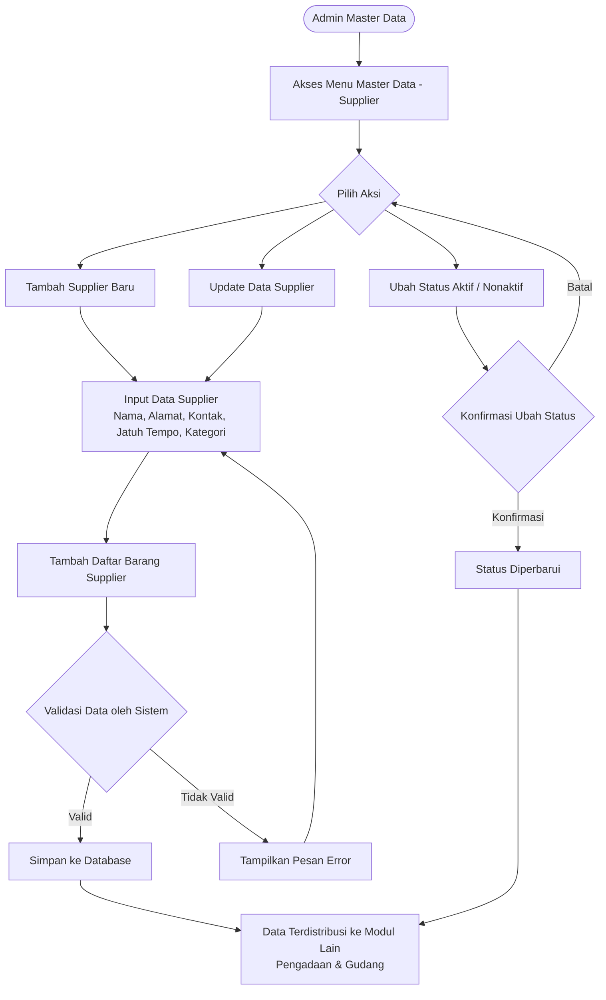
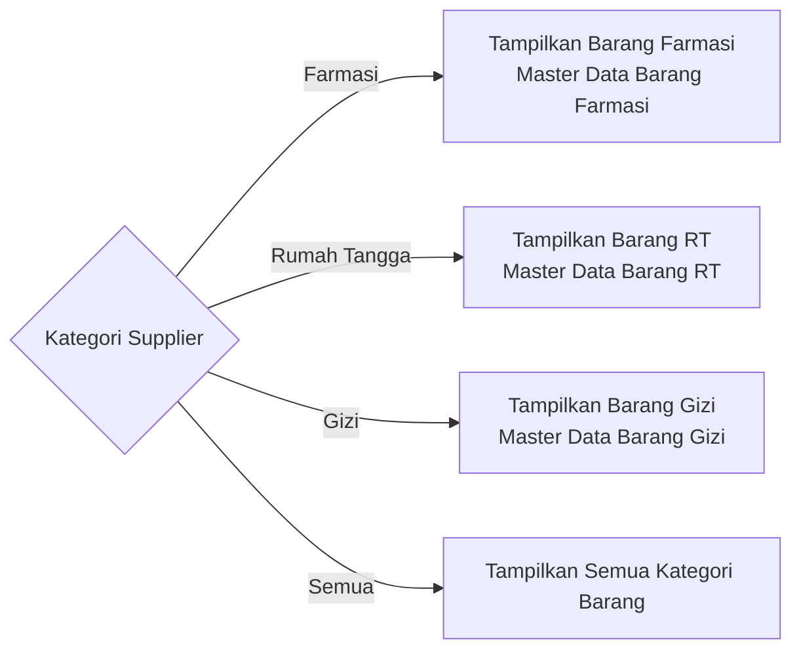

# Product Requirement Document
## Master Data - Supplier

---

**Related Document**

| Dokumen | Link/Keterangan |
| :------ | :-------------- |
| Design Figma | - |

---

**Document Version**

| Tanggal | Versi | Keterangan |
| :------ | :---- | :--------- |
| 24 Oktober 2025 | Versi 1.0 | Pembuatan Awal |

---

**Approval**

| PRD Approved By | Nama / Jabatan | Signature, Date |
| :-------------- | :------------- | :-------------- |
| [1] | M. Sulthan Farras Nanz — Chief Strategy & Growth Officer, Tamtech International | - |

---

## 1. Overview / Brief Summary

Modul **Master Data - Supplier** pada sistem Neurovi berfungsi sebagai pusat pengelolaan data penyedia barang dari berbagai kategori (Farmasi, Rumah Tangga, Gizi, dan lainnya) yang beroperasi di lingkungan Rumah Sakit.

Dalam operasional Rumah Sakit, proses pengadaan dan distribusi barang bergantung pada data Supplier yang valid dan terstruktur. Supplier berperan penting dalam penyediaan barang farmasi, barang rumah tangga, dan barang gizi yang digunakan di berbagai unit.

Dengan adanya pengelolaan Supplier yang terpusat, sistem dapat memastikan keakuratan data dalam setiap proses pembelian, pencatatan stok, hingga audit pengadaan — sehingga mendukung transparansi dan efisiensi rantai pasok rumah sakit.

---

## 2. Background

Sebelum pengembangan modul ini, data supplier di masing-masing modul (Farmasi, Rumah Tangga, dan Gizi) masih dikelola secara terpisah. Akibatnya:

- Terjadi duplikasi dan inkonsistensi data supplier antar gudang.
- Kesulitan dalam melakukan penelusuran riwayat pengadaan per supplier.
- Tidak adanya kontrol terhadap jatuh tempo pembayaran atau hubungan dagang dengan supplier.
- Proses integrasi dengan sistem pengadaan menjadi rumit karena tidak ada data supplier yang terstandar.

Modul ini dikembangkan untuk menjadi **sumber kebenaran tunggal (single source of truth)** bagi seluruh data supplier di sistem Neurovi.

---

## 3. In Scope

### 3.1 Scope Definition

**Legend Phase**

| Penanda | Phase |
| :------ | :---- |
| _(tanpa penanda)_ | Phase 1 |
| `[**]` | Phase 2 |
| `[***]` | Phase 3 |
| `[****]` | Phase 4 |

| No | Scope / Area | Phase |
| :- | :----------- | :---- |
| 1 | Dashboard - Master Data Supplier | Phase 1 |
| 2 | Tambah Data Supplier | Phase 1 |
| 3 | Update Data Supplier | Phase 1 |
| 4 | Aktif/Nonaktifkan Supplier | Phase 1 |
| 5 | Daftar Barang Supplier | Phase 1 |
| 6 | Impor dan Ekspor Data Supplier | Phase 2 `[**]` |
| 7 | Pemetaan Akun COA | Phase 3 `[***]` |

### 3.2 Out Scope

| No | Scope |
| :- | :---- |
| 1 | Proses pemesanan dan penerimaan barang ke supplier (ditangani modul Inventory). |
| 2 | Pengelolaan master data barang (ditangani modul masing-masing). |

---

## 4. Goals and Metrics

### Goals

- Menyediakan pusat pengelolaan data supplier yang terstandar untuk seluruh kategori barang (Farmasi, Rumah Tangga, Gizi, atau lainnya).
- Memastikan setiap proses pengadaan dan penerimaan barang mengacu pada data supplier yang sama.
- Mempermudah proses evaluasi, audit, dan pengendalian hubungan dagang dengan supplier.
- Mengintegrasikan informasi supplier dengan daftar barang yang mereka sediakan.
- Meningkatkan efisiensi dan akurasi pengelolaan pengadaan antar gudang di rumah sakit.

### Metrics

| No | Metrics | Success Criteria |
| :-: | :------ | :--------------- |
| 1 | Konsistensi data antar modul | 100% modul menggunakan referensi data supplier yang sama. |
| 2 | Kemandirian user non-teknis | 100% user Admin RS mampu melakukan setup tanpa bantuan tim teknis. |
| 3 | Kecepatan update konfigurasi | 100% perubahan data langsung terbaca real-time tanpa restart sistem. |
| 4 | Pencarian dan filter supplier | Waktu pencarian data supplier < 3 detik. |

---

## 5. Related Feature

| No | Module | Feature |
| :-: | :----- | :------ |
| 1 | Inventory | Pemesanan Supplier, Penerimaan Barang, Peminjaman dan Pengembalian Barang |
| 2 | Master Data | Barang Farmasi, Barang RT, Barang Gizi, Kategori Supplier |

---

## 6. Business Process

### A. As-Is

Sebelum modul ini tersedia, pengelolaan data supplier dilakukan secara terpisah di masing-masing modul (Farmasi, Rumah Tangga, Gizi). Tidak ada sumber data terpusat, sehingga terjadi duplikasi data, inkonsistensi referensi supplier antar gudang, dan sulitnya audit pengadaan lintas unit.

### B. To-Be

**Pengelolaan Data Supplier Terpusat**
User Admin RS atau Configuration Manager mengakses menu Master Data - Supplier. User dapat menambahkan, mengedit, atau menonaktifkan data supplier. Setiap supplier memiliki atribut dasar: nama, alamat, kontak, email, dan jatuh tempo pembayaran.

**Klasifikasi Supplier Berdasarkan Kategori Gudang**
Saat membuat supplier baru, user memilih Kategori Supplier: Gudang Farmasi, Gudang Rumah Tangga, atau Gudang Gizi. Kategori ini menentukan keterkaitan supplier dengan modul atau gudang tertentu.

**Integrasi dengan Barang yang Disuplai**
Pada setiap supplier, user dapat menambahkan Daftar Barang Supplier yang mereka sediakan. Data ini digunakan dalam proses pengadaan dan penerimaan barang untuk validasi otomatis.

**Validasi dan Kontrol Data**
Sistem memvalidasi agar tidak ada duplikasi nama supplier atau email. Field jatuh tempo digunakan untuk menentukan tanggal pembayaran otomatis di modul keuangan. Status supplier (Aktif/Nonaktif) memengaruhi ketersediaan supplier dalam pemesanan barang.

**Audit Trail dan Keamanan Data**
Setiap perubahan (tambah, ubah, nonaktifkan) terekam dalam audit trail. Hanya user dengan role Admin RS atau Configuration Manager yang dapat mengubah data supplier.

---

## 7. Main Flow



**Alur Tambah / Update Supplier**

1. Admin membuka menu **Master Data → Supplier**.
2. Klik tombol ➕ untuk tambah, atau tombol **Detail** pada baris data untuk update.
3. Isi / ubah field Data Supplier (Kategori, Nama, Alamat, Kontak, Email, Fax, Jatuh Tempo).
4. Tambahkan Daftar Barang Supplier pada section terkait.
5. Klik **Simpan** / **Update** → sistem validasi → data tersimpan dan terdistribusi.

**Alur Ubah Status Supplier**

1. Dari Dashboard, klik tombol **Ubah Status** pada baris supplier.
2. Sistem menampilkan warning konfirmasi perubahan status (Aktif ↔ Nonaktif).
3. Klik **Ubah Status** untuk konfirmasi, atau **Batal** untuk membatalkan.

---

## 8. Requirement

### Level Prioritas

| Level | Deskripsi |
| :---- | :-------- |
| P0 | Critical — bagian dari MVP Product |
| P1 | Must Have — eksistensinya tidak sefatal P0 |
| P2 | Should Have — secara signifikan meningkatkan kenyamanan pengguna |
| P3 | Low — fitur tambahan atau kosmetik product |
| P4 | Enhancement — inovasi masa depan |

---

### US-001 — Dashboard Master Data Supplier

**User Story**
Sebagai Admin Master Data, saya ingin melihat Dashboard data Supplier, agar data Supplier bisa terpantau dengan baik.

**Priority:** P0

**Criteria Details**

- Ketika klik menu **Master Data → Supplier**, menampilkan halaman Dashboard Data Supplier.
- Dashboard menampilkan tabel dengan kolom:
  - Kategori Supplier
  - ID Supplier
  - Nama
  - No. Telepon
  - Email
  - Jatuh Tempo
  - Status
- Semua kolom dapat diklik untuk sorting (ascending/descending).
- Urutan default: Nama Supplier **Ascending (A-Z)**.
- Terdapat kolom Pencarian berdasarkan: ID Supplier, Nama, Alamat, No. Telepon, Email.
- Terdapat Pagination: 10 / 20 / 50 / 100 data per halaman.
- Setiap baris data memiliki tombol **Detail**.
- Terdapat tombol ➕ untuk menambah data baru (tooltip: "Tambah Supplier").

**Acceptance Criteria**
- Menampilkan kumpulan data yang tersimpan dari proses Tambah Data sebelumnya.
- Pencarian sesuai dengan keyword yang dimasukkan.
- Data tampil sesuai filter/sorting yang dipilih.

---

### US-002 — Tambah Data Supplier

**User Story**
Sebagai Admin Master Data, saya ingin menambahkan data Supplier, agar data Supplier selalu update dengan data terbaru.

**Priority:** P0

**Criteria Details**

- Klik tombol ➕ menampilkan view **Tambah Supplier** (overlay).
- Tooltip tombol ➕ → "Tambah Supplier".
- Form berisi field sesuai Data Requirements bagian B.

**Acceptance Criteria**
- Data tersimpan sesuai dengan inputan.

---

### US-003 — Update Data Supplier

**User Story**
Sebagai Admin Master Data, saya ingin melihat sekaligus mengubah detail Supplier apabila diperlukan, agar Detail Supplier selalu update dengan data terbaru.

**Priority:** P0

**Criteria Details**

- Klik tombol **Detail** menampilkan view **Detail Supplier**.
- Tooltip tombol Detail → "Detail Supplier" → "Ubah Data".
- Halaman Detail Supplier memiliki kolom data dan section yang sama seperti halaman Tambah Supplier.
- Semua kolom data dapat diedit (editable).
- Terdapat tombol **Update** di bagian bawah untuk menyimpan perubahan ke database.

**Acceptance Criteria**
- Data tersimpan sesuai dengan perubahan yang dilakukan.
- Perubahan data tercatat sebagai riwayat aktivitas.

---

### US-004 — Ubah Status Supplier

**User Story**
Sebagai Admin Master Data, saya ingin mengubah status Supplier dari Dashboard, agar status Supplier bisa diperbarui tanpa harus membuka Detail Supplier terlebih dahulu.

**Priority:** P2

**Criteria Details**

- Klik tombol **Ubah Status** menampilkan warning **Perubahan Status** disertai tombol **Batal** dan **Ubah Status**.
  - Jika status saat ini **Aktif** → warning perubahan menjadi **Nonaktif**.
  - Jika status saat ini **Nonaktif** → warning perubahan menjadi **Aktif**.
- Tooltip tombol Ubah Status → "Ubah Status Supplier".

**Acceptance Criteria**
- Status berganti dari Aktif → Nonaktif maupun sebaliknya.

---

### US-005 — Daftar Barang Supplier

**User Story**
Sebagai Admin Master Data, saya ingin memilih nama-nama barang yang di-supply oleh Supplier, agar ketika melakukan pemesanan supplier saya bisa melihat rekomendasi daftar barang yang bisa di-supply.

**Priority:** P1

**Criteria Details**

Section **Daftar Barang Supplier** muncul pada halaman Tambah Data dan Update Data, berisi:

- **Filter Nama Pabrik** — multiselect dropdown, sumber: Master Data Pabrik.
- **Filter Kategori Barang** — multiselect dropdown, sumber: sesuai Kategori Supplier yang dipilih.
- **Kolom Pencarian** — mencari berdasarkan Nama Barang atau Kode Barang.
- **Tabel Daftar Barang Master Data** — menampilkan barang dari Master Data Farmasi / RT / Gizi sesuai filter, dengan kolom: Nama Barang, Kategori, Satuan & Kemasan.
- **Tabel Daftar Barang Supplier** — menampilkan barang yang telah dipilih untuk supplier ini, dengan kolom: Nama Barang.
- Tombol **Pindahkan** untuk memindahkan barang antar dua tabel (bisa memilih lebih dari 1 barang sekaligus).
- Nama Barang yang muncul pada Tabel Daftar Barang Master Data ditentukan oleh **Kategori Supplier** yang dipilih.
- Daftar barang pada Tabel Daftar Barang Supplier akan digunakan sebagai **rekomendasi barang** di fitur Pemesanan Supplier.

**Acceptance Criteria**
- Sesuai dengan Criteria Details.

---

### US-006 — Riwayat Aktivitas

**User Story**
Sebagai Admin, saya ingin mengetahui kapan data tersebut dibuat/diubah/dinonaktifkan/diaktifkan, oleh siapa, dan data apa saja yang berubah.

**Priority:** P0

**Criteria Details**

Sistem menyimpan data history aktivitas berupa:

- **Tanggal & Waktu** — format `dd/mm/yyyy HH:mm`.
- **User ID / Nama** — user yang melakukan aksi.
- **Jenis Aktivitas:**
  - `Dibuat` (created_at)
  - `Diubah` (updated_at) — disertai detail field yang berubah, format: `Field: data lama → data baru`

Contoh tampilan:
```
Dibuat oleh 111/Agus pada 11/09/2026 13:13
Diubah oleh 222/Joko pada 12/09/2026 09:01
  Alamat: Solo → Jogja
  No Telp: 0983717131 → 0931111112
```

**Acceptance Criteria**
- Menampilkan data riwayat aktivitas dari aktivitas dibuat dan diubah.

---

### US-007 — Ekspor Excel `[**]` (Phase 2)

**User Story**
Sebagai Admin Master Data, saya ingin mengekspor data Supplier ke template Excel, agar dapat mengunduh data secara kolektif lebih efisien.

**Criteria Details**

- Tombol **Ekspor** untuk mengunduh data Supplier dalam format Excel.
- File terunduh ke internal storage.

**Acceptance Criteria**
- File berhasil terunduh ke internal storage.
- File terunduh sesuai preferensi data apabila dilakukan filter/search.

---

### US-008 — Pemetaan Akun COA `[***]` (Phase 3)

**User Story**
Sebagai Admin dan Keuangan, saya ingin mengelola pemetaan akun COA yang disematkan pada supplier untuk kebutuhan Jurnal Otomatis.

**Criteria Details**

- Data autofill sesuai Pengaturan COA - Supplier.
- Menampilkan akun COA dari Daftar Akun COA di Keuangan.
- Data dapat diedit.

**Acceptance Criteria**
- Menampilkan akun COA.
- Data akun COA yang tersimpan sesuai dengan inputan.

---

## 9. Data Requirements

### A. Dashboard Data Supplier

| No | Kolom | Sumber Data |
| :- | :---- | :---------- |
| 1 | Kategori Supplier | Sesuai data Detail Supplier - Kategori Supplier |
| 2 | ID Supplier | Sesuai data Detail Supplier - ID Supplier; tidak boleh duplikasi |
| 3 | Nama Supplier | Sesuai data Detail Supplier - Nama Supplier |
| 4 | No. Telepon | Sesuai data Detail Supplier - No. Telepon |
| 5 | Email | Sesuai data Detail Supplier - Email |
| 6 | Jatuh Tempo | Sesuai data Detail Supplier - Jatuh Tempo |
| 7 | Status | Sesuai data Detail Supplier - Status |

---

### B. Tambah Supplier

#### B.1 Section Data Supplier

| No | Field | Tipe | Aturan |
| :- | :---- | :--- | :----- |
| 1 | Kategori Supplier | Multiple Checkbox | Pilihan: Farmasi, Rumah Tangga, Gizi, Semua (default). Mandatory, minimal pilih 1. |
| 2 | ID Supplier | Autogenerate | Format: `S0001`, `S0002`. Mandatory. Tidak boleh duplikasi. Non-editable. |
| 3 | Nama Supplier | Text Input | Min 3 karakter, max 200 karakter. Mandatory. Tidak boleh duplikat. |
| 4 | Alamat | Dropdown + Freetext | Dropdown (Provinsi, Kabupaten, Kelurahan, Kecamatan) dari Master Data Wilayah. Freetext min 5, max 200 karakter. Optional. |
| 5 | No. Telepon | Numerik Input | Max 20 karakter. Optional. |
| 6 | Email | Text Input | Max 200 karakter. Optional. Validasi format email. |
| 7 | Fax | Freetext Input | Max 20 karakter. Optional. |
| 8 | Jatuh Tempo (Hari) | Numerik Input | Default: 0. Max value: 9999. Optional. |
| 9 | Status | Switch | Default: Aktif. Pilihan: Aktif / Nonaktif. |

---

#### B.2 Section Daftar Barang Supplier

> Section ini muncul hanya ketika US-005 telah terimplementasi.

**Filter & Pencarian**

| No | Field | Tipe | Aturan |
| :- | :---- | :--- | :----- |
| 1 | Nama Pabrik | Multiselect Dropdown | Sumber: Master Data Pabrik. Optional. |
| 2 | Kategori Barang | Multiselect Dropdown | Sumber: sesuai Kategori Supplier yang dicentang. Optional. |
| 3 | Kolom Pencarian | Text Input | Mencari berdasarkan Nama Barang dan Kode Barang. Optional. |

**Logika Kategori Barang berdasarkan Kategori Supplier:**



---

#### B.2.1 Tabel Daftar Barang Master Data

| No | Kolom | Sumber Data | Interaksi |
| :- | :---- | :---------- | :-------- |
| 1 | Nama Barang | Master Data Barang Farmasi / RT / Gizi sesuai filter | Klik baris → pilih; klik **Pindahkan** → pindah ke Tabel Daftar Barang Supplier. Bisa multi-select. |
| 2 | Kategori | Master Data Barang Farmasi / RT / Gizi sesuai filter | Sama seperti di atas. |
| 3 | Kemasan | Master Data Satuan & Kemasan dari Master Data Barang | Sama seperti di atas. |

---

#### B.2.2 Tabel Daftar Barang Supplier

| No | Kolom | Sumber Data | Interaksi |
| :- | :---- | :---------- | :-------- |
| 1 | Nama Barang | Barang yang telah dipindahkan dari Tabel Daftar Barang Master Data | Klik baris → pilih; klik **Pindahkan** → pindah kembali ke Tabel Daftar Barang Master Data. Bisa multi-select. |

---

#### B.3 Section Pemetaan Akun COA `[***]` (Phase 3)

| No | Field | Sumber Data | Default | Format |
| :- | :---- | :---------- | :------ | :----- |
| 1 | Akun Uang Muka | Master data daftar akun level terakhir kategori Aset Lancar & Aset Lancar Lainnya | Diatur dari Pengaturan Akun → Pemetaan COA Kontak → Supplier → Akun Uang Muka | `Kode Akun - Nama COA` (contoh: `1.11.11.11 - Pendapatan`) |
| 2 | Akun Hutang | Master data daftar akun level terakhir kategori Hutang & Hutang Jangka Pendek | Diatur dari Pengaturan Akun → Pemetaan COA Kontak → Supplier → Akun Hutang | `Kode Akun - Nama COA` (contoh: `1.11.11.11 - Pendapatan`) |

---

### C. Detail Supplier

Data Requirements sama seperti **B. Tambah Supplier**. Semua field dapat diedit (editable).

---

## 10. Validasi

| Fitur | Kondisi | Pesan Error |
| :---- | :------ | :---------- |
| Tambah / Update Supplier | Nama Supplier kosong saat Simpan. | "Nama Supplier wajib diisi." |
| Tambah / Update Supplier | Nama Supplier atau Email sudah ada di sistem. | "Data sudah digunakan, gunakan nama/email lain." |
| Tambah / Update Supplier | Tidak ada Kategori Supplier yang tercentang. | "Pilih minimal 1 Kategori Supplier." |
| Tambah / Update Supplier | Format Email tidak valid. | "Format email tidak valid." |

---

## 11. Case & Mitigasi

| No | Case | Dampak | Mitigasi |
| :-: | :--- | :----- | :------- |
| CL1 | Supplier dinonaktifkan padahal masih dipakai pada pemesanan berjalan. | Pemesanan yang sedang berjalan kehilangan referensi supplier. | Status nonaktif hanya mencegah pemilihan baru; transaksi berjalan tetap memakai data lama. |
| CL2 | Duplikasi nama/email supplier. | Data ganda dan kebingungan saat memilih supplier. | Validasi keunikan nama dan email saat Simpan/Update. |
| CL3 | Update kategori supplier ketika daftar barang sudah dipilih. | Ketidaksesuaian daftar barang dengan kategori supplier yang baru. | Tampilkan warning sebelum update kategori: jika dikonfirmasi, seluruh barang dengan kategori yang tidak lagi dipilih akan terhapus dari daftar barang supplier. |

---

## 12. Lampiran / Catatan

### Catatan Interoperabilitas Antar Modul

- **Kategori Supplier** menentukan kategori barang yang tampil pada section Daftar Barang Supplier.
- Daftar barang yang dipilih untuk tiap supplier akan menjadi **rekomendasi** pada fitur Pemesanan Supplier di modul Pengadaan.
- Field **Jatuh Tempo** digunakan modul Keuangan untuk menghitung tanggal pembayaran otomatis.

---

## Change Log

| No | Item | Perubahan | Tanggal |
| :-: | :--- | :-------- | :------ |
| 1 | Master Data Supplier | Versi 1.0 - Pembuatan awal dokumen. | 24 Oktober 2025 |
