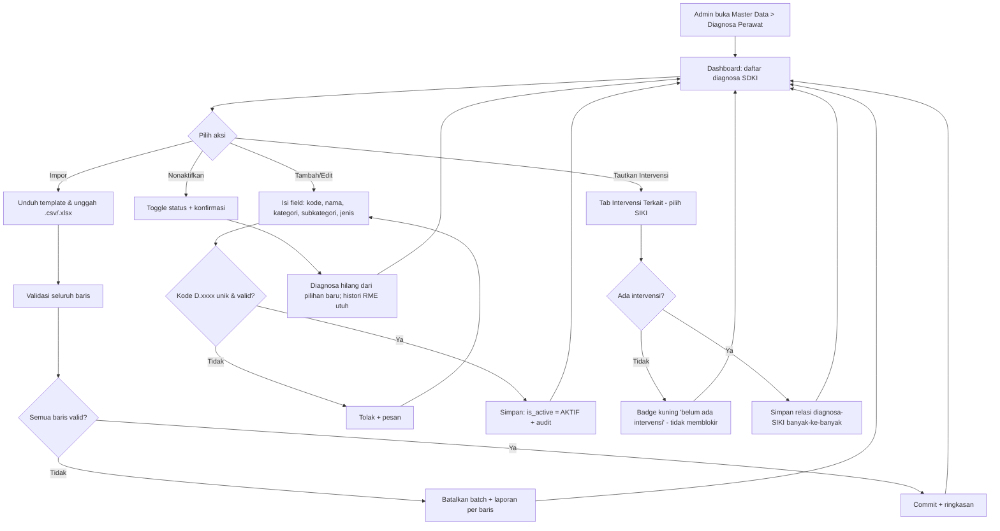

# PRD — Master Data Diagnosa Perawat / SDKI (A12)

> Modul: **Control Panel > Master Data > Diagnosa Perawat** · Kode Fitur: **A12** · Cluster: **Control Panel** · Tribe: Backoffice Administrasi
> Tujuan: menjadi **acuan / single source of truth data diagnosa keperawatan** (katalog baku SDKI 149 diagnosa, D.0001–D.0149) yang dipakai ulang modul Asesmen Perawat & CPPT Perawat, dengan keterkaitan 3S (SDKI–SIKI–SLKI).

---

## 1. Metadata Dokumen

* **Approval**: [Nama Stakeholder — Manajer Keperawatan / PM, Tanggal] — [PERLU KONFIRMASI]
* **Related Documents**:
    * PRD-Master-Data-Diagnosa-Perawat v1.1 (baseline) & Blok Keputusan OQ Master Diagnosa Keperawatan
    * Prinsip Generator & Alasan PRD Master Diagnosa Keperawatan v2
    * SDKI PPNI 2016 — 149 diagnosa, 5 kategori, 14 subkategori (D.0001–D.0149)
    * Master bersaudara: **SIKI** (Intervensi) & **SLKI** (Luaran) — 📌 perlu assign kode fitur
    * List Fitur V2.xlsx (sheet MVP Fitur Operasional, kode A12) · Related: A11, A18, A53, A37
* **Document Version**:

| Tanggal | Versi | Deskripsi Perubahan |
| --- | --- | --- |
| — | 1.0 | Draft awal master diagnosa keperawatan (SDKI + struktur 3S) |
| — | 1.1 | Hapus BR-011 & seluruh referensi lapis naratif berlisensi PPNI |
| 1 Jul 2026 | 2.0 | Konversi ke format template (phasing, State Machine, skema DB/API English, Status Behavior) |

---

## 2. Overview & Background

* **Overview / Brief Summary**:
    Master Data Diagnosa Perawat (Kode **A12**, cluster **Control Panel > Master Data**) adalah **katalog baku diagnosa keperawatan** di Neurovi, dikelola terpusat dan dipakai ulang oleh modul keperawatan. Diagnosa keperawatan = penilaian perawat atas **respons pasien** (mis. *"Bersihan Jalan Napas Tidak Efektif"*, *"Defisit Nutrisi"*) — **berbeda** dari diagnosa medis/ICD-10 (dokter) yang dikelola di **A11**.
    Daftar baku ditetapkan **PPNI** melalui **SDKI**: **149 diagnosa** berkode **D.0001–D.0149**, **5 kategori** & **14 subkategori**. Perawat **memilih dari daftar resmi, bukan mengetik bebas** — agar data seragam, cepat, dan rapi untuk RME, akreditasi (KARS/STARKES), & pelaporan.
    SDKI bagian kerangka **3S**: **SDKI** (diagnosa) → **SIKI** (intervensi) → **SLKI** (luaran). Master ini menampung **keterkaitan penuh 3S sejak awal**; Phase 1 memuat & memakai **diagnosa + intervensi (SIKI)**, struktur **luaran (SLKI)** disiapkan untuk Phase 2.
    Lingkup A12: **daftar diagnosa, pengelolaan/pencarian, keterkaitan 3S**. Pemilihan diagnosa untuk pasien tertentu, penyusunan rencana asuhan, & catatan perkembangan ada di modul **Asesmen Perawat** & **CPPT Perawat** yang *memakai* master ini.

* **Business Process (As-Is vs To-Be)**:
    * **As-Is** (kondisi saat ini — telaah data v1):
        1. Dokumentasi asuhan RS Tipe C/D banyak berbasis kertas / referensi tidak seragam → penegakan diagnosa tidak konsisten, sulit diaudit, rawan tidak memenuhi akreditasi. [ASUMSI]
        2. Data v1 hanya ≈11–15 diagnosa **tanpa kode**, istilah **campur NANDA/SDKI** (mis. *"Hambatan Eliminasi Urin"* alih-alih *"Gangguan Eliminasi Urine"*).
        3. Intervensi disimpan sebagai **teks bebas menempel di tiap diagnosa** → satu tindakan ditulis berbeda-beda, tidak bisa dihitung/dilaporkan.
        4. Tidak ada pengelola terpusat, audit, maupun keterkaitan terstruktur ke intervensi/luaran.
    * **To-Be** (workflow digital baru):
        1. **Admin berwenang (Manajer/Kepala Perawat)** memuat katalog 149 SDKI via **impor massal** (all-or-nothing).
        2. Tiap diagnosa berkode **D.xxxx**, berkategori & subkategori, dapat **dicari/difilter** cepat.
        3. Pengelola **menautkan** diagnosa ke intervensi (SIKI) — di-seed dari Utama+Pendukung; **boleh kosong** dengan indikator non-pemblokir. Struktur ke luaran (SLKI) sudah ada.
        4. Diagnosa tak terpakai **dinonaktifkan** (bukan dihapus) → hilang dari pilihan baru, histori RME tetap utuh.
        5. Modul **Asesmen & CPPT Perawat** memanggil master ini sebagai sumber tunggal; pemilihan tetap jalan **offline**; setiap perubahan tercatat di **audit log**.
    > Konsistensi: To-Be selaras dengan **State Machine** (§6) & **Acceptance Criteria** (§7).

---

## 3. Goals & Metrics

| No | Metrics | Success Criteria |
|----|---------|------------------|
| 1 | Keseragaman data diagnosa | 100% diagnosa pada RME baru berasal dari master berkode SDKI (bukan teks bebas) setelah Phase 1 live |
| 2 | Katalog baku lengkap | 149/149 diagnosa SDKI termuat & dapat dikelola; 0 diagnosa tanpa kode D.xxxx |
| 3 | Tidak mundur dari v1 | ≥ 15 diagnosa v1 dipetakan ke kode SDKI yang benar & aktif; tiap diagnosa v1 punya ≥ 1 intervensi terkait |
| 4 | Kecepatan pencarian | Hasil pencarian ≤ 2 detik; perawat menemukan + memilih diagnosa ≤ 10–15 detik [target sementara, kalibrasi setelah uji coba] |
| 5 | Ketertelusuran perubahan | 100% perubahan master tercatat di audit log (siapa, kapan, apa); retensi ≥ 5 tahun |
| 6 | Ketahanan offline | Pemilihan diagnosa tetap berfungsi saat koneksi terputus (uji simulasi koneksi mati) |
| 7 | Kesiapan akreditasi | Laporan diagnosa per kategori/subkategori dapat dihasilkan untuk KARS/STARKES |

---

## 4. Scope Definition & Phasing

| Fitur/Modul | Phase 1 (MVP: CRUD + 3S struktur + SIKI) | Phase 2 (Advanced: SLKI, Terminologi, Escalation) |
|-------------|-------------------------------------------|---------------------------------------------------|
| Katalog Diagnosa (149 SDKI) | CRUD metadata + aktif/nonaktif (soft delete) | — |
| Impor Massal | Template .csv/.xlsx, all-or-nothing + laporan per baris | — |
| Pencarian & Filter | Cari (kode/nama) + filter (kategori/subkategori/status) + sort | Favorit diagnosa per ruang/unit |
| Keterkaitan 3S | **Struktur penuh** diagnosa↔intervensi (SIKI) & diagnosa↔luaran (SLKI) dibangun di depan | — |
| Intervensi (SIKI) | Populasi & pakai; seed dari SIKI Utama+Pendukung; **rilis berbarengan Phase 1** | — |
| Luaran (SLKI) | Struktur relasi siap (kolom/tabel) tanpa konten | **Konten luaran + pemakaian evaluasi di CPPT** |
| Terminologi | — | **Pemetaan SATUSEHAT / ICNP** |
| Offline | Salinan lokal katalog untuk pemilihan saat koneksi terputus | — |
| RBAC + Audit | Pembatasan akses ubah master + audit log perubahan | Approval berjenjang perubahan master (skema siap) |

> **Catatan phasing**: skema data Phase 1 **sudah menyiapkan** kolom `approval_status` & `approver_role_id` (§8.1) agar Phase 2 (approval berjenjang perubahan master) tidak memerlukan migrasi struktur.

**Out of Scope**:
- **Diagnosa custom buatan RS di master** — master dikunci ke 149 SDKI standar; kebutuhan non-standar ditangani di **CPPT lewat opsi "Lainnya"**.
- **Proses memilih diagnosa untuk pasien**, menyusun rencana asuhan, menulis perkembangan → **Asesmen & CPPT Perawat**.
- **Struktur formulir pengkajian** → modul Asesmen.
- **Pemetaan otomatis hasil pengkajian → diagnosa** (Phase 1 tidak ada).
- **Diagnosa medis / ICD-10** → fitur terpisah **A11** (jangan dicampur).

---

## 5. Related Features

| Kode | Menu / Fitur | Deskripsi Relasi Teknis/Bisnis dengan A12 |
|------|--------------|-------------------------------------------|
| **A11** | Master Data > Diagnosa (ICD-10, SATUSEHAT/BPJS) | Diagnosa **medis** (dokter) — **terpisah**, tidak dicampur. A12 = diagnosa keperawatan. |
| **A18** | Master Data > Role | Mendefinisikan peran (Manajer Keperawatan, Kepala Perawat, Perawat) yang dipakai RBAC. |
| **A53** | Admin > RBAC | Membatasi akses **ubah master** hanya ke Manajer Keperawatan + Kepala Perawat; peran lain read-only. |
| **A37** | Master Data > Akses Menu (New) | Mengatur hak akses/visibilitas menu A12 per role. |

**Master bersaudara & konsumen (bukan A-code inti):**
- **SIKI** (Intervensi) — 📌 perlu assign kode fitur — **wajib rilis Phase 1 bersama A12**; sumber pemetaan diagnosa→intervensi.
- **SLKI** (Luaran) — 📌 perlu assign kode fitur — struktur siap Phase 1, konten Phase 2.
- **Asesmen Perawat** & **CPPT Perawat** (modul pemakai, luar cluster) — memanggil master ini sebagai sumber tunggal; CPPT menyediakan katup **"Lainnya"** untuk non-standar.

📌 **Aksi PM**: assign kode fitur resmi untuk master **SIKI** & **SLKI** pada sheet List Fitur. [PERLU KONFIRMASI]

---

## 6. Business Process & User Stories

* **State Machine Table — Status Diagnosa**:

| Status | Deskripsi | Efek | Transisi (Phase 1) | Transisi (Phase 2) |
|--------|-----------|------|--------------------|--------------------|
| `AKTIF` | Diagnosa baku tersedia sebagai pilihan di Asesmen/CPPT | Muncul di pencarian & pemilihan modul hilir | AKTIF → NON_AKTIF (toggle dashboard) | AKTIF → NON_AKTIF (setelah approval) |
| `NON_AKTIF` | Soft-disable — hilang dari pilihan baru; histori RME lama tetap merujuk | Tidak muncul di pemilihan baru; data historis utuh | NON_AKTIF → AKTIF (toggle dashboard) | NON_AKTIF → AKTIF (setelah approval) |

* **State Machine Table — Kelengkapan Intervensi (3S, indikator non-pemblokir)**:

| Kondisi | Deskripsi | Efek |
|---------|-----------|------|
| Diagnosa aktif **tanpa** intervensi terkait | Badge kuning "belum ada intervensi" | **Tidak memblokir** simpan; menandai perlu dilengkapi |
| Diagnosa aktif **dengan** ≥ 1 intervensi | Normal | Intervensi tampil untuk perawat di modul hilir |

> **Status Behavior (aturan wajib)**: form **Tambah Diagnosa tidak memiliki input status** — `is_active` di-set **AKTIF** oleh sistem saat create. Aktivasi/penonaktifan lewat **toggle di Dashboard**. `diagnosis_code` bersifat **read-only setelah dibuat** (identitas stabil). [PERLU KONFIRMASI]

* **User Stories Utama** (Aktor: Manajer Keperawatan & Kepala Perawat = pengelola; Admin Sistem = teknis impor; Perawat = pemakai read-only via modul hilir; Tim Mutu/Akreditasi). Rincian + AC di §7:
    * **US-01** Kepala Perawat — memuat 149 diagnosa SDKI via impor template.
    * **US-02** Kepala Perawat — menambah/mengubah diagnosa + kode/kategori/subkategori.
    * **US-03** Manajer Keperawatan — menonaktifkan diagnosa tanpa menghapus (histori utuh).
    * **US-04** Kepala Perawat — menautkan intervensi (SIKI) ke tiap diagnosa.
    * **US-05** Manajer Keperawatan — melihat penanda diagnosa aktif tanpa intervensi (tidak terblokir).
    * **US-06** Perawat — mencari diagnosa cepat (kode/nama/kategori).
    * **US-07** Perawat (internet tidak stabil) — tetap memilih diagnosa saat koneksi terputus.
    * **US-08** Admin Sistem — laporan per baris saat impor gagal.
    * **US-09** Tim Mutu — melihat jejak audit perubahan master.
    * **US-10** Manajer Keperawatan — hanya peran berwenang yang dapat mengubah master.

---

## 7. Functional Requirements

### 7.1 Feature Requirements & Acceptance Criteria

---

**Fitur: CRUD Diagnosa Perawat**
* **User Story**: Sebagai Kepala Perawat, saya ingin menambah/mengubah diagnosa beserta kode, kategori, dan subkategori, agar metadata selalu sesuai standar SDKI.
* **Prioritas**: P0 · **Fase**: Phase 1
* **Acceptance Criteria**:
    * **AC 1**: Form menyediakan field: Kode Diagnosa, Nama, Kategori, Subkategori, Jenis Diagnosa, Keterangan (lihat §8.3.1).
    * **AC 2**: Sistem memvalidasi **format `D.0001`–`D.0149`** & **keunikan** `diagnosis_code`; duplikat/format salah ditolak dengan pesan.
    * **AC 3**: Subkategori difilter sesuai Kategori induk (14 subkategori SDKI).
    * **AC 4**: **Tidak ada input status** pada form; sistem menyimpan diagnosa dengan `is_active = true` (AKTIF).
    * **AC 5**: `diagnosis_code` **read-only setelah dibuat** [PERLU KONFIRMASI]; nama boleh berubah.
    * **AC 6**: Setiap create/edit tercatat di audit log (user, waktu, nilai lama/baru).

---

**Fitur: Aktif/Nonaktif Diagnosa (Soft-Disable)**
* **User Story**: Sebagai Manajer Keperawatan, saya ingin menonaktifkan diagnosa yang tak lagi dipakai tanpa menghapusnya, agar histori RME lama tetap utuh.
* **Prioritas**: P0 · **Fase**: Phase 1
* **Acceptance Criteria**:
    * **AC 1**: Toggle **Aktif/Nonaktif** di Dashboard dengan modal konfirmasi.
    * **AC 2**: Diagnosa NON_AKTIF **hilang dari pilihan baru** di Asesmen/CPPT; histori RME lama tetap merujuk.
    * **AC 3**: **Tidak ada hapus permanen** di Phase 1 (soft delete).
    * **AC 4**: Perubahan status tercatat di audit log.

---

**Fitur: Pencarian & Filter Diagnosa**
* **User Story**: Sebagai Perawat, saya ingin mencari diagnosa dengan cepat (kode/nama/kategori), agar pengisian asuhan cepat & seragam.
* **Prioritas**: P0 · **Fase**: Phase 1
* **Acceptance Criteria**:
    * **AC 1**: Pencarian berdasarkan **kode** atau **nama**; filter **kategori, subkategori, status**; sort A–Z.
    * **AC 2**: Hasil tampil **≤ 2 detik** (termasuk saat memakai salinan lokal/offline).
    * **AC 3**: Dashboard menampilkan ringkasan (Total Aktif, Total per Kategori).

---

**Fitur: Tautkan Intervensi (SIKI) — Keterkaitan 3S**
* **User Story**: Sebagai Kepala Perawat, saya ingin menautkan intervensi (SIKI) ke tiap diagnosa, agar perawat langsung melihat tindak lanjut yang tepat.
* **Prioritas**: P0 · **Fase**: Phase 1
* **Acceptance Criteria**:
    * **AC 1**: Tab **Intervensi Terkait** menautkan/melepas relasi diagnosa↔SIKI **banyak-ke-banyak** (level judul intervensi).
    * **AC 2**: Relasi di-seed dari **SIKI Intervensi Utama + Pendukung**; admin dapat aktif/nonaktifkan tampilan (`is_displayed`).
    * **AC 3**: **Intervensi boleh kosong** → badge **non-pemblokir** "belum ada intervensi"; tidak menghalangi simpan.
    * **AC 4**: Struktur relasi diagnosa↔luaran (SLKI) tersedia (kolom/tabel) **tanpa konten** di Phase 1.

---

**Fitur: Impor Massal Katalog**
* **User Story**: Sebagai Kepala Perawat/Admin Sistem, saya ingin memuat 149 diagnosa SDKI sekaligus lewat impor template, agar katalog siap pakai; dan mendapat laporan per baris saat gagal.
* **Prioritas**: P0 · **Fase**: Phase 1
* **Acceptance Criteria**:
    * **AC 1**: Tersedia **Download Template** (.csv/.xlsx) kolom: kode_diagnosa, nama_diagnosa, kategori, subkategori, jenis_diagnosa.
    * **AC 2**: Sistem memvalidasi **seluruh baris** (kode unik & format, kategori/subkategori valid, nama wajib).
    * **AC 3**: Mode **all-or-nothing**: bila ada baris tidak valid → **batalkan seluruh batch** + **laporan per baris** (no. baris, kolom, alasan). Tidak ada commit sebagian.
    * **AC 4**: Bila semua valid → commit + ringkasan (jumlah ditambah/diperbarui); tercatat di audit log.

---

**Fitur: Audit Log & RBAC**
* **User Story**: Sebagai Tim Mutu, saya ingin melihat jejak audit perubahan master; dan sebagai Manajer Keperawatan, hanya peran berwenang yang dapat mengubah master.
* **Prioritas**: P0 · **Fase**: Phase 1
* **Acceptance Criteria**:
    * **AC 1**: Setiap perubahan master tercatat (user, timestamp, aksi, nilai lama/baru); retensi ≥ 5 tahun.
    * **AC 2**: Hanya **Manajer Keperawatan & Kepala Perawat** dapat mengubah master (RBAC A53/A18/A37); peran lain **read-only**.
    * **AC 3**: Riwayat perubahan bersifat **append-only**.

---

**Fitur: Ketahanan Offline**
* **User Story**: Sebagai Perawat di RS dengan internet tidak stabil, saya ingin tetap memilih diagnosa saat koneksi terputus, agar pelayanan tidak terhenti.
* **Prioritas**: P1 · **Fase**: Phase 1
* **Acceptance Criteria**:
    * **AC 1**: Sistem menyimpan **salinan lokal** katalog; pencarian & pemilihan tetap berfungsi saat koneksi terputus.
    * **AC 2**: Sinkron otomatis saat koneksi pulih.

---

**Fitur: Laporan/Ekspor Akreditasi**
* **User Story**: Sebagai Tim Mutu, saya ingin laporan jumlah diagnosa per kategori/subkategori & status, untuk kebutuhan KARS/STARKES.
* **Prioritas**: P1 · **Fase**: Phase 1
* **Acceptance Criteria**:
    * **AC 1**: Laporan/ekspor jumlah diagnosa per kategori/subkategori & status.
    * **AC 2**: Dapat diunduh (.csv/.xlsx).

---

**Validasi**

**A. Wording Validasi (Frontend)** — Form Tambah/Edit & Impor

| Field | Tipe Input | Rules | Error Message | Helper Text |
|-------|------------|-------|---------------|-------------|
| Kode Diagnosa | Text | Required, format `D.0001`–`D.0149`, Unik | "Kode diagnosa wajib & harus format D.xxxx yang unik" | "Contoh: D.0001" |
| Nama Diagnosa | Text | Required, Max 150, istilah SDKI baku | "Nama diagnosa wajib diisi" | "Contoh: Bersihan Jalan Napas Tidak Efektif" |
| Kategori | Dropdown | Required (5 kategori SDKI) | "Kategori wajib dipilih" | "Fisiologis/Psikologis/Perilaku/Relasional/Lingkungan" |
| Subkategori | Dropdown | Required (14 subkategori, sesuai kategori) | "Subkategori wajib dipilih" | "Menyesuaikan kategori terpilih" |
| Jenis Diagnosa | Dropdown | Required | "Jenis diagnosa wajib dipilih" | "Aktual / Risiko / Promosi Kesehatan" |
| Keterangan | Text Area | Optional, Max 255 | "Maks 255 karakter" | "Catatan tambahan" |
| File Impor | File | Required, .csv/.xlsx sesuai template | "File impor tidak sesuai template" | "Unduh template terlebih dahulu" |

---

## 8. Data & Technical Specifications

### 8.1 Database Schema Suggestion

* **Table Name**: `nursing_diagnoses`
* **Key Columns**:
    * `id`: UUID (Primary Key)
    * `diagnosis_code`: VARCHAR(6), UNIQUE, NOT NULL — format `D.0001`–`D.0149` (identitas stabil, read-only pasca create)
    * `diagnosis_name`: VARCHAR(150), NOT NULL — istilah SDKI baku
    * `category`: VARCHAR(20), NOT NULL — enum: Fisiologis / Psikologis / Perilaku / Relasional / Lingkungan
    * `subcategory`: VARCHAR(50), NOT NULL — 14 subkategori SDKI (valid terhadap `category`)
    * `diagnosis_type`: VARCHAR(20), NOT NULL — enum: ACTUAL / RISK / HEALTH_PROMOTION (Aktual/Risiko/Promosi Kesehatan)
    * `remarks`: VARCHAR(255), NULL
    * `is_active`: BOOLEAN, default true — soft delete (selalu true saat create; tidak ada hard delete Phase 1)
    * **[Phase 2 — disiapkan sejak awal]** `approval_status`: VARCHAR(20), default 'APPROVED' — DRAFT/PENDING/APPROVED/REJECTED
    * **[Phase 2]** `approver_role_id`: UUID (FK → `roles.id`, A18), NULL
    * `created_at`, `updated_at`, `created_by`, `updated_by`
* **Tabel relasi 3S**:
    * `nursing_diagnosis_interventions` (diagnosa↔SIKI, many-to-many): `id` UUID PK, `diagnosis_id` FK → nursing_diagnoses, `intervention_id` FK → `nursing_interventions` (SIKI, NULL diperbolehkan/di-seed), `intervention_role` VARCHAR(12) — MAIN/SUPPORTING (Utama/Pendukung), `is_displayed` BOOLEAN default true, audit.
    * `nursing_diagnosis_outcomes` (diagnosa↔SLKI, **struktur Phase 1, konten Phase 2**): `id` UUID PK, `diagnosis_id` FK, `outcome_id` FK → `nursing_outcomes` (SLKI, NULL di Phase 1).
* **Audit**: `nursing_diagnosis_audit_logs` (id, diagnosis_id, action, old_value_json, new_value_json, actor_id, created_at) — append-only, retensi ≥ 5 tahun.
* **Constraint**: UNIQUE(`diagnosis_code`); CHECK `diagnosis_code` ~ `^D\.[0-9]{4}$`; index (`category`, `subcategory`, `is_active`).

### 8.2 API Endpoint Recommendations

| Method | Endpoint | Description |
|--------|----------|-------------|
| GET | `/api/v1/nursing-diagnoses` | List (query: `?category=&subcategory=&is_active=&search=&page=`) |
| GET | `/api/v1/nursing-diagnoses/{id}` | Detail diagnosa + relasi 3S |
| POST | `/api/v1/nursing-diagnoses` | Create (status di-set AKTIF oleh server) |
| PUT | `/api/v1/nursing-diagnoses/{id}` | Update metadata (diagnosis_code read-only) |
| PATCH | `/api/v1/nursing-diagnoses/{id}/status` | Toggle Active/Inactive (soft-disable) |
| GET | `/api/v1/nursing-diagnoses/{id}/audit-logs` | Riwayat perubahan |
| POST | `/api/v1/nursing-diagnoses/import` | Impor massal (all-or-nothing; body: file + mode) |
| GET | `/api/v1/nursing-diagnoses/import/template` | Unduh template impor |
| GET | `/api/v1/nursing-diagnoses/report` | Laporan/ekspor per kategori/subkategori & status |
| GET | `/api/v1/nursing-diagnoses/{id}/interventions` | List intervensi terkait (SIKI) |
| POST | `/api/v1/nursing-diagnoses/{id}/interventions` | Tautkan intervensi (diagnosis↔SIKI) |
| DELETE | `/api/v1/nursing-diagnoses/{id}/interventions/{link_id}` | Lepas relasi intervensi |

### 8.3 Data & Business Rules

> Field bersama (`is_active`/status_aktif, `remarks`/keterangan, `file_import`, `mode_import`) memakai definisi **kanonik lintas-PRD** agar konsisten dengan master lain (A11, A15–A17, A43). Catatan v1.1: field **lapis naratif berlisensi PPNI** (definisi/tanda-gejala/penyebab) **dihapus** (BR-011 dihapus).

#### 8.3.1 Spesifikasi Data — Form Input (Layar CREATE/EDIT)

**Form Tambah/Edit Diagnosa**

| Field | Label | Tipe | Wajib | Validasi | Sumber | Catatan |
|-------|-------|------|-------|----------|--------|---------|
| diagnosis_code | Kode Diagnosa | Text | Ya | format `D.0001`–`D.0149`, unik | manual / impor | identitas stabil (BR-01); read-only pasca create [PERLU KONFIRMASI] |
| diagnosis_name | Nama Diagnosa | Text | Ya | Max 150, istilah SDKI baku | manual / impor | mis. "Bersihan Jalan Napas Tidak Efektif" |
| category | Kategori | Dropdown (enum) | Ya | 5 kategori SDKI | enum | filter & laporan |
| subcategory | Subkategori | Dropdown (enum) | Ya | 14 subkategori (lookup ke kategori) | enum | menyesuaikan kategori |
| diagnosis_type | Jenis Diagnosa | Dropdown (enum) | Ya | Aktual / Risiko / Promosi Kesehatan | enum | |
| remarks | Keterangan | Text Area | Tidak | Max 255 | manual | field kanonik |

> Field **Status Aktif** tidak ditampilkan di form create (Status Behavior §6) — default AKTIF; kelola via toggle Dashboard.

**Tab Intervensi Terkait (Tautkan SIKI)**

| Field | Label | Tipe | Wajib | Validasi | Sumber | Catatan |
|-------|-------|------|-------|----------|--------|---------|
| intervention_id | Intervensi (SIKI) | Dropdown (lookup) | Tidak | dari master SIKI (judul) | lookup SIKI | boleh kosong (BR-08) |
| intervention_role | Peran | Dropdown (enum) | Tidak | Utama / Pendukung | enum | seed dari SIKI Utama+Pendukung (BR-09) |
| is_displayed | Ditampilkan? | Boolean | Ya | true/false (default true) | — | admin aktif/nonaktifkan tampilan |
| outcome_id | Luaran (SLKI) | Dropdown (lookup) | Tidak | dari master SLKI | lookup SLKI | **placeholder Phase 2** (struktur siap, konten kosong) |

**Impor Massal**

| Field | Label | Tipe | Wajib | Validasi | Sumber | Catatan |
|-------|-------|------|-------|----------|--------|---------|
| file_import | File Diagnosa | File | Ya | .csv/.xlsx sesuai template | upload | kolom: kode_diagnosa, nama_diagnosa, kategori, subkategori, jenis_diagnosa |
| mode_import | Mode | Dropdown | Ya | tambah / tambah+update | enum | all-or-nothing (BR-10) |

#### 8.3.2 Spesifikasi Data — Tampilan Daftar (List View / Dashboard)

| Kolom | Sumber Data | Format | Filter / Sort | Catatan |
|-------|-------------|--------|---------------|---------|
| Total Diagnosa Aktif | `COUNT WHERE is_active` | Angka besar (kartu) | – | ringkasan |
| Total per Kategori | `COUNT GROUP BY category` | Angka / mini-chart | – | untuk akreditasi |
| Kode | nursing_diagnoses.diagnosis_code | Text mono | sort, filter | |
| Nama Diagnosa | nursing_diagnoses.diagnosis_name | Text | sort A–Z, search | |
| Kategori | nursing_diagnoses.category | Text | filter | |
| Subkategori | nursing_diagnoses.subcategory | Text | filter | |
| Jenis | nursing_diagnoses.diagnosis_type | Badge | filter | Aktual/Risiko/Promosi |
| Jumlah Intervensi | `COUNT relasi SIKI is_displayed` | Angka + badge | sort, filter | **badge kuning "belum ada intervensi"** bila 0 & aktif |
| Status | nursing_diagnoses.is_active | Badge (hijau Aktif / abu Nonaktif) | filter | toggle di baris |
| Terakhir Diubah | audit log terbaru | Tanggal + user | sort | dari audit |

* **Business Rules**:
    * **BR-01**: Setiap diagnosa **wajib** kode unik `D.xxxx` (D.0001–D.0149) sebagai identitas stabil; nama boleh berubah, kode tidak.
    * **BR-02**: Setiap diagnosa **wajib** berkategori (5) & subkategori (14) sesuai SDKI.
    * **BR-03**: Kode diagnosa **unik** — duplikat ditolak saat tambah/edit/impor.
    * **BR-04**: Master **dikunci ke 149 diagnosa SDKI standar**; tidak ada diagnosa custom di master (non-standar → CPPT "Lainnya").
    * **BR-05**: Diagnosa **tidak dihapus permanen**; hanya **dinonaktifkan** (histori RME utuh).
    * **BR-06**: Akses **ubah master** dibatasi ke **Manajer Keperawatan + Kepala Perawat** via RBAC (A53/A18/A37).
    * **BR-07**: Intervensi disimpan sebagai **katalog tersendiri (SIKI)** & ditautkan **banyak-ke-banyak**; tidak pernah teks bebas menempel di diagnosa.
    * **BR-08**: Keterkaitan diagnosa↔intervensi ada di rilis pertama; **intervensi boleh kosong** untuk diagnosa aktif → **indikator non-pemblokir**, bukan larangan simpan.
    * **BR-09**: Pemetaan diagnosa→intervensi di-seed dari **SIKI Utama + Pendukung**; admin boleh aktif/nonaktifkan tampilan.
    * **BR-10**: Impor massal **all-or-nothing**: ada baris tidak valid → batalkan seluruh batch + laporan per baris. Tidak ada commit sebagian.
    * **BR-12**: **Struktur 3S** (relasi diagnosa↔intervensi↔luaran) dibangun sejak Phase 1; **konten luaran (SLKI)** & evaluasi di Phase 2.
    * **BR-13**: Setiap perubahan master **wajib** tercatat di audit log (siapa, kapan, apa); retensi ≥ 5 tahun.
    * **BR-14** (konsistensi API↔tabel): `POST /nursing-diagnoses` mengabaikan field status pada payload — server men-set `is_active = true` & `approval_status = APPROVED` (Phase 1). Toggle status hanya via `PATCH /{id}/status`.
    > *Catatan v1.1*: **BR-011** (konten naratif berlisensi PPNI) **dihapus**. ID BR-012/BR-013 dipertahankan agar traceability tidak berubah.

#### 8.4 Non-Functional Requirements

- **NFR-01 (Performa)**: Hasil pencarian ≤ 2 detik; temukan + pilih ≤ 10–15 detik [target sementara].
- **NFR-02 (Ketahanan/Offline)**: Salinan lokal katalog; pemilihan tetap jalan saat koneksi terputus; sinkron saat pulih (RS Tipe C/D internet tidak stabil).
- **NFR-03 (Keamanan/Akses)**: Perubahan master hanya Manajer Keperawatan & Kepala Perawat (RBAC A53); peran lain read-only.
- **NFR-04 (Auditability)**: Audit log ≥ 5 tahun (selaras retensi rekam medis; angka final dikonfirmasi tim mutu).
- **NFR-05 (Integritas Data)**: Impor transaksional (all-or-nothing) — tidak meninggalkan katalog termuat sebagian.
- **NFR-06 (Skalabilitas/Sederhana)**: Katalog terbatas (~149 + relasi) — desain ringan untuk infrastruktur RS Tipe C/D.
- **NFR-07 (Kompatibilitas)**: Konsisten field kanonik (`is_active`, `remarks`, `file_import`, `mode_import`).

#### 8.5 Integrasi

- **Master SIKI (Intervensi)** — **Phase 1 wajib**: sumber relasi diagnosa→intervensi; rilis berbarengan A12.
- **Master SLKI (Luaran)** — struktur Phase 1, konten Phase 2 (evaluasi di CPPT).
- **RBAC/Role (A53, A18, A37)** — Phase 1: pembatasan akses ubah master + hak akses menu.
- **Asesmen & CPPT Perawat** — konsumen internal: memanggil master sebagai sumber tunggal; CPPT menyediakan "Lainnya" untuk non-standar.
- **SATUSEHAT / ICNP (terminologi)** — **Phase 2** [PERLU KONFIRMASI mekanisme].
- **Catatan**: A12 = diagnosa **keperawatan**, **tidak** berintegrasi BPJS/SATUSEHAT koding (ranah A11 diagnosa medis/ICD-10). Pemisahan disengaja.

---

## 9. Workflow / BPMN Interpretation

> A12 belum punya BPMN sendiri; alur diturunkan dari pola master-data lain & proses keperawatan (`g-emr-inpatient`, `g-emr-screening`). Bagian turunan ditandai [ASUMSI].

**Skenario 1 — Muat katalog awal (Impor massal):** Admin buka menu → **Impor** → unduh template → unggah (.csv/.xlsx) → sistem validasi **seluruh baris** → Gateway *semua valid?* Ya: commit + ringkasan · Tidak: **batalkan seluruh batch** (all-or-nothing) + laporan per baris → audit log.

**Skenario 2 — Tambah/Edit manual:** Admin **Tambah/Edit** → isi field (kode, nama, kategori, subkategori, jenis) → Gateway *kode D.xxxx unik & valid?* Tidak: tolak + pesan · Ya: simpan → audit log. Status di-set AKTIF oleh sistem.

**Skenario 3 — Tautkan intervensi (3S):** Detail diagnosa → tab **Intervensi Terkait** → tambah relasi dari SIKI (judul, seed Utama+Pendukung) → **boleh kosong** → indikator non-pemblokir "belum ada intervensi" (tidak memblokir simpan).

**Skenario 4 — Nonaktifkan diagnosa:** Pilih diagnosa → **Nonaktifkan** (toggle) → konfirmasi → hilang dari pilihan baru Asesmen/CPPT; histori RME lama tetap merujuk.

**Skenario 5 — Pencarian (dipakai modul hilir):** Pengguna ketik kata kunci/kode → cari pada salinan (termasuk offline) → hasil ≤ 2 detik, dapat difilter kategori/subkategori/status.

---

## Lampiran — Asumsi & Pertanyaan Terbuka

**Asumsi:**
- [ASUMSI] Alur As-Is/To-Be diturunkan dari pola master-data lain + proses keperawatan (`g-emr-inpatient`, `g-emr-screening`) — A12 belum punya BPMN sendiri.
- [ASUMSI] Dokumentasi asuhan RS Tipe C/D banyak berbasis kertas dengan referensi tidak seragam.
- [ASUMSI] Jenis SDKI = Aktual / Risiko / Promosi Kesehatan dipakai sebagai enum `diagnosis_type`.
- [ASUMSI] `diagnosis_code` read-only setelah dibuat untuk menjaga identitas stabil — perlu dikonfirmasi.
- [ASUMSI] Salinan offline = cache katalog yang disinkron saat koneksi pulih (katalog kecil & jarang berubah).
- [ASUMSI] Skema Phase 1 menyiapkan `approval_status`/`approver_role_id` untuk Phase 2 tanpa migrasi.
- Field kanonik mengikuti definisi bersama lintas-PRD.
- Revisi v1.1: BR-011 & seluruh elemen lapis naratif berlisensi PPNI dihapus atas instruksi PM.

**Pertanyaan Terbuka:**
- Assign kode fitur resmi untuk master **SIKI** (Intervensi) & **SLKI** (Luaran) di List Fitur V2 — 📌 aksi PM.
- Apakah `diagnosis_code` boleh diedit setelah dibuat, atau permanen read-only sebagai identitas stabil?
- Konfirmasi final retensi audit log (default ≥ 5 tahun) dari tim mutu.
- Kalibrasi akhir target kecepatan (≤ 2 detik / ≤ 10–15 detik) setelah uji coba lapangan.
- Mekanisme & jadwal pemetaan terminologi SATUSEHAT/ICNP di Phase 2.
- Validasi tim klinis atas hasil pemetaan ~15 diagnosa v1 (NANDA→SDKI) & daftar kategori/subkategori final.
- Approver Phase 2: peran berwenang menyetujui perubahan master (relasi A18/A53).
