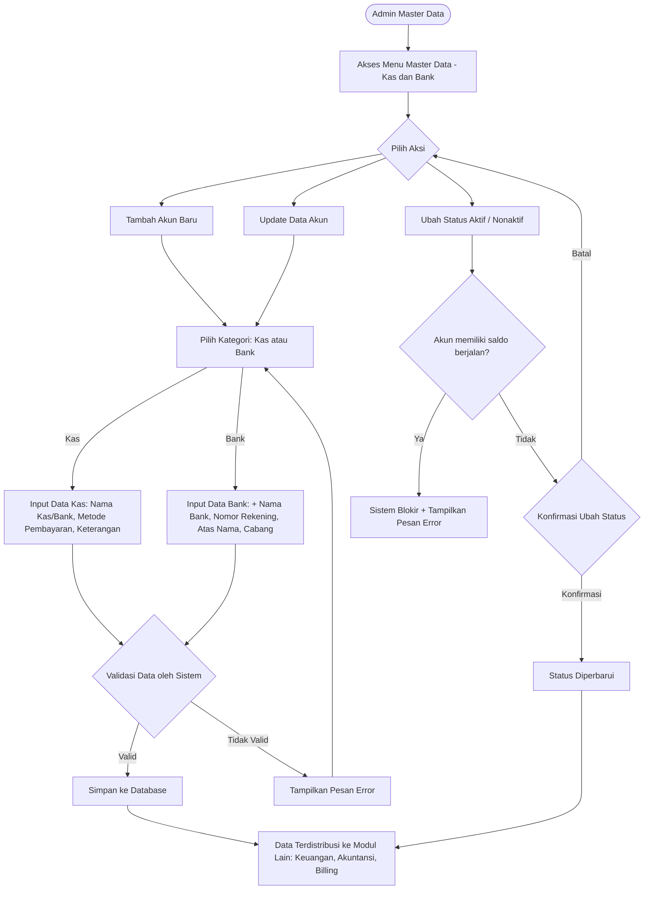

# PRD — Master Data: Kas dan Bank (A38)

**Related Document:** Design Figma (-); Related Feature: A38 Control Panel > Master Data > Kas dan Bank; integrasi: Keuangan (Modul Kas & Bank, Jurnal Otomatis), Akuntansi (Daftar Akun/COA), Billing (Pembayaran, Uang Muka)
**Versi:** 1.3 - Field **Nama Akun → Nama Kas/Bank** (tipe **Text input**, `account_name`). Lanjutan v1.2 (metode per kategori Kas/Bank + Kredit, Kode QR QRIS, field Mapping COA) & v1.1 (restrukturisasi ke Template PRD 9-section); substansi v1.0 (24 Oktober 2025) dipertahankan.
**Tanggal:** 4 Juli 2026

## 1. Metadata Dokumen

**Approval**

| PRD Approved By | Nama / Jabatan | Signature, Date |
|-----------------|----------------|-----------------|
| [1] | M. Sulthan Farras Nanz — Chief Strategy & Growth Officer, Tamtech International | - |

**PIC**

| Nama | Role |
|------|------|
| Ulfa | Product Owner |
| Arif | System Analyst |

**Related Documents**
* **Design Figma** — [PERLU KONFIRMASI tautan].
* **Modul Keuangan** — Kas & Bank, Jurnal Otomatis (konsumen referensi akun).
* **Modul Akuntansi** — Daftar Akun (COA) sebagai sumber **Mapping COA** (`coa_id`) & sasaran jurnal otomatis (Phase 3).
* **Modul Billing** — Pembayaran, Uang Muka (konsumen akun sumber dana).

**Document Version**

| Tanggal | Versi | Deskripsi Perubahan |
|---------|-------|---------------------|
| 24 Oktober 2025 | 1.0 | Pembuatan awal dokumen. |
| 4 Juli 2026 | 1.1 | **Restrukturisasi dokumen** mengikuti **Template PRD** (9 section): Scope & Phasing, State Machine, Feature Requirements & Acceptance Criteria, DB Schema (English), API (English), Data & Business Rules. Substansi tidak berubah. |
| 4 Juli 2026 | 1.2 | **Metode pembayaran & COA.** Metode per kategori — **Kas default & wajib Tunai**, **Bank tanpa Tunai** (BR-006); tambah metode **Kredit**. Metode **QRIS** dapat menyimpan **Kode QR** (`qris_code`) yang tampil di **Billing – Tagihan Pasien** (BR-013). Tambah **field Mapping COA** (`coa_id`) → akun COA kategori **'Kas dan Bank'** untuk jurnal otomatis (BR-010). Deskripsi ikon tombol tambah dihapus. |
| 4 Juli 2026 | 1.3 | **Diksi & tipe field.** Field **"Nama Akun" diganti menjadi "Nama Kas/Bank"** dengan tipe **Text input** (`account_name`, VARCHAR(100), unik, non-editable saat Update). |

## 2. Overview & Background

**Overview / Brief Summary**

Dalam operasional Rumah Sakit, hampir seluruh proses keuangan — mulai dari penerimaan pasien, pembayaran ke supplier, pengeluaran kas kecil, hingga rekonsiliasi — bergantung pada data **Kas dan Bank** yang valid dan terstruktur. Akun Kas dan Bank berperan sebagai **sumber dana** yang mencatat setiap aliran uang masuk dan keluar.

Modul **Master Data — Kas dan Bank** pada Neurovi (cluster **Control Panel**) berfungsi sebagai **pusat pengelolaan seluruh akun sumber dana**, baik **Kas** (tunai/kas kecil) maupun **Bank** (rekening giro/tabungan) yang digunakan pada berbagai unit & transaksi keuangan. Dengan pengelolaan terpusat, sistem memastikan keakuratan data pada setiap pencatatan transaksi, penjurnalan otomatis, hingga rekonsiliasi saldo — mendukung **transparansi & akuntabilitas** keuangan RS. Modul ini menjadi **sumber kebenaran tunggal (single source of truth)** data Kas dan Bank di Neurovi.

**Business Process (As-Is vs To-Be)**

* **As-Is (manual / masalah saat ini)**:
    * Data akun Kas dan Bank dikelola **terpisah/manual** di masing-masing proses keuangan; tidak ada referensi akun terstandar.
    * **Duplikasi & inkonsistensi** data rekening antar unit.
    * Sulit melakukan **rekonsiliasi** & penelusuran riwayat transaksi per akun.
    * Tidak ada kontrol terhadap **saldo & status** akun yang masih aktif digunakan.
    * Penjurnalan otomatis rumit karena tidak ada referensi akun Kas/Bank terstandar & terhubung ke **COA**.

* **To-Be (solusi digital yang diusulkan)**:
    * **Pengelolaan terpusat** — Admin RS / Configuration Manager menambah, mengubah, atau menonaktifkan akun Kas/Bank dengan atribut dasar (kategori, nama kas/bank, metode pembayaran, keterangan, nomor rekening, nama bank, atas nama, cabang, status).
    * **Klasifikasi berdasarkan Tipe Akun** — pilih **Kas** atau **Bank**; tipe menentukan field tambahan (Nama Bank, Nomor Rekening, Atas Nama, Cabang **hanya untuk Bank**).
    * **Integrasi Pemetaan COA** — akun Kas/Bank dipetakan (`coa_id`) ke akun pada modul **Akuntansi — Daftar Akun** (COA) kategori 'Kas dan Bank' untuk jurnal otomatis.
    * **Validasi & kontrol data** — cegah duplikasi nomor rekening/nama kas/bank; status Aktif/Nonaktif memengaruhi ketersediaan akun; **akun dengan saldo berjalan tidak dapat dinonaktifkan**.
    * **Audit trail & keamanan** — setiap perubahan terekam; hanya role **Admin RS / Configuration Manager** yang dapat mengubah data Kas/Bank.

## 3. Goals & Metrics

**Goals:** menyediakan pusat pengelolaan Kas & Bank yang terstandar; memastikan tiap transaksi penerimaan/pengeluaran mengacu akun yang sama; mempermudah rekonsiliasi/audit/pengendalian saldo; mengintegrasikan akun dengan pemetaan COA untuk jurnal otomatis; meningkatkan efisiensi & akurasi pengelolaan keuangan antar unit.

| No | Metrics | Success Criteria |
|----|---------|------------------|
| 1 | Konsistensi data antar modul | **100%** modul keuangan menggunakan referensi akun Kas/Bank yang sama. |
| 2 | Kemandirian user non-teknis | **100%** user Admin RS mampu melakukan setup tanpa bantuan tim teknis. |
| 3 | Kecepatan update konfigurasi | **100%** perubahan data langsung terbaca real-time tanpa restart sistem. |
| 4 | Pencarian akun | Waktu pencarian data Kas/Bank **< 3 detik**. |

## 4. Scope Definition & Phasing

| Fitur/Modul | Phase 1 (MVP: CRUD) | Phase 2 (Advanced) | Phase 3 (Accounting: Mapping COA) |
|-------------|---------------------|--------------------|-----------------------------------|
| Dashboard Kas & Bank | List + search + sort + pagination + tombol Detail/Tambah | Ekspor data Kas & Bank | Badge status pemetaan COA |
| Tambah Data Kas/Bank | Form Kas/Bank (field dasar + tambahan Bank); metode pembayaran per kategori + Kode QR (QRIS); **field Mapping COA**; validasi keunikan | — | — |
| Update Data Kas/Bank | Edit semua field **kecuali Nama Kas/Bank**; catat riwayat | — | — |
| Aktif/Nonaktifkan Akun | Toggle status dari Dashboard; blokir nonaktif bila saldo berjalan | — | — |
| Pengaturan Saldo Awal | Set saldo awal akun saat pembuatan [ASUMSI] | — | — |
| Ekspor Data | — | **Ekspor Data Kas & Bank** (mis. CSV/XLSX) | — |
| Mapping COA | **Field `coa_id`** (akun COA kategori 'Kas dan Bank') di form | — | **Jurnal otomatis** memakai `coa_id` |

**Out of Scope**

| No | Scope | Penanggung jawab |
|----|-------|------------------|
| 1 | Proses pencatatan transaksi kas masuk & kas keluar | Modul Keuangan |
| 2 | Rekonsiliasi bank & penjurnalan | Modul Keuangan/Akuntansi |
| 3 | Pengelolaan master data Chart of Account (COA) | Modul Akuntansi |

## 5. Related Features

| No | Modul | Feature | Relasi |
|----|-------|---------|--------|
| 1 | **Keuangan** | Modul Kas & Bank, Jurnal Otomatis | Konsumen referensi akun sumber dana & sumber **saldo berjalan**. |
| 2 | **Akuntansi** | Daftar Akun (COA) | Sumber **Mapping COA** (`coa_id`, akun kategori 'Kas dan Bank') & sasaran jurnal otomatis (Phase 3). |
| 3 | **Billing** | Pembayaran, Uang Muka, **Tagihan Pasien** | Konsumen akun Kas/Bank; **menampilkan Kode QR** (QRIS) pada Tagihan Pasien (BR-013). |

## 6. Business Process & User Stories

**State Machine Table**

Status berlaku pada entitas **Akun Kas/Bank**. Efek "Ketersediaan" = kemunculan akun pada pemilihan transaksi keuangan.

| Status | Deskripsi | Efek (Ketersediaan Transaksi) | Transisi (Phase 1) | Transisi (Phase 2/3) |
|--------|-----------|-------------------------------|--------------------|----------------------|
| Aktif | Akun siap dipakai sebagai sumber dana | Muncul & dapat dipilih pada transaksi keuangan | → Nonaktif (toggle, bila **tanpa saldo berjalan**) | — |
| Nonaktif | Disembunyikan dari pemilihan transaksi baru | **Tidak** dapat dipilih transaksi baru; transaksi berjalan tetap memakai data lama (BR-003) | → Aktif (toggle) | — |
| *(opsional)* Soft-deleted | Dihapus non-destruktif (`is_deleted`) | Tidak muncul di daftar/pilihan; data tetap ada | (final; non-destruktif — BR-009) | — |

> Catatan Phasing: **Status tidak diinput** di form create — sistem set **Aktif**; pengelolaan aktif/nonaktif via **toggle Dashboard** (US-004). **Field Mapping COA (`coa_id`) diisi sejak Phase 1**; **jurnal otomatis** yang memakainya = Phase 3. Fitur **Ekspor** = Phase 2.

**User Stories Utama**
* **US-001** — Sebagai **Admin Master Data**, saya ingin melihat **Dashboard** data Kas dan Bank, agar data akun terpantau dengan baik. *(P0)*
* **US-002** — Sebagai Admin Master Data, saya ingin **menambahkan** data Kas/Bank, agar data akun selalu update. *(P0)*
* **US-003** — Sebagai Admin Master Data, saya ingin **melihat & mengubah** detail Kas/Bank, agar detail akun selalu update. *(P0)*
* **US-004** — Sebagai Admin Master Data, saya ingin **mengubah status** akun dari Dashboard, agar status diperbarui tanpa membuka Detail. *(P2)*
* **US-005** — Sebagai Admin, saya ingin mengetahui **kapan data dibuat/diubah, oleh siapa, dan apa yang berubah** (riwayat aktivitas). *(P4)*

## 7. Functional Requirements

### 7.1 Feature Requirements & Acceptance Criteria

**Fitur: Dashboard Kas & Bank (FR-001)**
* **User Story**: US-001.
* **Prioritas**: P0.
* **Fase**: Phase 1.
* **Acceptance Criteria**:
    * **AC 1**: Klik menu **Master Data → Kas dan Bank** menampilkan Dashboard dengan tabel kolom: No, Kategori, Nama Kas/Bank, Nama Bank, Nomor Rekening, Saldo, Status (§8.3.2).
    * **AC 2 — Sorting**: Kolom **Kategori, Nama Kas/Bank, Nama Bank** dapat diklik untuk sort (asc/desc). Urutan default: **Kategori** lalu **Nama Kas/Bank**, keduanya **Ascending (A-Z)**.
    * **AC 3 — Pencarian**: Search berdasarkan Kategori, Nama Kas/Bank, Nama Bank, Nomor Rekening, Status; hasil sesuai keyword.
    * **AC 4 — Pagination**: Pilihan **10 / 20 / 50 / 100** data per halaman.
    * **AC 5 — Aksi**: Tiap baris punya tombol **Detail**; tersedia tombol **Tambah Kas/Bank**.
    * **AC 6**: Menampilkan kumpulan data hasil Tambah/Update sebelumnya.

**Fitur: Tambah Data Kas/Bank (FR-002)**
* **User Story**: US-002.
* **Prioritas**: P0.
* **Fase**: Phase 1.
* **Acceptance Criteria**:
    * **AC 1**: Tombol **Tambah Kas/Bank** membuka overlay **Tambah Kas/Bank** dengan field dasar: **Kategori, Nama Kas/Bank, Metode Pembayaran, Keterangan, Mapping COA** (spesifikasi §8.3.1). **Status TIDAK diinput** (sistem set **Aktif**).
    * **AC 2 — Field kondisional Bank**: Bila **Kategori = Bank**, muncul field tambahan **Nama Bank, Nomor Rekening, Atas Nama, Cabang** (BR-004).
    * **AC 3 — Metode pembayaran per kategori**: **Kas** → metode **default & wajib mengandung Tunai** (Tunai hanya untuk Kas). **Bank** → **tidak boleh Tunai**; pilih dari QRIS/Debet/Transfer/Virtual Account/Kredit (BR-006). Bila **QRIS** dipilih, tersedia input **Kode QR** yang ditampilkan di **Billing – Tagihan Pasien** (BR-013).
    * **AC 4 — Mapping COA**: Pengguna memetakan akun ke **akun COA kategori 'Kas dan Bank'** (`coa_id`) untuk jurnal otomatis (BR-010).
    * **AC 5 — Keunikan**: Simpan **memvalidasi keunikan Nama Kas/Bank & Nomor Rekening** (tidak boleh duplikat) → tolak dengan pesan spesifik (BR-001).
    * **AC 6 — Distribusi**: Data valid tersimpan & **terdistribusi** ke modul Keuangan/Akuntansi/Billing.
* **Validasi**:

  **A. Wording Validasi (Frontend)**

  | Field | Tipe Input | Rules | Error Message | Helper Text |
  |-------|-----------|-------|---------------|-------------|
  | Kategori | Dropdown/Radio | Required (Kas / Bank) | "Pilih kategori akun." | "Kas = tunai/kas kecil; Bank = rekening." |
  | Nama Kas/Bank | Text | Required, unik, 3–100 char | "Data sudah digunakan, gunakan nama lain." | "Nama akun kas/bank; ketik bebas (BR-005)." |
  | Metode Pembayaran | Multiselect | Required (≥1); **Kas**: default & wajib **Tunai**; **Bank**: **tanpa Tunai** | "Bank tidak dapat memakai Tunai." | "Tunai (Kas), QRIS, Debet, Transfer, Virtual Account, Kredit (BR-006)." |
  | Kode QR *(bila QRIS)* | Upload/Text | Required bila metode QRIS | "Kode QR wajib bila metode QRIS dipilih." | "Ditampilkan di Billing – Tagihan Pasien (BR-013)." |
  | Mapping COA | Dropdown | Required | "Pilih akun COA (Kas dan Bank)." | "Akun COA kategori 'Kas dan Bank' untuk jurnal otomatis (BR-010)." |
  | Keterangan | Text | Optional, 3–100 char | "Keterangan 3–100 karakter." | "Opsional." |
  | Nama Bank *(Bank)* | Text | Required, 3–100 char | "Nama bank wajib (3–100)." | "Muncul bila Kategori = Bank." |
  | Nomor Rekening *(Bank)* | Numerik | Required, 5–20 digit, unik | "Data sudah digunakan, gunakan nomor rekening lain." | "Hanya angka, 5–20 digit." |
  | Atas Nama *(Bank)* | Text | Optional, 3–20 char | "Atas nama 3–20 karakter." | "Opsional." |
  | Cabang *(Bank)* | Text | Optional, 3–20 char | "Cabang 3–20 karakter." | "Opsional." |

**Fitur: Update Data Kas/Bank (FR-003)**
* **User Story**: US-003.
* **Prioritas**: P0.
* **Fase**: Phase 1.
* **Acceptance Criteria**:
    * **AC 1**: Klik **Detail** menampilkan view **Detail Kas/Bank** dengan seluruh field prefilled.
    * **AC 2**: Semua field **dapat diedit KECUALI Nama Kas/Bank** (non-editable) — BR-005.
    * **AC 3**: Validasi keunikan (BR-001) tetap berlaku saat Update.
    * **AC 4**: Perubahan **tercatat sebagai riwayat aktivitas** (`updated_by/at`) — BR-007.

**Fitur: Ubah Status Akun (FR-004)**
* **User Story**: US-004.
* **Prioritas**: P2.
* **Fase**: Phase 1.
* **Acceptance Criteria**:
    * **AC 1**: Klik **Ubah Status** menampilkan **warning Perubahan Status** + tombol **Batal** & **Ubah Status**. Aktif → warning menjadi **Nonaktif**; Nonaktif → warning menjadi **Aktif**.
    * **AC 2 — Blokir saldo berjalan**: Akun **tidak dapat dinonaktifkan** bila terdapat **saldo berjalan** → sistem **memblokir** & menampilkan pesan error (BR-002).
    * **AC 3**: Konfirmasi mengubah `is_active`; **Batal** membatalkan.
    * **AC 4**: Nonaktif hanya mencegah **pemilihan baru**; transaksi berjalan tetap memakai data lama (BR-003).
* **Validasi**:

  **A. Wording Validasi (Frontend)**

  | Kondisi | Rules | Error Message |
  |---------|-------|---------------|
  | Nonaktifkan akun ber-saldo berjalan | Blokir | "Akun tidak dapat dinonaktifkan karena masih memiliki saldo berjalan." |

**Fitur: Riwayat Aktivitas / Audit Trail (FR-005)**
* **User Story**: US-005.
* **Prioritas**: P4.
* **Fase**: Phase 1.
* **Acceptance Criteria**:
    * **AC 1**: Sistem menyimpan riwayat: **Tanggal & Waktu** (`dd/mm/yyyy HH:mm`), **Nama** user, **Jenis Aktivitas** — `Dibuat` (created_at) / `Diubah` (updated_at).
    * **AC 2**: Contoh tampilan: *"Dibuat oleh Agus pada 11/09/2026 13:13"*.
    * **AC 3**: Menampilkan riwayat dari aktivitas dibuat & diubah (BR-007).

**Fitur: Pengaturan Saldo Awal (FR-006)** [ASUMSI]
* **User Story**: US-002 (turunan scope Phase 1 #5).
* **Prioritas**: P1.
* **Fase**: Phase 1.
* **Acceptance Criteria**:
    * **AC 1**: Saat pembuatan akun, pengguna dapat menetapkan **Saldo Awal** (Rupiah ≥ 0) [ASUMSI].
    * **AC 2**: Saldo yang tampil di Dashboard adalah **saldo berjalan** (dari modul Keuangan); saldo awal menjadi titik awal perhitungan (BR-011).

**Fitur: Ekspor Data (FR-007) — Phase 2**
* **User Story**: US-001 (turunan scope).
* **Prioritas**: P3.
* **Fase**: Phase 2.
* **Acceptance Criteria**:
    * **AC 1**: Pengguna dapat **mengekspor** daftar akun Kas/Bank (mis. CSV/XLSX) sesuai filter/kolom Dashboard [ASUMSI format].

**Fitur: Mapping COA (FR-008)**
* **User Story**: — (kebutuhan Akuntansi).
* **Prioritas**: P1.
* **Fase**: Phase 1 (field capture) → Phase 3 (jurnal otomatis).
* **Acceptance Criteria**:
    * **AC 1 — Field mapping**: Form menyediakan field **Mapping COA** (`coa_id`) — dropdown **akun COA berkategori 'Kas dan Bank'** dari Daftar Akun; wajib dipilih (BR-010).
    * **AC 2 — Konsumsi**: Pemetaan `coa_id` menjadi basis **jurnal otomatis** (Phase 3) di modul Keuangan/Akuntansi.
    * **AC 3**: Master COA dikelola modul Akuntansi (Out of Scope); modul ini hanya mereferensikan & menyimpan pemetaan.

## 8. Data & Technical Specifications

### 8.1 Database Schema Suggestion

> Master eksternal (`account`/COA di modul Akuntansi) **hanya direferensikan**. Nama tabel/kolom English; struktur final dapat disesuaikan tim dev.

* **Table Name**: `cash_bank_account` (Akun Kas/Bank)
    * `id`: UUID (Primary Key)
    * `category`: VARCHAR(10) — `KAS` / `BANK` (Not null) — BR-004
    * `account_name`: VARCHAR(100) — Nama Kas/Bank (Text input, Not null, unik) — BR-005
    * `coa_id`: VARCHAR/UUID (FK → COA/Daftar Akun, **kategori 'Kas dan Bank'**) — **Mapping COA** untuk jurnal otomatis (BR-010)
    * `payment_method`: VARCHAR(255)/array — multiselect metode: Tunai (Kas)/QRIS/Debet/Transfer/Virtual Account/Kredit (BR-006)
    * `qris_code`: TEXT/URL — **Kode QR** (diisi bila metode `QRIS`); ditampilkan di Billing – Tagihan Pasien (BR-013)
    * `description`: VARCHAR(100) — opsional
    * `bank_name`: TEXT — hanya untuk Bank
    * `account_number`: VARCHAR — nomor rekening (5–20 digit, unik) — BR-001/012 *(dev table awal `varchar(15)` — [PERLU KONFIRMASI panjang)*
    * `account_holder`: VARCHAR(20) — atas nama (opsional)
    * `branch`: VARCHAR(20) — cabang (opsional)
    * `opening_balance`: INTEGER (Rp) — saldo awal [ASUMSI] (Phase 1, FR-006)
    * `is_active`: Boolean (default true) — BR-003
    * `is_deleted`: Boolean (default false) — soft delete (BR-009)
    * `created_at/by`, `updated_at/by`, `deleted_at/by`: audit — BR-007
    * **Keunikan**: `account_name` (Nama Kas/Bank) & `account_number` unik terhadap data belum soft-deleted (BR-001).

> **Catatan implementasi**: (a) Field tambahan Bank (`bank_name`, `account_number`, `account_holder`, `branch`) hanya wajib/terisi bila `category='BANK'` (BR-004) — ditegakkan aplikasi. (b) **Saldo berjalan** dihitung modul Keuangan; nonaktivasi diblokir bila saldo berjalan ≠ 0 (BR-002). (c) `coa_id` menautkan ke **COA** (Akuntansi) kategori **'Kas dan Bank'** untuk jurnal otomatis (BR-010). (d) `payment_method`: **Tunai hanya untuk `KAS`** (default), **`BANK` tidak boleh Tunai** (BR-006). (e) `qris_code` diisi bila metode `QRIS`, dikonsumsi Billing – Tagihan Pasien (BR-013). (f) Soft delete non-destruktif (BR-009).

### 8.2 API Endpoint Recommendations

| Method | Endpoint | Description |
|--------|----------|-------------|
| GET | `/api/v1/cash-bank-accounts` | List akun (dashboard) + search/sort/pagination. |
| GET | `/api/v1/cash-bank-accounts/{id}` | Detail akun. |
| POST | `/api/v1/cash-bank-accounts` | Create akun Kas/Bank (validasi keunikan). |
| PUT | `/api/v1/cash-bank-accounts/{id}` | Update akun (Nama Kas/Bank non-editable). |
| PATCH | `/api/v1/cash-bank-accounts/{id}/status` | Toggle Aktif/Nonaktif (blokir bila saldo berjalan). |
| DELETE | `/api/v1/cash-bank-accounts/{id}` | Soft delete (`is_deleted`). |
| GET | `/api/v1/cash-bank-accounts/{id}/history` | Riwayat aktivitas (dibuat/diubah). |
| GET | `/api/v1/coa-accounts?category=kas-dan-bank&active=true` | Lookup **akun COA kategori 'Kas dan Bank'** untuk dropdown **Mapping COA** (`coa_id`). |
| GET | `/api/v1/cash-bank-accounts?active=true` | Lookup akun **Aktif** untuk modul Keuangan/Billing. |
| GET | `/api/v1/cash-bank-accounts/export` | **[Phase 2]** Ekspor data (CSV/XLSX). |

### 8.3 Data & Business Rules

#### 8.3.1 Spesifikasi Data — Form Input (Layar CREATE/EDIT)

*Section Data Akun (semua kategori)*

| Field | Label | Tipe | Wajib | Validasi | Sumber | Catatan |
|-------|-------|------|-------|----------|--------|---------|
| category | Kategori | Radio | Ya | `Kas` / `Bank` (default) | input | Menentukan field tambahan (BR-004). |
| account_name | Nama Kas/Bank | Text | Ya | unik; 3–100 char; tidak boleh duplikat | input | **Non-editable saat Update** (BR-005). |
| coa_id | Mapping COA | Dropdown | Ya | akun COA valid, kategori 'Kas dan Bank' | Daftar Akun (COA) — kategori **'Kas dan Bank'** | Jurnal otomatis (BR-010). |
| payment_method | Metode Pembayaran | Multiselect | Ya | ≥ 1; **Kas** default & wajib **Tunai**; **Bank** tanpa Tunai | Tunai (Kas)/QRIS/Debet/Transfer/Virtual Account/Kredit | Boleh >1 (BR-006). |
| qris_code | Kode QR | Upload/Text | Bila QRIS | wajib bila metode QRIS dipilih | input | Ditampilkan di Billing – Tagihan Pasien (BR-013). |
| description | Keterangan | Text | Tidak | 3–100 char | input | — |
| status_aktif | Status | Boolean | Ya (sistem) | default `Aktif` | sistem | Tidak diinput di create; toggle Dashboard (US-004, BR-002/003). |

*Field Tambahan (muncul hanya jika Kategori = Bank)*

| Field | Label | Tipe | Wajib | Validasi | Sumber | Catatan |
|-------|-------|------|-------|----------|--------|---------|
| bank_name | Nama Bank | Text | Ya (Bank) | 3–100 char | input | — |
| account_number | Nomor Rekening | Numerik | Ya (Bank) | 5–20 digit, **unik** | input | Tidak boleh duplikat (BR-001). |
| account_holder | Atas Nama | Text | Tidak | 3–20 char | input | Opsional. |
| branch | Cabang | Text | Tidak | 3–20 char | input | Opsional. |

#### 8.3.2 Spesifikasi Data — Tampilan Daftar (List View / Dashboard)

| Kolom | Sumber Data | Format | Filter / Sort | Catatan |
|-------|-------------|--------|---------------|---------|
| No | urutan 1,2,3,… | angka | — | — |
| Kategori | `category` | teks (Kas/Bank) | **sort**, search | default sort #1 (A-Z). |
| Nama Kas/Bank | `account_name` | teks | **sort**, search | default sort #2 (A-Z). |
| Nama Bank | `bank_name` | teks | **sort**, search | hanya untuk Kategori = Bank. |
| Nomor Rekening | `account_number` | teks | search | hanya untuk Kategori = Bank. |
| Saldo | saldo berjalan (modul Keuangan) | Rp | — | dasar blokir nonaktif (BR-002). |
| Status | `is_active` | badge (Aktif/Nonaktif) | filter, search | toggle via Ubah Status (US-004). |
| Aksi | — | tombol **Detail** · **Ubah Status** | — | — |

**Business Rules**
* **BR-001 (Keunikan)**: **Nama Kas/Bank (`account_name`)** & **Nomor Rekening (`account_number`)** tidak boleh duplikat (terhadap data belum soft-deleted). Duplikat → tolak Simpan/Update: *"Data sudah digunakan, gunakan nomor rekening/nama lain."*
* **BR-002 (Blokir nonaktif bila saldo berjalan)**: Akun **tidak dapat dinonaktifkan** bila memiliki **saldo berjalan**. Sistem memblokir & menampilkan: *"Akun tidak dapat dinonaktifkan karena masih memiliki saldo berjalan."*
* **BR-003 (Efek status)**: Status **Aktif/Nonaktif** memengaruhi ketersediaan akun pada pemilihan transaksi. **Nonaktif hanya mencegah pemilihan baru**; transaksi yang sedang berjalan tetap memakai data lama.
* **BR-004 (Tipe akun → field kondisional)**: Kategori **Bank** menampilkan/mewajibkan field tambahan (Nama Bank, Nomor Rekening, Atas Nama, Cabang); Kategori **Kas** tidak.
* **BR-005 (Nama Kas/Bank — Text & imutabilitas)**: **Nama Kas/Bank** (`account_name`) diinput **Text** (ketik bebas, 3–100 char, unik); **tidak dapat diubah** saat Update (non-editable). *(Tautan akuntansi ada di field terpisah `coa_id` — BR-010.)*
* **BR-006 (Metode pembayaran per kategori)**: `payment_method` **multiselect** (minimal 1) dari: **Tunai, QRIS, Debet, Transfer, Virtual Account, Kredit**. Aturan kategori: **Kas** → **default & wajib mengandung Tunai** (Tunai **hanya** untuk Kas); **Bank** → **tidak boleh Tunai** (hanya QRIS/Debet/Transfer/Virtual Account/Kredit).
* **BR-007 (Audit trail)**: Setiap **tambah/ubah/nonaktif** terekam (user + timestamp; `Dibuat`/`Diubah`) — dapat ditampilkan sebagai riwayat aktivitas (US-005).
* **BR-008 (RBAC)**: Hanya role **Admin RS / Configuration Manager** yang dapat menambah/mengubah/menonaktifkan data Kas/Bank.
* **BR-009 (Soft delete)**: Penghapusan bersifat **non-destruktif** (`is_deleted`); akun terhapus tidak muncul di daftar/pilihan, data tetap tersimpan [ASUMSI].
* **BR-010 (Mapping COA)**: Tiap akun Kas/Bank memiliki field **`coa_id`** yang dipetakan ke **akun COA (Daftar Akun) berkategori 'Kas dan Bank'** sebagai basis **jurnal otomatis**. Dropdown hanya menampilkan akun COA kategori 'Kas dan Bank'; Master COA dikelola modul Akuntansi (Out of Scope). Konsumsi jurnal otomatis = Phase 3.
* **BR-013 (Kode QR untuk QRIS)**: Bila metode pembayaran **QRIS** dipilih, akun dapat menyimpan **`qris_code`** (unggah gambar/URL/string QR). Kode QR ini **ditampilkan pada fitur Billing – Tagihan Pasien** saat pembayaran QRIS. Wajib bila QRIS dipilih.
* **BR-011 (Saldo)**: **Saldo berjalan** dihitung modul Keuangan; **Saldo Awal** (Phase 1) menjadi titik awal perhitungan [ASUMSI].
* **BR-012 (Panjang field)**: Keterangan 3–100; Nomor Rekening 5–20 digit (numerik); Nama Bank 3–100; Atas Nama/Cabang 3–20 char.

**Case & Mitigasi**

| No | Case | Dampak | Mitigasi |
|----|------|--------|----------|
| 1 | Akun dinonaktifkan padahal masih dipakai transaksi berjalan | Transaksi berjalan kehilangan referensi akun sumber dana | Status nonaktif hanya mencegah pemilihan **baru**; transaksi berjalan tetap memakai data lama (BR-003). |
| 2 | Duplikasi nomor rekening / nama kas/bank | Data ganda & kebingungan memilih akun | Validasi **keunikan** nomor rekening & nama kas/bank saat Simpan/Update (BR-001). |
| 3 | Nonaktifkan akun dengan saldo berjalan | Transaksi imbalance | Sistem **memblokir** nonaktivasi bila terdapat saldo berjalan (BR-002). |

## 9. Workflow / BPMN Interpretation

Alur utama pengelolaan akun Kas/Bank (dari overview & Main Flow sumber).

**Alur Tambah / Update Akun Kas**
1. Admin membuka menu **Master Data → Kas dan Bank**.
2. Klik **Tambah** untuk tambah, atau **Detail** untuk update.
3. Pilih **Kategori: Kas** → isi Nama Kas/Bank, Metode Pembayaran (default **Tunai**), Keterangan, Mapping COA. (Status di-set Aktif oleh sistem.)
4. Klik **Simpan/Update** → sistem **validasi** (keunikan) → data tersimpan & terdistribusi.

**Alur Tambah / Update Akun Bank**
1. Pilih **Kategori: Bank** → isi field dasar + tambahan: Nama Bank, Nomor Rekening, Atas Nama, Cabang.
2. Klik **Simpan/Update** → sistem **validasi** → data tersimpan & terdistribusi.

**Alur Ubah Status Akun**
1. Dari Dashboard, klik **Ubah Status** pada baris akun.
2. Sistem mengecek **saldo berjalan**: bila **ada** → blokir + pesan error (BR-002); bila **tidak** → tampilkan warning konfirmasi.
3. Klik **Ubah Status** untuk konfirmasi, atau **Batal** untuk membatalkan.

## Asumsi
- [PERLU KONFIRMASI] Tautan **Design Figma** modul Kas & Bank.
- [PERLU KONFIRMASI] Panjang final `account_number` (dev table awal `varchar(15)` vs aturan 5–20 digit).
- [ASUMSI] **Saldo Awal** (Phase 1, FR-006) diinput saat pembuatan akun; **saldo berjalan** dihitung modul Keuangan (BR-011).
- [ASUMSI] **Soft delete** (`is_deleted`) tersedia untuk penghapusan non-destruktif (BR-009); dev table menyertakan `is_deleted`, `deleted_at/by`.
- [ASUMSI] Ketersediaan Finance service (Daftar Akun/COA) untuk diakses Neurovi perlu dikonfirmasi (catatan dev).
- [ASUMSI] Format `qris_code` (unggah gambar/URL/string) & mekanisme tampil di **Billing – Tagihan Pasien** dikoordinasikan dengan tim Billing (BR-013).
- [KEPUTUSAN] Status **tidak diinput** di form create — sistem set Aktif; kelola via toggle Dashboard (US-004, sesuai konvensi template).
- [KEPUTUSAN] Metode pembayaran per kategori: **Kas default & wajib Tunai** (Tunai hanya Kas); **Bank tanpa Tunai**; tambah metode **Kredit** (BR-006).
- [KEPUTUSAN] Metode **QRIS** menyimpan **Kode QR** (`qris_code`) yang tampil di **Billing – Tagihan Pasien** (BR-013).
- [KEPUTUSAN] Ditambahkan **field Mapping COA** (`coa_id`) → akun COA kategori **'Kas dan Bank'** untuk jurnal otomatis (BR-010).
- [KEPUTUSAN] Keunikan Nama Kas/Bank & Nomor Rekening (BR-001); blokir nonaktif bila saldo berjalan (BR-002); audit trail & RBAC (BR-007/008).
