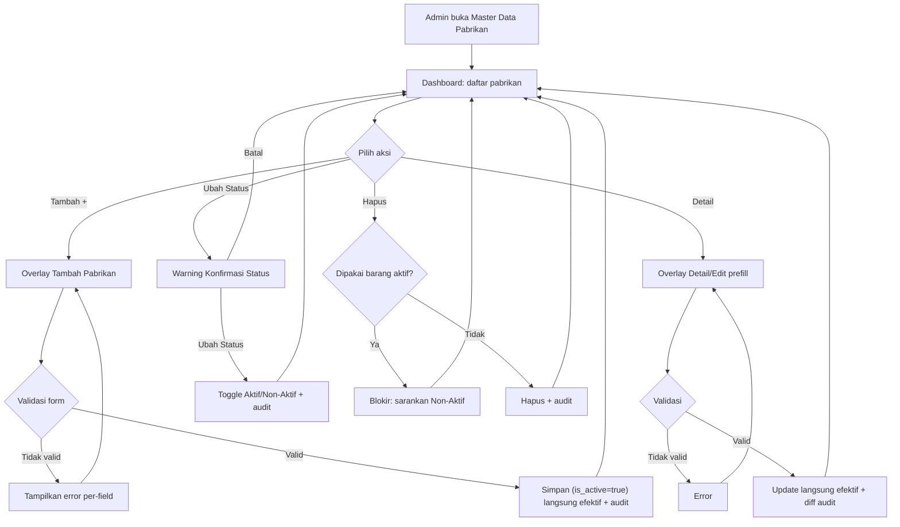

# PRD — Master Data Pabrikan (A54)

> Disusun mengikuti **template.md**. Persona: System Analyst senior SIMRS (RS Tipe C & D).
> Bahasa Indonesia. Penanda `[ASUMSI]` / `[PERLU KONFIRMASI]` dipakai untuk hal yang belum pasti.
> **Catatan ruang lingkup: modul ini murni CRUD master data — TIDAK ada proses approval/persetujuan dalam bentuk apa pun.**
> Sumber konsep: `PRD_Master_Data_Pabrikan.md` (v1.0, 26 Mei 2026).

---

## 1. Metadata Dokumen

* **Approval**: M. Sulthan Farras Nanz, Chief Strategy & Growth Officer Tamtech International _(PIC PO: Ulfa)_
* **Related Documents**:
    * Design Figma Master Data Pabrikan — _(lihat tautan Figma di sumber)_
    * [Template Ekspor Pabrikan](https://docs.google.com/spreadsheets/d/1_34yR8f9dhYzJkocqChRkI9VORFQQ7RG) `[**]` (Phase 2)
    * [Template Impor Pabrikan](https://docs.google.com/spreadsheets/d/1pjwssONnPdlveC_ULM_98isf85r_-p-0) `[**]` (Phase 2)
    * List Fitur V2.xlsx (sheet MVP) — kode fitur **A54** (Control Panel → Master Data → Pabrikan)
* **Document Version**:
    * v1.0 — 26 Mei 2026 — Pembuatan awal (sumber draft `PRD_Master_Data_Pabrikan.md`).
    * **v1.1 — 2 Juli 2026 — Restrukturisasi ke format template standar; penegasan modul murni CRUD; State Machine 2 status; skema DB & endpoint API (English); pemetaan fitur terkait (A4, A5, A6, A7, H1, H12, H7, H4).**

---

## 2. Overview & Background

* **Overview/Brief Summary**:
  Modul **Master Data Pabrikan** (kode **A54**, cluster Control Panel) adalah **sumber kebenaran tunggal (single source of truth)** untuk data pabrikan/produsen barang yang produknya digunakan di rumah sakit (obat, alat kesehatan, barang rumah tangga, gizi). Modul ini menjadi **referensi field "Nama Pabrik"** bagi seluruh modul Master Data Barang — **Barang Farmasi (A4)**, **Barang Rumah Tangga (A5)**, dan **Barang Gizi (A6)** — sehingga produsen setiap barang tercatat seragam dan dapat dilacak. Modul menyediakan UI **Dashboard daftar**, **Form Tambah**, **halaman Detail/Edit** (overlay), **toggle status Aktif/Non-Aktif**, dan **Riwayat Aktivitas (audit trail)**. Pada fase lanjutan disiapkan **Quick Add** langsung dari halaman Tambah Barang serta **Impor/Ekspor** massal via Excel. **Modul ini tidak memiliki alur persetujuan — setiap perubahan langsung efektif setelah validasi.**

* **Business Process (As-Is vs To-Be)**:
    * **As-Is**:
        * Nama pabrikan **diketik manual** pada setiap barang → **duplikasi** dengan penulisan berbeda (mis. "PT Kimia Farma" vs "Kimia Farma" vs "KIMIA FARMA").
        * **Pelaporan barang per pabrikan sulit** karena nama tidak seragam.
        * **Tidak ada penyimpanan kontak pabrikan** (alamat/telepon/email) untuk komunikasi atau penelusuran.
        * Ketergantungan pada **input bebas** yang rawan typo & inkonsistensi.
    * **To-Be**:
        * Admin Master Data mengelola seluruh pabrikan dari **satu modul** lewat alur CRUD digital **langsung** (tanpa persetujuan berjenjang). Status baru selalu di-set **AKTIF** oleh sistem; aktif/non-aktif dikelola lewat **toggle di Dashboard** (bukan field di form create).
        * Field **Nama Pabrik** di Master Data Barang (A4/A5/A6) **mengambil dropdown dari modul ini** → konsistensi lintas modul terjaga; perubahan data pabrikan otomatis terlihat di seluruh barang tertaut.
        * Sistem memvalidasi **keunikan Nama & Kode Pabrikan** → tidak ada duplikasi.
        * Kontak pabrikan tersimpan terstruktur; setiap perubahan **langsung efektif** dan tercatat di **Riwayat Aktivitas** (append-only, diff before/after) untuk audit/akreditasi.

---

## 3. Goals & Metrics

| No | Metrics | Success Criteria |
|----|---------|------------------|
| 1 | Konsistensi data antar modul | 100% modul barang (A4/A5/A6) memakai referensi pabrikan yang sama (tidak ada input bebas) |
| 2 | Bebas duplikasi | 0 duplikasi Nama/Kode pabrikan aktif setelah validasi keunikan |
| 3 | Kemandirian user non-teknis | 100% user Admin RS mampu setup pabrikan tanpa bantuan tim teknis |
| 4 | Kecepatan update konfigurasi | 100% perubahan data terbaca real-time tanpa restart sistem |
| 5 | Kecepatan pencarian & filter | Waktu pencarian data pabrikan < 3 detik |
| 6 | Auditability | 100% perubahan tercatat di Riwayat Aktivitas (user, waktu, before/after) |
| 7 | Efisiensi input | Penambahan pabrikan baru langsung dari halaman Tambah Barang (Quick Add, Phase 2) |

---

## 4. Scope Definition & Phasing

> **Modul ini tidak memiliki proses approval/escalation.** Karena itu, kolom Phase 2 pada template (yang secara default berisi *Approval/Escalation*) di sini diisi dengan **kapabilitas lanjutan non-approval** (Quick Add + Impor/Ekspor). Seluruh fungsi inti tetap **CRUD langsung** sejak Phase 1.

| Fitur/Modul | Phase 1 (MVP: CRUD) | Phase 2 (Advanced: Quick Add & Impor/Ekspor) |
|-------------|---------------------|----------------------------------------------|
| Dashboard Pabrikan | List + search (Nama/Kode/Alamat/Telepon/Email) + sort + pagination 10/hal | Filter lanjutan (status) |
| Tambah Pabrikan | Form (Nama, Kode, Alamat, No. Telepon, Email) + validasi (langsung efektif) | — |
| Detail / Update Pabrikan | Overlay Detail, semua field editable, langsung efektif | — |
| Kelola Status | Toggle Aktif ↔ Non-Aktif (modal konfirmasi) | — |
| Riwayat Aktivitas | Audit trail append-only (diff) | — |
| Quick Add dari Tambah Barang `[**]` | — | **Tambah pabrikan singkat** (Nama, Alamat, Email, No. Telepon) dari halaman Tambah Barang, langsung terpilih |
| Impor / Ekspor Excel `[**]` | — | **Impor & Ekspor massal** via template Excel |

**Out of Scope**:
* **Approval / persetujuan / maker-checker / escalation** dalam bentuk apa pun — modul ini murni CRUD; perubahan langsung berlaku.
* Pengelolaan **data Supplier** (ditangani modul **Master Data Supplier A7**). **Pabrikan = produsen** barang, **Supplier = penyedia/distributor** — dua entitas berbeda.
* Pengelolaan **data barang** yang diproduksi pabrikan (ditangani Master Data Barang A4/A5/A6). A54 hanya menyediakan pabrikan sebagai **referensi dropdown**.
* Proses **pengadaan & pemesanan** ke pabrikan (ditangani modul Inventory/Pengadaan — H1 dst).

---

## 5. Related Features

> Relasi terhadap 8 fitur yang diinstruksikan. Dua pola relasi: **(C) Consumer** — modul membaca/menautkan pabrikan dari A54; **(S) Sibling/pembeda** — entitas terkait yang perlu dibedakan konsepnya.

| Kode | Menu | Pola | Relasi Teknis / Bisnis dengan Master Data Pabrikan |
|------|------|------|----------------------------------------------------|
| **A4** | Barang Farmasi | C | Field **Nama Pabrik** (Section Identitas) ambil dropdown dari A54. `pharmacy_item.manufacturer_id` → FK ke `manufacturer.id`. Perubahan nama pabrikan tercermin di seluruh barang farmasi tertaut. |
| **A5** | Barang Rumah Tangga | C | Field **Nama Pabrik** ambil dropdown dari A54. `household_item.manufacturer_id` → FK ke `manufacturer.id`. |
| **A6** | Barang Gizi (New) | C | Field **Nama Pabrik** ambil dropdown dari A54 `[ASUMSI]` (pola identik A4/A5). `nutrition_item.manufacturer_id` → FK. |
| **A7** | Supplier | S | **Pembeda konsep**: Pabrikan (produsen) ≠ Supplier (distributor/penjual). Satu pabrikan dapat dipasok banyak supplier & sebaliknya. A54 **tidak** menggantikan A7; keduanya master terpisah. |
| **H1** | Pemesanan Barang | C | Pemesanan menampilkan/menyaring barang beserta **pabrikan** (via barang A4/A5). Tidak menautkan pabrikan langsung — turunan dari barang. `[ASUMSI]` |
| **H12** | *(kode tidak ditemukan di data fitur)* | — | **[PERLU KONFIRMASI]** — kode `H12` tidak ada di `features-mvp.json` (Inventory hanya H1–H11). Kemungkinan maksudnya **H10 Rencana Pengadaan** atau **H8 Retur Pembelian**; mohon konfirmasi kode yang benar. |
| **H7** | Peminjaman & Pengembalian Barang | C | Transaksi pinjam/kembali antar unit merujuk barang yang mengandung atribut pabrikan dari A4/A5 (turunan barang, bukan tautan langsung). `[ASUMSI]` |
| **H4** | Informasi Stok | C | Tampilan detail stok per item **menampilkan pabrikan** barang (dari A4/A5 → A54). Filter/pelaporan stok per pabrikan dimungkinkan. |

> **Catatan integritas referensial**: pabrikan yang sudah dipakai oleh barang **aktif** **tidak boleh dihapus fisik** — hanya dapat di-**Non-Aktif**-kan (BR-005). Barang yang sudah tertaut ke pabrikan non-aktif **tetap** memakai data lama; status non-aktif hanya mencegah **pemilihan baru**.

---

## 6. Business Process & User Stories

### State Machine Table

Entitas pabrikan memiliki **status keberlakuan** (`is_active`). Field input status TIDAK disediakan di form create — sistem selalu set **AKTIF**. **Tidak ada status antara/approval** — perubahan langsung efektif.

| Status | Deskripsi | Efek pada Modul Lain | Transisi (Phase 1) | Transisi (Phase 2) |
|--------|-----------|----------------------|--------------------|--------------------|
| `AKTIF` | Pabrikan berlaku & dapat dipilih di dropdown Nama Pabrik | Muncul sebagai pilihan di A4/A5/A6 (termasuk Quick Add) | `AKTIF → NON_AKTIF` (toggle Dashboard) | idem (tanpa approval) |
| `NON_AKTIF` | Pabrikan dinonaktifkan, tidak muncul sebagai pilihan baru | Tidak muncul di pemilihan baru; barang yang sudah tertaut tetap memakai data lama | `NON_AKTIF → AKTIF` (toggle Dashboard) | idem (tanpa approval) |

> **Catatan**: modul A54 **tidak mengelola stok/kuantitas** — kolom "Efek Stok" pada template **n/a (master data)**. Status hanya memengaruhi **ketersediaan pabrikan sebagai pilihan**. **Tidak ada status approval** (PENDING/REJECTED) karena modul tanpa proses persetujuan.

### User Stories Utama

* **US-001** — Sebagai **Admin Master Data**, saya ingin melihat **Dashboard daftar pabrikan**, agar data pabrikan terpantau dengan baik. *(P0, Phase 1)*
* **US-002** — Sebagai **Admin Master Data**, saya ingin **menambah pabrikan baru**, agar data selalu terbarui. *(P0, Phase 1)*
* **US-003** — Sebagai **Admin Master Data**, saya ingin **melihat & mengubah detail pabrikan**, agar data selalu akurat. *(P0, Phase 1)*
* **US-004** — Sebagai **Admin Master Data**, saya ingin **mengubah status pabrikan dari Dashboard**, agar status dapat diperbarui tanpa membuka Detail. *(P2, Phase 1)*
* **US-005** — Sebagai **Admin/Auditor**, saya ingin melihat **riwayat perubahan** suatu pabrikan, agar dapat melacak siapa mengubah apa & kapan. *(P0, Phase 1)*
* **US-006** _(Phase 2)_ — Sebagai **Admin Master Data**, saya ingin **menambah pabrikan langsung dari halaman Tambah Barang (Quick Add)**, agar tidak perlu meninggalkan alur input barang. *(P1, Phase 2)*
* **US-007** _(Phase 2)_ — Sebagai **Admin Master Data**, saya ingin **mengimpor/mengekspor pabrikan massal via Excel**, agar setup awal & analisis offline lebih cepat. *(P2, Phase 2)*

---

## 7. Functional Requirements

### 7.1 Feature Requirements & Acceptance Criteria

---

**Fitur: Dashboard Daftar Pabrikan**
* **User Story**: Sebagai Admin Master Data, saya ingin melihat Dashboard data Pabrikan, agar data pabrikan terpantau dengan baik.
* **Prioritas**: P0
* **Fase**: Phase 1
* **Acceptance Criteria**:
    * **AC 1**: Klik menu **Master Data → Pabrikan** menampilkan halaman Dashboard Data Pabrikan.
    * **AC 2**: Tabel menampilkan kolom **Nama, Kode, Alamat, No. Telepon, Email, Status**.
    * **AC 3**: Semua kolom dapat **diklik untuk sorting** (ascending/descending).
    * **AC 4**: Urutan default — berdasarkan **Nama Pabrikan Ascending (A–Z)**.
    * **AC 5**: Tersedia **kolom Pencarian** yang mencari berdasarkan **Nama, Kode, Alamat, No. Telepon, Email**; hasil tampil < 3 detik.
    * **AC 6**: **Pagination 10 data/halaman**.
    * **AC 7**: Setiap baris memiliki aksi **Detail, Ubah Status, Hapus**.
    * **AC 8**: Header menyediakan tombol **➕** (tooltip "Tambah Pabrikan") untuk menambah data baru.

---

**Fitur: Tambah Pabrikan**
* **User Story**: Sebagai Admin Master Data, saya ingin menambahkan data Pabrikan, agar data selalu terbarui.
* **Prioritas**: P0
* **Fase**: Phase 1
* **Acceptance Criteria**:
    * **AC 1**: Klik **➕** menampilkan view **Tambah Pabrikan** sebagai **overlay**.
    * **AC 2**: Form berisi field: **Nama, Kode, Alamat, No. Telepon, Email** (detail validasi di §8.3.1). **Status tidak diinput** — sistem set `AKTIF` otomatis.
    * **AC 3**: Validasi mandatory & keunikan dijalankan sebelum simpan (lihat §7.1.x & §8.3). Jika gagal, error per-field tampil dan data **tidak** tersimpan.
    * **AC 4**: Tombol **Simpan** menyimpan data baru (`is_active=true`, langsung efektif) → **redirect ke Dashboard**; entri tercatat di Riwayat Aktivitas.
    * **AC 5**: Tombol **Kembali** (di kiri Simpan) menutup overlay tanpa menyimpan.

---

**Fitur: Detail & Update Pabrikan**
* **User Story**: Sebagai Admin Master Data, saya ingin melihat sekaligus mengubah detail Pabrikan, agar data selalu akurat.
* **Prioritas**: P0
* **Fase**: Phase 1
* **Acceptance Criteria**:
    * **AC 1**: Klik **Detail** (tooltip "Detail Pabrikan") menampilkan view **Detail Pabrikan** sebagai **overlay**.
    * **AC 2**: Field identik dengan form Tambah dan **ter-prefill** nilai existing; **semua field editable**.
    * **AC 3**: Tombol **Update** menyimpan pembaruan (langsung efektif) → **redirect ke Dashboard**; **diff before/after** tercatat di Riwayat Aktivitas.
    * **AC 4**: Validasi keunikan Nama/Kode tetap berlaku (mengecualikan data pabrikan itu sendiri).
    * **AC 5**: Tombol **Kembali** (di kiri Update) menutup overlay tanpa menyimpan.

---

**Fitur: Ubah Status (Aktif/Non-Aktif)**
* **User Story**: Sebagai Admin Master Data, saya ingin mengubah status Pabrikan dari Dashboard, agar status dapat diperbarui tanpa membuka Detail.
* **Prioritas**: P2
* **Fase**: Phase 1
* **Acceptance Criteria**:
    * **AC 1**: Klik **Ubah Status** (tooltip "Ubah Status Pabrikan") menampilkan **warning konfirmasi** dengan tombol **Batal** dan **Ubah Status**.
    * **AC 2**: Jika status saat ini **Aktif** → warning perubahan menjadi **Non Aktif**; jika **Non Aktif** → warning perubahan menjadi **Aktif**.
    * **AC 3**: Konfirmasi membalik status `AKTIF ↔ NON_AKTIF`; perubahan langsung tercermin di Dashboard & tercatat di Riwayat Aktivitas.
    * **AC 4**: Pabrikan **Non-Aktif tidak dapat dipilih** saat menambah/ubah barang (A4/A5/A6).

---

**Fitur: Hapus Pabrikan**
* **User Story**: Sebagai Admin Master Data, saya ingin menghapus pabrikan yang keliru/tak terpakai, agar daftar tetap bersih.
* **Prioritas**: P2
* **Fase**: Phase 1
* **Acceptance Criteria**:
    * **AC 1**: Klik **Hapus** menampilkan konfirmasi.
    * **AC 2**: Jika pabrikan **masih dipakai barang aktif**, penghapusan **diblokir** dengan pesan (BR-005); disarankan Non-Aktifkan saja.
    * **AC 3**: Penghapusan yang berhasil tercatat di Riwayat Aktivitas.

---

**Fitur: Riwayat Aktivitas (Audit Trail)**
* **User Story**: Sebagai Admin/Auditor, saya ingin mengetahui kapan data dibuat/diubah/diaktif-nonaktifkan, oleh siapa, dan field apa yang berubah.
* **Prioritas**: P0
* **Fase**: Phase 1
* **Acceptance Criteria**:
    * **AC 1**: Setiap aksi mencatat **Tanggal & waktu** (format `dd/mm/yyyy HH:MM`), **User ID/Nama**, **kategori aktivitas** (Dibuat/Diubah/Aktif/Non-Aktif), dan **diff field** (`Field: nilai lama → nilai baru`).
    * **AC 2**: Contoh: _"Dibuat oleh **111/Agus** pada 11/09/2026 13:13"_; _"Diubah oleh **222/Joko** pada 12/09/2026 09:01 — Alamat: Solo → Jogja; No. Telp: 0983717131 → 0931111112"_.
    * **AC 3**: Riwayat bersifat **append-only** (tidak dapat diedit/dihapus) dan dapat dibuka dari halaman Detail.

---

**Fitur: Quick Add dari Tambah Barang** _(Phase 2)_ `[**]`
* **User Story**: Sebagai Admin Master Data, saya ingin menambah pabrikan baru langsung dari halaman Tambah Barang, agar tidak perlu meninggalkan halaman input barang.
* **Prioritas**: P1
* **Fase**: Phase 2
* **Acceptance Criteria**:
    * **AC 1**: Pada halaman Tambah Barang (A4/A5/A6), di sisi field **Pabrik** terdapat tombol **➕**.
    * **AC 2**: Klik **➕** membuka overlay **Tambah Pabrikan singkat**: **Nama (mandatory)**, Alamat, Email, No. Telepon.
    * **AC 3**: Validasi keunikan Nama tetap dijalankan; sistem menampilkan **suggestion pabrikan yang sudah ada** saat user mengetik (mitigasi duplikat).
    * **AC 4**: Setelah disimpan, pabrikan baru **langsung tersedia di dropdown Nama Pabrik dan terpilih otomatis**.

---

**Fitur: Impor / Ekspor Excel** _(Phase 2)_ `[**]`
* **User Story**: Sebagai Admin Master Data, saya ingin mengimpor & mengekspor pabrikan massal via Excel, agar setup awal & analisis offline lebih efisien.
* **Prioritas**: P2
* **Fase**: Phase 2
* **Acceptance Criteria**:
    * **AC 1**: Tersedia **Download Template** (Template Impor/Ekspor Pabrikan).
    * **AC 2**: Upload divalidasi sebelum import; **error ditampilkan per baris** (termasuk duplikasi Nama/Kode); tidak ada data ter-import bila ada error fatal.
    * **AC 3**: Data hasil import **langsung berlaku** (tanpa persetujuan).
    * **AC 4**: Export mengunduh data sesuai **filter aktif** Dashboard dalam format Excel.

---

### 7.1.x Validasi (Wording Frontend)

**A. Wording Validasi — Form Tambah/Update Pabrikan**

| Field | Tipe Input | Rules | Error Message | Helper Text |
|-------|------------|-------|---------------|-------------|
| Nama | Text | Required, Min 3, Max 200, unik | "Nama Pabrikan wajib diisi." / "Nama Pabrikan sudah digunakan, gunakan nama lain." | "Masukkan nama produsen (mis. PT Kimia Farma)" |
| Kode | Text | Optional, Max 50, unik | "Kode Pabrikan sudah digunakan, gunakan kode lain." | "Kode internal pabrikan (opsional)" |
| Alamat | Text Area | Optional, Max 1000 | — | "Alamat lengkap pabrikan" |
| No. Telepon | Numerik | Optional, Max 20 digit | "No. Telepon hanya boleh berisi angka." | "Nomor kontak pabrikan" |
| Email | Text | Optional, Max 200, format email | "Format email tidak valid." | "Alamat email pabrikan" |
| Status | Switch | Default Aktif (tidak di form create) | — | "Dikelola via toggle di Dashboard" |

> Validasi lengkap per field didefinisikan di **§8.3.1**; validasi keunikan & referensial di **§8.3 Business Rules**.

---

## 8. Data & Technical Specifications

### 8.1 Database Schema Suggestion

> Rekomendasi tabel (English). **Tidak ada kolom approval** karena modul tidak memiliki proses persetujuan.

* **Table Name**: `manufacturer`
* **Key Columns**:
    * `id`: UUID (Primary Key)
    * `is_active`: Boolean (default `true`) — status keberlakuan (toggle Dashboard)
    * `name`: VARCHAR(200), NOT NULL, **UNIQUE** — Nama pabrikan
    * `code`: VARCHAR(50), NULLABLE, **UNIQUE** (bila diisi) — Kode pabrikan
    * `address`: TEXT (max 1000), NULLABLE — Alamat
    * `phone`: VARCHAR(20), NULLABLE — No. Telepon (numerik)
    * `email`: VARCHAR(200), NULLABLE — Email (format tervalidasi)
    * `created_at`, `updated_at`: TIMESTAMP · `created_by`, `updated_by`: UUID FK → `user`

* **Table Name**: `manufacturer_audit_log` _(Riwayat Aktivitas, append-only)_
    * `id`: UUID (PK) · `manufacturer_id`: UUID FK → `manufacturer`
    * `action`: ENUM('CREATE','UPDATE','ACTIVATE','DEACTIVATE','DELETE')
    * `diff`: JSONB (field → {before, after}) · `actor_id`: UUID FK → `user` · `created_at`: TIMESTAMP

> **Relasi konsumen**: `pharmacy_item.manufacturer_id` (A4), `household_item.manufacturer_id` (A5), `nutrition_item.manufacturer_id` (A6) → FK ke `manufacturer.id` (ON DELETE RESTRICT bila pabrikan masih dipakai barang aktif).

### 8.2 API Endpoint Recommendations

| Method | Endpoint | Description |
|--------|----------|-------------|
| GET | `/api/v1/manufacturers` | List pabrikan (query: `search`, `status`, `sort`, `page`, `size`) |
| GET | `/api/v1/manufacturers/{id}` | Detail satu pabrikan |
| POST | `/api/v1/manufacturers` | Create pabrikan (server set `is_active=true`; langsung efektif) |
| PUT | `/api/v1/manufacturers/{id}` | Update pabrikan (langsung efektif) |
| PATCH | `/api/v1/manufacturers/{id}/status` | Toggle Aktif/Non-Aktif |
| DELETE | `/api/v1/manufacturers/{id}` | Hapus (ditolak bila masih dipakai barang aktif) |
| GET | `/api/v1/manufacturers/{id}/audit-logs` | Riwayat aktivitas pabrikan |
| GET | `/api/v1/manufacturers/lookup` | _(untuk dropdown A4/A5/A6 & Quick Add)_ hanya pabrikan `AKTIF` |
| POST | `/api/v1/manufacturers/quick-add` | _(Phase 2)_ Create ringkas dari halaman Tambah Barang |
| POST | `/api/v1/manufacturers/import` | _(Phase 2)_ Import Excel (multipart) — laporan error per baris |
| GET | `/api/v1/manufacturers/export` | _(Phase 2)_ Export Excel sesuai filter |
| GET | `/api/v1/manufacturers/template` | _(Phase 2)_ Download template Excel |

### 8.3 Data & Business Rules

#### 8.3.1 Spesifikasi Data — Form Input (Layar CREATE/EDIT)

| Field | Label | Tipe | Wajib | Validasi | Sumber | Catatan |
|-------|-------|------|-------|----------|--------|---------|
| name | Nama | Text | Ya | Min 3, Max 200, unik | manual | tidak boleh duplikasi |
| code | Kode | Text | Tidak | Max 50, unik (bila diisi) | manual | tidak boleh duplikasi |
| address | Alamat | Text Area | Tidak | Max 1000 | manual | — |
| phone | No. Telepon | Numerik | Tidak | Max 20, angka saja | manual | — |
| email | Email | Text | Tidak | Max 200, format email | manual | validasi format |
| ~~status~~ | Status | Switch | **tidak di form create** | default AKTIF (sistem) | sistem | toggle di Dashboard |

> Pada layar **EDIT/Detail**: seluruh field di atas **editable**; validasi keunikan Nama/Kode **mengecualikan** record yang sedang diedit.

#### 8.3.2 Spesifikasi Data — Tampilan Daftar (List View / Dashboard)

| Kolom | Sumber Data | Format | Filter / Sort | Catatan |
|-------|-------------|--------|---------------|---------|
| Nama | `name` | text | search; **sort A–Z (default)** | tidak boleh duplikasi |
| Kode | `code` | text | search; sort | tidak boleh duplikasi |
| Alamat | `address` | text | search; sort | — |
| No. Telepon | `phone` | text (angka) | search; sort | — |
| Email | `email` | text | search; sort | — |
| Status | `is_active` | badge (Aktif/Non-Aktif) | filter; sort | — |
| Aksi | — | tombol Detail / Ubah Status / Hapus | — | + tombol ➕ Tambah di header |

* **Business Rules**:
    * **BR-001 (Keunikan Nama)**: `name` **wajib & unik** (case-insensitive) — mencegah duplikat "PT Kimia Farma" vs "Kimia Farma" `[ASUMSI]` case-insensitive; **[PERLU KONFIRMASI]** apakah perlu *fuzzy match warning* untuk nama sangat mirip (Case #2 sumber).
    * **BR-002 (Keunikan Kode)**: `code` opsional; bila diisi **wajib unik**.
    * **BR-003 (Format kontak)**: `phone` hanya angka (Max 20); `email` wajib format email valid bila diisi.
    * **BR-004 (Status by system)**: form create **tidak** menyediakan input status; sistem set `AKTIF`. Pengelolaan via toggle Dashboard. **Tidak ada status persetujuan.**
    * **BR-005 (Anti-hapus referensial)**: pabrikan yang **dipakai barang aktif** **tidak boleh dihapus fisik** — hanya dapat di-Non-Aktifkan. Non-aktif hanya mencegah pemilihan baru; barang existing tetap memakai data lama.
    * **BR-006 (Konsistensi lintas modul)**: field Nama Pabrik di A4/A5/A6 **wajib** memakai dropdown A54 (bukan input bebas); perubahan pabrikan otomatis tercermin di barang tertaut.
    * **BR-007 (Quick Add validasi)**: Quick Add (Phase 2) **tetap** menjalankan validasi keunikan Nama; tampilkan suggestion pabrikan existing saat mengetik.
    * **BR-008 (Tanpa approval)**: seluruh aksi create/edit/toggle/hapus/import **langsung efektif** tanpa persetujuan/maker-checker/escalation.

---

## 9. Workflow / BPMN Interpretation

Modul A54 belum memiliki BPMN tersendiri; alur diturunkan dari pola CRUD master data SIMRS & draft sumber. Alur To-Be (Phase 1) — **tanpa gerbang persetujuan**:

* **Interpretasi**: Dashboard adalah pusat navigasi; seluruh mutasi data melewati validasi (keunikan Nama/Kode, format email/telepon) terlebih dahulu, **langsung efektif tanpa persetujuan**, dan **selalu** menulis Riwayat Aktivitas. Status tidak pernah diinput di create (sistem set AKTIF). Quick Add & Impor/Ekspor (Phase 2) menambah cabang tanpa mengubah inti alur CRUD.

---

> **Catatan penyelarasan**: dokumen ini menstrukturkan ulang `PRD_Master_Data_Pabrikan.md` (v1.0) ke format **template.md** tanpa mengubah keputusan domain (field Nama/Kode/Alamat/Telepon/Email/Status, keunikan Nama & Kode, pembeda Pabrikan vs Supplier, Quick Add, status by-system). **Modul murni CRUD — tidak ada proses approval apa pun.** Hal yang belum dikonfirmasi ditandai `[ASUMSI]` / `[PERLU KONFIRMASI]` — terutama **kode fitur terkait H12** (tidak ditemukan di data) dan pola relasi A6/H1/H7 yang bersifat turunan barang.
