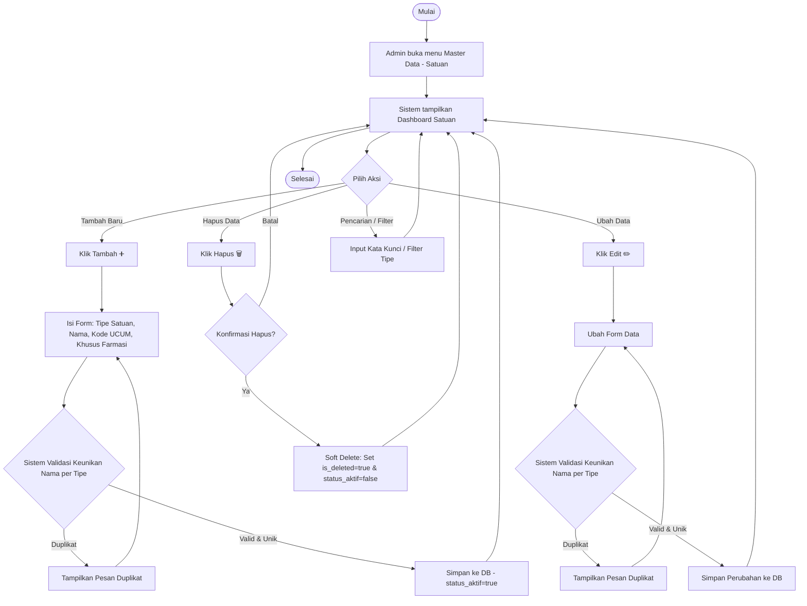
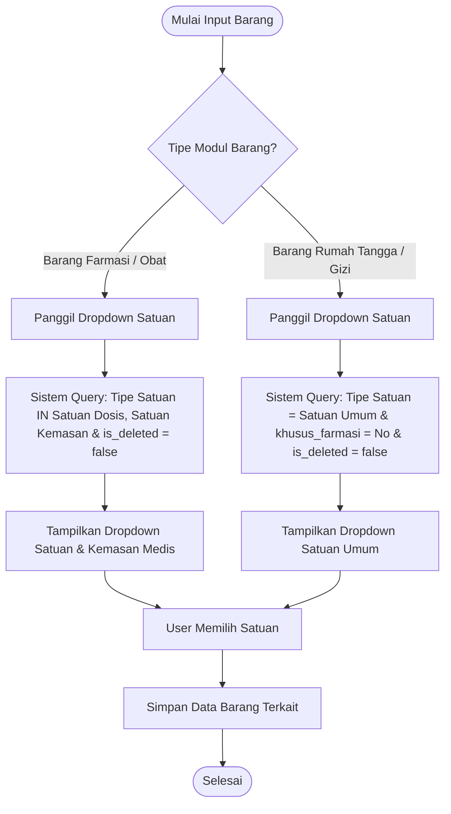
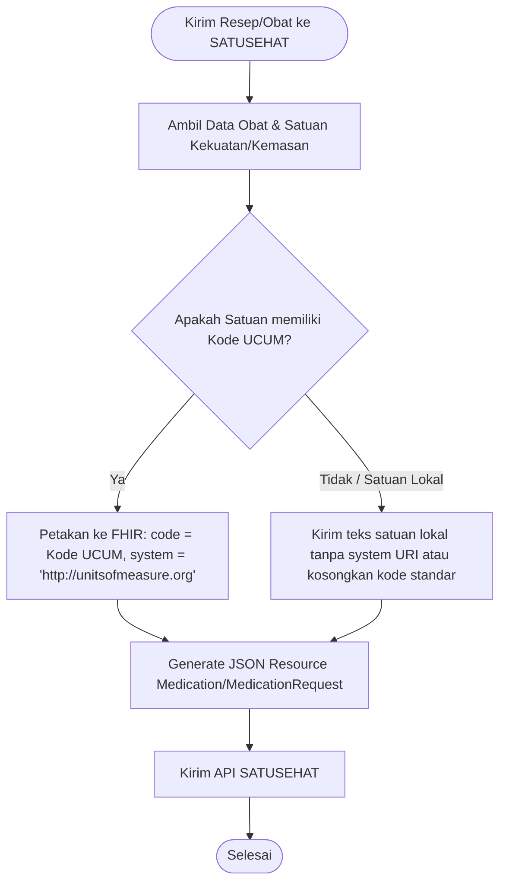

# Product Requirement Document — Master Data Satuan dan Kemasan

**Related Document:**
- PRD Master Data Obat / Farmasi (konsumen dropdown satuan & kemasan)
- Kamus Farmasi dan Alat Kesehatan (KFA) - SATUSEHAT: [https://satusehat.kemkes.go.id/platform/docs/id/master-data/kfa/](https://satusehat.kemkes.go.id/platform/docs/id/master-data/kfa/)
- Standar UCUM (Unified Code for Units of Measure): [http://unitsofmeasure.org](http://unitsofmeasure.org)
- Master data UCUM: [Observation.valueQuantity (UCUM)](https://docs.google.com/spreadsheets/d/1OHM4ICgQ3hseGLrqi9GQzcREddU5SDKto50dhkhOjnc/edit?gid=0#gid=0)

**Document Version:**
| Tanggal | Versi | Keterangan |
| :--- | :--- | :--- |
| 6 Juni 2026 | 2.0 | Master Data Satuan (universal, multi-modul) |

**Approval:**
| PRD approved by | Nama/Jabatan | Signature, Date |
| :--- | :--- | :--- |
| M. Sulthan Farras Nanz | Chief Strategy & Growth Officer Tamtech International | (Signature, Date) |
| Wening Arif | Product Owner | (Signature, Date) |

---

## 1. Overview / Brief Summary

**Master Data Satuan dan Kemasan** adalah modul referensi terpusat yang menyimpan daftar baku satuan pengukuran yang dipakai pada seluruh master barang di Rumah Sakit, mencakup **Barang Farmasi (obat & alkes)**, **Barang Rumah Tangga**, dan **Barang Gizi**. Modul ini dirancang sebagai *single source of truth* (sumber tunggal) yang dirujuk oleh ketiga master barang tersebut sebagai dropdown dinamis saat pengisian data.

Modul ini mengelompokkan satuan berdasarkan field **Tipe Satuan** dengan tiga nilai:
1. **Satuan Dosis** (untuk dosis obat, mis. `mg`, `ml`, `mcg`, `butir`).
2. **Satuan Kemasan** (untuk outer packaging / wadah luar, mis. `box`, `strip`, `ampul`, `vial`).
3. **Satuan Umum** (untuk barang non-farmasi / umum, mis. `pcs`, `lembar`, `set`, `porsi`).

Untuk mengakomodasi kebutuhan khusus farmasi tanpa mengotori modul non-farmasi, master ini menyediakan flag **"Khusus Farmasi"** (Yes/No) pada level entri. Satuan spesifik obat (seperti `mg/0.5ml`, `mcg/puff`, `IU/gram`) ditandai `Khusus Farmasi = Yes` agar tidak tampil pada dropdown Barang Rumah Tangga atau Barang Gizi.

Selain itu, master ini mendukung interoperabilitas internasional dengan menyimpan kode standar **UCUM (Unified Code for Units of Measure)** secara opsional pada entri yang memiliki padanan internasional, guna memastikan kesiapan integrasi rekam medis elektronik dengan platform **SATUSEHAT** Kementerian Kesehatan RI.

> **CATATAN SEEDING & RUJUKAN:** Konsep "Satuan Sediaan" (bentuk fisik obat seperti Tablet, Kapsul, Sirup) **DIPISAH** menjadi Master Data Sediaan tersendiri yang khusus dipakai oleh Master Barang Farmasi, tidak digabung di dalam Master Data Satuan ini.

---

## 2. Background

Di lingkungan operasional rumah sakit, pencatatan satuan barang yang tidak seragam menimbulkan berbagai kendala administratif dan klinis:
- **Ketidakkonsistenan Penulisan:** Sebelumnya, satuan barang ditulis sebagai teks bebas pada masing-masing master barang (Farmasi, Rumah Tangga, Gizi). Hal ini menyebabkan tingginya inkonsistensi penulisan (misal: satu RS menggunakan variasi "tab", "tablet", "TAB", atau "butir" untuk hal yang sama, atau "pcs", "piece", "buah" untuk barang rumah tangga).
- **Kesulitan Rekonsiliasi & Perhitungan Stok:** Ketidakseragaman teks menyulitkan pembuatan laporan lintas modul, konsolidasi data inventori, dan perhitungan stok multi-level (konversi kemasan).
- **Hambatan Interoperabilitas SATUSEHAT:** Tanpa adanya kode standar yang terpetakan secara internasional (seperti UCUM), data obat tidak dapat diintegrasikan dengan lancar ke platform SATUSEHAT milik Kementerian Kesehatan RI.

**Solusi v2.0 (Master Universal):**
Pada konsep awal, master data dirancang eksklusif untuk kebutuhan farmasi dengan 3 tipe (Satuan Ukur / Sediaan / Kemasan). Namun, untuk efisiensi sistem, pada versi 2.0 ini cakupannya diperluas menjadi **universal (lintas seluruh master barang)** dengan menerapkan tiga tipe baru (Satuan Dosis / Satuan Kemasan / Satuan Umum) dan memisahkan konsep "Sediaan" ke master tersendiri.

Dengan penerapan satu master universal berkode standar (UCUM opsional), penulisan satuan menjadi konsisten di seluruh departemen rumah sakit, sementara satuan farmasi tetap siap dipetakan ke SATUSEHAT tanpa perlu membuat duplikasi tabel master yang berbeda untuk masing-masing modul konsumen.

---

## 3. In Scope

### Scope Definition (Yang Dikerjakan)
1. **Pengelolaan CRUD Terpusat:** Pembangunan modul CRUD (Create, Read, Update, Delete) master satuan secara universal, yang diklasifikasikan berdasarkan field Tipe Satuan (*Satuan Dosis / Satuan Kemasan / Satuan Umum*).
2. **Flagging "Khusus Farmasi":** Penyediaan flag khusus farmasi (`Khusus Farmasi = Yes/No`) pada level entri untuk memfilter tampilan dropdown di modul non-medis.
3. **Pemetaan Standar UCUM:** Penyediaan field Kode Standar UCUM (opsional) dan Code System URI secara otomatis terisi (`http://unitsofmeasure.org`) untuk entri yang memiliki padanan standar internasional.
4. **Soft Delete Mechanism:** Penghapusan data menggunakan metode *soft delete* (`is_deleted = true`). Entri yang dihapus tidak akan muncul pada dropdown baru, namun relasi data historis pada barang yang sudah memakai satuan tersebut tetap valid dan aman.
5. **Dashboard Management:** Penyediaan halaman daftar (list) data satuan lengkap dengan fitur pagination, pencarian (Nama, Kode UCUM), serta penyaringan (Tipe Satuan, Khusus Farmasi).
6. **Dropdown API Service:** Penyediaan endpoint API internal yang menyuplai data satuan aktif secara dinamis untuk dikonsumsi oleh Master Barang Farmasi, Master Barang Rumah Tangga, dan Master Barang Gizi sesuai filter tipe.

### Out Scope (Yang TIDAK Dikerjakan)
1. **Faktor Konversi Kemasan per Produk:** Konfigurasi faktor konversi satuan per produk (misal: `1 box = 10 strip = 100 tablet`) bersifat sangat spesifik per obat, sehingga penanganannya didelegasikan sepenuhnya pada Master Data Obat, bukan pada master satuan umum ini.
2. **Katalog Obat KFA SATUSEHAT:** Pengelolaan data katalog obat dan kode KFA ditangani oleh Master Data Obat yang merujuk pada master satuan ini.
3. **Proses Pengiriman Resource FHIR:** Pembuatan dan pengiriman aktual resource `Medication` atau `MedicationRequest` ke server SATUSEHAT ditangani oleh Modul Integrasi SATUSEHAT secara terpisah.
4. **Sinkronisasi Otomatis Kamus UCUM:** Sistem tidak melakukan penarikan (*fetch*) dinamis terminologi UCUM dari server eksternal secara real-time; pengisian pustaka kode UCUM dilakukan melalui seeding data awal atau CRUD manual.
5. **Master Data Sediaan Obat:** Bentuk sediaan fisik (Tablet, Sirup, Kapsul, Salep) dikelola pada modul Master Data Sediaan terpisah.

---

## 4. Goals and Metrics

### Goals
Menyediakan kamus satuan barang yang baku, terpusat, dan universal untuk lintas modul RS (Farmasi, Rumah Tangga, Gizi), lengkap dengan pemetaan ke kode standar UCUM (opsional) untuk kesiapan kepatuhan integrasi SATUSEHAT.

### Metrics & Success Criteria
| No | Metrics | Success Criteria |
| :--- | :--- | :--- |
| **1** | **Konsistensi Data** | 0 duplikasi satuan/kemasan bermakna sama; seluruh data master barang memilih dari master terpusat, tidak ada lagi pengisian teks bebas (*free text*). |
| **2** | **Kelengkapan Kode Standar** | 100% entri satuan medis yang memiliki padanan UCUM internasional terisi kode standarnya secara valid; satuan lokal (mis. *ampul*, *butir*) diizinkan kosong. |
| **3** | **Kesiapan Interoperabilitas** | 100% pengiriman data satuan obat ke platform SATUSEHAT berhasil diterjemahkan ke kode standar UCUM yang valid. |
| **4** | **Efisiensi Pengelolaan** | Proses penambahan atau perubahan entri satuan memakan waktu < 2 menit dan dampaknya langsung terdistribusi ke seluruh modul terkait. |

---

## 5. Related Feature

Modul Master Data Satuan dan Kemasan dikonsumsi secara langsung oleh beberapa modul lainnya:

| No | Module | Feature | Relasi & Deskripsi |
| :--- | :--- | :--- | :--- |
| **1** | **Master Data Obat / Farmasi** | Form Input Barang Farmasi | Menggunakan dropdown **Satuan Dosis** untuk kekuatan zat aktif, dan **Satuan Kemasan** untuk kemasan luar obat. |
| **2** | **Modul Stok & Inventory** | Kartu Stok & Mutasi Barang | Merujuk satuan pada master ini sebagai basis pelaporan kuantitas stok fisik di gudang. |
| **3** | **Modul Integrasi SATUSEHAT** | Mapping Resource FHIR | Mengambil Kode Standar (UCUM) dan Code System URI dari satuan terpilih untuk menyusun payload `Medication`. |
| **4** | **Master Barang Rumah Tangga** | Form Input Barang RT | Menggunakan dropdown **Satuan Umum** (dengan filter `Khusus Farmasi = No`) sebagai satuan terkecil/kemasan barang umum. |
| **5** | **Master Barang Gizi** | Form Input Bahan Gizi | Menggunakan dropdown **Satuan Umum** (dengan filter `Khusus Farmasi = No`) sebagai satuan bahan gizi/makanan. |

---

## 6. Business Process

### A. As-Is (Kondisi Saat Ini)
Proses pengelolaan satuan barang saat ini masih bersifat mandiri dan terfragmentasi pada masing-masing departemen:
1. Staff administrasi dari unit Farmasi, Rumah Tangga, dan Gizi menginput nama satuan secara manual dalam bentuk teks bebas (*free text*) pada form masing-masing barang.
2. Terjadi penulisan ganda dan bervariasi untuk satu satuan yang sama (mis. `miligram`, `mg`, `Mg`, `m.g.`), menyulitkan pelaporan inventarisasi rumah sakit.
3. Tidak tersedia kode standar internasional (UCUM) pada database, sehingga saat integrasi SATUSEHAT diaktifkan, tim IT harus memetakan secara manual satu-persatu (*hardcoded mapping*).

### B. To-Be (Kondisi Yang Diharapkan)
Dengan diimplementasikannya Master Data Satuan universal, alur pengelolaan menjadi terpusat:
1. Administrator mengelola pustaka satuan (Tambah, Ubah, Soft Delete) melalui satu dashboard admin Master Data Satuan.
2. Setiap input data barang baru (baik Obat, Barang RT, maupun Bahan Gizi) diwajibkan memilih dari dropdown master satuan yang sudah diklasifikasikan berdasarkan Tipe Satuan dan disaring berdasarkan flag Khusus Farmasi.
3. Modul integrasi SATUSEHAT secara otomatis membaca field Kode Standar (UCUM) dari database satuan tanpa perlu intervensi atau pemetaan manual tambahan di sisi backend integrasi.

#### Flowchart To-Be: Manajemen Master Satuan (CRUD Admin)


#### Flowchart To-Be: Konsumsi Dropdown Satuan oleh Modul Konsumen


#### Flowchart To-Be: Integrasi Interoperabilitas SATUSEHAT (UCUM)


---

## 7. Main Flow / Mindmap

### Skenario 1 — Pengelolaan Master Satuan (Jalur Utama Admin)
1. **Admin** mengakses menu **Master Data** lalu memilih sub-menu **Satuan**.
2. **Sistem** menampilkan halaman dashboard yang berisi tabel daftar satuan dengan *pagination* default 10 baris.
3. **Admin** mengklik tombol **➕ Tambah** untuk membuka modal form tambah satuan.
4. **Admin** mengisi Tipe Satuan, Nama, Kode Standar UCUM (jika ada), dan mengatur flag Khusus Farmasi.
5. **Admin** mengklik **Simpan**, **Sistem** memverifikasi keunikan Nama pada Tipe Satuan yang sama.
6. Jika nama unik, data tersimpan di database dengan status aktif dan `is_deleted = false`.

### Skenario 2 — Filter Dropdown pada Input Barang RT & Gizi
1. **Staff Gizi / RT** membuka form tambah barang baru pada modulnya masing-masing.
2. Saat fokus pada pilihan **Satuan**, modul mengirim permintaan API ke master satuan dengan parameter filter `tipe_satuan = Satuan Umum` dan `khusus_farmasi = No` serta `is_deleted = false`.
3. **Sistem** menyajikan dropdown berisi satuan umum seperti `Pcs`, `Set`, `Porsi`. Satuan farmasi seperti `mg/0.5ml` tidak akan tampil.
4. **Staff** memilih satuan dan menyimpan data barang.

### Skenario 3 — Soft Delete Satuan yang Sudah Tidak Digunakan
1. **Admin** mengidentifikasi adanya satuan yang salah input atau tidak lagi digunakan (misal: `Dosin`).
2. **Admin** mengklik tombol **Hapus** pada baris data tersebut.
3. **Sistem** menampilkan pesan konfirmasi. Setelah disetujui, sistem melakukan pembaruan status `is_deleted = true`.
4. Satuan `Dosin` tidak akan lagi muncul di dropdown input barang baru manapun. Namun, barang lama yang terlanjur menggunakan satuan `Dosin` tetap menampilkan teks tersebut secara utuh dan valid di riwayat transaksi.

---

## 8. Requirement

### Business Rules (BR)
- **BR-001 (Keunikan Nama per Tipe):** Nama satuan harus bersifat unik untuk setiap Tipe Satuan yang sama (case-insensitive). Satu nama satuan boleh digunakan ulang di tipe yang berbeda jika relevan (misal: `Butir` pada Satuan Dosis dan Satuan Umum), namun sangat dilarang memiliki duplikat nama pada tipe yang sama (misal: dua entri `Box` pada tipe Satuan Kemasan).
- **BR-002 (Domain Tipe Satuan):** Entri data Tipe Satuan wajib diklasifikasikan ke dalam salah satu dari tiga opsi statis: `Satuan Dosis`, `Satuan Kemasan`, atau `Satuan Umum`.
- **BR-003 (Mekanisme Soft Delete):** Data satuan tidak boleh dihapus secara fisik dari database (*hard delete*). Penghapusan wajib menggunakan flag `is_deleted = true` untuk mempertahankan integritas data historis inventori dan transaksi rekam medis RS yang merujuk pada satuan tersebut.
- **BR-004 (Penyaringan Dropdown Konsumen):** 
  - Dropdown Barang Farmasi hanya boleh menampilkan satuan dengan tipe `Satuan Dosis` dan `Satuan Kemasan`.
  - Dropdown Barang RT & Gizi hanya boleh menampilkan satuan dengan tipe `Satuan Umum` yang memiliki flag `Khusus Farmasi = No`.
- **BR-005 (Keterikatan URI UCUM):** Setiap data satuan yang dilengkapi dengan *Kode Standar (UCUM)* secara otomatis dikaitkan dengan Code System URI standar internasional yaitu `http://unitsofmeasure.org` di level system.
- **BR-006 (Flag Khusus Farmasi):** Default flag Khusus Farmasi saat pembuatan data baru adalah `No (False)`. Jika diatur ke `Yes (True)`, satuan tersebut dikategorikan sangat spesifik untuk sediaan medis obat dan otomatis disembunyikan dari modul non-medis (RT/Gizi).

### User Stories (US)
- **US-001:** Sebagai **Admin**, saya ingin **melihat dashboard daftar satuan & kemasan**, agar saya dapat melihat seluruh data yang tersedia secara terstruktur dan terkelompok berdasarkan tipenya.
- **US-002:** Sebagai **Admin**, saya ingin **menambahkan entri satuan atau kemasan baru**, agar satuan tersebut dapat langsung digunakan sebagai dropdown pilihan pada form input barang RS.
- **US-003:** Sebagai **Admin**, saya ingin **mengubah data satuan**, agar saya dapat mengoreksi kesalahan pengetikan nama atau memperbarui pemetaan kode standar UCUM yang terlewat.
- **US-004:** Sebagai **Admin**, saya ingin **melihat detail lengkap suatu satuan**, agar saya dapat mengetahui konfigurasi detail termasuk kode UCUM, URI standar, dan status flag farmasinya.
- **US-005:** Sebagai **Admin**, saya ingin **menghapus (soft delete) satuan**, agar satuan tersebut tidak disajikan lagi pada input barang baru, namun riwayat barang lama yang memakainya tidak rusak.
- **US-006:** Sebagai **Admin**, saya ingin **mencari dan menyaring satuan**, agar saya dapat dengan cepat menemukan satuan tertentu di tengah ratusan daftar data.
- **US-007:** Sebagai **Petugas Gizi & RT**, saya ingin **dropdown pilihan satuan pada modul saya otomatis bersih dari satuan medis**, agar proses kerja saya lebih fokus dan bebas dari kesalahan salah pilih satuan klinis.
- **US-008:** Sebagai **Sistem Integrasi SATUSEHAT**, saya ingin **membaca kode standar UCUM pada satuan secara langsung**, agar proses interoperabilitas rekam medis elektronik berjalan otomatis tanpa pemetaan manual.

### Functional Requirements (FR)
- **FR-001 (Dashboard View):** Sistem wajib menyediakan halaman dashboard master data satuan yang menampilkan tabel data dengan kolom: Tipe Satuan, Nama Satuan, Kode Standar (UCUM), Khusus Farmasi, dan tombol aksi (Detail, Edit, Hapus).
- **FR-002 (Pagination):** Sistem wajib membatasi jumlah tampilan baris data di dashboard menggunakan pagination dengan opsi filter ukuran halaman: 10, 20, 50, dan 100 data.
- **FR-003 (Search & Filter):** Sistem wajib mendukung pencarian data secara real-time berdasarkan kata kunci Nama Satuan atau Kode Standar, serta mendukung filter berbasis Tipe Satuan dan status Khusus Farmasi.
- **FR-004 (Form Tambah):** Sistem wajib menyediakan modal popup form tambah satuan dengan komponen input: Dropdown Tipe Satuan, Textbox Nama Satuan, Dropdown/Text Kode Standar (UCUM, opsional), dan Switch Toggle Khusus Farmasi (default: No).
- **FR-005 (Validation Rules):** Sistem wajib menolak penyimpanan data jika:
  - Field Tipe Satuan atau Nama Satuan kosong.
  - Nama Satuan yang diinput sudah terdaftar pada Tipe Satuan yang sama (case-insensitive).
- **FR-006 (Form Ubah):** Sistem wajib menyediakan form ubah data yang menampilkan data lama secara otomatis, dengan validasi keunikan nama yang sama tetap diberlakukan saat proses penyimpanan pembaruan.
- **FR-007 (Detail View):** Sistem wajib menampilkan modal detail satuan yang berisi seluruh data atribut, termasuk URI code system (`http://unitsofmeasure.org` jika UCUM terisi) dan statistik jumlah rujukan obat/barang (fase 2).
- **FR-008 (Soft Delete Execution):** Saat tombol hapus dikonfirmasi, sistem wajib mengubah flag database `is_deleted = true`, mencatat timestamp penghapusan, dan menghapus entri dari seluruh tampilan dropdown baru.
- **FR-009 (Dropdown Service API):** Sistem wajib menyediakan endpoint API internal (`/api/master/satuan/dropdown`) yang menyajikan data aktif (`is_deleted = false`) dengan kemampuan filter query parameter `tipe` dan `khusus_farmasi` untuk dikonsumsi modul eksternal.
- **FR-010 (Audit Trail Log):** Sistem wajib mencatat metadata audit standar secara otomatis pada setiap transaksi tulis/ubah data, yang mencakup ID User pembuat, Timestamp dibuat, ID User pengubah terakhir, dan Timestamp diubah terakhir.

---

## 9. Data Requirements (Spesifikasi Field)

### Entitas Database: `master_satuan`

#### A. Layar TAMPIL — Dashboard / List Satuan
Layar ini menyajikan seluruh data satuan yang aktif di sistem dalam bentuk tabel terstruktur.

| Kolom | Label Kolom | Tipe | Sumber/Default | Catatan |
| :--- | :--- | :--- | :--- | :--- |
| `tipe_satuan` | Tipe Satuan | Text | `master_satuan.tipe_satuan` | Menampilkan: Satuan Dosis / Satuan Kemasan / Satuan Umum |
| `nama` | Nama | Text | `master_satuan.nama` | Nama lengkap satuan |
| `kode_standar` | Kode Standar (UCUM) | Text | `master_satuan.kode_standar` | Kode standar internasional (kosong jika tidak ada) |
| `khusus_farmasi` | Khusus Farmasi | Text (Ya/Tidak) | `master_satuan.khusus_farmasi` | Dikonversi dari boolean ke label "Ya" atau "Tidak" |

#### B. Layar INPUT — Form Tambah / Ubah Satuan (Modal Popup)
Form ini digunakan oleh Administrator untuk mendaftarkan satuan baru atau memperbarui data yang ada.

| Field | Label Form | Tipe | Wajib | Validasi / Batasan | Sumber/Default | Catatan |
| :--- | :--- | :--- | :---: | :--- | :--- | :--- |
| `satuan_id` | ID Satuan | UUID / seq | Ya | Unik, auto-generated | Auto | Primary Key di database, tersembunyi dari user. |
| `tipe_satuan` | Tipe Satuan | Single Dropdown | Ya | Opsi pilihan: `Satuan Dosis`, `Satuan Kemasan`, `Satuan Umum` | Manual | Menentukan klasifikasi peruntukan satuan. |
| `nama` | Nama Satuan | Text Input | Ya | Maksimal 100 karakter, Wajib Unik per Tipe Satuan (case-insensitive) | Manual | Mengisi nama satuan (misal: *Milligram*, *Box*, *Pcs*). |
| `kode_standar` | Kode Standar (UCUM) | Dropdown/Text | Tidak | Opsional, diisi jika terdapat padanan standar internasional UCUM | Manual | Referensi kode resmi UCUM (misal: *mg*, *mL*, *kg*). |
| `code_system_uri` | Code System URI | Text | Tidak | Otomatis terisi `http://unitsofmeasure.org` jika Kode Standar terisi | Auto | Digunakan untuk keperluan interoperabilitas SATUSEHAT. |
| `khusus_farmasi` | Khusus Farmasi | Toggle Switch | Ya | Opsi: `Yes` (True) atau `No` (False) | Default: `No` | Jika `Yes`, satuan hanya akan muncul di modul farmasi. |
| `is_deleted` | Status Terhapus | Boolean | Ya | Opsi: `True` atau `False` | Default: `False` | Digunakan sebagai penanda soft delete. |
| `created_by` | Dibuat Oleh | Lookup / Text | Ya | Referensi ID User login aktif | Auto (System) | Audit Trail pembuat data. |
| `created_at` | Waktu Dibuat | Datetime | Ya | Timestamp waktu penyimpanan | Auto (System) | Audit Trail waktu pembuatan. |
| `updated_by` | Diubah Oleh | Lookup / Text | Tidak | Referensi ID User login aktif | Auto (System) | Audit Trail pengubah data terakhir. |
| `updated_at` | Waktu Diubah | Datetime | Tidak | Timestamp waktu perubahan terakhir | Auto (System) | Audit Trail waktu modifikasi terakhir. |

#### C. Layar TAMPIL — Detail Satuan (Modal Detail)
Menampilkan rincian lengkap dari entri satuan yang dipilih.

| Kolom | Label Detail | Tipe | Sumber Data | Catatan |
| :--- | :--- | :--- | :--- | :--- |
| `tipe_satuan` | Tipe Satuan | Text | `master_satuan.tipe_satuan` | |
| `nama` | Nama Satuan | Text | `master_satuan.nama` | |
| `kode_standar` | Kode Standar (UCUM) | Text | `master_satuan.kode_standar` | Menampilkan "—" jika kosong. |
| `code_system_uri` | Code System URI | Text | `master_satuan.code_system_uri` | Menampilkan "—" jika kosong. |
| `khusus_farmasi` | Khusus Farmasi | Text (Ya/Tidak) | `master_satuan.khusus_farmasi` | |
| `jumlah_referensi` | Jumlah Rujukan Barang | Integer | Query count rujukan dinamis | **[Phase 2]** Menunjukkan jumlah barang yang merujuk data satuan ini. |

---

## 10. Lampiran / Catatan

### A. Tampilan Dashboard (Wireframe Konseptual)
```
+--------------------------------------------------------------------------------------------------+
|  MASTER DATA SATUAN DAN KEMASAN                                                   [ ➕ TAMBAH ]  |
+--------------------------------------------------------------------------------------------------+
| Cari: [ [Input Nama / Kode] ]   Tipe: [ Semua Dropdown v ]   Khusus Farmasi: [ Semua Dropdown v ] |
+------------------+------------------+-----------------------+------------------+-----------------+
| TIPE SATUAN      | NAMA SATUAN      | KODE STANDAR (UCUM)   | KHUSUS FARMASI   | AKSI            |
+------------------+------------------+-----------------------+------------------+-----------------+
| Satuan Dosis     | Milligram        | mg                    | Ya               | [👁️] [✏️] [🗑️]   |
| Satuan Kemasan   | Box              | —                     | Tidak            | [👁️] [✏️] [🗑️]   |
| Satuan Umum      | Pieces           | —                     | Tidak            | [👁️] [✏️] [🗑️]   |
| Satuan Dosis     | Mililiter        | mL                    | Ya               | [👁️] [✏️] [🗑️]   |
+------------------+------------------+-----------------------+------------------+-----------------+
| Menampilkan 1 - 4 dari 4 data                                          Page: [1]  < Sebelum  Sesudah >|
+--------------------------------------------------------------------------------------------------+
```

### B. Rancangan Form Tambah/Ubah (Modal Popup)
```
+-----------------------------------------------------------+
| TAMBAH DATA SATUAN BARU                               [X] |
+-----------------------------------------------------------+
| Tipe Satuan *   : [ Satuan Dosis / Kemasan / Umum      v ] |
| Nama Satuan *   : [ Input nama satuan                    ] |
| Kode UCUM       : [ Pilih / Input Kode UCUM (opsional) v ] |
| Khusus Farmasi  : [ [Yes] / No (Toggle Switch)           ] |
+-----------------------------------------------------------+
|                                      [ Batal ] [ Simpan ] |
+-----------------------------------------------------------+
```

### C. Template Import Satuan (Format XLSX/CSV)
Administrator dapat melakukan import data massal menggunakan template berikut:

| tipe_satuan * | nama * | kode_standar_ucum | khusus_farmasi * |
| :--- | :--- | :--- | :--- |
| Satuan Dosis | Milligram | mg | Yes |
| Satuan Kemasan | Box | | No |
| Satuan Umum | Pieces | | No |

*Keterangan:* Kolom bertanda asteris (`*`) wajib diisi. Kolom `khusus_farmasi` diisi dengan nilai `Yes` atau `No`.

### D. Catatan Interoperabilitas SATUSEHAT (Spesifikasi Teknis)
1. **Mapping FHIR:** Pada penataan Resource FHIR (khasuknya `Medication` untuk mendefinisikan obat, atau `MedicationRequest` untuk resep), satuan kekuatan bahan aktif obat wajib dikonversi menggunakan standardisasi UCUM (`http://unitsofmeasure.org`).
2. **Aturan Fallback:** Satuan lokal tanpa padanan UCUM internasional (mis. *biji*, *bungkus*, *butir*) diizinkan untuk mengosongkan Kode Standar UCUM di sistem. Sistem integrasi SATUSEHAT akan mengirimkannya sebagai teks deskriptif murni tanpa mengasosiasikannya ke code system URI.
3. **Pemisahan Logika Konversi:** Master ini sengaja tidak memproses faktor konversi (misal: *1 box berisi 10 strip*), karena rasio konversi bersifat unik per item barang farmasi. Logika tersebut harus diletakkan pada level relasi tabel di Master Data Obat/Farmasi.

---

## 11. Non-Functional Requirements (NFR)

- **NFR-001 (Performa Query Dropdown):** Kecepatan respon API dropdown satuan harus berada di bawah **200 ms** pada kondisi load normal, dengan memanfaatkan pengindeksan (*database index*) pada kolom `tipe_satuan`, `khusus_farmasi`, dan `is_deleted`.
- **NFR-002 (Usability - Keyboard Friendly):** Form modal Tambah/Ubah harus mendukung navigasi penuh menggunakan keyboard (tombol `Tab` untuk pindah field, `Enter` untuk submit, dan `Esc` untuk menutup modal).
- **NFR-003 (Data Integrity Constraint):** Database harus menerapkan *Unique Composite Constraint* pada kolom `(tipe_satuan, nama)` yang berstatus aktif (`is_deleted = false`) untuk mencegah duplikasi data akibat *race condition* di level server.
- **NFR-004 (Audit Trail Robustness):** Setiap aktivitas modifikasi data (tambah, ubah, hapus) wajib mencatat user pelaksana dan timestamp secara akurat guna memenuhi standar audit akreditasi rumah sakit dan keamanan informasi.
- **NFR-005 (Reliability & Caching):** Mengingat dropdown satuan dikonsumsi secara intensif di berbagai form transaksi rumah sakit, data aktif dropdown satuan harus di-cache di level server (mis. Redis) dengan masa kedaluwarsa otomatis (*TTL*) dan di-invalidate seketika saat terjadi operasi CUD pada master satuan.

---

## 12. Integrasi Eksternal & Internal

### Integrasi Eksternal
- **Platform SATUSEHAT (Kemenkes RI):** Interoperabilitas data melalui transmisi kode satuan terstandar UCUM (`http://unitsofmeasure.org`) yang secara otomatis dibaca dari master ini saat pengiriman modul resep (`MedicationRequest`) dan dispensing obat (`MedicationDispense`).

### Integrasi Internal
- **Master Data Obat / Farmasi:** Memanggil satuan bertipe `Satuan Dosis` untuk dropdown kekuatan dosis, dan `Satuan Kemasan` untuk dropdown bentuk kemasan obat.
- **Master Barang Rumah Tangga:** Memanggil satuan bertipe `Satuan Umum` (dengan filter `Khusus Farmasi = No`) untuk dropdown jenis satuan barang umum rumah tangga.
- **Master Barang Gizi:** Memanggil satuan bertipe `Satuan Umum` (dengan filter `Khusus Farmasi = No`) untuk dropdown jenis satuan bahan gizi.
- **Master User (A1):** Relasi audit trail untuk mengidentifikasi nama lengkap/id user (`created_by`, `updated_by`) yang memodifikasi data master satuan.

---

## Asumsi

- **Asumsi 1 (Pemisahan Sediaan):** Diputuskan sediaan fisik obat (seperti tablet, kapsul, sirup) dikelola pada tabel Master Sediaan terpisah karena sediaan memiliki atribut klinis tambahan yang tidak relevan dengan satuan kuantitatif dasar.
- **Asumsi 2 (Data Seeding Awal):** Data awal satuan standar (seperti `mg`, `g`, `mL`, `L`, `box`, `tablet`, `pcs`) akan di-seed secara otomatis ke database saat proses deployment awal menggunakan file SQL seed/migration agar sistem langsung siap pakai.
- **Asumsi 3 (Keunikan Case-Insensitive):** Validasi keunikan nama satuan di level database dan aplikasi diberlakukan secara case-insensitive (misal: penambahan "box" akan ditolak jika "Box" sudah ada pada tipe satuan yang sama).

---

## Pertanyaan Terbuka

1. **Apakah terdapat kebutuhan fitur ekspor data satuan ke format PDF/Excel di dashboard admin?**
   *Rekomendasi:* Ditunda untuk fase pasca-MVP, prioritas utama adalah memastikan fungsionalitas CRUD dasar dan integrasi dropdown berjalan lancar.
2. **Apakah diperlukannya fitur penggabungan (Merge) satuan jika terlanjur terjadi duplikasi akibat kesalahan penamaan di masa lalu sebelum v2.0?**
   *Rekomendasi:* Fitur merge data satuan ditangani via query manual oleh administrator database (DBA) di backend pada fase MVP untuk menghindari kompleksitas UI form penggabungan.
3. **Bagaimana penanganan konversi kemasan multi-level yang dinamis?**
   *Keputusan:* Tetap dikelola di masing-masing master barang konsumen, master satuan ini murni bertindak sebagai penyedia label satuan yang valid saja.
