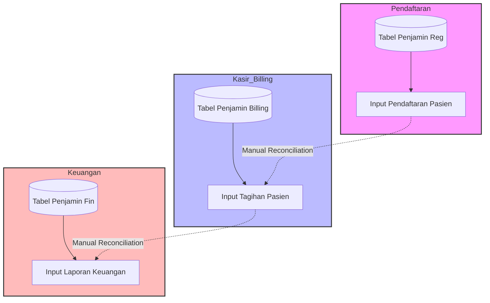
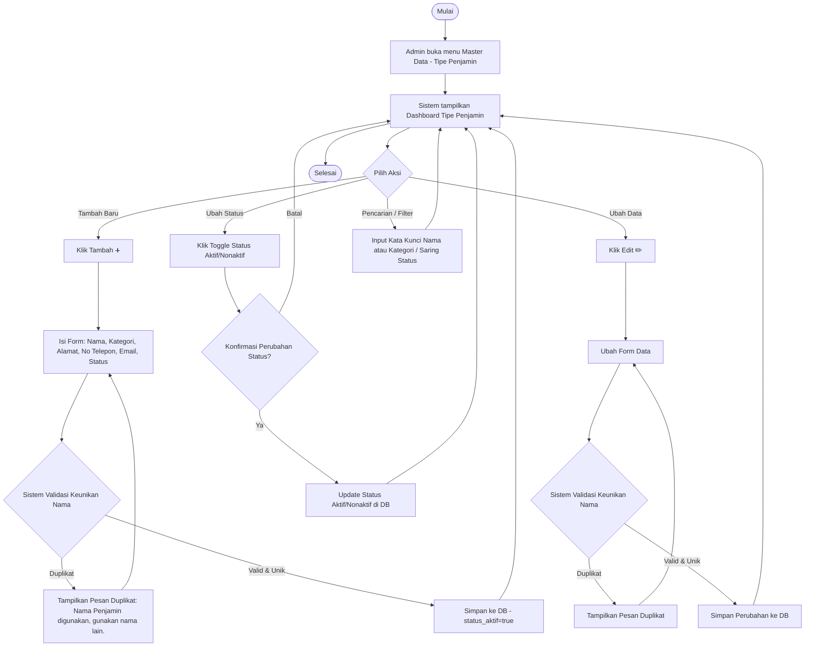
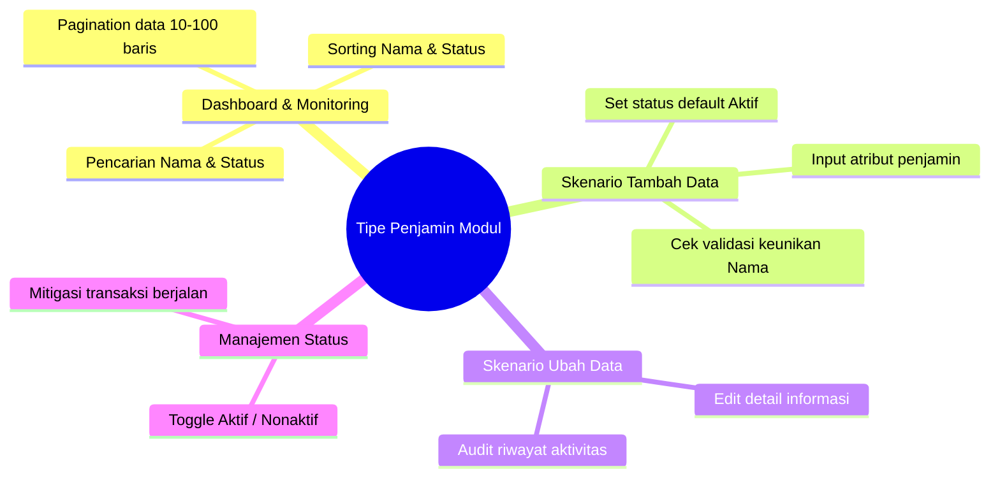

# Product Requirement Document — Master Data Tipe Penjamin

**Related Document:**
- Design Figma: [Link Figma Design] *(diisi saat design final tersedia)*
- Template Import: [Template Import Master Data Tipe Penjamin](https://docs.google.com/spreadsheets/d/1MH-31EDTEm3To7s0oIFhrGWivHzzm3IAWcZSwl92IrE/edit?gid=0#gid=0)
- Template Export: [Template Ekspor Master Data Tipe Penjamin](https://docs.google.com/spreadsheets/u/0/d/1POeZgiiCV1jgL3qedjzaIdtlqjkhOcGoYGUbMELEELk/edit?fromCopy=true&ct=2&cct=3)

**Document Version:**
| Tanggal | Versi | Keterangan |
| :--- | :--- | :--- |
| 28 Mei 2026 | 1.0 | Pembuatan Awal Dokumen (MVP Phase) |

**Approval:**
| PRD approved by | Nama/Jabatan | Signature, Date |
| :--- | :--- | :--- |
| M. Sulthan Farras Nanz | Chief Strategy & Growth Officer Tamtech International | (Signature, Date) |
| Ulfa | Product Owner | (Signature, Date) |
| Arif | System Analyst | (Signature, Date) |

---

## 1. Overview / Brief Summary

Dalam operasional Rumah Sakit, setiap transaksi pelayanan kesehatan pasien memiliki pihak penjamin (pembayar) yang menanggung biaya perawatan. **Tipe Penjamin** merupakan klasifikasi terpusat yang mengelompokkan penjamin berdasarkan kategori pembayaran, seperti Umum/Pribadi, BPJS, Asuransi Swasta, Asuransi Pemerintah, dan Perusahaan/Instansi.

Modul **Master Data - Tipe Penjamin** pada platform Neurovi berfungsi sebagai pusat pengelolaan klasifikasi penjamin terpadu. Modul ini menjadi fondasi utama yang akan dikonsumsi secara konsisten oleh proses pendaftaran pasien (*admission*), penagihan kasir (*billing*), serta pencatatan jurnal akuntansi keuangan.

Dengan pengelolaan Tipe Penjamin yang terpusat, Neurovi dapat memastikan keakuratan pengelompokan data transaksi, mempermudah rekapitulasi pendapatan per kategori pembayar, serta mendukung otomasi pemetaan akun keuangan (COA) secara konsisten dan akurat.

---

## 2. Background

Sebelum dikembangkannya modul terpusat ini, manajemen klasifikasi penjamin pada sistem rumah sakit masih terfragmentasi di masing-masing unit fungsional (Pendaftaran, Kasir/Billing, dan Keuangan), sehingga menimbulkan berbagai kendala operasional:
- **Duplikasi & Inkonsistensi Data:** Penamaan tipe penjamin yang ditulis secara manual di masing-masing modul seringkali tidak sinkron (misalnya di modul pendaftaran ditulis "BPJS Kesehatan", di billing "BPJS", dan di keuangan "BPJS-Pusat").
- **Kesulitan Rekonsiliasi Pendapatan:** Akibat inkonsistensi penamaan, tim keuangan harus melakukan konsolidasi data dan rekonsiliasi laporan pendapatan per kategori penjamin secara manual yang memakan waktu lama dan rentan kesalahan (*human error*).
- **Ketiadaan Standar Pemetaan COA:** Tidak adanya tabel referensi tunggal yang mengaitkan penjamin dengan bagan akun standar (*Chart of Accounts - COA*) membuat pencatatan jurnal keuangan otomatis menjadi sangat sulit dilakukan.

Untuk mengatasi permasalahan tersebut, modul ini dikembangkan guna bertindak sebagai **Sumber Kebenaran Tunggal (Single Source of Truth - SSOT)** untuk seluruh klasifikasi tipe penjamin yang ada di lingkungan rumah sakit.

---

## 3. In Scope

### Scope Definition (Yang Dikerjakan)
1. **Dashboard Master Data Tipe Penjamin (Phase 1):** Halaman utama pencarian, penyaringan, sorting, pagination, dan penayangan daftar tipe penjamin.
2. **Tambah Data Tipe Penjamin (Phase 1):** Formulir modal (*overlay*) untuk menginput data tipe penjamin baru dengan validasi data masukan.
3. **Ubah Data Tipe Penjamin (Phase 1):** Kemampuan mengedit detail data tipe penjamin secara dinamis.
4. **Aktif/Nonaktifkan Status Tipe Penjamin (Phase 1):** Fitur penonaktifan status tipe penjamin langsung dari dashboard lewat modal konfirmasi.
5. **Riwayat Aktivitas / Audit Trail (Phase 1):** Pencatatan riwayat dasar aktivitas manipulasi data (siapa, kapan, aksi apa).
6. **Impor dan Ekspor Data (Phase 2):** Fitur unggah massal melalui template spreadsheet (XLSX/CSV) dan ekspor data tipe penjamin.

### Out Scope (Yang TIDAK Dikerjakan)
1. **Penetapan Tarif atau Plafon Penjamin:** Konfigurasi nominal tarif, batas plafon pertanggungan (*ceiling limit*), atau persentase diskon per asuransi/penjamin (dikelola pada modul Master Tarif & Plafon).
2. **Master Penjamin Detail:** Pengelolaan data asuransi spesifik/kontrak kerjasama korporasi secara individu (dikelola pada Master Data Penjamin yang merujuk pada Tipe Penjamin ini).

---

## 4. Goals and Metrics

### Goals
Menyediakan modul pengelolaan klasifikasi penjamin yang terstandar, terpusat, dan konsisten untuk seluruh proses pelayanan klinis dan keuangan RS. Memastikan setiap transaksi pendaftaran dan kasir mengacu pada kategori yang sama guna mempermudah audit pendapatan dan otomatisasi penjurnalan akuntansi.

### Metrics & Success Criteria
| No | Metrics | Success Criteria |
| :--- | :--- | :--- |
| **1** | **Konsistensi Data Lintas Modul** | 100% modul operasional (Pendaftaran, Kasir, Akuntansi) menggunakan referensi ID Tipe Penjamin yang sama tanpa duplikasi. |
| **2** | **Kemandirian Operasional** | 100% user Admin RS atau Configuration Manager mampu melakukan setup dan perubahan kategori penjamin tanpa memerlukan bantuan teknis tim IT/Developer. |
| **3** | **Real-Time Configuration Update** | 100% pembaruan status tipe penjamin langsung tercermin di dropdown pendaftaran secara real-time tanpa memerlukan restart server. |
| **4** | **Performa Pencarian Dashboard** | Waktu pemrosesan query pencarian dan penyaringan data di dashboard berada di bawah 3 detik dengan beban data operasional normal. |

---

## 5. Related Feature

Master Data Tipe Penjamin berperan sebagai tabel referensi yang dikonsumsi langsung oleh modul-modul berikut:

| No | Module | Feature | Relasi & Deskripsi |
| :--- | :--- | :--- | :--- |
| **1** | **Pendaftaran / Registrasi** | Registrasi Pasien Baru & Lama | Petugas pendaftaran memilih Tipe Penjamin aktif untuk menentukan alur penjaminan pasien saat melakukan registrasi kunjungan. |
| **2** | **Kasir / Billing** | Pembayaran & Pelunasan Kasir | Menentukan skema penagihan, memilah porsi biaya pribadi (*out-of-pocket*) vs porsi penjamin, dan mencetak kuitansi tagihan. |
| **3** | **Keuangan & Akuntansi** | Jurnal Otomatis & Laporan Pendapatan | Memetakan klasifikasi pendapatan berdasarkan kategori penjamin ke akun buku besar (COA) untuk otomatisasi pencatatan jurnal. |
| **4** | **Master Data Penjamin** | Setup Detail Asuransi | Bertindak sebagai kategori utama (*parent*) dari entri data asuransi spesifik (misalnya: Tipe Penjamin `Asuransi Swasta` menaungi penjamin `Admedika`, `Prudential`, `Allianz`). |

---

## 6. Business Process

### A. As-Is (Kondisi Saat Ini)
Kondisi saat ini di mana data master dikelola secara terpisah di setiap aplikasi/departemen:



### B. To-Be (Kondisi Yang Diharapkan)
Data dikelola secara terpusat dan terdistribusi otomatis ke seluruh unit fungsional:



---

## 7. Main Flow / Mindmap

Berikut adalah mindmap skenario utama manajemen data Tipe Penjamin:



---

## 8. Requirement

### Business Rules (BR)
- **BR-001 (Keunikan Nama Penjamin):** Setiap entri Nama Tipe Penjamin yang didaftarkan wajib bersifat unik secara global di tingkat database (case-insensitive) untuk mencegah kerancuan klasifikasi pendapatan.
- **BR-002 (Domain Kategori Penjamin):** Setiap tipe penjamin wajib dikategorikan ke dalam salah satu nilai pilihan statis: `Pribadi`, `BPJS`, `Asuransi Swasta`, `Asuransi Pemerintah`, atau `Perusahaan/Instansi`.
- **BR-003 (Status Penonaktifan Pasif):** Mengubah status tipe penjamin menjadi `Nonaktif` tidak akan membatalkan atau merusak relasi transaksi pendaftaran pasien yang sedang berjalan (*ongoing transactions*). Penonaktifan hanya memblokir tipe penjamin tersebut agar tidak dapat dipilih lagi pada registrasi pendaftaran baru di masa mendatang.
- **BR-004 (Otoritas Modifikasi):** Hanya pengguna dengan role `Admin RS` atau `Configuration Manager` yang diberikan hak akses (*authorization*) untuk melakukan aksi Tambah, Edit, dan Ubah Status data Tipe Penjamin.

### User Stories (US)
- **US-001:** Sebagai **Admin Master Data**, saya ingin **melihat dashboard daftar tipe penjamin**, agar saya dapat melihat, mencari, dan memantau status tipe penjamin yang aktif di rumah sakit secara efisien.
- **US-002:** Sebagai **Admin Master Data**, saya ingin **menambahkan tipe penjamin baru**, agar saya dapat mengakomodasi jenis penjaminan baru yang bekerjasama dengan RS.
- **US-003:** Sebagai **Admin Master Data**, saya ingin **mengubah detail tipe penjamin**, agar informasi kontak, alamat, atau kategori penjamin dapat selalu diperbarui jika ada perubahan.
- **US-004:** Sebagai **Admin Master Data**, saya ingin **mengubah status aktif/nonaktif tipe penjamin secara cepat dari dashboard**, agar saya tidak perlu membuang waktu membuka form detail jika hanya ingin mengubah status penjamin.
- **US-005:** Sebagai **Admin / Auditor RS**, saya ingin **melihat riwayat aktivitas modifikasi data**, agar saya dapat memantau siapa, kapan, dan perubahan data apa saja yang terjadi pada tipe penjamin untuk kepatuhan audit.

### Functional Requirements (FR)
- **FR-001 (Dashboard Table):** Sistem harus menampilkan tabel data dengan kolom: Nomor, Nama Penjamin, Kategori Penjamin, Alamat, No Telepon, Email, Status, dan Aksi.
- **FR-002 (Sorting Column):** Sistem harus mendukung pengurutan baris data (*sorting ascending & descending*) pada kolom Nama Penjamin dan Status dengan mengklik *header* kolom terkait.
- **FR-003 (Filtering & Search):** Sistem harus menyediakan input box pencarian global yang dapat menyaring data berdasarkan kata kunci Nama Penjamin atau Status secara real-time.
- **FR-004 (Pagination Control):** Dashboard harus dilengkapi navigasi pagination dengan pilihan limit jumlah baris per halaman: 10, 20, 50, atau 100 baris.
- **FR-005 (Form Tambah - Modal):** Saat mengklik tombol ➕, sistem harus memunculkan overlay form tambah data dengan inputan: Nama Penjamin, Kategori Penjamin (Dropdown), Alamat, No. Telepon, Email, dan Status.
- **FR-006 (Duplicate Validation):** Saat form disubmit, sistem harus melakukan verifikasi keunikan nama. Jika nama sudah ada, sistem akan memblokir proses simpan dan memunculkan pesan error: *"Nama Penjamin digunakan, gunakan nama lain."*
- **FR-007 (Quick Status Change):** Saat user mengklik tombol ubah status di dashboard, sistem harus menampilkan popup konfirmasi warning bertombol "Batal" dan "Ubah Status" sebelum memperbarui nilai status di database.
- **FR-008 (Audit Trail Logger):** Sistem harus secara otomatis mencatat riwayat aktivitas setiap kali aksi tambah dan ubah data selesai diproses, menyimpan informasi: Tanggal & Waktu (format `dd/mm/yyyy 00:00`), Nama User pelaksana, dan Kategori Aktivitas.

---

## 9. Data Requirements (Spesifikasi Field)

### Entitas Database: `master_tipe_penjamin`

#### A. Layar TAMPIL — Dashboard Tipe Penjamin
| Kolom | Label Kolom | Tipe | Sumber / Default | Catatan |
| :--- | :--- | :--- | :--- | :--- |
| `no` | No | Integer | Serial (Auto Increment) | Nomor urutan baris di tampilan. |
| `nama_penjamin`| Nama Penjamin | Text | `master_tipe_penjamin.nama_penjamin` | Nama klasifikasi penjamin. |
| `kategori` | Kategori Penjamin | Text | `master_tipe_penjamin.kategori` | Klasifikasi kategori (Pribadi, BPJS, Asuransi Swasta, dll). |
| `alamat` | Alamat | Text | `master_tipe_penjamin.alamat` | Alamat korespondensi kantor penjamin (jika ada). |
| `no_telp` | No Telepon | Text | `master_tipe_penjamin.no_telp` | Kontak nomor telepon penjamin. |
| `email` | Email | Text | `master_tipe_penjamin.email` | Alamat email resmi penjamin. |
| `status` | Status | Text (Aktif/Nonaktif) | `master_tipe_penjamin.status` | Status ketersediaan untuk transaksi baru. |

#### B. Layar INPUT — Form Tambah / Ubah Tipe Penjamin (Overlay Modal)
| Field | Label Form | Tipe | Wajib | Validasi / Batasan | Sumber / Default | Catatan |
| :--- | :--- | :--- | :---: | :--- | :--- | :--- |
| `penjamin_id` | ID Penjamin | UUID | Ya | Auto-generated, Unik | System | Primary Key database, tersembunyi. |
| `nama_penjamin`| Nama Penjamin * | Text | Ya | Min: 3 char, Max: 50 char, Wajib unik (case-insensitive) | Manual Input | Menolak penyimpanan jika duplikat. |
| `kategori` | Kategori Penjamin * | Dropdown | Ya | Pilihan terbatas: `Pribadi`, `BPJS`, `Asuransi Swasta`, `Asuransi Pemerintah`, `Perusahaan/Instansi` | Manual Select | Klasifikasi fundamental penjamin. |
| `alamat` | Alamat | Text | Tidak | Max: 255 char | Manual Input | Opsional. |
| `no_telp` | No. Telepon | Text | Tidak | Min: 7 char, Max: 15 char, hanya angka/simbol `+` | Manual Input | Opsional. |
| `email` | Email | Text | Tidak | Max: 255 char, harus berformat email valid (`@`) | Manual Input | Opsional. |
| `status` | Status | Dropdown / Toggle | Ya | Pilihan: `Aktif`, `Nonaktif` | Default: `Aktif` | Jika `Nonaktif`, tidak muncul di dropdown pendaftaran. |

#### C. Layar TAMPIL — Riwayat Aktivitas (Audit Trail Section)
| Atribut | Format Tampilan | Tipe | Sumber Data | Catatan |
| :--- | :--- | :--- | :--- | :--- |
| `tanggal_jam` | `dd/mm/yyyy 00:00` | Datetime | `audit_log.created_at` | Waktu tindakan manipulasi data. |
| `nama_user` | Nama User | Text | `audit_log.user_name` | Identitas user yang melakukan aksi. |
| `aktivitas` | Kategori Aksi | Text | `audit_log.action_type` | Bernilai `Dibuat` atau `Diubah`. |
| `keterangan` | Detail Perubahan | Text | `audit_log.description` | Menyimpan histori field mana yang diubah beserta nilai lama vs baru. |

---

## 10. Lampiran / Catatan

### A. Tampilan Dashboard (Wireframe Konseptual)
```
+--------------------------------------------------------------------------------------------------+
|  MASTER DATA - TIPE PENJAMIN                                                      [ ➕ TAMBAH ]  |
+--------------------------------------------------------------------------------------------------+
| Cari: [ [Input Nama / Status] ]                                                                  |
+----+---------------------+---------------------+------------------+-----------------+------------+
| NO | NAMA PENJAMIN       | ALAMAT              | NO TELEPON       | EMAIL           | STATUS     |
+----+---------------------+---------------------+------------------+-----------------+------------+
| 1  | BPJS Kesehatan      | Jl. Letkol Suprapto | 021-1500400      | bpjs@go.id      | [Aktif v]  |
| 2  | Prudential Swasta   | Graha Prudential    | 021-2555678      | info@prude.co.id| [Aktif v]  |
| 3  | Mandiri Inhealth    | Sudirman Plaza      | 021-5250900      | cs@inhealth.com | [Nonaktifv]|
+----+---------------------+---------------------+------------------+-----------------+------------+
| Menampilkan 1 - 3 dari 3 data                                          Page: [1]  < Sebelum  Sesudah >|
+--------------------------------------------------------------------------------------------------+
```

### B. Rancangan Form Tambah/Ubah (Modal Popup)
```
+-----------------------------------------------------------+
| TAMBAH TIPE PENJAMIN                                  [X] |
+-----------------------------------------------------------+
| Nama Penjamin *     : [ Input nama penjamin              ] |
| Kategori Penjamin * : [ Pilih Kategori Penjamin        v ] |
| Alamat              : [ Input alamat kantor penjamin     ] |
| No. Telepon         : [ Input no telepon                 ] |
| Email               : [ Input email                      ] |
| Status              : [ Aktif / Nonaktif               v ] |
+-----------------------------------------------------------+
|                                      [ Batal ] [ Simpan ] |
+-----------------------------------------------------------+
```

### C. Rancangan Modal Konfirmasi Perubahan Status
```
+-----------------------------------------------------------+
| KONFIRMASI PERUBAHAN STATUS                           [X] |
+-----------------------------------------------------------+
| ⚠️ PERINGATAN:                                            |
| Apakah Anda yakin ingin mengubah status tipe penjamin ini |
| menjadi NONAKTIF?                                         |
|                                                           |
| Tindakan ini akan memblokir pendaftaran baru menggunakan   |
| penjamin ini di masa mendatang.                           |
+-----------------------------------------------------------+
|                                  [ Batal ] [ Ubah Status ]|
+-----------------------------------------------------------+
```

### D. Case & Mitigasi Penonaktifan Status
- **Kasus Kendala:** Tipe Penjamin dinonaktifkan di tengah transaksi pelayanan pasien rawat inap yang sedang berjalan (aktif).
- **Potensi Dampak:** Modul pendaftaran dan kasir/billing berpotensi kehilangan referensi objek penjamin, menyebabkan kegagalan sistem saat menghitung tagihan akhir.
- **Mitigasi Teknis:** Status `Nonaktif` dirancang murni untuk memblokir penambahan registrasi kunjungan baru (*admission screening*). Backend API billing Neurovi dikonfigurasi untuk tetap mengizinkan pembacaan (*read-only reference*) tipe penjamin yang nonaktif bagi transaksi kunjungan yang tanggal registrasinya dibuat sebelum tanggal penonaktifan penjamin tersebut.

---

## 11. Non-Functional Requirements (NFR)

- **NFR-001 (Security RBAC):** Semua endpoint API yang berkaitan dengan penulisan data master penjamin wajib melewati filter otentikasi JWT dan verifikasi hak akses Role-Based Access Control (RBAC) Admin RS.
- **NFR-002 (Data Integrity):** Skema database wajib menerapkan constraint UNIQUE pada kolom `nama_penjamin` untuk menghindari bentrokan data akibat integrasi konkuren (*race conditions*).
- **NFR-003 (Audit Trail Persistence):** Riwayat audit trail tidak boleh dapat diubah atau dihapus (*append-only log*) oleh pengguna manapun, termasuk oleh Administrator Utama RS demi keabsahan data audit forensik keuangan.
- **NFR-004 (Real-time Broadcast):** Setiap perubahan status tipe penjamin dari Dashboard harus langsung meng-invalidate cache dropdown pada sisi klien (*frontend state optimization*) sehingga perubahan status langsung berdampak tanpa perlu menyegarkan browser (*refresh page*).

---

## Asumsi

- **Asumsi 1 (Volume Data Rendah):** Jumlah data Tipe Penjamin dalam satu RS diperkirakan tidak akan melebihi 100 entri master utama, sehingga index database difokuskan penuh pada optimasi kolom pencarian kata kunci nama untuk kecepatan respons maksimal.
- **Asumsi 2 (Static Category):** Pilihan Kategori Penjamin (Pribadi, BPJS, Swasta, Pemerintah, Perusahaan) dipandang sangat stabil dan tidak sering berubah, sehingga diimplementasikan sebagai tipe data Enum/statis di database untuk efisiensi kueri.
- **Asumsi 3 (Seeding Data Awal):** Data kategori dasar penjamin nasional seperti `Umum/Pribadi` dan `BPJS Kesehatan` akan disediakan secara otomatis sebagai data bawaan (*default seeding*) saat sistem pertama kali dideploy di database rumah sakit.

---

## Pertanyaan Terbuka

1. **Apakah terdapat kebutuhan untuk mengintegrasikan kode standardisasi tipe penjamin dengan platform SATUSEHAT?**
   *Rekomendasi:* Saat ini platform SATUSEHAT Kementerian Kesehatan tidak mewajibkan format kode khusus untuk penggolongan penjamin di resource FHIR (berbeda dengan satuan UCUM). Untuk sementara, penjamin cukup diidentifikasi melalui teks nama/klasifikasi lokal pada fase MVP ini.
2. **Apakah diperlukannya skema verifikasi ganda (Maker-Checker) sebelum perubahan tipe penjamin dipublikasikan?**
   *Rekomendasi:* Untuk meningkatkan kegesitan operasional RS Tipe C dan D, fitur *Maker-Checker* ditiadakan pada MVP. Admin RS dapat langsung mengubah dan mengaktifkan data dengan pengawasan penuh dari log audit trail.
