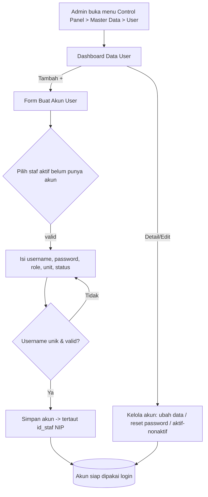

# PRD — Master Data User (New)

**Related Document:** PRD_Master_Data_User (1).docx; PRD Master Data Staff (A2); PRD Master Data Role (A18); PRD Login & Autentikasi
**Versi:** 1.0 - Draft awal

## 1. Overview / Brief Summary

Master Data User adalah modul pada cluster **Control Panel** yang mengelola **akun pengguna sistem (kredensial akses)** SIMRS. Modul ini menyimpan *bagaimana* seseorang masuk ke sistem: `username`, `password`, `role`, `unit`, dan `status_aktif` — berbeda dengan **Master Data Staf (A2)** yang menyimpan *siapa orangnya* (data kepegawaian).

Setiap akun user **wajib tertaut ke satu data staf** melalui `id_staf` (NIP), sehingga hak akses selalu dapat dipertanggungjawabkan ke pemiliknya (akuntabilitas). Tidak semua staf adalah pengguna sistem; modul ini menentukan staf mana yang diberi akses.

Fungsi inti (Phase 1): membuat akun user dari data staf, mengelola akun (ubah data, reset password, aktivasi/nonaktivasi), mengaitkan **Role (A18)** untuk hak akses, serta pencarian/filter/daftar akun.

> Konteks RS Tipe C & D: SDM IT terbatas, pengelolaan akun dipusatkan pada **admin**. Modul harus sederhana, minim langkah, dan aman secara default.

## 2. Background

Saat ini data kepegawaian dan data akses login **belum terpisah secara jelas**, sehingga:
- Rawan **duplikasi data** identitas pegawai pada beberapa tempat.
- Sulit **menonaktifkan akses** staf yang sudah resign/tidak aktif secara konsisten karena tidak ada tautan baku antara akun dan data staf.
- Hak akses **sulit dipantau** karena pengelolaan tidak terpusat.
- Secara proses bisnis, **tidak semua karyawan** adalah pengguna SIMRS, sehingga perlu mekanisme menentukan karyawan mana yang dibutuhkan sebagai pengguna sistem.

Dengan memisahkan tanggung jawab antara **Master Data Staf** (dikelola HR) dan **Master Data User** (dikelola admin/keamanan), pengelolaan akun menjadi **terpusat, aman, dan konsisten**. Penonaktifan staf cukup dilakukan pada `status_aktif`, dan akses sistemnya **otomatis terblokir** tanpa perlu menghapus akun (menjaga jejak audit & integritas data historis).

**Legend Phase** (dari dokumen sumber):

| Tanda | Phase |
|-------|-------|
| (P1) | Phase 1 |
| [**] | Phase 2 |
| [***] | Phase 3 |
| [****] | Phase 4 |

## 3. In Scope

### Scope Definition

| Phase | Scope / Area |
|-------|--------------|
| Phase 1 | Pembuatan akun user oleh admin yang **ditautkan ke data staf (NIP)**. |
| Phase 1 | Pengelolaan akun: ubah data, **reset password**, serta **aktivasi/non-aktivasi** akun. |
| Phase 1 | **Pengaitan Role** pada user untuk hak akses. |
| Phase 1 | Pencarian, filter, dan daftar (list) akun user. |
| Phase 2 | **Preview Hak Akses Role** [**]. |

### Out Scope

| No | Scope | Modul Penanggung Jawab |
|----|-------|------------------------|
| 1 | Pengelolaan data kepegawaian (identitas, jabatan, STR, dll). | Master Data Staf (A2) |
| 2 | Manajemen struktur organisasi dan jabatan. | Master Jabatan (A55) / Unit (A3) |
| 3 | Integrasi Single Sign-On (SSO) dengan pihak ketiga. | — |
| 4 | Audit log keamanan tingkat lanjut dan deteksi anomali. | — |
| 5 | Autentikasi & validasi login (cek kredensial benar + status user & staf aktif). | Login & Autentikasi |
| 6 | Definisi matriks hak akses per menu (CRUD per fitur). | Master Role (A18) / Akses Menu (A37) |

## 4. Goals and Metrics

### Goals
Menyediakan pengelolaan akun akses sistem yang **terpusat, aman, dan selalu tertaut ke data staf**, sehingga hak akses tiap pengguna terkontrol dan mudah diaudit.

### Metrics

| No | Metrik | Success Criteria |
|----|--------|------------------|
| 1 | Waktu pembuatan akun | < 2 menit per akun oleh admin. |
| 2 | Akurasi tautan akun–staf | 100% akun memiliki `id_staf` (NIP) yang valid. |
| 3 | Keamanan akses | 0 akun berstatus nonaktif yang berhasil login. |
| 4 | Adopsi | 100% staf yang membutuhkan akses memiliki akun aktif. |
| 5 | Keunikan username [ASUMSI] | 0 duplikasi `username` pada seluruh akun. |

## 5. Related Feature

| No | Code | Module | Feature | Relasi |
|----|------|--------|---------|--------|
| 1 | A2 | Master Data | **Staf** | Sumber data identitas; akun user wajib menautkan `id_staf` (NIP). |
| 2 | A18 | Master Data | **Role** | Sumber daftar role yang dikaitkan ke user untuk hak akses. |
| 3 | A3 | Master Data | **Unit** | Sumber `unit` (lookup) untuk konteks penempatan user. |
| 4 | A37 | Master Data | **Akses Menu** | [ASUMSI] Matriks menu yang diturunkan dari role. |
| 5 | A53 | Admin | **RBAC** | Penegakan hak akses berbasis role yang dipilih di modul ini. |
| 6 | — | Login & Autentikasi | **Login & Autentikasi** | Konsumen data akun: memvalidasi kredensial + status saat login. |

## 6. Business Process (As-Is / To-Be)

### A. As-Is (Kondisi Saat Ini)
- Data staf dan akun login **belum terpisah jelas**, sehingga rawan duplikasi data.
- Penonaktifan akses staf yang resign **tidak konsisten** karena tidak ada tautan baku antara akun dan data staf.
- Hak akses **sulit dipantau** karena tidak terpusat.

### B. To-Be (Kondisi yang Diharapkan)
- Akun user dikelola **terpusat** dan selalu **tertaut ke data staf** melalui `id_staf` (NIP).
- Status staf nonaktif **otomatis memblokir akses** tanpa perlu menghapus akun.
- Pengelolaan status user **hanya** dapat dilakukan oleh user dengan role *administrator/admin*.
- **Hanya admin** dapat mengatur hak akses (role) user.
- User pemilik akun **dapat mengelola password sendiri** [ASUMSI: melalui menu profil di luar modul ini].

> [ASUMSI — analogi BPMN] Mengikuti pola audit pada `g-emr-patient-identity` ("Catat audit log: User, Timestamp, Pasien yang diakses"), setiap aksi create/update/reset/aktivasi akun sebaiknya mencatat **audit log dasar** (siapa, kapan, aksi). Audit lanjutan = Out Scope.

## 7. Main Flow / Mindmap

**Alur utama akses sistem berdasarkan dua master data (Staf + User):**

1. Admin mendaftarkan staf pada **Master Data Staf (A2)**.
2. Admin membuat **akun user** dan menautkannya ke `id_staf` (NIP) staf aktif yang belum punya akun.
3. Admin mengisi `username`, `password` awal, `role`, dan `unit`, lalu menyetel `status_aktif`.
4. User melakukan **login** dengan `username` & `password`.
5. Sistem memvalidasi kredensial **serta status user & staf** (keduanya harus aktif) — *di modul Login & Autentikasi*.
6. Sistem memuat **profil dari Master Data Staf** dan **role dari Master Data User**.
7. User memperoleh **akses sistem sesuai role dan hak aksesnya**.

**Sub-alur pengelolaan (dalam modul ini):**
- *Cari/Filter* → Dashboard menampilkan daftar akun → pilih akun → **Detail / Edit / Reset Password / Aktif-Nonaktif**.
- *Tambah* → form Buat Akun → pilih staf (lookup, hanya aktif & belum punya akun) → isi kredensial & role → simpan.

## 8. Business Rules

| ID | Business Rule | Sumber |
|----|---------------|--------|
| BR-001 | Setiap akun user **wajib** tertaut ke tepat satu `id_staf` (NIP) yang **valid** di Master Data Staf (A2). | Dokumen sumber |
| BR-002 | Satu staf **hanya boleh memiliki satu akun**. Staf yang sudah punya akun **tidak dapat** dibuatkan akun lagi. | Dokumen sumber (Buat Akun) |
| BR-003 | Hanya **staf berstatus aktif** yang dapat dipilih saat pembuatan akun. | Dokumen sumber |
| BR-004 | `username` harus **unik** di seluruh sistem (case-insensitive [ASUMSI]). | Dokumen sumber |
| BR-005 | Pembuatan akun, pengaturan role, dan pengelolaan status user **hanya** boleh dilakukan oleh role *administrator/admin*. | To-Be |
| BR-006 | Akun berstatus **nonaktif tidak boleh berhasil login** (penegakan di modul Login). Penonaktifan **tidak menghapus** akun. | Goals/Metrics #3, To-Be |
| BR-007 | Jika `status_aktif` staf di Master Data Staf menjadi nonaktif, maka akses akun terkait **otomatis terblokir**. | To-Be |
| BR-008 | `password` awal harus memenuhi kebijakan minimal keamanan. [PERLU KONFIRMASI: panjang minimal & kompleksitas, mis. min 8 char, kombinasi huruf+angka]. | [PERLU KONFIRMASI] |
| BR-009 | `password` **tidak pernah** ditampilkan/diekspor dalam bentuk plaintext; disimpan ter-hash. | [ASUMSI keamanan] |
| BR-010 | User pemilik akun dapat mengubah password sendiri; admin dapat melakukan **reset password** [**ke nilai sementara]. | To-Be / Dashboard |
| BR-011 | Satu user dapat memiliki **satu atau lebih role**. [PERLU KONFIRMASI: single-role vs multi-role]. | [PERLU KONFIRMASI] |

## 9. User Stories

Tingkat prioritas: **P0** Critical/MVP · **P1** Must Have · **P2** Should Have · **P3** Low · **P4** Enhancement.

| ID | Phase | Fitur | User Story | P | Acceptance Criteria (ringkas) |
|----|-------|-------|-----------|---|-------------------------------|
| US-001 | 1 | Dashboard Master Data User | Sebagai **admin**, saya ingin melihat daftar staf yang telah dibuatkan akun user agar dapat memantau & mengelola akun. | P0 | Menu Master Data → User menampilkan tabel (NIP, Nama Lengkap, Username, Role, Status); default sort Username A→Z (dapat dibalik); search by NIP/Nama/Username; pagination 10/20/50/100; tombol Detail & Reset Password[**] per baris; tombol ➕ tambah. |
| US-002 | 1 | Buat Akun User | Sebagai **admin**, saya ingin membuat akun user yang ditautkan ke data staf agar staf dapat mengakses sistem. | P0 | Pilih staf aktif yang belum punya akun; isi username, password awal, role, unit, status; akun tersimpan dengan NIP valid; username unik tervalidasi; staf yang sudah punya akun tidak dapat dibuatkan akun lagi (BR-002). |
| US-003 | 1 | Kelola Status User | Sebagai **admin**, saya ingin mengaktifkan/menonaktifkan akun user agar akses staf dapat dikontrol tanpa menghapus akun. | P0 | Toggle status_aktif; akun nonaktif tidak dapat login (BR-006); perubahan tercatat. |
| US-004 | 1 | Ubah Data Akun | Sebagai **admin**, saya ingin mengubah data akun (role, unit, status) agar akun selalu sesuai kondisi terkini. | P0 | Field NIP/Nama (dari staf) readonly; role/unit/status dapat diubah; username [PERLU KONFIRMASI dapat diubah?]. |
| US-005 | 1 | Reset Password | Sebagai **admin**, saya ingin mereset password user agar user yang lupa password dapat kembali mengakses sistem. | P0 | Tombol Reset Password menghasilkan password sementara/baru; password lama tidak ditampilkan; aksi tercatat. |
| US-006 | 1 | Kelola Password Sendiri | Sebagai **user pemilik akun**, saya ingin mengubah password saya sendiri agar kredensial saya aman. | P1 | [ASUMSI] Melalui menu profil; verifikasi password lama → set password baru sesuai kebijakan. |
| US-007 | 2 | Preview Hak Akses Role | Sebagai **admin**, saya ingin melihat preview hak akses dari role yang dipilih agar saya yakin penetapan akses sudah benar. | P2 [**] | Saat memilih role, sistem menampilkan ringkasan menu/aksi yang diizinkan. |

## 10. Functional Requirements

| ID | Functional Requirement | Trace |
|----|------------------------|-------|
| FR-001 | Sistem menampilkan **Dashboard Data User** berupa tabel kolom: NIP, Nama Lengkap, Username, Role, Status. | US-001 |
| FR-002 | Sistem mengurutkan data default berdasarkan **Username Ascending (A–Z)** dan mengizinkan toggle Ascending/Descending. | US-001 |
| FR-003 | Sistem menyediakan **pencarian** berdasarkan NIP, Nama Lengkap, atau Username. | US-001 |
| FR-004 | Sistem menyediakan **pagination** dengan opsi 10/20/50/100 data per halaman. | US-001 |
| FR-005 | Setiap baris menyediakan aksi **Detail** dan **Reset Password** [**]; Nama Lengkap dapat *direct* ke Detail Staf [**]. | US-001, US-005 |
| FR-006 | Sistem menyediakan tombol ➕ (tooltip "Tambah User") yang membuka **form Buat Akun User** (overlay). | US-002 |
| FR-007 | Form Buat Akun menyediakan **lookup staf** yang hanya menampilkan staf **aktif & belum punya akun** (BR-002, BR-003). | US-002 |
| FR-008 | Saat staf dipilih, sistem **auto-fill** NIP & Nama Lengkap (readonly) dari Master Data Staf (A2). | US-002 |
| FR-009 | Sistem **memvalidasi keunikan** `username` sebelum simpan dan menolak duplikat (BR-004). | US-002 |
| FR-010 | Sistem menyimpan akun dengan menautkan `id_staf` (NIP) yang valid (BR-001). | US-002 |
| FR-011 | Sistem mengizinkan admin **mengubah** role, unit, dan status pada akun yang ada. | US-004 |
| FR-012 | Sistem mengizinkan admin **mengaktifkan/menonaktifkan** akun (status_aktif) tanpa menghapus data (BR-006). | US-003 |
| FR-013 | Sistem menyediakan fungsi **Reset Password** oleh admin; password disimpan ter-hash, tidak pernah ditampilkan plaintext (BR-009). | US-005 |
| FR-014 | Akses ke seluruh aksi modul ini **dibatasi role admin** (BR-005). | US-003, US-004 |
| FR-015 | [ASUMSI] Sistem mencatat **audit log dasar** (user, timestamp, aksi) untuk create/update/reset/aktivasi — analogi `g-emr-patient-identity`. | BR-007 |
| FR-016 | [**] Sistem menampilkan **preview hak akses** dari role yang dipilih (Phase 2). | US-007 |

## 11. Data Requirements (Spesifikasi Field)

### 11.1 Layar INPUT — Form Buat / Ubah Akun User (FR-006 s/d FR-011)

| Field | Label | Tipe | Wajib | Validasi/Format | Sumber/Default | Catatan |
|-------|-------|------|-------|-----------------|----------------|---------|
| id_staf | Staf (NIP) | lookup | Ya | harus staf **aktif & belum punya akun**; NIP unik 18 digit | lookup Master Staf (A2) | BR-001, BR-002, BR-003. Konsisten dgn definisi `nip` di A2 (18 digit unik). |
| nip | NIP | text | Ya | 18 digit, unik | auto dari staf (readonly) | Tampil setelah staf dipilih. |
| nama_lengkap | Nama Lengkap | text | Ya | maks 100 char | auto dari staf (readonly) | Diambil dari Master Staf (A2). |
| username | Username | text | Ya | **unik**, 4–30 char [ASUMSI], tanpa spasi | manual | BR-004. [PERLU KONFIRMASI: boleh diubah setelah dibuat?] |
| password | Password | password | Ya (saat buat) | kebijakan keamanan [PERLU KONFIRMASI: min 8 char, huruf+angka] | manual | Disimpan ter-hash (BR-009). Tidak tampil saat edit. |
| role | Role | dropdown(lookup) | Ya | dari Master Role (A18) | lookup A18 | [PERLU KONFIRMASI: single vs multi-role] (BR-011). |
| unit | Unit | dropdown(lookup) | Ya | dari Master Unit (A3) | lookup A3 | Konsisten dgn field kanonik `unit`. |
| status_aktif | Status | boolean | Ya | aktif / nonaktif | default **aktif** | Konsisten dgn field kanonik `status_aktif`. |
| keterangan | Keterangan | text | Tidak | maks 255 char | manual | [ASUMSI] Konsisten dgn field kanonik `keterangan`. |

### 11.2 Layar INPUT — Reset Password (FR-013)

| Field | Label | Tipe | Wajib | Validasi/Format | Sumber/Default | Catatan |
|-------|-------|------|-------|-----------------|----------------|---------|
| password_baru | Password Baru/Sementara | password | Ya | kebijakan keamanan (lihat BR-008) | manual / auto-generate | [PERLU KONFIRMASI: auto-generate vs input admin]. |
| konfirmasi_password | Konfirmasi Password | password | Ya | harus sama dengan password_baru | manual | Hanya jika input manual. |
| paksa_ganti_login | Wajib ganti saat login berikutnya | boolean | Tidak | true/false | default true [ASUMSI] | Praktik keamanan. |

### 11.3 Layar TAMPIL — Dashboard / List Data User (FR-001 s/d FR-004)

| Kolom | Sumber Data | Format Tampilan | Filter/Sort | Catatan |
|-------|-------------|-----------------|-------------|---------|
| NIP | master_user.id_staf → master_staf.nip | text (18 digit) | search | |
| Nama Lengkap | master_staf.nama | text (link → Detail Staf [**]) | search, sort | |
| Username | master_user.username | text | **default sort A→Z**, search, toggle asc/desc | FR-002 |
| Role | master_user.role → master_role.nama | text/badge | filter [ASUMSI] | Multi-role tampil chip jika BR-011=multi. |
| Status | master_user.status_aktif | badge (Aktif=hijau / Nonaktif=abu) | filter [ASUMSI] | |
| (aksi) | — | tombol Detail, Reset Password[**] | – | FR-005 |

### 11.4 Layar TAMPIL — Detail Akun User

| Kolom | Sumber Data | Format Tampilan | Filter/Sort | Catatan |
|-------|-------------|-----------------|-------------|---------|
| NIP / Nama Lengkap | master_staf | text | – | dari Staf (A2) |
| Username | master_user.username | text | – | |
| Role | master_user.role | badge | – | |
| Unit | master_user.unit | text | – | dari A3 |
| Status | master_user.status_aktif | badge | – | |
| Audit ringkas [ASUMSI] | audit_log | tanggal dibuat/diubah + oleh | – | FR-015 |

## 12. Non-Functional Requirements

| ID | Kategori | Requirement |
|----|----------|-------------|
| NFR-001 | Keamanan | Password disimpan **ter-hash** (mis. bcrypt/argon2) [ASUMSI], tidak pernah ditampilkan/diekspor plaintext. |
| NFR-002 | Keamanan/Otorisasi | Seluruh aksi modul dibatasi role **admin** (RBAC, A53). |
| NFR-003 | Kinerja | Dashboard memuat & menampilkan ≤ 100 baris dalam < 2 detik [ASUMSI] pada infrastruktur RS tipe C/D. |
| NFR-004 | Usability | Pembuatan 1 akun ≤ 2 menit (selaras Metric #1); form sederhana, minim langkah. |
| NFR-005 | Auditability | Aksi create/update/reset/aktivasi tercatat (user, timestamp, aksi) — audit dasar. |
| NFR-006 | Ketersediaan | [ASUMSI] Modul bersifat administratif; tidak butuh mode offline. Operasi normal saat internet tidak stabil tetap berjalan karena data lokal SIMRS. |
| NFR-007 | Integritas | Penghapusan akun di-*soft delete*/nonaktif, bukan hard delete, untuk menjaga jejak audit (BR-006). [PERLU KONFIRMASI: apakah hard delete diizinkan?]. |
| NFR-008 | Konsistensi | Field `nip`, `unit`, `status_aktif`, `keterangan` mengikuti definisi kanonik lintas-PRD. |

## 13. Integrasi Eksternal

Modul Master Data User bersifat **internal control panel** dan **tidak memerlukan integrasi eksternal** (BPJS/SATUSEHAT/Disdukcapil) secara langsung.

**Integrasi internal (antar-modul):**

| Tujuan | Modul | Arah | Keterangan |
|--------|-------|------|------------|
| Sumber identitas akun | Master Data Staf (A2) | baca | `id_staf`/NIP, nama, status staf; akun otomatis terblokir bila staf nonaktif (BR-007). |
| Sumber role/hak akses | Master Data Role (A18) | baca | Daftar role yang dikaitkan ke user. |
| Sumber unit | Master Data Unit (A3) | baca | Lookup `unit`. |
| Penegakan hak akses | RBAC (A53) / Akses Menu (A37) | baca | Role → matriks menu yang diizinkan. |
| Konsumen kredensial | Login & Autentikasi | baca | Validasi username/password + status user & staf saat login (Out Scope modul ini). |

> [PERLU KONFIRMASI] Apakah ada kebutuhan integrasi **SATUSEHAT** untuk identitas tenaga medis (mis. IHS Number) pada level akun? Saat ini diasumsikan ditangani di Master Data Staf (A2), bukan di modul User.

## Asumsi
- [ASUMSI] Modul tidak punya BPMN sendiri; alur As-Is/To-Be & audit log diturunkan dari analogi proses BPMN terkait (terutama g-emr-patient-identity untuk pola audit).
- [ASUMSI] Password disimpan ter-hash (bcrypt/argon2) dan tidak pernah ditampilkan plaintext.
- [ASUMSI] `username` 4–30 karakter, unik case-insensitive, tanpa spasi.
- [ASUMSI] Penghapusan akun dilakukan via nonaktivasi (soft delete) demi menjaga jejak audit.
- [ASUMSI] Field `nip` mengikuti definisi A2 (18 digit, unik); `unit`, `status_aktif`, `keterangan` mengikuti definisi kanonik lintas-PRD.
- [ASUMSI] User pemilik akun mengganti password sendiri melalui menu profil di luar modul ini.
- [ASUMSI] Modul administratif, tidak butuh mode offline; berjalan dari data lokal SIMRS.
- [ASUMSI] Audit log dasar (user, timestamp, aksi) dicatat untuk setiap perubahan akun.

## Pertanyaan Terbuka
- Kebijakan password (panjang minimal & kompleksitas) untuk pembuatan akun dan reset password — BR-008.
- Apakah satu user dapat memiliki lebih dari satu role (multi-role) atau hanya satu (single-role)? — BR-011.
- Apakah `username` boleh diubah setelah akun dibuat?
- Reset Password: password baru di-auto-generate sistem atau diinput manual oleh admin?
- Apakah hard delete akun diizinkan, atau hanya soft delete/nonaktif? — NFR-007.
- Apakah penonaktifan staf di A2 benar-benar memicu pemblokiran akses secara real-time atau saat login berikutnya? — BR-007.
- Apakah perlu identitas SATUSEHAT (IHS Number) pada level akun user atau cukup di Master Data Staf?