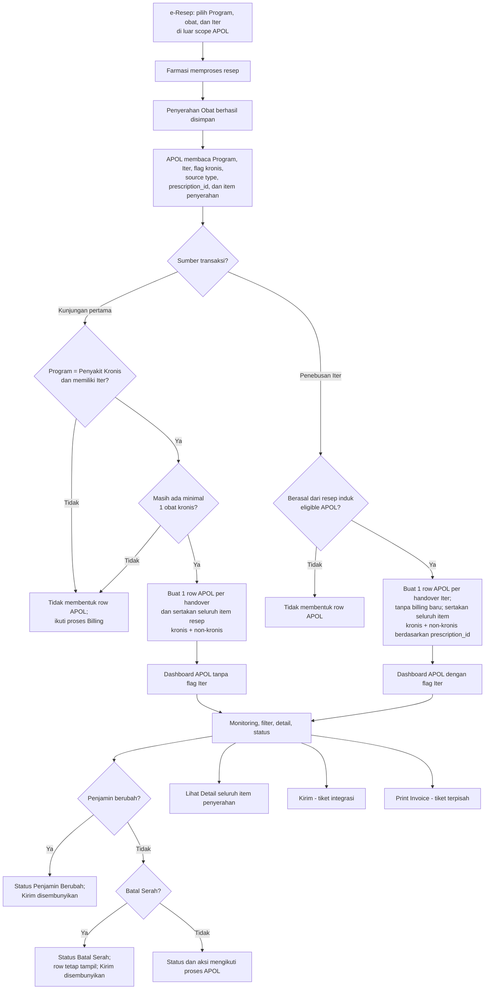

# PRD — Apotek Online BPJS (APOL)

**Related Document:** `Bispro Apotek Online.pdf`; referensi tampilan Neurovi v1 `image(22).png` dan `image(23).png`; `TEMPLATE-PRD-Generator-Neurovi-v2.md`  
**Dokumen ID:** `PRD-FAR-APOL-v2.0` · **Versi:** 1.3 (Draft)  
**Tanggal Disusun:** 20 Juli 2026 · **Penyusun:** Team Product — Tamtech International  
**Approver:** `[PERLU KONFIRMASI]` · **Reviewer Teknis:** `[PERLU KONFIRMASI — Lead FE/BE/QA/SA/Infra]`  
**Status:** Untuk Direview · **Target Release:** `[PERLU KONFIRMASI]`

## 1. Overview / Brief Summary

Apotek Online BPJS (APOL) adalah fitur pada modul Farmasi yang digunakan untuk menampilkan, memantau, dan menyiapkan pengiriman transaksi penyerahan obat pasien BPJS yang memenuhi kriteria APOL. Fitur ini menghilangkan kebutuhan input ulang pada aplikasi eksternal dan menjadikan SIMRS sebagai sumber data operasional resep, penyerahan obat, pasien, penjamin, serta item obat yang benar-benar diserahkan.

Dashboard APOL merupakan **consumer dari proses e-Resep dan Farmasi**, bukan tempat untuk memilih atau memperbaiki Program Resep. Pemilihan Program Resep—Tidak Ada Program Khusus, Penyakit Kronis, atau PRB—beserta aturan wajib pilih berada pada scope pelayanan e-Resep. Koreksi Program Resep oleh petugas farmasi berada pada scope modul Farmasi. APOL hanya membaca hasil akhirnya sebagai data sumber.

Kandidat transaksi APOL berasal dari resep dengan **Program Resep = Penyakit Kronis**, memiliki minimal satu obat kronis, dan memiliki Iter. Data baru masuk ke Dashboard APOL setelah Penyerahan Obat berhasil disimpan. Kelayakan transaksi ditentukan pada level resep/penyerahan, sedangkan isi detail APOL mencakup **seluruh item yang diserahkan pada ID resep tersebut**, baik obat kronis maupun non-kronis.

Pada kunjungan pertama yang masih memiliki billing aktif, bila seluruh obat kronis diubah menjadi non-kronis sebelum penyerahan, transaksi tidak membentuk row APOL dan item tetap mengikuti proses Billing. Pada penebusan Iter 1, Iter 2, dan seterusnya, transaksi tidak membentuk billing baru; apabila penebusan berasal dari resep induk yang memenuhi kriteria APOL, seluruh obat kronis dan non-kronis yang diserahkan pada ID resep Iter tersebut tetap masuk ke Dashboard APOL.

Setiap kejadian penyerahan menghasilkan satu baris transaksi APOL yang berdiri sendiri. Resep pada kunjungan pertama ditampilkan tanpa flag **Iter**, sedangkan penyerahan resep kedua, ketiga, atau penebusan yang berasal dari Dashboard Iter ditampilkan dengan flag **Iter**.

Dashboard APOL diakses melalui menu terpisah **Farmasi > Apotek Online BPJS**. Ketika pertama dibuka, filter Tanggal Penyerahan otomatis menggunakan tanggal hari ini sebagai tanggal mulai dan tanggal selesai. Dashboard menyediakan pencarian pasien, filter status, daftar transaksi, detail obat, penanda perubahan obat, tombol kirim, serta aksi lihat detail dan print invoice. Status yang tersedia adalah **Gagal, Belum Dikirim, Berhasil, Dikirim Sebagian, Penjamin Berubah, Proses Dikirim, Tidak Dapat Dikirim,** dan **Batal Serah**.

PRD ini mendefinisikan perilaku internal untuk status **Penjamin Berubah** dan **Batal Serah**. Definisi trigger, transisi, validasi, dan respons untuk status lainnya dikelola pada tiket/PRD integrasi BPJS APOL terpisah. Penanda perubahan obat menyala apabila data item obat berbeda dari snapshot awal pada atribut selain Harga Total RS dan Harga Total Plafon.

## 2. Background

### 2.1 Kondisi Existing

- Pemilihan Program Resep dan penentuan Iter dilakukan pada e-Resep, sedangkan Dashboard APOL hanya menerima hasil transaksi setelah penyerahan obat.
- Pada implementasi sebelumnya, batas ownership antara e-Resep, Farmasi, Billing, Iter, dan Dashboard APOL belum dinyatakan secara eksplisit.
- Detail v1 menampilkan section Obat Dibawa Pulang dan Resep Awal, sehingga layar lebih padat dari kebutuhan operasional.
- Flag Iter pada daftar transaksi belum secara tegas dibedakan antara resep kunjungan pertama dan penebusan Iter berikutnya.
- Perubahan obat setelah transaksi masuk Dashboard APOL perlu ditandai agar petugas mengetahui bahwa data pernah berubah.
- Belum terdapat aturan eksplisit apakah obat non-kronis dalam resep yang sama ikut ditampilkan pada APOL.

### 2.2 Pain Point

- **Ownership:** aturan Program Resep berisiko tercampur ke scope Dashboard APOL, padahal implementasinya berada pada e-Resep dan Farmasi.
- **Kelayakan transaksi:** belum tegas bahwa syarat masuk APOL adalah kombinasi Program Penyakit Kronis, obat kronis, dan Iter pada resep sumber.
- **Cakupan item:** obat non-kronis dalam resep eligible dapat terlewat bila filtering dilakukan per item, padahal detail harus mengikuti seluruh item yang diserahkan berdasarkan ID resep.
- **Kunjungan pertama:** perubahan seluruh item menjadi non-kronis harus mengembalikan transaksi ke jalur Billing dan tidak membentuk row APOL.
- **Penebusan Iter:** tidak terdapat billing baru, sehingga seluruh item kronis dan non-kronis pada resep Iter eligible harus tetap dapat diproses melalui APOL.
- **Auditabilitas:** perubahan data obat setelah baris APOL terbentuk perlu dapat dikenali tanpa menghilangkan data historis awal.

### 2.3 Strategi Pengembangan

- **Fase 1 / MVP APOL:** konsumsi data resep dan penyerahan, evaluasi kelayakan row APOL, pembentukan row per penyerahan, aturan cakupan seluruh item berdasarkan ID resep, dashboard, detail, flag Iter, penanda perubahan obat, serta entry point aksi kirim dan print invoice.
- **Scope e-Resep terpisah:** pilihan Program Resep, kewajiban pemilihan, urutan input, dan validasi penyimpanan resep.
- **Scope Farmasi terpisah:** koreksi administratif Program Resep, perubahan item obat, validasi duplikasi obat, serta Audit Trail perubahan pada proses farmasi.
- **Tiket integrasi terpisah:** kontrak API BPJS APOL, validasi pengiriman, definisi dan transisi status Gagal, Belum Dikirim, Berhasil, Dikirim Sebagian, Proses Dikirim, dan Tidak Dapat Dikirim, retry, idempotency pengiriman, error handling, serta audit request/response.
- **Tiket print terpisah:** layout, data source, preview, download, dan hasil cetak Invoice APOL.

## 3. In Scope

### 3.1 Scope Definition — Fase 1 / MVP

1. Entry point melalui modul **Farmasi** dengan menu terpisah **Apotek Online BPJS**. Menu APOL tidak ditempatkan sebagai tab atau sub-menu di dalam **Iter Obat**.
2. Konsumsi data hasil e-Resep dan Farmasi yang mencakup Program Resep, informasi Iter, flag kronis item, ID resep, item yang diserahkan, serta referensi resep induk/Iter.
3. Evaluasi kelayakan transaksi APOL pada saat Penyerahan Obat berhasil disimpan, dengan prasyarat resep sumber:
   - Program Resep = Penyakit Kronis.
   - Memiliki minimal satu obat kronis sesuai Master Data Obat.
   - Memiliki Iter.
4. Pada kunjungan pertama, bila seluruh obat kronis telah diubah menjadi non-kronis sebelum penyerahan, sistem tidak membentuk row APOL dan transaksi tetap mengikuti Billing yang masih aktif.
5. Pada penebusan Iter 1, Iter 2, dan seterusnya, kelayakan APOL mengikuti resep induk yang telah memenuhi prasyarat. Karena tidak terbentuk billing baru, seluruh item yang diserahkan pada ID resep Iter—baik kronis maupun non-kronis—masuk ke detail APOL.
6. Untuk transaksi yang eligible, cakupan item APOL menggunakan seluruh item yang diserahkan dalam `prescription_id`/`handover_id` yang sama; APOL tidak membuang obat non-kronis secara item-level.
7. Pembentukan satu baris Dashboard APOL setelah satu transaksi Penyerahan Obat eligible berhasil disimpan.
8. Pembentukan baris terpisah untuk resep kunjungan pertama, Iter 1, Iter 2, dan penebusan Iter berikutnya sesuai jumlah Iter.
9. Dashboard APOL dengan:
   - Filter tanggal penyerahan berbentuk range.
   - Default tanggal mulai dan tanggal selesai adalah tanggal hari ini ketika dashboard pertama dibuka atau filter di-reset.
   - Search berdasarkan Nama Pasien atau No. RM.
   - Filter status.
   - Sort default Tanggal Penyerahan terbaru.
   - Pagination.
10. Kolom dashboard: No., Tanggal Penyerahan, No. Resep + flag Iter, No. SEP, No. RM, Nama, Dokter, Unit, Status, tombol Kirim, dan menu three-dots.
11. Menu three-dots berisi Lihat Detail dan Print Invoice.
12. Detail transaksi menampilkan header pasien: No. Resep + flag Iter, No. SEP, No. RM, Nama, dan Diresepkan oleh.
13. Detail memiliki dua tab: Obat Dibawa Pulang dan Obat Berhasil Dikirim.
14. Tab Obat Dibawa Pulang hanya memiliki satu section dan tidak menampilkan section Resep Awal.
15. Detail Obat Dibawa Pulang menampilkan seluruh item yang diserahkan pada transaksi tersebut, termasuk kombinasi obat kronis dan non-kronis.
16. Penanda **Terdapat Perubahan Obat** apabila satu atau lebih atribut item obat berbeda dari snapshot saat transaksi masuk Dashboard APOL. Seluruh atribut item dibandingkan, termasuk penambahan/penghapusan item atau komponen racik, kecuali **Harga Total RS** dan **Harga Total Plafon**. Perubahan status integrasi juga tidak dianggap sebagai perubahan obat.
17. Tombol Kirim pada level transaksi dan/atau item sebagai entry point proses pengiriman.
18. Penyimpanan snapshot dan metadata pembentuk transaksi APOL untuk kebutuhan audit serta pendeteksian perubahan.
19. Katalog status dashboard: Gagal, Belum Dikirim, Berhasil, Dikirim Sebagian, Penjamin Berubah, Proses Dikirim, Tidak Dapat Dikirim, dan Batal Serah.
20. Deteksi perubahan tipe penjamin setelah row APOL terbentuk dan perubahan status menjadi **Penjamin Berubah**.
21. Deteksi pembatalan Penyerahan Obat setelah row APOL terbentuk dan perubahan status menjadi **Batal Serah**.
22. Penyembunyian tombol Kirim pada transaksi berstatus Penjamin Berubah dan Batal Serah.
23. Row berstatus Batal Serah tetap ditampilkan pada dashboard untuk kebutuhan monitoring dan audit.

### 3.2 Out of Scope

1. Pemilihan Program Resep pada pelayanan e-Resep, termasuk pilihan Tidak Ada Program Khusus, Penyakit Kronis, dan PRB.
2. Aturan Program Resep wajib dipilih, default value, urutan input resep, serta validasi saat menyimpan e-Resep.
3. Hard validation yang melarang obat kronis dipilih ketika Program Resep bukan Penyakit Kronis. APOL tidak mengatur kombinasi obat dan Program pada saat peresepan.
4. Koreksi Program Resep oleh petugas farmasi beserta permission, alasan perubahan, dan Audit Trail koreksi Program.
5. Perubahan data medis resep di modul Farmasi, termasuk jenis obat, dosis, frekuensi, quantity, dan signa.
6. Validasi duplikasi obat kronis berdasarkan jarak tanggal penyerahan; aturan ini berada pada proses Farmasi/Iter.
7. Detail kontrak request/response API BPJS Apotek Online.
8. Definisi trigger, transisi, validasi, dan aksi untuk status **Gagal, Belum Dikirim, Berhasil, Dikirim Sebagian, Proses Dikirim,** dan **Tidak Dapat Dikirim**.
9. Validasi kelengkapan payload sebelum kirim, retry, reconciliation, anti-double-send, dan error mapping BPJS.
10. Perubahan status transaksi yang dihasilkan oleh proses pengiriman ke BPJS.
11. Layout, preview, download, dan hasil cetak Invoice APOL.
12. Mekanisme pembatalan transaksi yang telah berhasil terkirim ke BPJS.
13. Pengaturan final hak akses per role untuk aksi kirim, retry, dan print.
14. Fitur Fase 2: banner restriksi obat, informasi plafon e-Klaim pada e-Resep, validasi restriksi Fornas, dan blocking obat non-Fornas.

## 4. Goals & Metrics

| Goal | Metric Keberhasilan | Target |
|------|----------------------|--------|
| Memastikan transaksi yang memenuhi kriteria membentuk row APOL | Penyerahan eligible berdasarkan Program Penyakit Kronis + obat kronis + Iter yang membentuk row APOL | 100% |
| Mencegah transaksi non-eligible masuk APOL pada kunjungan pertama | Penyerahan awal tanpa obat kronis aktif yang membentuk row APOL | 0 kasus |
| Menampilkan seluruh item resep eligible | Obat kronis dan non-kronis yang diserahkan pada ID resep eligible tampil lengkap di detail | 100% |
| Mencegah duplikasi baris APOL | Baris ganda untuk `handover_id` yang sama | 0 kasus |
| Membedakan resep awal dan Iter secara konsisten | Akurasi flag Iter berdasarkan sumber penebusan | 100% |
| Menampilkan perubahan obat setelah baris terbentuk | Perubahan atribut item selain Harga Total RS dan Harga Total Plafon menghasilkan penanda; perubahan harga saja tidak menghasilkan penanda | 100% |
| Mempercepat akses data operasional | Waktu muat Dashboard APOL | < 3 detik pada beban normal |
| Menjaga proses penyerahan tetap cepat | Waktu pembentukan baris APOL setelah penyerahan | < 2 detik |
| Memudahkan pencarian transaksi | Filter/search menghasilkan data sesuai parameter | 100% pada test case |
| Mencegah pengiriman transaksi yang tidak lagi eligible | Transaksi Penjamin Berubah atau Batal Serah yang masih menampilkan tombol Kirim | 0 kasus |

> Tingkat keberhasilan bridging dan durasi pengiriman BPJS tidak menjadi metrik acceptance PRD ini karena dikelola pada tiket integrasi terpisah.

## 5. Related Feature

| Fitur / Modul | Relasi dengan APOL |
|---------------|--------------------|
| e-Resep | Sumber Program Resep, informasi Iter, dokter peresep, item obat, dosis, jumlah, dan signa. Pemilihan serta validasi Program berada di scope e-Resep. |
| Master Data Obat | Sumber flag kronis/non-kronis, jenis sediaan, status Fornas, dan metadata obat. |
| Proses Farmasi | Sumber item obat terbaru yang akan diserahkan. Koreksi Program Resep dan perubahan medis berada di scope Farmasi. |
| Penyerahan Obat | Event utama evaluasi kelayakan dan pembentukan satu baris baru pada Dashboard APOL, serta sumber event Batal Serah. |
| Billing | Pada kunjungan pertama, transaksi yang tidak lagi memiliki obat kronis tetap mengikuti billing aktif dan tidak membentuk row APOL. |
| Pelayanan & Billing | Sumber perubahan tipe penjamin setelah transaksi APOL terbentuk. |
| Dashboard Iter Obat | Sumber penebusan Iter 1, Iter 2, dan Iter berikutnya serta referensi resep induk yang eligible. |
| BPJS Apotek Online | Tujuan pengiriman transaksi; implementasi teknis pada tiket terpisah. |
| Invoice APOL | Output cetak transaksi; implementasi pada tiket terpisah. |
| Audit Trail | Menyimpan pembentukan row, perubahan data obat, perubahan penjamin, Batal Serah, dan aktivitas pengguna pada APOL. |

## 6. Stakeholder & Persona

| Persona | Tipe | Peran terhadap Fitur |
|---------|------|----------------------|
| Petugas Farmasi | Primary | Memantau daftar APOL, mencari transaksi, melihat seluruh item yang diserahkan, mengetahui perubahan obat, dan memulai aksi kirim. |
| Apoteker / Supervisor Farmasi | Primary/Secondary | Mengawasi transaksi APOL dan memverifikasi kesesuaian data sebelum pengiriman. |
| Dokter | Upstream | Membuat e-Resep dan menentukan Program Resep serta Iter pada fitur e-Resep di luar scope APOL. |
| Petugas BPJS / Casemix | Secondary | Memantau hasil integrasi atau klaim sesuai hak akses pada tiket integrasi. |
| Administrator Sistem | Secondary | Mengatur hak akses dan meninjau Audit Trail APOL. |
| Tim Integrasi / Support | Tersier | Menelusuri masalah pengiriman menggunakan data transaksi dan log integrasi. |

## 7. Business Process (As-Is / To-Be)

### 7.1 As-Is — Neurovi v1

1. Dokter membuat e-Resep dan memilih Program Resep.
2. Farmasi memproses dan menyerahkan obat.
3. Petugas melakukan pengecekan manual resep yang perlu dikirim ke APOL.
4. Dashboard menampilkan transaksi, tetapi batas ownership Program Resep, kelayakan row, dan cakupan item kronis/non-kronis belum dinyatakan secara eksplisit.
5. Detail menampilkan section Obat Dibawa Pulang dan Resep Awal.
6. Petugas melakukan aksi kirim dan memantau status pengiriman.

### 7.2 To-Be — Neurovi v2

1. Pada fitur e-Resep di luar scope APOL, dokter memilih Program Resep, memilih obat, dan menentukan Iter sesuai kebutuhan pelayanan.
2. Obat ber-flag kronis tetap boleh dipilih walaupun Program Resep bukan Penyakit Kronis. APOL tidak melakukan hard validation atau menolak penyimpanan e-Resep atas kombinasi tersebut.
3. Farmasi memproses resep. Perbaikan Program Resep dan perubahan item dilakukan pada scope Farmasi/e-Resep, bukan pada Dashboard APOL.
4. Petugas melakukan Penyerahan Obat.
5. Setelah penyerahan berhasil disimpan, APOL membaca snapshot Program Resep, Iter, flag kronis, sumber transaksi, ID resep, dan seluruh item yang diserahkan.
6. Sistem menentukan jenis transaksi: kunjungan pertama atau penebusan Iter.
7. Untuk kunjungan pertama, row APOL hanya dibentuk apabila Program Resep = Penyakit Kronis, resep memiliki Iter, dan pada saat penyerahan masih terdapat minimal satu obat kronis.
8. Jika pada kunjungan pertama seluruh obat kronis telah diubah menjadi non-kronis, sistem tidak membentuk row APOL; item tetap diproses pada Billing yang masih aktif.
9. Jika kunjungan pertama eligible dan terdiri dari obat kronis serta non-kronis, sistem membentuk satu row APOL dan memasukkan seluruh item yang diserahkan pada ID resep tersebut.
10. Untuk Iter 1, Iter 2, dan seterusnya, sistem memastikan transaksi berasal dari resep induk yang memenuhi kriteria APOL. Karena tidak terbentuk billing baru, sistem membentuk row APOL dan memasukkan seluruh item kronis maupun non-kronis berdasarkan ID resep Iter yang diserahkan.
11. Satu `handover_id` hanya menghasilkan satu row APOL.
12. Resep kunjungan pertama tidak menampilkan flag Iter; transaksi dari Dashboard Iter menampilkan flag Iter.
13. Petugas membuka menu **Farmasi > Apotek Online BPJS**.
14. Saat dashboard pertama dibuka, sistem mengisi Tanggal Mulai dan Tanggal Selesai dengan tanggal hari ini serta mengurutkan Tanggal Penyerahan terbaru.
15. Petugas dapat memfilter tanggal, mencari Nama/No. RM, memilih status, membuka detail, dan melihat seluruh item penyerahan.
16. Jika farmasi mengedit item obat setelah transaksi masuk Dashboard APOL, sistem membandingkan seluruh atribut item terhadap snapshot awal, kecuali Harga Total RS dan Harga Total Plafon.
17. Jika tipe penjamin berubah, status menjadi Penjamin Berubah dan tombol Kirim disembunyikan.
18. Jika Penyerahan Obat dibatalkan, status menjadi Batal Serah, row tetap tampil, dan tombol Kirim disembunyikan.
19. Aksi Kirim dan Print Invoice diteruskan ke tiket/fitur terpisah.

### 7.3 Perbedaan As-Is vs To-Be

| Aspek | As-Is v1 | To-Be v2 |
|-------|----------|----------|
| Entry point APOL | Berada pada menu Apotek Online BPJS v1 | Menu terpisah `Farmasi > Apotek Online BPJS`; tidak berada di dalam Iter Obat |
| Ownership Program Resep | Dapat dipersepsikan sebagai bagian APOL | Pemilihan/validasi Program berada di e-Resep; koreksi Program berada di Farmasi; APOL hanya membaca hasil |
| Obat kronis pada Program lain | Belum tegas | Tetap boleh dipilih; tidak di-hard-block oleh APOL, tetapi transaksi tidak eligible APOL bila Program bukan Penyakit Kronis |
| Syarat row APOL | Belum dinyatakan eksplisit | Program Penyakit Kronis + minimal satu obat kronis + Iter, lalu Penyerahan Obat berhasil |
| Kunjungan pertama tanpa obat kronis | Belum tegas | Tidak membentuk row APOL dan tetap mengikuti Billing aktif |
| Obat campuran | Berisiko difilter per item | Seluruh obat kronis dan non-kronis pada ID resep eligible ditampilkan di detail APOL |
| Penebusan Iter | Belum tegas terhadap billing dan item non-kronis | Tidak membentuk billing baru; seluruh item pada resep Iter eligible masuk APOL |
| Default filter tanggal | Belum ditegaskan | Tanggal mulai = hari ini dan tanggal selesai = hari ini |
| Trigger baris APOL | Belum dinyatakan eksplisit | Terbentuk setelah Penyerahan Obat eligible berhasil |
| Unit transaksi | Dapat dipersepsikan per resep induk | Tepat satu row per kejadian penyerahan |
| Flag Iter | Belum tegas | Hanya pada penebusan Iter, bukan resep awal |
| Detail | Obat Dibawa Pulang + Resep Awal | Satu section Obat Dibawa Pulang; Resep Awal dihapus |
| Perubahan obat | Tidak terlihat jelas | Ada penanda bila atribut item berubah; perubahan Harga Total RS/Harga Total Plafon saja tidak memicu penanda |
| Status dashboard | Status belum memiliki katalog final | Delapan label status tersedia; Penjamin Berubah dan Batal Serah didefinisikan pada PRD ini |
| Integrasi | Tercampur dengan dashboard | Dashboard PRD dan integrasi teknis dipisahkan per tiket |

## 8. Main Flow / Mindmap

> Tidak terdapat decision **“ada obat kronis maka Program wajib Penyakit Kronis”** pada flow penyimpanan e-Resep. Obat kronis tetap boleh dipilih pada Program lain. Kombinasi Program Penyakit Kronis + obat kronis + Iter hanya digunakan sebagai **syarat kelayakan masuk Dashboard APOL**.

### Skenario 1 — Kunjungan Pertama Eligible dengan Obat Campuran

1. Pada e-Resep, Program Resep adalah Penyakit Kronis, resep memiliki Iter, dan terdapat minimal satu obat kronis.
2. Resep dapat berisi kombinasi obat kronis dan non-kronis.
3. Farmasi memproses dan menyerahkan obat kunjungan pertama.
4. Sistem membentuk satu row APOL setelah penyerahan berhasil.
5. Seluruh item yang diserahkan pada ID resep tersebut tampil pada detail APOL, baik kronis maupun non-kronis.
6. Row tidak menampilkan flag Iter karena merupakan kunjungan pertama.

### Skenario 2 — Kunjungan Pertama Seluruh Obat Menjadi Non-Kronis

1. Resep awal merupakan kandidat APOL dan billing kunjungan masih aktif.
2. Pada proses Farmasi, seluruh obat yang sebelumnya kronis diubah menjadi non-kronis sebelum Penyerahan Obat.
3. Saat penyerahan disimpan, sistem tidak menemukan obat kronis aktif pada transaksi.
4. Sistem tidak membentuk row Dashboard APOL.
5. Item tetap masuk dan diproses pada Billing kunjungan.

### Skenario 3 — Penebusan Iter dengan Obat Kronis dan Non-Kronis

1. Pasien menebus Iter 1 atau Iter 2 dari resep induk yang memenuhi kriteria APOL.
2. Pada resep Iter terdapat obat kronis dan non-kronis.
3. Farmasi menyerahkan seluruh item pada resep Iter.
4. Karena transaksi Iter tidak membentuk billing baru, sistem membentuk row APOL berdasarkan `prescription_id` dan `handover_id` Iter.
5. Seluruh item kronis dan non-kronis tampil pada detail APOL.
6. Row menampilkan flag Iter dan setiap penyerahan Iter membentuk row baru.

### Skenario 4 — Mencari dan Memfilter Dashboard

1. Petugas membuka menu **Farmasi > Apotek Online BPJS**.
2. Sistem mengisi Tanggal Mulai dan Tanggal Selesai dengan tanggal hari ini, lalu menampilkan data hari ini berdasarkan Tanggal Penyerahan terbaru.
3. Petugas dapat memilih range tanggal lain, memasukkan Nama Pasien atau No. RM, dan memilih status.
4. Sistem memperbarui daftar dan nomor urut sesuai hasil filter.

### Skenario 5 — Melihat Detail Obat Dibawa Pulang

1. Petugas memilih Lihat Detail.
2. Sistem menampilkan header pasien dan tab default Obat Dibawa Pulang.
3. Sistem menampilkan satu section tanpa Resep Awal.
4. Sistem menampilkan seluruh item yang diserahkan pada transaksi, termasuk obat kronis dan non-kronis.
5. Untuk obat racik, komponen ditampilkan dalam satu grup racikan.
6. Sistem menampilkan total Harga RS dan total Harga Plafon.

### Skenario 6 — Melihat Obat Berhasil Dikirim

1. Petugas membuka tab Obat Berhasil Dikirim.
2. Sistem hanya menampilkan item yang telah dinyatakan berhasil oleh data status integrasi.
3. Sistem menampilkan tipe item, nama obat, jumlah, aturan pakai, harga plafon, dan total.
4. Jika belum terdapat item berhasil, sistem menampilkan empty state.

### Skenario 7 — Obat Diubah Setelah Masuk Dashboard

1. Row APOL telah terbentuk dari Penyerahan Obat.
2. Petugas berwenang mengedit data obat pada modul Farmasi.
3. Sistem membandingkan seluruh atribut item terbaru dengan snapshot saat row APOL dibuat.
4. Harga Total RS dan Harga Total Plafon dikeluarkan dari perbandingan.
5. Penambahan, penghapusan, penggantian item, perubahan kategori kronis/non-kronis, atau perubahan komponen racik dianggap sebagai perubahan obat.
6. Detail APOL menampilkan penanda Terdapat Perubahan Obat ketika data relevan berbeda.
7. Aturan edit setelah status Berhasil mengikuti tiket integrasi terpisah.

### Skenario 8 — Aksi Kirim

1. Petugas menekan tombol Kirim pada row atau item yang tersedia.
2. UI meneruskan identifier transaksi ke layanan integrasi APOL.
3. Validasi, konfirmasi, request BPJS, status loading, response, error, dan retry mengikuti tiket integrasi terpisah.
4. Dashboard membaca status terbaru dari hasil integrasi.

### Skenario 9 — Print Invoice

1. Petugas memilih Print Invoice dari menu three-dots atau detail.
2. Sistem meneruskan identifier transaksi ke fitur Invoice APOL.
3. Preview, format, download, dan print mengikuti tiket terpisah.

### Skenario 10 — Penjamin Berubah Setelah Masuk APOL

1. Row APOL telah terbentuk dari Penyerahan Obat.
2. Tipe penjamin pada Pelayanan atau Billing berubah dari snapshot penjamin saat row APOL dibuat.
3. Sistem mengubah status transaksi menjadi **Penjamin Berubah**.
4. Row tetap ditampilkan dan tombol Kirim disembunyikan.
5. Sistem mencatat nilai penjamin sebelum dan sesudah perubahan pada Audit Trail.

### Skenario 11 — Batal Serah Setelah Masuk APOL

1. Row APOL telah terbentuk setelah Penyerahan Obat berhasil disimpan.
2. Petugas melakukan Batal Serah pada modul **Farmasi > Penyerahan Obat**.
3. Sistem mengubah status transaksi APOL menjadi **Batal Serah**.
4. Row tetap ditampilkan untuk monitoring dan audit.
5. Tombol Kirim disembunyikan.
6. Penyerahan ulang membentuk row baru berdasarkan `handover_id` baru; row Batal Serah tidak dihapus atau digunakan ulang.

## 9. State & Data Lifecycle

| Tahap / Status | Trigger | Hasil pada APOL | Tombol Kirim | Owner Logic |
|----------------|---------|-----------------|--------------|-------------|
| Resep dibuat | Dokter menyimpan e-Resep | Belum ada row APOL | — | e-Resep |
| Resep diproses | Farmasi memproses resep | Belum ada row APOL | — | Farmasi |
| Penyerahan awal non-eligible | Penyerahan berhasil, tetapi Program bukan Penyakit Kronis / tidak memiliki Iter / tidak ada obat kronis aktif | Tidak membuat row APOL; transaksi mengikuti Billing aktif | — | PRD ini + Billing |
| Penyerahan awal eligible | Program Penyakit Kronis + Iter + minimal satu obat kronis, lalu penyerahan berhasil | Satu row APOL dibuat dengan seluruh item kronis/non-kronis | Mengikuti status transaksi | PRD ini |
| Penyerahan Iter eligible | Berasal dari resep induk eligible dan penyerahan Iter berhasil | Satu row APOL baru dibuat tanpa billing baru, berisi seluruh item resep Iter | Mengikuti status transaksi | PRD ini + Iter |
| Obat diubah | Atribut item selain Harga Total RS/Harga Total Plafon berbeda dari snapshot | `medicine_changed = true` dan badge tampil | Tidak otomatis berubah | PRD ini |
| Penjamin Berubah | Tipe penjamin terbaru berbeda dari snapshot penjamin saat row dibuat | Status menjadi Penjamin Berubah; row tetap tampil | **Disembunyikan** | PRD ini |
| Batal Serah | Penyerahan yang menjadi sumber row dibatalkan | Status menjadi Batal Serah; row tetap tampil | **Disembunyikan** | PRD ini |
| Gagal | Ditentukan proses integrasi | Ditampilkan pada dashboard | Tiket integrasi | Tiket integrasi |
| Belum Dikirim | Ditentukan proses integrasi | Ditampilkan pada dashboard | Tiket integrasi | Tiket integrasi |
| Berhasil | Ditentukan proses integrasi | Ditampilkan pada dashboard/tab berhasil | Tiket integrasi | Tiket integrasi |
| Dikirim Sebagian | Ditentukan proses integrasi | Ditampilkan pada dashboard | Tiket integrasi | Tiket integrasi |
| Proses Dikirim | Ditentukan proses integrasi | Ditampilkan pada dashboard | Tiket integrasi | Tiket integrasi |
| Tidak Dapat Dikirim | Ditentukan proses integrasi | Ditampilkan pada dashboard | Tiket integrasi | Tiket integrasi |
| Invoice dicetak | Aksi Print Invoice | Dokumen invoice | — | Tiket print |

> PRD ini menetapkan katalog label status dan mendefinisikan perilaku **Penjamin Berubah** serta **Batal Serah**. Trigger, transisi, validasi, dan aksi untuk enam status lainnya dimiliki oleh tiket integrasi APOL.

## 10. Business Rules

| ID | Rule | Sumber / Trace |
|----|------|----------------|
| **BR-001** | Pemilihan Program Resep, opsi Program, kewajiban pengisian, dan validasi penyimpanan berada pada scope e-Resep; Dashboard APOL hanya mengonsumsi nilai Program yang telah tersimpan. | Keputusan scope; FR-001 |
| **BR-002** | Obat ber-flag kronis tetap boleh dipilih ketika Program Resep bukan Penyakit Kronis. APOL tidak melakukan hard block terhadap kombinasi tersebut; transaksi hanya tidak memenuhi syarat masuk APOL. | Koreksi main flow; FR-001/002 |
| **BR-003** | Kunjungan pertama eligible APOL apabila pada saat Penyerahan Obat: Program Resep = Penyakit Kronis, resep memiliki Iter, dan terdapat minimal satu obat kronis aktif. | Keputusan scope; FR-002/003 |
| **BR-004** | Jika pada kunjungan pertama seluruh obat kronis diubah menjadi non-kronis sebelum penyerahan, row APOL tidak dibuat dan transaksi tetap mengikuti Billing aktif. | Keputusan scope; FR-003 |
| **BR-005** | Jika transaksi kunjungan pertama eligible, seluruh item yang diserahkan pada `prescription_id`/`handover_id` yang sama masuk ke detail APOL, termasuk obat kronis dan non-kronis. | Keputusan scope; FR-004 |
| **BR-006** | Penebusan Iter 1, Iter 2, dan seterusnya mengikuti kelayakan resep induk. Karena tidak membentuk billing baru, seluruh item kronis dan non-kronis pada ID resep Iter yang diserahkan masuk ke APOL. | Keputusan scope; FR-005 |
| **BR-007** | Kategori kronis/non-kronis mengacu pada flag Master Data Obat yang tersedia saat evaluasi kelayakan dan disimpan sebagai snapshot transaksi. | Master Data Obat; FR-002/019 |
| **BR-008** | APOL tidak menyediakan aksi untuk memilih atau mengoreksi Program Resep dan tidak mengubah data medis resep. | Keputusan scope; Out of Scope |
| **BR-009** | Row APOL hanya dibuat setelah Penyerahan Obat eligible berhasil disimpan. | Catatan user 14; FR-006 |
| **BR-010** | Satu `handover_id` hanya boleh menghasilkan satu row APOL. | Catatan user 14; FR-006; NFR-006 |
| **BR-011** | Resep kunjungan pertama atau resep yang bukan berasal dari penebusan Dashboard Iter tidak menampilkan flag Iter. | Catatan user 12; FR-007 |
| **BR-012** | Resep kedua, ketiga, atau penebusan yang berasal dari Dashboard Iter menampilkan flag Iter. | Catatan user 13; FR-007 |
| **BR-013** | Setiap penyerahan Iter membentuk row baru, bukan memperbarui row resep awal. | Catatan user 14; FR-008 |
| **BR-014** | Dashboard diurutkan default berdasarkan Tanggal Penyerahan terbaru ke terlama. | Catatan user 4; FR-009 |
| **BR-015** | Filter dashboard mencakup range Tanggal Penyerahan, Nama/No. RM, dan status. Saat dashboard pertama dibuka atau filter di-reset, Tanggal Mulai dan Tanggal Selesai otomatis diisi tanggal hari ini. | Catatan user 3; FR-010 |
| **BR-016** | Status dashboard terdiri dari: Gagal, Belum Dikirim, Berhasil, Dikirim Sebagian, Penjamin Berubah, Proses Dikirim, Tidak Dapat Dikirim, dan Batal Serah. | Keputusan status; FR-011 |
| **BR-017** | Detail hanya menampilkan satu section Obat Dibawa Pulang; section Resep Awal pada v1 dihapus. | Catatan user 8; FR-013 |
| **BR-018** | Jika satu atau lebih atribut item obat berubah setelah row APOL dibuat, sistem menampilkan penanda Terdapat Perubahan Obat. Seluruh field item dibandingkan, termasuk kategori kronis/non-kronis, penambahan/penghapusan item, dan perubahan komponen racik, kecuali Harga Total RS dan Harga Total Plafon. | Catatan user 11; FR-015 |
| **BR-019** | Penanda perubahan ditentukan dari perbandingan snapshot saat row dibuat terhadap data obat terbaru. Perubahan Harga Total RS, Harga Total Plafon, status integrasi, dan metadata audit tidak memengaruhi `medicine_changed`. | FR-015/019 |
| **BR-020** | Tab Obat Berhasil Dikirim hanya menampilkan item yang memiliki hasil berhasil berdasarkan data integrasi. | Catatan user 10; FR-014 |
| **BR-021** | Aksi Kirim tersedia sebagai entry point UI. Tombol wajib disembunyikan pada status Penjamin Berubah dan Batal Serah; untuk status lainnya, aturan mengikuti tiket integrasi. | Keputusan status; FR-016 |
| **BR-022** | Print Invoice tersedia sebagai entry point aksi, tetapi output dan proses cetak mengikuti tiket terpisah. | Catatan user 5; FR-017 |
| **BR-023** | Nama petugas farmasi yang menyerahkan obat tidak menjadi kolom dashboard maupun header detail; aktivitas tetap dapat disimpan pada Audit Trail. | Kebutuhan tampilan user; DR |
| **BR-024** | Untuk item racik, beberapa komponen obat ditampilkan dalam satu grup racikan dengan atribut jumlah, aturan pakai, harga, dan status pada level grup bila nilainya sama. | Referensi UI v1; FR-013 |
| **BR-025** | Total Harga RS dan Harga Plafon pada detail dihitung dari item yang tampil pada tab aktif. | Catatan user 9–10; FR-013/014 |
| **BR-026** | Dashboard APOL diakses melalui menu terpisah **Farmasi > Apotek Online BPJS**. APOL tidak ditampilkan sebagai tab/sub-menu pada Dashboard Iter Obat. | Keputusan entry point; FR-009 |
| **BR-027** | Eligibility APOL ditentukan pada level transaksi/resep, bukan dengan membuang item non-kronis dari detail. | Keputusan scope; FR-002/004/005 |
| **BR-028** | Jika tipe penjamin terbaru pada Pelayanan atau Billing berbeda dari snapshot saat row APOL dibuat, status transaksi berubah menjadi Penjamin Berubah. | Keputusan status; FR-021 |
| **BR-029** | Transaksi berstatus Penjamin Berubah tidak dapat dikirim; tombol Kirim disembunyikan, tetapi row tetap tampil untuk monitoring dan audit. | Keputusan status; FR-016/021 |
| **BR-030** | Jika Penyerahan Obat yang menjadi sumber row APOL dibatalkan, status transaksi berubah menjadi Batal Serah. | Keputusan status; FR-022 |
| **BR-031** | Transaksi berstatus Batal Serah tetap tampil pada dashboard dan detail, tetapi tombol Kirim disembunyikan. Row tidak dihapus agar histori tetap dapat ditelusuri. | Keputusan status; FR-016/022 |
| **BR-032** | Definisi trigger, transisi, validasi, dan aksi untuk status Gagal, Belum Dikirim, Berhasil, Dikirim Sebagian, Proses Dikirim, dan Tidak Dapat Dikirim mengikuti tiket/PRD integrasi APOL terpisah. | Keputusan scope; FR-011 |

## 11. Functional Requirements

| ID | Functional Requirement | Trace |
|----|------------------------|-------|
| **FR-001** | **Konsumsi data upstream** — APOL membaca Program Resep, informasi Iter, referensi resep induk, flag kronis item, dan data item penyerahan dari e-Resep/Farmasi tanpa menyediakan aksi pemilihan atau koreksi Program. | BR-001/002/008; US-001 |
| **FR-002** | **Penentuan eligibility APOL** — Sistem menentukan eligibility pada level transaksi berdasarkan Program Penyakit Kronis, keberadaan Iter, minimal satu obat kronis, dan sumber transaksi awal/Iter. | BR-003/006/007/027; US-001/004 |
| **FR-003** | **Perilaku kunjungan pertama** — Pada penyerahan awal, sistem membentuk row hanya jika transaksi eligible. Jika seluruh obat menjadi non-kronis, row APOL tidak dibuat dan transaksi tetap mengikuti Billing aktif. | BR-003/004; US-001 |
| **FR-004** | **Cakupan seluruh item** — Untuk transaksi eligible, sistem memasukkan seluruh item yang diserahkan pada `prescription_id`/`handover_id` yang sama ke detail APOL, baik kronis maupun non-kronis. | BR-005/027; US-002/003 |
| **FR-005** | **Perilaku penebusan Iter** — Untuk Iter dari resep induk eligible, sistem membentuk row per penyerahan tanpa billing baru dan memasukkan seluruh item kronis/non-kronis berdasarkan ID resep Iter. | BR-006/013; US-004 |
| **FR-006** | **Pembentukan row APOL** — Setelah Penyerahan Obat eligible berhasil, sistem membuat satu row APOL yang unik terhadap `handover_id`. | BR-009/010; US-003 |
| **FR-007** | **Penentuan flag Iter** — Sistem menampilkan flag Iter hanya untuk transaksi yang berasal dari penebusan Dashboard Iter atau urutan resep Iter. | BR-011/012; US-004 |
| **FR-008** | **Row per penyerahan Iter** — Sistem membuat row baru untuk setiap Iter yang telah diserahkan. | BR-013; US-004 |
| **FR-009** | **Dashboard transaksi dan entry point** — Sistem menyediakan menu terpisah **Farmasi > Apotek Online BPJS** dan menampilkan kolom No., Tanggal Penyerahan, No. Resep, No. SEP, No. RM, Nama, Dokter, Unit, Status, Kirim, dan menu aksi. | BR-014/026; US-005 |
| **FR-010** | **Filter, search, sort, pagination** — Sistem menyediakan filter range tanggal, search Nama/No. RM, filter status, sort terbaru, dan pagination. Default Tanggal Mulai dan Tanggal Selesai adalah tanggal hari ini saat dashboard dibuka atau filter di-reset. | BR-014/015; US-005 |
| **FR-011** | **Status display dan filter** — Dashboard menampilkan dan dapat memfilter delapan status: Gagal, Belum Dikirim, Berhasil, Dikirim Sebagian, Penjamin Berubah, Proses Dikirim, Tidak Dapat Dikirim, dan Batal Serah. Definisi enam status integrasi mengikuti tiket terpisah. | BR-016/032; US-005 |
| **FR-012** | **Detail header pasien** — Sistem menampilkan No. Resep + flag Iter, No. SEP, No. RM, Nama, dan Diresepkan oleh. | Catatan user 6; US-006 |
| **FR-013** | **Tab Obat Dibawa Pulang** — Sistem menampilkan satu section berisi seluruh item penyerahan dengan tipe item, nama obat, jenis sediaan, dosis, jumlah, aturan pakai, aturan umum, aturan lainnya, Harga Total RS, Harga Total Plafon, status, dan tombol Kirim. | BR-005/006/017/024/025; US-002/006 |
| **FR-014** | **Tab Obat Berhasil Dikirim** — Sistem menampilkan tipe item, nama obat, jumlah, aturan pakai, harga plafon, dan total untuk item berhasil. | BR-020/025; US-006 |
| **FR-015** | **Penanda perubahan obat** — Sistem membandingkan snapshot awal dan data terbaru untuk seluruh atribut item obat, termasuk kategori kronis/non-kronis, penambahan/penghapusan item, atau komponen racik. Harga Total RS dan Harga Total Plafon dikecualikan. | BR-018/019; US-007 |
| **FR-016** | **Entry point dan visibility Kirim** — Tombol Kirim meneruskan transaksi/item ke flow integrasi APOL ketika aksi tersedia. Tombol disembunyikan pada status Penjamin Berubah dan Batal Serah; aturan status lainnya mengikuti tiket integrasi. | BR-021/029/031; US-008/010/011 |
| **FR-017** | **Entry point Print Invoice** — Menu Print Invoice meneruskan transaksi ke fitur Invoice APOL. | BR-022; US-009 |
| **FR-018** | **Empty, loading, dan error state** — Dashboard dan detail menampilkan state yang informatif tanpa menghilangkan data filter user. | NFR-003/009; US-005/006 |
| **FR-019** | **Audit dan snapshot** — Sistem menyimpan snapshot eligibility, seluruh item saat row dibuat, hash/version data terbaru, waktu perubahan, dan referensi Audit Trail. | BR-007/019/023; US-007 |
| **FR-020** | **Konsistensi Master Data Obat** — Sistem menggunakan flag kronis dari Master Data Obat sebagai sumber eligibility dan menampilkan kategori item sesuai snapshot/data terbaru tanpa menyediakan koreksi master pada APOL. | BR-007; R1 |
| **FR-021** | **Deteksi Penjamin Berubah** — Sistem membandingkan tipe penjamin terbaru dari Pelayanan/Billing dengan snapshot penjamin transaksi. Jika berbeda, status menjadi Penjamin Berubah dan transaksi tidak dapat dikirim. | BR-028/029; US-010 |
| **FR-022** | **Sinkronisasi Batal Serah** — Ketika Penyerahan Obat sumber dibatalkan, sistem mengubah status row APOL menjadi Batal Serah, mempertahankan row, mencatat Audit Trail, dan menyembunyikan tombol Kirim. | BR-030/031; US-011 |

## 12. User Stories

| ID | User Story | Acceptance Criteria (Given–When–Then) | Trace |
|----|------------|-----------------------------------------|-------|
| **US-001** | Sebagai **petugas farmasi**, saya ingin APOL hanya menerima penyerahan yang memenuhi syarat, sehingga transaksi dashboard sesuai ketentuan APOL. | Given penyerahan kunjungan pertama, When Program bukan Penyakit Kronis atau tidak memiliki Iter atau tidak ada obat kronis aktif, Then row APOL tidak dibuat. Given Program Penyakit Kronis, memiliki Iter, dan ada minimal satu obat kronis, When penyerahan berhasil, Then row APOL dibuat. Given obat kronis dipilih pada Program lain, Then e-Resep tidak diblokir oleh APOL. | FR-001/002/003; BR-001/002/003/004 |
| **US-002** | Sebagai **petugas farmasi**, saya ingin melihat seluruh obat yang diserahkan pada resep eligible, sehingga obat non-kronis dalam resep yang sama tidak terlewat. | Given transaksi eligible berisi obat kronis dan non-kronis, When detail dibuka, Then seluruh item pada `prescription_id`/`handover_id` yang sama tampil. | FR-004/013; BR-005/027 |
| **US-003** | Sebagai **petugas farmasi**, saya ingin transaksi eligible otomatis masuk APOL setelah penyerahan, sehingga tidak perlu input ulang. | Given penyerahan eligible berhasil, When transaksi disimpan, Then tepat satu row APOL dibuat untuk `handover_id` dan seluruh item penyerahan tersimpan dalam snapshot. | FR-004/006/019; BR-009/010 |
| **US-004** | Sebagai **petugas farmasi**, saya ingin resep awal dan Iter diproses sesuai sumbernya, sehingga riwayat penebusan mudah dipahami. | Given resep awal eligible diserahkan, Then flag Iter tidak tampil. Given penebusan Iter dari resep induk eligible diserahkan, Then row baru dengan flag Iter dibuat, tidak membentuk billing baru, dan seluruh item kronis/non-kronis pada resep Iter tampil. | FR-002/005/007/008; BR-006/011/013 |
| **US-005** | Sebagai **petugas farmasi**, saya ingin memfilter dan mencari Dashboard APOL, sehingga transaksi yang perlu ditindaklanjuti cepat ditemukan. | Given petugas memilih menu Farmasi > Apotek Online BPJS, When dashboard terbuka, Then tanggal mulai dan selesai berisi hari ini serta data diurutkan terbaru. When range tanggal, nama/No. RM, atau status dipilih, Then daftar hanya menampilkan data sesuai filter. | FR-009/010/011/018 |
| **US-006** | Sebagai **petugas farmasi**, saya ingin melihat detail obat dibawa pulang dan obat berhasil dikirim, sehingga dapat memverifikasi data transaksi. | Given detail dibuka, Then header pasien dan dua tab tampil. Tab Obat Dibawa Pulang tidak menampilkan section Resep Awal dan menampilkan seluruh item penyerahan. | FR-012/013/014/018 |
| **US-007** | Sebagai **petugas farmasi**, saya ingin mengetahui bila obat berubah setelah masuk APOL, sehingga data dapat diverifikasi sebelum proses berikutnya. | Given row APOL telah dibuat, When atribut item selain Harga Total RS/Harga Total Plafon berubah atau item/komponen ditambah/dihapus, Then detail menampilkan penanda perubahan. Given hanya harga RS atau plafon berubah, Then penanda tidak tampil. | FR-015/019 |
| **US-008** | Sebagai **petugas farmasi**, saya ingin memulai pengiriman dari Dashboard APOL, sehingga proses BPJS tetap terkontrol oleh user. | Given tombol Kirim tersedia, When diklik, Then identifier transaksi diteruskan ke flow integrasi tanpa membuat row APOL baru. | FR-016; BR-021 |
| **US-009** | Sebagai **petugas farmasi**, saya ingin membuka Print Invoice dari transaksi, sehingga dokumen dapat dicetak melalui fitur terpisah. | Given menu transaksi dibuka, When Print Invoice dipilih, Then transaksi diteruskan ke modul Invoice APOL. | FR-017; BR-022 |
| **US-010** | Sebagai **petugas farmasi**, saya ingin mengetahui transaksi yang penjaminnya berubah, sehingga data yang tidak lagi eligible tidak terkirim ke BPJS. | Given row APOL telah ada, When tipe penjamin di Pelayanan/Billing berbeda dari snapshot, Then status menjadi Penjamin Berubah, row tetap tampil, Audit Trail tercatat, dan tombol Kirim tidak tampil. | FR-016/021; BR-028/029 |
| **US-011** | Sebagai **petugas farmasi**, saya ingin transaksi yang dibatalkan penyerahannya tetap dapat ditelusuri tanpa dapat dikirim, sehingga histori operasional tetap utuh. | Given row APOL telah ada, When Batal Serah dilakukan, Then status menjadi Batal Serah, row tetap tampil, Audit Trail tercatat, dan tombol Kirim tidak tampil. | FR-016/022; BR-030/031 |

## 13. Data Requirements (Spesifikasi Field)

> Field pasien, kunjungan, dokter, unit, penjamin, Program Resep, Iter, obat, dosis, signa, dan harga **reuse definisi kanonik dari modul e-Resep, Farmasi, Registrasi, Master Pasien, Master Staf, Master Unit, dan Master Data Obat**. APOL bersifat read-only terhadap Program Resep dan data medis sumber.

### 13.1 Layar TAMPIL — Dashboard Apotek Online (FR-009/010/011)

| Kolom | Sumber Data | Format Tampilan | Filter / Sort | Catatan |
|-------|-------------|-----------------|---------------|---------|
| No. | Hasil pagination | Integer | Mengikuti halaman | Nomor urut visual, bukan identifier transaksi. |
| Tanggal Penyerahan | Penyerahan Obat `handed_over_at` | `DD/MM/YYYY`, opsional waktu | Filter range; sort default DESC | Basis utama filter tanggal. |
| No. Resep | Resep `prescription_number` | Text + badge Iter bila `is_iter=true` | Search exact opsional `[PERLU KONFIRMASI]` | Flag Iter tidak tampil pada resep awal. |
| No. SEP | Data penjamin/SEP | Text; `-` bila tidak tersedia | — | Data read-only. |
| No. RM | Master Pasien `medical_record_number` | Text | Search Nama atau No. RM | Pertahankan leading zero. |
| Nama | Master Pasien `patient_name` | Text, penekanan medium | Search Nama atau No. RM | Tidak perlu uppercase otomatis. |
| Dokter | Resep `prescriber_name` | Text | — | Dokter yang meresepkan. |
| Unit | Unit pelayanan asal | Text | `[PERLU KONFIRMASI]` | Unit sumber resep/kunjungan. |
| Status | APOL transaction status | Badge + info icon bila ada pesan | Filter status | Label: Gagal, Belum Dikirim, Berhasil, Dikirim Sebagian, Penjamin Berubah, Proses Dikirim, Tidak Dapat Dikirim, Batal Serah. Penjamin Berubah dan Batal Serah dikelola PRD ini; status lain oleh tiket integrasi. |
| Kirim | Action availability | Icon/button | Berdasarkan status | Disembunyikan untuk Penjamin Berubah dan Batal Serah. Status lain mengikuti tiket integrasi. |
| Aksi | UI action | Three-dots | — | Lihat Detail dan Print Invoice. |

### 13.2 Filter Dashboard (FR-010)

| Field | Label | Tipe | Wajib | Validasi / Format | Sumber / Default | Catatan |
|-------|-------|------|-------|-------------------|------------------|---------|
| `handover_date_start` | Tanggal Mulai | Date | Ya ketika filter diterapkan | Tidak boleh setelah Tanggal Selesai | Sistem / Manual | Default tanggal hari ini saat dashboard dibuka atau di-reset; dapat diubah user. |
| `handover_date_end` | Tanggal Selesai | Date | Ya ketika filter diterapkan | Tidak boleh sebelum Tanggal Mulai | Sistem / Manual | Default tanggal hari ini saat dashboard dibuka atau di-reset; maksimum hari ini kecuali data future diperlukan. |
| `patient_search` | Nama atau No. RM | Text | Tidak | Trim; pencarian case-insensitive untuk nama | Manual | Debounce 300–500 ms atau melalui tombol Search. |
| `status_codes` | Status | Multi-select / single-select | Tidak | Nilai harus salah satu dari delapan status APOL | Sistem + Integrasi | Opsi: Gagal, Belum Dikirim, Berhasil, Dikirim Sebagian, Penjamin Berubah, Proses Dikirim, Tidak Dapat Dikirim, Batal Serah. |
| `page` | Halaman | Integer | Ya | Minimum 1 | Sistem | Reset ke 1 ketika filter berubah. |
| `page_size` | Jumlah per halaman | Integer | Ya | Opsi sesuai design system | Sistem | Default `[PERLU KONFIRMASI]`. |

### 13.3 Header Detail Transaksi (FR-012)

| Field | Label | Sumber Data | Format Tampilan | Catatan |
|-------|-------|-------------|-----------------|---------|
| `prescription_number` | No. Resep | Resep | Text | Badge Iter tampil bila `is_iter=true`. |
| `sep_number` | No. SEP | Data SEP/Penjamin | Text / `-` | Read-only. |
| `medical_record_number` | No. RM | Master Pasien | Text | Leading zero dipertahankan. |
| `patient_name` | Nama | Master Pasien | Text | Read-only. |
| `prescriber_name` | Diresepkan oleh | Resep | Text | Dokter atau tenaga kesehatan peresep sesuai data sumber. |
| `medicine_changed` | Penanda perubahan | Derived | Badge inline | Ditampilkan pada area konten, bukan wajib di header utama. |

### 13.4 Tab Obat Dibawa Pulang (FR-013)

| Kolom | Sumber Data | Format Tampilan | Filter / Sort | Catatan |
|-------|-------------|-----------------|---------------|---------|
| Tipe Item | Detail resep | Badge `Racik` / `Non Racik` | Urutan resep | Satu grup untuk racikan. |
| Nama Obat | Master/detail obat terbaru | Text + badge `Kronis`/`Non-kronis` bila diperlukan | — | Seluruh item pada resep eligible ditampilkan; kategori tidak digunakan untuk membuang item non-kronis. |
| Jenis Sediaan | Master obat | Text | — | Per komponen bila berbeda. |
| Dosis | Detail resep | Angka + satuan | — | Per komponen. |
| Jumlah | Detail penyerahan | Angka + satuan | — | Level item/grup sesuai racikan. |
| Aturan Pakai | Signa | Text | — | Contoh `1 x 1 Tablet`. |
| Aturan Umum | Signa | Text | — | Contoh `Sesudah Makan`. |
| Aturan Lainnya | Signa tambahan | Text / `-` | — | Read-only. |
| Harga Total RS | Pricing Farmasi | Format Rupiah | — | Total item/grup. |
| Harga Total Plafon | Pricing/plafon APOL | Format Rupiah | — | Nilai tampil bila tersedia. |
| Status | APOL item/transaction status | Badge | — | Penjamin Berubah dan Batal Serah mengikuti status transaksi; status integrasi lain mengikuti tiket terpisah. |
| Kirim | Action item | Icon/button | Berdasarkan status | Disembunyikan jika transaksi Penjamin Berubah atau Batal Serah; status lain mengikuti tiket integrasi. |
| Total | Kalkulasi | Format Rupiah | — | Total Harga RS dan Total Harga Plafon pada footer. |

### 13.5 Tab Obat Berhasil Dikirim (FR-014)

| Kolom | Sumber Data | Format Tampilan | Filter / Sort | Catatan |
|-------|-------------|-----------------|---------------|---------|
| Tipe Item | Snapshot item berhasil | Badge | Urutan resep/pengiriman | Racik/non-racik. |
| Nama Obat | Snapshot item berhasil | Text | — | Komponen racik dapat dikelompokkan. |
| Jumlah | Snapshot item berhasil | Angka + satuan | — | Nilai yang berhasil dikirim. |
| Aturan Pakai | Snapshot item berhasil | Text | — | Read-only. |
| Harga Plafon | Hasil/snapshot integrasi | Format Rupiah | — | Per item atau grup. |
| Total | Kalkulasi | Format Rupiah | — | Footer total seluruh item berhasil pada tab. |

### 13.6 Data TER-GENERATE saat Row APOL Dibuat (FR-006/007/015/019)

| Field | Label | Tipe | Format / Sumber | Catatan |
|-------|-------|------|-----------------|---------|
| `apol_transaction_id` | ID Transaksi APOL | UUID / bigint | Dibuat sistem | Primary identifier internal. |
| `handover_id` | ID Penyerahan | UUID / bigint | Penyerahan Obat | Wajib unique untuk mencegah row ganda. |
| `prescription_id` | ID Resep | UUID / bigint | e-Resep | Referensi resep sumber. |
| `prescription_number` | No. Resep Snapshot | String | Snapshot saat row dibuat | Tetap dapat ditelusuri. |
| `parent_prescription_id` | ID Resep Induk | UUID / bigint nullable | e-Resep/Dashboard Iter | Wajib untuk menelusuri eligibility transaksi Iter. |
| `program_code_snapshot` | Program Resep Snapshot | Enum/string | e-Resep saat evaluasi | Contoh `CHRONIC_DISEASE`; read-only di APOL. |
| `iter_total_snapshot` | Jumlah Iter Resep | Integer | e-Resep | Harus > 0 untuk kandidat APOL. |
| `has_chronic_item_at_eligibility` | Ada Obat Kronis | Boolean | Derived dari item + Master Data | Untuk kunjungan pertama harus `true`. |
| `chronic_item_count_at_eligibility` | Jumlah Item Kronis | Integer | Derived | Audit dasar eligibility. |
| `apol_eligibility_source` | Dasar Eligibility | Enum | `INITIAL_EVALUATION` / `INHERITED_FROM_PARENT` | Iter menggunakan eligibility resep induk. |
| `apol_eligible` | Eligible APOL | Boolean | Derived | Row hanya dibuat bila `true`. |
| `included_item_scope` | Cakupan Item | Enum | `ALL_HANDED_OVER_ITEMS` | Menegaskan obat kronis dan non-kronis dalam transaksi eligible ikut tersimpan. |
| `patient_id` | ID Pasien | UUID / bigint | Master Pasien | Relasi pasien. |
| `registration_id` | ID Registrasi | UUID / bigint | Registrasi | Relasi episode pelayanan. |
| `sep_number_snapshot` | No. SEP Snapshot | String nullable | Data penjamin saat row dibuat | `null` bila belum tersedia. |
| `guarantor_type_snapshot` | Tipe Penjamin Snapshot | String / enum | Pelayanan/Billing saat row dibuat | Dasar deteksi Penjamin Berubah. |
| `current_guarantor_type` | Tipe Penjamin Terbaru | String / enum | Pelayanan/Billing | Dibandingkan dengan snapshot. |
| `guarantor_changed_at` | Waktu Penjamin Berubah | Datetime nullable | Event Pelayanan/Billing | Terisi saat perbedaan terdeteksi. |
| `is_iter` | Flag Iter | Boolean | Derived dari sumber penebusan | `false` untuk resep awal. |
| `iter_sequence` | Urutan Iter | Integer nullable | Dashboard Iter | `1`, `2`, dst.; `null/0` untuk resep awal. |
| `source_type` | Sumber Transaksi | Enum | `INITIAL_PRESCRIPTION` / `ITER_REDEMPTION` | Dasar display flag. |
| `queue_created_at` | Waktu Masuk APOL | Datetime | Waktu row dibuat | Audit dan monitoring. |
| `handover_at` | Tanggal/Waktu Penyerahan | Datetime | Penyerahan Obat | Basis filter/sort. |
| `initial_medicine_snapshot` | Snapshot Obat Awal | JSON / normalized tables | Data saat row dibuat | Untuk audit dan compare. |
| `current_medicine_version` | Versi Data Obat | Integer / hash | Data terbaru | Naik ketika data item berubah; dapat mencatat semua edit untuk audit. |
| `medicine_comparison_hash` | Hash Pembanding Obat | String | Canonical hash atribut relevan | Tidak memasukkan Harga Total RS, Harga Total Plafon, status integrasi, dan metadata audit. |
| `medicine_changed` | Ada Perubahan Obat | Boolean | Compare snapshot vs current | Mengendalikan badge perubahan. |
| `medicine_changed_at` | Waktu Perubahan Terakhir | Datetime nullable | Audit Trail | Tidak ditampilkan sebagai kolom default. |
| `apol_status_code` | Status Transaksi APOL | Enum/string | Sistem/APOL integration | Nilai: `FAILED`, `NOT_SENT`, `SUCCESS`, `PARTIALLY_SENT`, `GUARANTOR_CHANGED`, `SENDING`, `UNSENDABLE`, `HANDOVER_CANCELLED`. |
| `apol_status_source` | Sumber Status | Enum | `CORE` / `INTEGRATION` | `CORE` untuk Penjamin Berubah dan Batal Serah; lainnya didefinisikan tiket integrasi. |
| `integration_status_message` | Pesan Status | String nullable | Tiket integrasi / sistem internal | Digunakan pada info icon/tooltip. |
| `handover_cancelled_at` | Waktu Batal Serah | Datetime nullable | Penyerahan Obat | Terisi ketika sumber penyerahan dibatalkan. |
| `created_by` | Pembuat Row Sistem | User/system ID | Event penyerahan | Audit only, tidak ditampilkan. |
| `updated_at` | Waktu Update | Datetime | Sistem | Sinkronisasi UI. |

### 13.7 Audit Trail Minimum

| Field | Deskripsi |
|-------|-----------|
| `event_type` | `APOL_ELIGIBILITY_EVALUATED`, `APOL_ROW_CREATED`, `MEDICINE_CHANGED`, `GUARANTOR_CHANGED`, `HANDOVER_CANCELLED`, `SEND_CLICKED`, atau event relevan. |
| `entity_id` | ID resep, penyerahan, atau transaksi APOL. |
| `old_value` / `new_value` | Nilai sebelum dan sesudah perubahan yang relevan. |
| `actor_user_id` | User pelaksana atau system actor. |
| `occurred_at` | Waktu kejadian. |
| `reason` | Alasan perubahan bila diwajibkan oleh kebijakan. |
| `correlation_id` | Referensi lintas modul/integrasi bila tersedia. |

### 13.8 Aturan Pembanding Perubahan Obat (FR-015)

Sistem membentuk representasi kanonik item obat dari snapshot awal dan data terbaru. Nilai dinormalisasi sebelum dibandingkan agar perbedaan format tampilan yang tidak mengubah makna tidak menghasilkan false positive.

| Kategori | Atribut / Perubahan | Memicu Badge | Catatan |
|----------|----------------------|--------------|---------|
| Identitas item | ID/nama obat, penggantian obat, tipe Racik/Non Racik | Ya | Penggantian item dianggap perubahan. |
| Struktur item | Penambahan atau penghapusan item; penambahan, penghapusan, atau penggantian komponen racik | Ya | Termasuk perubahan jumlah komponen racik. |
| Detail farmasi | Jenis sediaan, dosis dan satuan, jumlah dan satuan | Ya | Dibandingkan setelah normalisasi nilai/satuan. |
| Signa | Aturan Pakai, Aturan Umum, Aturan Lainnya | Ya | Perubahan salah satu bagian signa memicu badge. |
| Harga | Harga Total RS | Tidak | Tetap ditampilkan, tetapi dikeluarkan dari comparison hash. |
| Plafon | Harga Total Plafon | Tidak | Tetap ditampilkan, tetapi dikeluarkan dari comparison hash. |
| Integrasi | Status item/transaksi, pesan status, waktu kirim | Tidak | Dikelola tiket integrasi dan bukan perubahan obat. |
| Metadata audit | User pengubah, waktu update, version teknis | Tidak langsung | Disimpan untuk audit; badge mengikuti perubahan atribut item relevan. |

`medicine_changed = true` apabila sekurang-kurangnya satu atribut relevan berbeda dari snapshot awal. Apabila hanya Harga Total RS dan/atau Harga Total Plafon yang berubah, `medicine_changed` tetap `false`.

## 14. Display Rules & Interaction

| Aspek | Rule Tampilan |
|-------|----------------|
| Breadcrumb | Gunakan `SIMRS > Farmasi > Apotek Online BPJS`. |
| Navigasi menu | Tampilkan **Apotek Online BPJS** sebagai menu tersendiri pada modul Farmasi, terpisah dari menu **Iter Obat**. Tidak ada tab Iter Obat pada halaman APOL. |
| Default filter tanggal | Saat halaman dibuka atau tombol Reset dipilih, Tanggal Mulai dan Tanggal Selesai diisi tanggal hari ini. |
| Sort default | Tanggal Penyerahan terbaru ke terlama. |
| Flag Iter | Badge `Iter` berada setelah No. Resep hanya ketika `is_iter=true`. |
| No. SEP kosong | Tampilkan `-`, bukan string `null`. |
| Status | Gunakan badge untuk Gagal, Belum Dikirim, Berhasil, Dikirim Sebagian, Penjamin Berubah, Proses Dikirim, Tidak Dapat Dikirim, dan Batal Serah. Gunakan info icon bila tersedia pesan detail; warna bukan satu-satunya pembeda. |
| Penjamin Berubah | Tampilkan label yang jelas bahwa tipe penjamin transaksi telah berubah dan data tidak dapat dikirim ke BPJS APOL. |
| Batal Serah | Tampilkan row tetap pada dashboard dengan status Batal Serah untuk histori; jangan menghapus transaksi dari daftar. |
| Tombol Kirim | Icon/button jelas dengan tooltip `Kirim ke BPJS`. Tombol disembunyikan pada Penjamin Berubah dan Batal Serah; status lainnya mengikuti tiket integrasi. |
| Three-dots | Menu minimum: Lihat Detail dan Print Invoice. |
| Detail default | Tab Obat Dibawa Pulang aktif pertama kali. |
| Perubahan obat | Tampilkan inline badge/banner `Terdapat Perubahan Obat` di atas tabel Obat Dibawa Pulang. Berikan keterangan bahwa perubahan Harga Total RS dan Harga Total Plafon tidak termasuk pemicu badge. |
| Resep awal | Tidak ditampilkan sebagai section terpisah pada detail. |
| Racikan | Tampilkan satu label Racik dan daftar komponen dalam satu grup; hindari mengulang atribut grup yang sama. |
| Empty dashboard | Tampilkan ilustrasi ringan/ikon dan teks `Belum ada transaksi Apotek Online pada filter yang dipilih`. |
| Empty tab berhasil | Tampilkan `Belum ada obat yang berhasil dikirim`. |
| Loading | Gunakan skeleton table dan pertahankan nilai filter. |
| Error load | Tampilkan pesan dan tombol Coba Lagi tanpa mereset filter. |
| Invoice | Aksi terlihat, tetapi pada implementasi sebelum tiket invoice siap dapat diberi label dependency/disabled sesuai strategi release. |

## 15. Non-Functional Requirements

| ID | Kategori | Requirement | Sumber |
|----|----------|-------------|--------|
| **NFR-001** | Performa | Dashboard APOL memuat data utama < 3 detik pada beban operasional normal. | Goals; Bispro APOL |
| **NFR-002** | Performa | Pembentukan row APOL menambah waktu proses Penyerahan Obat tidak lebih dari 2 detik dan tidak memblokir UI lebih lama dari batas transaksi farmasi. | Goals; Bispro APOL |
| **NFR-003** | Responsivitas | Filter, pagination, tab, modal/detail, dan menu aksi memberikan feedback visual dalam ≤ 300 ms untuk interaksi lokal. | FR-010/018 |
| **NFR-004** | Skalabilitas | Query dashboard harus mendukung volume transaksi harian rumah sakit dengan pagination server-side dan indeks pada tanggal penyerahan, status, No. RM, serta nama ter-normalisasi. | FR-009/010 |
| **NFR-005** | Keamanan / RBAC | APOL bersifat read-only terhadap Program Resep dan data medis. Hanya role berwenang dapat memulai Kirim atau mengakses Invoice. | Persona; FR-001/016/017 |
| **NFR-006** | Reliabilitas | Unique constraint atau idempotency key pada `handover_id` wajib mencegah row APOL ganda. | BR-010; FR-006 |
| **NFR-007** | Konsistensi | Data dashboard dan detail harus mengacu pada identifier transaksi yang sama dan tidak menampilkan kombinasi data dari penyerahan berbeda. Perubahan penjamin dan Batal Serah harus tersinkron tanpa menghapus histori row. | FR-009/012/013/021/022 |
| **NFR-008** | Auditabilitas | Evaluasi eligibility, pembentukan row, snapshot seluruh item, perubahan obat, perubahan penjamin, Batal Serah, dan aksi Kirim wajib dapat ditelusuri. | BR-003/006/019; FR-019 |
| **NFR-009** | Usability | Filter aktif, status kosong, loading, error, perubahan obat, dan aksi yang belum tersedia harus dijelaskan dengan teks yang dapat dipahami user. | FR-018; Display Rules |
| **NFR-010** | Aksesibilitas | Badge status harus memiliki label teks; tombol icon memiliki accessible name/tooltip; navigasi utama dapat digunakan dengan keyboard. | UI V2 |
| **NFR-011** | Observability | Sistem mencatat kegagalan pembentukan row APOL dan exception master obat dengan correlation ID tanpa mengekspos data sensitif berlebihan. | FR-020; Risk |
| **NFR-012** | Privacy | Data pasien pada log teknis dimasking sesuai standar Neurovi; akses detail mengikuti RBAC. | Domain requirement |

## 16. Integrasi Eksternal & Dependency

| Integrasi / Dependency | Fungsi di Modul Ini | Status | Dampak Jika Belum Siap | Trace |
|------------------------|---------------------|--------|--------------------------|-------|
| **BPJS Apotek Online** | Menerima data transaksi dan memberikan status pengiriman. | Tiket terpisah / Hard dependency untuk Kirim | Dashboard dan detail tetap dapat dibangun, tetapi tombol Kirim tidak dapat menjalankan flow nyata. | FR-011/016 |
| **e-Resep** | Menyediakan Program Resep, jumlah Iter, resep induk, dan data resep. Pemilihan/validasi Program berada di e-Resep. | Internal / Hard | Eligibility APOL tidak dapat ditentukan lengkap. | FR-001/002 |
| **Master Data Obat** | Menyediakan flag kronis/non-kronis dan metadata obat. | Internal / Hard | Eligibility dan label kategori item tidak akurat. | FR-002/020 |
| **Proses Farmasi** | Menyediakan data item terbaru yang akan diserahkan. Koreksi Program dan perubahan medis berada di scope Farmasi. | Internal / Hard | Snapshot item dan change indicator tidak akurat. | FR-001/004/015 |
| **Penyerahan Obat** | Menjadi event evaluasi eligibility, pembentukan row APOL, dan Batal Serah. | Internal / Hard | Row APOL atau status Batal Serah tidak dapat disinkronkan. | FR-003/005/006/022 |
| **Billing** | Memproses transaksi kunjungan pertama yang tidak lagi eligible karena seluruh item menjadi non-kronis. | Internal / Hard untuk initial flow | Transaksi dapat salah masuk APOL atau tidak tercatat pada billing. | FR-003 |
| **Pelayanan & Billing** | Menyediakan tipe penjamin terbaru dan event perubahan penjamin. | Internal / Hard | Status Penjamin Berubah tidak dapat ditentukan akurat. | FR-021 |
| **Dashboard Iter** | Menyediakan sumber, urutan Iter, dan referensi resep induk eligible. | Internal / Hard untuk flow Iter | Flag Iter, inherited eligibility, dan pembentukan row Iter tidak akurat. | FR-002/005/007/008 |
| **Audit Trail** | Menyimpan evaluasi eligibility, pembentukan row, perubahan obat, perubahan penjamin, Batal Serah, dan aktivitas. | Internal / Hard | Perubahan dan keputusan sistem tidak dapat ditelusuri. | FR-019 |
| **Invoice APOL** | Menyediakan preview/print/download invoice. | Tiket terpisah / Soft untuk dashboard | Aksi dapat disembunyikan/disabled sementara sesuai release plan. | FR-017 |

## 17. Keputusan Desain (Resolved)

| ID | Topik | Keputusan Final |
|----|-------|-----------------|
| **D-001** | Trigger data APOL | Evaluasi dan pembentukan data APOL dilakukan setelah Penyerahan Obat berhasil disimpan. |
| **D-002** | Unit transaksi dashboard | Satu row mewakili satu kejadian penyerahan, bukan satu resep induk untuk seluruh Iter. |
| **D-003** | Flag Iter | Resep awal tanpa flag; penebusan Iter menampilkan flag Iter. |
| **D-004** | Detail obat | Hanya ada satu section Obat Dibawa Pulang; section Resep Awal dihapus. |
| **D-005** | Perubahan obat | Perubahan setelah row terbentuk ditandai melalui perbandingan seluruh atribut item, kecuali Harga Total RS dan Harga Total Plafon. |
| **D-006** | Sort dashboard | Default berdasarkan Tanggal Penyerahan terbaru. |
| **D-007** | Integrasi BPJS | Status, validasi pengiriman, retry, dan response handling berada pada tiket terpisah. |
| **D-008** | Invoice | Print Invoice berada pada tiket terpisah. |
| **D-009** | Entry point | APOL menggunakan menu terpisah `Farmasi > Apotek Online BPJS`, bukan tab/sub-menu pada Iter Obat. |
| **D-010** | Default tanggal | Ketika dashboard dibuka atau filter di-reset, Tanggal Mulai dan Tanggal Selesai menggunakan tanggal hari ini. |
| **D-011** | Pengecualian change indicator | Perubahan Harga Total RS dan Harga Total Plafon saja tidak menyalakan badge Terdapat Perubahan Obat. |
| **D-012** | Katalog status | Status terdiri dari Gagal, Belum Dikirim, Berhasil, Dikirim Sebagian, Penjamin Berubah, Proses Dikirim, Tidak Dapat Dikirim, dan Batal Serah. |
| **D-013** | Penjamin Berubah | Perubahan tipe penjamin setelah row terbentuk mengubah status menjadi Penjamin Berubah; tombol Kirim disembunyikan. |
| **D-014** | Batal Serah | Batal Serah mengubah status row menjadi Batal Serah; row tetap tampil dan tombol Kirim disembunyikan. |
| **D-015** | Ownership status | Definisi enam status selain Penjamin Berubah dan Batal Serah berada pada tiket/PRD integrasi APOL. |
| **D-016** | Ownership Program Resep | Pemilihan, kewajiban, validasi, dan koreksi Program Resep tidak berada pada scope Dashboard APOL. |
| **D-017** | Kombinasi Program dan obat | Obat kronis boleh dipilih pada Program selain Penyakit Kronis; APOL tidak memblokir penyimpanan, tetapi transaksi tidak eligible APOL. |
| **D-018** | Eligibility APOL | Syarat dasar adalah Program Penyakit Kronis, minimal satu obat kronis, dan Iter pada resep sumber. |
| **D-019** | Cakupan item | Untuk transaksi eligible, seluruh item yang diserahkan berdasarkan ID resep masuk APOL, termasuk obat non-kronis. |
| **D-020** | Kunjungan pertama non-kronis | Jika seluruh item menjadi non-kronis sebelum penyerahan, tidak dibuat row APOL dan transaksi mengikuti Billing. |
| **D-021** | Penebusan Iter | Eligibility mengikuti resep induk; tidak membentuk billing baru dan seluruh item resep Iter masuk APOL. |

## 18. Roadmap

| Fase | Cakupan |
|------|---------|
| **Fase 1 / MVP APOL** | Konsumsi data upstream, eligibility Program Penyakit Kronis + obat kronis + Iter, perilaku kunjungan pertama dan Iter, seluruh item per ID resep, pembentukan row per penyerahan, flag Iter, dashboard, delapan status, Penjamin Berubah, Batal Serah, detail dua tab, change indicator, dan entry point Kirim/Invoice. |
| **Tiket e-Resep** | Pilihan Program Resep, kewajiban pengisian, urutan input, validasi penyimpanan, dan konfigurasi Iter. |
| **Tiket Farmasi/Iter** | Koreksi Program Resep, perubahan item medis, validasi duplikasi obat kronis, serta aturan operasional penebusan Iter. |
| **Tiket Integrasi** | Kontrak BPJS APOL, payload validation, definisi/transisi status integrasi, retry, idempotency pengiriman, error mapping, dan reconciliation. |
| **Tiket Invoice** | Preview, format, print, download, nomor invoice, dan audit cetak. |
| **Fase 2 `[**]`** | Banner restriksi obat, informasi plafon e-Klaim, validasi restriksi Fornas, dan blocking obat non-Fornas. |

## 19. Risk & Mitigation

| ID | Risiko | Mitigasi |
|----|--------|----------|
| **R1** | Flag kronis pada Master Data Obat tidak akurat sehingga eligibility kunjungan pertama salah. | Simpan snapshot flag, sediakan exception log/monitoring master, dan lakukan test data lintas kategori. |
| **R2** | Satu Penyerahan Obat membentuk row APOL lebih dari satu kali karena retry/event ganda. | Unique constraint pada `handover_id`, idempotent consumer, dan audit event. |
| **R3** | Resep awal salah ditandai Iter atau sebaliknya. | Gunakan `source_type`, `parent_prescription_id`, dan `iter_sequence` dari Dashboard Iter. |
| **R4** | Obat non-kronis pada resep eligible tidak tampil karena filtering dilakukan per item. | Tetapkan eligibility di level transaksi dan gunakan `included_item_scope=ALL_HANDED_OVER_ITEMS`; uji mixed items. |
| **R5** | Kunjungan pertama tanpa obat kronis masih membentuk row APOL. | Evaluasi ulang flag kronis saat Penyerahan Obat dan arahkan transaksi ke Billing bila count kronis = 0. |
| **R6** | Iter mixed items tidak masuk APOL karena tidak ada billing baru. | Wariskan eligibility dari resep induk dan gunakan ID resep Iter sebagai basis seluruh item penyerahan. |
| **R7** | Data obat berubah tetapi badge tidak tampil, atau perubahan harga saja salah dianggap perubahan. | Simpan snapshot immutable dan canonical hash; keluarkan Harga RS/Plafon dari hash. |
| **R8** | Perubahan setelah status Berhasil menyebabkan ketidaksesuaian data BPJS. | Enforcement perubahan/pembatalan mengikuti tiket integrasi; APOL tetap menampilkan change indicator dan audit. |
| **R9** | Query dashboard lambat pada data besar. | Pagination server-side, indeks tanggal/status/No. RM, dan batas range tanggal terkonfigurasi. |
| **R10** | Ownership Program Resep kembali tercampur ke Dashboard APOL. | APOL read-only terhadap Program; semua aksi edit diarahkan ke modul sumber dan dicatat sebagai out of scope. |
| **R11** | Perubahan penjamin tidak tersinkron sehingga transaksi non-BPJS tetap dapat dikirim. | Gunakan event/outbox atau pengecekan sinkron tipe penjamin sebelum Kirim. |
| **R12** | Batal Serah menghapus row APOL sehingga histori hilang atau row lama masih dapat dikirim. | Terapkan soft-state Batal Serah, pertahankan row, dan hard-hide tombol Kirim. |
| **R13** | Status lokal menimpa status integrasi tanpa aturan prioritas. | Tetapkan Penjamin Berubah dan Batal Serah sebagai blocking state internal; detail precedence disepakati pada desain integrasi. |

## 20. Change Log

| Versi | Tanggal | Penyusun | Perubahan |
|-------|---------|----------|-----------|
| **1.3 Draft** | 20 Juli 2026 | Team Product — Tamtech International | Memindahkan pemilihan/validasi Program Resep ke scope e-Resep dan koreksi Program ke scope Farmasi; menghapus hard validation Program terhadap obat kronis dari flow APOL; menetapkan eligibility Program Penyakit Kronis + obat kronis + Iter; serta mengatur seluruh item kronis/non-kronis masuk berdasarkan ID resep untuk transaksi eligible, dengan pengecualian kunjungan pertama yang seluruh itemnya menjadi non-kronis. |
| **1.2 Draft** | 20 Juli 2026 | Team Product — Tamtech International | Menetapkan delapan status APOL; mendefinisikan Penjamin Berubah dan Batal Serah beserta penyembunyian tombol Kirim; memisahkan definisi status integrasi ke tiket terpisah; serta memperbaiki urutan flow resep kronis menjadi Program Penyakit Kronis → pilih obat kronis → tentukan jumlah Iterasi. |
| **1.1 Draft** | 19 Juli 2026 | Team Product — Tamtech International | Menetapkan APOL sebagai menu terpisah pada modul Farmasi, default filter Tanggal Penyerahan = hari ini, serta aturan change indicator untuk seluruh atribut item kecuali Harga Total RS dan Harga Total Plafon. |
| **1.0 Draft** | 19 Juli 2026 | Team Product — Tamtech International | Penyusunan awal PRD Apotek Online BPJS berdasarkan Bispro APOL, catatan tambahan, serta referensi UI Neurovi v1; scope integrasi dan Invoice dipisahkan ke tiket terpisah. |
