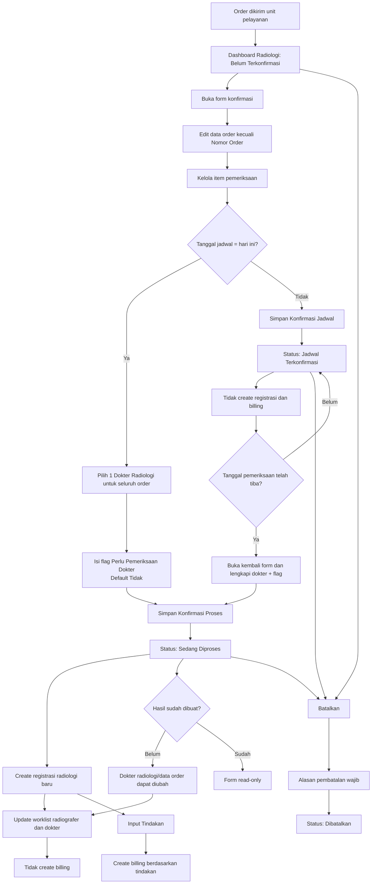

# PRD — Konfirmasi Order Radiologi

**Related Document:** Bisnis Proses Konfirmasi Order Radiologi; PRD Order Radiologi V2 (hard dependency); PRD Dashboard Radiologi (dokumen terpisah); Master Data Radiologi; Worklist Radiografer; Worklist Dokter Radiologi; Fitur Input Tindakan dan Billing  
**Dokumen ID:** PRD-RAD-KONF-v2.0 · **Versi:** 1.2 (Draft — Revisi form editable, registrasi, dan billing)  
**Tanggal Disusun:** 20 Juli 2026 · **Penyusun:** Team Product — Tamtech International  
**Approver:** M. Sulthan Farras Nanz (Chief Strategy & Growth Officer) · **Reviewer Teknis:** `[PERLU KONFIRMASI]`  
**Status:** Untuk Direview · **Target Release:** `[PERLU KONFIRMASI]`

## 1. Overview / Brief Summary

Konfirmasi Order Radiologi adalah fitur yang digunakan radiografer untuk membuka order yang sudah dikirim dari unit pelayanan, meninjau serta memperbarui data order, mengonfirmasi jadwal, menentukan dokter radiologi, dan menetapkan flag **Perlu Pemeriksaan Dokter** sebelum pemeriksaan diproses. Form konfirmasi menggunakan data dari Order Radiologi dan tetap dapat diedit oleh radiografer, kecuali **Nomor Order** yang bersifat read-only.

Order baru masuk melalui Dashboard Radiologi dengan status **Belum Terkonfirmasi**. Order dengan jadwal **hari ini** dikonfirmasi satu kali dengan menentukan Dokter Radiologi dan flag **Perlu Pemeriksaan Dokter**, lalu berubah menjadi **Sedang Diproses**. Order dengan jadwal **bukan hari ini** melalui dua layer: **Konfirmasi Jadwal** menjadi **Jadwal Terkonfirmasi**, kemudian **Konfirmasi Proses** pada tanggal pemeriksaan dengan melengkapi Dokter Radiologi dan flag tersebut sehingga status berubah menjadi **Sedang Diproses**.

Ketika konfirmasi berhasil mengubah status menjadi **Sedang Diproses**, sistem membuat **registrasi radiologi baru** dan mengaitkan order ke registrasi tersebut. Proses konfirmasi tidak membuat billing. Billing baru dibuat ketika petugas melakukan **Input Tindakan** melalui fitur terkait.

> Referensi: Bisnis Proses Konfirmasi Order Radiologi; PRD Order Radiologi V2; keputusan stakeholder tanggal 20 Juli 2026.

## 2. Background

**Kondisi saat ini (As-Is, Neurovi v1):**
- Unit pelayanan membuat Order Radiologi dan mengirimkannya ke radiologi.
- Radiografer membuka order dari dashboard dan melakukan konfirmasi.
- Konfirmasi jadwal, penentuan dokter, pembentukan registrasi, dan proses billing belum dipisahkan secara tegas berdasarkan trigger bisnisnya.
- Form konfirmasi belum secara konsisten memberikan ruang bagi radiografer untuk memperbarui data order dan item pemeriksaan sebelum pemeriksaan diproses.
- Jadwal hari ini dan jadwal masa depan belum memiliki layer konfirmasi yang berbeda.

**Masalah/pain point:**
- **Aspek bisnis proses:** konfirmasi order tidak boleh langsung membuat billing karena billing harus mengikuti tindakan yang benar-benar diinput.
- **Aspek UX:** radiografer membutuhkan satu form editable untuk menyesuaikan jadwal, dokter pengirim, diagnosa, urgensi, dan item pemeriksaan tanpa membuat order baru.
- **Aspek logic system:** jadwal masa depan membutuhkan konfirmasi dua layer agar Dokter Radiologi dan flag proses baru ditentukan ketika pemeriksaan akan dilaksanakan.
- **Aspek data:** satu Dokter Radiologi berlaku untuk seluruh order, sementara item pemeriksaan dapat ditambah, dihapus, atau diganti sebelum hasil dibuat.
- **Aspek integrasi:** registrasi radiologi harus dibuat saat pelayanan mulai diproses, sedangkan billing hanya dibuat oleh proses Input Tindakan.

**Dampak utama yang disasar v2:**
- Memisahkan trigger pembuatan registrasi dan billing.
- Menyediakan form konfirmasi yang editable dengan Nomor Order tetap terkunci.
- Menjamin transisi status sesuai tanggal pemeriksaan.
- Menjaga worklist dokter tetap sesuai dengan dokter yang ditugaskan pada satu order.
- Menyediakan jejak audit untuk seluruh perubahan penting.

**Strategi rilis Neurovi v2:**
- **Fase 1 (MVP):** form konfirmasi editable, konfirmasi satu layer untuk jadwal hari ini, konfirmasi dua layer untuk jadwal masa depan, pembuatan registrasi radiologi baru saat status menjadi Sedang Diproses, integrasi worklist, perubahan dokter sebelum hasil dibuat, pembatalan, penyelesaian pemeriksaan, dan audit trail.

> Volume operasional: sekitar 150–200 pasien radiologi per hari dan satu pasien dapat memiliki lebih dari satu order dalam satu episode pelayanan.

## 3. In Scope

### Scope Definition (Fase 1 — MVP)

1. **Entry point dari Dashboard Radiologi** — radiografer membuka order berstatus **Belum Terkonfirmasi** atau **Jadwal Terkonfirmasi**. Detail dashboard diatur dalam PRD terpisah.
2. **Form Order Radiologi editable** — radiografer dapat mengubah Jadwal Pemeriksaan, Dokter Pengirim, Diagnosa, Urgensi, dan Item Pemeriksaan; Nomor Order tidak dapat diubah.
3. **Pengelolaan item pemeriksaan** — radiografer dapat menambah, menghapus, atau mengganti item pemeriksaan menggunakan Master Data Radiologi yang aktif.
4. **Konfirmasi jadwal hari ini** — radiografer menentukan Dokter Radiologi dan flag **Perlu Pemeriksaan Dokter**, lalu status berubah menjadi **Sedang Diproses**.
5. **Konfirmasi jadwal masa depan — layer 1** — radiografer mengonfirmasi jadwal tanpa menetapkan Dokter Radiologi dan flag final; status berubah menjadi **Jadwal Terkonfirmasi**.
6. **Konfirmasi proses pada tanggal pemeriksaan — layer 2** — radiografer menentukan Dokter Radiologi dan flag **Perlu Pemeriksaan Dokter**, lalu status berubah menjadi **Sedang Diproses**.
7. **Urgensi pemeriksaan** — pilihan **Normal**, **Cito Tanpa Expertise**, dan **Cito Dengan Expertise**.
8. **Dokter Radiologi per order** — satu Dokter Radiologi dipilih untuk seluruh item dalam satu order.
9. **Perubahan Dokter Radiologi** — dapat dilakukan ketika status **Sedang Diproses** selama hasil pemeriksaan belum dibuat.
10. **Pembuatan registrasi radiologi baru** — dilakukan ketika konfirmasi berhasil mengubah status menjadi **Sedang Diproses**.
11. **Tanpa pembuatan billing saat konfirmasi** — billing dibuat setelah petugas melakukan **Input Tindakan**.
12. **Reschedule** — radiografer dapat mengubah jadwal tanpa mengisi alasan reschedule; perubahan tetap dicatat pada audit trail.
13. **Pembatalan order** — mengubah status menjadi **Dibatalkan** dan alasan pembatalan wajib diisi.
14. **Pemeriksaan selesai** — radiografer menandai akuisisi gambar selesai.
15. **Worklist radiografer dan dokter radiologi** — diperbarui sesuai jadwal, status, dan Dokter Radiologi yang dipilih.
16. **Timeline aktivitas dan audit trail** — mencatat perubahan data form, status, dokter, flag, item, registrasi, dan pembatalan.
17. **Cetak formulir permintaan radiologi**.

### Out Scope

- Desain, filter, kolom, dan behavior Dashboard Radiologi; didefinisikan pada PRD Dashboard Radiologi.
- Pembuatan awal Order Radiologi dari unit pengirim; didefinisikan pada PRD Order Radiologi V2.
- Proses Input Tindakan dan perhitungan billing; didefinisikan pada fitur/PRD tindakan dan billing.
- Entry serta validasi hasil interpretasi radiologi; didefinisikan pada tiket/PRD hasil radiologi.
- Pengelolaan file DICOM dan integrasi PACS/RIS eksternal. `[PERLU KONFIRMASI]`
- Output cetak hasil radiologi.
- Pengaturan Master Data Radiologi dan Master Staf; modul ini hanya mengonsumsi data aktif.
- Detail kanal notifikasi lintas unit. `[PERLU KONFIRMASI]`

## 4. Goals and Metrics

### Tujuan

Menyediakan form konfirmasi order radiologi yang fleksibel namun terkontrol, memisahkan proses penjadwalan dari pelaksanaan, membuat registrasi radiologi pada saat pelayanan benar-benar dimulai, serta memastikan billing hanya dibuat berdasarkan tindakan yang diinput.

### Metrik (terukur)

| Metrik | Target | Sumber |
|---|---|---|
| Waktu simpan konfirmasi | `< 1 detik` | NFR-001 |
| Pembaruan worklist | Real-time setelah transaksi berhasil | NFR-002 |
| Kapasitas operasional | Mendukung 150–200 pasien/hari | NFR-003 |
| Keterlacakan perubahan | 100% perubahan penting tercatat | NFR-006 |
| Konsistensi registrasi | Satu registrasi radiologi baru dibuat saat order masuk Sedang Diproses | BR-024; FR-010 |
| Pencegahan billing prematur | Tidak ada billing yang dibuat oleh proses konfirmasi | BR-026; FR-011 |
| Konsistensi dokter | Satu dokter radiologi aktif per order | BR-020; FR-008 |

## 5. Related Feature & Stakeholder

### A. Modul Terkait

| Modul / Fitur | Peran terhadap Modul |
|---|---|
| Order Radiologi V2 | Sumber data awal Nomor Order, Jadwal, Dokter Pengirim, Diagnosa, Urgensi, dan Item Pemeriksaan. |
| Dashboard Radiologi | Entry point untuk membuka form; detail kebutuhan dashboard berada pada PRD terpisah. |
| Registrasi / Admisi | Membuat registrasi radiologi baru ketika order mulai diproses. |
| Master Data Radiologi | Sumber item pemeriksaan dan atribut teknis aktif. |
| Master Staf / Dokter | Sumber Dokter Pengirim dan Dokter Radiologi. |
| Master Diagnosa | Sumber diagnosa yang dapat dipilih sesuai definisi pada PRD Order Radiologi. |
| Worklist Radiografer | Menampilkan jadwal dan antrean pemeriksaan radiologi. |
| Worklist Dokter Radiologi | Menerima order Sedang Diproses berdasarkan satu Dokter Radiologi yang dipilih. |
| Input Tindakan | Trigger pembuatan billing setelah tindakan pelayanan diinput. |
| Billing / Kasir | Menerima billing dari Input Tindakan, bukan dari proses konfirmasi. |
| EMR / Hasil Radiologi | Menggunakan registrasi radiologi baru sebagai konteks pelayanan dan hasil. |
| Audit Trail | Menyimpan seluruh aktivitas serta nilai sebelum/sesudah. |
| Cetak Formulir Permintaan | Menghasilkan dokumen permintaan radiologi. |

**Dependency lintas modul:** Order Radiologi V2, Dashboard Radiologi, Registrasi/Admisi, Master Data Radiologi, Master Staf, Master Diagnosa, Worklist Radiografer, Worklist Dokter Radiologi, Input Tindakan, Billing, EMR, dan Audit Trail.

### B. Persona

| Persona | Tipe | Peran terhadap Modul |
|---|---|---|
| Radiografer | Primary | Mengedit form order, mengelola item, mengonfirmasi jadwal/proses, menentukan dokter radiologi dan flag, melakukan reschedule, menyelesaikan pemeriksaan, dan membatalkan order. |
| Dokter/Perawat/Bidan unit pengirim | Secondary | Membuat order awal dan memantau perkembangannya. |
| Dokter Spesialis Radiologi | Secondary | Menerima worklist setelah ditugaskan pada order Sedang Diproses. |
| Petugas Input Tindakan | Secondary | Menginput tindakan yang menjadi trigger pembuatan billing. |
| Admin Master Data | Tersier | Menjaga ketersediaan master pemeriksaan, staf, dan diagnosa aktif. |

## 6. Business Process (As-Is / To-Be)

### A. As-Is (Neurovi v1)

1. Unit pelayanan membuat Order Radiologi.
2. Order masuk ke Dashboard Radiologi.
3. Radiografer membuka order dan melakukan konfirmasi.
4. Data order tidak selalu dapat disesuaikan secara fleksibel pada proses konfirmasi.
5. Konfirmasi berpotensi langsung memicu proses downstream yang seharusnya menunggu Input Tindakan.
6. Jadwal hari ini dan jadwal masa depan menggunakan pola konfirmasi yang sama.

### B. To-Be (Neurovi v2 — Fase 1 MVP)

1. Unit pelayanan membuat dan mengirim Order Radiologi.
2. Order masuk ke Dashboard Radiologi dengan status **Belum Terkonfirmasi**.
3. Radiografer membuka form konfirmasi.
4. Sistem menampilkan Nomor Order sebagai read-only serta menampilkan Jadwal, Dokter Pengirim, Diagnosa, Urgensi, dan Item Pemeriksaan sebagai data editable.
5. Radiografer dapat menambah, menghapus, atau mengganti Item Pemeriksaan dari Master Data Radiologi aktif.
6. Sistem membandingkan tanggal Jadwal Pemeriksaan dengan tanggal hari ini pada timezone fasilitas.
7. Bila jadwal adalah **hari ini**:
   1. Radiografer memilih satu Dokter Radiologi untuk seluruh order.
   2. Radiografer menetapkan flag **Perlu Pemeriksaan Dokter** dengan pilihan Tidak/Ya dan default Tidak.
   3. Radiografer menyimpan konfirmasi.
   4. Sistem mengubah status menjadi **Sedang Diproses**.
   5. Sistem membuat satu registrasi radiologi baru dan mengaitkan order ke registrasi tersebut.
   6. Sistem tidak membuat billing.
   7. Sistem memperbarui worklist radiografer dan membentuk worklist Dokter Radiologi.
8. Bila jadwal adalah **bukan hari ini**:
   1. Radiografer menyimpan **Konfirmasi Jadwal** tanpa menetapkan Dokter Radiologi dan flag final.
   2. Sistem mengubah status menjadi **Jadwal Terkonfirmasi**.
   3. Sistem belum membuat registrasi radiologi baru.
   4. Sistem tidak membuat billing dan belum membentuk worklist Dokter Radiologi.
9. Pada tanggal pemeriksaan untuk order **Jadwal Terkonfirmasi**:
   1. Radiografer membuka kembali form.
   2. Radiografer masih dapat memperbarui data order selain Nomor Order.
   3. Radiografer memilih satu Dokter Radiologi untuk seluruh order.
   4. Radiografer menetapkan flag **Perlu Pemeriksaan Dokter**.
   5. Radiografer menyimpan **Konfirmasi Proses**.
   6. Sistem mengubah status menjadi **Sedang Diproses**.
   7. Sistem membuat satu registrasi radiologi baru dan mengaitkan order ke registrasi tersebut.
   8. Sistem tidak membuat billing.
   9. Sistem memperbarui worklist radiografer dan membentuk worklist Dokter Radiologi.
10. Setelah status **Sedang Diproses**, radiografer dapat mengubah Dokter Radiologi selama hasil pemeriksaan belum dibuat. Worklist dokter lama dan baru harus diperbarui secara atomik.
11. Billing baru dibuat ketika petugas melakukan **Input Tindakan** pada registrasi radiologi tersebut.
12. Radiografer dapat melakukan reschedule tanpa alasan; sistem menyimpan jadwal lama, jadwal baru, aktor, dan waktu perubahan.
13. Radiografer dapat membatalkan order dengan alasan wajib sehingga status menjadi **Dibatalkan**.
14. Setelah akuisisi gambar selesai, radiografer mengubah status menjadi **Pemeriksaan Selesai**.

### C. Perbedaan As-Is (V1) vs To-Be (V2)

| Aspek | As-Is (V1) | To-Be (V2) |
|---|---|---|
| Fokus layar | Konfirmasi dasar order. | Satu form order editable; hanya Nomor Order read-only. |
| Jadwal hari ini | Konfirmasi umum. | Satu layer, lalu status Sedang Diproses. |
| Jadwal masa depan | Konfirmasi tunggal. | Dua layer: Konfirmasi Jadwal lalu Konfirmasi Proses. |
| Registrasi | Trigger belum tegas. | Registrasi radiologi baru dibuat saat status berubah menjadi Sedang Diproses. |
| Billing | Berpotensi terpicu saat konfirmasi. | Tidak dibuat saat konfirmasi; dibuat saat Input Tindakan. |
| Urgensi | Normal/CITO. | Normal, Cito Tanpa Expertise, Cito Dengan Expertise. |
| Dokter Radiologi | Belum ditegaskan cakupannya. | Satu dokter untuk seluruh order dan dapat diubah sebelum hasil dibuat. |
| Item pemeriksaan | Cenderung mengikuti order awal. | Dapat ditambah, dihapus, atau diganti oleh radiografer. |
| Reschedule | Alasan berpotensi diminta. | Tidak memerlukan alasan; perubahan tetap diaudit. |
| Pembatalan | Status belum seragam. | Status Dibatalkan dengan alasan wajib. |

## 7. Main Flow / Mindmap

### Skenario 1 — Membuka dan Mengedit Form Order

1. Radiografer membuka order dari Dashboard Radiologi.
2. Sistem menampilkan form order yang sudah dibuat.
3. Nomor Order tampil read-only.
4. Radiografer dapat mengubah Jadwal, Dokter Pengirim, Diagnosa, Urgensi, dan Item Pemeriksaan.
5. Radiografer dapat menambah, menghapus, atau mengganti Item Pemeriksaan menggunakan master aktif.
6. Perubahan belum dianggap final sampai radiografer menyimpan aksi yang sesuai.

### Skenario 2 — Konfirmasi Jadwal Hari Ini

1. Order berstatus **Belum Terkonfirmasi** dan Jadwal Pemeriksaan adalah hari ini.
2. Radiografer melengkapi data order.
3. Radiografer memilih satu Dokter Radiologi untuk seluruh order.
4. Radiografer menetapkan flag **Perlu Pemeriksaan Dokter**; default **Tidak**.
5. Radiografer menyimpan **Konfirmasi Proses**.
6. Status berubah menjadi **Sedang Diproses**.
7. Sistem membuat registrasi radiologi baru.
8. Sistem memperbarui worklist radiografer dan Dokter Radiologi.
9. Sistem tidak membuat billing.

### Skenario 3 — Konfirmasi Jadwal Masa Depan (Layer 1)

1. Order berstatus **Belum Terkonfirmasi** dan Jadwal Pemeriksaan bukan hari ini.
2. Radiografer dapat memperbarui data order selain Nomor Order.
3. Radiografer menyimpan **Konfirmasi Jadwal** tanpa menetapkan Dokter Radiologi dan flag final.
4. Status berubah menjadi **Jadwal Terkonfirmasi**.
5. Sistem belum membuat registrasi radiologi, billing, atau worklist Dokter Radiologi.

### Skenario 4 — Konfirmasi Proses pada Tanggal Pemeriksaan (Layer 2)

1. Pada tanggal pemeriksaan, radiografer membuka order **Jadwal Terkonfirmasi**.
2. Radiografer dapat memperbarui data order selain Nomor Order.
3. Radiografer memilih satu Dokter Radiologi untuk seluruh order.
4. Radiografer menetapkan flag **Perlu Pemeriksaan Dokter**.
5. Radiografer menyimpan **Konfirmasi Proses**.
6. Status berubah menjadi **Sedang Diproses**.
7. Sistem membuat registrasi radiologi baru dan memperbarui worklist.
8. Sistem tidak membuat billing.

### Skenario 5 — Reschedule

1. Radiografer mengubah Jadwal Pemeriksaan selama order belum memiliki hasil.
2. Sistem tidak meminta alasan reschedule.
3. Sistem menyimpan jadwal lama, jadwal baru, user, dan waktu perubahan pada audit trail.
4. Jika jadwal baru adalah masa depan, status menjadi atau tetap **Jadwal Terkonfirmasi**; Dokter Radiologi dan flag final belum ditentukan.
5. Jika jadwal baru adalah hari ini, Dokter Radiologi dan flag wajib dilengkapi sebelum status menjadi **Sedang Diproses**.
6. Jika order sebelumnya sudah memiliki registrasi radiologi dan dipindahkan ke tanggal masa depan, penanganan registrasi mengikuti keputusan pada Pertanyaan Terbuka.

### Skenario 6 — Mengubah Dokter Radiologi saat Sedang Diproses

1. Order berstatus **Sedang Diproses** dan hasil pemeriksaan belum dibuat.
2. Radiografer memilih Dokter Radiologi lain pada form.
3. Sistem menyimpan perubahan dokter untuk seluruh order.
4. Sistem menghapus/memperbarui assignment pada worklist dokter lama dan menambahkan order ke worklist dokter baru secara atomik.
5. Perubahan dicatat pada audit trail.
6. Jika hasil sudah dibuat, perubahan Dokter Radiologi ditolak.

### Skenario 7 — Mengelola Item Pemeriksaan

1. Radiografer membuka daftar Item Pemeriksaan pada form.
2. Radiografer dapat menambah item dari Master Data Radiologi aktif.
3. Radiografer dapat menghapus atau mengganti item yang sudah ada.
4. Sistem memvalidasi struktur dan atribut item sebelum penyimpanan.
5. Sistem mencatat item sebelum dan sesudah perubahan pada audit trail.
6. Dampak perubahan item setelah tindakan/billing terbentuk mengikuti keputusan pada Pertanyaan Terbuka.

### Skenario 8 — Pembentukan Billing melalui Input Tindakan

1. Order sudah berstatus **Sedang Diproses** dan memiliki registrasi radiologi baru.
2. Petugas melakukan Input Tindakan pada registrasi tersebut.
3. Sistem tindakan membuat billing berdasarkan tindakan yang diinput.
4. Konfirmasi order tidak melakukan create billing maupun duplikasi billing.

### Skenario 9 — Pembatalan

1. Radiografer memilih aksi **Batalkan Order**.
2. Sistem meminta Alasan Pembatalan.
3. Setelah alasan valid, status berubah menjadi **Dibatalkan**.
4. Order dikeluarkan dari worklist aktif.
5. Aktivitas pembatalan dan alasannya disimpan pada audit trail.

## 8. Business Rules

| ID | Rule | Sumber / Trace |
|---|---|---|
| **BR-001** | Order yang telah dibuat dan dikirim unit pelayanan masuk ke Dashboard Radiologi dengan status **Belum Terkonfirmasi**. | FR-001; D-001 |
| **BR-002** | Detail kebutuhan Dashboard Radiologi berada di PRD terpisah; PRD ini hanya menggunakan dashboard sebagai entry point menuju form. | Scope; FR-001 |
| **BR-003** | Form menampilkan data order yang sudah dibuat dan dapat diedit oleh radiografer, kecuali **Nomor Order**. | FR-003; US-001; D-007 |
| **BR-004** | Jadwal Pemeriksaan, Dokter Pengirim, Diagnosa, Urgensi, dan Item Pemeriksaan dapat diubah selama order belum memiliki hasil dan belum berstatus Dibatalkan. | FR-003; FR-004; US-001 |
| **BR-005** | Item Pemeriksaan hanya dapat dipilih dari Master Data Radiologi aktif. | FR-004; US-002 |
| **BR-006** | Radiografer dapat menambah, menghapus, atau mengganti Item Pemeriksaan. | FR-004; US-002; D-009 |
| **BR-007** | Perbandingan Jadwal Pemeriksaan dengan “hari ini” menggunakan tanggal kalender pada timezone fasilitas. | FR-005; D-002 |
| **BR-008** | Jadwal Pemeriksaan tidak boleh lebih kecil dari tanggal order, kecuali user memiliki kewenangan khusus sesuai kebijakan sistem. | FR-006 |
| **BR-009** | Urgensi hanya memiliki pilihan **Normal**, **Cito Tanpa Expertise**, dan **Cito Dengan Expertise**. | FR-006; D-006 |
| **BR-010** | Jika Jadwal Pemeriksaan adalah hari ini, konfirmasi dilakukan satu layer dan wajib melengkapi Dokter Radiologi serta flag **Perlu Pemeriksaan Dokter**. | FR-005; FR-007; US-003 |
| **BR-011** | Konfirmasi jadwal hari ini mengubah status **Belum Terkonfirmasi** menjadi **Sedang Diproses**. | FR-009; US-003 |
| **BR-012** | Jika Jadwal Pemeriksaan bukan hari ini, konfirmasi pertama hanya mengonfirmasi jadwal dan tidak menetapkan Dokter Radiologi maupun flag final. | FR-005; US-004 |
| **BR-013** | Konfirmasi jadwal masa depan mengubah status menjadi **Jadwal Terkonfirmasi**. | FR-009; US-004 |
| **BR-014** | Order **Jadwal Terkonfirmasi** harus dikonfirmasi kembali pada tanggal pemeriksaan sebelum dapat menjadi **Sedang Diproses**. | FR-005; US-005 |
| **BR-015** | Konfirmasi kedua wajib melengkapi Dokter Radiologi dan flag **Perlu Pemeriksaan Dokter**. | FR-007; US-005 |
| **BR-016** | Flag **Perlu Pemeriksaan Dokter** memiliki pilihan **Tidak/Ya** dengan default **Tidak**. | FR-007; D-004 |
| **BR-017** | Satu Dokter Radiologi berlaku untuk seluruh Item Pemeriksaan dalam satu order. | FR-008; US-006; D-008 |
| **BR-018** | Order tidak mendukung Dokter Radiologi berbeda per item. | FR-008; D-008 |
| **BR-019** | Dokter Radiologi dapat diubah pada status **Sedang Diproses** selama hasil pemeriksaan belum dibuat. | FR-012; US-007; D-010 |
| **BR-020** | Perubahan Dokter Radiologi berlaku untuk seluruh order dan wajib memperbarui worklist dokter lama dan dokter baru secara atomik. | FR-012; FR-013; US-007 |
| **BR-021** | Worklist Dokter Radiologi hanya dibentuk ketika status **Sedang Diproses** dan Dokter Radiologi telah ditentukan. | FR-013; US-008 |
| **BR-022** | Order **Jadwal Terkonfirmasi** belum masuk ke Worklist Dokter Radiologi. | FR-013 |
| **BR-023** | Konfirmasi Jadwal untuk tanggal masa depan tidak membuat registrasi radiologi dan tidak membuat billing. | FR-010; FR-011; US-004 |
| **BR-024** | Ketika konfirmasi berhasil mengubah status menjadi **Sedang Diproses**, sistem membuat satu registrasi radiologi baru dan mengaitkan order ke registrasi tersebut. | FR-010; US-003; US-005; D-005 |
| **BR-025** | Proses create registrasi harus idempotent; retry konfirmasi tidak boleh membuat registrasi radiologi ganda untuk order yang sama. | FR-010; NFR-007 |
| **BR-026** | Konfirmasi order tidak membuat billing. | FR-011; D-005 |
| **BR-027** | Billing hanya dibuat setelah petugas melakukan **Input Tindakan** pada registrasi radiologi. | FR-011; FR-020; US-009 |
| **BR-028** | Reschedule tidak membutuhkan alasan. | FR-011; D-011 |
| **BR-029** | Perubahan jadwal tetap mencatat jadwal sebelum/sesudah, user, dan waktu pada audit trail. | FR-011; FR-014 |
| **BR-030** | Setiap perubahan Jadwal, Dokter Pengirim, Diagnosa, Urgensi, Dokter Radiologi, flag, Item Pemeriksaan, status, dan registrasi wajib dicatat pada audit trail. | FR-014; US-010 |
| **BR-031** | Setelah akuisisi gambar selesai, radiografer dapat mengubah status menjadi **Pemeriksaan Selesai**. | FR-015 |
| **BR-032** | Pembatalan mengubah status menjadi **Dibatalkan**. | FR-016; D-012 |
| **BR-033** | Alasan Pembatalan wajib diisi dan disimpan pada audit trail. | FR-016; US-012 |
| **BR-034** | Order yang sudah memiliki hasil atau berstatus terminal tidak dapat diedit melalui form konfirmasi. | FR-017 |
| **BR-035** | Cetak formulir permintaan dapat dilakukan dari detail order. | FR-018 |
| **BR-036** | Seluruh aksi perubahan data mengikuti kontrol akses berdasarkan role dan kewenangan. | FR-019; NFR-005 |

## 9. State Machine

### 9.1 Status Order Radiologi

| State | Makna | Trigger | Aktor |
|---|---|---|---|
| **Belum Terkonfirmasi** | Order sudah dikirim unit pelayanan dan menunggu konfirmasi radiografer. | Order dikirim. | Dokter/Perawat/Bidan |
| **Jadwal Terkonfirmasi** | Jadwal masa depan telah dikonfirmasi; Dokter Radiologi dan flag final belum ditentukan; registrasi radiologi belum dibuat. | Konfirmasi Jadwal disimpan. | Radiografer |
| **Sedang Diproses** | Order aktif diproses; Dokter Radiologi dan flag telah ditentukan; registrasi radiologi baru sudah dibuat. | Konfirmasi Proses berhasil. | Radiografer |
| **Pemeriksaan Selesai** | Akuisisi gambar selesai dan order siap dilanjutkan ke proses hasil. | Radiografer menyelesaikan pemeriksaan. | Radiografer |
| **Dibatalkan** | Order dibatalkan dan tidak dilanjutkan. | Pembatalan dengan alasan disimpan. | Radiografer berwenang |

### 9.2 Transisi Utama

**Jadwal hari ini:**  
`Belum Terkonfirmasi → Sedang Diproses → Pemeriksaan Selesai`

**Jadwal masa depan:**  
`Belum Terkonfirmasi → Jadwal Terkonfirmasi → Sedang Diproses → Pemeriksaan Selesai`

**Pembatalan:**  
`Belum Terkonfirmasi / Jadwal Terkonfirmasi / Sedang Diproses → Dibatalkan`

### 9.3 Guard Transisi

| Dari | Ke | Guard / Efek |
|---|---|---|
| Belum Terkonfirmasi | Jadwal Terkonfirmasi | Jadwal bukan hari ini; data form valid; Dokter Radiologi dan flag belum final; tidak membuat registrasi/billing. |
| Belum Terkonfirmasi | Sedang Diproses | Jadwal hari ini; Dokter Radiologi dan flag terisi; membuat registrasi radiologi baru; tidak membuat billing. |
| Jadwal Terkonfirmasi | Sedang Diproses | Tanggal pemeriksaan telah tiba; Dokter Radiologi dan flag terisi; membuat registrasi radiologi baru; tidak membuat billing. |
| Jadwal Terkonfirmasi | Jadwal Terkonfirmasi | Reschedule tetap ke masa depan; tidak perlu alasan. |
| Sedang Diproses | Sedang Diproses | Perubahan data order atau Dokter Radiologi diizinkan sebelum hasil dibuat; registrasi tetap sama; worklist diperbarui bila dokter berubah. |
| Sedang Diproses | Jadwal Terkonfirmasi | Reschedule ke masa depan; penanganan registrasi yang sudah dibuat `[PERLU KONFIRMASI]`. |
| Sedang Diproses | Pemeriksaan Selesai | Akuisisi gambar selesai. |
| Belum Terkonfirmasi / Jadwal Terkonfirmasi / Sedang Diproses | Dibatalkan | User berwenang dan Alasan Pembatalan terisi. |

### 9.4 Aturan Tampilan dan Edit Form

| Kondisi | Field Editable | Dokter Radiologi & Flag | Aksi Utama |
|---|---|---|---|
| Belum Terkonfirmasi + jadwal hari ini | Semua field form kecuali Nomor Order | Tampil dan wajib; flag default Tidak | **Konfirmasi Proses** |
| Belum Terkonfirmasi + jadwal masa depan | Semua field form kecuali Nomor Order | Belum ditetapkan sebagai nilai final | **Konfirmasi Jadwal** |
| Jadwal Terkonfirmasi + sebelum tanggal | Semua field form kecuali Nomor Order | Belum ditetapkan sebagai nilai final | Ubah Jadwal / Simpan Perubahan / Batalkan |
| Jadwal Terkonfirmasi + tanggal pemeriksaan | Semua field form kecuali Nomor Order | Tampil dan wajib; flag default Tidak | **Konfirmasi Proses** |
| Sedang Diproses + belum ada hasil | Semua field form kecuali Nomor Order | Editable; satu dokter per order | Simpan Perubahan / Selesaikan / Batalkan |
| Pemeriksaan Selesai atau hasil sudah dibuat | Read-only | Read-only | Lihat Detail / Cetak |
| Dibatalkan | Read-only | Read-only | Lihat Detail |

## 10. Functional Requirements

| ID | Functional Requirement | Trace |
|---|---|---|
| **FR-001** | **Buka form dari dashboard** — radiografer dapat membuka form order yang sudah dikirim dari Dashboard Radiologi; detail dashboard tidak menjadi cakupan PRD ini. | BR-001; BR-002 |
| **FR-002** | **Tampilkan konteks pasien dan order** — sistem menampilkan identitas pasien, status order, unit pengirim, dan konteks registrasi terkait. | Data Requirements |
| **FR-003** | **Form order editable** — radiografer dapat mengubah Jadwal, Dokter Pengirim, Diagnosa, Urgensi, Dokter Radiologi, flag, dan data pemeriksaan sesuai status; Nomor Order selalu read-only. | US-001; BR-003; BR-004 |
| **FR-004** | **Kelola Item Pemeriksaan** — radiografer dapat menambah, menghapus, atau mengganti item dan atribut pemeriksaan menggunakan Master Data Radiologi aktif. | US-002; BR-005; BR-006 |
| **FR-005** | **Kontrol layer konfirmasi** — sistem menentukan aksi Konfirmasi Jadwal atau Konfirmasi Proses berdasarkan status serta tanggal pemeriksaan. | US-003–US-005; BR-007; BR-010–BR-015 |
| **FR-006** | **Penjadwalan dan Urgensi** — radiografer dapat mengubah jadwal dan memilih Urgensi: Normal, Cito Tanpa Expertise, atau Cito Dengan Expertise. | BR-008; BR-009 |
| **FR-007** | **Dokter Radiologi dan flag** — pada Konfirmasi Proses, radiografer wajib memilih satu Dokter Radiologi untuk seluruh order dan mengisi flag Tidak/Ya dengan default Tidak. | US-006; BR-015–BR-018 |
| **FR-008** | **Satu dokter per order** — sistem menyimpan satu `radiologist_id` pada level order dan menerapkannya untuk seluruh item. | US-006; BR-017; BR-018 |
| **FR-009** | **Simpan dan tentukan status** — sistem menentukan status Jadwal Terkonfirmasi atau Sedang Diproses sesuai layer konfirmasi. | US-003–US-005; State Machine |
| **FR-010** | **Create registrasi radiologi baru** — pada transisi ke Sedang Diproses, sistem membuat satu registrasi baru secara idempotent dan mengaitkannya ke order. | US-003; US-005; BR-024; BR-025 |
| **FR-011** | **Tidak create billing saat konfirmasi** — proses konfirmasi dan reschedule tidak membuat billing; perubahan jadwal tidak memerlukan alasan. | US-009; BR-026–BR-029 |
| **FR-012** | **Ubah Dokter Radiologi** — pada status Sedang Diproses dan sebelum hasil dibuat, radiografer dapat mengganti Dokter Radiologi untuk seluruh order. | US-007; BR-019; BR-020 |
| **FR-013** | **Pembaruan worklist** — sistem memperbarui worklist radiografer dan dokter secara real-time berdasarkan jadwal, status, serta perubahan dokter. | US-007; US-008; BR-020–BR-022 |
| **FR-014** | **Timeline dan audit trail** — sistem menyimpan aktor, waktu, nilai sebelum/sesudah untuk seluruh perubahan data form, item, status, dokter, flag, jadwal, registrasi, dan pembatalan. | US-010; BR-029; BR-030 |
| **FR-015** | **Pemeriksaan selesai** — radiografer dapat mengubah status menjadi Pemeriksaan Selesai setelah akuisisi gambar selesai. | BR-031 |
| **FR-016** | **Pembatalan** — user berwenang dapat membatalkan order dengan Alasan Pembatalan wajib sehingga status menjadi Dibatalkan. | US-012; BR-032; BR-033 |
| **FR-017** | **Kondisi read-only** — form menjadi read-only setelah hasil dibuat atau order berada pada status terminal. | BR-034 |
| **FR-018** | **Cetak formulir permintaan** — user dapat membuka print preview/cetak dari detail order. | BR-035 |
| **FR-019** | **RBAC dan feedback transaksi** — akses aksi mengikuti kewenangan; UI hanya berubah setelah transaksi berhasil dan menampilkan pesan berhasil/gagal yang jelas. | BR-036; NFR-005; NFR-007 |
| **FR-020** | **Trigger billing dari Input Tindakan** — modul meneruskan referensi registrasi radiologi agar fitur Input Tindakan dapat membuat billing; modul konfirmasi tidak membuat billing. | US-009; BR-027 |

## 11. User Stories

| ID | User Story | Acceptance Criteria (Given-When-Then) | Trace |
|---|---|---|---|
| **US-001** | Sebagai **radiografer**, saya ingin mengedit form order yang sudah dikirim, sehingga detail pemeriksaan dapat disesuaikan tanpa membuat order baru. | **Given** order belum memiliki hasil dan tidak Dibatalkan, **When** form dibuka, **Then** semua field utama dapat diedit kecuali Nomor Order. | FR-003; BR-003; BR-004 |
| **US-002** | Sebagai **radiografer**, saya ingin menambah, menghapus, atau mengganti item pemeriksaan, sehingga daftar pemeriksaan sesuai kebutuhan aktual. | **Given** form masih editable, **When** item diubah, **Then** sistem hanya menerima item master aktif dan menyimpan perubahan pada audit trail. | FR-004; FR-014; BR-005; BR-006 |
| **US-003** | Sebagai **radiografer**, saya ingin mengonfirmasi order yang dijadwalkan hari ini, sehingga pemeriksaan langsung masuk proses dengan registrasi radiologi yang benar. | **Given** status Belum Terkonfirmasi dan jadwal hari ini, **When** dokter dan flag diisi lalu konfirmasi disimpan, **Then** status menjadi Sedang Diproses, satu registrasi radiologi baru dibuat, worklist diperbarui, dan billing tidak dibuat. | FR-005; FR-007; FR-009–FR-011 |
| **US-004** | Sebagai **radiografer**, saya ingin mengonfirmasi jadwal masa depan tanpa menetapkan dokter terlalu awal, sehingga jadwal dapat diamankan lebih dahulu. | **Given** status Belum Terkonfirmasi dan jadwal bukan hari ini, **When** Konfirmasi Jadwal disimpan, **Then** status menjadi Jadwal Terkonfirmasi serta registrasi, billing, dan worklist dokter belum dibuat. | FR-005; FR-009–FR-011; BR-012; BR-013; BR-023 |
| **US-005** | Sebagai **radiografer**, saya ingin melakukan konfirmasi kedua pada tanggal pemeriksaan, sehingga pelayanan dapat dimulai dengan dokter, flag, dan registrasi yang sesuai. | **Given** status Jadwal Terkonfirmasi dan tanggal pemeriksaan telah tiba, **When** dokter serta flag diisi dan Konfirmasi Proses disimpan, **Then** status menjadi Sedang Diproses, registrasi baru dibuat, worklist dokter terbentuk, dan billing tidak dibuat. | FR-005; FR-007; FR-009–FR-011 |
| **US-006** | Sebagai **radiografer**, saya ingin memilih satu Dokter Radiologi untuk seluruh order, sehingga penanggung jawab interpretasi konsisten untuk seluruh item. | **Given** Konfirmasi Proses dilakukan, **When** Dokter Radiologi dipilih, **Then** satu dokter tersebut berlaku untuk seluruh item dalam order. | FR-007; FR-008; BR-017; BR-018 |
| **US-007** | Sebagai **radiografer**, saya ingin mengganti Dokter Radiologi sebelum hasil dibuat, sehingga perubahan penugasan dapat ditangani tanpa membatalkan order. | **Given** status Sedang Diproses dan hasil belum dibuat, **When** dokter diganti dan disimpan, **Then** assignment seluruh order serta worklist dokter lama dan baru diperbarui secara atomik. | FR-012; FR-013; BR-019; BR-020 |
| **US-008** | Sebagai **dokter radiologi**, saya ingin menerima order pada worklist setelah ditugaskan, sehingga worklist hanya memuat order yang menjadi tanggung jawab saya. | **Given** status menjadi Sedang Diproses dan dokter telah dipilih, **When** transaksi berhasil, **Then** order tampil pada worklist dokter tersebut secara real-time. | FR-013; BR-021; BR-022 |
| **US-009** | Sebagai **petugas pelayanan**, saya ingin billing dibuat saat Input Tindakan, sehingga tagihan sesuai tindakan yang benar-benar diberikan dan tidak terbentuk prematur saat konfirmasi. | **Given** order sudah memiliki registrasi radiologi, **When** Input Tindakan disimpan, **Then** billing dibuat oleh fitur tindakan; penyimpanan konfirmasi sendiri tidak menghasilkan billing. | FR-011; FR-020; BR-026; BR-027 |
| **US-010** | Sebagai **user berwenang**, saya ingin melihat timeline aktivitas, sehingga perubahan order dapat ditelusuri. | **Given** order memiliki perubahan, **When** timeline dibuka, **Then** sistem menampilkan aktor, waktu, aktivitas, dan nilai sebelum/sesudah tanpa mewajibkan alasan reschedule. | FR-014; BR-029; BR-030 |
| **US-011** | Sebagai **radiografer**, saya ingin melakukan reschedule tanpa mengisi alasan, sehingga perubahan jadwal operasional dapat dilakukan lebih cepat. | **Given** order belum memiliki hasil, **When** jadwal diubah dan disimpan, **Then** sistem tidak meminta alasan serta tetap menyimpan audit perubahan jadwal. | FR-011; BR-028; BR-029 |
| **US-012** | Sebagai **radiografer berwenang**, saya ingin membatalkan order dengan alasan, sehingga order yang tidak dilanjutkan keluar dari antrean aktif dan dapat ditelusuri. | **Given** order masih dapat dibatalkan, **When** alasan diisi dan pembatalan disimpan, **Then** status menjadi Dibatalkan dan audit trail tersimpan. | FR-016; BR-032; BR-033 |

## 12. Data Requirements (Spesifikasi Field)

> Field demografi, registrasi, dokter, diagnosa, dan penjamin **reuse definisi kanonik dari modul Registrasi/Admisi dan Order Radiologi V2** — nama, tipe, format, serta validasi harus konsisten. Data requirement dashboard tidak dicantumkan karena menjadi cakupan PRD Dashboard Radiologi.

### A. Layar TAMPIL — Header Pasien Form Order (FR-002)

| Kolom | Sumber Data | Format Tampilan | Filter/Sort | Catatan |
|---|---|---|---|---|
| Identitas Pasien | Pasien | Nama, No. RM, tanggal lahir, jenis kelamin, umur | — | Read-only; menggunakan header pasien kanonik. |
| Unit Pengirim | Order Radiologi | Teks | — | Read-only. |
| Penjamin | Registrasi asal | Teks | — | Read-only. |

### B. Layar INPUT — Form Konfirmasi Order Radiologi (FR-003–FR-008)

| Field | Label | Tipe | Wajib | Validasi/Format | Sumber/Default | Catatan |
|---|---|---|---|---|---|---|
| `order_number` | Nomor Order | text/read-only | Ya | Unik; tidak dapat diubah | Order Radiologi | Satu-satunya field utama yang selalu read-only. |
| `examination_datetime` | Jadwal Pemeriksaan | datetime | Ya | Tidak boleh sebelum tanggal order kecuali memiliki kewenangan khusus | Order Radiologi; editable | Menentukan layer Konfirmasi Jadwal atau Konfirmasi Proses. Reschedule tidak membutuhkan alasan. |
| `urgency` | Urgensi | single-select | Ya | **Normal / Cito Tanpa Expertise / Cito Dengan Expertise** | Nilai order; default Normal | Editable. |
| `referring_doctor_id` | Dokter Pengirim | searchable lookup | Ya | Memilih staf/dokter aktif sesuai definisi Order Radiologi | Order Radiologi / Master Staf | Editable. |
| `diagnosis` | Diagnosa | searchable select | Ya | Mengikuti validasi dan sumber diagnosa pada PRD Order Radiologi | Order Radiologi / Master Diagnosa | Editable. |
| `radiologist_id` | Dokter Radiologi | searchable lookup | Kondisional | Wajib pada Konfirmasi Proses; satu dokter untuk seluruh order; hanya dokter aktif | Master Staf | Belum final pada Konfirmasi Jadwal masa depan; dapat diubah saat Sedang Diproses sebelum hasil dibuat. |
| `requires_doctor_examination` | Perlu Pemeriksaan Dokter | radio/segmented control | Kondisional | Tidak/Ya | Default Tidak | Wajib pada Konfirmasi Proses; belum final pada Konfirmasi Jadwal masa depan. |
| `examination_items` | Item Pemeriksaan | repeatable list / expandable | Ya | Item berasal dari Master Data Radiologi aktif; mendukung tambah, hapus, dan ganti; minimal satu item | Snapshot order + Master Data Radiologi | Satu order dapat berisi banyak item. Detail item dapat mencakup Modalitas, Kelompok Organ, Nama Pemeriksaan, Sisi Tubuh, Teknik, Kontras, Posisi, Proyeksi, dan Catatan sesuai konfigurasi master. |

### C. Data Dibuat atau Diperbarui saat Simpan (FR-009–FR-014)

| Field | Label | Tipe | Format/Sumber | Catatan |
|---|---|---|---|---|
| `schedule_confirmed_at` | Waktu Konfirmasi Jadwal | datetime | Waktu server | Diisi pada Konfirmasi Jadwal masa depan. |
| `schedule_confirmed_by` | User Konfirmasi Jadwal | reference | User login | Audit layer 1. |
| `process_confirmed_at` | Waktu Konfirmasi Proses | datetime | Waktu server | Diisi ketika status menjadi Sedang Diproses. |
| `process_confirmed_by` | User Konfirmasi Proses | reference | User login | Audit layer proses. |
| `radiology_registration_id` | Registrasi Radiologi Baru | reference | Dibuat Registrasi/Admisi | Dibuat satu kali saat transisi ke Sedang Diproses; retry tidak boleh membuat duplikat. |
| `status` | Status Order | enum | State machine | Belum Terkonfirmasi, Jadwal Terkonfirmasi, Sedang Diproses, Pemeriksaan Selesai, Dibatalkan. |
| `worklist_radiographer_reference` | Referensi Worklist Radiografer | reference | Dibuat/diperbarui sistem | Mengikuti jadwal dan status. |
| `worklist_radiologist_reference` | Referensi Worklist Dokter | reference | Dibuat/diperbarui sistem | Hanya aktif saat Sedang Diproses dan dokter telah dipilih. |
| `audit_event_id` | Audit Event | reference | Dibuat setiap perubahan | Menyimpan before/after. |
| `billing_reference` | Referensi Billing | — | Tidak dibuat oleh modul konfirmasi | Billing dibuat oleh Input Tindakan. |

### D. Layar TAMPIL — Timeline Aktivitas (FR-014)

| Kolom | Sumber Data | Format Tampilan | Filter/Sort | Catatan |
|---|---|---|---|---|
| Waktu | Audit Trail | `DD MMM YYYY, HH:mm:ss` | Urut waktu | Waktu server/fasilitas. |
| Aktivitas | Audit Trail | Teks + ikon | Filter tipe opsional | Konfirmasi jadwal, konfirmasi proses, edit form, perubahan item, reschedule, perubahan dokter, selesai, pembatalan. |
| User | Audit Trail / Master Staf | Nama + role | — | Aktor aktivitas. |
| Nilai Sebelum | Audit Trail | Teks terstruktur | — | Nilai sebelum perubahan. |
| Nilai Sesudah | Audit Trail | Teks terstruktur | — | Nilai setelah perubahan. |
| Alasan | Audit Trail | Teks | — | Hanya wajib untuk pembatalan; tidak digunakan untuk reschedule. |

### E. Layar INPUT — Pembatalan (FR-016)

| Field | Label | Tipe | Wajib | Validasi/Format | Sumber/Default | Catatan |
|---|---|---|---|---|---|---|
| `cancellation_reason` | Alasan Pembatalan | textarea | Ya | Tidak boleh kosong; batas karakter `[PERLU KONFIRMASI]` | Manual | Disimpan ke audit trail. |
| `cancelled_by` | Dibatalkan Oleh | read-only | Ya | User login | Sistem | Audit. |
| `cancelled_at` | Waktu Pembatalan | read-only | Ya | Waktu server | Sistem | Audit. |

## 13. Non-Functional Requirements

| ID | Kategori | Requirement | Sumber |
|---|---|---|---|
| **NFR-001** | Performa | Proses simpan konfirmasi harus selesai dalam `< 1 detik` pada kondisi layanan normal. | Metrik sumber |
| **NFR-002** | Real-Time | Worklist radiografer dan dokter diperbarui secara real-time setelah transaksi berhasil. | FR-013 |
| **NFR-003** | Skalabilitas | Modul mendukung 150–200 pasien radiologi per hari dan banyak item/order per pasien. | Sumber bisnis proses |
| **NFR-004** | Responsivitas | Form, pencarian dokter/diagnosa/item, expandable item, dan timeline tetap responsif pada volume data tinggi. | FR-003; FR-004; FR-014 |
| **NFR-005** | Keamanan / RBAC | Edit data, konfirmasi, reschedule, perubahan dokter, selesai, pembatalan, dan override hanya tersedia sesuai kewenangan. | FR-019 |
| **NFR-006** | Auditabilitas | Seluruh perubahan data form, item, jadwal, status, dokter, flag, registrasi, dan pembatalan memiliki aktor serta timestamp. | FR-014; BR-030 |
| **NFR-007** | Reliabilitas | Transisi ke Sedang Diproses, create registrasi, penyimpanan dokter/flag, dan pembaruan worklist harus atomik serta idempotent. | FR-009; FR-010; FR-013 |
| **NFR-008** | Konsistensi Billing | Proses konfirmasi tidak boleh menghasilkan billing; billing hanya boleh terbentuk dari Input Tindakan. | FR-011; FR-020 |
| **NFR-009** | Konsistensi Dokter | Hanya satu Dokter Radiologi aktif tersimpan untuk satu order pada satu waktu. | FR-008; FR-012 |
| **NFR-010** | Usability | UI harus membedakan jelas Konfirmasi Jadwal dan Konfirmasi Proses serta menandai field yang belum final pada jadwal masa depan. | FR-005; State Machine |
| **NFR-011** | Ergonomi UI | Nomor Order, status, jadwal, urgensi, dokter, flag, item, dan registrasi terlihat jelas pada form. | FR-002; FR-003 |
| **NFR-012** | Aksesibilitas | Status dan validasi tidak hanya dibedakan dengan warna; gunakan label teks, ikon, dan dukungan keyboard. | Praktik UI Neurovi `[ASUMSI]` |

## 14. Integrasi Internal, Eksternal & Dependency

| Integrasi | Fungsi di Modul Ini | Status | Trace |
|---|---|---|---|
| **Order Radiologi V2** | Menyediakan data awal form order. | Internal / Hard dependency | FR-001–FR-004 |
| **Dashboard Radiologi** | Entry point menuju form; spesifikasi dashboard di PRD terpisah. | Internal / Hard dependency | FR-001 |
| **Registrasi / Admisi** | Membuat registrasi radiologi baru saat status menjadi Sedang Diproses. | Internal / Hard dependency | FR-010 |
| **Master Data Radiologi** | Menyediakan item dan atribut pemeriksaan aktif. | Internal / Hard dependency | FR-004 |
| **Master Staf / Dokter** | Menyediakan Dokter Pengirim dan Dokter Radiologi aktif. | Internal / Hard dependency | FR-003; FR-007; FR-012 |
| **Master Diagnosa** | Menyediakan pilihan Diagnosa sesuai Order Radiologi. | Internal / Hard dependency | FR-003 |
| **Worklist Radiografer** | Menerima perubahan jadwal dan status. | Internal / Hard dependency | FR-013 |
| **Worklist Dokter Radiologi** | Menerima order Sedang Diproses berdasarkan satu dokter per order. | Internal / Hard dependency | FR-008; FR-012; FR-013 |
| **Input Tindakan** | Menjadi trigger pembuatan billing pada registrasi radiologi. | Internal / Hard dependency | FR-020 |
| **Billing / Kasir** | Menerima transaksi billing dari Input Tindakan, bukan dari konfirmasi. | Internal / Hard dependency | FR-011; FR-020 |
| **EMR / Hasil Radiologi** | Menggunakan registrasi radiologi dan mengunci perubahan ketika hasil sudah dibuat. | Internal / Hard dependency | FR-010; FR-017 |
| **Audit Trail** | Menyimpan seluruh perubahan data dan aktivitas. | Internal / Hard dependency | FR-014 |
| **Notification Service** | Mengirim perubahan status ke unit terkait. | Internal / Soft dependency `[PERLU KONFIRMASI]` | — |
| **PACS/RIS** | Pengiriman worklist/modalitas atau DICOM. | Di luar scope / `[PERLU KONFIRMASI]` | Out Scope |

| Dependency | Tipe | Dampak Jika Belum Siap |
|---|---|---|
| PRD Order Radiologi V2 | Hard | Struktur data form awal tidak tersedia. |
| PRD Dashboard Radiologi | Hard | Entry point dan monitoring status belum tersedia. |
| Registrasi/Admisi | Hard | Order tidak dapat masuk Sedang Diproses karena registrasi baru gagal dibuat. |
| Master Data Radiologi | Hard | Item pemeriksaan tidak dapat divalidasi. |
| Master Staf dan Master Diagnosa | Hard | Dokter atau diagnosa tidak dapat dipilih. |
| Worklist Radiografer dan Dokter | Hard | Order tidak dapat diteruskan ke antrean pelayanan/interpretasi. |
| Input Tindakan dan Billing | Hard | Tagihan tindakan tidak dapat dibentuk setelah pelayanan diinput. |
| Audit Trail | Hard | Perubahan form tidak dapat ditelusuri. |

## 15. Keputusan Desain (Resolved)

| ID | Topik | Keputusan Final |
|---|---|---|
| **D-001** | Status awal order | Order yang dikirim masuk ke Dashboard Radiologi dengan status **Belum Terkonfirmasi**. |
| **D-002** | Konfirmasi jadwal hari ini | Satu layer; Dokter Radiologi dan flag diisi; status menjadi **Sedang Diproses**. |
| **D-003** | Konfirmasi jadwal masa depan | Dua layer: Konfirmasi Jadwal menjadi Jadwal Terkonfirmasi, lalu Konfirmasi Proses pada tanggal pemeriksaan. |
| **D-004** | Flag Perlu Pemeriksaan Dokter | Pilihan Tidak/Ya dengan default Tidak. |
| **D-005** | Registrasi dan billing | Transisi ke Sedang Diproses membuat registrasi radiologi baru, tetapi tidak membuat billing. Billing dibuat saat Input Tindakan. |
| **D-006** | Pilihan Urgensi | Normal, Cito Tanpa Expertise, dan Cito Dengan Expertise. |
| **D-007** | Editability form | Seluruh field utama editable kecuali Nomor Order, selama order belum memiliki hasil dan belum terminal. |
| **D-008** | Cakupan Dokter Radiologi | Satu Dokter Radiologi berlaku untuk seluruh order, bukan per item. |
| **D-009** | Perubahan item | Radiografer dapat menambah, menghapus, atau mengganti Item Pemeriksaan. |
| **D-010** | Perubahan Dokter Radiologi | Diperbolehkan pada status Sedang Diproses sebelum hasil dibuat. |
| **D-011** | Alasan reschedule | Tidak diperlukan. |
| **D-012** | Pembatalan | Status berubah menjadi Dibatalkan dan alasan wajib diisi. |

## 16. Risk & Mitigation

| ID | Risiko | Mitigasi |
|---|---|---|
| R1 | Dua radiografer menyimpan perubahan order yang sama secara bersamaan. | Terapkan optimistic locking/version check dan tampilkan data terbaru jika konflik. |
| R2 | Retry konfirmasi membuat registrasi radiologi ganda. | Gunakan idempotency key berbasis order dan validasi registrasi existing sebelum create. |
| R3 | Status berubah tetapi create registrasi atau worklist gagal. | Gunakan transaksi atomik atau pola outbox dengan rekonsiliasi; UI tidak menampilkan sukses sebelum transaksi konsisten. |
| R4 | Konfirmasi secara tidak sengaja membuat billing prematur. | Pisahkan service/event create billing dari event konfirmasi; hanya Input Tindakan yang boleh memicu billing. |
| R5 | Perubahan Dokter Radiologi meninggalkan assignment pada dokter lama. | Update worklist lama dan baru dalam satu transaksi atau proses idempotent. |
| R6 | Item pemeriksaan diubah setelah tindakan/billing terbentuk sehingga data tidak sinkron. | Tentukan guard dan mekanisme koreksi setelah keputusan stakeholder pada Pertanyaan Terbuka. |
| R7 | Reschedule ke masa depan setelah registrasi dibuat menimbulkan registrasi tidak sesuai tanggal. | Tentukan mekanisme rollback/reuse registrasi pada Pertanyaan Terbuka. |
| R8 | Seluruh item dihapus sehingga order tidak memiliki pemeriksaan. | Validasi minimum item setelah aturan bisnis dikonfirmasi. |
| R9 | Master pemeriksaan dinonaktifkan setelah order dibuat. | Tampilkan validasi dan minta item diganti dengan master aktif sebelum simpan. |

## 17. Change Log

| Versi | Tanggal | Penyusun | Perubahan |
|---|---|---|---|
| 1.0 Draft | 19 Juli 2026 | Team Product — Tamtech International | Penyusunan awal berdasarkan bisnis proses Konfirmasi Order Radiologi dan template PRD Neurovi v2. |
| 1.1 Draft | 20 Juli 2026 | Team Product — Tamtech International | Menambahkan status Belum Terkonfirmasi, alur konfirmasi dua layer untuk jadwal masa depan, dan status Dibatalkan. |
| 1.2 Draft | 20 Juli 2026 | Team Product — Tamtech International | Memisahkan create registrasi dan billing; memperbarui pilihan Urgensi; menghapus Data Requirement dashboard; menyatukan field form utama; menghapus alasan reschedule; menetapkan satu dokter per order; mengizinkan perubahan dokter sebelum hasil; serta membuat form dan item pemeriksaan editable kecuali Nomor Order. |
