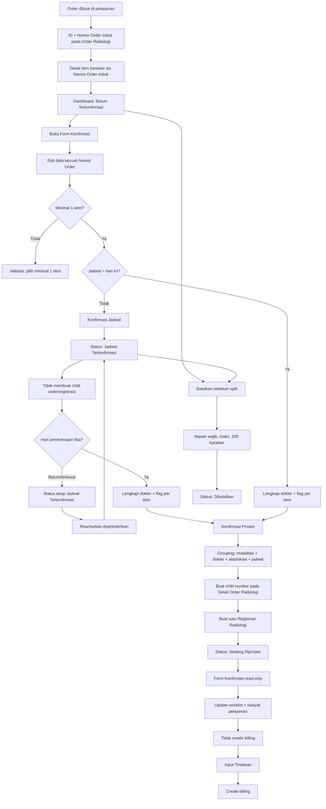

# PRD — Konfirmasi Order Radiologi

**Related Document:** Bisnis Proses Konfirmasi Order Radiologi; Bisnis Proses Pemecahan Nomor Order Radiologi; PRD Order Radiologi V2 (hard dependency); PRD Dashboard Radiologi (dokumen terpisah); PRD Riwayat Pemeriksaan Penunjang pada Pelayanan; Master Data Radiologi; Worklist Radiografer; Worklist Dokter Radiologi; Fitur Input Tindakan dan Billing  
**Dokumen ID:** PRD-RAD-KONF-v2.0 · **Versi:** 1.5 (Draft — Revisi pemisahan scope perubahan Dokter Radiologi melalui Dashboard)  
**Tanggal Disusun:** 22 Juli 2026 · **Penyusun:** Team Product — Tamtech International  
**Approver:** M. Sulthan Farras Nanz (Chief Strategy & Growth Officer) · **Reviewer Teknis:** `[PERLU KONFIRMASI]`  
**Status:** Untuk Direview · **Target Release:** `[PERLU KONFIRMASI]`

## 1. Overview / Brief Summary

Konfirmasi Order Radiologi adalah fitur yang digunakan radiografer untuk membuka order yang telah dikirim dari unit pelayanan, meninjau dan memperbarui data order, mengonfirmasi jadwal, serta menentukan **Dokter Radiologi** dan flag **Perlu Pemeriksaan Dokter** pada setiap Item Pemeriksaan sebelum pelayanan dimulai. Form menggunakan data Order Radiologi yang sudah dibuat dan dapat diedit selama order masih berstatus **Belum Terkonfirmasi** atau **Jadwal Terkonfirmasi**, sedangkan Nomor Order Induk selalu read-only.

Order baru masuk melalui Dashboard Radiologi dengan status **Belum Terkonfirmasi**. Order dengan jadwal hari ini dikonfirmasi satu kali dan langsung berubah menjadi **Sedang Diproses**. Order dengan jadwal bukan hari ini melalui dua layer: **Konfirmasi Jadwal** menjadi **Jadwal Terkonfirmasi**, kemudian **Konfirmasi Proses** pada hari pemeriksaan menjadi **Sedang Diproses**. Pada Konfirmasi Proses, setiap Item Pemeriksaan wajib memiliki Dokter Radiologi melalui dropdown single-select dan flag Perlu Pemeriksaan Dokter dengan pilihan Ya/Tidak serta default **Tidak**.

Pada saat status berubah menjadi Sedang Diproses, sistem melakukan pemecahan Nomor Order. Nomor Order Induk tetap tersimpan pada tabel Order Radiologi, sedangkan Nomor Order Turunan dibentuk pada tabel Detail Order Radiologi dengan format `NomorOrderInduk-Suffix`. Detail Order Radiologi tidak menyimpan `parent_order_id`; relasi detail terhadap Order Radiologi menggunakan Nomor Order Induk. Semua child order yang terbentuk dari satu transaksi Konfirmasi Proses menggunakan satu Registrasi Radiologi yang sama.

Setelah status menjadi **Sedang Diproses**, Form Konfirmasi Order Radiologi menjadi read-only dan tidak dapat digunakan untuk mengubah jadwal, data order, item, Dokter Radiologi, flag, melakukan reschedule, atau pembatalan. Skenario perubahan Dokter Radiologi melalui Dashboard setelah pelayanan masuk status Sedang Diproses berada di luar scope PRD ini dan diatur pada PRD Dashboard Radiologi.

Konfirmasi hanya membuat Registrasi Radiologi dan tidak membuat billing. Billing baru dibuat ketika petugas melakukan **Input Tindakan**. Setiap perubahan yang berhasil disimpan melalui Form Konfirmasi sebelum Konfirmasi Proses harus memperbarui informasi terkait pada Riwayat Pemeriksaan Penunjang di modul Pelayanan.

> Referensi: Bisnis Proses Konfirmasi Order Radiologi; Bisnis Proses Pemecahan Nomor Order Radiologi halaman 1–4; keputusan stakeholder tanggal 20–22 Juli 2026.

## 2. Background

**Kondisi saat ini (As-Is, Neurovi v1):**
- Seluruh Item Pemeriksaan yang berasal dari satu transaksi order menggunakan satu Nomor Order sampai proses pemeriksaan selesai.
- Unit pelayanan membuat Order Radiologi dan mengirimkannya ke radiologi.
- Radiografer membuka order dari dashboard dan melakukan konfirmasi.
- Penentuan Dokter Radiologi dan flag Perlu Pemeriksaan Dokter belum ditempatkan secara konsisten pada setiap Item Pemeriksaan.
- Konfirmasi jadwal, pelaksanaan pemeriksaan, pembentukan registrasi, dan billing belum dipisahkan secara tegas berdasarkan trigger bisnisnya.
- Jadwal hari ini dan jadwal masa depan belum memiliki layer konfirmasi yang berbeda.

**Masalah/pain point:**
- **Aspek bisnis proses:** satu Nomor Order belum cukup merepresentasikan kelompok pelayanan yang benar-benar dilaksanakan ketika satu order berisi banyak item dengan modalitas, dokter, alat/lokasi, atau jadwal berbeda.
- **Aspek penjadwalan:** reschedule tidak boleh menghasilkan child order baru sebelum pasien benar-benar datang dan pelayanan dimulai.
- **Aspek UX:** radiografer membutuhkan form editable sebelum pelayanan dimulai, tetapi data pelayanan harus dikunci setelah Konfirmasi Proses agar tidak terjadi perubahan pada order yang sudah masuk proses.
- **Aspek penugasan:** Dokter Radiologi dan kebutuhan pemeriksaan dokter ditentukan pada setiap Item Pemeriksaan.
- **Aspek integrasi:** perubahan melalui Form Konfirmasi sebelum pelayanan dimulai harus konsisten dengan Worklist, Riwayat Pemeriksaan Penunjang, registrasi, hasil, PACS/RIS, audit trail, dan billing.
- **Aspek data:** relasi parent-child harus mengikuti struktur tabel Order Radiologi dan Detail Order Radiologi tanpa menyimpan `parent_order_id` pada detail.

**Dampak utama yang disasar v2:**
- Memisahkan Nomor Order Induk sebagai referensi order dan Nomor Order Turunan sebagai referensi pelayanan aktual.
- Mengunci Form Konfirmasi setelah pelayanan masuk Sedang Diproses.
- Memisahkan Konfirmasi Jadwal dari Konfirmasi Proses.
- Membuat satu Registrasi Radiologi untuk seluruh child order dalam satu transaksi konfirmasi.
- Mencegah billing prematur dan menjaga keterlacakan perubahan.

**Strategi rilis Neurovi v2:**
- **Fase 1 (MVP):** form konfirmasi editable sebelum split, penugasan dokter dan flag per item, konfirmasi satu layer untuk jadwal hari ini, konfirmasi dua layer untuk jadwal masa depan, order splitting, satu registrasi per transaksi Konfirmasi Proses, sinkronisasi Riwayat Pemeriksaan Penunjang, form read-only setelah konfirmasi, reschedule sebelum split, pembatalan sebelum split, penyelesaian pemeriksaan, dan audit trail.

> Volume operasional: sekitar 150–200 pasien radiologi per hari; satu pasien dapat memiliki lebih dari satu order dan satu order dapat memiliki banyak Item Pemeriksaan.

## 3. In Scope

### Scope Definition (Fase 1 — MVP)

1. **Entry point dari Dashboard Radiologi** — radiografer membuka order berstatus Belum Terkonfirmasi atau Jadwal Terkonfirmasi. Detail dashboard berada pada PRD terpisah.
2. **Form Order Radiologi editable sebelum Konfirmasi Proses** — Jadwal Pemeriksaan, Dokter Pengirim, Diagnosa, Urgensi, dan Item Pemeriksaan dapat diubah; Nomor Order Induk tidak dapat diubah.
3. **Pengelolaan Item Pemeriksaan** — radiografer dapat menambah, menghapus, atau mengganti item dari Master Data Radiologi aktif.
4. **Validasi minimal item** — minimal satu Item Pemeriksaan wajib tersedia saat data disimpan atau dikonfirmasi.
5. **Dokter Radiologi per item** — setiap Item Pemeriksaan memiliki dropdown single-select Dokter Radiologi.
6. **Flag Perlu Pemeriksaan Dokter per item** — setiap Item Pemeriksaan memiliki pilihan Ya/Tidak dengan default Tidak.
7. **Konfirmasi jadwal hari ini** — Konfirmasi Proses dilakukan satu kali, membentuk child order, membuat registrasi, dan mengubah status menjadi Sedang Diproses.
8. **Konfirmasi jadwal masa depan — layer 1** — Konfirmasi Jadwal mengubah status menjadi Jadwal Terkonfirmasi tanpa membentuk child order dan registrasi.
9. **Konfirmasi proses pada hari pemeriksaan — layer 2** — radiografer menentukan dokter dan flag setiap item, kemudian status berubah menjadi Sedang Diproses.
10. **Jadwal terlewat** — order tetap berstatus Jadwal Terkonfirmasi dan dapat di-reschedule selama Konfirmasi Proses belum dilakukan.
11. **Urgensi pemeriksaan** — Normal, Cito Tanpa Expertise, dan Cito Dengan Expertise.
12. **Pemecahan Nomor Order** — child order dibentuk pada hari pelayanan dengan suffix berurutan mulai dari 1.
13. **Grouping child order** — item dikelompokkan berdasarkan kombinasi Modalitas, Dokter Radiologi, Alat/Lokasi, dan Jadwal Pemeriksaan.
14. **Struktur data parent-child** — ID dan Nomor Order Induk berada pada tabel Order Radiologi; Nomor Order Turunan berada pada tabel Detail Order Radiologi; detail tidak menyimpan `parent_order_id`.
15. **Satu registrasi untuk satu transaksi Konfirmasi Proses** — seluruh child order yang terbentuk dalam satu kali konfirmasi menggunakan Registrasi Radiologi yang sama.
16. **Form read-only setelah Konfirmasi Proses** — ketika status sudah Sedang Diproses, Form Konfirmasi tidak dapat diedit.
17. **Reschedule sebelum split** — perubahan jadwal hanya diperbolehkan selama child order belum terbentuk dan tidak membutuhkan alasan.
18. **Pembatalan sebelum split** — pembatalan hanya tersedia pada status Belum Terkonfirmasi atau Jadwal Terkonfirmasi, dengan alasan maksimal 200 karakter.
19. **Tanpa pembatalan setelah konfirmasi** — ketika status sudah Sedang Diproses, aksi Batalkan tidak tersedia.
20. **Tanpa pembuatan billing saat konfirmasi** — billing dibuat oleh Input Tindakan.
21. **Sinkronisasi Riwayat Pemeriksaan Penunjang** — setiap perubahan berhasil memperbarui data pemeriksaan terkait di Pelayanan.
22. **Worklist radiografer dan dokter radiologi** — diperbarui berdasarkan child order, item, status, jadwal, dan dokter.
23. **Pemeriksaan selesai** — radiografer menandai akuisisi gambar selesai sesuai proses pelayanan.
24. **Timeline aktivitas dan audit trail** — mencatat perubahan form, jadwal, item, dokter, flag, status, child number, registrasi, reschedule, dan pembatalan sebelum split.
25. **Cetak formulir permintaan radiologi**.

### Out Scope

- Spesifikasi lengkap layout, filter, dan seluruh kolom Dashboard Radiologi; berada pada PRD Dashboard Radiologi.
- Pembuatan awal Order Radiologi dari unit pengirim; berada pada PRD Order Radiologi V2.
- Seluruh perubahan data order melalui Form Konfirmasi setelah status Sedang Diproses.
- Perubahan Dokter Radiologi melalui Dashboard setelah status Sedang Diproses; diatur pada PRD Dashboard Radiologi.
- Reschedule setelah child order terbentuk.
- Pembatalan setelah status Sedang Diproses.
- Proses Input Tindakan dan perhitungan billing.
- Entry serta validasi hasil interpretasi radiologi.
- Pengelolaan file DICOM dan detail integrasi PACS/RIS eksternal. `[PERLU KONFIRMASI]`
- Output cetak hasil radiologi.
- Pengaturan Master Data Radiologi dan Master Staf.
- Detail kanal notifikasi lintas unit. `[PERLU KONFIRMASI]`

## 4. Goals and Metrics

### Tujuan

Menyediakan proses konfirmasi yang memastikan pelayanan radiologi dimulai menggunakan data, penugasan, child order, registrasi, worklist, dan riwayat pelayanan yang konsisten; mengunci form setelah pelayanan dimulai; serta memastikan billing hanya terbentuk melalui Input Tindakan.

### Metrik (terukur)

| Metrik | Target | Sumber |
|---|---|---|
| Waktu simpan konfirmasi | `< 1 detik` pada kondisi normal | NFR-001 |
| Pembaruan worklist | Real-time setelah transaksi berhasil | NFR-002 |
| Pembaruan Riwayat Pemeriksaan Penunjang | Real-time setelah transaksi berhasil | NFR-003 |
| Kapasitas operasional | Mendukung 150–200 pasien/hari dan banyak item/order | NFR-004 |
| Keunikan child order | 0 duplikasi suffix dan 0 penggunaan ulang child number | BR-034–BR-038 |
| Pencegahan suffix akibat reschedule | 0 child order baru hanya karena perubahan jadwal | BR-030 |
| Pencegahan billing prematur | 0 billing dibuat oleh proses konfirmasi | BR-025–BR-026 |
| Validasi minimum item | 100% transaksi simpan/konfirmasi memiliki minimal satu item | BR-007 |
| Penguncian form | 100% Form Konfirmasi read-only setelah status Sedang Diproses | BR-022 |

## 5. Related Feature & Stakeholder

### A. Modul Terkait

| Modul / Fitur | Peran terhadap Modul |
|---|---|
| Order Radiologi V2 | Sumber ID Order Radiologi, Nomor Order Induk, Jadwal, Dokter Pengirim, Diagnosa, Urgensi, dan Item Pemeriksaan. |
| Dashboard Radiologi | Entry point Form Konfirmasi. Detail dashboard dan perubahan Dokter Radiologi setelah status Sedang Diproses berada pada PRD terpisah. |
| Riwayat Pemeriksaan Penunjang pada Pelayanan | Konsumen perubahan data order, item, dokter, flag, status, dan Nomor Order Turunan. |
| Registrasi / Admisi | Membuat satu Registrasi Radiologi untuk seluruh child order dalam satu transaksi Konfirmasi Proses. |
| Master Data Radiologi | Sumber item, Modalitas, Alat/Lokasi, dan atribut teknis aktif. |
| Master Staf / Dokter | Sumber Dokter Pengirim dan Dokter Radiologi per item. |
| Master Diagnosa | Sumber Diagnosa sesuai definisi Order Radiologi. |
| Worklist Radiografer | Menampilkan child order dan antrean pemeriksaan. |
| Worklist Dokter Radiologi | Menerima item berdasarkan Dokter Radiologi yang dipilih. |
| Input Tindakan | Trigger pembuatan billing setelah tindakan diinput. |
| Billing / Kasir | Menerima billing dari Input Tindakan. |
| EMR / Hasil Radiologi | Menggunakan child order dan registrasi sebagai konteks hasil. |
| PACS/RIS | Menggunakan child order sebagai referensi pelayanan. |
| Audit Trail | Menyimpan perubahan data dan aktivitas user. |
| Cetak Formulir Permintaan | Menghasilkan dokumen permintaan radiologi. |

### B. Persona

| Persona | Tipe | Peran terhadap Modul |
|---|---|---|
| Radiografer | Primary | Mengedit form sebelum Konfirmasi Proses, mengelola item, mengisi dokter dan flag per item, mengonfirmasi jadwal/proses, serta melakukan reschedule atau pembatalan sebelum split. |
| Dokter/Perawat/Bidan unit pengirim | Secondary | Membuat order awal dan memantau perubahan melalui Riwayat Pemeriksaan Penunjang pada Pelayanan. |
| Dokter Spesialis Radiologi | Secondary | Menerima Item Pemeriksaan pada worklist sesuai penugasan. |
| Petugas Input Tindakan | Secondary | Menginput tindakan yang menjadi trigger billing. |
| Admin Master Data | Tersier | Menjaga master pemeriksaan, alat/lokasi, staf, dan diagnosa aktif. |

## 6. Business Process (As-Is / To-Be)

### A. As-Is (Neurovi v1)

1. Unit pelayanan membuat satu Order Radiologi yang dapat berisi satu atau banyak Item Pemeriksaan.
2. Seluruh item menggunakan satu Nomor Order sampai pelayanan selesai.
3. Order masuk ke Dashboard Radiologi.
4. Radiografer membuka dan mengonfirmasi order.
5. Penugasan dokter belum dikelola secara konsisten pada level item.
6. Konfirmasi jadwal dan pelaksanaan menggunakan pola yang sama.

### B. To-Be (Neurovi v2 — Fase 1 MVP)

1. Unit pelayanan membuat Order Radiologi; sistem membuat ID Order Radiologi dan Nomor Order Induk pada tabel Order Radiologi.
2. Detail item disimpan pada tabel Detail Order Radiologi dan terkait dengan order menggunakan Nomor Order Induk, tanpa menyimpan `parent_order_id`.
3. Order masuk ke Dashboard Radiologi dengan status **Belum Terkonfirmasi**.
4. Radiografer membuka Form Konfirmasi.
5. Sistem menampilkan Nomor Order Induk sebagai read-only; Jadwal, Dokter Pengirim, Diagnosa, Urgensi, dan Item Pemeriksaan dapat diedit.
6. Radiografer dapat menambah, menghapus, atau mengganti item, tetapi minimal satu item wajib tersedia saat simpan.
7. Setiap item menyediakan dropdown single-select Dokter Radiologi dan flag Perlu Pemeriksaan Dokter Ya/Tidak dengan default Tidak.
8. Sistem membandingkan Jadwal Pemeriksaan dengan tanggal hari ini pada timezone fasilitas.
9. **Jika jadwal hari ini:**
   1. Radiografer melengkapi dokter dan flag setiap item.
   2. Radiografer menyimpan Konfirmasi Proses.
   3. Sistem mengelompokkan item berdasarkan kombinasi Modalitas, Dokter Radiologi, Alat/Lokasi, dan Jadwal.
   4. Sistem membuat Nomor Order Turunan pada Detail Order Radiologi menggunakan format `NomorOrderInduk-Suffix`.
   5. Sistem membuat satu Registrasi Radiologi yang digunakan oleh seluruh child order dalam transaksi tersebut.
   6. Status pelayanan berubah menjadi Sedang Diproses.
   7. Worklist dan Riwayat Pemeriksaan Penunjang diperbarui.
   8. Form Konfirmasi menjadi read-only.
   9. Sistem tidak membuat billing.
10. **Jika jadwal bukan hari ini:**
    1. Radiografer menyimpan Konfirmasi Jadwal.
    2. Status menjadi Jadwal Terkonfirmasi.
    3. Child order, registrasi, dan worklist dokter belum dibuat.
    4. Form tetap editable dan radiografer dapat melakukan reschedule atau pembatalan.
11. **Jika tanggal pemeriksaan telah tiba:**
    1. Radiografer membuka order Jadwal Terkonfirmasi.
    2. Radiografer melengkapi dokter dan flag setiap item.
    3. Radiografer menyimpan Konfirmasi Proses.
    4. Sistem melakukan grouping, membentuk child order, membuat satu registrasi, memperbarui worklist/riwayat, mengubah status menjadi Sedang Diproses, dan mengunci form.
12. **Jika jadwal terlewat tanpa Konfirmasi Proses:**
    1. Status tetap Jadwal Terkonfirmasi.
    2. Radiografer dapat melakukan reschedule.
    3. Sistem tidak membentuk suffix atau child order sampai Konfirmasi Proses dilakukan.
13. Setelah status Sedang Diproses, seluruh perubahan Form Konfirmasi ditolak.
14. Reschedule dan pembatalan tidak tersedia setelah status Sedang Diproses.
15. Billing baru dibuat ketika petugas melakukan Input Tindakan.
16. Setelah akuisisi gambar selesai, proses pelayanan dapat dilanjutkan ke status Pemeriksaan Selesai sesuai fitur terkait.

### C. Perbedaan As-Is (V1) vs To-Be (V2)

| Aspek | As-Is (V1) | To-Be (V2) |
|---|---|---|
| Penomoran | Satu nomor untuk seluruh proses. | Nomor Order Induk pada Order Radiologi dan Nomor Order Turunan pada Detail Order Radiologi. |
| Relasi data | Belum ditegaskan. | Detail tidak menyimpan `parent_order_id`; relasi menggunakan Nomor Order Induk. |
| Trigger child order | Tidak ada. | Konfirmasi Proses pada hari pemeriksaan. |
| Grouping child | Tidak ada. | Kombinasi Modalitas, Dokter Radiologi, Alat/Lokasi, dan Jadwal. |
| Jadwal masa depan | Konfirmasi tunggal. | Konfirmasi Jadwal lalu Konfirmasi Proses. |
| Registrasi | Trigger belum tegas. | Satu registrasi untuk seluruh child order pada satu transaksi Konfirmasi Proses. |
| Edit form | Dapat berubah selama proses. | Editable sebelum Konfirmasi Proses; read-only setelah Sedang Diproses. |
| Perubahan Dokter Radiologi setelah Sedang Diproses | Belum dipisahkan secara tegas. | Di luar scope PRD ini; diatur pada PRD Dashboard Radiologi. |
| Reschedule | Belum dibatasi tegas. | Hanya sebelum child order terbentuk. |
| Pembatalan | Dapat dilakukan selama proses. | Hanya sebelum child order terbentuk; maksimal alasan 200 karakter. |
| Billing | Berpotensi terpicu saat konfirmasi. | Hanya dibuat melalui Input Tindakan. |

## 7. Main Flow / Mindmap

### Skenario 1 — Membuka dan Mengedit Form Order

1. Radiografer membuka order berstatus Belum Terkonfirmasi atau Jadwal Terkonfirmasi dari Dashboard Radiologi.
2. Sistem menampilkan konteks pasien, Nomor Order Induk, status, dan data order.
3. Nomor Order Induk bersifat read-only.
4. Jadwal, Dokter Pengirim, Diagnosa, Urgensi, dan Item Pemeriksaan dapat diedit.
5. Setiap perubahan yang berhasil disimpan memperbarui audit trail dan Riwayat Pemeriksaan Penunjang pada Pelayanan.
6. Jika status sudah Sedang Diproses, Form Konfirmasi hanya dapat dibuka secara read-only.

### Skenario 2 — Mengelola Item Pemeriksaan

1. Radiografer dapat menambah, menghapus, atau mengganti Item Pemeriksaan dari Master Data Radiologi aktif.
2. Setiap item memiliki Dokter Radiologi dan flag Perlu Pemeriksaan Dokter sendiri.
3. Sistem memvalidasi bahwa minimal satu Item Pemeriksaan tersedia saat Simpan, Konfirmasi Jadwal, maupun Konfirmasi Proses.
4. Jika tidak ada item, sistem menolak transaksi dan menampilkan pesan bahwa minimal satu pemeriksaan wajib dipilih.

### Skenario 3 — Mengisi Dokter dan Flag per Item

1. Setiap Item Pemeriksaan menampilkan dropdown single-select Dokter Radiologi.
2. Setiap item menampilkan flag Perlu Pemeriksaan Dokter dengan pilihan Ya/Tidak.
3. Nilai default flag adalah Tidak.
4. Pada Konfirmasi Proses, setiap item wajib memiliki Dokter Radiologi dan nilai flag.

### Skenario 4 — Konfirmasi Jadwal Hari Ini

1. Order berstatus Belum Terkonfirmasi dan jadwal adalah hari ini.
2. Radiografer melengkapi Dokter Radiologi dan flag pada setiap item.
3. Radiografer menyimpan Konfirmasi Proses.
4. Sistem melakukan grouping berdasarkan Modalitas, Dokter Radiologi, Alat/Lokasi, dan Jadwal.
5. Sistem membuat satu atau lebih Nomor Order Turunan pada Detail Order Radiologi.
6. Sistem membuat satu Registrasi Radiologi untuk seluruh child order yang terbentuk.
7. Status berubah menjadi Sedang Diproses.
8. Form Konfirmasi menjadi read-only.
9. Worklist dan Riwayat Pemeriksaan Penunjang diperbarui.
10. Billing tidak dibuat.

### Skenario 5 — Konfirmasi Jadwal Masa Depan (Layer 1)

1. Order berstatus Belum Terkonfirmasi dan jadwal bukan hari ini.
2. Radiografer menyimpan Konfirmasi Jadwal.
3. Status berubah menjadi Jadwal Terkonfirmasi.
4. Sistem belum membuat Nomor Order Turunan, registrasi, billing, atau Worklist Dokter Radiologi.
5. Form tetap editable untuk koreksi data, reschedule, atau pembatalan.

### Skenario 6 — Konfirmasi Proses pada Hari Pemeriksaan (Layer 2)

1. Radiografer membuka order berstatus Jadwal Terkonfirmasi pada hari pemeriksaan.
2. Radiografer melengkapi Dokter Radiologi dan flag pada setiap item.
3. Radiografer menyimpan Konfirmasi Proses.
4. Sistem melakukan grouping dan membentuk child order.
5. Semua child order menggunakan satu Registrasi Radiologi yang sama.
6. Status berubah menjadi Sedang Diproses dan Form Konfirmasi menjadi read-only.
7. Worklist dan Riwayat Pemeriksaan Penunjang diperbarui; billing tidak dibuat.

### Skenario 7 — Jadwal Terkonfirmasi Terlewat

1. Jadwal pemeriksaan telah lewat tetapi radiografer belum melakukan Konfirmasi Proses.
2. Status tetap Jadwal Terkonfirmasi.
3. Sistem belum membuat child order atau registrasi.
4. Radiografer dapat melakukan reschedule tanpa alasan.
5. Reschedule tidak menambah suffix.

### Skenario 8 — Reschedule Sebelum Pelayanan Dimulai

1. Order masih berstatus Belum Terkonfirmasi atau Jadwal Terkonfirmasi dan child order belum terbentuk.
2. Radiografer mengubah Jadwal Pemeriksaan.
3. Sistem tidak meminta alasan reschedule.
4. Sistem tidak membuat suffix baru.
5. Riwayat Pemeriksaan Penunjang dan audit trail diperbarui.
6. Setelah status Sedang Diproses, reschedule tidak tersedia.

### Skenario 9 — Pembatalan Sebelum Pelayanan Dimulai

1. Order masih berstatus Belum Terkonfirmasi atau Jadwal Terkonfirmasi.
2. Radiografer memilih Batalkan.
3. Sistem meminta Alasan Pembatalan berupa teks wajib maksimal 200 karakter.
4. Sistem mengubah status menjadi Dibatalkan dan memperbarui audit trail serta Riwayat Pemeriksaan Penunjang.
5. Setelah status Sedang Diproses, tombol/aksi Batalkan tidak tersedia.

### Skenario 10 — Pembentukan Billing melalui Input Tindakan

1. Status sudah Sedang Diproses dan Registrasi Radiologi telah tersedia.
2. Proses Konfirmasi tidak membuat billing.
3. Petugas melakukan Input Tindakan.
4. Billing dibuat berdasarkan tindakan yang benar-benar diinput dengan referensi child order dan Registrasi Radiologi terkait.

## 8. Business Rules

| ID | Rule | Sumber / Trace |
|---|---|---|
| **BR-001** | Order dari unit pelayanan masuk ke Dashboard Radiologi dengan status Belum Terkonfirmasi dan memiliki ID serta Nomor Order Induk pada tabel Order Radiologi. | FR-001; D-001 |
| **BR-002** | PRD ini menggunakan Dashboard Radiologi sebagai entry point; detail layout dashboard berada pada PRD terpisah. | Scope; FR-001 |
| **BR-003** | Form Konfirmasi editable hanya pada status Belum Terkonfirmasi atau Jadwal Terkonfirmasi. | FR-003; US-001 |
| **BR-004** | Nomor Order Induk selalu read-only. | FR-003 |
| **BR-005** | Jadwal, Dokter Pengirim, Diagnosa, Urgensi, dan Item Pemeriksaan dapat diubah sebelum Konfirmasi Proses. | FR-003; FR-004 |
| **BR-006** | Radiografer dapat menambah, menghapus, atau mengganti Item Pemeriksaan dari Master Data Radiologi aktif. | FR-004 |
| **BR-007** | Minimal satu Item Pemeriksaan wajib tersedia pada saat Simpan, Konfirmasi Jadwal, dan Konfirmasi Proses. | FR-004; US-002 |
| **BR-008** | Jika tidak ada Item Pemeriksaan, transaksi ditolak dengan validasi yang jelas. | FR-004 |
| **BR-009** | Jadwal tidak boleh lebih kecil dari tanggal order kecuali user memiliki kewenangan khusus. | FR-006 |
| **BR-010** | Urgensi hanya terdiri dari Normal, Cito Tanpa Expertise, dan Cito Dengan Expertise. | FR-006 |
| **BR-011** | Setiap item memiliki satu Dokter Radiologi dalam dropdown single-select. | FR-007 |
| **BR-012** | Setiap item memiliki flag Perlu Pemeriksaan Dokter Ya/Tidak dengan default Tidak. | FR-007 |
| **BR-013** | Dokter Radiologi dan flag disimpan pada level Item Pemeriksaan. | FR-007 |
| **BR-014** | Konfirmasi Proses hanya dapat disimpan jika setiap item memiliki Dokter Radiologi dan nilai flag. | FR-008 |
| **BR-015** | Jadwal hari ini menggunakan satu layer Konfirmasi Proses. | FR-005 |
| **BR-016** | Jadwal masa depan menggunakan Konfirmasi Jadwal lalu Konfirmasi Proses pada hari pemeriksaan. | FR-005 |
| **BR-017** | Konfirmasi Jadwal mengubah status menjadi Jadwal Terkonfirmasi tanpa membentuk child order atau registrasi. | FR-010 |
| **BR-018** | Jika jadwal terlewat dan Konfirmasi Proses belum dilakukan, status tetap Jadwal Terkonfirmasi. | FR-012 |
| **BR-019** | Order Jadwal Terkonfirmasi yang terlewat dapat di-reschedule selama child order belum terbentuk. | FR-012 |
| **BR-020** | Konfirmasi Proses membentuk child order, membuat registrasi, mengubah status menjadi Sedang Diproses, dan mengunci Form Konfirmasi. | FR-009–FR-011; FR-014 |
| **BR-021** | Seluruh child order yang dibentuk dalam satu transaksi Konfirmasi Proses menggunakan satu Registrasi Radiologi yang sama. | FR-011; D-005 |
| **BR-022** | Setelah status Sedang Diproses, Form Konfirmasi tidak dapat diedit. | FR-014 |
| **BR-023** | Setelah status Sedang Diproses, jadwal, Dokter Pengirim, Diagnosa, Urgensi, item, flag, dan atribut pemeriksaan tidak dapat diubah melalui Form Konfirmasi. | FR-014 |
| **BR-024** | Proses Konfirmasi tidak membuat billing. | FR-013 |
| **BR-025** | Billing hanya dibuat setelah Input Tindakan. | FR-013; FR-022 |
| **BR-026** | Konfirmasi Jadwal masa depan tidak membuat billing. | FR-013 |
| **BR-027** | Reschedule hanya diperbolehkan sebelum child order terbentuk. | FR-012 |
| **BR-028** | Reschedule tidak membutuhkan alasan. | FR-012 |
| **BR-029** | Reschedule setelah status Sedang Diproses tidak diperbolehkan. | FR-012; FR-014 |
| **BR-030** | Reschedule sebelum pelayanan dimulai tidak membuat child order atau suffix baru. | FR-009; FR-012 |
| **BR-031** | Nomor Order Induk menjadi referensi seluruh detail dan tidak berubah. | FR-009 |
| **BR-032** | Detail Order Radiologi tidak menyimpan `parent_order_id`. | FR-009; D-008 |
| **BR-033** | Relasi Detail Order Radiologi dengan Order Radiologi menggunakan Nomor Order Induk. | FR-009; D-008 |
| **BR-034** | Nomor Order Turunan disimpan pada tabel Detail Order Radiologi dengan format `NomorOrderInduk-Suffix`. | FR-009 |
| **BR-035** | Suffix berupa angka berurutan mulai dari 1 berdasarkan actual service sequence. | FR-009 |
| **BR-036** | Perubahan jadwal dan jumlah klik konfirmasi tidak menaikkan suffix. | FR-009 |
| **BR-037** | Nomor Order Turunan yang sudah terbentuk bersifat permanen, tidak dapat diubah, dan tidak dapat digunakan kembali. | FR-009 |
| **BR-038** | Item dikelompokkan menjadi child order berdasarkan kombinasi Modalitas, Dokter Radiologi, Alat/Lokasi, dan Jadwal Pemeriksaan. | FR-009; D-009 |
| **BR-039** | Item dengan nilai grouping yang sama menggunakan child number yang sama; perbedaan salah satu komponen grouping membentuk child order berbeda. | FR-009 |
| **BR-040** | Setiap child order memiliki jadwal, status, worklist, hasil, dan referensi integrasi sendiri. | FR-009; FR-015 |
| **BR-041** | Status setiap child order independen tanpa memengaruhi child lain dari Nomor Order Induk yang sama. | FR-010 |
| **BR-042** | Pembatalan hanya diperbolehkan sebelum child order terbentuk. | FR-018 |
| **BR-043** | Alasan Pembatalan wajib berupa teks, tidak boleh kosong, dan maksimal 200 karakter. | FR-018 |
| **BR-044** | Setelah status Sedang Diproses, aksi Batalkan tidak tersedia. | FR-014; FR-018 |
| **BR-045** | Setiap perubahan berhasil wajib memperbarui Riwayat Pemeriksaan Penunjang pada Pelayanan. | FR-016 |
| **BR-046** | Data sinkron mencakup jadwal, Dokter Pengirim, Diagnosa, Urgensi, item, Dokter Radiologi per item, flag per item, status, child number, reschedule, dan pembatalan sebelum split. | FR-016 |
| **BR-047** | Split, suffix, satu registrasi, status, worklist, sinkronisasi riwayat, dan audit harus konsisten dalam satu transaksi logis. | NFR-008 |
| **BR-048** | Cetak formulir permintaan dapat dilakukan dari detail order. | FR-020 |
| **BR-049** | Seluruh aksi mengikuti kontrol akses berdasarkan role dan kewenangan. | FR-021 |

## 9. State Machine

### 9.1 Status Order Sebelum Split

| State | Makna | Trigger | Aktor |
|---|---|---|---|
| **Belum Terkonfirmasi** | Order telah dikirim dan masih menggunakan Nomor Order Induk. | Order disimpan dari pelayanan. | Dokter/Perawat/Bidan |
| **Jadwal Terkonfirmasi** | Jadwal telah dikonfirmasi, tetapi pelayanan belum dimulai dan child order belum terbentuk. | Konfirmasi Jadwal disimpan. | Radiografer |
| **Dibatalkan** | Order dibatalkan sebelum child order terbentuk. | Pembatalan dengan alasan maksimal 200 karakter. | Radiografer berwenang |

### 9.2 Status Setelah Split

| State | Makna | Trigger | Aktor |
|---|---|---|---|
| **Sedang Diproses** | Child order dan registrasi telah terbentuk; pelayanan mulai diproses; Form Konfirmasi terkunci. | Konfirmasi Proses berhasil. | Radiografer |
| **Menunggu Expertise** | Pelayanan menunggu interpretasi dokter radiologi. | Trigger detail pada PRD hasil radiologi. | Sistem/Dokter Radiologi |
| **Pemeriksaan Selesai** | Akuisisi gambar selesai dan siap dilanjutkan ke hasil. | Penyelesaian pemeriksaan. | Radiografer |

### 9.3 Transisi Utama

**Jadwal hari ini:**  
`Belum Terkonfirmasi → Konfirmasi Proses + Split → Sedang Diproses`

**Jadwal masa depan:**  
`Belum Terkonfirmasi → Jadwal Terkonfirmasi → Konfirmasi Proses + Split → Sedang Diproses`

**Reschedule sebelum split:**  
`Belum Terkonfirmasi / Jadwal Terkonfirmasi → status tetap sesuai proses` tanpa suffix baru.

**Jadwal terlewat:**  
`Jadwal Terkonfirmasi → Jadwal Terkonfirmasi` dan dapat di-reschedule.

**Pembatalan sebelum split:**  
`Belum Terkonfirmasi / Jadwal Terkonfirmasi → Dibatalkan`

Tidak tersedia transisi **Sedang Diproses → Dibatalkan** melalui fitur ini.

### 9.4 Guard Transisi

| Dari | Ke | Guard / Efek |
|---|---|---|
| Belum Terkonfirmasi | Jadwal Terkonfirmasi | Jadwal bukan hari ini; minimal satu item; belum membuat child order/registrasi. |
| Belum Terkonfirmasi | Sedang Diproses | Jadwal hari ini; minimal satu item; setiap item memiliki dokter dan flag; split + satu registrasi + worklist + sinkronisasi berhasil. |
| Jadwal Terkonfirmasi | Sedang Diproses | Hari pemeriksaan telah tiba; minimal satu item; setiap item memiliki dokter dan flag; split + satu registrasi + worklist + sinkronisasi berhasil. |
| Jadwal Terkonfirmasi | Jadwal Terkonfirmasi | Reschedule sebelum split, termasuk ketika jadwal lama sudah terlewat. |
| Belum Terkonfirmasi/Jadwal Terkonfirmasi | Dibatalkan | User berwenang; alasan 1–200 karakter; child order belum terbentuk. |

### 9.5 Aturan Tampilan dan Edit Form

| Kondisi | Form Konfirmasi | Dokter & Flag pada Item | Reschedule | Batalkan | Aksi Utama |
|---|---|---|---|---|---|
| Belum Terkonfirmasi + jadwal hari ini | Editable kecuali Nomor Order | Wajib pada Konfirmasi Proses | Ya, sebelum konfirmasi | Ya | Konfirmasi Proses |
| Belum Terkonfirmasi + jadwal masa depan | Editable kecuali Nomor Order | Belum difinalkan | Ya | Ya | Konfirmasi Jadwal |
| Jadwal Terkonfirmasi + sebelum/tepat/terlewat tanggal | Editable kecuali Nomor Order | Wajib ketika Konfirmasi Proses | Ya | Ya | Reschedule / Konfirmasi Proses |
| Sedang Diproses | Read-only seluruhnya | Read-only pada form | Tidak | Tidak | Lihat Detail |
| Dibatalkan | Read-only | Read-only | Tidak | Tidak | Lihat Detail |

## 10. Pemecahan Nomor Order (Order Splitting)

### 10.1 Struktur Data Order Radiologi

1. Saat order dibuat dari Pelayanan, sistem membuat:
   - `id` Order Radiologi pada tabel Order Radiologi;
   - Nomor Order Induk pada tabel Order Radiologi.
2. Tabel Detail Order Radiologi menyimpan Item Pemeriksaan dan berelasi terhadap Order Radiologi berdasarkan Nomor Order Induk.
3. Tabel Detail Order Radiologi **tidak menyimpan `parent_order_id`**.
4. Saat Konfirmasi Proses, sistem mengisi Nomor Order Turunan pada baris Detail Order Radiologi.
5. Beberapa baris detail yang termasuk dalam kelompok pelayanan yang sama dapat memiliki Nomor Order Turunan yang sama.

### 10.2 Format dan Trigger Nomor Order Turunan

- Format: `NomorOrderInduk-Suffix`.
- Contoh: `2607160111-1`, `2607160111-2`, `2607160111-3`.
- Suffix dimulai dari 1 dan mengikuti urutan pelayanan aktual.

| Kondisi | Trigger | Hasil |
|---|---|---|
| Jadwal hari ini | Konfirmasi Proses | Child number langsung dibuat pada detail. |
| Jadwal masa depan | Konfirmasi Jadwal | Child number belum dibuat. |
| Hari pemeriksaan tiba | Konfirmasi Proses kedua | Child number dibuat pada detail. |
| Jadwal terlewat tanpa konfirmasi | Tidak ada Konfirmasi Proses | Status tetap Jadwal Terkonfirmasi; child number belum dibuat. |
| Reschedule sebelum split | Simpan jadwal baru | Tidak membuat suffix baru. |

### 10.3 Kriteria Grouping Child Order

Item Pemeriksaan dikelompokkan berdasarkan kombinasi berikut:

1. **Modalitas**;
2. **Dokter Radiologi**;
3. **Alat/Lokasi pelayanan**; dan
4. **Jadwal Pemeriksaan**.

Item dengan seluruh nilai grouping yang sama menggunakan satu Nomor Order Turunan. Apabila salah satu nilai grouping berbeda, sistem membentuk Nomor Order Turunan yang berbeda.

### 10.4 Registrasi Radiologi

- Satu transaksi Konfirmasi Proses dapat menghasilkan satu atau beberapa child order.
- Seluruh child order yang terbentuk pada transaksi tersebut menggunakan **satu Registrasi Radiologi yang sama**.
- Registrasi dibuat satu kali secara idempotent.
- Retry transaksi tidak boleh menghasilkan registrasi ganda.

### 10.5 Permanensi Child Number

- Nomor Order Turunan tidak boleh diubah setelah terbentuk.
- Nomor Order Turunan tidak boleh digunakan kembali.
- Nomor Order Turunan tetap menjadi referensi hasil, PACS/RIS, billing, dan audit trail.
- Reschedule tidak diperbolehkan setelah Nomor Order Turunan terbentuk.
- Pembatalan tidak tersedia setelah Nomor Order Turunan terbentuk melalui Konfirmasi Proses.

## 11. Functional Requirements

| ID | Functional Requirement | Trace |
|---|---|---|
| **FR-001** | **Buka form dari dashboard** — radiografer dapat membuka Form Konfirmasi dari Dashboard Radiologi. | BR-001; BR-002 |
| **FR-002** | **Tampilkan konteks pasien dan order** — sistem menampilkan identitas pasien, status, unit pengirim, Nomor Order Induk, Nomor Order Turunan bila sudah terbentuk, dan registrasi terkait. | Data Requirements |
| **FR-003** | **Form editable sebelum Konfirmasi Proses** — radiografer dapat mengubah Jadwal, Dokter Pengirim, Diagnosa, Urgensi, dan Item Pemeriksaan hanya ketika status Belum Terkonfirmasi atau Jadwal Terkonfirmasi; Nomor Order read-only. | BR-003–BR-005 |
| **FR-004** | **Kelola dan validasi Item Pemeriksaan** — radiografer dapat menambah, menghapus, atau mengganti item dari master aktif dan sistem mewajibkan minimal satu item saat simpan. | BR-006–BR-008 |
| **FR-005** | **Kontrol layer konfirmasi** — sistem menentukan Konfirmasi Jadwal atau Konfirmasi Proses berdasarkan tanggal pemeriksaan dan status. | BR-015–BR-020 |
| **FR-006** | **Penjadwalan dan Urgensi** — radiografer dapat mengubah jadwal sebelum split dan memilih Normal, Cito Tanpa Expertise, atau Cito Dengan Expertise. | BR-009; BR-010; BR-027–BR-030 |
| **FR-007** | **Dokter dan flag per item** — setiap item menyediakan dropdown single-select Dokter Radiologi dan flag Ya/Tidak dengan default Tidak. | BR-011–BR-013 |
| **FR-008** | **Validasi Konfirmasi Proses** — seluruh item wajib memiliki Dokter Radiologi dan nilai flag sebelum Konfirmasi Proses berhasil. | BR-014 |
| **FR-009** | **Order splitting** — sistem melakukan grouping berdasarkan Modalitas, Dokter Radiologi, Alat/Lokasi, dan Jadwal, kemudian menyimpan child number pada Detail Order Radiologi tanpa `parent_order_id`. | BR-031–BR-040 |
| **FR-010** | **Kelola status** — sistem mengelola Belum Terkonfirmasi, Jadwal Terkonfirmasi, Sedang Diproses, Pemeriksaan Selesai, dan Dibatalkan sebelum split sesuai state machine. | State Machine |
| **FR-011** | **Create satu Registrasi Radiologi** — satu transaksi Konfirmasi Proses membuat satu registrasi yang digunakan seluruh child order hasil transaksi. | BR-020; BR-021 |
| **FR-012** | **Reschedule sebelum split** — reschedule tanpa alasan hanya diperbolehkan sebelum child order terbentuk; order terlewat tetap Jadwal Terkonfirmasi dan dapat di-reschedule. | BR-018; BR-019; BR-027–BR-030 |
| **FR-013** | **Tidak create billing** — konfirmasi tidak membuat billing; billing dibuat oleh Input Tindakan. | BR-024–BR-026 |
| **FR-014** | **Kunci Form Konfirmasi** — setelah status Sedang Diproses, seluruh field Form Konfirmasi menjadi read-only serta aksi reschedule dan pembatalan tidak tersedia. | BR-022; BR-023; BR-029; BR-044 |
| **FR-015** | **Pembaruan worklist** — worklist radiografer dan dokter diperbarui real-time berdasarkan child number, status, jadwal, dan Dokter Radiologi per item. | BR-020; BR-040 |
| **FR-016** | **Sinkronisasi Riwayat Pemeriksaan Penunjang** — setiap perubahan berhasil memperbarui data terkait pada Riwayat Pemeriksaan Penunjang di Pelayanan. | BR-045; BR-046 |
| **FR-017** | **Timeline dan audit trail** — sistem menyimpan aktor, waktu, before/after, child number, registrasi, status, item, dokter, flag, reschedule, dan pembatalan sebelum split. | BR-047 |
| **FR-018** | **Pembatalan sebelum split** — user berwenang dapat membatalkan order berstatus Belum Terkonfirmasi atau Jadwal Terkonfirmasi dengan alasan wajib maksimal 200 karakter. | BR-042–BR-044 |
| **FR-019** | **Pemeriksaan selesai** — radiografer dapat melanjutkan pelayanan ke status Pemeriksaan Selesai setelah akuisisi gambar selesai. | State Machine |
| **FR-020** | **Cetak formulir permintaan** — user dapat membuka print preview/cetak dari detail order. | BR-048 |
| **FR-021** | **RBAC dan feedback transaksi** — akses aksi mengikuti kewenangan; UI hanya berubah setelah transaksi berhasil. | BR-049; NFR-006; NFR-008 |
| **FR-022** | **Trigger billing dari Input Tindakan** — sistem menyediakan referensi child number dan registrasi agar Input Tindakan dapat membuat billing. | BR-025 |

## 12. User Stories

| ID | User Story | Acceptance Criteria (Given-When-Then) | Trace |
|---|---|---|---|
| **US-001** | Sebagai radiografer, saya ingin mengedit form sebelum pelayanan dimulai, sehingga data pemeriksaan dapat disesuaikan tanpa membuat order baru. | **Given** status Belum Terkonfirmasi atau Jadwal Terkonfirmasi, **When** form dibuka, **Then** field utama editable kecuali Nomor Order. | FR-003 |
| **US-002** | Sebagai radiografer, saya ingin mengelola item tetapi tetap menyisakan minimal satu pemeriksaan, sehingga order tidak dapat disimpan dalam keadaan kosong. | **Given** radiografer menghapus item, **When** Simpan/Konfirmasi dilakukan tanpa item, **Then** sistem menolak transaksi dan meminta minimal satu item dipilih. | FR-004; BR-007; BR-008 |
| **US-003** | Sebagai radiografer, saya ingin menentukan Dokter Radiologi dan flag pada setiap item, sehingga penugasan pelayanan tercatat sesuai item. | **Given** form berisi Item Pemeriksaan, **When** dokter dan flag dipilih, **Then** nilai disimpan pada level item dan wajib lengkap pada Konfirmasi Proses. | FR-007; FR-008 |
| **US-004** | Sebagai radiografer, saya ingin mengonfirmasi order jadwal hari ini, sehingga child order dan registrasi terbentuk ketika pelayanan dimulai. | **Given** jadwal hari ini dan seluruh item valid, **When** Konfirmasi Proses disimpan, **Then** child number terbentuk sesuai grouping, satu registrasi dibuat, status menjadi Sedang Diproses, form terkunci, worklist/riwayat diperbarui, dan billing tidak dibuat. | FR-005; FR-008–FR-016 |
| **US-005** | Sebagai radiografer, saya ingin mengonfirmasi jadwal masa depan terlebih dahulu, sehingga child order tidak dibuat terlalu awal. | **Given** jadwal bukan hari ini, **When** Konfirmasi Jadwal disimpan, **Then** status menjadi Jadwal Terkonfirmasi tanpa child order dan registrasi. | FR-005; FR-010–FR-013 |
| **US-006** | Sebagai radiografer, saya ingin melakukan konfirmasi kedua pada hari pemeriksaan, sehingga pelayanan aktual memiliki child order dan satu registrasi yang benar. | **Given** status Jadwal Terkonfirmasi dan hari pemeriksaan telah tiba, **When** Konfirmasi Proses disimpan, **Then** child number dibentuk, satu registrasi digunakan seluruh child, status menjadi Sedang Diproses, dan form terkunci. | FR-005; FR-009–FR-014 |
| **US-007** | Sebagai radiografer, saya ingin melakukan reschedule sebelum pelayanan dimulai, sehingga jadwal dapat disesuaikan tanpa membentuk suffix baru. | **Given** child order belum terbentuk, **When** jadwal diubah, **Then** sistem tidak meminta alasan dan tidak membentuk suffix baru. | FR-012 |
| **US-008** | Sebagai radiografer, saya ingin order yang jadwalnya terlewat tetap dapat di-reschedule, sehingga pelayanan dapat dijadwalkan ulang tanpa status tambahan. | **Given** status Jadwal Terkonfirmasi dan tanggal jadwal telah lewat, **When** dashboard/form dibuka, **Then** status tetap Jadwal Terkonfirmasi dan reschedule tetap tersedia. | FR-012; BR-018; BR-019 |
| **US-009** | Sebagai radiografer, saya ingin Form Konfirmasi terkunci setelah pelayanan dimulai, sehingga data order yang sudah diproses tidak berubah. | **Given** status Sedang Diproses, **When** Form Konfirmasi dibuka, **Then** seluruh field read-only dan aksi reschedule/batalkan tidak tersedia. | FR-014 |
| **US-010** | Sebagai sistem, saya ingin mengelompokkan item berdasarkan Modalitas, Dokter, Alat/Lokasi, dan Jadwal, sehingga setiap child order merepresentasikan satu kelompok pelayanan aktual. | **Given** beberapa item siap diproses, **When** Konfirmasi Proses dilakukan, **Then** item dengan grouping sama memakai child number yang sama dan perbedaan grouping membentuk child berbeda. | FR-009 |
| **US-011** | Sebagai sistem, saya ingin menggunakan Nomor Order Induk sebagai relasi tanpa menyimpan `parent_order_id` pada detail, sehingga struktur data mengikuti desain tabel radiologi. | **Given** order dan detail tersedia, **When** split dilakukan, **Then** child number disimpan pada detail dan relasi ke order menggunakan Nomor Order Induk. | FR-009 |
| **US-012** | Sebagai petugas pelayanan, saya ingin billing dibuat saat Input Tindakan, sehingga tagihan sesuai tindakan yang diberikan. | **Given** status Sedang Diproses dan registrasi tersedia, **When** Input Tindakan disimpan, **Then** billing dibuat; proses konfirmasi tidak menghasilkan billing. | FR-013; FR-022 |
| **US-013** | Sebagai radiografer, saya ingin membatalkan order sebelum pelayanan dimulai dengan alasan, sehingga pembatalan tercatat dan tidak masuk proses. | **Given** status Belum Terkonfirmasi atau Jadwal Terkonfirmasi, **When** alasan 1–200 karakter diisi dan pembatalan disimpan, **Then** status menjadi Dibatalkan dan audit/riwayat diperbarui. | FR-018 |
| **US-014** | Sebagai user pelayanan, saya ingin Riwayat Pemeriksaan Penunjang menampilkan perubahan terbaru, sehingga data pelayanan konsisten dengan radiologi. | **Given** perubahan berhasil disimpan, **When** riwayat pelayanan dibuka, **Then** data terbaru tampil tanpa menghapus histori audit. | FR-016; FR-017 |

## 13. Data Requirements (Spesifikasi Field)

> Field demografi, registrasi, dokter, diagnosa, dan penjamin **reuse definisi kanonik dari modul Registrasi/Admisi dan Order Radiologi V2**. Data requirement Dashboard Radiologi tidak dicantumkan karena menjadi cakupan PRD terpisah.

### A. Layar TAMPIL — Konteks Pasien dan Order

| Kolom | Sumber Data | Format Tampilan | Filter/Sort | Catatan |
|---|---|---|---|---|
| Identitas Pasien | Pasien | Nama, No. RM, tanggal lahir, jenis kelamin, umur | — | Read-only. |
| Unit Pengirim | Pelayanan Asal Order Radiologi | Teks | — | Read-only. |
| Penjamin | Registrasi asal | Teks | — | Read-only. |

### B. Layar INPUT — Form Konfirmasi Order Radiologi

| Field | Label | Tipe | Wajib | Validasi/Format | Sumber/Default | Catatan |
|---|---|---|---|---|---|---|
| `order_number` | Nomor Order Induk | text/read-only | Ya | Unik; tidak dapat diubah | Tabel Order Radiologi | Tetap sebagai referensi parent. |
| `examination_datetime` | Jadwal Pemeriksaan | datetime | Ya | Tidak boleh sebelum tanggal order kecuali berwenang | Order Radiologi | Editable hanya sebelum Sedang Diproses. |
| `urgency` | Urgensi | single-select | Ya | Normal / Cito Tanpa Expertise / Cito Dengan Expertise | Default Normal | Editable hanya sebelum Sedang Diproses. |
| `referring_doctor_id` | Dokter Pengirim | searchable lookup | Ya | Dokter/staf aktif | Order Radiologi / Master Staf | Editable hanya sebelum Sedang Diproses. |
| `diagnosis` | Diagnosa | searchable select | Ya | Mengikuti PRD Order Radiologi | Order Radiologi / Master Diagnosa | Editable hanya sebelum Sedang Diproses. |
| `fasting_status` | Status Puasa | radio/boolean | Ya | Ya/Tidak | Tidak | Dapat diubah user. |
| `pregnancy_status` | Status Hamil | radio/boolean | Ya | Ya/Tidak | Tidak | Dapat diubah user. |
| `examination_items` | Item Pemeriksaan | repeatable list / expandable | Ya | Minimal satu item; master aktif | Detail Order Radiologi + Master | Mendukung tambah, hapus, dan ganti sebelum Sedang Diproses. |
| `examination_items[].radiologist_id` | Dokter Radiologi | searchable dropdown single-select | Kondisional | Wajib pada Konfirmasi Proses | Master Staf | Disimpan per item; read-only pada Form Konfirmasi setelah Sedang Diproses. |
| `examination_items[].requires_doctor_examination` | Perlu Pemeriksaan Dokter | radio/segmented control | Kondisional | Ya/Tidak | Default Tidak | Disimpan per item; read-only setelah Sedang Diproses. |
| `modality_code` | Modalitas | read-only/snapshot | Ya | Master Radiologi | Master item | Contoh CT, MRI, USG. |
| `organ_group_id` | Kelompok Organ | read-only/snapshot | Ya | Master Radiologi | Master item | Menentukan pengelompokan tampilan. |
| `exam_name_snapshot` | Nama Pemeriksaan | read-only/snapshot | Ya | Teks saat transaksi | Master item saat simpan | Histori tidak berubah saat master berubah. |
| `scan_technique_id` | Teknik Pemindaian | dropdown | Kondisional | Opsi sesuai master | - | Ditampilkan bila dikonfigurasi. |
| `projection_id` | Posisi/Proyeksi | dropdown | Kondisional | Opsi sesuai master | - | Wajib bila flag master aktif. |
| `laterality_code` | Sisi Tubuh | radio/dropdown | Kondisional | Kiri/Kanan/Bilateral/dll. sesuai master | Tidak ada | Wajib bila flag master aktif. |
| `contrast_usage` | Penggunaan Kontras | dropdown/boolean | Kondisional | Hanya bila `supports_contrast = true` | Konfigurasi master | Contoh Non Kontras/Kontras. |
| `contrast_type_id` | Jenis Kontras | dropdown | Kondisional | Opsi master kontras | Tidak ada | Wajib untuk pemeriksaan yang membutuhkan kontras. |
| `item_note` | Catatan | textarea | Tidak atau kondisional | Maksimum **500 karakter**; counter `n/500`; karakter ke-501 ditolak | Manual | Disimpan independen per item. |

### C. Data Dibuat atau Diperbarui saat Simpan

| Data | Lokasi | Tipe/Format | Sumber | Catatan |
|---|---|---|---|---|
| ID Order Radiologi | Tabel Order Radiologi | ID sistem | Dibuat saat order dari Pelayanan | ID parent hanya berada pada tabel Order Radiologi. |
| Nomor Order Induk | Tabel Order Radiologi | text unik | Dibuat saat order dari Pelayanan | Menjadi referensi relasi dengan detail. |
| Referensi Nomor Order Induk pada detail | Tabel Detail Order Radiologi | text/reference | Nomor Order Induk | Digunakan sebagai relasi; tidak menggunakan `parent_order_id`. |
| Nomor Order Turunan | Tabel Detail Order Radiologi | `NomorOrderInduk-Suffix` | Dibuat pada Konfirmasi Proses | Item dengan grouping sama memiliki child number sama. |
| Suffix | Tabel Detail Order Radiologi | integer mulai 1 | Sequence per Nomor Order Induk | Berdasarkan actual service sequence. |
| Dokter Radiologi | Tabel Detail Order Radiologi | reference | Input per item | Dikunci pada Form Konfirmasi setelah Sedang Diproses. |
| Flag Perlu Pemeriksaan Dokter | Tabel Detail Order Radiologi | boolean/enum Ya-Tidak | Input per item; default Tidak | Dikunci setelah Sedang Diproses. |
| Registrasi Radiologi | Registrasi/relasi pelayanan | reference | Dibuat pada Konfirmasi Proses | Satu ID registrasi digunakan seluruh child order dalam satu transaksi. |
| Status | Order/Detail Order Radiologi | enum | State machine | Dikelola sesuai tahap proses. |
| Waktu/User Konfirmasi Jadwal | Audit/Order | datetime + reference | Waktu server + user login | Layer 1. |
| Waktu/User Konfirmasi Proses | Audit/Order | datetime + reference | Waktu server + user login | Trigger split dan lock form. |
| Referensi Worklist Radiografer | Worklist | reference | Sistem | Mengikuti child, jadwal, dan status. |
| Referensi Worklist Dokter | Worklist | repeatable reference | Sistem | Mengikuti dokter per item. |
| Waktu Sinkron Riwayat Pelayanan | Sinkronisasi | datetime | Waktu server | Diisi setelah sinkronisasi berhasil. |
| Audit Event | Audit Trail | reference | Dibuat setiap perubahan | Menyimpan before/after dan aktor. |
| Referensi Billing | — | — | Tidak dibuat oleh Konfirmasi | Dibuat oleh Input Tindakan. |

### D. Layar TAMPIL — Timeline Aktivitas

| Kolom | Sumber Data | Format Tampilan | Filter/Sort | Catatan |
|---|---|---|---|---|
| Waktu | Audit Trail | `DD MMM YYYY, HH:mm:ss` | Urut waktu | Waktu server/fasilitas. |
| Aktivitas | Audit Trail | Teks + ikon | Filter tipe opsional | Edit form, konfirmasi jadwal, split, konfirmasi proses, reschedule, selesai, dan pembatalan sebelum split. |
| User | Audit Trail / Master Staf | Nama + role | — | Aktor aktivitas. |
| Nomor Order Induk | Audit Trail | Teks | — | Referensi order. |
| Nomor Order Turunan | Audit Trail | Teks | — | Tampil jika child sudah terbentuk. |
| Item Pemeriksaan | Audit Trail | Nama item | — | Aktivitas level item. |
| Nilai Sebelum | Audit Trail | Teks terstruktur | — | Nilai sebelum perubahan. |
| Nilai Sesudah | Audit Trail | Teks terstruktur | — | Nilai sesudah perubahan. |
| Alasan | Audit Trail | Teks | — | Untuk pembatalan sebelum split; maksimal 200 karakter. |

### E. Layar INPUT — Pembatalan Sebelum Split

| Field | Label | Tipe | Wajib | Validasi/Format | Sumber/Default | Catatan |
|---|---|---|---|---|---|---|
| `cancellation_reason` | Alasan Pembatalan | textarea | Ya | 1–200 karakter | Manual | Hanya pada Belum Terkonfirmasi/Jadwal Terkonfirmasi. |
| `cancelled_by` | Dibatalkan Oleh | read-only | Ya | User login | Sistem | Audit. |
| `cancelled_at` | Waktu Pembatalan | read-only | Ya | Waktu server | Sistem | Audit. |

## 14. Non-Functional Requirements

| ID | Kategori | Requirement | Sumber |
|---|---|---|---|
| **NFR-001** | Performa | Simpan konfirmasi harus selesai dalam `< 1 detik` pada kondisi layanan normal. | Metrik sumber |
| **NFR-002** | Real-Time | Worklist radiografer dan dokter diperbarui real-time setelah transaksi berhasil. | FR-015 |
| **NFR-003** | Real-Time | Riwayat Pemeriksaan Penunjang diperbarui real-time setelah perubahan berhasil. | FR-016 |
| **NFR-004** | Skalabilitas | Mendukung 150–200 pasien/hari, banyak order per pasien, banyak item, dan banyak child per order. | Sumber bisnis proses |
| **NFR-005** | Responsivitas | Form, daftar item, pencarian dokter, dan timeline tetap responsif pada volume tinggi. | FR-003–FR-008 |
| **NFR-006** | Keamanan / RBAC | Edit, konfirmasi, reschedule, dan pembatalan sebelum split mengikuti kewenangan. | FR-021 |
| **NFR-007** | Auditabilitas | Seluruh perubahan memiliki aktor, waktu, nilai sebelum/sesudah, dan referensi order/item. | FR-017 |
| **NFR-008** | Reliabilitas | Split, suffix, satu registrasi, status, worklist, sinkronisasi riwayat, dan audit harus atomik/idempotent atau memiliki rekonsiliasi aman. | BR-047 |
| **NFR-009** | Keunikan Penomoran | Tidak boleh ada duplikasi suffix pada Nomor Order Induk yang sama. | BR-034–BR-037 |
| **NFR-010** | Konsistensi Data | Detail tidak menyimpan `parent_order_id`; relasi parent-detail menggunakan Nomor Order Induk secara konsisten. | BR-032; BR-033 |
| **NFR-011** | Penguncian Data | Setelah Sedang Diproses, Form Konfirmasi wajib read-only di FE dan ditolak pula oleh validasi BE. | FR-014 |
| **NFR-012** | Konsistensi Billing | Konfirmasi tidak menghasilkan billing; billing hanya dari Input Tindakan. | FR-013; FR-022 |
| **NFR-013** | Usability | UI membedakan Konfirmasi Jadwal dan Konfirmasi Proses serta menunjukkan kapan child order belum terbentuk. | FR-005 |
| **NFR-014** | Aksesibilitas | Status dan validasi tidak hanya dibedakan dengan warna; gunakan teks, ikon, dan dukungan keyboard. | Praktik UI Neurovi `[ASUMSI]` |

## 15. Integrasi Internal, Eksternal & Dependency

| Integrasi / Modul | Fungsi di modul ini | Status | Trace |
|---|---|---|---|
| **Order Radiologi V2** | Menyediakan parent order dan data awal form. | Internal / Hard dependency | FR-001–FR-004 |
| **Dashboard Radiologi** | Entry point Form Konfirmasi. Detail dashboard dan perubahan Dokter Radiologi setelah status Sedang Diproses berada di luar scope PRD ini. | Internal / Hard dependency | FR-001 |
| **Riwayat Pemeriksaan Penunjang pada Pelayanan** | Menerima perubahan data order, item, dokter, flag, status, dan child number. | Internal / Hard dependency | FR-016 |
| **Registrasi / Admisi** | Membuat satu registrasi per transaksi Konfirmasi Proses. | Internal / Hard dependency | FR-011 |
| **Master Data Radiologi** | Menyediakan item, Modalitas, dan Alat/Lokasi aktif. | Internal / Hard dependency | FR-004; FR-009 |
| **Master Staf / Dokter** | Menyediakan Dokter Pengirim dan Dokter Radiologi pada Form Konfirmasi. | Internal / Hard dependency | FR-003; FR-007 |
| **Master Diagnosa** | Menyediakan pilihan Diagnosa. | Internal / Hard dependency | FR-003 |
| **Worklist Radiografer** | Menerima child order, jadwal, dan status. | Internal / Hard dependency | FR-015 |
| **Worklist Dokter Radiologi** | Menerima item berdasarkan Dokter Radiologi yang ditentukan saat Konfirmasi Proses. | Internal / Hard dependency | FR-015 |
| **Input Tindakan** | Menjadi trigger pembuatan billing. | Internal / Hard dependency | FR-022 |
| **Billing / Kasir** | Menerima billing dari Input Tindakan. | Internal / Hard dependency | FR-013; FR-022 |
| **EMR / Hasil Radiologi** | Menyimpan hasil dengan referensi child number. | Internal / Hard dependency | FR-019 |
| **Audit Trail** | Menyimpan seluruh perubahan. | Internal / Hard dependency | FR-017 |
| **PACS/RIS** | Menggunakan child number sebagai referensi integrasi. | Eksternal / `[PERLU KONFIRMASI]` | FR-009 |

| Dependency | Tipe | Dampak Jika Belum Siap |
|---|---|---|
| PRD Dashboard Radiologi | Hard | Entry point Form Konfirmasi dan skenario perubahan Dokter Radiologi setelah Sedang Diproses harus didefinisikan pada dokumen dashboard terpisah. |
| Service Penomoran / Sequence | Hard | Child number tidak dapat dibuat aman. |
| Registrasi/Admisi | Hard | Konfirmasi Proses tidak dapat diselesaikan. |
| Master Data Radiologi dan Alat/Lokasi | Hard | Grouping child dan validasi item tidak dapat dilakukan. |
| Worklist Radiografer dan Dokter | Hard | Penugasan pelayanan tidak tersinkron. |
| Riwayat Pemeriksaan Penunjang | Hard | Unit pengirim melihat data lama. |
| Input Tindakan dan Billing | Hard | Billing tidak dapat dibuat pada trigger yang benar. |
| Audit Trail | Hard | Perubahan tidak dapat ditelusuri. |

## 16. Keputusan Desain (Resolved)

| ID | Topik | Keputusan Final |
|---|---|---|
| **D-001** | Status awal | Order masuk sebagai Belum Terkonfirmasi. |
| **D-002** | Jadwal hari ini | Satu layer Konfirmasi Proses, membentuk child order dan status Sedang Diproses. |
| **D-003** | Jadwal masa depan | Konfirmasi Jadwal lalu Konfirmasi Proses pada hari pemeriksaan. |
| **D-004** | Dokter dan flag | Ditentukan pada setiap item; flag Ya/Tidak default Tidak. |
| **D-005** | Registrasi | Semua child order dari satu transaksi Konfirmasi Proses menggunakan satu registrasi yang sama. |
| **D-006** | Billing | Tidak dibuat saat konfirmasi; dibuat saat Input Tindakan. |
| **D-007** | Editability form | Editable sebelum Sedang Diproses; read-only setelah Sedang Diproses. |
| **D-008** | Relasi data | Detail Order Radiologi tidak menyimpan `parent_order_id`; relasi menggunakan Nomor Order Induk. |
| **D-009** | Grouping child | Kombinasi Modalitas, Dokter Radiologi, Alat/Lokasi, dan Jadwal. |
| **D-010** | Reschedule | Tanpa alasan dan hanya sebelum child order terbentuk. |
| **D-011** | Jadwal terlewat | Status tetap Jadwal Terkonfirmasi dan dapat di-reschedule. |
| **D-012** | Pembatalan | Hanya sebelum split; alasan wajib maksimal 200 karakter; tidak tersedia setelah Sedang Diproses. |
| **D-013** | Minimum item | Minimal satu Item Pemeriksaan wajib tersedia ketika simpan/konfirmasi. |
| **D-014** | Sinkronisasi pelayanan | Setiap perubahan berhasil memperbarui Riwayat Pemeriksaan Penunjang pada Pelayanan. |

## 17. Change Log

| Versi | Tanggal | Penyusun | Perubahan |
|---|---|---|---|
| 1.0 Draft | 19 Juli 2026 | Team Product — Tamtech International | Penyusunan awal berdasarkan bisnis proses Konfirmasi Order Radiologi dan template PRD Neurovi v2. |
| 1.1 Draft | 20 Juli 2026 | Team Product — Tamtech International | Menambahkan status Belum Terkonfirmasi, alur konfirmasi dua layer untuk jadwal masa depan, dan status Dibatalkan. |
| 1.2 Draft | 20 Juli 2026 | Team Product — Tamtech International | Memisahkan create registrasi dan billing; memperbarui Urgensi; menghapus Data Requirement dashboard; menyatukan field form utama; menghapus alasan reschedule; dan menetapkan form editable kecuali Nomor Order. |
| 1.3 Draft | 22 Juli 2026 | Team Product — Tamtech International | Memindahkan Dokter Radiologi dan flag ke setiap item; menambahkan sinkronisasi Riwayat Pemeriksaan Penunjang; serta menambahkan order splitting dan suffix berdasarkan actual service sequence. |
| 1.4 Draft | 22 Juli 2026 | Team Product — Tamtech International | Memindahkan perubahan Dokter Radiologi saat Sedang Diproses ke Dashboard Radiologi; mengunci Form Konfirmasi setelah Konfirmasi Proses; mengubah relasi parent-detail tanpa `parent_order_id`; menetapkan grouping child berdasarkan Modalitas, Dokter, Alat/Lokasi, dan Jadwal; menggunakan satu registrasi untuk seluruh child dalam satu konfirmasi; mewajibkan minimal satu item; membatasi reschedule dan pembatalan sebelum split; mempertahankan status Jadwal Terkonfirmasi ketika terlewat; serta menetapkan alasan pembatalan maksimal 200 karakter. |
| 1.5 Draft | 22 Juli 2026 | Team Product — Tamtech International | Mengeluarkan seluruh skenario, business rule, requirement, user story, data requirement, dan risiko terkait perubahan Dokter Radiologi melalui Dashboard dari scope PRD Konfirmasi Order Radiologi. Dashboard tetap menjadi entry point, sedangkan perubahan dokter setelah status Sedang Diproses diatur pada PRD Dashboard Radiologi terpisah. |
