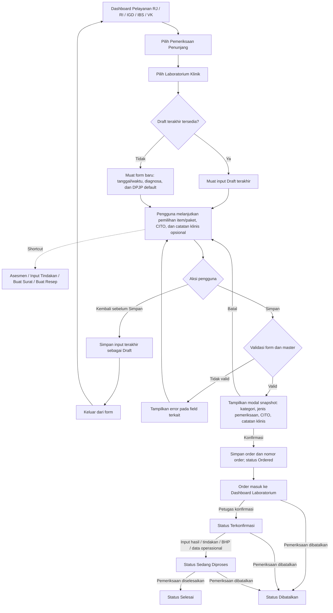

# PRD — Order Pemeriksaan Laboratorium

**Related Document:** Master Data Item Laboratorium; Master Data Paket Pelayanan; Master Data Staf; EMR/Asesmen/CPPT; Modul Tindakan; Modul Surat; E-Resep; Catatan Pemberian Obat (CPO); Retur Obat; Modul Laboratorium; Billing/Kasir; PRD Konfirmasi Order Laboratorium (dokumen terpisah — mencakup konfirmasi item dan pembentukan billing); Visualisasi UI `UI-Order-Pemeriksaan-Laboratorium-v2.html`; Referensi tampilan Order Laboratorium Neurovi v1  
**Dokumen ID:** PRD-P-LAB-ORDER-v2.3 · **Versi:** 2.3 (Draft)  
**Tanggal Disusun:** 16 Juli 2026 · **Tanggal Update:** 18 Juli 2026 · **Penyusun:** Team Product — Tamtech International  
**Approver:** M. Sulthan Farras Nanz (Chief Strategy & Growth Officer) · **Reviewer Teknis:** [PERLU KONFIRMASI — Lead FE, Lead BE, Lead QA, dan UI/UX]  
**Status:** Untuk Direview · **Target Release:** [PERLU KONFIRMASI]

## 1. Overview / Brief Summary

Order Pemeriksaan Laboratorium adalah fitur untuk Dokter, Perawat, dan Bidan dalam membuat permintaan pemeriksaan laboratorium dari konteks pelayanan Rawat Jalan, Rawat Inap, IGD, IBS, dan VK. Entry point fitur tersedia dari Dashboard masing-masing pelayanan melalui menu **Pemeriksaan Penunjang**, kemudian pengguna memilih **Laboratorium Klinik**. Neurovi v1 telah mendukung proses order berdasarkan kebutuhan operasional rumah sakit, tetapi pembentukan tagihan masih bergantung pada registrasi asal ketika order dibuat. Kondisi tersebut belum sepenuhnya mendukung pemeriksaan yang direncanakan atau dilaksanakan pada registrasi yang berbeda.

Pada Neurovi v2, struktur utama tampilan v1 tetap dipertahankan agar familiar, dengan peningkatan berupa pengisian otomatis tanggal dan waktu rencana pemeriksaan, diagnosa dari data klinis, DPJP aktif, pencarian item, pemilihan paket dari Master Data Paket Pelayanan, penandaan CITO per item, catatan klinis opsional, penyimpanan Draft saat pengguna kembali sebelum menyimpan, serta snapshot order yang ditampilkan saat tombol **Simpan** ditekan. Snapshot hanya memuat kategori jenis pemeriksaan, jenis pemeriksaan, tanda CITO, dan catatan klinis; dokter, diagnosa, dan paket tetap menjadi data order tetapi tidak disimpan atau ditampilkan sebagai bagian dari snapshot. Pada form juga tersedia shortcut **Asesmen**, **Input Tindakan**, **Buat Surat**, dan **Buat Resep**. Shortcut Buat Surat menampilkan daftar jenis surat yang tersedia, sedangkan shortcut Buat Resep menampilkan pilihan **E-Resep**, **CPO**, dan **Retur Obat**. Sistem juga harus menjaga keterkaitan antara order, hasil pemeriksaan, registrasi pelayanan, dan transaksi billing agar dapat ditelusuri dari sisi order.

> **Perubahan cakupan (v2.3):** proses **konfirmasi laboratorium** dan **pembentukan billing berdasarkan pelaksanaan** tetap dikelola pada **PRD Konfirmasi Order Laboratorium**. PRD ini berfokus pada entry point dari Dashboard pelayanan melalui **Pemeriksaan Penunjang → Laboratorium Klinik**, pengisian form, shortcut ke fitur klinis terkait, persistensi Draft, validasi, penayangan snapshot sebelum penyimpanan final, pembentukan order berstatus Ordered, serta pencatatan lifecycle status yang dipicu dari Dashboard Laboratorium.

> Referensi: kebutuhan bisnis dari user; tampilan Order Pemeriksaan Laboratorium Neurovi v1; template PRD Generator Neurovi v2.

## 2. Background

**Kondisi saat ini (As-Is, Neurovi v1)** — referensi bisnis proses dan tampilan v1:
- Order laboratorium telah tersedia dalam proses pelayanan dan menampilkan konteks pasien, tanggal serta waktu rencana, diagnosa, dokter, pencarian pemeriksaan, paket pemeriksaan, daftar item per kelompok, shortcut Asesmen, Input Tindakan, Buat Surat, Buat Resep, serta aksi simpan.
- Setelah order dikonfirmasi oleh laboratorium, seluruh item pemeriksaan langsung masuk ke tagihan pada registrasi tempat order dibuat.
- Ketergantungan terhadap registrasi asal menimbulkan masalah ketika pemeriksaan direncanakan pada tanggal berbeda atau pasien menjalani pemeriksaan pada registrasi pelayanan yang berbeda.
- Pemilihan data klinis dan dokter masih perlu ditingkatkan agar tidak terjadi input ulang dan inkonsistensi.

**Masalah/pain point:**
- **Aspek bisnis proses:** billing belum mengikuti registrasi saat pemeriksaan benar-benar dilaksanakan; alur perlu konsisten pada Rawat Jalan, IGD, Rawat Inap, IBS, dan VK.
- **Aspek UX:** pengguna masih berpotensi melakukan input ulang diagnosa dan dokter; pemilihan banyak item satu per satu memperlambat proses; entry point dan shortcut lintas fitur perlu konsisten agar pengguna tidak kehilangan konteks pasien saat berpindah proses klinis.
- **Aspek logic system:** perubahan master item berpotensi memengaruhi histori bila kategori dan jenis pemeriksaan tidak disimpan pada snapshot; input form juga berisiko hilang ketika pengguna kembali sebelum menyimpan; traceability order–hasil–registrasi–billing harus terjaga.

**Dampak utama yang disasar v2:**
- Mempercepat pembuatan order tanpa re-entry data klinis dan DPJP.
- Mengurangi kesalahan pemilihan item melalui pencarian dan paket pemeriksaan.
- Memastikan billing terbentuk pada registrasi yang sesuai dengan pelaksanaan pemeriksaan.
- Menyediakan histori dan audit trail yang dapat ditelusuri.
- Mencegah input form hilang dengan menyimpan Draft terakhir ketika pengguna kembali sebelum menyelesaikan order.
- Mempercepat akses ke Asesmen, Input Tindakan, pembuatan surat, serta proses resep/obat tanpa mencari ulang pasien dari modul lain.

**Strategi rilis Neurovi v2:**
- **Fase 1 (MVP):** entry point terstruktur dari Dashboard pelayanan, pembuatan order dari seluruh unit pelayanan, shortcut ke fitur klinis terkait, auto-fill konteks klinis, pemilihan item/paket, persistensi Draft, snapshot order, penyimpanan Ordered, sinkronisasi lifecycle status dari Dashboard Laboratorium, dan audit trail.

## 3. In Scope

### Scope Definition (Fase 1 — MVP)

1. **Halaman Order Laboratorium** — mempertahankan pola tampilan v1 dengan perbaikan struktur, validasi, dan informasi pilihan.
2. **Dukungan lintas unit pelayanan** — Rawat Jalan, IGD, Rawat Inap, IBS, dan VK.
3. **Hak akses pembuatan order** — Dokter, Perawat, dan Bidan sesuai RBAC.
4. **Konteks pasien dan registrasi** — menampilkan data pasien serta menggunakan registrasi aktif sebagai konteks order.
5. **Tanggal dan waktu rencana** — default tanggal dan waktu saat ini serta validasi tanggal tidak boleh di masa lalu.
6. **Integrasi diagnosa** — auto-fill dari Asesmen Rawat Jalan, Asesmen IGD, atau CPPT Rawat Inap; pilihan menggunakan dropdown ICD-10; dapat diubah sesuai kewenangan.
7. **Integrasi DPJP** — default DPJP aktif pada registrasi; dapat diubah melalui dropdown Master Data Staf.
8. **Integrasi Master Item Laboratorium** — pencarian, pengelompokan, dan pemilihan item pemeriksaan individual.
9. **Integrasi Master Paket Pelayanan** — pemilihan paket laboratorium dan ekspansi paket menjadi daftar item.
10. **Tanda CITO** — pengguna dapat menandai satu atau lebih item pemeriksaan sebagai CITO pada saat pemilihan item.
11. **Catatan klinis opsional** — pengguna dapat mengisi catatan klinis sebagai konteks tambahan untuk unit laboratorium; order tetap dapat disimpan ketika field kosong.
12. **Persistensi Draft** — ketika pengguna telah mengisi form tetapi belum menyimpan lalu menekan **Kembali**, sistem menyimpan input terakhir sebagai Draft. Ketika form order pada konteks pasien/registrasi tersebut dibuka kembali, sistem menampilkan kembali Draft terakhir.
13. **Snapshot order** — pada saat tombol **Simpan** ditekan, sistem menampilkan snapshot yang hanya memuat kategori jenis pemeriksaan, jenis pemeriksaan, tanda CITO, dan catatan klinis. Snapshot tidak menyimpan atau menampilkan konteks dokter, diagnosa, maupun paket.
14. **Penyimpanan order** — setelah snapshot dikonfirmasi, sistem menyimpan order beserta seluruh item yang dipilih, membuat nomor order otomatis, menetapkan status **Ordered**, dan mengirimkannya ke Modul Laboratorium.
15. **Lifecycle status** — mendokumentasikan dan menampilkan status Draft, Ordered, Terkonfirmasi, Sedang Diproses, Selesai, dan Dibatalkan berdasarkan trigger bisnis yang telah ditetapkan. Draft dan Ordered dipicu dari form order; status setelah Ordered dipicu dari Dashboard Laboratorium.
16. **Audit trail dan traceability** — merekam penyimpanan/pemulihan Draft, pembuat dan waktu order, perubahan status, serta relasi order dengan registrasi sumber, hasil pemeriksaan, registrasi billing, dan transaksi billing yang terbentuk pada proses downstream.
17. **Related history** — order dan hasil pemeriksaan dapat menjadi bagian dari Riwayat Pemeriksaan Penunjang pada EMR melalui integrasi modul terkait.
18. **Entry point terstruktur** — fitur diakses dari Dashboard Rawat Jalan, Rawat Inap, IGD, IBS, atau VK melalui menu **Pemeriksaan Penunjang**, kemudian memilih **Laboratorium Klinik**, dengan membawa konteks pasien dan registrasi aktif.
19. **Shortcut fitur klinis** — form menyediakan shortcut **Asesmen**, **Input Tindakan**, **Buat Surat**, dan **Buat Resep**. Buat Surat menampilkan daftar jenis surat yang tersedia; Buat Resep menampilkan pilihan **E-Resep**, **CPO**, dan **Retur Obat**.

### Out Scope

- Pengelolaan konfigurasi Master Item Laboratorium, Master Paket Pelayanan, Master Staf, dan Master ICD-10; PRD ini hanya mengonsumsi data master tersebut.
- Proses input, validasi klinis, approval, dan cetak hasil laboratorium secara lengkap — dikelola pada PRD Modul Laboratorium/Hasil Pemeriksaan (dikonfirmasi user).
- **Konfirmasi laboratorium** — peninjauan dan penyesuaian item order oleh petugas laboratorium melalui kontrol dropdown — dipindahkan ke **PRD Konfirmasi Order Laboratorium** (dokumen terpisah).
- **Billing berdasarkan pelaksanaan** — pembentukan tagihan untuk item yang dikonfirmasi serta resolusi registrasi aktif untuk billing — dipindahkan ke **PRD Konfirmasi Order Laboratorium** (dokumen terpisah).
- Proses pembayaran, pelunasan, refund, dan pembatalan transaksi billing setelah tagihan terbentuk; aturan pembatalan order setelah sebagian item dikonfirmasi masih `[PERLU KONFIRMASI]` dan sebagian dikelola pada PRD Konfirmasi Order Laboratorium.
- Perubahan proses input Asesmen Rawat Jalan, Asesmen IGD, dan CPPT Rawat Inap.
- Order untuk pasien tanpa registrasi aktif, kecuali kebijakan rumah sakit ditetapkan lebih lanjut. `[PERLU KONFIRMASI]`

## 4. Goals and Metrics

### Tujuan

Menyediakan proses Order Pemeriksaan Laboratorium yang cepat, konsisten, dan terintegrasi, sehingga tenaga kesehatan dapat membuat serta melanjutkan order tanpa kehilangan input, melakukan review melalui snapshot yang ringkas, dan mengirim order yang valid ke Modul Laboratorium tanpa input data berulang.

### Metrik

| Metrik | Target | Sumber |
|---|---|---|
| Waktu membuka Halaman Order Laboratorium | < 2 detik | NFR-001; Performance Expectation user |
| Waktu hasil pencarian pemeriksaan tampil | < 1 detik | NFR-002; Performance Expectation user |
| Waktu ekspansi paket menjadi item terpilih | < 1 detik | NFR-003; Performance Expectation user |
| Waktu penyimpanan order selesai | < 2 detik | NFR-004; Performance Expectation user |
| Waktu tampil snapshot order setelah Simpan | < 1 detik | NFR-015; FR-025 |
| Pembentukan billing setelah konfirmasi | Otomatis tanpa intervensi manual saat registrasi tujuan valid — metrik dan detail proses ada pada PRD Konfirmasi Order Laboratorium | NFR-005; BR-022 |
| Kelengkapan audit trail untuk event wajib | 100% event order, perubahan, dan konfirmasi tercatat | NFR-009; BR-026 |

> Metode pengukuran, volume data, concurrency, percentile, serta lingkungan uji performa: `[PERLU KONFIRMASI]`.

## 5. Related Feature & Stakeholder

### A. Modul Terkait

| Modul | Peran terhadap Order Laboratorium |
|---|---|
| Dashboard Pelayanan Rawat Jalan | Entry point melalui **Pemeriksaan Penunjang → Laboratorium Klinik** dan sumber registrasi aktif pasien Rawat Jalan. |
| Dashboard Pelayanan IGD | Entry point melalui **Pemeriksaan Penunjang → Laboratorium Klinik** dan sumber registrasi aktif pasien IGD. |
| Dashboard Pelayanan Rawat Inap | Entry point melalui **Pemeriksaan Penunjang → Laboratorium Klinik** dan sumber registrasi aktif pasien Rawat Inap. |
| Pelayanan IBS | Entry point melalui **Pemeriksaan Penunjang → Laboratorium Klinik** dan sumber registrasi aktif pasien IBS. |
| Pelayanan VK | Entry point melalui **Pemeriksaan Penunjang → Laboratorium Klinik** dan sumber registrasi aktif pasien VK. |
| Asesmen Rawat Jalan | Sumber diagnosa klinis Rawat Jalan. |
| Asesmen IGD | Sumber diagnosa klinis IGD. |
| CPPT Rawat Inap | Sumber diagnosa klinis Rawat Inap. |
| Master ICD-10 | Lookup diagnosa ketika pengguna menambah atau mengubah diagnosa. |
| Master Data Staf | Lookup dokter ketika DPJP diubah. |
| Master Item Laboratorium | Sumber item pemeriksaan aktif dan pengelompokan item. |
| Master Paket Pelayanan | Sumber paket pemeriksaan dan komposisi item paket. |
| Modul Laboratorium | Konsumen order; proses dan hasil pemeriksaan dikelola pada PRD Modul Laboratorium/Hasil Pemeriksaan. |
| PRD Konfirmasi Order Laboratorium | Melanjutkan order tersimpan menjadi konfirmasi item oleh petugas laboratorium dan pembentukan billing pada registrasi aktif saat pelaksanaan. |
| Billing/Kasir | Konsumen item yang telah dikonfirmasi (melalui PRD Konfirmasi Order Laboratorium) dan target registrasi billing. |
| EMR — Riwayat Pemeriksaan Penunjang | Konsumen data order dan hasil untuk histori pasien. |
| Modul Asesmen | Target shortcut **Asesmen** sesuai konteks pelayanan pasien. |
| Modul Tindakan | Target shortcut **Input Tindakan** untuk membuka proses pencatatan tindakan pada konteks pasien/registrasi yang sama. |
| Modul Surat | Target shortcut **Buat Surat** dan sumber daftar jenis surat yang tersedia. |
| E-Resep | Salah satu pilihan pada shortcut **Buat Resep**. |
| Catatan Pemberian Obat (CPO) | Salah satu pilihan pada shortcut **Buat Resep**. |
| Retur Obat | Salah satu pilihan pada shortcut **Buat Resep**. |

**Dependency lintas modul:** Dashboard Pelayanan RJ/RI/IGD/IBS/VK, Registrasi Pasien, Modul Asesmen, Modul Tindakan, Modul Surat, E-Resep, CPO, Retur Obat, Master Staf, Master ICD-10, Master Item Laboratorium, Master Paket Pelayanan, Modul Laboratorium, PRD Konfirmasi Order Laboratorium, Billing/Kasir, dan EMR.

### B. Persona

| Persona | Tipe | Peran terhadap Modul |
|---|---|---|
| Dokter | Primary | Membuat order, meninjau/mengubah diagnosa, memilih dokter dan pemeriksaan. |
| Perawat | Primary | Membuat order sesuai kewenangan dan konteks pelayanan. |
| Bidan | Primary | Membuat order sesuai kewenangan pada unit yang relevan. |
| Petugas Laboratorium | Primary | Menerima order yang tersimpan; peninjauan, penyesuaian item, dan konfirmasi pemeriksaan dijelaskan pada PRD Konfirmasi Order Laboratorium. |
| Petugas Billing/Kasir | Secondary | Menerima tagihan otomatis dari item yang dikonfirmasi; proses dan tindak lanjut posting tertahan dijelaskan pada PRD Konfirmasi Order Laboratorium. |
| Admin Master Data | Secondary | Menjaga keaktifan item, paket, ICD-10, dan data staf melalui modul master masing-masing. |
| Auditor/Manajemen | Tersier | Menelusuri histori perubahan, konfirmasi, registrasi billing, dan status order. |

## 6. Business Process (As-Is / To-Be)

### A. As-Is (Neurovi v1)

1. Pengguna membuka Permintaan Pemeriksaan Laboratorium dari konteks pelayanan pasien.
2. Sistem menampilkan identitas pasien dan form tanggal rencana, waktu rencana, diagnosa, dokter, pencarian, paket, serta daftar pemeriksaan per kelompok.
3. Pengguna memilih item secara individual atau melalui paket yang tersedia, kemudian menyimpan order.
4. Order masuk ke Modul Laboratorium dan dikonfirmasi oleh petugas laboratorium.
5. Ketika dikonfirmasi, seluruh item pemeriksaan langsung masuk ke tagihan pada registrasi saat order dibuat.
6. Ketika tanggal pelaksanaan berbeda atau pasien menjalani pemeriksaan di registrasi lain, billing tetap bergantung pada registrasi asal sehingga tidak selalu merepresentasikan pelayanan yang sebenarnya.

### B. To-Be (Neurovi v2 — Fase 1 MVP)

1. Pengguna dengan role Dokter, Perawat, atau Bidan membuka Dashboard pelayanan Rawat Jalan, Rawat Inap, IGD, IBS, atau VK pada registrasi pasien yang aktif, memilih fitur **Pemeriksaan Penunjang**, kemudian memilih **Laboratorium Klinik**.
2. Sistem memeriksa apakah terdapat Draft terakhir pada konteks pasien/registrasi tersebut. Jika ada, sistem menampilkan kembali input Draft; jika tidak ada, sistem memuat form baru.
3. Sistem menampilkan konteks pasien dan mengisi tanggal/waktu rencana dengan waktu saat ini untuk form baru.
4. Sistem mengambil seluruh diagnosa aktif dari sumber klinis sesuai unit dan menampilkan DPJP aktif dari registrasi.
5. Pengguna dapat memilih/mengubah diagnosa melalui ICD-10 dan memilih/mengubah dokter melalui Master Data Staf.
6. Form menyediakan shortcut **Asesmen**, **Input Tindakan**, **Buat Surat**, dan **Buat Resep**. Saat **Buat Surat** dipilih, sistem menampilkan daftar jenis surat yang tersedia. Saat **Buat Resep** dipilih, sistem menampilkan pilihan **E-Resep**, **CPO**, dan **Retur Obat**.
7. Pengguna mencari dan memilih item pemeriksaan secara individual atau memilih paket dari Master Data Paket Pelayanan, menandai item yang bersifat **CITO**, dan dapat mengisi **catatan klinis** secara opsional.
8. Ketika paket dipilih, sistem mengekspansi paket menjadi item.
9. Jika pengguna menekan **Kembali** sebelum menyimpan dan form sudah berisi input, sistem menyimpan kondisi form terakhir sebagai **Draft** sebelum keluar dari halaman.
10. Ketika pengguna membuka kembali form Order Laboratorium pada konteks pasien/registrasi yang sama, sistem memuat Draft terakhir agar pengisian dapat dilanjutkan.
11. Saat **Simpan** dipilih, sistem memvalidasi registrasi, tanggal, diagnosa, dokter, minimal satu item, status master, serta konfigurasi paket terbaru.
12. Setelah validasi berhasil, sistem menampilkan modal **snapshot order** yang hanya berisi kategori jenis pemeriksaan, jenis pemeriksaan, tanda CITO, dan catatan klinis. Dokter, diagnosa, dan paket tidak menjadi bagian dari snapshot.
13. Jika pengguna memilih **Batal** pada modal snapshot, sistem kembali ke form tanpa membentuk Ordered dan mempertahankan input terakhir. Jika pengguna memilih **Konfirmasi**, sistem menyimpan order, membuat nomor order otomatis (format 10 digit), menetapkan status **Ordered**, dan menghapus/menutup Draft yang terkait agar tidak menghasilkan duplikasi.
14. Order berstatus Ordered dikirim ke Modul Laboratorium.
15. Pada Dashboard Laboratorium, status berubah menjadi **Terkonfirmasi** ketika petugas melakukan konfirmasi order; menjadi **Sedang Diproses** ketika petugas mulai melakukan input hasil pemeriksaan, tindakan dan BHP, atau input operasional laboratorium lainnya; menjadi **Selesai** ketika petugas menyelesaikan pemeriksaan; dan menjadi **Dibatalkan** ketika petugas membatalkan pemeriksaan laboratorium.
16. Penyesuaian item saat konfirmasi, pembentukan billing, proses pemeriksaan, hasil, approval, dan cetak dikelola pada PRD downstream terkait.
17. Seluruh relasi order–item–hasil–registrasi sumber–registrasi billing–transaksi billing dan audit trail dapat ditelusuri lintas dokumen PRD terkait.

### C. Perbedaan As-Is (V1) vs To-Be (V2)

| Aspek | As-Is (V1) | To-Be (V2) |
|---|---|---|
| Entry point | Akses order mengikuti pola pelayanan yang tersedia | Dari Dashboard RJ/RI/IGD/IBS/VK melalui **Pemeriksaan Penunjang → Laboratorium Klinik**, dengan membawa konteks pasien dan registrasi aktif |
| Shortcut klinis | Tersedia tombol shortcut pada tampilan v1 | Form menyediakan Asesmen, Input Tindakan, Buat Surat (menampilkan daftar jenis surat), dan Buat Resep (E-Resep, CPO, Retur Obat) |
| Tanggal dan waktu | Diinput pada form | Default waktu saat ini; tanggal lampau ditolak |
| Diagnosa | Belum sepenuhnya mengurangi re-entry | Auto-fill dari asesmen/CPPT, editable via ICD-10, mendukung beberapa diagnosa |
| Dokter | Dipilih pada form | Default DPJP aktif, editable via Master Data Staf |
| Pemilihan item | Item dan paket tersedia | Item/paket dipertahankan; paket menjadi mekanisme pemilihan dan diekspansi menjadi item order |
| Penandaan CITO | Belum tersedia terstruktur | Pengguna dapat menandai item sebagai CITO saat pemilihan item |
| Catatan klinis | Belum terstruktur | Field catatan klinis tersedia dan bersifat opsional |
| Draft | Input berpotensi hilang ketika pengguna kembali sebelum menyimpan | Input terakhir disimpan sebagai Draft ketika pengguna menekan Kembali dan dimuat kembali saat form dibuka |
| Snapshot saat Simpan | Belum ada tampilan snapshot ke pengguna | Modal snapshot hanya menampilkan kategori jenis pemeriksaan, jenis pemeriksaan, CITO, dan catatan klinis; tidak memuat dokter, diagnosa, atau paket |
| Nomor order | Format belum ditentukan | Format 10 digit: 2 digit tahun + bulan + tanggal + 4 digit nomor urut (contoh: `2607175002`) |
| Perubahan master | Risiko histori item ikut berubah | Kategori dan jenis pemeriksaan pada order lama tetap mengikuti snapshot saat order dibuat |
| Status | Belum memiliki trigger lifecycle yang terdokumentasi lengkap | Draft → Ordered → Terkonfirmasi → Sedang Diproses → Selesai; Dibatalkan dipicu dari Dashboard Laboratorium |
| Konfirmasi | Mengonfirmasi order dari Modul Laboratorium | Dipindahkan ke **PRD Konfirmasi Order Laboratorium** — item terpilih ditampilkan dan masih dapat disesuaikan dengan audit trail |
| Pembentukan billing | Masuk ke registrasi asal order | Dipindahkan ke **PRD Konfirmasi Order Laboratorium** — hanya item terkonfirmasi, masuk ke registrasi aktif saat pelaksanaan/konfirmasi |
| Registrasi tujuan tidak ditemukan | Belum dijelaskan | Dijelaskan pada **PRD Konfirmasi Order Laboratorium** — billing ditahan dan petugas diberi notifikasi |
| Traceability | Perlu diperkuat | Relasi order, hasil, registrasi, dan billing wajib tersimpan lintas PRD terkait |

## 7. Main Flow / Mindmap



### Skenario 1 — Membuat order dengan item individual

1. Pengguna membuka Dashboard pelayanan sesuai unit, memilih **Pemeriksaan Penunjang**, lalu memilih **Laboratorium Klinik** pada registrasi aktif.
2. Sistem menampilkan identitas pasien, unit, tanggal/waktu rencana, diagnosa aktif, dan DPJP aktif, atau memuat Draft terakhir jika tersedia.
3. Pengguna mencari pemeriksaan berdasarkan nama atau menelusuri kelompok pemeriksaan.
4. Pengguna memilih satu atau lebih item, menandai item yang bersifat CITO bila perlu, dan mengisi catatan klinis secara opsional.
5. Pengguna menekan **Simpan**.
6. Sistem melakukan validasi lalu menampilkan modal snapshot yang hanya berisi kategori jenis pemeriksaan, jenis pemeriksaan, CITO, dan catatan klinis.
7. Ketika pengguna menekan **Konfirmasi**, sistem menyimpan order, membuat nomor order otomatis, memberi status **Ordered**, dan mengirim order ke Modul Laboratorium. Ketika pengguna menekan **Batal**, sistem kembali ke form tanpa membentuk Ordered.

### Skenario 2 — Membuat order melalui paket

1. Pengguna memilih satu atau lebih paket pemeriksaan yang aktif.
2. Sistem menampilkan seluruh item hasil ekspansi paket dalam keadaan terpilih.
3. Pengguna dapat menambah tetapi tidak masuk ke dalam paket tersebut dan akan membuat item tersendiri, menandai CITO, dan mengisi catatan klinis secara opsional.
4. Saat Simpan, sistem memvalidasi konfigurasi paket terbaru dan membentuk snapshot dari item hasil akhir yang dipilih.
5. Snapshot hanya berisi kategori jenis pemeriksaan, jenis pemeriksaan, CITO, dan catatan klinis; konteks paket tidak disimpan di dalam snapshot.
6. Perubahan konfigurasi paket setelah order tersimpan tidak mengubah daftar item yang sudah menjadi detail order.

### Skenario 3 — Menyimpan dan melanjutkan Draft

1. Pengguna telah mengisi sebagian atau seluruh form tetapi belum menekan Simpan.
2. Pengguna menekan **Kembali**.
3. Sistem menyimpan input terakhir sebagai **Draft** sebelum meninggalkan halaman.
4. Ketika form Order Laboratorium pada konteks pasien/registrasi tersebut dibuka kembali, sistem menampilkan input Draft terakhir.
5. Pengguna dapat melanjutkan pengisian dan menyimpan Draft menjadi **Ordered** tanpa membuat duplikasi order.

### Skenario 4 — Perubahan status dari Dashboard Laboratorium

1. Order yang telah disimpan berstatus **Ordered**.
2. Ketika petugas laboratorium melakukan konfirmasi melalui Dashboard Laboratorium, status menjadi **Terkonfirmasi**.
3. Ketika petugas mulai mengisi hasil pemeriksaan, tindakan dan BHP, atau data operasional laboratorium lainnya, status menjadi **Sedang Diproses**.
4. Ketika petugas menyelesaikan pemeriksaan laboratorium, status menjadi **Selesai**.
5. Ketika petugas membatalkan pemeriksaan melalui Dashboard Laboratorium, status menjadi **Dibatalkan**.

### Skenario 5 — Menggunakan shortcut pada form order

1. Saat form Order Pemeriksaan Laboratorium terbuka, pengguna dapat memilih shortcut **Asesmen**, **Input Tindakan**, **Buat Surat**, atau **Buat Resep**.
2. Shortcut **Asesmen** membuka fitur asesmen sesuai konteks unit pelayanan pasien.
3. Shortcut **Input Tindakan** membuka fitur pencatatan tindakan dengan membawa konteks pasien dan registrasi aktif.
4. Shortcut **Buat Surat** menampilkan daftar jenis surat yang tersedia pada modul surat.
5. Shortcut **Buat Resep** menampilkan pilihan **E-Resep**, **CPO**, dan **Retur Obat**.
6. Ketersediaan dan akses setiap shortcut mengikuti RBAC modul tujuan.

> Detail konfirmasi item dan billing berada pada **PRD Konfirmasi Order Laboratorium**. Detail input hasil, tindakan dan BHP, approval, penyelesaian, serta cetak hasil berada pada **PRD Modul Laboratorium/Hasil Pemeriksaan**.

## 8. Business Rules

| ID | Rule | Sumber / Trace |
|---|---|---|
| **BR-001** | Order Laboratorium harus tersedia pada Rawat Jalan, Rawat Inap, IGD, IBS, dan VK. Entry point dilakukan dari Dashboard masing-masing pelayanan melalui **Pemeriksaan Penunjang → Laboratorium Klinik**. | Draft user; US-001; US-015; FR-001 |
| **BR-002** | Hanya Dokter, Perawat, dan Bidan yang memiliki hak akses yang dapat membuat order. | Draft user; US-001; FR-002 |
| **BR-003** | Pembuatan order Fase 1 menggunakan registrasi pasien yang masih aktif. Pengecualian berdasarkan kebijakan rumah sakit memerlukan keputusan lebih lanjut. | Draft user; FR-003 |
| **BR-004** | Tanggal dan waktu rencana default ke tanggal dan waktu saat form dibuka. | Draft user; US-002; FR-004 |
| **BR-005** | Tanggal rencana pemeriksaan tidak boleh berada di masa lalu. | Edge case user; FR-004 |
| **BR-006** | Sumber diagnosa mengikuti konteks: Asesmen Rawat Jalan, Asesmen IGD, atau CPPT Rawat Inap. | Draft user; US-002; FR-005 |
| **BR-007** | Minimal satu diagnosa wajib dipilih sebelum order disimpan. | Edge case user; FR-005 |
| **BR-008** | Seluruh diagnosa aktif pasien ditampilkan dan dapat dipilih sebagai diagnosa utama/pendukung; pengguna berwenang dapat mengubah pilihan melalui Master ICD-10. | Expected Improvement user; FR-005 |
| **BR-009** | Dokter default adalah DPJP aktif pada registrasi saat order dibuat dan dapat diubah melalui Master Data Staf. | Draft user; US-003; FR-006 |
| **BR-010** | Dokter wajib dipilih sebelum order disimpan. | Edge case user; FR-006 |
| **BR-011** | Item pemeriksaan hanya berasal dari Master Item Laboratorium yang aktif untuk order baru. | Draft user; FR-007 |
| **BR-012** | Sistem mendukung pencarian item berdasarkan nama pemeriksaan. | Draft user; US-004; FR-008 |
| **BR-013** | Paket pemeriksaan hanya berasal dari Master Data Paket Pelayanan yang aktif. | Draft user; FR-009 |
| **BR-014** | Pemilihan paket mengekspansi paket menjadi daftar item pemeriksaan sesuai konfigurasi master. | Draft user; US-005; FR-009 |
| **BR-015** | Sistem menggunakan konfigurasi paket terbaru saat validasi penyimpanan. Jika paket berubah saat pengguna berada di form, sistem memvalidasi ulang sebelum menyimpan. | Edge case user; FR-010 |
| **BR-016** | Snapshot order hanya menyimpan kategori jenis pemeriksaan, jenis pemeriksaan, tanda CITO, dan catatan klinis dari item yang dipilih. Dokter, diagnosa, dan paket tidak menjadi bagian dari snapshot. | Klarifikasi user; FR-011; FR-025 |
| **BR-017** | Item dari paket dapat ditambah tetapi tidak masuk ke dalam paket tersebut dan akan membuat item tersendiri. | Expected Improvement user; FR-009 |
| **BR-018** | Minimal satu item pemeriksaan harus dipilih saat order disimpan. | Feature Capability user; FR-010 |
| **BR-019** | Ketika pengguna telah mengisi form, belum menekan Simpan, lalu memilih **Kembali**, sistem wajib menyimpan input terakhir sebagai **Draft**. Ketika form dibuka kembali pada konteks pasien/registrasi yang sama, sistem memuat Draft terakhir. | Klarifikasi user; US-013; FR-027 |
| **BR-020** | **[Dipindahkan ke PRD Konfirmasi Order Laboratorium]** Form konfirmasi laboratorium menampilkan item yang dipilih pada order dan item masih dapat diubah menggunakan kontrol dropdown sesuai kewenangan petugas laboratorium. | Scope user; US-006; FR-013 |
| **BR-021** | **[Dipindahkan ke PRD Konfirmasi Order Laboratorium]** Setiap perubahan item pada saat konfirmasi harus tercatat sebagai audit trail dan tidak menimpa snapshot awal yang berisi kategori jenis pemeriksaan, jenis pemeriksaan, CITO, dan catatan klinis. | Expected Improvement user; FR-013; FR-020 |
| **BR-022** | **[Dipindahkan ke PRD Konfirmasi Order Laboratorium]** Billing hanya dibentuk untuk item yang telah dikonfirmasi oleh laboratorium. | Expected Improvement user; US-007; FR-015 |
| **BR-023** | **[Dipindahkan ke PRD Konfirmasi Order Laboratorium]** Target billing adalah registrasi pasien yang valid dan aktif saat pemeriksaan dikonfirmasi/dilaksanakan, bukan otomatis registrasi asal order. Definisi registrasi aktif (dikonfirmasi user): bila order dibuat pada suatu registrasi untuk rencana pemeriksaan di kemudian hari, dan pasien baru datang kembali pada tanggal pelaksanaan, maka kedatangan tersebut membentuk registrasi baru, dan billing mengikuti registrasi baru (aktif) tersebut — bukan registrasi asal saat order dibuat. | Logic System user; FR-014; FR-015 |
| **BR-024** | **[Dipindahkan ke PRD Konfirmasi Order Laboratorium]** Jika registrasi target billing tidak ditemukan, sistem menahan pembentukan tagihan dan memberi notifikasi kepada petugas. | Edge case user; FR-016 |
| **BR-025** | Sistem wajib menjaga relasi antara order, item, hasil pemeriksaan, registrasi sumber, registrasi billing, dan transaksi billing. | Logic System user; FR-019 |
| **BR-026** | Audit trail menyimpan event Draft disimpan/dimuat, pembuat dan waktu order, pengonfirmasi dan waktu konfirmasi, perubahan item, perubahan dokter/diagnosa sebagai data order, serta setiap perubahan status. | Expected Improvement user; US-009; US-013; FR-020; FR-027 |
| **BR-027** | Paket atau item yang dinonaktifkan tidak dapat dipilih untuk order baru. Order lama tetap menampilkan kategori dan jenis pemeriksaan sesuai snapshot ketika order dibuat. | Edge case user; FR-007; FR-009; FR-011 |
| **BR-028** | Sistem memberikan notifikasi apabila terdapat order aktif dengan jenis pemeriksaan yang sama sebelum pengguna membuat order baru. Kriteria kesamaan dan periode deteksi: dengan jenis pemeriksaan yang sama agar user dapat melakukan konfirmasi sebelum membuat order baru. | Edge case user; FR-018 |
| **BR-029** | Status **Dibatalkan** hanya dipicu ketika petugas membatalkan pemeriksaan melalui Dashboard Laboratorium. Pembatalan tidak boleh menghilangkan jejak item, billing, tindakan, dan perubahan status yang telah terjadi. Detail disposisi billing dikelola pada PRD downstream terkait. | Klarifikasi user; FR-017; FR-020; FR-028 |
| **BR-030** | Akses melihat, mengubah, mengonfirmasi, memproses, menyelesaikan, dan membatalkan order mengikuti RBAC dan konteks unit. | Draft user; FR-002; NFR-007 |
| **BR-031** | Pengguna dapat menandai satu atau lebih item pemeriksaan sebagai **CITO** saat pemilihan item; tanda CITO disimpan sebagai bagian dari snapshot order dan diteruskan ke Modul Laboratorium. | Catatan update user; FR-023 |
| **BR-032** | Sistem menyediakan field **catatan klinis** pada form order dan field tersebut bersifat **opsional**. Nilai yang diisi disimpan sebagai bagian dari snapshot order; bila kosong, order tetap dapat disimpan. | Klarifikasi user; FR-024 |
| **BR-033** | Saat pengguna menekan **Simpan** dan validasi berhasil, sistem menampilkan modal **snapshot order** yang hanya berisi kategori jenis pemeriksaan, jenis pemeriksaan, tanda CITO, dan catatan klinis. Dokter, diagnosa, dan paket tidak ditampilkan atau disimpan sebagai bagian dari snapshot. | Klarifikasi user dan referensi visual; FR-025 |
| **BR-034** | Nomor order dibuat otomatis oleh sistem dengan format **10 digit**: 2 digit tahun + 2 digit bulan + 2 digit tanggal + 4 digit nomor urut auto-increment (contoh: `2607175002` untuk order pada 17 Juli 2026). | Catatan update user; FR-026 |
| **BR-035** | Status menjadi **Ordered** ketika pengguna menyelesaikan aksi Simpan dengan mengonfirmasi snapshot. Draft terkait harus ditutup/dikonversi agar tidak membentuk duplikasi order. | Klarifikasi user; FR-012; FR-027 |
| **BR-036** | Status menjadi **Terkonfirmasi** ketika petugas melakukan konfirmasi order melalui Dashboard Laboratorium. | Klarifikasi user; FR-028 |
| **BR-037** | Status menjadi **Sedang Diproses** ketika petugas melakukan input operasional pada Dashboard Laboratorium, termasuk input hasil pemeriksaan, tindakan dan BHP, atau data proses laboratorium lainnya. | Klarifikasi user; FR-028 |
| **BR-038** | Status menjadi **Selesai** ketika petugas menyelesaikan pemeriksaan laboratorium melalui Dashboard Laboratorium. | Klarifikasi user; FR-028 |
| **BR-039** | Status menjadi **Dibatalkan** ketika petugas membatalkan pemeriksaan laboratorium melalui Dashboard Laboratorium. | Klarifikasi user; FR-017; FR-028 |
| **BR-040** | Form Order Pemeriksaan Laboratorium menyediakan shortcut **Asesmen**, **Input Tindakan**, **Buat Surat**, dan **Buat Resep**. | Tambahan user; US-016; FR-029 |
| **BR-041** | Ketika shortcut **Buat Surat** dipilih, sistem menampilkan daftar jenis surat yang tersedia dari Modul Surat. | Tambahan user; US-016; FR-030 |
| **BR-042** | Ketika shortcut **Buat Resep** dipilih, sistem menampilkan daftar pilihan **E-Resep**, **CPO**, dan **Retur Obat**. | Tambahan user; US-016; FR-031 |
| **BR-043** | Shortcut membuka fitur tujuan dengan membawa konteks pasien dan registrasi aktif serta mengikuti RBAC modul tujuan. | Tambahan user; US-016; FR-032; NFR-017 |

## 9. State Machine

### 9.1 Status Order

| State | Encoding Visual | Makna |
|---|---|---|
| **Draft** | Badge abu-abu | Input form terakhir yang belum disimpan sebagai order final. Draft dipersist ketika pengguna menekan **Kembali** setelah mengisi form dan dimuat kembali ketika form dibuka pada konteks pasien/registrasi yang sama. Draft belum dikirim ke Modul Laboratorium dan belum memiliki nomor order final. |
| **Ordered** | Badge biru | Order telah disimpan setelah pengguna mengonfirmasi snapshot, memperoleh nomor order, dan tersedia pada Modul Laboratorium. |
| **Terkonfirmasi** | Badge ungu | Petugas laboratorium telah melakukan konfirmasi order melalui Dashboard Laboratorium. Status ini dikelola pada PRD Konfirmasi Order Laboratorium. |
| **Sedang Diproses** | Badge jingga | Petugas telah mulai mengisi data operasional laboratorium, seperti hasil pemeriksaan, tindakan dan BHP, atau data proses lainnya pada Dashboard Laboratorium. |
| **Selesai** | Badge hijau | Petugas telah menyelesaikan pemeriksaan laboratorium pada Dashboard Laboratorium. |
| **Dibatalkan** | Badge merah | Petugas telah membatalkan pemeriksaan laboratorium pada Dashboard Laboratorium. |

### 9.2 Trigger dan Pemilik Proses

| Status Tujuan | Trigger | Pemilik Proses / Modul |
|---|---|---|
| **Draft** | Pengguna telah mengisi form, belum menekan Simpan, lalu menekan **Kembali**. | Form Order Pemeriksaan Laboratorium — PRD ini |
| **Ordered** | Pengguna menekan **Simpan**, validasi berhasil, lalu mengonfirmasi snapshot. | Form Order Pemeriksaan Laboratorium — PRD ini |
| **Terkonfirmasi** | Petugas melakukan konfirmasi order melalui Dashboard Laboratorium. | PRD Konfirmasi Order Laboratorium |
| **Sedang Diproses** | Petugas melakukan input hasil pemeriksaan, tindakan dan BHP, atau input operasional laboratorium lainnya. | PRD Modul Laboratorium/Hasil Pemeriksaan |
| **Selesai** | Petugas menyelesaikan pemeriksaan laboratorium. | PRD Modul Laboratorium/Hasil Pemeriksaan |
| **Dibatalkan** | Petugas membatalkan pemeriksaan laboratorium melalui Dashboard Laboratorium. | PRD Konfirmasi Order Laboratorium / PRD Modul Laboratorium sesuai tahap pembatalan |

### 9.3 Transisi Utama

```text
Form berisi input + Kembali → Draft
Draft + Simpan dan Konfirmasi Snapshot → Ordered
Form baru + Simpan dan Konfirmasi Snapshot → Ordered
Ordered → Terkonfirmasi → Sedang Diproses → Selesai
Ordered / Terkonfirmasi / Sedang Diproses → Dibatalkan
```

**Aturan transisi:**
- Draft terakhir dimuat kembali ketika form dibuka pada konteks pasien/registrasi yang sama.
- Draft yang berhasil disimpan menjadi Ordered tidak boleh tetap aktif sebagai Draft terpisah.
- Perubahan status setelah Ordered harus diterima dan ditampilkan secara konsisten pada riwayat order.
- Status Dibatalkan tidak menghapus histori status atau data operasional yang telah terbentuk sebelumnya.

## 10. User Stories

| ID | User Story | Acceptance Criteria (Given–When–Then) | Trace |
|---|---|---|---|
| **US-001** | Sebagai **Dokter, Perawat, atau Bidan**, saya ingin membuat order laboratorium dari seluruh unit pelayanan yang didukung, sehingga order dapat dibuat dari konteks pelayanan pasien. | **Given** saya memiliki hak akses dan registrasi pasien aktif pada RJ/IGD/RI/IBS/VK, **When** saya membuka fitur Order Laboratorium, **Then** form order dan konteks pasien ditampilkan. | BR-001–BR-003; FR-001–FR-003 |
| **US-002** | Sebagai **pembuat order**, saya ingin tanggal, waktu, dan diagnosa terisi otomatis, sehingga saya tidak perlu melakukan input ulang. | **Given** konteks pelayanan memiliki data klinis, **When** form dibuka, **Then** tanggal/waktu saat ini dan seluruh diagnosa aktif ditampilkan; tanggal lampau ditolak saat disimpan. | BR-004–BR-008; FR-004–FR-005 |
| **US-003** | Sebagai **pembuat order**, saya ingin DPJP aktif terpilih otomatis tetapi tetap dapat diubah, sehingga dokter order sesuai kondisi pelayanan. | **Given** registrasi mempunyai DPJP aktif, **When** form dibuka, **Then** DPJP menjadi default; **When** diubah, **Then** pilihan berasal dari Master Data Staf. | BR-009–BR-010; FR-006 |
| **US-004** | Sebagai **pembuat order**, saya ingin mencari dan memilih pemeriksaan secara individual, sehingga pemeriksaan dapat dipilih dengan cepat. | **Given** item master aktif, **When** saya memasukkan nama pemeriksaan, **Then** hasil relevan tampil < 1 detik dan dapat dipilih. | BR-011–BR-012; FR-007–FR-008; NFR-002 |
| **US-005** | Sebagai **pembuat order**, saya ingin memilih paket laboratorium, sehingga saya tidak perlu memilih setiap item satu per satu. | **Given** paket aktif, **When** paket dipilih, **Then** item paket terpilih < 1 detik; **When** order disimpan, **Then** item hasil akhir disimpan dan snapshot hanya memuat kategori, jenis pemeriksaan, CITO, dan catatan klinis tanpa konteks paket. | BR-013–BR-017; FR-009–FR-011; NFR-003 |
| **US-006** | *(Detail dipindahkan ke PRD Konfirmasi Order Laboratorium)* Sebagai **petugas laboratorium**, saya ingin meninjau dan menyesuaikan item order sebelum konfirmasi, sehingga item yang diproses sesuai kondisi aktual. | **Given** order berstatus Ordered, **When** form konfirmasi dibuka, **Then** item order tampil; **When** item diubah, **Then** perubahan dicatat tanpa mengubah snapshot awal. | BR-020–BR-021; FR-013; FR-020 |
| **US-007** | *(Detail dipindahkan ke PRD Konfirmasi Order Laboratorium)* Sebagai **petugas laboratorium**, saya ingin billing terbentuk hanya untuk item terkonfirmasi pada registrasi pelaksanaan, sehingga tagihan sesuai pelayanan yang dilakukan. | **Given** item dikonfirmasi dan registrasi aktif ditemukan, **When** konfirmasi disimpan, **Then** hanya item terkonfirmasi diposting ke registrasi tersebut. | BR-022–BR-023; FR-014–FR-015 |
| **US-008** | *(Detail dipindahkan ke PRD Konfirmasi Order Laboratorium)* Sebagai **petugas laboratorium atau billing**, saya ingin diberi tahu ketika registrasi target tidak ditemukan, sehingga billing tidak masuk ke registrasi yang salah. | **Given** item dikonfirmasi tetapi registrasi target tidak ditemukan, **When** sistem mencoba posting, **Then** posting ditahan dan notifikasi ditampilkan. | BR-024; FR-016 |
| **US-009** | Sebagai **auditor atau pengguna berwenang**, saya ingin menelusuri perubahan dan hubungan order sampai billing, sehingga histori pelayanan dapat diaudit. | **Given** order mengalami pembuatan, perubahan, konfirmasi, atau perubahan status, **When** audit trail dibuka, **Then** aktor, waktu, nilai sebelum/sesudah, serta relasi registrasi/billing tersedia. | BR-025–BR-026; FR-019–FR-020; NFR-009 |
| **US-010** | Sebagai **pembuat order**, saya ingin mendapat peringatan ketika order serupa masih aktif, sehingga duplikasi pemeriksaan dapat dikurangi. | **Given** terdapat order aktif yang memenuhi kriteria duplikasi, **When** saya memilih item serupa atau menyimpan order baru, **Then** sistem menampilkan notifikasi dan meminta konfirmasi sesuai kebijakan. | BR-028; FR-018 |
| **US-011** | Sebagai **pembuat order**, saya ingin menandai item pemeriksaan sebagai CITO dan dapat mengisi catatan klinis secara opsional, sehingga laboratorium mengetahui prioritas dan konteks klinis pemeriksaan. | **Given** saya sedang memilih item pemeriksaan, **When** saya menandai satu/lebih item sebagai CITO dan/atau mengisi catatan klinis, **Then** nilai tersebut tersimpan sebagai bagian dari order dan snapshot; **When** catatan klinis kosong, **Then** order tetap dapat disimpan. | BR-031–BR-032; FR-023–FR-024 |
| **US-012** | Sebagai **pembuat order**, saya ingin melihat ringkasan (snapshot) saat menekan Simpan, sehingga saya dapat memastikan kategori, jenis pemeriksaan, CITO, dan catatan klinis sudah sesuai sebelum penyimpanan final. | **Given** saya menekan tombol Simpan dan validasi berhasil, **When** modal snapshot ditampilkan, **Then** snapshot hanya berisi kategori jenis pemeriksaan, jenis pemeriksaan, tanda CITO, dan catatan klinis serta tidak menampilkan dokter, diagnosa, atau paket; **When** saya menekan Konfirmasi, **Then** order disimpan sebagai Ordered. | BR-033; BR-035; FR-025 |
| **US-013** | Sebagai **pembuat order**, saya ingin input terakhir disimpan ketika saya kembali sebelum menyimpan, sehingga saya dapat melanjutkan pengisian tanpa mengulang dari awal. | **Given** form telah berisi input dan belum disimpan, **When** saya menekan Kembali, **Then** sistem menyimpan input terakhir sebagai Draft; **When** saya membuka kembali form pada konteks pasien/registrasi yang sama, **Then** Draft terakhir ditampilkan. | BR-019; FR-027; NFR-016 |
| **US-014** | Sebagai **pengguna berwenang**, saya ingin status order mengikuti aktivitas aktual di Dashboard Laboratorium, sehingga progres pemeriksaan dapat dipantau secara konsisten. | **Given** order berstatus Ordered, **When** petugas mengonfirmasi order, menginput proses, menyelesaikan, atau membatalkan pemeriksaan, **Then** status berubah berturut-turut menjadi Terkonfirmasi, Sedang Diproses, Selesai, atau Dibatalkan sesuai trigger. | BR-036–BR-039; FR-028 |
| **US-015** | Sebagai **Dokter, Perawat, atau Bidan**, saya ingin membuka Order Laboratorium melalui menu Pemeriksaan Penunjang pada Dashboard pelayanan, sehingga fitur terbuka dari konteks pasien dan registrasi yang sedang dilayani. | **Given** pasien memiliki registrasi aktif pada RJ/RI/IGD/IBS/VK, **When** saya memilih **Pemeriksaan Penunjang → Laboratorium Klinik**, **Then** form Order Pemeriksaan Laboratorium terbuka dengan konteks pasien dan registrasi tersebut. | BR-001; FR-001 |
| **US-016** | Sebagai **pengguna form order**, saya ingin mengakses Asesmen, Input Tindakan, Buat Surat, dan Buat Resep melalui shortcut, sehingga proses klinis terkait dapat dibuka tanpa mencari ulang pasien. | **Given** form Order Pemeriksaan Laboratorium terbuka, **When** saya memilih Asesmen atau Input Tindakan, **Then** fitur terkait terbuka dengan konteks pasien/registrasi; **When** saya memilih Buat Surat, **Then** daftar jenis surat ditampilkan; **When** saya memilih Buat Resep, **Then** pilihan E-Resep, CPO, dan Retur Obat ditampilkan. | BR-040–BR-043; FR-029–FR-032 |

## 11. Functional Requirements

| ID | Functional Requirement | Trace |
|---|---|---|
| **FR-001** | **Entry point lintas pelayanan** — sistem menyediakan akses dari Dashboard Rawat Jalan, Rawat Inap, IGD, IBS, dan VK melalui menu **Pemeriksaan Penunjang**, kemudian pilihan **Laboratorium Klinik**, dengan membawa konteks pasien dan registrasi aktif ke form order. | US-001; US-015; BR-001 |
| **FR-002** | **RBAC order dan konfirmasi** — sistem memvalidasi role untuk membuat, melihat, mengubah, mengonfirmasi, memproses, menyelesaikan, atau membatalkan order. | US-001; BR-002; BR-030; NFR-007 |
| **FR-003** | **Validasi registrasi sumber** — sistem memvalidasi bahwa pasien memiliki registrasi aktif yang dapat digunakan sebagai sumber order. | US-001; BR-003 |
| **FR-004** | **Tanggal dan waktu rencana** — sistem mengisi default tanggal/waktu saat ini, memungkinkan perubahan yang valid, dan menolak tanggal masa lalu. | US-002; BR-004–BR-005; NFR-006 |
| **FR-005** | **Diagnosa klinis dan ICD-10** — sistem mengambil diagnosa dari sumber klinis sesuai unit, menampilkan seluruh diagnosa aktif, mewajibkan minimal satu diagnosa, dan menyediakan lookup ICD-10 untuk perubahan. | US-002; BR-006–BR-008 |
| **FR-006** | **DPJP dan Master Staf** — sistem memilih DPJP aktif sebagai default, menyediakan dropdown pencarian staf untuk perubahan, dan mewajibkan dokter sebelum simpan. | US-003; BR-009–BR-010 |
| **FR-007** | **Daftar item per kategori** — sistem memuat item laboratorium aktif dari master dan mengelompokkannya sesuai kategori pemeriksaan. | US-004; BR-011; BR-027 |
| **FR-008** | **Pencarian item** — sistem mencari item berdasarkan nama dan memperbarui daftar hasil tanpa menghilangkan item yang sudah dipilih. | US-004; BR-012; NFR-002 |
| **FR-009** | **Pemilihan paket** — sistem memuat paket aktif, mengekspansi komposisi paket menjadi item terpilih, dan mendukung penambahan/pengurangan item sesuai kebijakan. Paket berfungsi sebagai mekanisme pemilihan dan tidak menjadi bagian dari snapshot order. | US-005; BR-013–BR-014; BR-017 |
| **FR-010** | **Validasi sebelum simpan** — sistem memvalidasi registrasi, tanggal, diagnosa, dokter, minimal satu item, keaktifan item/paket, dan versi konfigurasi paket terbaru. | US-002; US-005; BR-005; BR-007; BR-010; BR-015; BR-018 |
| **FR-011** | **Snapshot order** — sistem menyimpan snapshot yang terbatas pada kategori jenis pemeriksaan, jenis pemeriksaan, tanda CITO, dan catatan klinis. Dokter, diagnosa, dan paket disimpan sebagai data order biasa sesuai kebutuhan proses, tetapi tidak menjadi bagian dari snapshot. | US-005; US-012; BR-016; BR-027 |
| **FR-012** | **Penyimpanan dan distribusi order** — setelah pengguna mengonfirmasi modal snapshot, sistem menyimpan header serta detail order dalam satu transaksi, membuat nomor order, menetapkan status Ordered, menutup Draft terkait, dan membuat order tersedia pada Modul Laboratorium. | US-001; US-012; BR-035; NFR-004; NFR-008 |
| **FR-013** | *(Dipindahkan ke PRD Konfirmasi Order Laboratorium)* **Form konfirmasi laboratorium** — sistem menampilkan konteks order serta item terpilih dan menyediakan kontrol untuk menambah, mengganti, mengurangi, atau mengonfirmasi item sesuai RBAC dengan audit perubahan. | US-006; BR-020–BR-021; NFR-007; NFR-009 |
| **FR-014** | *(Dipindahkan ke PRD Konfirmasi Order Laboratorium)* **Resolusi registrasi billing** — pada saat konfirmasi, sistem mencari registrasi pasien yang valid dan aktif untuk pelaksanaan pemeriksaan serta menyimpan referensinya pada order/item. | US-007; BR-023; BR-025 |
| **FR-015** | *(Dipindahkan ke PRD Konfirmasi Order Laboratorium)* **Posting billing item terkonfirmasi** — sistem mengirim hanya item yang dikonfirmasi ke Billing/Kasir dan menyimpan ID transaksi/tagihan hasil posting. | US-007; BR-022–BR-023; NFR-005; NFR-008 |
| **FR-016** | *(Dipindahkan ke PRD Konfirmasi Order Laboratorium)* **Billing hold** — jika registrasi target tidak ditemukan atau posting gagal, sistem tidak memasukkan tagihan ke registrasi asal secara otomatis, menandai proses tertahan, dan menampilkan notifikasi. | US-008; BR-024; NFR-008 |
| **FR-017** | **Pembatalan downstream** — sistem menerima dan mencatat status Dibatalkan ketika petugas membatalkan pemeriksaan melalui Dashboard Laboratorium, mempertahankan histori, serta mencegah penghapusan jejak item/billing yang sudah terjadi. Detail workflow dan dampak billing mengikuti PRD downstream terkait. | BR-029–BR-030; BR-039 |
| **FR-018** | **Peringatan order serupa** — sistem memeriksa order aktif dengan pemeriksaan yang sama dan menampilkan notifikasi sebelum order baru disimpan. Kriteria deteksi: dengan jenis pemeriksaan yang sama agar user dapat melakukan konfirmasi sebelum membuat order baru.. | US-010; BR-028 |
| **FR-019** | **Traceability** — sistem menyediakan relasi dua arah antara order, detail item, hasil pemeriksaan, registrasi sumber, registrasi billing, dan transaksi billing. | US-009; BR-025 |
| **FR-020** | **Audit trail** — sistem mencatat penyimpanan/pemulihan Draft, create, update, pemilihan paket, perubahan item, konfirmasi, perubahan status, resolusi registrasi billing, posting billing, hold, retry, dan pembatalan beserta aktor serta timestamp. | US-006; US-009; US-013; BR-021; BR-026; BR-029; NFR-009 |
| **FR-021** | **Reset pilihan form** — sistem menyediakan aksi Reset untuk menghapus filter pencarian, paket terpilih, dan item terpilih setelah konfirmasi pengguna, tanpa menghapus data konteks pasien. | Referensi tampilan v1; NFR-006 |
| **FR-022** | **Integrasi riwayat EMR** — sistem menyediakan data order, status, dan referensi hasil kepada Riwayat Pemeriksaan Penunjang. Detail tampilan riwayat mengikuti PRD EMR terkait. | Related Feature user; BR-025 |
| **FR-023** | **Tanda CITO per item** — sistem menyediakan kontrol (checklist) untuk menandai satu atau lebih item pemeriksaan sebagai CITO pada saat pemilihan item; tanda tersimpan sebagai bagian data order dan snapshot. | US-011; BR-031 |
| **FR-024** | **Catatan klinis opsional** — sistem menyediakan satu field catatan klinis untuk keseluruhan order. Field tidak wajib diisi; jika diisi, nilainya disimpan dan ditampilkan pada snapshot. | US-011; BR-032 |
| **FR-025** | **Snapshot order saat Simpan** — setelah pengguna menekan Simpan dan validasi berhasil, sistem menampilkan modal snapshot sebelum penyimpanan final. Snapshot hanya memuat kategori jenis pemeriksaan, jenis pemeriksaan, tanda CITO, dan catatan klinis. Aksi Batal mengembalikan pengguna ke form; aksi Konfirmasi melanjutkan penyimpanan sebagai Ordered. | US-012; BR-033; BR-035; NFR-015 |
| **FR-026** | **Nomor order otomatis** — sistem membuat nomor order dengan format 10 digit (2 digit tahun + bulan + tanggal + 4 digit nomor urut auto-increment) segera setelah order berhasil disimpan. | BR-034; FR-012 |
| **FR-027** | **Persistensi dan pemulihan Draft** — ketika pengguna menekan Kembali setelah mengisi form tetapi sebelum menyimpan, sistem menyimpan input terakhir sebagai Draft. Ketika form dibuka kembali pada konteks pasien/registrasi yang sama, sistem memuat Draft terakhir. Ketika Draft disimpan menjadi Ordered, Draft terkait harus ditutup/dikonversi tanpa membuat duplikasi order. | US-013; BR-019; NFR-016 |
| **FR-028** | **Sinkronisasi lifecycle status** — sistem mencatat dan menampilkan perubahan Ordered → Terkonfirmasi → Sedang Diproses → Selesai atau Dibatalkan berdasarkan event dari Dashboard Laboratorium sesuai trigger BR-036 sampai BR-039. | US-014; BR-036–BR-039; NFR-007; NFR-009 |
| **FR-029** | **Shortcut fitur klinis** — form Order Pemeriksaan Laboratorium menampilkan shortcut **Asesmen**, **Input Tindakan**, **Buat Surat**, dan **Buat Resep**. | US-016; BR-040 |
| **FR-030** | **Daftar Buat Surat** — ketika pengguna memilih shortcut Buat Surat, sistem menampilkan daftar jenis surat yang tersedia dari Modul Surat sesuai konteks dan hak akses pengguna. | US-016; BR-041; BR-043 |
| **FR-031** | **Daftar Buat Resep** — ketika pengguna memilih shortcut Buat Resep, sistem menampilkan pilihan **E-Resep**, **CPO**, dan **Retur Obat**. | US-016; BR-042 |
| **FR-032** | **Konteks dan RBAC shortcut** — sistem meneruskan konteks pasien dan registrasi aktif ke fitur tujuan dan membatasi shortcut/aksi berdasarkan RBAC modul tujuan. | US-016; BR-043; NFR-007; NFR-017 |

## 12. Data Requirements (Spesifikasi Field)

> Field demografi, penjamin, dan registrasi **reuse definisi kanonik dari modul Registrasi/EMR** — nama, tipe, format, dan validasi harus sama.

### A. Header Form — Identitas Pasien (tampil sticky di seluruh form)
| Field | Label | Tipe | Wajib | Validasi/Format | Sumber/Default | Catatan |
|-------|-------|------|-------|-------------------|------------------|---------|
| no_rm | No. RM | Read-only | — | — | Autofill dari Pendaftaran Pasien | Autofill, tidak dapat diubah user |
| nama_pasien | Nama Pasien | Read-only | — | — | Autofill dari Data Sosial Pasien — Nama Pasien | Autofill, tidak dapat diubah user |
| status_pasien | Status Pasien | Read-only | — | — | Autofill dari Data Sosial Pasien — Status Pasien | Autofill, tidak dapat diubah user |
| tanggal_lahir_umur | Tanggal Lahir + Umur | Read-only | — | Tanggal lahir + usia dalam tahun | Autofill dari Data Sosial Pasien — Tanggal Lahir + Umur Pasien | Autofill, tidak dapat diubah user |
| jenis_kelamin | Jenis Kelamin | Read-only | — | — | Autofill dari Data Sosial Pasien — Jenis Kelamin Pasien | Autofill, tidak dapat diubah user |
| source_unit_id | Unit | display/reference | Ya | RJ/IGD/RI/IBS/VK | Konteks pelayanan | Read-only. |

### B. Layar INPUT — Order Pemeriksaan Laboratorium

| Field | Label | Tipe | Wajib | Validasi/Format | Sumber/Default | Catatan |
|---|---|---|---|---|---|---|
| `source_registration_id` | Registrasi Sumber | hidden/reference | Ya | Registrasi aktif | Konteks pelayanan | Disimpan sebagai data order biasa untuk traceability, bukan snapshot. |
| `planned_date` | Tanggal Rencana Pemeriksaan | date | Ya | Tidak boleh < tanggal saat ini | Default hari ini | Dapat diubah. |
| `planned_time` | Waktu Rencana Pemeriksaan | time | Ya | `HH:mm` | Default waktu saat ini | Dapat diubah. |
| `diagnosis_ids` | Diagnosa | multi-select lookup | Ya | Minimal 1 ICD-10 aktif | Auto-fill Asesmen/CPPT | Disimpan sebagai data order biasa dan tidak menjadi bagian dari snapshot. |
| `doctor_id` | Dokter / DPJP | searchable dropdown | Ya | Staf dokter aktif dan berwenang | DPJP aktif registrasi | Disimpan sebagai data order biasa dan tidak menjadi bagian dari snapshot. |
| `test_search` | Cari Nama Pemeriksaan | search text | Tidak | Trim; pencarian case-insensitive | Manual | Memfilter item tanpa menghapus selection. |
| `package_ids` | Pilih Paket Pemeriksaan | multi-select/checklist | Tidak | Paket aktif | Master Paket Pelayanan | Paket menambah item terpilih, tetapi tidak menjadi bagian dari snapshot. |
| `selected_items` | Pemeriksaan Laboratorium | checkbox/list | Ya | Minimal 1 item aktif | Master Item Laboratorium / hasil ekspansi paket | Dikelompokkan per kategori; setiap item memiliki checklist CITO terpisah. |

### C. Data Draft saat Pengguna Menekan Kembali

| Field | Label | Tipe | Format/Sumber | Catatan |
|---|---|---|---|---|
| `draft_id` | ID Draft | UUID/ID | Dibuat otomatis | Referensi Draft; bukan nomor order final. |
| `draft_status` | Status Draft | enum | `Draft` | Draft belum dikirim ke Modul Laboratorium. |
| `source_registration_id` | Registrasi Sumber Draft | reference | Konteks pelayanan | Digunakan untuk menemukan Draft ketika form dibuka kembali. |
| `draft_payload` | Input Form Terakhir | object | Nilai form saat Kembali | Memuat tanggal/waktu, diagnosa, dokter, paket, item terpilih, CITO, dan catatan klinis agar form dapat dipulihkan. Data ini bukan snapshot order. |
| `draft_saved_by` | Disimpan Oleh | user reference | User login | Audit dan kontrol akses Draft. |
| `draft_saved_at` | Waktu Simpan Draft | timestamp | Waktu server | Menentukan Draft terakhir. |
| `draft_updated_at` | Waktu Update Draft | timestamp | Waktu server | Diperbarui saat Draft disimpan ulang. |

### D. Data yang Dibuat Sistem saat Simpan Order

| Field | Label | Tipe | Format/Sumber | Catatan |
|---|---|---|---|---|
| `order_id` | ID Order | UUID/ID | Dibuat otomatis | Primary reference order. |
| `order_number` | No. Order | string (10 digit) | Auto-generate: `YYMMDD` + 4 digit auto-increment | Contoh `2607175002` untuk order tanggal 17 Juli 2026. Penanganan reset counter/overflow >9999 per hari: `[PERLU KONFIRMASI]`. |
| `order_status` | Status Order | enum | Default `Ordered` | Dibentuk setelah pengguna mengonfirmasi snapshot. |
| `source_registration_id` | Registrasi Sumber | reference | Konteks pelayanan | Data order biasa, bukan snapshot. |
| `diagnosis_ids` | Diagnosa Order | array/reference | Pilihan diagnosa saat Simpan | Data order biasa, bukan snapshot. |
| `doctor_id` | Dokter / DPJP Order | reference | Pilihan dokter saat Simpan | Data order biasa, bukan snapshot. |
| `order_items` | Detail Item Order | array/reference | Item hasil pilihan individual/paket | Menjadi detail operasional untuk Modul Laboratorium. |
| `item_snapshot` | Snapshot Item | array/object | Kategori jenis pemeriksaan, jenis pemeriksaan, dan CITO per item | Tidak memuat dokter, diagnosa, maupun paket. |
| `clinical_notes_snapshot` | Snapshot Catatan Klinis | string nullable | Nilai `clinical_notes` saat Simpan | Opsional; dapat kosong. |
| `ordered_by` | Dibuat Oleh | user reference | User login | Audit. |
| `ordered_at` | Waktu Order | timestamp | Waktu server | Audit. |
| `billing_registration_id` | Registrasi Billing | reference nullable | Hasil resolusi saat konfirmasi | Dikelola pada PRD Konfirmasi Order Laboratorium. |
| `billing_transaction_refs` | Referensi Billing | array/reference | Respons Billing/Kasir | Dikelola pada PRD Konfirmasi Order Laboratorium. |
| `audit_log_refs` | Referensi Audit | array/reference | Audit trail | Append-only. |

### E. Tampilan Snapshot Order saat Tombol Simpan Ditekan

> Mengacu pada referensi visual modal konfirmasi: judul konfirmasi penyimpanan, tabel ringkasan data, field Catatan Klinis, tombol **Batal**, dan tombol **Konfirmasi**.

- **Trigger tampilan:** pengguna menekan **Simpan** dan seluruh validasi form berhasil.
- **Waktu penyimpanan final:** order belum berstatus Ordered sampai pengguna menekan **Konfirmasi** pada modal snapshot.
- **Isi snapshot:** hanya kategori jenis pemeriksaan, jenis pemeriksaan, tanda CITO, dan catatan klinis.
- **Data yang tidak termasuk snapshot:** dokter/DPJP, diagnosa, dan paket pemeriksaan.

| Kolom / Informasi | Sumber Data | Format Tampilan | Catatan |
|---|---|---|---|
| Kategori Jenis Pemeriksaan | `item_snapshot.category_name` | Text, dikelompokkan | Contoh: Pemeriksaan Hematologi, Kimia, Imuno-serologi. |
| Jenis Pemeriksaan | `item_snapshot.examination_name` | Text | Menampilkan seluruh item hasil akhir yang dipilih. |
| CITO | `item_snapshot.is_cito` | Checkbox/ceklis read-only | Tercentang bila item ditandai CITO. |
| Catatan Klinis | `clinical_notes_snapshot` | Textarea/read-only atau teks | Opsional; dapat kosong; ditampilkan sebagai satu blok untuk keseluruhan order. |

**Aksi modal:**
- **Batal** — menutup modal dan kembali ke form dengan seluruh input tetap tersedia; tidak membentuk status Ordered.
- **Konfirmasi** — menyimpan order secara final, membuat nomor order, menetapkan status Ordered, menutup Draft terkait, dan mengirim order ke Modul Laboratorium.

### F. Layar INPUT — Konfirmasi Laboratorium

> **Dipindahkan ke PRD Konfirmasi Order Laboratorium.** Layar dan field konfirmasi dijelaskan secara lengkap pada dokumen tersebut. Data dokter, diagnosa, dan registrasi tetap dapat digunakan sebagai konteks order biasa, tetapi bukan bagian dari snapshot yang dijelaskan pada PRD ini.

### G. Audit Trail Minimum

| Event | Data Minimum |
|---|---|
| Draft disimpan | Draft ID, registrasi sumber, user, waktu, daftar field yang disimpan. |
| Draft dimuat kembali | Draft ID, registrasi sumber, user, waktu akses. |
| Draft menjadi Ordered | Draft ID, Order ID, user, waktu, penanda Draft ditutup/dikonversi. |
| Order dibuat | Order ID, registrasi sumber, user, waktu, diagnosa dan dokter sebagai data order biasa, detail item, serta snapshot kategori/jenis/CITO/catatan klinis. |
| Order diubah sebelum konfirmasi | User, waktu, nilai sebelum/sesudah, alasan bila diwajibkan. |
| Item diubah saat konfirmasi | Item asal, item baru/ditambah/dihapus, user, waktu. |
| Item/order dikonfirmasi | Item/order, user, waktu, registrasi billing hasil resolusi. |
| Input proses laboratorium dimulai | Order, user, waktu, jenis input awal yang memicu status Sedang Diproses. |
| Pemeriksaan selesai | Order, user, waktu penyelesaian. |
| Billing diposting | Item, registrasi billing, referensi transaksi, waktu, status respons. |
| Billing ditahan/gagal | Penyebab, waktu, jumlah percobaan, user/worker yang melakukan retry. |
| Status berubah | Status sebelum/sesudah, trigger, user/sistem, waktu. |
| Pemeriksaan dibatalkan | User, waktu, alasan, status sebelumnya, dan dampak billing. |

### H. Kontrol Shortcut pada Form Order

| Shortcut | Trigger | Target / Daftar Pilihan | Konteks yang Dibawa | Catatan |
|---|---|---|---|---|
| Asesmen | Klik tombol **Asesmen** | Modul Asesmen sesuai pelayanan | Pasien, registrasi aktif, unit pelayanan | Akses mengikuti RBAC modul asesmen. |
| Input Tindakan | Klik tombol **Input Tindakan** | Modul Input Tindakan | Pasien, registrasi aktif, unit pelayanan | Akses mengikuti RBAC modul tindakan. |
| Buat Surat | Klik tombol **Buat Surat** | Daftar jenis surat yang tersedia dari Modul Surat | Pasien, registrasi aktif, unit pelayanan | Jenis surat yang tampil mengikuti konfigurasi dan hak akses modul surat. |
| Buat Resep | Klik tombol **Buat Resep** | E-Resep; CPO; Retur Obat | Pasien, registrasi aktif, unit pelayanan | Pilihan yang dapat digunakan mengikuti RBAC modul tujuan. |

## 13. Non-Functional Requirements

| ID | Kategori | Requirement | Sumber |
|---|---|---|---|
| **NFR-001** | Performa | Halaman Order Laboratorium terbuka dalam waktu < 2 detik pada kondisi operasional normal. | Metrik user; FR-001; FR-007 |
| **NFR-002** | Performa | Hasil pencarian pemeriksaan tampil dalam waktu < 1 detik setelah input pencarian diproses. | Metrik user; FR-008 |
| **NFR-003** | Responsivitas | Ekspansi paket dan pembaruan item terpilih selesai < 1 detik. | Metrik user; FR-009 |
| **NFR-004** | Performa | Penyimpanan order beserta seluruh detail dan snapshot selesai < 2 detik. | Metrik user; FR-010–FR-012 |
| **NFR-005** | Real-Time | Setelah konfirmasi berhasil dan registrasi target valid, sistem memicu pembentukan billing otomatis tanpa intervensi manual. | Performance Expectation user; FR-014–FR-015 |
| **NFR-006** | Ergonomi UI | Struktur utama mempertahankan pola familiar v1: konteks pasien, field rencana/diagnosa/dokter, pencarian/paket, daftar item per kategori, shortcut Asesmen/Input Tindakan/Buat Surat/Buat Resep, Reset, Kembali, dan Simpan. | UX Improvement user; referensi tampilan v1; FR-029 |
| **NFR-007** | Keamanan/RBAC | Sistem menolak aksi yang tidak sesuai role, unit, dan status order pada API maupun UI. | Hak akses user; BR-002; BR-030 |
| **NFR-008** | Reliabilitas | Simpan order, perubahan status, dan posting billing harus idempotent; kegagalan parsial tidak boleh membuat duplikasi order atau tagihan. | BR-022–BR-025; FR-012; FR-015–FR-016 |
| **NFR-009** | Auditabilitas | Audit trail bersifat append-only, memiliki aktor dan timestamp server, serta dapat menampilkan nilai sebelum/sesudah untuk perubahan data penting. | BR-021; BR-026; FR-020 |
| **NFR-010** | Konsistensi Data | Snapshot kategori jenis pemeriksaan, jenis pemeriksaan, CITO, dan catatan klinis tidak berubah ketika data master diperbarui/dinonaktifkan. Dokter, diagnosa, dan paket tidak boleh dimasukkan ke struktur snapshot. | BR-016; BR-027; FR-011 |
| **NFR-011** | Usability | Validasi ditampilkan dekat field bermasalah; pilihan pengguna yang valid tidak hilang ketika terdapat error pada field lain. | Edge cases user; FR-010 |
| **NFR-012** | Aksesibilitas | Seluruh field dan aksi utama dapat dioperasikan dengan keyboard, memiliki label yang jelas, fokus terlihat, dan target klik memadai. | Kebutuhan UX; UI v2 |
| **NFR-013** | Observabilitas | Kegagalan resolusi registrasi, posting billing, retry, dan perubahan status dicatat dengan correlation/order ID agar mudah ditelusuri. | BR-024–BR-026; FR-016; FR-020 |
| **NFR-014** | Konfigurabilitas | Kebijakan perubahan item paket, pembatalan, dan deteksi duplikasi tidak ditanam diam-diam; bentuk konfigurasi final ditentukan stakeholder. | BR-017; BR-028–BR-029 |
| **NFR-015** | Performa | Modal snapshot order tampil dalam waktu < 1 detik setelah pengguna menekan Simpan dan validasi berhasil. | Metrik user; BR-033; FR-025 |
| **NFR-016** | Reliabilitas/Usability | Aksi Kembali setelah form berisi input tidak boleh menghilangkan input terakhir. Draft harus dapat dimuat kembali pada pembukaan form berikutnya pada konteks pasien/registrasi yang sama. | BR-019; US-013; FR-027 |
| **NFR-017** | Konsistensi Konteks/Keamanan | Navigasi melalui entry point dan shortcut tidak boleh membuka pasien atau registrasi yang berbeda. Konteks pasien, registrasi aktif, unit, serta kontrol akses harus divalidasi ulang oleh fitur tujuan. | BR-043; FR-001; FR-032 |

## 14. Integrasi Eksternal & Dependency

> Tidak ada integrasi eksternal pihak ketiga yang disebutkan pada sumber. Seluruh integrasi pada Fase 1 merupakan integrasi internal Neurovi/rumah sakit.

| Integrasi | Fungsi di Modul Ini | Status | Trace |
|---|---|---|---|
| Registrasi Pasien | Menyediakan registrasi sumber dan registrasi aktif target billing. | Internal — Hard dependency | FR-003; FR-014 |
| Asesmen Rawat Jalan | Menyediakan diagnosa aktif Rawat Jalan. | Internal — Hard dependency untuk RJ | FR-005 |
| Asesmen IGD | Menyediakan diagnosa aktif IGD. | Internal — Hard dependency untuk IGD | FR-005 |
| CPPT Rawat Inap | Menyediakan diagnosa aktif Rawat Inap. | Internal — Hard dependency untuk RI | FR-005 |
| Master ICD-10 | Lookup diagnosa ketika auto-fill kosong atau perlu perubahan. | Internal — Hard dependency | FR-005 |
| Master Data Staf | Menyediakan DPJP dan dokter pilihan. | Internal — Hard dependency | FR-006 |
| Master Item Laboratorium | Menyediakan item pemeriksaan aktif dan kategori. | Internal — Hard dependency | FR-007–FR-008 |
| Master Paket Pelayanan | Menyediakan paket dan komposisi item sebagai mekanisme pemilihan; paket tidak menjadi bagian dari snapshot order. | Internal — Hard dependency untuk fitur paket | FR-009–FR-010 |
| Modul Laboratorium | Menerima order tersimpan; proses konfirmasi/hasil dijelaskan pada PRD terpisah. | Internal — Hard dependency | FR-012; FR-019 |
| PRD Konfirmasi Order Laboratorium | Melanjutkan order menjadi konfirmasi item dan pembentukan billing. | Internal — Hard dependency (downstream) | FR-013–FR-016 (dipindahkan) |
| Billing/Kasir | Membentuk tagihan item terkonfirmasi pada registrasi target (melalui PRD Konfirmasi Order Laboratorium). | Internal — Hard dependency (tidak langsung) | FR-014–FR-016 |
| EMR — Riwayat Pemeriksaan Penunjang | Menampilkan histori order, status, dan hasil. | Internal — Soft dependency untuk go-live order; Hard untuk histori lengkap | FR-019; FR-022 |
| Audit Trail Platform | Menyimpan seluruh event perubahan dan integrasi. | Internal — Hard dependency | FR-020; NFR-009 |
| Dashboard Pelayanan RJ/RI/IGD/IBS/VK | Menyediakan entry point **Pemeriksaan Penunjang → Laboratorium Klinik** dan konteks registrasi aktif. | Internal — Hard dependency | FR-001 |
| Modul Asesmen | Target shortcut Asesmen. | Internal — Soft dependency untuk order; Hard untuk shortcut Asesmen | FR-029; FR-032 |
| Modul Tindakan | Target shortcut Input Tindakan. | Internal — Soft dependency untuk order; Hard untuk shortcut Input Tindakan | FR-029; FR-032 |
| Modul Surat | Menyediakan daftar jenis surat pada shortcut Buat Surat. | Internal — Soft dependency untuk order; Hard untuk shortcut Buat Surat | FR-030; FR-032 |
| E-Resep | Target pilihan E-Resep pada shortcut Buat Resep. | Internal — Soft dependency untuk order; Hard untuk pilihan E-Resep | FR-031; FR-032 |
| CPO | Target pilihan CPO pada shortcut Buat Resep. | Internal — Soft dependency untuk order; Hard untuk pilihan CPO | FR-031; FR-032 |
| Retur Obat | Target pilihan Retur Obat pada shortcut Buat Resep. | Internal — Soft dependency untuk order; Hard untuk pilihan Retur Obat | FR-031; FR-032 |

### Dependency dan Dampak

| Dependency | Tipe | Dampak Jika Belum Siap |
|---|---|---|
| Resolusi registrasi aktif lintas unit | Hard | Billing tidak dapat ditentukan secara aman; posting harus ditahan. |
| Kontrak API Billing idempotent per item | Hard | Risiko duplikasi tagihan saat retry/konfirmasi ulang. |
| Snapshot kategori dan jenis pemeriksaan | Hard | Histori order dapat berubah mengikuti master bila nilai snapshot tidak disimpan saat order dibuat. |
| Sumber diagnosa IBS dan VK | Hard untuk unit terkait | Auto-fill diagnosa tidak konsisten; mapping perlu diputuskan. |
| Riwayat Pemeriksaan Penunjang | Soft untuk order, Hard untuk pengalaman histori end-to-end | Order tetap dapat berjalan, tetapi histori EMR belum lengkap. |
| Routing dan propagasi konteks pasien lintas modul | Hard untuk entry point dan seluruh shortcut | Fitur dapat membuka pasien/registrasi yang salah atau shortcut tidak dapat digunakan dengan aman. |
| Konfigurasi jenis surat | Soft untuk order, Hard untuk shortcut Buat Surat | Order tetap dapat berjalan, tetapi daftar Buat Surat tidak dapat ditampilkan secara benar. |

## 15. Risk & Mitigation

| ID | Risiko | Mitigasi |
|---|---|---|
| **R1** | Billing masuk ke registrasi yang salah ketika pasien memiliki lebih dari satu registrasi aktif. **[Dikelola pada PRD Konfirmasi Order Laboratorium]** | Definisi registrasi aktif telah dikonfirmasi user: registrasi baru yang terbentuk saat pasien datang untuk pelaksanaan menjadi target billing, bukan registrasi asal order. Tetapkan algoritma resolusi deterministik berdasarkan definisi ini, tampilkan registrasi hasil resolusi pada konfirmasi, tahan posting jika ambigu, dan catat audit. |
| **R2** | Konfirmasi ulang atau retry membuat tagihan ganda. **[Dikelola pada PRD Konfirmasi Order Laboratorium]** | Gunakan idempotency key per `order_item_id + billing_registration_id`, simpan referensi transaksi, dan tolak posting duplikat. |
| **R3** | Isi paket berubah di tengah proses input. | Validasi ulang versi paket saat Simpan; snapshot dibentuk dari daftar item hasil akhir setelah validasi, bukan dari konteks paket. |
| **R4** | Item master dinonaktifkan setelah order dibuat. | Gunakan snapshot kategori dan jenis pemeriksaan untuk order lama; blok item nonaktif hanya untuk order baru. |
| **R5** | Diagnosa atau DPJP tidak tersedia dari sumber klinis/registrasi. | Wajibkan pengguna memilih diagnosa ICD-10 dan dokter aktif sebelum Simpan. |
| **R6** | Pembatalan setelah konfirmasi menimbulkan ketidaksesuaian laboratorium dan billing. **[Dikelola pada PRD Konfirmasi Order Laboratorium]** | Batasi aksi berdasarkan status, pertahankan audit, dan tetapkan workflow void/refund melalui keputusan stakeholder. |
| **R7** | Perubahan item oleh laboratorium tidak diketahui pembuat order. **[Dikelola pada PRD Konfirmasi Order Laboratorium]** | Simpan baseline snapshot kategori/jenis/CITO/catatan klinis pada PRD ini, tampilkan penanda perubahan pada PRD Konfirmasi Order Laboratorium, dan catat nilai sebelum/sesudah serta aktor. |
| **R8** | Integrasi Billing atau Modul Laboratorium tidak tersedia. **[Sebagian dikelola pada PRD Konfirmasi Order Laboratorium]** | Gunakan status integrasi tertahan/gagal, correlation ID, retry idempotent, dan monitoring. Mekanisme retry final `[PERLU KONFIRMASI]`. |
| **R9** | Data pada modal snapshot berbeda dengan data yang disimpan setelah pengguna menekan Konfirmasi. | Gunakan payload tervalidasi yang sama untuk membentuk modal snapshot dan transaksi penyimpanan final; cegah perubahan payload di antara aksi Simpan dan Konfirmasi. |
| **R10** | Draft yang salah dimuat atau tertimpa dapat menyebabkan input pengguna lain muncul pada konteks yang tidak sesuai. | Draft harus dikaitkan dengan konteks pasien/registrasi dan identitas pengguna sesuai keputusan akses; setiap save/restore Draft dicatat pada audit trail. |
| **R11** | Entry point atau shortcut membawa konteks pasien/registrasi yang salah ke modul tujuan. | Kirim identifier pasien, registrasi aktif, dan unit secara eksplisit; validasi ulang pada modul tujuan; blok akses bila konteks tidak valid; catat correlation ID. |
| **R12** | Daftar jenis surat atau pilihan resep tidak sesuai hak akses pengguna. | Daftar dibentuk dari konfigurasi dan RBAC modul tujuan; form order tidak menyimpan daftar statis selain pilihan Buat Resep yang telah ditetapkan (E-Resep, CPO, Retur Obat). |

## 16. Asumsi

- Tidak ada asumsi baru untuk entry point: jalur akses telah ditetapkan melalui **Dashboard Pelayanan → Pemeriksaan Penunjang → Laboratorium Klinik**.
- Tidak ada asumsi baru untuk pilihan Buat Resep: daftar telah ditetapkan sebagai **E-Resep, CPO, dan Retur Obat**.

## 17. Pertanyaan Terbuka

- `[PERLU KONFIRMASI]` Apakah shortcut membuka fitur tujuan pada halaman yang sama, modal/drawer, atau tab baru?
- `[PERLU KONFIRMASI]` Apakah input Order Laboratorium yang belum disimpan harus otomatis menjadi Draft ketika pengguna berpindah melalui salah satu shortcut?
- `[PERLU KONFIRMASI]` Daftar final jenis surat yang ditampilkan pada shortcut **Buat Surat** mengikuti konfigurasi modul surat; siapa pemilik konfigurasi dan apakah berbeda per unit pelayanan?

## 18. Change Log

| Versi | Tanggal | Penyusun | Perubahan |
|---|---|---|---|
| 2.0 (Draft) | 16 Juli 2026 | Team Product — Tamtech International | Penyusunan PRD Order Pemeriksaan Laboratorium v2 berdasarkan bisnis proses user, kebutuhan peningkatan dari v1, edge cases, dan referensi tampilan v1. |
| 2.1 (Draft) | 17 Juli 2026 | Team Product — Tamtech International | (1) Menambahkan tanda CITO per item dan field catatan klinis; (2) menambahkan snapshot order yang tampil saat tombol Simpan ditekan; (3) memindahkan scope Konfirmasi Laboratorium dan Billing berdasarkan pelaksanaan ke PRD terpisah; (4) mengonfirmasi proses hasil laboratorium dikelola pada PRD Modul Laboratorium/Hasil Pemeriksaan; (5) menetapkan format nomor order 10 digit. |
| 2.2 (Draft) | 17 Juli 2026 | Team Product — Tamtech International | (1) Membatasi snapshot hanya pada kategori jenis pemeriksaan, jenis pemeriksaan, CITO, dan catatan klinis serta mengeluarkan dokter, diagnosa, dan paket dari snapshot; (2) menetapkan Catatan Klinis sebagai field opsional; (3) mengubah Draft menjadi data persisten ketika pengguna menekan Kembali dan memulihkannya saat form dibuka kembali; (4) menetapkan trigger status Ordered, Terkonfirmasi, Sedang Diproses, Selesai, dan Dibatalkan; (5) menghapus status Dikonfirmasi Sebagian dari lifecycle order. |
| 2.3 (Draft) | 18 Juli 2026 | Team Product — Tamtech International | (1) Menetapkan entry point Order Laboratorium dari Dashboard RJ/RI/IGD/IBS/VK melalui **Pemeriksaan Penunjang → Laboratorium Klinik**; (2) menambahkan shortcut Asesmen, Input Tindakan, Buat Surat, dan Buat Resep pada form; (3) menetapkan Buat Surat menampilkan daftar jenis surat yang tersedia; (4) menetapkan Buat Resep menampilkan pilihan E-Resep, CPO, dan Retur Obat; (5) menambahkan aturan propagasi konteks pasien/registrasi serta RBAC shortcut. |
