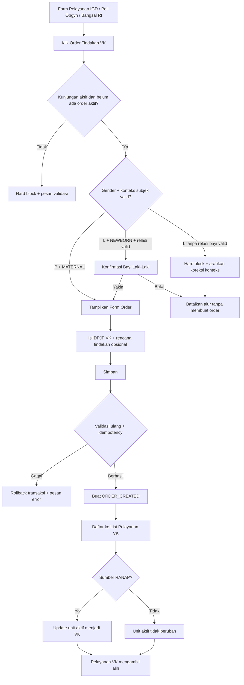

# Product Requirement Document (PRD)

# Order Tindakan VK (E7)

## 1. Metadata Dokumen

* **Approval**: M. Sulthan Farras Nanz — Chief Strategy & Growth Officer, Tamtech International — [Signature, Date]
* **Related Documents**:
  * PRD Pelayanan VK (Verloskamer)
  * PRD Pelayanan IGD
  * PRD Pelayanan Poli Rawat Jalan
  * PRD Pelayanan Rawat Inap
  * Master Data Praktisi
  * List Fitur V2 — E7, Order tindakan VK
* **Document Version**: 17 Juni 2026, v1.0 — Draft awal PRD; format diselaraskan dengan `template (1).md` pada 17 Juli 2026.
* **Feature Code**: E7
* **Cluster**: Pelayanan Utama
* **Owner**: Modul sumber order dan Pelayanan VK sebagai modul tujuan handoff

## 2. Overview & Background

### Overview/Brief Summary

Fitur **Order Tindakan VK** menyediakan mekanisme handoff terstandarisasi untuk memindahkan pasien dari unit asal ke daftar pelayanan VK (*Verloskamer*). Tombol order tersedia pada form pelayanan IGD, Poli Rawat Jalan Kebidanan/Obgyn, dan Bangsal Rawat Inap.

Setelah user mengisi form order dan menyimpan data, sistem akan:

1. mencatat order beserta konteks kunjungan aktif;
2. mendaftarkan pasien ke daftar pasien aktif Pelayanan VK;
3. menyimpan sumber pasien, DPJP VK, dan rencana tindakan; dan
4. mengubah unit aktif pasien menjadi VK bila sumber pasien adalah Rawat Inap.

Fitur ini hanya menangani sisi **order/handoff**. Konfirmasi penerimaan pasien, pelaksanaan tindakan, perubahan status setelah order dibuat, pembatalan order, penempatan ruang/bed, dan detail klinis tindakan VK ditangani oleh PRD Pelayanan VK.

### Business Process (As-Is vs To-Be)

#### As-Is

Perpindahan pasien ke VK dilakukan secara manual melalui telepon, WhatsApp, atau formulir fisik. Kondisi ini menimbulkan masalah berikut:

* pasien belum otomatis tercatat pada daftar pelayanan VK sehingga petugas VK harus mendaftarkan ulang;
* unit aktif pasien Rawat Inap tetap menunjukkan bangsal asal walaupun pasien secara fisik sudah menuju VK;
* tidak ada audit trail yang konsisten mengenai penginisiasi handoff, DPJP, dan rencana tindakan;
* informasi DPJP atau rencana tindakan berisiko salah dipahami saat handoff lisan; dan
* tracking koordinasi antarunit serta dashboard Rawat Inap menjadi tidak akurat.

#### To-Be

Dokter atau perawat pada unit asal menekan tombol **Order Tindakan VK**. Sistem memvalidasi kunjungan aktif dan menampilkan form order dengan data pasien serta konteks order yang terisi otomatis. User memilih DPJP VK dan, bila diperlukan, mengisi rencana tindakan dalam free text.

Setelah disimpan, sistem menjalankan transaksi atomik untuk membuat order, mendaftarkan pasien ke list Pelayanan VK, dan—khusus pasien Rawat Inap—memperbarui unit aktif menjadi VK. Status awal order adalah **Order Dibuat**. Petugas VK kemudian melanjutkan proses penerimaan dan pelayanan di modul Pelayanan VK.

## 3. Goals & Metrics

| No | Metrics | Success Criteria |
|----|---------|------------------|
| 1 | Pencatatan handoff | 100% pasien yang masuk VK melalui jalur IGD, Poli Kebidanan/Obgyn, atau Bangsal Rawat Inap tercatat melalui Order Tindakan VK; tidak ada handoff manual sebagai jalur normal. |
| 2 | Kecepatan registrasi | Waktu dari penyimpanan order sampai pasien muncul pada list Pelayanan VK ≤ 3 detik. |
| 3 | Akurasi unit aktif Rawat Inap | ≥ 99% pasien Rawat Inap yang di-order ke VK menampilkan VK sebagai unit aktif pada dashboard Rawat Inap. |
| 4 | Pencegahan duplikasi | Tingkat duplikasi order aktif untuk satu kunjungan = 0%. |
| 5 | Kelengkapan DPJP | ≥ 99% order berhasil memiliki DPJP VK yang valid dan aktif. |
| 6 | Konsistensi transaksi | 100% kegagalan parsial pada pembuatan order, pendaftaran list VK, atau update unit aktif di-rollback sebagai satu transaksi. |

## 4. Scope Definition & Phasing

| Fitur/Modul | Phase 1 (MVP: CRUD) | Phase 2 (Advanced: Approval/Escalation) | Phase 3 (Accounting: Mapping COA) |
|-------------|---------------------|-----------------------------------------|-----------------------------------|
| Tombol Order Tindakan VK | Tersedia pada form Pelayanan IGD, Bangsal Rawat Inap, dan Poli RJ Kebidanan/Obgyn; tidak tampil pada poli RJ lain. | Pengaturan akses/eskalasi lintas unit bila diperlukan. | N/A; tombol tidak membentuk jurnal. |
| Form Order VK | Identitas pasien dan konteks order autofill; user memilih DPJP VK; rencana tindakan free text opsional; simpan order. | Linking ke Master Tindakan, filter spesialisasi DPJP atau soft warning spesialisasi, panel riwayat order, dan kemungkinan pembatalan dari unit asal. | N/A; billing tindakan dilakukan pada modul Pelayanan VK/Billing, bukan saat order. |
| Validasi Order | Kunjungan aktif, satu order VK aktif per kunjungan, DPJP aktif wajib, validasi subjek pasien: pasien VK perempuan atau pengecualian terkontrol `BAYI_LAKI_LAKI` yang terhubung ke episode persalinan/encounter ibu. | Approval/escalation atau validasi klinis tambahan bila disepakati. | N/A. |
| Handoff ke Pelayanan VK | Order tersimpan dengan status `ORDER_CREATED`/**Order Dibuat** dan pasien otomatis masuk list Pelayanan VK. | Konfirmasi penerimaan, status `RECEIVED`, `IN_PROGRESS`, `COMPLETED`, atau `CANCELED` dikelola PRD Pelayanan VK. | N/A. |
| Unit aktif pasien Rawat Inap | Saat order disimpan, unit aktif pasien dari bangsal asal diperbarui menjadi VK secara synchronous/atomik. | Reset otomatis ke bangsal asal saat order dibatalkan atau selesai, dikelola oleh Pelayanan VK. | N/A. |

**Out of Scope**:

* action konfirmasi penerimaan pasien pada menu Pelayanan VK;
* pembatalan order dari menu unit asal maupun seluruh workflow pembatalan di Pelayanan VK;
* state setelah **Order Dibuat**: Pasien Diterima, Sedang Ditangani, Selesai, dan Dibatalkan;
* UI History/Audit Tab untuk timeline order pada Phase 1;
* input detail tindakan VK seperti partus normal, vacuum, forceps, kuretase, dan tindakan lainnya;
* integrasi form order ke Master Data Tindakan;
* field kode ICD-9-CM;
* filter spesialisasi DPJP pada Phase 1;
* tanggal rencana VK sebagai field manual; VK menggunakan timestamp order sebagai acuan same-day;
* pengecekan kuota/kapasitas bed VK, penentuan bed atau ruang VK saat order;
* disposisi pasca-VK, termasuk pulang biasa atau lanjut Rawat Inap;
* pembuatan SPRI atau SEP Rawat Inap pasca-VK;
* return path otomatis ke bangsal asal saat pasien selesai dari VK pada Phase 1; dan
* pembentukan billing atau jurnal akuntansi saat order dibuat.

## 5. Related Features

| Kode/Modul | Peran | Relasi Teknis/Bisnis |
|------------|-------|----------------------|
| Pelayanan IGD | Sumber pasien jalur emergensi | Menyediakan tombol Order Tindakan VK pada form pelayanan IGD dan mengirim konteks kunjungan aktif. |
| Pelayanan Poli RJ | Sumber pasien Rawat Jalan | Tombol hanya tersedia bila poli aktif adalah Kebidanan/Obgyn. Poli RJ lain tidak dapat membuat order VK dari fitur ini. |
| Pelayanan Rawat Inap | Sumber pasien bangsal | Menyediakan tombol order dan menjadi konsumen perubahan unit aktif pasien menjadi VK pada dashboard Rawat Inap. |
| Pelayanan VK | Modul tujuan handoff | Menerima pasien pada list aktif, menyediakan konfirmasi penerimaan, state lanjutan, detail tindakan, pembatalan, dan reset unit aktif. |
| Master Data Praktisi | Sumber DPJP | Dropdown Phase 1 menampilkan seluruh praktisi aktif tanpa filter spesialisasi. User bertanggung jawab memilih DPJP yang sesuai. |
| Master Data Pasien | Sumber identitas klinis dasar | Menyediakan data pasien dan jenis kelamin untuk validasi subjek perempuan/bayi laki-laki. |
| F38 Surat Keterangan Lahir / Episode Persalinan | Sumber konteks bayi | Menyediakan atau mengonfirmasi relasi bayi dengan encounter ibu dan episode persalinan; detail pembuatan surat lahir tetap berada pada F38. |
| G2 Billing/Tagihan Pasien | Konsumen hilir | Menerima charge tindakan dari Pelayanan VK; Order Tindakan VK tidak membuat charge atau jurnal. |

## 6. Business Process & User Stories

### State Machine Table

Order Tindakan VK hanya memiliki kewenangan membuat state awal. State lanjutan adalah boundary milik Pelayanan VK.

| Status | Deskripsi | Efek Stok | Transisi (Phase 1) | Transisi (Phase 2) |
|--------|-----------|-----------|--------------------|--------------------|
| `ORDER_CREATED` / Order Dibuat | Order berhasil disimpan; pasien sudah terdaftar pada list Pelayanan VK. | Tidak ada efek stok. | State awal setelah submit berhasil. Tidak dapat dibuat ulang untuk encounter yang memiliki order aktif. | Dapat diteruskan ke `RECEIVED` oleh Petugas VK. |
| `RECEIVED` / Pasien Diterima | Pasien telah dikonfirmasi tiba/diterima oleh VK. | Tidak ada efek stok dari order; tindakan/obat mengikuti modul pelayanan. | Di luar scope E7. | Dikelola Pelayanan VK, transisi dari `ORDER_CREATED`. |
| `IN_PROGRESS` / Sedang Ditangani | Pelayanan VK sedang berlangsung. | Dikelola modul Pelayanan VK. | Di luar scope E7. | Dikelola Pelayanan VK. |
| `COMPLETED` / Selesai | Pelayanan VK selesai. | Dikelola modul Pelayanan VK. | Di luar scope E7. | Dikelola Pelayanan VK; dapat memicu proses return path sesuai PRD VK. |
| `CANCELED` / Dibatalkan | Order tidak dilanjutkan. | Tidak ada efek stok dari E7. | Tidak ada aksi pembatalan pada E7. | Dikelola Pelayanan VK; untuk pasien Rawat Inap dapat memicu reset unit aktif ke bangsal asal. |

### User Stories Utama

* Sebagai dokter/perawat di IGD, Poli Kebidanan/Obgyn, atau Bangsal Rawat Inap, saya ingin membuat order tindakan VK dari form pelayanan pasien agar handoff ke VK tercatat tanpa pendaftaran ulang.
* Sebagai dokter pengirim, saya ingin memilih DPJP VK dan menulis rencana tindakan agar petugas VK memiliki konteks persiapan pelayanan.
* Sebagai sistem, saya ingin memvalidasi jenis kelamin dan konteks subjek pasien agar pasien VK perempuan tetap menjadi default, sementara kasus **Bayi Laki-Laki** dari episode persalinan dapat diakomodir tanpa membuka bypass untuk pasien laki-laki dewasa.
* Sebagai petugas VK, saya ingin pasien yang sudah di-order langsung muncul pada list Pelayanan VK agar dapat menindaklanjuti proses penerimaan.
* Sebagai perawat/dokter bangsal, saya ingin unit aktif pasien Rawat Inap berubah menjadi VK segera setelah order disimpan agar dashboard Rawat Inap mencerminkan lokasi aktual.

## 7. Functional Requirements

### 7.1 Feature Requirements & Acceptance Criteria

#### Fitur: Tombol Order Tindakan VK di Modul Asal

* **User Story**: Sebagai dokter/perawat di unit asal, saya ingin tombol Order Tindakan VK tersedia pada form pelayanan agar saya dapat memulai handoff pasien ke VK.
* **Prioritas**: P0
* **Fase**: Phase 1
* **Acceptance Criteria**:
  * **AC 1**: Tombol tampil pada form Pelayanan IGD untuk pasien dengan kunjungan IGD aktif.
  * **AC 2**: Tombol tampil pada form Pelayanan Bangsal Rawat Inap untuk pasien dengan kunjungan Rawat Inap aktif.
  * **AC 3**: Tombol tampil pada form Pelayanan Poli RJ hanya bila poli aktif memiliki kategori Kebidanan/Obgyn.
  * **AC 4**: Tombol tidak dirender pada Poli RJ selain Kebidanan/Obgyn.
  * **AC 5**: Tombol disabled dan menampilkan tooltip `Pasien tidak memiliki kunjungan aktif.` bila pasien tidak memiliki kunjungan aktif.
  * **AC 6**: Klik tombol dari salah satu entry point mengirimkan `encounter_id` dan `source_module` yang sesuai dengan konteks form, bukan nilai yang dapat diubah manual oleh user.

#### Fitur: Form Order — DPJP dan Rencana Tindakan

* **User Story**: Sebagai dokter/perawat pengirim, saya ingin mengisi DPJP VK dan rencana tindakan agar petugas VK dapat menyiapkan SDM dan alat sebelum pasien tiba.
* **Prioritas**: P0
* **Fase**: Phase 1
* **Acceptance Criteria**:
  * **AC 1**: Klik tombol Order Tindakan VK membuka form order.
  * **AC 2**: Form menampilkan data pasien dan konteks order secara autofill dan read-only: No. RM, nama pasien, tanggal lahir/usia, jenis kelamin, unit asal, tanggal/jam order, dan user pengorder.
  * **AC 3**: Field DPJP VK berupa dropdown searchable dari seluruh praktisi aktif pada Master Data Praktisi, tanpa filter spesialisasi, dan default-nya kosong.
  * **AC 4**: DPJP VK wajib dipilih sebelum submit; submit tanpa DPJP ditolak dengan pesan `DPJP wajib dipilih.`
  * **AC 5**: Field Rencana Tindakan berupa textarea free text dan boleh dikosongkan. Teks bersifat indikatif, tidak mengubah tindakan final di Pelayanan VK, dan tidak terhubung ke Master Data Tindakan pada Phase 1.
  * **AC 6**: Tanggal/jam order dihasilkan dari timestamp server pada saat penyimpanan; tidak tersedia field tanggal rencana VK manual.
  * **AC 7**: No. Order dibuat otomatis dengan format `VK-{YYMMDD}-{seq}` dan unik.

#### Fitur: Validasi Jenis Kelamin Pasien

* **User Story**: Sebagai sistem, saya ingin memastikan pasien VK adalah perempuan pada kondisi normal dan menyediakan pengecualian terkontrol untuk **Bayi Laki-Laki** yang terhubung dengan episode persalinan VK.
* **Prioritas**: P1
* **Fase**: Phase 1
* **Acceptance Criteria**:
  * **AC 1**: Sistem mengambil `gender`, `patient_subject_role`, dan relasi episode dari Master Data Pasien, encounter aktif, serta konteks persalinan sebelum form order ditampilkan.
  * **AC 2**: Bila `gender = P` dan `patient_subject_role = MATERNAL`, sistem langsung menampilkan form tanpa dialog peringatan.
  * **AC 3**: Bila `gender = L` dan `patient_subject_role = NEWBORN`/`BAYI_LAKI_LAKI`, sistem wajib memvalidasi adanya `maternal_patient_id`, `maternal_encounter_id`, dan `delivery_episode_id` yang valid serta masih terkait dengan episode VK.
  * **AC 4**: Bila validasi Bayi Laki-Laki terpenuhi, sistem menampilkan badge **Bayi Laki-Laki — terhubung ke episode persalinan VK** dan dialog konfirmasi: `Subjek ini adalah Bayi Laki-Laki yang terhubung dengan episode persalinan VK. Lanjutkan order?` dengan pilihan `Yakin` dan `Batal`.
  * **AC 5**: Klik `Yakin` pada exception Bayi Laki-Laki melanjutkan order dan menyimpan `gender_exception_code = NEWBORN_MALE`; klik `Batal` menutup alur tanpa membuat data order.
  * **AC 6**: Bila `gender = L` tetapi tidak memiliki `patient_subject_role = NEWBORN` dan relasi episode ibu yang valid, sistem tidak boleh memakai exception Bayi Laki-Laki dan menolak order dengan pesan `Order VK hanya untuk pasien perempuan atau Bayi Laki-Laki yang terhubung dengan episode persalinan VK.`
  * **AC 7**: Sistem menyimpan snapshot jenis kelamin, role subjek, relasi ibu-bayi, dan actor konfirmasi untuk kebutuhan audit.

#### Fitur: Pendaftaran Pasien ke List Pelayanan VK

* **User Story**: Sebagai petugas VK, saya ingin pasien yang telah di-order otomatis muncul pada list Pelayanan VK agar saya tidak perlu mendaftarkan pasien ulang.
* **Prioritas**: P0
* **Fase**: Phase 1
* **Acceptance Criteria**:
  * **AC 1**: Setelah submit berhasil, pasien muncul pada list pasien aktif Pelayanan VK dalam waktu ≤ 3 detik.
  * **AC 2**: Pendaftaran menggunakan referensi `encounter_id` yang sedang berjalan dan tidak membuat duplikasi data pasien/kunjungan.
  * **AC 3**: Sistem mencatat No. Order, sumber pasien, DPJP VK, rencana tindakan, user pengorder, dan timestamp server.
  * **AC 4**: Status awal order adalah `ORDER_CREATED`/`Order Dibuat`.
  * **AC 5**: Satu encounter hanya boleh memiliki satu order VK aktif. Percobaan kedua ditolak dengan nomor order aktif pada pesan error.
  * **AC 6**: Detail tindakan VK tidak diinput melalui form ini; detail tindakan dilakukan pada modul Pelayanan VK.
  * **AC 7**: Bila penyimpanan order, pendaftaran list VK, atau update unit aktif gagal, seluruh proses di-rollback dan user menerima pesan kegagalan tanpa state parsial.

#### Fitur: Update Unit Aktif Pasien Rawat Inap

* **User Story**: Sebagai perawat/dokter bangsal, saya ingin unit aktif pasien Rawat Inap berubah menjadi VK ketika order disimpan agar dashboard Rawat Inap menunjukkan lokasi aktual pasien.
* **Prioritas**: P0
* **Fase**: Phase 1
* **Acceptance Criteria**:
  * **AC 1**: Untuk pasien yang sumbernya Bangsal Rawat Inap, saat submit berhasil sistem mengubah unit aktif dari bangsal asal menjadi VK dalam transaksi yang sama dengan pembuatan order.
  * **AC 2**: Dashboard Rawat Inap dapat membaca VK sebagai unit aktif tanpa menunggu proses manual dari user.
  * **AC 3**: Untuk pasien dari IGD atau Poli RJ, sistem tidak mengubah unit aktif Rawat Inap.
  * **AC 4**: Sistem menggunakan unit aktif terbaru pada saat submit. Jika terdapat perpindahan bangsal bersamaan, sistem menampilkan soft info unit aktif terbaru sebelum user mengonfirmasi simpan.
  * **AC 5**: Reset unit aktif ke bangsal asal saat order dibatalkan atau pelayanan selesai bukan tanggung jawab E7 dan wajib disediakan oleh Pelayanan VK.

### Validasi

#### A. Wording Validasi (Frontend)

| Field | Tipe Input | Rules | Error Message | Helper Text |
|-------|------------|-------|---------------|-------------|
| `encounter_id` | Hidden/context | Required; harus merupakan kunjungan aktif milik pasien pada form | `Pasien tidak memiliki kunjungan aktif.` | Order hanya dapat dibuat dari konteks kunjungan aktif. |
| `source_module` | Hidden/context | Enum `IGD`, `POLI_RJ`, `RANAP`; Poli RJ hanya valid untuk Kebidanan/Obgyn | `Order VK tidak tersedia dari unit ini.` | Terisi otomatis dari modul asal. |
| `vk_practitioner_id` | Searchable dropdown | Required; harus praktisi aktif | `DPJP wajib dipilih.` / `DPJP tidak aktif. Pilih DPJP lain.` | Phase 1 tidak memfilter spesialisasi. |
| `planned_action_text` | Textarea | Optional; free text; batas karakter final [PERLU KONFIRMASI] | `Rencana tindakan melebihi batas karakter.` bila batas diberlakukan | Rencana tindakan bersifat indikatif; tindakan final dicatat di Pelayanan VK. |
| Jenis Kelamin & Konteks Subjek | Read-only/badge | `P` + `MATERNAL` → lanjut; `L` + `NEWBORN` → validasi relasi ibu/episode; `L` tanpa relasi bayi → hard block | `Subjek ini adalah Bayi Laki-Laki yang terhubung dengan episode persalinan VK. Lanjutkan order?` atau `Order VK hanya untuk pasien perempuan atau Bayi Laki-Laki yang terhubung dengan episode persalinan VK.` | Konfirmasi exception hanya boleh untuk bayi yang relasinya valid; seluruh keputusan teraudit. |

#### B. Validasi Server dan Integritas Data

| No | Aturan | Tipe | Pesan/Respons |
|----|--------|------|---------------|
| 1 | Pasien wajib memiliki kunjungan aktif IGD, Rawat Jalan, atau Rawat Inap. | Hard Block | HTTP 422 — `Pasien tidak memiliki kunjungan aktif.` |
| 2 | Satu kunjungan hanya boleh memiliki satu order VK aktif. | Hard Block | HTTP 409 — `Pasien sudah memiliki order VK aktif (No. {no_order}). Selesaikan atau batalkan order tersebut dari menu Pelayanan VK terlebih dahulu.` |
| 3 | DPJP VK wajib dipilih. | Hard Block | HTTP 422 — `DPJP wajib dipilih.` |
| 4 | DPJP yang dipilih harus aktif. | Hard Block | HTTP 422 — `DPJP tidak aktif. Pilih DPJP lain.` |
| 5 | Jenis kelamin pasien perempuan dengan role `MATERNAL`. | Pass | Order dapat dilanjutkan tanpa warning jenis kelamin. |
| 5a | Jenis kelamin `L` dengan role `NEWBORN`/`BAYI_LAKI_LAKI`. | Relational Guard + Confirmation | Wajib `maternal_patient_id`, `maternal_encounter_id`, `delivery_episode_id` valid; tampilkan konfirmasi **Bayi Laki-Laki** dan simpan `gender_exception_code=NEWBORN_MALE`. |
| 5b | Jenis kelamin `L` tanpa relasi bayi yang valid. | Hard Block | `Order VK hanya untuk pasien perempuan atau Bayi Laki-Laki yang terhubung dengan episode persalinan VK.` Sistem tidak boleh menyimpan exception atau membuat relasi ibu-bayi secara manual. |
| 6 | Poli RJ harus merupakan Kebidanan/Obgyn. | UI Constraint + Server Guard | HTTP 403/422 — `Order VK tidak tersedia dari poli ini.` |
| 7 | Sumber pasien dan unit aktif harus masih valid saat submit. | Soft Info / Server Recheck | Tampilkan unit aktif terbaru; server memvalidasi ulang sebelum commit. |
| 8 | Request submit yang sama tidak boleh menghasilkan order ganda. | Hard Block | HTTP 409 berdasarkan `idempotency_key`. |

## 8. Data & Technical Specifications

### 8.1 Database Schema Suggestion

#### Table: `vk_action_orders`

* **Table Name**: `vk_action_orders`
* **Key Columns**:
  * `id`: UUID (Primary Key)
  * `order_number`: VARCHAR(30), UNIQUE, NOT NULL — format `VK-{YYMMDD}-{seq}`
  * `encounter_id`: UUID, NOT NULL, FK ke kunjungan aktif
  * `patient_id`: UUID, NOT NULL, FK ke master pasien
  * `source_module`: VARCHAR(20), NOT NULL — enum `IGD`, `POLI_RJ`, `RANAP`
  * `source_unit_id`: UUID, NOT NULL
  * `source_unit_name_snapshot`: VARCHAR(150), NOT NULL
  * `active_unit_before_id`: UUID, NULL — terisi untuk audit pasien Rawat Inap
  * `active_unit_before_name`: VARCHAR(150), NULL
  * `active_unit_after_id`: UUID, NULL — bernilai unit VK untuk pasien Rawat Inap
  * `active_unit_after_name`: VARCHAR(150), NULL
  * `vk_practitioner_id`: UUID, NOT NULL, FK ke Master Data Praktisi
  * `planned_action_text`: TEXT, NULL — free text indikatif
  * `patient_gender_snapshot`: VARCHAR(20), NOT NULL — snapshot `P`/`L`
  * `patient_subject_role`: VARCHAR(20), NOT NULL DEFAULT `MATERNAL` — enum `MATERNAL`/`NEWBORN`
  * `maternal_patient_id`: UUID, NULL — wajib untuk subjek `NEWBORN`
  * `maternal_encounter_id`: UUID, NULL — encounter ibu pada episode VK yang sama
  * `delivery_episode_id`: UUID, NULL — referensi episode persalinan VK/F38
  * `gender_exception_code`: VARCHAR(30), NULL — `NEWBORN_MALE` bila validasi exception terpenuhi
  * `gender_warning_confirmed`: BOOLEAN, NOT NULL DEFAULT FALSE — audit konfirmasi user
  * `gender_warning_confirmed_by`: UUID, NULL — user yang mengonfirmasi exception Bayi Laki-Laki
  * `gender_warning_confirmed_at`: TIMESTAMPTZ, NULL — waktu konfirmasi exception dalam timezone server
  * `status`: VARCHAR(30), NOT NULL DEFAULT `ORDER_CREATED` — status awal E7; state lanjutan dimiliki Pelayanan VK
  * `is_active`: BOOLEAN, NOT NULL DEFAULT TRUE
  * `idempotency_key`: VARCHAR(100), UNIQUE, NOT NULL
  * `unit_update_event_id`: UUID, NULL — referensi event update unit aktif
  * `created_by`: UUID, NOT NULL
  * `created_at`: TIMESTAMPTZ, NOT NULL
  * `updated_by`: UUID, NULL
  * `updated_at`: TIMESTAMPTZ, NULL
  * `cancelled_by`: UUID, NULL — disiapkan untuk domain Pelayanan VK
  * `cancelled_at`: TIMESTAMPTZ, NULL — disiapkan untuk domain Pelayanan VK
  * `cancellation_reason`: TEXT, NULL — disiapkan untuk domain Pelayanan VK
  * `status_approval`: VARCHAR(20), NOT NULL DEFAULT `NOT_REQUIRED` — reserved untuk approval bila kebijakan Phase 2 diberlakukan
  * `role_approver`: VARCHAR(50), NULL — reserved untuk approval Phase 2

**Constraint dan index yang direkomendasikan:**

* unique partial index pada `encounter_id` untuk row `is_active = TRUE` dan status non-final;
* unique index pada `order_number` dan `idempotency_key`;
* index pada `(source_module, created_at)`, `(patient_id, created_at)`, dan `(status, created_at)`;
* foreign key `vk_practitioner_id` harus merujuk praktisi yang aktif saat submit;
* pembuatan order, insert ke daftar handoff VK, dan update unit aktif Rawat Inap dijalankan dalam satu database transaction;
* kolom `coa_id`, `akun_debit`, dan `akun_kredit` tidak diperlukan pada E7 karena order tidak membentuk transaksi keuangan. Charge dan mapping COA dilakukan oleh Pelayanan VK/Billing.

#### Table: `vk_order_handoffs`

Untuk memisahkan kebutuhan integrasi/list target dari data order utama, sistem dapat menggunakan tabel outbox atau handoff berikut.

* **Table Name**: `vk_order_handoffs`
* **Key Columns**:
  * `id`: UUID (Primary Key)
  * `vk_order_id`: UUID, NOT NULL, UNIQUE, FK ke `vk_action_orders`
  * `target_module`: VARCHAR(30), NOT NULL DEFAULT `PELAYANAN_VK`
  * `handoff_status`: VARCHAR(20), NOT NULL — `PENDING`, `DELIVERED`, `FAILED`
  * `delivered_at`: TIMESTAMPTZ, NULL
  * `last_error`: TEXT, NULL
  * `created_at`, `updated_at`: TIMESTAMPTZ, NOT NULL

Tabel ini opsional bila registrasi list Pelayanan VK berada pada transaction boundary database yang sama. Bila modul terpisah, pola outbox/idempotent consumer direkomendasikan agar pasien tidak hilang dari list akibat kegagalan jaringan.

### 8.2 API Endpoint Recommendations

| Method | Endpoint | Description |
|--------|----------|-------------|
| GET | `/api/v1/encounters/{encounterId}/vk-order-eligibility` | Memeriksa kunjungan aktif, sumber unit, kelayakan poli Kebidanan/Obgyn, jenis kelamin, `patient_subject_role`, relasi ibu-bayi/episode persalinan, dan order VK aktif. |
| GET | `/api/v1/encounters/{encounterId}/vk-orders/active` | Mengambil order VK aktif untuk mencegah duplikasi dan menampilkan nomor order yang sudah ada. |
| POST | `/api/v1/vk-orders` | Membuat order VK; menjalankan validasi, pendaftaran ke list Pelayanan VK, dan update unit aktif Rawat Inap dalam satu transaksi atomik. Wajib menerima `idempotency_key`. |
| GET | `/api/v1/vk-orders/{orderId}` | Mengambil detail order, sumber, DPJP, rencana tindakan, status, dan metadata audit. |
| GET | `/api/v1/vk-orders` | List/query untuk integrasi dan audit teknis dengan filter `encounter_id`, `patient_id`, `source_module`, `status`, dan rentang tanggal. |
| POST | `/api/v1/vk-orders/{orderId}/delivery-events` | Internal event/outbox callback untuk memastikan order tersampaikan ke Pelayanan VK; tidak menjadi endpoint action user. |

**Endpoint yang tidak disediakan oleh E7:** `PATCH/POST cancel`, perubahan status pelayanan, konfirmasi penerimaan, penempatan bed, dan input tindakan. Endpoint tersebut dimiliki PRD Pelayanan VK.

**Contoh payload `POST /api/v1/vk-orders`:**

```json
{
  "encounter_id": "enc-uuid",
  "source_module": "RANAP",
  "source_unit_id": "bangsal-uuid",
  "vk_practitioner_id": "practitioner-uuid",
  "planned_action_text": "Persiapan persalinan pervaginam",
  "patient_subject_role": "MATERNAL",
  "maternal_patient_id": null,
  "maternal_encounter_id": null,
  "delivery_episode_id": null,
  "gender_exception_code": null,
  "gender_warning_confirmed": false,
  "idempotency_key": "client-request-uuid"
}
```

`gender_warning_confirmed` wajib bernilai `true` bila eligibility mengembalikan exception **Bayi Laki-Laki** yang memenuhi relasi ibu-bayi dan episode persalinan. Nilai tidak diperlukan untuk pasien perempuan dengan role `MATERNAL`; untuk pasien laki-laki tanpa konteks `NEWBORN`, request ditolak dan tidak boleh menyimpan exception.

**Contoh response ringkas:**

```json
{
  "id": "order-uuid",
  "order_number": "VK-260617-0001",
  "encounter_id": "enc-uuid",
  "source_module": "RANAP",
  "status": "ORDER_CREATED",
  "active_unit": "VK",
  "vk_practitioner": {
    "id": "practitioner-uuid",
    "name": "dr. Contoh"
  },
  "created_at": "2026-06-17T09:30:00+07:00"
}
```

### 8.3 Data & Business Rules

#### 8.3.1 Spesifikasi Data — Form Input (Layar CREATE/EDIT)

Data form disusun mengikuti tampilan user. Field yang bersumber dari konteks kunjungan tidak boleh diedit manual.

| Field | Label | Tipe | Wajib | Validasi | Sumber | Catatan |
|-------|-------|------|-------|----------|--------|---------|
| `medical_record_number` | Nomor RM | text, read-only | Ya | Dari kunjungan aktif | Data kunjungan aktif | Autofill. |
| `patient_name` | Nama Pasien | text, read-only | Ya | Dari kunjungan aktif | Data kunjungan aktif | Autofill. |
| `birth_date` / `age` | Tanggal Lahir / Usia | date/text, read-only | Ya | Dari master pasien | Data kunjungan aktif | Autofill; usia dapat dihitung oleh sistem. |
| `gender` | Jenis Kelamin | badge/text, read-only | Ya | Dari master pasien | Master Data Pasien | Perempuan adalah default pasien VK; bila laki-laki, sistem wajib mengecek konteks Bayi Laki-Laki. |
| `patient_subject_role` | Konteks Subjek Pasien | badge/select terkontrol, read-only | Ya | Dari sistem dan relasi encounter | Master Pasien / Episode Persalinan | Enum minimal `MATERNAL` atau `NEWBORN`; role `NEWBORN` tidak boleh diinput bebas oleh user. |
| `maternal_patient_id`, `maternal_encounter_id` | Relasi Ibu | hidden/read-only | Kondisional | Relasi ibu-bayi | Episode Persalinan / Pendaftaran | Wajib untuk `NEWBORN`; harus terkait episode VK yang sama. |
| `delivery_episode_id` | Episode Persalinan | hidden/read-only | Kondisional | Episode pelayanan VK | Pelayanan VK / F38 | Wajib untuk exception `BAYI_LAKI_LAKI`. |
| `gender_exception_code` | Pengecualian Jenis Kelamin | hidden/read-only | Kondisional | Hasil validasi sistem | Sistem | Nilai `NEWBORN_MALE` hanya bila relasi dan episode valid. |
| `source_unit_name` | Unit Asal | text, read-only | Ya | Harus sesuai konteks modul pemanggil | Modul IGD/Poli RJ/Ranap | Menampilkan nama unit, poli, atau bangsal. |
| `order_timestamp` | Tanggal & Jam Order | datetime, read-only | Ya | Timestamp server saat simpan | Sistem | Tidak ada input tanggal rencana VK. |
| `ordering_user` | User Pengorder | text, read-only | Ya | Dari session login | Sistem | Menampilkan nama dan role. |
| `vk_practitioner_id` | DPJP VK | searchable dropdown | Ya | Praktisi aktif; seluruh spesialisasi ditampilkan | Master Data Praktisi | Default kosong; tidak difilter spesialisasi pada Phase 1. |
| `planned_action_text` | Rencana Tindakan | textarea | Tidak | Free text; batas karakter [PERLU KONFIRMASI] | User pengorder | Indikatif dan tidak ter-link ke Master Tindakan pada Phase 1. |

#### 8.3.2 Spesifikasi Data — Tampilan Daftar (List View)

E7 tidak memiliki daftar pelayanan VK tersendiri. Hasil order dikonsumsi oleh **List Pelayanan VK**. Kolom berikut direkomendasikan sebagai data minimum yang dikirim ke modul target; tampilan default kolom DPJP dan rencana tindakan perlu dikonfirmasi bersama pemilik PRD Pelayanan VK.

| Kolom | Sumber Data | Format | Filter / Sort | Catatan |
|--------|-------------|--------|---------------|---------|
| No. Order | `vk_action_orders.order_number` | Text | Sort terbaru | Unique; format `VK-{YYMMDD}-{seq}`. |
| No. RM | `encounter.patient.medical_record_number` | Text | Search | Read-only. |
| Nama Pasien | `encounter.patient.name` | Text | Search | Read-only. |
| Sumber Pasien | `source_module`, `source_unit_name_snapshot` | Badge/text | Filter IGD/Poli RJ/Ranap | Menunjukkan jalur handoff. |
| DPJP VK | `vk_practitioner_id` → practitioner name | Text | Filter [PERLU KONFIRMASI] | Data sudah disiapkan pada order. |
| Rencana Tindakan | `planned_action_text` | Text/tooltip | — | Data indikatif; tampilan default [PERLU KONFIRMASI]. |
| Waktu Order | `created_at` | `DD MMM YYYY HH:mm` | Sort | Timestamp server. |
| Status Order | `status` | Badge | Filter status | Phase 1 selalu dimulai `Order Dibuat`; state lanjutan milik Pelayanan VK. |

#### 8.3.3 Backend Essentials — Tidak Tampil sebagai Input User

| Field | Format | Aturan |
|-------|--------|--------|
| `order_number` | `VK-{YYMMDD}-{seq}` | Generated system, unique. |
| `status` | Enum | Initial `ORDER_CREATED`; tidak tersedia sebagai input form. |
| `source_module` | Enum | `IGD`, `POLI_RJ`, `RANAP`; ditentukan dari modul pemanggil. |
| `created_at`, `created_by`, `updated_at`, `updated_by` | Audit metadata | Wajib dicatat; UI History/Audit Tab ditunda ke Phase 2. |
| `idempotency_key` | String unique | Mencegah double submit. |
| `unit_update_event_id` | UUID nullable | Referensi perubahan unit aktif untuk pasien Rawat Inap. |

#### 8.3.4 Business Rules

* **BR-001 — Active Encounter**: Order hanya dapat dibuat jika pasien memiliki kunjungan aktif IGD, Poli RJ, atau Rawat Inap.
* **BR-002 — Source Restriction**: Order dari Poli RJ hanya tersedia untuk poli Kebidanan/Obgyn. Server tetap melakukan guard walaupun tombol sudah dibatasi di frontend.
* **BR-003 — DPJP**: DPJP VK wajib dipilih dan harus berstatus aktif. Phase 1 menampilkan semua praktisi aktif tanpa validasi spesialisasi.
* **BR-004 — Single Active Order**: Satu encounter hanya boleh memiliki satu order VK aktif. Pengelolaan penyelesaian/pembatalan order existing dilakukan oleh Pelayanan VK.
* **BR-005 — Initial Status**: Saat berhasil disimpan, status order selalu `ORDER_CREATED`/Order Dibuat dan tidak dapat diinput user.
* **BR-006 — Same-day Timestamp**: VK menggunakan waktu simpan order sebagai acuan; tidak tersedia field tanggal rencana VK manual.
* **BR-007 — Free Text Scope**: Rencana tindakan hanya informasi indikatif. Tindakan final, ICD-9-CM, dan linking Master Tindakan berada di modul Pelayanan VK atau Phase 2.
* **BR-008 — Gender dan Bayi Laki-Laki**: Subjek normal pelayanan VK adalah pasien perempuan dengan role `MATERNAL`. Jenis kelamin laki-laki hanya dapat memakai exception `NEWBORN_MALE` bila role `NEWBORN`, `maternal_patient_id`, `maternal_encounter_id`, dan `delivery_episode_id` valid serta terhubung ke episode persalinan VK. Bayi Laki-Laki wajib dikonfirmasi dan teraudit. Pasien laki-laki tanpa relasi bayi ditolak oleh server; user tidak dapat membuat relasi ibu-bayi atau exception secara manual.
* **BR-009 — Inpatient Active Unit**: Hanya pasien sumber `RANAP` yang unit aktifnya diubah menjadi VK. Pasien dari IGD dan Poli RJ tidak memicu perubahan unit Rawat Inap.
* **BR-010 — Latest Unit Check**: Server membaca unit aktif terbaru saat submit. Jika terjadi perpindahan bangsal, sistem memberi informasi kepada user dan menyimpan snapshot sebelum/sesudah.
* **BR-011 — Atomicity**: Insert order, pendaftaran handoff ke list Pelayanan VK, dan update unit aktif pasien Rawat Inap harus berhasil bersama atau seluruhnya di-rollback.
* **BR-012 — Idempotency**: Submit ulang dengan `idempotency_key` yang sama mengembalikan order yang sama dan tidak membuat order/list/update unit kedua.
* **BR-013 — Audit**: Sistem mencatat user, role, timestamp, sumber unit, DPJP, rencana tindakan, jenis kelamin snapshot, dan perubahan unit aktif.
* **BR-014 — No Stock/Accounting Effect**: E7 tidak mengurangi stok, membentuk charge, menerima pembayaran, atau membuat jurnal. Dampak klinis, stok, billing, dan COA ditangani oleh modul konsumen.
* **BR-015 — Cross-module Cancellation**: Bila order dibatalkan atau selesai di Pelayanan VK, modul tersebut bertanggung jawab mengelola reset unit aktif ke bangsal asal sesuai aturan PRD Pelayanan VK.
* **BR-016 — No Manual Detail Treatment**: Form E7 tidak menerima detail tindakan klinis seperti partus, vacuum, forceps, atau kuretase.

#### 8.3.5 Case & Edge Case

| No | Skenario | Mitigasi |
|----|----------|----------|
| 1 | Pasien laki-laki di-order ke VK tanpa konteks bayi. | Hard block; tampilkan pesan bahwa order hanya berlaku untuk pasien perempuan atau Bayi Laki-Laki dengan relasi episode persalinan yang valid. |
| 2 | Bayi laki-laki lahir dari episode VK dan perlu mendapat order/layanan terkait. | Gunakan `patient_subject_role=NEWBORN`, relasi ibu dan episode persalinan valid, tampilkan konfirmasi Bayi Laki-Laki, simpan `gender_exception_code=NEWBORN_MALE`, dan audit. |
| 3 | Pasien sudah memiliki order VK aktif. | Hard block dan tampilkan nomor order aktif; penyelesaian/pembatalan dilakukan dari Pelayanan VK. |
| 4 | Order dibuat tetapi pasien tidak tiba di VK. | Pembatalan menjadi tanggung jawab Pelayanan VK; reset unit aktif Rawat Inap juga dilakukan oleh modul tersebut. |
| 5 | DPJP menjadi cuti/nonaktif setelah order dibuat. | Phase 1 hanya menjamin DPJP aktif saat order; pengelolaan ulang dilakukan di Pelayanan VK. |
| 6 | User memilih DPJP non-Obgyn. | Phase 1 menerima pilihan tanpa filter spesialisasi; soft warning/filter dapat ditambahkan pada Phase 2. |
| 7 | Pasien berpindah bangsal bersamaan dengan proses order. | Server memakai unit aktif terbaru dan menampilkan soft info sebelum commit. |
| 8 | Order dibuat oleh user yang shift-nya berakhir. | Metadata `created_by`/`created_at` tersimpan; informasi pengorder dan sumber dapat dikonsumsi list Pelayanan VK. |
| 9 | Pasien IGD sudah di-order VK lalu kunjungan IGD hendak ditutup. | Modul IGD perlu memblokir penutupan bila masih ada order VK aktif; aturan ini merupakan dependency lintas modul. |
| 10 | Order disimpan tetapi salah satu proses downstream gagal. | Gunakan database transaction/outbox idempotent dan rollback; tidak boleh ada order tanpa handoff atau unit berubah tanpa order. |
| 11 | Poli RJ non-Obgyn membutuhkan rujukan VK karena komplikasi obstetri. | Pasien dialihkan melalui IGD atau Poli Kebidanan/Obgyn; tombol E7 tidak tampil pada poli non-Obgyn. |

## 9. Workflow / BPMN Interpretation

### Main Flow

1. User berada pada form pelayanan pasien di IGD, Poli Kebidanan/Obgyn, atau Bangsal Rawat Inap.
2. Sistem menentukan `source_module`, `source_unit`, dan `encounter_id` dari konteks form.
3. User menekan tombol **Order Tindakan VK**.
4. Sistem memeriksa kunjungan aktif dan order VK aktif. Jika tidak memenuhi syarat, alur dihentikan dengan pesan validasi.
5. Sistem mengambil jenis kelamin, role subjek, dan relasi episode. Bila perempuan dengan role `MATERNAL`, form dapat dilanjutkan. Bila laki-laki dengan role `NEWBORN` dan relasi ibu/episode valid, sistem menampilkan konfirmasi **Bayi Laki-Laki**. Bila laki-laki tanpa relasi bayi valid, sistem melakukan hard block.
6. Setelah validasi berhasil, sistem menampilkan form order dengan identitas pasien, konteks bayi/ibu bila ada, unit asal, timestamp, dan user pengorder yang terisi otomatis.
7. User memilih DPJP VK dan mengisi rencana tindakan bila diperlukan.
8. User menekan **Simpan**.
9. Server melakukan validasi ulang encounter, DPJP, gender/role subjek, relasi ibu-bayi, episode persalinan, duplikasi order, unit aktif terbaru, dan idempotency key.
10. Dalam satu transaksi atomik, server membuat order `ORDER_CREATED`, menyimpan snapshot gender/role/relasi, mendaftarkan pasien ke list Pelayanan VK, dan—jika sumber `RANAP`—mengubah unit aktif menjadi VK.
11. Sistem mengembalikan No. Order dan menampilkan notifikasi berhasil. Pasien atau bayi tersedia pada list Pelayanan VK dengan konteks yang benar.
12. Pelayanan VK mengambil alih proses konfirmasi penerimaan, tindakan, perubahan state, pembatalan, dan reset unit aktif bila diperlukan.

### Interpretasi BPMN dan Boundary

Dokumen referensi tidak menyertakan file BPMN terpisah. Interpretasi workflow di atas diturunkan dari alur pada PRD sumber dan diperlakukan sebagai kontrak integrasi Phase 1:



### Assumptions

* Master Data Praktisi tersedia dan dapat mengembalikan praktisi aktif.
* Modul Pelayanan VK siap menerima referensi encounter/pasien dari order tanpa input ulang.
* Pelayanan VK mengelola pembatalan, state lanjutan, dan reset unit aktif pasien Rawat Inap.
* Modul IGD, Poli RJ, dan Pelayanan Rawat Inap menyediakan slot integrasi tombol E7 pada form pelayanan.
* Sistem mendukung database transaction atomik serta idempotency key.
* Unit VK tersedia sebagai unit yang valid pada master unit dan dapat dipakai sebagai active unit.

### Dependencies

1. PRD Pelayanan VK wajib siap saat E7 di-deploy, terutama untuk konfirmasi penerimaan, pembatalan, state transition, reset unit aktif, dan detail tindakan.
2. Master Data Praktisi harus memiliki data praktisi aktif.
3. Tim Pelayanan IGD, Poli RJ, dan Rawat Inap harus menyediakan entry point tombol dan konteks kunjungan aktif.
4. Kontrak event/endpoint antara E7 dan Pelayanan VK perlu disepakati, termasuk acknowledgment list dan mekanisme retry.
5. Modul IGD perlu memvalidasi agar kunjungan tidak ditutup ketika order VK masih aktif.

### Open Items — Perlu Konfirmasi Stakeholder

* Mekanisme reset unit aktif pasien Rawat Inap saat order dibatalkan dari Pelayanan VK: otomatis melalui event atau membutuhkan konfirmasi user.
* Apakah list Pelayanan VK menampilkan DPJP dan rencana tindakan sebagai kolom default atau hanya pada detail.
* Apakah sistem perlu memberikan soft warning bila DPJP yang dipilih bukan spesialisasi Obgyn.
* Batas karakter dan format rencana tindakan free text; rekomendasi sumber adalah maksimum 500 karakter.
* Kontrak event/endpoint acknowledgment dan interval retry antara E7 dan Pelayanan VK.

### Roadmap Phase 2

* Pembatalan order dari sisi unit asal bila kebutuhan operasional muncul setelah deployment.
* UI History/Audit Tab berupa timeline event order.
* Field kode ICD-9-CM.
* Linking rencana tindakan ke Master Data Tindakan dengan auto-suggest dan field terstruktur.
* Filter spesialisasi DPJP atau soft warning bila DPJP bukan Obgyn.
* Panel riwayat Order VK pasien pada form order.
* Konfirmasi penerimaan, state lanjutan, bed assignment, cek kuota, dan return path mengikuti PRD Pelayanan VK.

### Change Log

| Version | Date | Author | Description |
|---------|------|--------|-------------|
| v1.0 | 17 Juni 2026 | Team Product Tamtech | Initial draft. Scope sisi order: handoff dari IGD/Poli Obgyn/Bangsal RI ke list Pelayanan VK; form DPJP semua praktisi dan rencana tindakan free text; state awal Order Dibuat; update unit aktif pasien RI. |
| v1.0-template | 17 Juli 2026 | Codex | Struktur dan isi diselaraskan dengan `template (1).md`, tanpa mengubah keputusan scope pada dokumen referensi. |

## 10. Example Data, Flow & UI Preview

Contoh data terintegrasi untuk E7 → E7a → E13 tersedia pada [`example-data.json`](example-data.json). Skenario utama menggunakan pasien Siti Nurjanah dari Bangsal Mawar:

1. E7 membuat `VK-260718-0001` dengan status `ORDER_CREATED`.
2. E7a mencatat event `RECEIVED` lalu langsung mengubah status menjadi `IN_PROGRESS` pada tab Sedang Dilayani.
3. User mengonfirmasi Selesai Dilayani sehingga status menjadi `COMPLETED` pada tab Sudah Dilayani.
4. User menekan Pulangkan Pasien; E7a memanggil E13 dan setelah sukses status menjadi `DISCHARGED`.

UI Preview interaktif tersedia di [`preview.html`](preview.html). Dari preview E7, tombol **Dashboard VK (E7a)** membuka preview worklist terkait.
