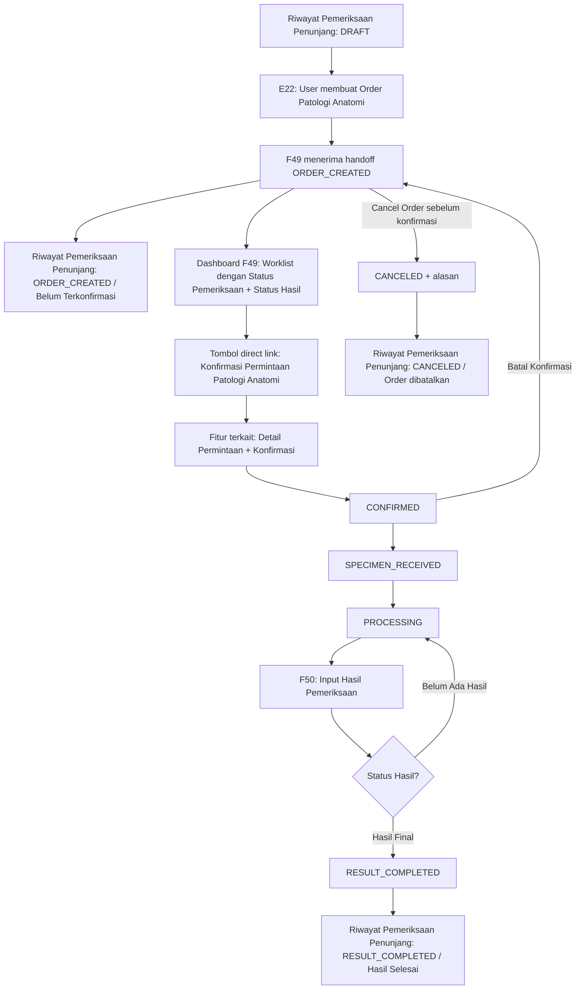

# Product Requirement Document (PRD) — Dashboard Patologi Anatomi (F49)

**Catatan relasi:** **Konfirmasi Permintaan Patologi Anatomi** adalah fitur/PRD terkait yang berada di luar scope **Dashboard Patologi Anatomi (F49)**. F49 hanya menyediakan tombol direct link menuju fitur tersebut dan menampilkan status/metadata hasil konfirmasi yang diterima.

**Parent/producer:** E22 Order Patologi Anatomi  
**Consumer/related:** Konfirmasi Permintaan Patologi Anatomi, F50 Input Hasil Uji, D3 Data Sosial, E1 Tindakan dan BHP, Riwayat Pemeriksaan Penunjang  
**Timezone:** Asia/Jakarta  
**Versi:** 1.3 - Sinkronisasi status Riwayat Pemeriksaan Penunjang dengan F49 dan penambahan status lokal Draft

## 1. Metadata Dokumen

| Item | Nilai |
|---|---|
| Feature Code | F49 |
| Nama Fitur | Dashboard Patologi Anatomi |
| Modul | Laboratorium — Patologi Anatomi |
| Parent | E22 Order Patologi Anatomi |
| Status | Draft PRD |
| Default periode | Order aktif pada hari berjalan atau 7 hari terakhir, mengikuti konfigurasi RS, timezone Asia/Jakarta |

### Approval

| Nama | Jabatan | Tanggal |
|---|---|---|
| [PERLU KONFIRMASI] | Kepala Laboratorium Patologi Anatomi | [PERLU KONFIRMASI] |
| [PERLU KONFIRMASI] | Product Owner SIMRS | [PERLU KONFIRMASI] |

## 2. Overview & Background

### Overview / Brief Summary

Dashboard Patologi Anatomi (F49) adalah pusat monitoring seluruh permintaan pemeriksaan Patologi Anatomi yang dibuat melalui E22. Dashboard membantu petugas laboratorium memantau status setiap order secara real-time, menemukan permintaan dengan cepat, serta memprioritaskan pemeriksaan yang masih menunggu proses atau belum memiliki hasil.

F49 menampilkan daftar order dengan dua indikator utama yang dipisahkan: **Status Pemeriksaan** untuk progres operasional pemeriksaan, dan **Status Hasil Patologi** untuk ketersediaan hasil. Untuk proses **Detail Permintaan** dan **Konfirmasi Permintaan Patologi Anatomi**, F49 hanya menyediakan tombol direct link ke fitur/PRD terkait dengan membawa konteks order; detail proses bisnis, validasi, approval, form, dan perubahan status konfirmasi dikelola di luar scope F49.

F49 juga mengirim pembaruan status ke Riwayat Pemeriksaan Penunjang agar pengorder melihat status yang sama dengan Dashboard Patologi Anatomi. Status pada Riwayat Pemeriksaan Penunjang selalu sinkron dengan `service_status` F49 setelah order dikirim, sedangkan status **Draft** hanya dibuat dari fitur Riwayat Pemeriksaan Penunjang sebelum order dikirim ke F49.

### Business Process (As-Is vs To-Be)

**As-Is [ASUMSI]:** Permintaan Patologi Anatomi dapat dipantau melalui komunikasi antar-unit atau daftar terpisah. Unit asal tidak selalu mengetahui apakah order sudah diterima Lab, sedang dikerjakan, selesai, atau dibatalkan. Akses ke detail permintaan, konfirmasi, input hasil, dan tindak lanjut belum terorkestrasi dari satu worklist.

**To-Be:**

1. User membuat order melalui **E22 Order Patologi Anatomi**.
2. E22 membuat order unik dan mengirim handoff ke F49 dengan status `ORDER_CREATED` / **Belum Terkonfirmasi**.
3. F49 menampilkan order pada Dashboard Patologi Anatomi dengan badge **Status Pemeriksaan** dan badge **Status Hasil Patologi**. Pada Riwayat Pemeriksaan Penunjang, status langsung menjadi `ORDER_CREATED` / **Belum Terkonfirmasi** agar sinkron dengan F49.
4. User Lab menekan tombol direct link **Konfirmasi Permintaan Patologi Anatomi** dari F49. Detail permintaan dan proses konfirmasi dikelola oleh fitur/PRD terkait.
5. Setelah konfirmasi selesai, F49 menerima/menampilkan status `CONFIRMED` / **Terkonfirmasi**. Selanjutnya order dapat bergerak ke `SPECIMEN_RECEIVED` dan `PROCESSING`; user dapat membuka D3, F50, dan E1 dari baris yang sama.
6. User mengisi hasil pemeriksaan melalui **F50 Input Hasil Uji**. F49 hanya membaca `result_status` dari F50 dengan nilai final `NO_RESULT` atau `FINAL`; nilai sementara internal modul hasil tidak ditampilkan di dashboard.
7. Setelah hasil final tersedia, user memilih **Tandai Pemeriksaan Selesai**. Status F49 menjadi `RESULT_COMPLETED`, dan Riwayat Pemeriksaan Penunjang menampilkan status yang sama: `RESULT_COMPLETED` / **Hasil Selesai**.
8. Bila order dibatalkan sebelum konfirmasi, status F49 menjadi `CANCELED` / **Order dibatalkan** dan Riwayat Pemeriksaan Penunjang menampilkan status yang sama beserta alasan. Bila batal dilakukan setelah status `CONFIRMED`, prosesnya adalah rollback ke `ORDER_CREATED` / **Belum Terkonfirmasi** pada F49 dan Riwayat Pemeriksaan Penunjang, bukan pembatalan order.

## 3. Goals & Metrics

| No | Metrics | Success Criteria |
|---|---|---|
| 1 | Visibilitas order | 100% order E22 yang berhasil tersimpan muncul di F49 maksimal 2 detik pada load/refresh normal. |
| 2 | Sinkronisasi status | 100% perubahan `ORDER_CREATED`, `CONFIRMED`, `SPECIMEN_RECEIVED`, `PROCESSING`, `RESULT_COMPLETED`, atau `CANCELED` tersinkronisasi antara Dashboard Patologi Anatomi dan Riwayat Pemeriksaan Penunjang dengan kode dan label yang sama. |
| 3 | Kelengkapan order | 100% row F49 menampilkan No. Order, Nama Pasien, No. RM, Jenis Penjamin, Unit Perawatan, DPJP, Tanggal Order, Status Pemeriksaan, dan Status Hasil Patologi. |
| 4 | Kelengkapan hasil | 100% order yang sudah memiliki hasil menampilkan `result_id` dan `result_status`; order final tidak boleh tampil sebagai **Belum Ada Hasil**. |
| 5 | Audit | 100% status/metadata konfirmasi, penolakan, pembatalan, input hasil, dan penyelesaian dapat ditelusuri dari F49 sesuai data yang diterima dari modul pemilik proses. |
| 6 | Pencegahan duplikasi | Retry command tidak membuat hasil, penyelesaian, pembatalan, atau event sinkronisasi status ganda di F49. |
| 7 | Performa filter/search | Filter dan search real-time merespons maksimal 1 detik untuk dataset sesuai kapasitas operasional RS. |

### Expected Improvement From V1

**Aspek Business Process:**

- Petugas laboratorium dapat memonitor progres seluruh pemeriksaan dalam satu dashboard.
- Pemeriksaan yang menunggu proses, belum memiliki hasil, sudah final, atau dibatalkan dapat diidentifikasi tanpa membuka detail order.
- Status pemeriksaan hanya berubah melalui event proses bisnis dari konfirmasi, penerimaan spesimen, pemeriksaan, finalisasi hasil, cancel order sebelum konfirmasi, rollback konfirmasi, atau penanda selesai; status tidak dapat diubah manual dari grid dashboard.
- Order yang dibatalkan tetap muncul untuk kebutuhan audit dan dapat dicari/filter sesuai hak akses.
- Default tampilan memakai order aktif dalam rentang tanggal terbatas untuk menjaga performa.

**Aspek User Experience:**

- Status pemeriksaan dan status hasil ditampilkan sebagai badge/label warna.
- Filter dapat dikombinasikan dengan search real-time tanpa reload halaman.
- User dapat melakukan refresh manual untuk menarik data terbaru setelah konfirmasi, input hasil final, penanda selesai, cancel order, atau rollback konfirmasi; status yang terlihat di Riwayat Pemeriksaan Penunjang harus sama dengan status F49.

**Aspek Logic System:**

- Status Dashboard Patologi Anatomi dan Riwayat Pemeriksaan Penunjang selalu tersinkron dengan proses konfirmasi order, penerimaan spesimen, pemeriksaan, pengisian hasil final, penanda selesai, cancel order, dan rollback konfirmasi.
- Status hasil otomatis mengikuti ketersediaan hasil final pemeriksaan di F50/fitur pemilik hasil.
- Dashboard hanya menampilkan data sesuai hak akses unit dan role pengguna.

## 4. Scope Definition & Phasing

| Fitur/Modul | Phase 1 (MVP: CRUD) | Phase 2 (Advanced: Approval/Escalation) | Phase 3 (Accounting: Mapping COA) |
|---|---|---|---|
| Dashboard Worklist F49 | List order, pencarian real-time, filter kombinatif, pagination/virtual scroll, Status Pemeriksaan, Status Hasil Patologi, loading/empty/error. | Saved filter, SLA, escalation, notifikasi. | N/A. |
| Direct Link Konfirmasi Permintaan PA | Menyediakan tombol direct link ke fitur Konfirmasi Permintaan Patologi Anatomi dengan konteks order; akses detail permintaan dan proses konfirmasi dilakukan di fitur terkait, bukan di F49. | Menampilkan status/indikator hasil escalation dari fitur terkait bila tersedia. | N/A. |
| Filter, Search, dan Refresh | Filter rentang tanggal, Status Pemeriksaan, Status Hasil, DPJP, Unit Perawatan, dan Jenis Penjamin opsional; search No. Order, Nama Pasien, No. RM, DPJP, dan Unit; tombol refresh data. | Saved query dan export sesuai RBAC bila diperlukan. | N/A. |
| Input Hasil | Deep link/context ke F50 dan validasi referensi hasil. | Review/validasi hasil berjenjang. | Mapping biaya/COA mengikuti owner tindakan/Billing. |
| Action Launcher | D3 Data Sosial dan E1 Tindakan/BHP dari konteks order; F50 input hasil. | Konfigurasi action per role/unit. | Charge/jurnal mengikuti modul pemilik dan Billing. |
| Penyelesaian Uji | Button penanda pemeriksaan telah selesai setelah hasil F50 tersedia; sinkron ke Riwayat Pemeriksaan Penunjang. | Re-open/correction dengan approval. | N/A pada F49; transaksi finansial mengikuti modul terkait. |
| Status sinkron Riwayat Pemeriksaan Penunjang | Riwayat Pemeriksaan Penunjang menampilkan status yang sama dengan F49: `ORDER_CREATED`, `CONFIRMED`, `SPECIMEN_RECEIVED`, `PROCESSING`, `RESULT_COMPLETED`, atau `CANCELED`; status lokal `DRAFT` hanya dari fitur Riwayat Pemeriksaan Penunjang sebelum order dikirim. | Event replay, reconciliation, escalation. | N/A. |

**Out of Scope Phase 1:**

- Membuat atau mengedit order pemeriksaan; order tetap dibuat melalui E22.
- **Detail Permintaan Patologi Anatomi**: pembacaan detail input E22, form/detail klinis, validasi kelengkapan spesimen, lampiran, dan tampilan detail lengkap dikelola oleh fitur Konfirmasi Permintaan Patologi Anatomi atau PRD terkait. F49 hanya menyediakan tombol direct link.
- **Konfirmasi Permintaan Patologi Anatomi**: proses bisnis, validasi, approval, penyimpanan event konfirmasi, dan perubahan status ke `CONFIRMED` dikelola oleh fitur Konfirmasi Permintaan Patologi Anatomi. F49 hanya menyediakan tombol direct link dan menampilkan status/metadata hasil konfirmasi.
- Mengisi/mengubah hasil klinis langsung di F49; F50 menjadi source of truth hasil uji.
- Validasi hasil pemeriksaan oleh dokter PA; F49 hanya menampilkan ketersediaan hasil final yang diterima dari modul pemilik hasil.
- Mengelola detail pemeriksaan, spesimen, atau metode pemeriksaan di luar input E22/F50.
- Mengubah status klinis utama pasien di Riwayat Pemeriksaan Penunjang selain status order Patologi Anatomi yang disinkronkan dari F49.
- Approval berjenjang, SLA escalation, re-open hasil, klaim, jurnal, dan mapping COA.

## 5. Related Features

| Kode | Fitur | Relasi Teknis/Bisnis |
|---|---|---|
| E22 | Order Patologi Anatomi | Producer order dan sumber order awal. Detail input E22 dibuka melalui fitur Konfirmasi Permintaan Patologi Anatomi, bukan diproses langsung oleh F49. |
| Konfirmasi Permintaan Patologi Anatomi | Detail Permintaan dan Konfirmasi | Fitur/PRD terkait yang menjadi pemilik Detail Permintaan dan Konfirmasi Permintaan Patologi Anatomi. F49 hanya menyediakan tombol direct link dengan konteks order serta menampilkan status/metadata hasilnya. |
| F50 | Input Hasil Uji | Tempat input, menyimpan, dan mengubah hasil uji Patologi Anatomi. |
| D3 | Data Sosial | Dibuka dengan konteks pasien/encounter/order yang sama. |
| E1 | Tindakan dan BHP | Dibuka untuk input tindakan/BHP terkait layanan Patologi Anatomi. |
| Riwayat Pemeriksaan Penunjang | Riwayat pemeriksaan penunjang pasien | Menerima status yang sama dengan Status Pemeriksaan F49; status `DRAFT` dibuat lokal dari fitur Riwayat Pemeriksaan Penunjang sebelum order dikirim ke F49. |
| G2 | Billing — Tagihan Pasien | Konsumen charge dari tindakan/BHP bila dibuat oleh E1/Billing owner. |

## 6. Business Process & User Stories

### State Machine

| Status Pemeriksaan | Label F49 | Deskripsi | Status Hasil yang Umum | Transisi Phase 1 | Transisi Phase 2 |
|---|---|---|---|---|---|
| `ORDER_CREATED` | Belum Terkonfirmasi | Order E22 masuk dan belum dikonfirmasi Lab. | `NO_RESULT` | Tombol direct link Konfirmasi Permintaan Patologi Anatomi; konfirmasi berhasil -> `CONFIRMED`; cancel order sebelum konfirmasi -> `CANCELED`. | Escalation/SLA dari fitur terkait ditampilkan bila tersedia. |
| `CONFIRMED` | Terkonfirmasi | Permintaan telah dikonfirmasi pada fitur Konfirmasi Permintaan Patologi Anatomi. | `NO_RESULT` | Terima spesimen -> `SPECIMEN_RECEIVED`; Batal Konfirmasi -> rollback ke `ORDER_CREATED`. | Approval/triage di fitur terkait. |
| `SPECIMEN_RECEIVED` | Spesimen Diterima | Spesimen/permintaan diterima dari proses konfirmasi, namun belum diproses aktif. | `NO_RESULT` | Mulai proses pemeriksaan -> `PROCESSING`. | Revisi penerimaan spesimen dengan approval. |
| `PROCESSING` | Sedang diperiksa | Pemeriksaan sedang dikerjakan Lab. | `NO_RESULT` atau `FINAL` | Input hasil via F50; Tandai Pemeriksaan Selesai hanya bila `result_status=FINAL` -> `RESULT_COMPLETED`. | Re-open/correction dengan approval. |
| `RESULT_COMPLETED` | Hasil Selesai | Pemeriksaan ditandai selesai dan hasil final tersedia. | `FINAL` | Terminal operasional F49; Riwayat Pemeriksaan Penunjang ikut menampilkan `RESULT_COMPLETED` / **Hasil Selesai**. | Re-open/correction dengan approval. |
| `CANCELED` | Order dibatalkan | Order dibatalkan ketika masih `ORDER_CREATED` / Belum Terkonfirmasi. | `NO_RESULT` | Terminal; alasan wajib; Riwayat Pemeriksaan Penunjang ikut menampilkan `CANCELED` / **Order dibatalkan**. | Re-open dengan approval bila RS mengizinkan. |

### Status Hasil Patologi

| Result Status | Label F49 | Sumber | Aturan Tampilan |
|---|---|---|---|
| `NO_RESULT` | Belum Ada Hasil | F50/fitur hasil | Default untuk order yang belum memiliki `result_id`; tidak boleh dipakai bila `result_id` final tersedia. |
| `FINAL` | Hasil Final | F50/fitur hasil | Menunjukkan hasil final tersedia; harus konsisten dengan `RESULT_COMPLETED` saat pemeriksaan dinyatakan selesai. |

### Status Riwayat Pemeriksaan Penunjang

| Sumber Event | Status pada Riwayat Pemeriksaan Penunjang | Aturan Sinkronisasi | Wajib Metadata |
|---|---|---|---|
| Fitur Riwayat Pemeriksaan Penunjang membuat konsep permintaan tetapi belum mengirim order | `DRAFT` / **Draft** | Status lokal Riwayat Pemeriksaan Penunjang; belum muncul di F49 dan belum memiliki `worklist_id` F49. | `draft_id`, `encounter_id`, `created_at`, actor pembuat. |
| E22 order created / F49 menerima order | `ORDER_CREATED` / **Belum Terkonfirmasi** | Status Riwayat Pemeriksaan Penunjang harus sama dengan `service_status` F49. | `pathology_order_id`, `encounter_id`, timestamp, source unit. |
| F49 menerima `CONFIRMED` | `CONFIRMED` / **Terkonfirmasi** | Status Riwayat Pemeriksaan Penunjang harus sama dengan `service_status` F49. | `confirmed_at`, `confirmed_by`, actor terkait. |
| F49 menerima `SPECIMEN_RECEIVED` | `SPECIMEN_RECEIVED` / **Spesimen Diterima** | Status Riwayat Pemeriksaan Penunjang harus sama dengan `service_status` F49. | `received_at`, `received_by`, actor terkait. |
| F49 menerima `PROCESSING` | `PROCESSING` / **Sedang diperiksa** | Status Riwayat Pemeriksaan Penunjang harus sama dengan `service_status` F49. | `processing_started_at`, actor terkait. |
| F49 menerima `RESULT_COMPLETED` | `RESULT_COMPLETED` / **Hasil Selesai** | Status Riwayat Pemeriksaan Penunjang harus sama dengan `service_status` F49. | `result_id`, `result_status`, `completed_at`, actor terkait. |
| F49 menerima `CANCELED` dari cancel order sebelum konfirmasi | `CANCELED` / **Order dibatalkan** | Status Riwayat Pemeriksaan Penunjang harus sama dengan `service_status` F49. | `cancel_reason`, `canceled_at`, actor terkait. |
| F49 menerima rollback `CONFIRMED` -> `ORDER_CREATED` | `ORDER_CREATED` / **Belum Terkonfirmasi** | Status Riwayat Pemeriksaan Penunjang ikut rollback ke status F49 terbaru; bukan `CANCELED`. | `rollback_reason`, `rolled_back_at`, actor terkait. |

Catatan: setelah order masuk F49, status pada Riwayat Pemeriksaan Penunjang tidak boleh memakai mapping ringkas non-F49. Kode dan label status harus sama dengan Dashboard Patologi Anatomi. Status `DRAFT` hanya berlaku lokal di fitur Riwayat Pemeriksaan Penunjang sebelum order dikirim ke F49.

### User Stories Utama

- Sebagai petugas Lab Patologi Anatomi, saya ingin melihat seluruh order E22 pada worklist agar dapat mengatur urutan pengerjaan.
- Sebagai petugas Lab Patologi Anatomi, saya ingin melihat Status Pemeriksaan dan Status Hasil Patologi dalam badge warna agar progres order langsung terbaca.
- Sebagai petugas Lab Patologi Anatomi, saya ingin memakai filter kombinatif dan search real-time agar dapat menemukan order berdasarkan No. Order, pasien, No. RM, DPJP, atau unit.
- Sebagai petugas Lab Patologi Anatomi, saya ingin menekan Refresh agar perubahan status terbaru langsung terlihat.
- Sebagai petugas Lab, saya ingin membuka fitur Konfirmasi Permintaan Patologi Anatomi melalui tombol direct link dari F49 agar detail permintaan dan konfirmasi diproses di fitur pemiliknya tanpa memilih ulang order.
- Sebagai petugas Lab, saya ingin cancel order sebelum konfirmasi dan batal konfirmasi setelah terkonfirmasi mengikuti aturan status yang jelas agar unit asal dan audit tetap konsisten.
- Sebagai petugas Lab, saya ingin membuka F50, D3, dan E1 dari row yang sama agar konteks pasien tidak berubah.
- Sebagai petugas Lab, saya ingin menyatakan Selesai Uji setelah hasil F50 tersedia agar status pada Riwayat Pemeriksaan Penunjang ikut diperbarui.
- Sebagai user pengorder, saya ingin melihat status Patologi Anatomi yang sama dengan Dashboard Patologi Anatomi pada Riwayat Pemeriksaan Penunjang, termasuk status lokal **Draft** sebelum order dikirim.

## 7. Functional Requirements

### 7.1 Fitur: Dashboard Worklist Patologi Anatomi

* **User Story:** Sebagai petugas Lab, saya ingin melihat daftar order Patologi Anatomi yang perlu diproses agar pekerjaan dapat dipantau dari satu dashboard.
* **Prioritas:** P0
* **Fase:** Phase 1
* **Acceptance Criteria:**
  * **AC 1:** Sistem menampilkan order yang berada pada scope unit/role Lab Patologi Anatomi.
  * **AC 2:** Setiap row menampilkan No. Order unik, Nama Pasien, No. RM, Jenis Penjamin, Unit Perawatan, DPJP, Tanggal dan Jam Order, Status Pemeriksaan, Status Hasil Patologi, dan aksi sesuai state/RBAC.
  * **AC 3:** Status Pemeriksaan dan Status Hasil Patologi ditampilkan sebagai badge/label warna yang konsisten antar state.
  * **AC 4:** Default filter waktu menggunakan order aktif pada hari berjalan atau 7 hari terakhir dalam timezone Asia/Jakarta sesuai konfigurasi RS; user dapat mengatur rentang tanggal.
  * **AC 5:** Status `CANCELED` tetap tersimpan sebagai audit dan tidak dihapus secara fisik.
  * **AC 6:** Row yang berubah status tidak boleh tampil bersamaan pada bucket status yang tidak sesuai setelah refresh/sinkronisasi.
  * **AC 7:** Dashboard membedakan secara jelas order `NO_RESULT` dan `FINAL`; nilai sementara internal modul hasil tidak ditampilkan di dashboard.

### 7.2 Fitur: Tombol Direct Link Konfirmasi Permintaan Patologi Anatomi

* **Catatan Scope:** Detail Permintaan dan Konfirmasi Permintaan Patologi Anatomi adalah outscope F49. F49 hanya menyediakan tombol direct link ke fitur Konfirmasi Permintaan Patologi Anatomi dan menampilkan status/metadata hasil yang diterima.
* **User Story:** Sebagai petugas Lab, saya ingin membuka fitur Konfirmasi Permintaan Patologi Anatomi dari dashboard F49 agar detail permintaan dan konfirmasi diproses di fitur pemiliknya tanpa memilih ulang order.
* **Prioritas:** P0
* **Fase:** Phase 1
* **Acceptance Criteria:**
  * **AC 1:** Tombol direct link **Konfirmasi Permintaan Patologi Anatomi** hanya tersedia pada row berstatus `ORDER_CREATED`.
  * **AC 2:** Ketika diklik, F49 membuka fitur Konfirmasi Permintaan Patologi Anatomi dengan membawa minimal `patient_id`, `encounter_id`, `pathology_order_id`, `worklist_id`, `order_number`, `service_context=PATHOLOGY_ANATOMY`, dan `source_unit_id`.
  * **AC 3:** F49 tidak menampilkan detail permintaan lengkap, form konfirmasi, validasi klinis/spesimen, approval, atau penyimpanan utama event `RECEIVED`/`CONFIRMED`.
  * **AC 4:** Setelah proses selesai di fitur terkait, F49 menerima/menampilkan status `CONFIRMED` beserta metadata konfirmasi, misalnya `confirmed_at` dan `confirmed_by`.
  * **AC 5:** Setelah status bukan `ORDER_CREATED`, tombol direct link konfirmasi tidak lagi ditampilkan sebagai aksi utama konfirmasi; akses lanjutan mengikuti state dan RBAC.
  * **AC 6:** F49 mencatat audit pembukaan direct link sebagai action launcher, tanpa menggandakan event/transition yang menjadi domain fitur terkait.

### 7.3 Fitur: Action Launcher D3, F50, dan E1

* **User Story:** Sebagai petugas Lab, saya ingin membuka fitur terkait dari row pasien agar seluruh tindakan menggunakan konteks order Patologi Anatomi yang sama.
* **Prioritas:** P0
* **Fase:** Phase 1
* **Acceptance Criteria:**
  * **AC 1:** D3 Data Sosial dapat dibuka dari semua state sesuai RBAC dan hak akses unit.
  * **AC 2:** F50 Input Hasil Uji tersedia setelah status minimal `SPECIMEN_RECEIVED`/`PROCESSING` sesuai aturan RS dan menerima konteks pasien, encounter, serta order Patologi Anatomi.
  * **AC 3:** E1 Tindakan dan BHP dapat dibuka dari row dengan konteks `service_context=PATHOLOGY_ANATOMY`.
  * **AC 4:** F49 tidak menyalin atau mengedit data klinis milik D3/F50/E1; modul tujuan menjadi source of truth.
  * **AC 5:** F50 yang berhasil disimpan menghasilkan `result_id` dan `result_status` yang dapat dibaca F49 untuk membedakan **Belum Ada Hasil** dan **Hasil Final**.

### 7.4 Fitur: Penanda Pemeriksaan Telah Selesai

* **User Story:** Sebagai petugas Lab, saya ingin menandai pemeriksaan telah selesai setelah hasil tersedia agar Riwayat Pemeriksaan Penunjang menerima status final.
* **Prioritas:** P0
* **Fase:** Phase 1
* **Acceptance Criteria:**
  * **AC 1:** Aksi **Tandai Pemeriksaan Selesai** hanya tersedia pada state `PROCESSING` sesuai RBAC.
  * **AC 2:** Sistem menolak penyelesaian bila `result_id` F50 belum tersedia atau `result_status` bukan `FINAL`.
  * **AC 3:** Penyelesaian mencatat `RESULT_COMPLETED`, `completed_at`, `completed_by`, `result_id`, `result_status`, dan audit event.
  * **AC 4:** Sistem mengirim event status ke Riwayat Pemeriksaan Penunjang dengan kode dan label yang sama dengan F49, yaitu `RESULT_COMPLETED` / **Hasil Selesai**.
  * **AC 5:** Retry setelah `RESULT_COMPLETED` bersifat idempotent dan tidak mengubah timestamp penyelesaian pertama.

### 7.5 Fitur: Cancel Order, Batal Konfirmasi, dan Sinkronisasi Status Asal

* **User Story:** Sebagai user pengorder, saya ingin melihat status Lab yang akurat pada Riwayat Pemeriksaan Penunjang agar dapat menindaklanjuti order yang selesai, dibatalkan sebelum konfirmasi, atau dikembalikan ke belum terkonfirmasi.
* **Prioritas:** P0
* **Fase:** Phase 1
* **Acceptance Criteria:**
  * **AC 1:** F49 menerbitkan event perubahan status dengan correlation id order/encounter.
  * **AC 2:** Cancel order hanya berlaku ketika status masih `ORDER_CREATED` / **Belum Terkonfirmasi**; hasilnya `CANCELED` / **Order dibatalkan**, alasan wajib, dan actor berwenang.
  * **AC 3:** Batal setelah status `CONFIRMED` / **Terkonfirmasi** mengembalikan status ke `ORDER_CREATED` / **Belum Terkonfirmasi**, alasan wajib, dan tidak diproyeksikan sebagai order dibatalkan.
  * **AC 4:** Riwayat Pemeriksaan Penunjang menerapkan event secara idempotent dan menampilkan status terakhir, waktu, serta alasan pembatalan atau rollback bila ada.
  * **AC 5:** Kegagalan pengiriman event masuk outbox/retry; perubahan status F49 tidak di-rollback hanya karena consumer Riwayat Pemeriksaan Penunjang sedang tidak tersedia.

### 7.6 Fitur: Filter, Search, dan Refresh Data

* **User Story:** Sebagai petugas Lab, saya ingin memfilter, mencari, dan me-refresh data worklist agar prioritas pemeriksaan dapat ditemukan cepat tanpa reload halaman penuh.
* **Prioritas:** P0
* **Fase:** Phase 1
* **Acceptance Criteria:**
  * **AC 1:** Filter tersedia untuk rentang tanggal, Status Pemeriksaan, Status Hasil, DPJP, Unit Perawatan, dan Jenis Penjamin opsional.
  * **AC 2:** Filter dapat dikombinasikan tanpa mengubah data sumber dan tanpa menghilangkan order di luar parameter.
  * **AC 3:** Search real-time mendukung No. Order, Nama Pasien, No. RM, DPJP, dan Unit.
  * **AC 4:** Search dan filter dapat digunakan bersamaan; perubahan input menghasilkan data yang lebih spesifik tanpa reload halaman.
  * **AC 5:** Tombol **Refresh** mengambil data terbaru dan memperbarui row yang berubah status setelah konfirmasi, input hasil, validasi, pembatalan, atau penanda selesai.
  * **AC 6:** Load dashboard dan refresh data maksimal 2 detik; filter/search maksimal 1 detik untuk dataset operasional sesuai indeks yang direkomendasikan.

### 7.7 Validasi

#### A. Wording Validasi (Frontend)

| Field/Aksi | Tipe | Rules | Error Message | Helper Text |
|---|---|---|---|---|
| No. Order | Read-only | Harus berasal dari E22 dan unik | `No. Order Patologi Anatomi tidak valid.` | `Nomor order berasal dari E22.` |
| Direct Link Konfirmasi Permintaan Patologi Anatomi | Button | Hanya `ORDER_CREATED`; `patient_id`, `encounter_id`, `pathology_order_id`, `worklist_id`, dan `order_number` wajib tersedia | `Link konfirmasi permintaan tidak dapat dibuka.` | `Buka fitur Konfirmasi Permintaan Patologi Anatomi.` |
| Alasan Cancel/Rollback | Textarea | Required, max 500 karakter untuk cancel order dan batal konfirmasi | `Alasan wajib diisi.` | `Jelaskan alasan cancel order atau batal konfirmasi.` |
| Filter Status Pemeriksaan | Select | Enum Status Pemeriksaan valid | `Status pemeriksaan tidak valid.` | `Pilih satu atau lebih status pemeriksaan.` |
| Filter Status Hasil | Select | Enum `NO_RESULT`, `FINAL` | `Status hasil tidak valid.` | `Pilih status ketersediaan hasil.` |
| Input Hasil Pemeriksaan | Deep link F50 | Hanya state aktif setelah diterima/diproses sesuai RBAC | `Hasil hanya dapat diinput setelah permintaan diterima/diproses.` | `Buka F50 untuk memasukkan hasil.` |
| Tandai Pemeriksaan Selesai | Button | `result_id` wajib dan `result_status=FINAL` | `Hasil pemeriksaan belum tersedia.` | `Simpan hasil final pada F50 sebelum menandai selesai.` |
| Refresh Data | Button | User memiliki akses dashboard; request idempotent | `Data terbaru belum dapat diambil.` | `Ambil status pemeriksaan terbaru.` |

#### B. Validasi Server dan Integritas Data

| No | Rule | Behavior | Response/Action |
|---|---|---|---|
| 1 | Order E22 harus ada dan encounter aktif | Hard Block | HTTP 404/422. |
| 2 | User harus memiliki scope Lab Patologi Anatomi | Hard Block | HTTP 403. |
| 3 | Direct link Konfirmasi Permintaan Patologi Anatomi memakai order yang sama | Relational Guard | Tolak pembuatan link jika patient/encounter/order mismatch. |
| 4 | Tombol direct link konfirmasi hanya dari `ORDER_CREATED` | State Guard | Sembunyikan/nonaktifkan tombol bila sudah diproses user lain. |
| 5 | Detail dan konfirmasi adalah domain fitur terkait | Scope Guard | F49 menerima/menampilkan status pemeriksaan seperti `CONFIRMED`, `SPECIMEN_RECEIVED`, atau `PROCESSING`. |
| 6 | F50 hanya dapat dipakai dari state aktif setelah order diterima/diproses | State Guard | HTTP 409/422 bila state tidak sesuai. |
| 7 | Selesai membutuhkan hasil F50 final | Hard Block | Tidak boleh mengubah status ke `RESULT_COMPLETED` bila `result_id` kosong atau `result_status` bukan `FINAL`. |
| 8 | Hasil final tidak boleh tampil sebagai belum ada hasil | Consistency Guard | Reject update bila `result_status=NO_RESULT` tetapi `result_id` final tersedia. |
| 9 | Filter/search hanya membatasi query tampilan | Query Guard | Tidak mengubah, menghapus, atau menimpa data sumber. |
| 10 | Refresh harus idempotent dan memakai data terbaru | Event Guard | Outbox/retry dengan correlation id; row diperbarui berdasar versi/timestamp terbaru. |
| 11 | Dashboard dibatasi hak akses unit dan role | RBAC Guard | Data di luar scope user tidak dikembalikan oleh API. |
| 12 | Cancel order hanya dari `ORDER_CREATED` | State Guard | Jika belum dikonfirmasi, status berubah ke `CANCELED`, alasan wajib, dan Riwayat Pemeriksaan Penunjang menerima status `CANCELED` / **Order dibatalkan**. |
| 13 | Batal konfirmasi hanya dari `CONFIRMED` | State Guard | Jika sudah terkonfirmasi, status kembali ke `ORDER_CREATED`, alasan wajib, audit tercatat, dan tidak menjadi `CANCELED`. |

## 8. Data & Technical Specifications

### 8.1 Database Schema Suggestion

**Table: `pathology_anatomy_worklists`**

* `id`: UUID, primary key.
* `pathology_order_id`: UUID, unique per order aktif, referensi E22.
* `order_number`: VARCHAR(50), unique, nomor order yang ditampilkan.
* `patient_id`, `encounter_id`: UUID, not null.
* `patient_name_snapshot`: VARCHAR(200), not null.
* `patient_gender_snapshot`: VARCHAR(20), not null.
* `patient_age_snapshot`: SMALLINT, not null.
* `medical_record_no_snapshot`: VARCHAR(50), not null.
* `payer_type_snapshot`: VARCHAR(100), not null.
* `source_unit_id`, `source_unit_name_snapshot`: UUID/VARCHAR(150), not null.
* `ordering_doctor_id`, `ordering_doctor_name_snapshot`: UUID/VARCHAR(200), not null.
* `ordered_at`: TIMESTAMPTZ, not null.
* `service_status`: ENUM `ORDER_CREATED`, `CONFIRMED`, `SPECIMEN_RECEIVED`, `PROCESSING`, `RESULT_COMPLETED`, `CANCELED`.
* `service_status_label`: VARCHAR(100), snapshot label UI Status Pemeriksaan.
* `result_status`: ENUM `NO_RESULT`, `FINAL`, not null default `NO_RESULT`.
* `result_status_label`: VARCHAR(100), snapshot label UI Status Hasil Patologi.
* `result_status_updated_at`: TIMESTAMPTZ, nullable.
* `received_at`, `received_by`: TIMESTAMPTZ/UUID, nullable.
* `completed_at`, `completed_by`: TIMESTAMPTZ/UUID, nullable.
* `canceled_at`, `canceled_by`, `cancel_reason`: TIMESTAMPTZ/UUID/TEXT, nullable.
* `rolled_back_at`, `rolled_back_by`, `rollback_reason`: TIMESTAMPTZ/UUID/TEXT, nullable untuk batal konfirmasi.
* `result_id`: UUID, nullable, referensi F50.
* `supporting_exam_history_status_code`, `supporting_exam_history_status_label`, `supporting_exam_history_status_updated_at`: VARCHAR/TIMESTAMPTZ, snapshot status sinkron Riwayat Pemeriksaan Penunjang.
* `version`: BIGINT, optimistic locking.
* `created_at`, `updated_at`: TIMESTAMPTZ.

**Table: `pathology_anatomy_worklist_events`**

* `id`: UUID primary key.
* `worklist_id`: UUID foreign key.
* `event_type`: ENUM `CREATED`, `CONFIRMED`, `SPECIMEN_RECEIVED`, `PROCESSING_STARTED`, `RESULT_STATUS_CHANGED`, `RESULT_COMPLETED`, `CANCELED`, `CONFIRMATION_ROLLED_BACK`, `ACTION_OPENED`, `REFRESH_REQUESTED`, `SOURCE_STATUS_PUBLISHED`.
* `from_status`, `to_status`: VARCHAR(30).
* `actor_id`, `actor_role`: UUID/VARCHAR(50).
* `occurred_at`: TIMESTAMPTZ.
* `reason`, `metadata_json`: TEXT/JSONB.
* `idempotency_key`, `correlation_id`: VARCHAR(100).

**Table: `pathology_anatomy_supporting_exam_history_status_outbox`**

* `id`: UUID primary key.
* `worklist_id`, `patient_id`, `encounter_id`: UUID.
* `source_unit_id`: UUID.
* `status_code`, `status_label`: VARCHAR(50/150), wajib memakai kode/label `service_status` F49 untuk order yang sudah masuk F49.
* `reason`: TEXT nullable.
* `occurred_at`: TIMESTAMPTZ.
* `delivery_status`: ENUM `PENDING`, `SENT`, `FAILED`.
* `retry_count`, `last_error`: INTEGER/TEXT.
* `correlation_id`, `idempotency_key`: VARCHAR(100).

### 8.2 API Endpoint Recommendations

| Method | Endpoint | Description |
|---|---|---|
| GET | `/api/v1/pathology-anatomy/worklists` | List worklist F49 dengan filter periode, Status Pemeriksaan, Status Hasil, DPJP, Unit Perawatan, Jenis Penjamin, dan search. |
| GET | `/api/v1/pathology-anatomy/worklists/{worklistId}` | Detail ringkas worklist F49; tidak mengambil atau menampilkan detail permintaan E22 lengkap. |
| GET | `/api/v1/pathology-anatomy/worklists/{worklistId}/confirmation-link` | Menghasilkan direct link ke fitur Konfirmasi Permintaan Patologi Anatomi dengan konteks order; tidak memproses detail/konfirmasi di F49. |
| POST | `/api/v1/pathology-anatomy/worklists/{worklistId}/cancel` | Membatalkan order Lab dengan alasan sesuai RBAC/state. |
| POST | `/api/v1/pathology-anatomy/worklists/{worklistId}/complete` | Menyelesaikan uji setelah `result_id` F50 valid. |
| POST | `/api/v1/pathology-anatomy/worklists/refresh` | Mengambil data terbaru berdasarkan filter aktif; response idempotent dan menghormati RBAC unit/role. |
| POST | `/api/v1/pathology-anatomy/worklists/{worklistId}/supporting-exam-history-status` | Menerbitkan sinkronisasi status ke Riwayat Pemeriksaan Penunjang dengan kode dan label yang sama dengan F49. |
| POST | `/api/v1/pathology-anatomy/worklists/{worklistId}/actions/launch` | Audit dan deep-link context untuk Konfirmasi Permintaan Patologi Anatomi, D3, F50, dan E1. |

**Minimum deep-link context:** `patient_id`, `encounter_id`, `pathology_order_id`, `worklist_id`, `order_number`, `service_context=PATHOLOGY_ANATOMY`, dan `source_unit_id`.

### 8.3 Data & Business Rules

#### 8.3.1 Spesifikasi Data — Worklist View

| Field | Label | Tipe | Wajib | Validasi | Sumber | Catatan |
|---|---|---|---|---|---|---|
| `order_number` | No. Order | Text | Ya | Unique, read-only | E22 | Nomor unik order Patologi Anatomi. |
| `ordered_at` | Tanggal & Jam Order | Datetime | Ya | Server timestamp | E22 | Asia/Jakarta. |
| `patient_name_snapshot`, `patient_gender_snapshot`, `patient_age_snapshot` | Nama Pasien + Jenis Kelamin + Usia | Composite | Ya | Snapshot tidak boleh kosong | E22/Master Pasien | Satu kolom komposit pada UI. |
| `medical_record_no_snapshot` | No. RM | Text | Ya | Valid medical record | Master Pasien/E22 | Read-only/searchable. |
| `payer_type_snapshot` | Jenis Penjamin | Text | Ya | Snapshot penjamin aktif | Encounter/E22 | Read-only/filter opsional. |
| `source_unit_name_snapshot` | Unit Perawatan | Text | Ya | Unit asal valid | E22/Encounter | Unit asal order, filterable/searchable. |
| `ordering_doctor_name_snapshot` | DPJP | Text | Ya | Dokter aktif/tercatat pada encounter | Encounter/Master Praktisi | DPJP/dokter pengirim dari unit asal order, filterable/searchable. |
| `service_status`, `service_status_label` | Status Pemeriksaan | Badge | Ya | Enum Status Pemeriksaan | State machine/event sumber | Progres operasional pemeriksaan. |
| `result_status`, `result_status_label` | Status Hasil Patologi | Badge | Ya | Enum `NO_RESULT`/`FINAL` | F50/fitur hasil | Ketersediaan hasil pemeriksaan. |

#### 8.3.2 Filter, Search, dan Index

| Parameter | Field Query | Catatan |
|---|---|---|
| Rentang tanggal | `ordered_at_from`, `ordered_at_to` | Default hari ini atau 7 hari terakhir sesuai konfigurasi RS. |
| Status Pemeriksaan | `service_status[]` | Multi-select; kombinatif dengan filter lain. |
| Status Hasil | `result_status[]` | Multi-select; membedakan belum ada hasil dan final. |
| DPJP | `ordering_doctor_id` atau keyword dokter | Filter exact id bila tersedia; search nama tetap didukung. |
| Unit Perawatan | `source_unit_id` | Mengikuti hak akses unit user. |
| Jenis Penjamin | `payer_type` | Opsional. |
| Search | `q` | Mencari No. Order, Nama Pasien, No. RM, DPJP, dan Unit. |

Rekomendasi indeks: composite index `(ordered_at, service_status, result_status)`, index `source_unit_id`, `ordering_doctor_id`, `payer_type_snapshot`, serta search index/trigram pada `order_number`, `patient_name_snapshot`, `medical_record_no_snapshot`, `source_unit_name_snapshot`, dan `ordering_doctor_name_snapshot`.

#### 8.3.3 Spesifikasi Data — Detail Permintaan dan Konfirmasi Patologi Anatomi

Detail Permintaan dan Konfirmasi Permintaan Patologi Anatomi berada di luar scope PRD F49. F49 hanya menyediakan tombol direct link ke fitur Konfirmasi Permintaan Patologi Anatomi dengan konteks order. Struktur detail input E22, validasi spesimen, lampiran, konfirmasi, dan penolakan sebelum konfirmasi didefinisikan pada PRD/fitur terkait.

#### 8.3.4 Business Rules

- **BR-F49-01:** E22 adalah producer order; F49 tidak menyediakan create/edit order Patologi Anatomi.
- **BR-F49-02:** Order baru selalu masuk sebagai `ORDER_CREATED` dan Riwayat Pemeriksaan Penunjang wajib menampilkan kode/label yang sama: `ORDER_CREATED` / **Belum Terkonfirmasi**.
- **BR-F49-03:** Detail Permintaan dan Konfirmasi Permintaan Patologi Anatomi adalah outscope F49 dan dikelola pada fitur Konfirmasi Permintaan Patologi Anatomi.
- **BR-F49-04:** F49 hanya menyediakan tombol direct link ke fitur Konfirmasi Permintaan Patologi Anatomi untuk order `ORDER_CREATED`, lalu menerima/menampilkan status hasil proses seperti `CONFIRMED`, `SPECIMEN_RECEIVED`, atau `PROCESSING`.
- **BR-F49-05:** F50 hanya boleh dibuka untuk order aktif setelah diterima/diproses sesuai RBAC; hasil F50 menjadi source of truth `result_id` dan `result_status`.
- **BR-F49-06:** Status hasil otomatis mengikuti ketersediaan hasil final; F49 tidak menyediakan perubahan manual status hasil dan tidak menampilkan nilai sementara internal modul hasil.
- **BR-F49-07:** `RESULT_COMPLETED` wajib memiliki `result_id` dan `result_status=FINAL` atau status final ekuivalen dari modul hasil.
- **BR-F49-08:** Order yang telah memiliki hasil final tidak boleh ditampilkan sebagai **Belum Ada Hasil**.
- **BR-F49-09:** Penyelesaian menghasilkan status F49 `RESULT_COMPLETED`, dan Riwayat Pemeriksaan Penunjang wajib menampilkan kode/label yang sama: `RESULT_COMPLETED` / **Hasil Selesai**.
- **BR-F49-10:** Cancel order ketika masih `ORDER_CREATED` menghasilkan `CANCELED`, alasan wajib, dan Riwayat Pemeriksaan Penunjang wajib menampilkan kode/label yang sama: `CANCELED` / **Order dibatalkan**. Batal saat sudah `CONFIRMED` mengembalikan status ke `ORDER_CREATED` pada F49 dan Riwayat Pemeriksaan Penunjang.
- **BR-F49-11:** Riwayat Pemeriksaan Penunjang menerima sinkronisasi status dari F49 untuk order yang sudah dikirim; F49 tidak mengubah state klinis utama atau menghapus order asal.
- **BR-F49-20:** Status `DRAFT` hanya dibuat dan diubah oleh fitur Riwayat Pemeriksaan Penunjang sebelum order Patologi Anatomi dikirim. Status `DRAFT` tidak dikirim ke F49 dan tidak muncul pada worklist F49.
- **BR-F49-21:** Setelah order memiliki `pathology_order_id`/`worklist_id`, Riwayat Pemeriksaan Penunjang tidak boleh mempertahankan `DRAFT` dan harus mengikuti status F49 terbaru.
- **BR-F49-12:** Seluruh state transition milik F49 dan deep-link action harus teraudit, idempotent, dan dilindungi RBAC.
- **BR-F49-13:** Status pemeriksaan hanya berubah sesuai alur proses bisnis dan event dari modul pemilik proses; tidak dapat diedit manual dari dashboard.
- **BR-F49-14:** Order yang dibatalkan tetap muncul pada dashboard untuk audit, minimal bila filter status/tanggal mencakup order tersebut.
- **BR-F49-15:** Dashboard hanya menampilkan data sesuai hak akses unit dan role pengguna.
- **BR-F49-16:** Filter dapat dikombinasikan tanpa mengubah data sumber.
- **BR-F49-17:** Search mendukung pencarian pada No. Order, Nama Pasien, No. RM, DPJP, dan Unit.
- **BR-F49-18:** Default tampilan menampilkan order aktif dalam rentang tanggal terbatas, misalnya hari ini atau 7 hari terakhir, untuk menjaga performa.
- **BR-F49-19:** Refresh data mengambil snapshot terbaru dan wajib konsisten dengan `updated_at`/`version` terbaru dari worklist dan F50.

### 8.4 Performance Expectation

| Behavior | Ekspektasi |
|---|---|
| Load dashboard | <= 2 detik untuk default range aktif. |
| Filter data | <= 1 detik. |
| Search real-time | <= 1 detik. |
| Refresh data | <= 2 detik. |
| Volume data tinggi | Menggunakan pagination/virtual scroll, query terindeks, default date range terbatas, dan response incremental bila tersedia. |

## 9. Workflow / BPMN Interpretation



### Source Status Event Contract

```json
{
  "event_type": "pathology_anatomy.status_changed",
  "patient_id": "PAT-0001",
  "encounter_id": "ENC-20260718-0042",
  "pathology_order_id": "PAO-0001",
  "worklist_id": "PAW-0001",
  "source_unit_id": "UNIT-MAWAR",
  "service_status": "PROCESSING",
  "service_status_label": "Sedang diperiksa",
  "result_status": "FINAL",
  "result_status_label": "Hasil Final",
  "supporting_exam_history_status_code": "PROCESSING",
  "supporting_exam_history_status_label": "Sedang diperiksa",
  "reason": null,
  "occurred_at": "2026-07-18T09:10:00+07:00",
  "correlation_id": "CORR-PA-0001"
}
```

### Asumsi dan Pertanyaan Terbuka

- F50/fitur hasil memiliki status hasil yang dapat dibaca F49, minimal `NO_RESULT` dan `FINAL`; bila modul hasil internal memiliki nilai sementara/validasi, F49 tetap memetakan dashboard hanya ke `NO_RESULT` atau `FINAL`.
- Detail struktur input E22 untuk spesimen/lokasi anatomi perlu diselaraskan pada PRD/fitur Konfirmasi Permintaan Patologi Anatomi.
- Role yang boleh Konfirmasi ditetapkan pada fitur Konfirmasi Permintaan Patologi Anatomi; role Cancel Order, Batal Konfirmasi, dan Selesai Uji perlu ditetapkan pada RBAC F49/RS.
- `CANCELED` pada F49 digunakan untuk cancel order ketika status masih `ORDER_CREATED`; batal ketika sudah `CONFIRMED` mengembalikan status ke `ORDER_CREATED`.
- Riwayat Pemeriksaan Penunjang menggunakan event sinkronisasi status F49 dan tidak melakukan polling tanpa batas.

## 10. Example Data, Flow & UI Preview

Contoh data tersedia pada [`example-data.json`](example-data.json). Alur lintas fitur tersedia pada [`integrated-flow.md`](integrated-flow.md). UI Preview interaktif tersedia pada [`preview.html`](preview.html).
