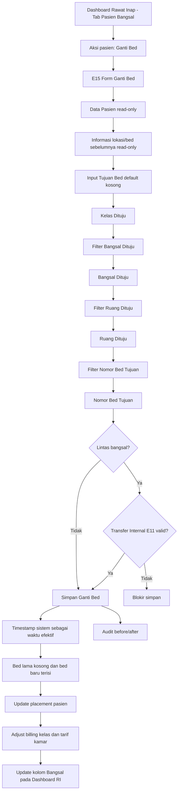

# Product Requirement Document (PRD) - Ganti Bed (E15)

## 1. Metadata Dokumen

| Item | Nilai |
|---|---|
| Feature Code | E15 |
| Nama Fitur | Ganti Bed |
| Modul | Pelayanan Rawat Inap |
| Unit | Unit Bangsal |
| Lokasi Fitur | Dashboard Rawat Inap - Tab Pasien Bangsal - Aksi pasien rawat inap |
| Parent/Producer | Dashboard Rawat Inap - Tab Pasien Bangsal |
| Consumer/Related | E11 Transfer Internal, Master Data Kelas, Master Unit/Tipe Bangsal, Master Data Kamar, Master Data Bed, Billing/Tagihan Pasien, Audit Trail |
| Status | Draft PRD |
| Timezone | Asia/Jakarta |

**Approval**

| Nama | Jabatan | Tanggal |
|---|---|---|
| [PERLU KONFIRMASI] | Kepala Unit Rawat Inap | [PERLU KONFIRMASI] |
| [PERLU KONFIRMASI] | Product Owner SIMRS | [PERLU KONFIRMASI] |

**Related Documents**

- PRD E11 - Transfer Internal
- PRD Dashboard Rawat Inap - Tab Pasien Bangsal
- Master Data Kelas
- Master Unit/Tipe Bangsal
- Master Data Kamar
- Master Data Bed

**Document Version**

| Tanggal | Versi | Deskripsi Perubahan |
|---|---|---|
| 21 Juli 2026 | 1.0 | Draft awal PRD Ganti Bed (E15) |
| 21 Juli 2026 | 1.1 | Penyesuaian format mengikuti `template (1).md` |
| 21 Juli 2026 | 1.2 | Input Tujuan Bed wajib default kosong dan diisi berurutan; field Tanggal & Jam Efektif Perpindahan dihapus dari input user; ditambahkan informasi Kelas, Bangsal, Ruang, dan Nomor Bed sebelumnya. |
| 22 Juli 2026 | 1.3 | Finalisasi keputusan: pindah beda kelas tidak membutuhkan approval/persetujuan pasien/penjamin namun berdampak pada billing; E15 langsung memicu perubahan tarif kamar/Administrasi Kamar Harian; validitas E11 untuk lintas bangsal memakai hasil validasi sistem; bed reserved/reservasi selalu diblokir dan tidak dapat dipilih. |

## 2. Overview & Background

### Overview/Brief Summary

E15 Ganti Bed adalah fitur untuk memindahkan pasien rawat inap dari bed saat ini ke bed tujuan. Fitur diakses dari menu **Aksi** pada tiap pasien yang sedang dirawat inap di **Dashboard Rawat Inap - Tab Pasien Bangsal**.

Form E15 menampilkan data pasien dan informasi lokasi/bed sebelumnya secara read-only, meliputi **Kelas Sebelumnya, Bangsal Sebelumnya, Ruang Sebelumnya, dan Nomor Bed Sebelumnya**. Section **Input Tujuan Bed** selalu terbuka dengan seluruh field tujuan dalam kondisi **default kosong**. User wajib mengisi tujuan secara berurutan:

1. **Kelas Dituju** dari Master Data Kelas.
2. **Bangsal Dituju** dari Master Unit/Tipe Bangsal.
3. **Ruang Dituju** dari Master Data Kamar.
4. **Nomor Bed Tujuan** dari Master Data Bed.

Setiap field memfilter pilihan field berikutnya dan field turunan tetap disabled/kosong sampai field induknya dipilih. Data **Transfer Internal (E11)** hanya digunakan sebagai validasi wajib untuk perpindahan lintas bangsal, bukan untuk mengisi otomatis field tujuan. Jika Transfer Internal belum tersedia/valid, penyimpanan diblokir. Jika perpindahan masih di bangsal yang sama, proses dapat disimpan tanpa Transfer Internal.

Field **Tanggal & Jam Efektif Perpindahan** tidak disediakan sebagai input user. Waktu efektif perpindahan menggunakan **timestamp sistem saat Simpan berhasil** (`changed_at`) sebagai acuan audit, okupansi bed, dan penyesuaian billing.

Perpindahan ke **kelas berbeda tidak membutuhkan approval atau persetujuan pasien/penjamin** pada E15. Namun perubahan kelas/bed langsung berdampak pada billing: sistem memicu penyesuaian **Administrasi Kelas** dan **Administrasi Kamar Harian/tarif kamar** berdasarkan kelas dan bed tujuan sejak timestamp simpan berhasil.

Setelah simpan berhasil, sistem mengupdate informasi penempatan pasien dan kolom **Bangsal** pada **Dashboard Rawat Inap - Tab Pasien Bangsal**.

### Business Process (As-Is vs To-Be)

**As-Is**

- Perpindahan bed pasien rawat inap berisiko dilakukan melalui komunikasi manual antar petugas bangsal.
- Pilihan bangsal, ruang, dan bed dapat tidak terfilter sehingga rawan salah memilih bed yang tidak tersedia atau tidak sesuai kelas.
- Perpindahan lintas bangsal dapat terjadi tanpa data Transfer Internal yang lengkap.
- Dashboard Rawat Inap dapat terlambat menampilkan lokasi bangsal terbaru setelah pasien berpindah.

**To-Be**

1. Petugas membuka **Dashboard Rawat Inap - Tab Pasien Bangsal**.
2. Petugas memilih pasien rawat inap aktif dan klik **Aksi -> Ganti Bed**.
3. Sistem membuka E15 dengan konteks pasien, encounter, admission, dan bed saat ini.
4. Sistem menampilkan Section **Data Pasien** read-only dan informasi lokasi/bed sebelumnya.
5. Section **Input Tujuan Bed** ditampilkan dengan seluruh field tujuan default kosong.
6. Petugas memilih tujuan secara berurutan: Kelas Dituju -> Bangsal Dituju -> Ruang Dituju -> Nomor Bed Tujuan.
7. Sistem memfilter opsi berdasarkan pilihan sebelumnya dan hanya menampilkan bed yang tersedia.
8. Sistem memvalidasi apakah perpindahan lintas bangsal.
9. Jika lintas bangsal, sistem memvalidasi Transfer Internal E11.
10. Jika valid, sistem menyimpan mutasi bed secara atomik menggunakan timestamp sistem saat Simpan berhasil.
11. Sistem langsung menyesuaikan billing Administrasi Kelas dan Administrasi Kamar Harian/tarif kamar sesuai kelas dan bed tujuan.
12. Dashboard Rawat Inap - Tab Pasien Bangsal memperbarui kolom **Bangsal** sesuai bangsal tujuan.

## 3. Goals & Metrics

| No | Metrics | Success Criteria |
|---|---|---|
| 1 | Akurasi akses fitur | 100% tombol **Ganti Bed** hanya tersedia pada pasien rawat inap aktif sesuai RBAC. |
| 2 | Validasi input bertingkat | 100% field tujuan default kosong saat form dibuka dan Bangsal/Ruang/Bed yang tampil sudah terfilter dari pilihan sebelumnya. |
| 3 | Validasi bed tersedia | 100% bed tujuan yang dapat dipilih berstatus aktif dan tersedia. |
| 4 | Guard Transfer Internal | 100% pindah lintas bangsal tanpa Transfer Internal E11 valid diblokir. |
| 5 | Sinkronisasi dashboard | 100% simpan berhasil memperbarui kolom **Bangsal** pada Tab Pasien Bangsal. |
| 6 | Audit | 100% transaksi Ganti Bed memiliki audit before/after kelas, bangsal, ruang, bed, actor, dan waktu. |
| 7 | Dampak billing | 100% Ganti Bed berhasil langsung memicu penyesuaian Administrasi Kelas bila kelas berubah dan tarif Administrasi Kamar Harian berdasarkan bed tujuan. |

## 4. Scope Definition & Phasing

| Fitur/Modul | Phase 1 (MVP: CRUD) | Phase 2 (Advanced: Approval/Escalation) | Phase 3 (Accounting: Mapping COA) |
|---|---|---|---|
| Entry Point Ganti Bed | Tombol **Ganti Bed** pada Aksi pasien rawat inap aktif di Tab Pasien Bangsal. | Konfigurasi action per role/unit. | N/A |
| Form Data Pasien | Menampilkan Nama Pasien, Jenis Kelamin, Tanggal Lahir (Usia), Status, Tipe Penjamin, No RM secara read-only. | Penyesuaian tampilan berdasarkan policy RS/penjamin. | N/A |
| Informasi Lokasi/Bed Sebelumnya | Menampilkan Kelas Sebelumnya, Bangsal Sebelumnya, Ruang Sebelumnya, dan Nomor Bed Sebelumnya secara read-only. | Riwayat mutasi lokasi lanjutan. | N/A |
| Input Tujuan Bed | Select berurutan Kelas -> Bangsal -> Ruang -> Bed, seluruh field tujuan default kosong saat form dibuka. | Validasi lanjutan gender, isolasi, penyakit infeksi, atau prioritas klinis. | N/A |
| Guard Transfer Internal E11 | Blokir pindah lintas bangsal bila hasil validasi sistem E11 tidak valid. E15 tidak menetapkan status final E11 tertentu. | Konfigurasi validasi lanjutan lintas bangsal bila diperlukan. | N/A |
| Simpan Ganti Bed | Simpan mutasi bed, kosongkan bed lama, isi bed baru, update placement pasien, dan langsung trigger penyesuaian Administrasi Kelas serta Administrasi Kamar Harian/tarif kamar. | Koreksi/rollback dengan audit. | Event perubahan kelas/bed dapat dikonsumsi modul lain. |
| Update Dashboard Rawat Inap | Update kolom **Bangsal** pada Tab Pasien Bangsal setelah simpan berhasil. | Push real-time/websocket dan reconciliation dashboard. | N/A |
| Audit Trail | Simpan before/after lokasi pasien dan actor. | Audit approval/rollback. | Referensi audit untuk koreksi charge bila ada dampak tarif. |

**Out of Scope**

- Membuat atau mengubah master data kelas, bangsal, kamar/ruang, atau bed.
- Proses pembuatan Transfer Internal E11; E15 hanya memvalidasi ketersediaan data Transfer Internal.
- Pemulangan pasien, admisi pasien baru, atau perubahan DPJP.
- Klaim penjamin dan jurnal otomatis. Penyesuaian tarif kamar/Administrasi Kamar Harian akibat Ganti Bed termasuk Phase 1.
- Approval atau persetujuan pasien/penjamin untuk pindah beda kelas tidak dibutuhkan pada E15.

## 5. Related Features

| Kode/Fitur | Deskripsi Relasi Teknis/Bisnis |
|---|---|
| Dashboard Rawat Inap - Tab Pasien Bangsal | Entry point E15 dan consumer update kolom **Bangsal**. |
| E11 Transfer Internal | Prasyarat wajib jika pasien pindah bed lintas bangsal. |
| Master Data Kelas | Sumber opsi **Kelas Dituju**. |
| Master Unit/Tipe Bangsal | Sumber opsi **Bangsal Dituju**. |
| Master Data Kamar | Sumber opsi **Ruang Dituju** berdasarkan bangsal. |
| Master Data Bed | Sumber opsi **Nomor Bed Tujuan** berdasarkan ruang/kamar. |
| Billing/Tagihan Pasien | Consumer wajib untuk penyesuaian Administrasi Kelas dan Administrasi Kamar Harian/tarif kamar setelah Ganti Bed berhasil. |
| Audit Trail | Mencatat before/after lokasi pasien. |

## 6. Business Process & User Stories

### State Machine Table

| Status | Deskripsi | Efek Stok/Bed | Transisi (Phase 1) | Transisi (Phase 2) |
|---|---|---|---|---|
| `FORM_OPENED` | Form Ganti Bed dibuka dari Aksi pasien rawat inap aktif. | Tidak ada perubahan bed. | Pilih Kelas Dituju. | Validasi RBAC lanjutan per unit. |
| `TARGET_CLASS_SELECTED` | User sudah memilih Kelas Dituju. | Tidak ada perubahan bed. | Filter dan pilih Bangsal Dituju. | Preview dampak billing bila kelas berbeda. |
| `TARGET_WARD_SELECTED` | User sudah memilih Bangsal Dituju. | Tidak ada perubahan bed. | Filter dan pilih Ruang Dituju. | Konfigurasi guard lintas bangsal lanjutan. |
| `TARGET_ROOM_SELECTED` | User sudah memilih Ruang Dituju. | Tidak ada perubahan bed. | Filter dan pilih Nomor Bed Tujuan. | Validasi klinis/isolasi lanjutan. |
| `TARGET_BED_SELECTED` | User sudah memilih Nomor Bed Tujuan. | Bed belum berubah sampai simpan. | Validasi lintas bangsal dan ketersediaan bed kosong. | Lock concurrency saat submit. |
| `BLOCKED_NEED_TRANSFER` | Target lintas bangsal tetapi hasil validasi sistem E11 belum valid. | Bed lama tetap terisi, bed tujuan tidak berubah. | Blokir Simpan. | Konfigurasi validasi E11 lanjutan. |
| `SAVED` | Transaksi Ganti Bed berhasil disimpan. | Bed lama menjadi tersedia, bed baru menjadi terisi. | Update placement pasien, trigger billing, dan update kolom Bangsal dashboard. | Rollback/koreksi dengan audit. |

### User Stories Utama

- Sebagai Petugas Bangsal, saya ingin membuka **Ganti Bed** dari Aksi pasien rawat inap agar konteks pasien tidak perlu dipilih ulang.
- Sebagai Petugas Bangsal, saya ingin melihat data pasien read-only agar tidak salah memindahkan pasien.
- Sebagai Petugas Bangsal, saya ingin melihat Kelas, Bangsal, Ruang, dan Nomor Bed sebelumnya agar dapat membandingkan lokasi asal dengan tujuan perpindahan.
- Sebagai Petugas Bangsal, saya ingin memilih Kelas, Bangsal, Ruang, dan Bed secara berurutan agar pilihan tujuan selalu valid.
- Sebagai Petugas Bangsal, saya ingin sistem memblokir pindah lintas bangsal tanpa Transfer Internal E11 agar alur transfer internal tetap lengkap.
- Sebagai Perawat Penanggung Jawab, saya ingin Dashboard Rawat Inap langsung menampilkan bangsal terbaru setelah Ganti Bed tersimpan.
- Sebagai Petugas Billing, saya ingin Ganti Bed langsung memicu penyesuaian tarif kamar agar tagihan mengikuti kelas dan bed terbaru.
- Sebagai Admin Rawat Inap, saya ingin setiap Ganti Bed memiliki audit before/after agar perubahan lokasi pasien dapat ditelusuri.

## 7. Functional Requirements

### 7.1 Feature Requirements & Acceptance Criteria

**Fitur: Entry Point Ganti Bed**

* **User Story**: Sebagai Petugas Bangsal, saya ingin membuka fitur Ganti Bed dari Aksi pasien rawat inap, agar pemindahan bed dilakukan dari konteks pasien yang benar.
* **Prioritas**: P0
* **Fase**: Phase 1
* **Acceptance Criteria**:
  * **AC 1**: Tombol/menu **Ganti Bed** tampil pada Aksi pasien yang sedang rawat inap aktif.
  * **AC 2**: Tombol/menu **Ganti Bed** tidak tampil atau disabled untuk pasien yang tidak memiliki admission rawat inap aktif.
  * **AC 3**: Saat dibuka, E15 menerima `patient_id`, `encounter_id`, `admission_id`, `current_class_id`, `current_ward_id`, `current_room_id`, dan `current_bed_id`.

**Fitur: Section Data Pasien**

* **User Story**: Sebagai Petugas Bangsal, saya ingin melihat data pasien sebelum memindahkan bed, agar saya dapat memastikan pasien yang dipilih benar.
* **Prioritas**: P0
* **Fase**: Phase 1
* **Acceptance Criteria**:
  * **AC 1**: Sistem menampilkan Nama Pasien, Jenis Kelamin, Tanggal Lahir (Usia), Status, Tipe Penjamin, dan No RM.
  * **AC 2**: Seluruh field pada Section Data Pasien bersifat read-only.
  * **AC 3**: Status pasien menampilkan **Sesuai Kelas** atau **Beda Kelas**.
  * **AC 4**: Sistem menampilkan informasi lokasi/bed sebelumnya secara read-only: **Kelas Sebelumnya, Bangsal Sebelumnya, Ruang Sebelumnya, dan Nomor Bed Sebelumnya**.

**Fitur: Input Tujuan Bed Bertingkat**

* **User Story**: Sebagai Petugas Bangsal, saya ingin memilih tujuan bed secara berurutan, agar pilihan bangsal, ruang, dan bed selalu sesuai.
* **Prioritas**: P0
* **Fase**: Phase 1
* **Acceptance Criteria**:
  * **AC 1**: Saat form dibuka, seluruh field pada Section **Input Tujuan Bed** default kosong: **Kelas Dituju, Bangsal Dituju, Ruang Dituju, dan Nomor Bed Tujuan**.
  * **AC 2**: User wajib memilih **Kelas Dituju** sebelum **Bangsal Dituju** aktif.
  * **AC 3**: User wajib memilih **Bangsal Dituju** sebelum **Ruang Dituju** aktif.
  * **AC 4**: User wajib memilih **Ruang Dituju** sebelum **Nomor Bed Tujuan** aktif.
  * **AC 5**: Bangsal Dituju terfilter berdasarkan Kelas Dituju.
  * **AC 6**: Ruang Dituju terfilter berdasarkan Bangsal Dituju.
  * **AC 7**: Nomor Bed Tujuan terfilter berdasarkan Ruang Dituju.
  * **AC 8**: Nomor Bed Tujuan hanya menampilkan bed aktif dan kosong. Bed yang occupied, reserved/reservasi, cleaning, maintenance, atau inactive tidak ditampilkan dan tidak dapat dipilih, termasuk reserved oleh user/pasien yang sama.
  * **AC 9**: Jika field induk berubah, field turunannya dikosongkan otomatis.
  * **AC 10**: Data Transfer Internal E11 tidak mengisi otomatis field tujuan; user tetap memilih tujuan bed secara berurutan pada E15.
  * **AC 11**: Field **Tanggal & Jam Efektif Perpindahan** tidak ditampilkan pada form; sistem menggunakan timestamp simpan (`changed_at`) sebagai waktu efektif perpindahan.

**Fitur: Guard Transfer Internal E11**

* **User Story**: Sebagai Petugas Bangsal, saya ingin sistem mengecek Transfer Internal saat pindah lintas bangsal, agar pasien tidak berpindah bangsal tanpa dokumen transfer internal.
* **Prioritas**: P0
* **Fase**: Phase 1
* **Acceptance Criteria**:
  * **AC 1**: Sistem menghitung `is_cross_ward=true` jika `target_ward_id` berbeda dari `current_ward_id`.
  * **AC 2**: Jika `is_cross_ward=true`, sistem wajib memvalidasi Transfer Internal E11 untuk pasien/encounter yang sama berdasarkan hasil validasi sistem E11.
  * **AC 3**: Jika hasil validasi sistem E11 menyatakan Transfer Internal belum ada, tidak valid, sudah dibatalkan, sudah digunakan, atau mismatch pasien/encounter/tujuan, tombol **Simpan** diblokir.
  * **AC 4**: Jika `is_cross_ward=false`, tombol **Simpan** dapat aktif tanpa Transfer Internal E11 selama validasi lain terpenuhi.
  * **AC 5**: E15 tidak menentukan status final E11 tertentu sebagai syarat tunggal; E15 hanya menggunakan response/flag validasi sistem E11 untuk menentukan boleh/tidaknya pindah lintas bangsal.

**Fitur: Simpan Ganti Bed dan Update Dashboard**

* **User Story**: Sebagai Petugas Bangsal, saya ingin menyimpan Ganti Bed agar penempatan pasien dan dashboard rawat inap diperbarui.
* **Prioritas**: P0
* **Fase**: Phase 1
* **Acceptance Criteria**:
  * **AC 1**: Sistem menolak simpan jika bed tujuan sama dengan bed saat ini.
  * **AC 2**: Sistem menolak simpan jika bed tujuan sudah tidak tersedia saat submit.
  * **AC 3**: Simpan dilakukan atomik: bed lama dikosongkan, bed baru diisi, placement pasien diperbarui, audit tersimpan.
  * **AC 4**: Setelah simpan berhasil, kolom **Bangsal** pada Dashboard Rawat Inap - Tab Pasien Bangsal menampilkan Bangsal Dituju.
  * **AC 5**: Sistem mencatat before/after kelas, bangsal, ruang, bed, actor, timestamp sistem saat simpan (`changed_at`), dan idempotency key.
  * **AC 6**: Jika Kelas Dituju berbeda dari kelas sebelumnya, sistem tidak meminta approval/persetujuan pasien/penjamin, tetapi wajib menampilkan/menyimpan dampak perubahan tersebut ke billing.
  * **AC 7**: Setelah simpan berhasil, E15 langsung memicu perubahan tarif kamar melalui penyesuaian Administrasi Kamar Harian berdasarkan bed tujuan sejak timestamp simpan berhasil. Bila perubahan kelas terjadi, Administrasi Kelas ikut disesuaikan.

### Validasi

#### A. Wording Validasi (Frontend)

| Field | Tipe Input | Rules | Error Message | Helper Text |
|---|---|---|---|---|
| Kelas Dituju | Select | Required, sumber Master Data Kelas aktif | `Kelas Dituju wajib dipilih.` | `Pilih kelas tujuan pasien.` |
| Bangsal Dituju | Select | Required setelah Kelas Dituju, terfilter kelas dan tipe rawat inap, default kosong | `Bangsal Dituju wajib dipilih.` | `Pilihan bangsal aktif setelah Kelas Dituju dipilih.` |
| Ruang Dituju | Select | Required setelah Bangsal Dituju, terfilter bangsal, default kosong | `Ruang Dituju wajib dipilih.` | `Pilihan ruang aktif setelah Bangsal Dituju dipilih.` |
| Nomor Bed Tujuan | Select | Required setelah Ruang Dituju, hanya bed aktif dan kosong, default kosong | `Nomor Bed Tujuan wajib dipilih.` | `Hanya bed kosong yang dapat dipilih setelah Ruang Dituju dipilih. Bed reserved tidak dapat dipilih.` |
| Nomor Bed Tujuan | Select | Tidak boleh sama dengan bed saat ini | `Bed tujuan sama dengan bed saat ini.` | `Pilih bed lain.` |
| Transfer Internal E11 | System Guard | Required bila lintas bangsal | `Transfer Internal diperlukan untuk pindah lintas bangsal. Lengkapi Transfer Internal terlebih dahulu.` | `Transfer Internal tidak diperlukan jika masih dalam bangsal yang sama.` |
| Beda Kelas | System Info | Tidak membutuhkan approval/persetujuan pasien/penjamin | - | `Perubahan kelas akan berdampak pada billing sesuai tarif kelas dan bed tujuan.` |
| Simpan | Button | Semua field valid, bed tersedia, guard E11 terpenuhi | `Ganti Bed belum dapat disimpan.` | `Lengkapi tujuan bed secara berurutan.` |

#### B. Validasi Server dan Integritas Data

| No | Rule | Behavior | Response/Action |
|---|---|---|---|
| 1 | Pasien harus rawat inap aktif | Hard Block | HTTP 409/422 bila admission tidak aktif. |
| 2 | Context pasien/encounter/bed harus cocok | Relational Guard | Tolak bila current placement tidak sesuai data server terbaru. |
| 3 | Bed tujuan harus tersedia | Hard Block | Tolak bila bed occupied, reserved, maintenance, inactive, atau tidak ada. |
| 4 | Input tujuan harus lengkap | Validation Guard | Tolak bila class/ward/room/bed kosong. |
| 5 | Bed tujuan tidak boleh sama dengan bed saat ini | Validation Guard | Tolak submit. |
| 6 | Lintas bangsal wajib Transfer Internal E11 valid berdasarkan validasi sistem | Hard Block | Tolak simpan bila response validasi sistem E11 menyatakan transfer belum valid. |
| 7 | Simpan harus atomik | Transaction Guard | Bed lama, bed baru, placement, dashboard event, billing adjustment, dan audit dalam satu transaksi. |
| 8 | Request harus idempotent | Idempotency Guard | Retry tidak membuat mutasi bed ganda. |
| 9 | Reserved bed selalu diblokir | Hard Block | Tolak bila bed tujuan berstatus reserved/reservasi, meskipun reservasi dibuat oleh user/pasien yang sama. |
| 10 | Beda kelas tidak butuh approval | System Rule | Lanjutkan simpan bila validasi lain terpenuhi; sistem mencatat dampak billing. |

## 8. Data & Technical Specifications

### 8.1 Database Schema Suggestion

**Table Name**: `inpatient_bed_changes`

**Key Columns**

* `id`: UUID primary key.
* `bed_change_number`: VARCHAR(50), unique.
* `patient_id`: UUID, not null.
* `encounter_id`: UUID, not null.
* `admission_id`: UUID, not null.
* `from_class_id`: UUID, not null.
* `from_ward_id`: UUID, not null.
* `from_room_id`: UUID, not null.
* `from_bed_id`: UUID, not null.
* `to_class_id`: UUID, not null.
* `to_ward_id`: UUID, not null.
* `to_room_id`: UUID, not null.
* `to_bed_id`: UUID, not null.
* `is_cross_ward`: BOOLEAN, not null default false.
* `transfer_internal_id`: UUID, nullable, reference to E11.
* `class_status_after`: VARCHAR(50), nullable.
* `is_class_changed`: BOOLEAN, not null default false.
* `billing_adjustment_status`: VARCHAR(30), nullable.
* `billing_adjustment_id`: UUID, nullable, reference to Billing/Tagihan Pasien.
* `status`: VARCHAR(30), not null default `SAVED`.
* `changed_at`: TIMESTAMPTZ, not null — timestamp sistem saat **Simpan** berhasil; menjadi waktu efektif perpindahan, bukan input user.
* `changed_by`: UUID, not null.
* `idempotency_key`: VARCHAR(100), unique.
* `created_at`, `updated_at`: TIMESTAMPTZ.

**Table Name**: `inpatient_bed_change_events`

**Key Columns**

* `id`: UUID primary key.
* `bed_change_id`: UUID, foreign key.
* `event_type`: VARCHAR(50), example `BED_CHANGE_SAVED`, `BED_CHANGE_BLOCKED`.
* `from_status`, `to_status`: VARCHAR(30), nullable.
* `actor_id`, `actor_role`: UUID/VARCHAR(50).
* `metadata_json`: JSONB/TEXT.
* `occurred_at`: TIMESTAMPTZ.
* `correlation_id`: VARCHAR(100).

**Recommended Existing Tables Updated/Referenced**

* `inpatient_patient_placements`: active placement pasien rawat inap.
* `master_classes`: sumber Kelas Dituju.
* `master_wards`: sumber Bangsal Dituju.
* `master_rooms`: sumber Ruang Dituju.
* `master_beds`: sumber Nomor Bed Tujuan.
* `internal_transfers`: sumber validasi Transfer Internal E11.

### 8.2 API Endpoint Recommendations

| Method | Endpoint | Description |
|---|---|---|
| GET | `/api/v1/inpatient/bed-change/context/{encounterId}` | Get patient context, active placement, and E11 transfer status. |
| GET | `/api/v1/master/classes` | List active target classes. |
| GET | `/api/v1/master/wards?class_id={classId}&type=inpatient` | List target wards filtered by class and inpatient ward type. |
| GET | `/api/v1/master/rooms?ward_id={wardId}` | List target rooms filtered by ward. |
| GET | `/api/v1/master/beds?room_id={roomId}&availability=available` | List available target beds filtered by room. |
| GET | `/api/v1/internal-transfers/validated?encounter_id={encounterId}&target_ward_id={wardId}` | Validate E11 Transfer Internal for cross-ward bed change. Response validasi sistem menjadi acuan E15; E15 tidak hardcode status final E11 tertentu. |
| GET | `/api/v1/inpatient/bed-change/billing-preview?encounter_id={encounterId}&target_class_id={classId}&target_bed_id={bedId}` | Preview dampak Administrasi Kelas dan Administrasi Kamar Harian/tarif kamar sebelum simpan. Tidak membutuhkan approval. |
| POST | `/api/v1/inpatient/bed-change` | Save bed change transaction; body hanya membawa tujuan bed dan konteks pasien, sedangkan `changed_at`/waktu efektif dibuat oleh sistem saat transaksi berhasil. Endpoint langsung memicu penyesuaian billing dalam transaksi yang sama. |
| POST | `/api/v1/inpatient/dashboard/patient-ward/refresh-row` | Refresh one patient row on Dashboard Rawat Inap - Tab Pasien Bangsal. |

### 8.3 Data & Business Rules

#### 8.3.1 Spesifikasi Data - Form Input (Layar CREATE/EDIT)

**Section Data Pasien**

| Field | Label | Tipe | Wajib | Validasi | Sumber | Catatan |
|---|---|---|---|---|---|---|
| `patient_name` | Nama Pasien | Text | Ya | Read-only | Encounter/Master Pasien | Snapshot pasien rawat inap |
| `gender` | Jenis Kelamin | Text | Ya | Read-only | Master Pasien | Label Laki-laki/Perempuan |
| `date_of_birth_age` | Tanggal Lahir (Usia) | Text | Ya | Read-only | Master Pasien/Sistem | Gabungan tanggal lahir dan usia |
| `class_status` | Status | Badge/Text | Ya | Read-only, enum Sesuai Kelas/Beda Kelas | Encounter/Penjamin/Kelas | Ditampilkan sebagai status kelas |
| `payer_type` | Tipe Penjamin | Text | Ya | Read-only | Encounter/Penjamin | BPJS/Umum/Asuransi/dll |
| `medical_record_number` | No RM | Text | Ya | Read-only | Master Pasien | Identitas pasien |

**Section Informasi Lokasi/Bed Saat Ini**

| Field | Label | Tipe | Wajib | Validasi | Sumber | Catatan |
|---|---|---|---|---|---|---|
| `current_class_name` | Kelas Saat Ini | Text | Ya | Read-only | Active placement pasien | Kelas pasien sebelum Ganti Bed |
| `current_ward_name` | Bangsal Saat Ini | Text | Ya | Read-only | Active placement pasien | Bangsal pasien sebelum Ganti Bed |
| `current_room_name` | Ruang Saat Ini | Text | Ya | Read-only | Active placement pasien | Ruang/kamar pasien sebelum Ganti Bed |
| `current_bed_number` | Nomor Bed Saat Ini | Text | Ya | Read-only | Active placement pasien | Nomor bed pasien sebelum Ganti Bed |

**Section Input Tujuan Bed**

| Field | Label | Tipe | Wajib | Validasi | Sumber | Catatan |
|---|---|---|---|---|---|---|
| `target_class_id` | Kelas Dituju | Select | Ya | Active class; default kosong saat form dibuka | Master Data Kelas | Dipilih pertama |
| `target_ward_id` | Bangsal Dituju | Select | Ya | Active ward, inpatient type, filtered by class; default kosong | Master Unit/Tipe Bangsal | Disabled sebelum kelas dipilih |
| `target_room_id` | Ruang Dituju | Select | Ya | Active room, filtered by ward; default kosong | Master Data Kamar | Disabled sebelum bangsal dipilih |
| `target_bed_id` | Nomor Bed Tujuan | Select | Ya | Active and empty bed only, filtered by room; default kosong; reserved/reservasi selalu diblokir | Master Data Bed | Disabled sebelum ruang dipilih |

#### 8.3.3 Business Rules

- **BR-E15-01:** E15 hanya dapat diakses dari Aksi pasien rawat inap aktif pada Dashboard Rawat Inap - Tab Pasien Bangsal.
- **BR-E15-02:** Pasien harus memiliki encounter/admission rawat inap aktif.
- **BR-E15-03:** Section Data Pasien bersifat read-only.
- **BR-E15-04:** Sistem wajib menampilkan informasi **Kelas Sebelumnya, Bangsal Sebelumnya, Ruang Sebelumnya, dan Nomor Bed Sebelumnya** secara read-only sebelum user memilih tujuan.
- **BR-E15-05:** Seluruh field pada Section Input Tujuan Bed wajib default kosong saat form dibuka, termasuk jika pasien memiliki Transfer Internal E11 valid.
- **BR-E15-06:** User wajib memilih tujuan berurutan: Kelas Dituju -> Bangsal Dituju -> Ruang Dituju -> Nomor Bed Tujuan.
- **BR-E15-07:** Field turunan wajib dikosongkan ketika field induknya berubah.
- **BR-E15-08:** Data Transfer Internal E11 tidak boleh melakukan auto-fill ke field tujuan; E11 hanya menjadi guard/validasi untuk perpindahan lintas bangsal.
- **BR-E15-09:** Bangsal Dituju hanya menampilkan bangsal aktif yang sesuai Kelas Dituju, tipe rawat inap, dan hak akses user.
- **BR-E15-10:** Ruang Dituju hanya menampilkan ruang/kamar aktif pada bangsal yang dipilih.
- **BR-E15-11:** Nomor Bed Tujuan hanya menampilkan bed aktif dan kosong. Bed occupied, reserved/reservasi, cleaning, maintenance, atau inactive selalu diblokir dan tidak dapat dipilih, termasuk bila reserved oleh user/pasien yang sama.
- **BR-E15-12:** Bed tujuan tidak boleh sama dengan bed saat ini.
- **BR-E15-13:** Jika `target_ward_id` berbeda dari `current_ward_id`, perpindahan dianggap lintas bangsal.
- **BR-E15-14:** Pindah lintas bangsal wajib memiliki Transfer Internal E11 yang valid untuk pasien/encounter yang sama berdasarkan hasil validasi sistem E11.
- **BR-E15-15:** Jika hasil validasi sistem E11 menyatakan Transfer Internal belum tersedia/tidak valid saat pindah lintas bangsal, tombol Simpan/penyimpanan diblokir.
- **BR-E15-16:** Jika pindah masih dalam bangsal yang sama, Transfer Internal E11 tidak wajib.
- **BR-E15-17:** Simpan Ganti Bed harus atomik: bed lama dikosongkan, bed baru diisi, placement pasien diperbarui, penyesuaian billing diproses, audit tersimpan.
- **BR-E15-18:** Setelah simpan berhasil, kolom **Bangsal** pada Dashboard Rawat Inap - Tab Pasien Bangsal wajib diperbarui sesuai Bangsal Dituju.
- **BR-E15-19:** Perubahan kelas/beda kelas tidak membutuhkan approval atau persetujuan pasien/penjamin pada E15, namun wajib dicatat dan langsung berdampak pada penyesuaian billing sesuai tarif kelas/bed tujuan.
- **BR-E15-20:** Field **Tanggal & Jam Efektif Perpindahan** tidak tersedia pada UI; waktu efektif perpindahan, okupansi, audit, dan billing memakai timestamp sistem saat Simpan berhasil (`changed_at`).
- **BR-E15-21:** Audit wajib mencatat before/after kelas, bangsal, ruang, bed, actor, timestamp sistem, dan idempotency key.
- **BR-E15-22:** E15 langsung memicu perubahan tarif kamar/Administrasi Kamar Harian setelah Ganti Bed berhasil, bukan hanya mengirim event tanpa penyesuaian tarif.
- **BR-E15-23:** Jika proses penyesuaian billing gagal, transaksi Ganti Bed harus rollback sehingga okupansi bed, placement pasien, dan billing tetap konsisten.
- **BR-E15-24:** E15 tidak menetapkan status final E11 tertentu sebagai syarat tunggal. Validitas Transfer Internal untuk pindah lintas bangsal ditentukan oleh response/flag validasi sistem E11.

## 9. Workflow / BPMN Interpretation

### Narasi Workflow

1. User membuka Dashboard Rawat Inap - Tab Pasien Bangsal.
2. User memilih Aksi -> Ganti Bed pada pasien rawat inap aktif.
3. Sistem membuka form E15 dan menampilkan Data Pasien read-only.
4. Sistem menampilkan informasi Kelas, Bangsal, Ruang, dan Nomor Bed sebelumnya secara read-only.
5. Section Input Tujuan Bed tampil dengan seluruh field tujuan default kosong.
6. User memilih Kelas Dituju.
7. Sistem memfilter Bangsal Dituju.
8. User memilih Bangsal Dituju.
9. Sistem memfilter Ruang Dituju.
10. User memilih Ruang Dituju.
11. Sistem memfilter Nomor Bed Tujuan.
12. User memilih Nomor Bed Tujuan.
13. Sistem mengecek apakah tujuan lintas bangsal.
14. Jika lintas bangsal, sistem validasi Transfer Internal E11 berdasarkan response/flag validasi sistem E11.
15. Jika E11 tidak valid, sistem memblokir simpan.
16. Jika valid atau bukan lintas bangsal, sistem menyimpan transaksi Ganti Bed dengan timestamp sistem saat simpan.
17. Sistem mengosongkan bed lama, mengisi bed baru, dan memperbarui placement aktif pasien.
18. Sistem langsung menyesuaikan billing Administrasi Kelas bila kelas berubah dan Administrasi Kamar Harian/tarif kamar berdasarkan bed tujuan.
19. Sistem mencatat audit dan histori billing.
20. Sistem memperbarui row pasien pada Dashboard Rawat Inap - Tab Pasien Bangsal, minimal kolom **Bangsal**.

### Mermaid Flow



### Event Ganti Bed Berhasil

```json
{
  "event_type": "inpatient.bed_changed",
  "bed_change_id": "BC-20260721-0001",
  "encounter_id": "ENC-RI-20260721-0007",
  "patient_id": "PAT-0007",
  "from": {
    "class_id": "KLS-02",
    "ward_id": "WARD-MAWAR",
    "room_id": "ROOM-MAWAR-201",
    "bed_id": "BED-MAWAR-201-A"
  },
  "to": {
    "class_id": "KLS-01",
    "ward_id": "WARD-MELATI",
    "room_id": "ROOM-MELATI-102",
    "bed_id": "BED-MELATI-102-B"
  },
  "is_cross_ward": true,
  "transfer_internal_id": "TI-20260721-0003",
  "billing_adjustment": {
    "status": "SUCCESS",
    "is_class_changed": true,
    "class_approval_required": false,
    "daily_room_tariff_source": "BED-MELATI-102-B"
  },
  "changed_at": "2026-07-21T10:20:00+07:00",
  "changed_by": "USER-BANGSAL-001"
}
```

### Keputusan yang Sudah Ditetapkan

| Topik | Keputusan |
|---|---|
| Approval beda kelas | Tidak membutuhkan approval atau persetujuan pasien/penjamin. Dampaknya tetap masuk billing sesuai tarif kelas/bed tujuan. |
| Billing/tarif | E15 langsung memicu perubahan tarif kamar/Administrasi Kamar Harian dan Administrasi Kelas bila kelas berubah. |
| Definisi Transfer Internal valid | Untuk saat ini validitas E11 ditentukan oleh validasi sistem E11; E15 tidak hardcode status final E11 tertentu. |
| Bed reservasi | Bed berstatus reserved/reservasi selalu diblokir dan tidak dapat dipilih, termasuk oleh user/pasien yang sama. |

### Hal yang Masih Perlu Dikonfirmasi

| Topik | Keputusan yang dibutuhkan |
|---|---|
| Hak akses lintas bangsal | Role apa yang boleh memindahkan pasien ke bangsal lain? |
