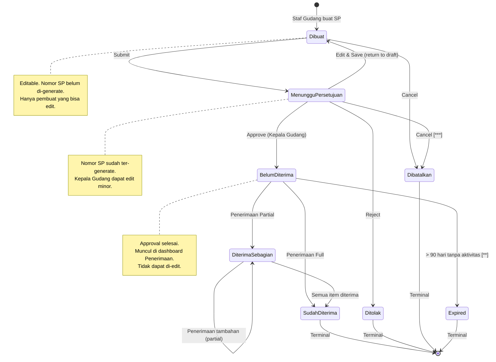
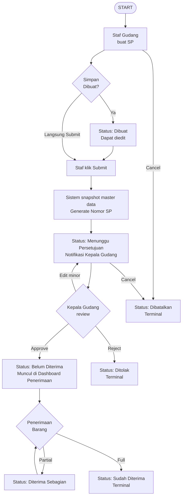
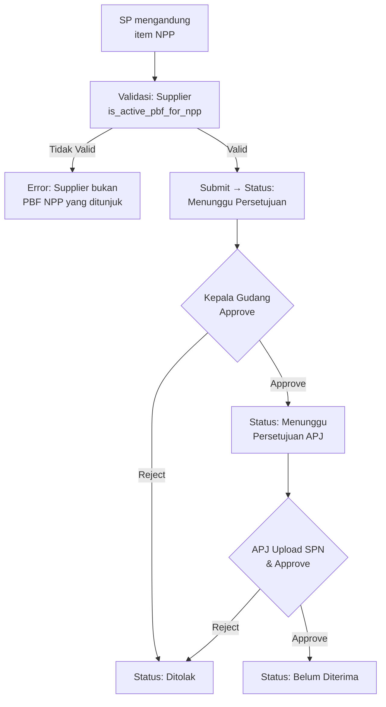

# Product Requirement Document
## Pemesanan Barang — Barang Farmasi

**Related Document:**

| Dokumen | Link |
|---|---|
| PRD Pemisahan SP RJ-RI | https://docs.google.com/document/d/1Q_pL3qZNCS6JxVR293rvlEUSbeF79Z_S0E_ufgbC0xM/edit?tab=t.0 |
| Template SP | https://docs.google.com/document/d/1ZJvnoVpGlGbBu9f8Kcpk2yX2AqeOlfhs/edit |

**Document Version:**

| Tanggal | Versi | Keterangan |
|---|---|---|
| 13 Juni 2026 | 1.0 | Pembuatan fitur Pemesanan Barang untuk mengelola data Surat Pemesanan pada proses pemesanan barang ke supplier |

**Approval:**

| PRD approved by | Nama/Jabatan | Signature, Date |
|---|---|---|
| [1] | M. Sulthan Farras Nanz — Chief Strategy & Growth Officer, Tamtech International | |

---

**Legend Phase:**

| Simbol | Phase |
|---|---|
| *(tanpa simbol)* | Phase 1 |
| `[**]` | Phase 2 |
| `[***]` | Phase 3 |
| `[****]` | Phase 4 |

---

## 1. Overview / Brief Summary

Fitur **Pemesanan Barang — Barang Farmasi** adalah modul untuk mengelola proses pembuatan, persetujuan, dan pelacakan Surat Pemesanan (SP) obat dan alat kesehatan farmasi ke supplier/PBF, yang dirancang khusus untuk **RS Tipe C dan Tipe D** di Indonesia.

**Konteks RS Tipe C dan D:**

- **RS Tipe C:** pelayanan medik spesialistik dasar, kapasitas 100–200 tempat tidur, umumnya RS daerah/swasta tingkat kabupaten.
- **RS Tipe D:** pelayanan medik dasar, kapasitas < 100 tempat tidur.
- Karakteristik operasional: struktur organisasi lebih ramping dibanding RS Tipe A/B. Bagian Logistik & Farmasi sering merged. Volume transaksi 50–200 SP/bulan.

**Karakteristik khusus Farmasi yang dihandle fitur ini:**

- Workflow khusus NPP (Narkotika, Psikotropika, Prekursor) sesuai UU 35/2009 & Permenkes 3/2015.
- Validasi Formularium RS — obat di luar formularium memerlukan justifikasi APJ + KFT review.
- Validasi minimum ED at delivery (default 18 bulan) sebagai SOP standar pengadaan farmasi.
- Cold chain awareness untuk vaksin dan obat tertentu.

**Penyesuaian v2.1 untuk RS Tipe C/D:**

- Struktur Unit Gudang sederhana: hanya 2 role — Staf Gudang dan Kepala Gudang.
- Approval flow 2-tier: Staf Gudang → Kepala Gudang (→ APJ sebagai final approver).
- Validasi CDOB tidak diotomasi oleh sistem — diserahkan ke APJ secara operasional/manual.
- Validasi NPP, Formularium, ED at Delivery tetap ada karena merupakan regulasi farmasi mandatori.

**Ruang lingkup penerapan:**

- RS Tipe C dan D yang menggunakan SIMRS Neurovi.
- Pemesanan barang dengan kategori Farmasi (obat, alkes farmasi, BHP farmasi).
- Role yang diberikan akses: Staf Gudang Farmasi (pembuat), Kepala Gudang Farmasi (approver tier 1), APJ (final approver).

---

## 2. Background

Pengadaan obat dan alat kesehatan di RS adalah proses yang *highly regulated* dan kritikal terhadap operasional pelayanan pasien. Untuk RS Tipe C dan D dengan struktur organisasi yang lebih ramping, workflow yang terlalu kompleks akan membebani operasional.

**Pain point kondisi saat ini (manual/sistem lama):**

- Pembuatan SP manual (typewriter/Excel/Word) — sering ada typo dan inkonsistensi data.
- Validasi compliance manual: APJ harus check NPP regulation dan formularium secara manual, rawan kesalahan — terutama karena APJ sering tidak full-time di RS Tipe C/D.
- Audit trail lemah: saat audit BPOM, akreditasi STARKES, atau internal, sulit traceback siapa approve apa dan kapan.
- Duplikasi pemesanan: tanpa visibility PO outstanding, sering terjadi pemesanan ganda untuk barang yang sama.
- Tidak ada visibility status: Staf Gudang harus follow-up via telepon ke supplier atau cek arsip manual.
- Dokumen tersebar dan sulit diakses saat audit BPOM & akreditasi STARKES.

**Pertimbangan khusus RS Tipe C/D:**

- Tim Farmasi kecil (3–8 orang): 1 APJ, 1–2 TTK (Kepala Gudang Farmasi), 2–5 Staf Gudang.
- APJ sering tidak full-time (kunjungan beberapa hari per minggu) — workflow tidak boleh terlalu bergantung pada kehadiran APJ.
- Resource IT terbatas — sistem harus simple, intuitif, dan minimal training.
- Tidak ada Manajer Logistik dan Manajer Keuangan terpisah — fungsi merged ke Kepala Gudang & Direktur RS.

**Target kondisi setelah implementasi:**

- Workflow 2-tier yang efisien sesuai struktur RS Tipe C/D.
- Compliant terhadap UU 35/2009, Permenkes 72/2016, PP 51/2009.
- Audit trail lengkap untuk akreditasi STARKES dan audit BPOM.
- Otomasi validasi NPP, formularium RS, dan minimum ED at delivery.

---

## 3. In Scope

### Scope Definition

| No | Scope / Area | Phase |
|---|---|---|
| 1 | Dashboard Pemesanan Barang Farmasi dengan filter & search | Phase 1 |
| 2 | Buat Surat Pemesanan (SP) baru | Phase 1 |
| 3 | Edit Surat Pemesanan | Phase 1 |
| 4 | Lihat Detail SP (read-only untuk status yang sudah Approved) | Phase 1 |
| 5 | State Machine dengan 9 status (Dibuat, Menunggu Persetujuan Kepala Gudang, Menunggu Persetujuan APJ, Belum Diterima, Diterima Sebagian, Sudah Diterima, Ditolak, Dibatalkan, Expired) | Phase 1 |
| 6 | Snapshot Master Data (Barang, Supplier, Harga HNA) saat SP submit | Phase 1 |
| 7 | Workflow approval 2-tier: Staf Gudang → Kepala Gudang | Phase 1 |
| 8 | Cetak SP dalam format PDF resmi RS | Phase 1 |
| 9 | Batalkan SP | Phase 1 |
| 10 | Audit Trail / Riwayat Aktivitas | Phase 1 |
| 11 | Drag and Drop List Barang Pemesanan | Phase 1 |
| 12 | `[**]` Role & Otorisasi (RBAC) | Phase 2 |
| 13 | `[**]` Konfirmasi Penerimaan langsung dari Detail SP (shortcut UX) | Phase 2 |
| 14 | `[**]` Validasi Formularium RS | Phase 2 |
| 15 | `[**]` Workflow khusus NPP (Narkotika/Psikotropika/Prekursor) dengan validasi PBF khusus | Phase 2 |
| 16 | `[**]` Validasi minimum ED at delivery (default 18 bulan, configurable per barang) | Phase 2 |
| 17 | `[**]` Pemisahan SP RJ-RI — generate 2 SP otomatis dari 1 input | Phase 2 |
| 18 | `[**]` Export data SP ke Excel/CSV | Phase 2 |
| 19 | `[**]` Notifikasi push & email untuk approval & status change | Phase 2 |
| 20 | `[**]` Integrasi otomatis dengan modul Rencana Pengadaan (generate SP dari Rencana) | Phase 2 |
| 21 | `[**]` Validasi PO outstanding (warning jika sudah ada PO untuk barang yang sama) | Phase 2 |
| 22 | `[**]` Tracking nomor seri kemasan NPP saat Penerimaan | Phase 2 |
| 23 | `[***]` Dashboard Visual untuk analisis pemesanan (trend, supplier performance) | Phase 3 |
| 24 | `[***]` Riwayat Transaksi terkonsolidasi per supplier | Phase 3 |
| 25 | `[***]` Persetujuan Direktur RS untuk SP bernilai besar | Phase 3 |
| 26 | `[****]` Vendor scoring & auto-recommendation supplier | Phase 4 |
| 27 | `[****]` Integrasi SIPNAP untuk pelaporan NPP otomatis | Phase 4 |

### Out Scope

| No | Scope |
|---|---|
| 1 | Pemesanan Barang Rumah Tangga (PRD terpisah) |
| 2 | Pemesanan Barang Gizi (PRD terpisah) |
| 3 | Modul Rencana Pengadaan (PRD terpisah, akan terintegrasi di Phase 2) |
| 4 | Modul Penerimaan Barang (PRD terpisah, integrasi via API) |
| 5 | Modul Keuangan (Persediaan & Pembayaran) — integrasi via API only |
| 6 | Pembayaran DP / Down Payment ke supplier (handled by Modul Keuangan) |
| 7 | Validasi CDOB Supplier otomatis — validasi dilakukan APJ secara operasional/manual |
| 8 | Negosiasi harga dengan supplier (manual offline) |
| 9 | Kontrak supplier jangka panjang (handled by Modul Master Supplier) |
| 10 | Pelaporan SIPNAP Narkotika ke BPOM otomatis (Phase 4) |
| 11 | Integrasi langsung dengan Bridging BPJS / SatuSehat untuk obat |
| 12 | Multi-currency procurement (default Rupiah saja) |
| 13 | Workflow Manajer Logistik & Manajer Keuangan terpisah — fungsi di-merged ke Kepala Gudang & Direktur RS |
| 14 | Integrasi E-Katalog LKPP (tidak relevan untuk RS Tipe C/D swasta) |
| 15 | Auction / tender otomatis dengan multiple supplier |

---

## 4. Goals and Metrics

**Goals:**

- Memudahkan Staf Gudang Farmasi membuat, mencetak, dan memantau SP dengan workflow yang disesuaikan dengan struktur RS Tipe C/D yang ramping.
- Memastikan compliance terhadap regulasi farmasi Indonesia yang berlaku (UU 35/2009, Permenkes 72/2016, PP 51/2009).
- Menyediakan audit trail lengkap untuk audit BPOM, akreditasi STARKES, dan internal audit.
- Mengotomasi validasi NPP, formularium RS, dan minimum ED at delivery.
- Mengintegrasikan data dengan Rencana Pengadaan, Penerimaan Barang, dan Keuangan untuk menghindari duplikasi & inkonsistensi.
- Mempercepat proses approval 2-tier dengan SLA jelas, mengakomodasi APJ yang tidak full-time.

**Metrics:**

| No | Metric | Success Criteria |
|---|---|---|
| 1 | Compliance NPP | 100% SP obat NPP melalui workflow khusus dengan approval ganda Kepala Gudang + APJ |
| 2 | Akurasi Data Antar Modul | 100% data SP konsisten dengan Rencana, Penerimaan, dan Persediaan; selisih < 1% |
| 3 | Transparansi Audit Trail | 100% transaksi SP tercatat dengan field: user, role, action, before-after, timestamp, IP |
| 4 | Waktu Pembuatan SP | Staf dapat membuat & submit SP dengan ≤ 50 items dalam ≤ 5 menit |
| 5 | Waktu Approval Kepala Gudang (P95) | P95 ≤ 2 jam untuk SP Normal; ≤ 30 menit untuk Cito |
| 6 | Waktu Approval APJ (P95) | P95 ≤ 24 jam untuk SP Normal (mengakomodasi APJ part-time); ≤ 4 jam untuk Cito |
| 7 | Waktu Cetak SP | PDF SP dapat di-download/cetak dalam ≤ 30 detik setelah Approved |
| 8 | Reduction in Order Errors | Reduksi error pemesanan minimum 70% dari baseline manual |
| 9 | Penghematan Waktu Operasional | Reduksi waktu admin pengadaan dari rata-rata 2 jam/SP (manual) menjadi ≤ 20 menit/SP |
| 10 | Formularium Compliance | 100% SP untuk obat formularium tanpa override; SP non-formularium dengan justifikasi APJ |

---

## 5. Related Feature

| Module | Feature | Integration Detail |
|---|---|---|
| Master Data | Barang Farmasi | Sumber data master barang: nama, kode, kategori, formularium status, NPP status, ED requirements, harga HNA, satuan, preferred supplier |
| Master Data | Unit | Menentukan gudang tujuan pemesanan |
| Master Data | Supplier | Sumber data supplier: nama PBF, status aktif, is_active_pbf_for_npp, lead_time, payment_terms, bank info |
| Master Data | User & Role | Untuk RBAC: role Staf Gudang Farmasi, Kepala Gudang Farmasi, APJ, Direktur RS, Auditor |
| Inventory | Rencana Pengadaan | Phase 2: generate SP otomatis dari Rencana yang Approved. Phase 1: manual reference Nomor Rencana di field optional |
| Inventory | Penerimaan Barang | Downstream: SP Approved muncul di dashboard Penerimaan. Saat Penerimaan disimpan, status SP auto-update ke Diterima Sebagian / Sudah Diterima |
| Inventory | Informasi Stok | API check stok current: warning jika SP untuk barang yang masih over-stock |
| Keuangan | Persediaan & Pembelian | API ke Modul Keuangan: validasi budget (warning only); commit budget saat SP Approved |

---

## 6. Business Process

### A. As-Is (Kondisi Saat Ini — Manual / Sistem Lama)

- Staf Gudang Farmasi mengetik SP secara manual di Word/Excel/dokumen fisik.
- Data barang, supplier, dan harga diinput berulang kali — sering ada typo dan inkonsistensi.
- Validasi compliance manual: APJ harus cek manual referensi sertifikat supplier dari arsip fisik.
- Validasi NPP manual: untuk Narkotika, cek SK Penunjukan PBF dari Kemenkes secara manual.
- Validasi Formularium manual: APJ check buku formularium fisik.
- Approval routing manual: SP fisik di-print, dijalankan dari meja Staf ke meja Kepala Gudang, lalu ke meja APJ. Dengan APJ part-time, SP sering menunggu APJ datang ke RS.
- Tidak ada visibility status: Staf tidak tahu SP stuck di approver mana, harus follow up manual via WhatsApp/telepon.
- Audit trail sulit: saat audit BPOM/akreditasi, harus cari arsip fisik SP yang tercecer.
- Duplikasi pemesanan sering terjadi karena tidak ada visibility ke PO outstanding.

### B. To-Be (Kondisi yang Diharapkan dengan Fitur Pemesanan v2.1)

- Staf Gudang Farmasi buka menu Inventaris → Pemesanan Barang Farmasi.
- Dashboard menampilkan list SP dengan filter status, supplier, daterange, dan search by nomor SP.
- Klik tombol [+] untuk Buat SP baru.
- Form Tambah SP: pilih Supplier (filter: status aktif saja), tambah items dengan auto-fill harga & satuan.
- Staf klik Simpan Dibuat → SP tersimpan dengan status "Dibuat" dan masih dapat diedit.
- Staf klik Submit → Sistem snapshot master data, generate Nomor SP unik. Status → "Menunggu Persetujuan". Notifikasi otomatis ke Kepala Gudang Farmasi.
- Kepala Gudang Farmasi buka SP, validasi kebutuhan & qty. Approve atau reject dengan alasan.
- Setelah Kepala Gudang approve → Status → "Belum Diterima". SP otomatis muncul di Dashboard Penerimaan Barang.
- Staf dapat Cetak SP format PDF resmi RS untuk dikirim ke supplier.
- Setelah barang diterima via modul Penerimaan: status SP otomatis update ke "Diterima Sebagian" atau "Sudah Diterima".
- Khusus NPP: workflow khusus dengan validasi PBF yang ditunjuk pemerintah; approval ganda Kepala Gudang + APJ wajib.

---

## 7. Main Flow / State Diagram

### State Machine — Alur Status SP

### Alur Approval (Normal Flow — Bukan NPP)

### Alur Khusus NPP `[**]`

### Role & Otorisasi

| Role | Buat Dibuat | Submit | Edit Dibuat | Edit Submitted | Approve KG | Batal | Lihat | Cetak |
|---|---|---|---|---|---|---|---|---|
| Staf Gudang Farmasi | ✓ | ✓ | ✓ | ✗ | ✗ | ✓ (own SP, sebelum approved) | ✓ (own SP) | ✓ |
| Kepala Gudang Farmasi | ✓ | ✓ | ✓ | ✓ (during approval) | ✓ | ✓ (any SP Gudang, justifikasi) | ✓ (semua SP Gudang) | ✓ |
| Direktur RS / Manajemen | ✗ | ✗ | ✗ | ✗ | ✗ | ✓ (emergency override) | ✓ (semua) | ✓ |
| Auditor Internal | ✗ | ✗ | ✗ | ✗ | ✗ | ✗ | ✓ (read-only) | ✓ (read-only) |

---

## 8. Requirement

**User Story Utama:**
> Sebagai Admin Gudang Farmasi, saya dapat mengelola data pemesanan barang ke supplier, agar proses pemesanan barang menjadi lebih efisien, transparan, dan akuntabel.

### User Stories Detail

| Kode | User Story | Priority |
|---|---|---|
| US-001 | Sebagai Staf Gudang Farmasi, saya ingin melihat dashboard daftar Surat Pemesanan (SP) dengan filter dan search, agar data SP bisa terpantau dengan baik. | P0 |
| US-002 | Sebagai Staf Gudang Farmasi, saya ingin membuat Surat Pemesanan (SP) baru, agar pemesanan barang ke supplier dapat dilakukan secara digital. | P0 |
| US-003 | Sebagai Staf Gudang Farmasi, saya ingin menyimpan SP sebagai Draft (status Dibuat), agar saya dapat melengkapi data sebelum submit. | P0 |
| US-004 | Sebagai Staf Gudang Farmasi, saya ingin submit SP untuk approval, agar SP dapat diproses oleh Kepala Gudang Farmasi. | P0 |
| US-005 | Sebagai Kepala Gudang Farmasi, saya ingin mereview, menyetujui, atau menolak SP yang masuk, agar kebutuhan stok dan qty dapat divalidasi sebelum pemesanan ke supplier. | P0 |
| US-006 | Sebagai Staf Gudang Farmasi, saya ingin mengedit SP dengan status Dibuat atau Menunggu Persetujuan, agar data SP dapat disesuaikan kembali. | P0 |
| US-007 | Sebagai Staf Gudang Farmasi, saya ingin melihat detail SP yang sudah Approved/Ditolak/Dibatalkan dalam mode read-only, agar saya dapat memantau status pemesanan. | P1 |
| US-008 | Sebagai pembuat atau approver, saya ingin membatalkan SP dengan justifikasi, agar SP yang tidak relevan dapat di-void tanpa menghapus history. | P1 |
| US-009 | Sebagai Admin Gudang Farmasi, saya ingin mencetak SP dalam format PDF resmi RS, agar pihak di luar Gudang dapat melihat SP tanpa perlu mengakses sistem. | P1 |
| US-010 | Sebagai Admin, saya ingin melihat riwayat aktivitas setiap SP (siapa, kapan, apa), agar audit trail tersedia untuk keperluan audit BPOM dan akreditasi STARKES. | P0 |
| US-011 | `[**]` Sebagai Staf Gudang Farmasi, saya ingin melakukan konfirmasi Penerimaan langsung dari halaman Detail SP, agar tidak perlu membuka menu Penerimaan secara terpisah. | P2 |
| US-012 | `[**]` Sebagai Admin Gudang Farmasi, saya ingin membuat SP otomatis untuk beberapa kategori SP (RJ/RI) dalam 1 form, agar pemesanan untuk beberapa kategori dapat dilakukan sekaligus. | P1 |
| US-013 | `[**]` Sebagai Admin Gudang Farmasi, saya ingin melihat data Penerimaan Barang terkait pada halaman Detail SP, agar saya dapat memantau penerimaan tanpa perlu membuka menu Penerimaan. | P2 |

### Functional Requirements

| Kode | Fitur | User Story | Acceptance Criteria |
|---|---|---|---|
| FR1 | Dashboard Pemesanan Barang Farmasi | US-001 | **AC 1:** Dashboard load ≤ 2 detik untuk 500 records dengan pagination. **AC 2:** Filter: daterange Tanggal Pemesanan (default 30 hari terakhir), Nama Supplier (dropdown multi-select), Status SP (multi-select). **AC 3:** Search by Nomor SP, Nama Supplier, Nama Barang — real-time dengan debounce 300ms. **AC 4:** Default sort: Nomor SP descending (terbaru di atas). **AC 5:** Setiap kolom dapat diklik untuk sorting ascending/descending. **AC 6:** Indikator status dengan color coding: Dibuat (abu), Menunggu Persetujuan (kuning), Belum Diterima (biru), Diterima Sebagian (hijau muda), Sudah Diterima (hijau), Ditolak/Dibatalkan (merah). **AC 7:** Kolom Aksi: Detail (semua status), Edit (Dibuat/Menunggu Persetujuan only), Cetak SP (Approved+), Batal (sesuai matriks). **AC 8:** Visibility per role: Staf Gudang hanya lihat SP yang dia buat; Kepala Gudang & Auditor lihat semua SP Farmasi. **AC 9:** Tidak menampilkan SP barang selain kategori Farmasi. `[**]` **AC 10:** Nomor SP dikelompokkan berdasarkan Urgensi (Cito > Urgent > Normal). |
| FR2 | Tambah Pemesanan | US-002, US-003 | **AC 1:** Sistem real-time mengkalkulasi Sub Total = Qty × Harga. **AC 2:** Sistem tidak mengizinkan Qty dan Harga bernilai ≤ 0 atau minus. **AC 3:** Tombol "Simpan Dibuat" tidak memvalidasi mandatory field (kecuali Supplier). **AC 4:** Tombol "Submit" memvalidasi seluruh mandatory field. **AC 5:** `[**]` Grand Total = Sum(Sub Total) + PPN. **AC 6:** Sistem menyimpan kategori sebagai Unit Gudang Farmasi secara hardcoded berdasarkan menu. **AC 7:** Tiap baris dapat dipindahkan sesuai preferensi user melalui Drag and Drop. |
| FR3 | Submit SP | US-004 | **AC 1:** Tombol Submit aktif hanya bila semua mandatory field terisi & valid. **AC 2:** Dialog konfirmasi "Submit SP ini untuk approval?" sebelum proses. **AC 3:** Sistem snapshot master data saat submit: nama supplier, nama barang, satuan, harga HNA. **AC 4:** Generate Nomor SP final saat submit. **AC 5:** Status berubah Dibuat → Menunggu Persetujuan. **AC 6:** `[**]` Notifikasi otomatis ke Kepala Gudang Farmasi (in-app Phase 1; email & push Phase 2). **AC 7:** Audit trail entry: SP_SUBMITTED dengan user, timestamp, IP. **AC 8:** Setelah submit: redirect ke Dashboard dengan SP baru highlighted di paling atas. |
| FR4 | Approval / Reject SP | US-005 | **AC 1:** Kepala Gudang dapat lihat semua SP dengan status Menunggu Persetujuan di dashboard. **AC 2:** Edit minor oleh Kepala Gudang tercatat di audit: "Edited by Kepala Gudang: field X dari Y ke Z". **AC 3:** Approve: dialog konfirmasi. Status → Belum Diterima. **AC 4:** Reject: dialog dengan input mandatory "Alasan Penolakan" (min 20 char). Status → Ditolak. **AC 5:** SLA tracking: warning kuning di SP jika sudah lewat 2 jam (Normal) / 30 menit (Cito) tanpa action. **AC 6:** Audit trail: APPROVED / REJECTED dengan user_id, alasan, timestamp. |
| FR5 | Edit Pemesanan | US-006 | **AC 1:** Staf Gudang Farmasi (pembuat): dapat edit SP status Dibuat & Menunggu Persetujuan. **AC 2:** Kepala Gudang Farmasi: dapat edit SP selama status Menunggu Persetujuan. **AC 3:** Audit trail untuk setiap edit: action, field name, before-after, user, timestamp. **AC 4:** `[**]` Auto-save draft setiap 30 detik. **AC 5:** Concurrent edit detection: optimistic locking dengan version field. Jika konflik: prompt merge. |
| FR6 | Detail Pemesanan | US-007 | **AC 1:** Section header SP (read-only). **AC 2:** Section Items: tabel items & subtotal. **AC 3:** `[**]` Section Penerimaan Barang: list Nomor Faktur, Tanggal Penerimaan, Status. **AC 4:** Tombol Cetak SP di bottom (aktif untuk status Approved+, hidden untuk Dibuat & Ditolak). **AC 5:** `[**]` Tombol Konfirmasi Penerimaan: aktif untuk Belum Diterima & Diterima Sebagian. **AC 6:** Tombol Batal: aktif sesuai matriks role/status. |
| FR7 | Batal Pemesanan | US-008 | **AC 1:** Staf Gudang Farmasi (pembuat): dapat Batal SP status Dibuat & Menunggu Persetujuan (sebelum Kepala Gudang action). **AC 2:** Kepala Gudang Farmasi: dapat Batal SP status Menunggu Persetujuan. **AC 3:** TIDAK boleh Batal: status Diterima Sebagian, Sudah Diterima. **AC 4:** Dialog Batal: "Yakin batal SP ini? Aksi ini tidak dapat di-undo." + textarea "Alasan Pembatalan" (mandatory, min 100 char). **AC 5:** Setelah Batal: status → Dibatalkan (terminal). Tidak ada efek ke modul lain. **AC 6:** Audit trail: CANCELLED dengan user, role, alasan, timestamp. |
| FR8 | Cetak SP | US-009 | **AC 1:** Tombol Cetak SP pada Detail SP dengan status Belum Diterima. **AC 2:** Tombol Cetak SP pada kolom Aksi Dashboard dengan status Belum Diterima. **AC 3:** Format cetak SP sesuai format resmi sistem RS. **AC 4:** File terunduh ke internal storage device user. **AC 5:** File berformat PDF. |
| FR9 | Riwayat Aktivitas | US-010 | **AC 1:** Riwayat aktivitas ditampilkan untuk setiap dokumen pemesanan. **AC 2:** Format: `Tanggal & Waktu | User ID/Nama | Aktivitas`. **AC 3:** Kategori aktivitas: Dibuat, Diubah, Dicetak, Disetujui, Ditolak. **AC 4:** Data yang diubah menampilkan before-after: contoh "No Telp: 0812xxx → 0813xxx". |
| FR10 | `[**]` Konfirmasi Penerimaan dari Detail SP | US-011 | Ketika Status SP == Belum Diterima atau Diterima Sebagian, halaman Detail Pemesanan menampilkan tombol "Konfirmasi Penerimaan". Klik → halaman Penerimaan Barang. Setelah Penerimaan disimpan: qty_received ≥ qty_ordered → status SP → Sudah Diterima; qty_received < qty_ordered → status SP → Diterima Sebagian. |
| FR11 | `[**]` Pemisahan SP RJ-RI | US-012 | Jika toggle "Pemisahan RJ/RI" aktif, klik Submit men-generate 2 Nomor SP berbeda (berakhiran -RJ dan -RI) dan membagi Qty sesuai alokasi. Detail requirement di PRD Pemisahan SP RJ-RI. |
| FR12 | `[**]` Data Penerimaan Barang di Detail SP | US-013 | Section "Data Penerimaan Barang" menampilkan: Nomor Faktur dan Tanggal Penerimaan. Dapat muncul lebih dari 1 data. Klik → membuka tab baru halaman Detail Penerimaan. |

---

## 9. Data Requirements (Spesifikasi Field)

### A. Dashboard Pemesanan Barang

| No | Field / Kolom | Keterangan |
|---|---|---|
| 1 | Tanggal Pemesanan | Sumber Data: Detail Pemesanan Barang — Tanggal Pemesanan |
| 2 | Nomor SP | Sumber Data: Detail Pemesanan Barang — No. Pemesanan |
| 3 | Nama Supplier | Sumber Data: Detail Pemesanan Barang — Supplier |
| `[**]` | Total Item | Sum [Total Item Barang] |
| 4 | Perkiraan Biaya | Sumber Data: Detail Pemesanan Barang — Grand Total |
| `[**]` | Urgensi | Sumber Data: Detail Pemesanan — Urgensi |
| 5 | Status SP | Sesuai State Machine |
| 6 | Aksi | Buttons dihitung berdasarkan role + status: Approve / Tolak / Detail / Edit / Cetak / Batal / `[**]` Konfirmasi Penerimaan |

### B. Tambah Pemesanan — Section Data Pemesanan (Header)

| No | Field | Tipe | Keterangan |
|---|---|---|---|
| — | Gudang Tujuan | Dropdown (auto-set) | Sumber: Master Data Unit — flag "Gudang". Auto-set ke Gudang Farmasi unit user yang login. Mandatory. Tidak dapat diedit user. |
| 1 | Tanggal Pemesanan | Datepicker | Format: DD/MM/YYYY. Default: hari ini. Tidak boleh backdate. Mandatory. |
| — | Nomor SP | Auto-generated | Format: `SP-FRM-MMYYXXXX`. Counter reset bulanan. Unique global. Generate saat submit (status = Menunggu Persetujuan). |
| 2 | Nama Supplier | Single Dropdown | Sumber: Master Data Supplier — Nama Supplier (is_aktif = true). Mandatory. |
| `[**]` | Urgensi | Radio Button | Pilihan: Normal / Urgent / Cito. Default: Normal. Mandatory. |
| — | Perkiraan Biaya | Auto-calculated | = SUM [Sub Total]. Noneditable. Format: Rp 99.999,99. |
| 5 | Keterangan | Text Input | Min: 0 char. Max: 200 char. Optional. |

### B.2. Tambah Pemesanan — Section Data Barang

| No | Field | Tipe | Keterangan |
|---|---|---|---|
| 1 | Nama Barang | Single Dropdown | Sumber: Master Data Barang Farmasi (is_active = true). Format tampil: `<Nama Barang> <Satuan> <Dosis> <Sediaan> <Pabrikan>`. Search by nama barang. Mandatory. |
| 2 | Jumlah Pemesanan | Numerik Input | Min: 0 (tidak boleh 0 atau negatif). Max: 99.999. Boleh desimal. Mandatory. `[**]` Jika ada konfigurasi Kategori SP (misal RJ/RI), field dipecah per kategori dengan Total = sum semua kategori. |
| 3 | Satuan | Single Dropdown | Sumber: Master Data Barang Farmasi — Satuan. Mandatory. |
| 4 | Harga | Autofill | Sumber: Master Data Barang Farmasi — HNA. Format: Rp 99.999,99. |
| `[**]` | Diskon | Autofill | Sumber: Master Data. |
| 5 | Sub Total | Auto-calculated | = (Jumlah Pemesanan × Harga) − Diskon. Format: Rp 99.999,99. |

### B.3. `[**]` Tambah Pemesanan — Section Form Total

| Field | Keterangan |
|---|---|
| Total | Auto-calculated: Sum [Sub Total] |
| PPN (%) | Checkbox: Jika Cek → 11%; Jika Uncek → 0% |
| Total PPN | Auto-calculated: Total × PPN (%) |
| Grand Total | Auto-calculated: Total + Total PPN |

### C. Update Pemesanan

Detail Data Requirement sama seperti pada point B (Tambah Pemesanan).

### D. Detail Pemesanan

Detail Data Requirement sama seperti pada point B (Tambah Pemesanan), semua field dalam mode read-only.

### E. Approve dan Reject Pemesanan

| Field | Tipe | Keterangan |
|---|---|---|
| Alasan Penolakan | Freetext Input | Min: 0 char. Max: 200 char. Mandatory saat Reject (min 20 char). |

---

## 10. Lampiran / Catatan

### Validasi

| ID | Konteks | Field/Aspek | Rule | Error Message | Trigger |
|---|---|---|---|---|---|
| V.1 | Header SP | Tanggal Pemesanan | Tidak boleh backdate (< today) | *Tanggal pemesanan tidak boleh sebelum hari ini.* | Submit |
| V.2 | Header SP | Tanggal Pemesanan | Tidak boleh > today + 7 hari | *Tanggal pemesanan maksimum 7 hari ke depan.* | Submit |
| V.3 | Header SP | Supplier | is_active = true required | *Supplier tidak aktif. Tidak dapat dipilih.* | Submit |
| V.4 | Header SP | Urgency Cito | Keterangan mandatory min 20 char | *Cito requires justification min 20 characters.* | Submit |
| V.5 | Header SP | NPP Item Detection | Jika ada item NPP, Supplier harus is_active_pbf_for_npp = true | *Supplier tidak terdaftar sebagai PBF Narkotika. Tidak dapat untuk SP-NPP.* | Add Item / Submit |
| V.6 | Items | Qty | Min 0.001, Max 999.999 | *Qty tidak valid. Range: 0.001 - 999.999.* | Real-time |
| V.7 | Items | Qty | Tidak boleh 0 atau negatif | *Qty harus > 0.* | Real-time |
| V.8 | Items | Harga Unit | Tidak boleh 0 atau negatif | *Harga harus > 0.* | Real-time |
| V.9 | Items | Duplicate Barang | Tidak boleh duplikat barang dalam satu SP | *Barang sudah ada di SP. Akan otomatis di-merge qty?* | Add Item |
| V.10 | Items | Min 1 row | SP harus berisi minimal 1 item | *SP harus berisi minimal 1 barang.* | Submit |
| V.11 | Items | Max 200 rows | Maksimum 200 items per SP | *SP melebihi 200 items. Pisah menjadi multiple SP.* | Add Item |
| V.12 | Items | Non-Formularium | Justifikasi mandatory min 20 char | *Obat non-formularium memerlukan justifikasi minimal 20 karakter.* | Submit |
| V.13 | Items | Override Harga | Justifikasi mandatory min 10 char | *Override harga memerlukan justifikasi minimal 10 karakter.* | Submit |
| V.14 | Items | Cold Chain | Warning saat tambah barang cold chain | *Barang memerlukan cold chain. Pastikan supplier dapat handle.* | Add Item |
| V.15 | SP-NPP | Approval Ganda | WAJIB approve Kepala Gudang + APJ | *SP-NPP wajib approval ganda. Kepala Gudang tidak dapat di-skip.* | Approval Flow |
| V.16 | SP-NPP | SPN Attachment | Upload PDF SPN mandatory untuk APJ approve | *Upload Surat Pesanan Narkotika (PDF) wajib untuk lanjutkan approval.* | APJ Approve |
| V.17 | Budget | Total > Budget | Warning only (tidak blocking di v2.1) | *Total SP [Rp X] melebihi sisa budget [Rp Y]. Lanjutkan?* | Submit / Approval |
| V.18 | Concurrent Edit | Version Mismatch | Optimistic locking dengan version field | *SP ini telah diubah oleh user lain. Refresh untuk lihat versi terbaru.* | Save |
| V.19 | Status Transition | Invalid Transition | Validate against State Machine rules | *Transisi status tidak valid. Status saat ini: [X], target: [Y].* | Action |
| V.20 | Role Permission | Insufficient Permission | Validate role x action di RBAC matrix | *Anda tidak memiliki permission untuk aksi ini.* | Action |
| V.21 | Editing After Approval | Immutability | SP Approved+ tidak boleh diedit | *SP sudah Approved. Untuk perubahan, batalkan & buat SP baru.* | Edit |
| V.22 | Cancel Restriction | Cannot cancel after partial received | Status Diterima Sebagian / Sudah Diterima tidak boleh dicancel | *SP sudah ada barang yang diterima. Tidak dapat dibatalkan.* | Cancel |
| V.23 | Audit Trail | Mandatory action logging | Semua aksi WAJIB di-log ke audit trail | *(System error — log failed)* | Any Action |

### Edge Cases

| No | Case | Dampak | Mitigasi |
|---|---|---|---|
| C.1 | Supplier dinonaktifkan setelah SP dibuat (Draft) | Pembuat tidak dapat submit | Re-validate Supplier status saat submit. Jika inactive: error, field Supplier di-clear, harus re-select. |
| C.2 | Barang dinonaktifkan setelah SP dibuat (Draft) | Item tidak dapat diprocess | Re-validate item status saat submit. Jika inactive: error per row. |
| C.3 | Harga master berubah setelah SP submit | Inkonsistensi nilai SP | Snapshot harga saat submit (JSONB snapshot_master_data). Penerimaan pakai harga snapshot. |
| C.4 | APJ tidak available (part-time) | SP-NPP stuck | Sistem support APJ Pengganti via SK Penunjukan di master_user. Auto-reroute approval ke APJ Pengganti. |
| C.5 | Network failure saat submit | Data partial saved | Transactional save: rollback jika gagal. Idempotency key untuk hindari double-submit. |
| C.6 | Concurrent edit oleh 2 user | Data loss | Optimistic locking dengan version field. Konflik: prompt "Lihat changes / Overwrite / Cancel". |
| C.7 | SP untuk barang yang ada PO outstanding | Double stock | Warning di submit: "Sudah ada PO outstanding [Nomor] untuk barang [X]." Phase 2: blocking. |
| C.8 | SP-NPP tapi Supplier dicabut status PBF NPP | SP tidak valid, berisiko legal | Re-validate at approval. APJ tidak boleh approve jika supplier kehilangan PBF NPP status. |
| C.9 | Obat non-formularium di SP | Compliance STARKES | APJ override allowed dengan justifikasi & checkbox approval. |
| C.10 | Pemesanan emergency Cito jam non-working hours | APJ tidak available, SLA breach | Phase 1: log pending. Phase 2: WhatsApp/SMS alert ke APJ on-call. Phase 3: emergency override by Direktur RS. |
| C.11 | SP di-submit duplikat (klik 2x cepat) | 2 SP duplikat | Idempotency key di backend; tombol submit disabled setelah klik sampai response. |
| C.12 | Master Supplier inactive di tengah workflow | SP tidak dapat ditrack | Auto-cancel bila supplier inactive selama approval > 24 jam. Notify pembuat & approver. |
| C.13 | Penerimaan partial mismatch dengan SP | Stok tidak balance | Modul Penerimaan handle: qty_received ≠ qty_ordered → status SP → Diterima Sebagian. |
| C.14 | User role berubah di tengah workflow | Approval pending tidak valid | Re-validate role di setiap action. Jika role berubah: pending approval di-clear, notify re-assign. |
| C.15 | Kepala Gudang dan APJ adalah orang yang sama | Conflict of interest | Sistem WAJIB user berbeda untuk approve Kepala Gudang vs APJ. Jika sama: blocking error. |
| C.16 | Obat life-saving urgent tapi PBF NPP unavailable | Procurement gagal | Phase 2: emergency procurement protocol dengan override Direktur RS + post-facto APJ review. |
| C.17 | Cold Chain item tapi supplier tidak support cold chain | Vaksin rusak | Phase 2: validasi cold_chain_supported di master_supplier. Phase 3: tracking cold chain di Penerimaan. |
| C.18 | SP > 90 hari tanpa Penerimaan | Stale data | Phase 2: auto-expire ke status Expired. Notify pembuat, Kepala Gudang, APJ. |
| C.19 | ED yang diterima < min_ed snapshot | Obat ED kurang dari kontrak | Modul Penerimaan: warning + perlu APJ approval untuk terima. Audit pelanggaran ED commitment. |
| C.20 | Format Nomor SP collision (race condition) | 2 SP nomor sama | Generate dengan DB sequence (atomic). Unique constraint di DB. Retry dengan increment jika collision. |
| C.21 | PDF generation timeout | User tidak dapat download SP | Async generation: queue job. Notify user via in-app saat ready. Retry mechanism. |
| C.22 | Audit log storage full | Aksi gagal karena audit log tidak bisa write | Monitoring + alert. Auto-archive audit log lama (> 1 tahun) ke cold storage. Tidak boleh continue without audit. |
| C.23 | RS Tipe D sangat minimal (Kepala Gudang merangkap Staf) | Approval menjadi formalitas | Phase 1: APJ tetap external & approval mandatori. Phase 2: pertimbangkan simplified workflow 1-tier untuk RS Tipe D micro. |

### Compliance & Regulatory Notes

| Regulasi | Ringkasan Aturan | Implementasi di Fitur v2.1 | Tingkat Compliance |
|---|---|---|---|
| UU 35/2009 tentang Narkotika | Pengadaan oleh RS harus dari PBF khusus yang ditunjuk Kemenkes. Dilarang ada penyimpangan distribusi. | (1) Flag is_npp di master_barang. (2) Validasi Supplier is_active_pbf_for_npp untuk SP-NPP. (3) SPN attachment mandatory. (4) Approval ganda Kepala Gudang + APJ. (5) Audit trail extended untuk SP-NPP. | **CRITICAL** |
| Permenkes 3/2015 tentang Peredaran NPP | Detail teknis peredaran NPP termasuk pencatatan kemasan, nomor seri, pelaporan ke BPOM (SIPNAP). | Phase 1: tracking SPN attachment, audit trail extended. Phase 2: tracking nomor seri kemasan. Phase 4: integrasi SIPNAP. | **CRITICAL** |
| PP 51/2009 tentang Pekerjaan Kefarmasian | APJ wajib bertanggung jawab atas perencanaan & pengadaan obat. | (1) APJ approval mandatory sebagai FINAL APPROVER. (2) Tidak boleh skip APJ. (3) APJ Pengganti dengan SK formal di master_user. | **CRITICAL** |
| Permenkes 72/2016 tentang Standar Pelayanan Kefarmasian RS | Standar pelayanan termasuk validasi formularium, pengelolaan obat, perencanaan & pengadaan. | (1) Validasi formularium dengan override APJ. (2) Standar workflow approval untuk obat. (3) Validasi CDOB tidak otomatis — diserahkan ke APJ secara operasional. | **HIGH** |
| STARKES — Standar Akreditasi RS Indonesia | Standar PKPO: formularium, audit trail, manajemen obat. | (1) Formularium integration. (2) Full audit trail dengan retention 5 tahun. (3) Compliance reporting. | **CRITICAL** |
| UU 36/2009 tentang Kesehatan | RS bertanggung jawab atas ketersediaan obat. | Memastikan ketersediaan obat dengan efisien melalui workflow yang terstandarisasi. | **HIGH** |
| Permenkes 11/2017 tentang Keselamatan Pasien | Pengelolaan obat harus pertimbangkan keselamatan pasien. | Validasi min ED at delivery, validasi formularium, audit trail untuk traceability. | **HIGH** |
| Permenkes 56/2014 tentang Klasifikasi RS | RS Tipe C/D dengan struktur organisasi yang lebih ramping. | Disesuaikan untuk RS Tipe C/D: 2-tier approval (Kepala Gudang + APJ) tanpa Manajer Logistik & Manajer Keuangan. | **INFO** |

### Rancangan Tabel Database (Developer Reference)

**Tabel `purchase_orders` — Header Surat Pemesanan**

| Nama Kolom | Tipe Data | Nullable | Notes |
|---|---|---|---|
| id | uuid | FALSE | Primary Key |
| po_number | varchar(50) | FALSE | Unique. Generate otomatis. Format: SP-FRM-MMYYXXXX |
| po_category | varchar(10) | FALSE | Value: "RJ", "RI", atau kategori gudang ("FARMASI", "RUMAH_TANGGA", "GIZI") |
| supplier_id | uuid | FALSE | FK ke tabel master supplier |
| warehouse_id | uuid | FALSE | FK ke tabel master unit (flag gudang) |
| po_date | date | FALSE | Tanggal pemesanan dibuat |
| status | varchar(30) | FALSE | Enum: 'Dibuat', 'WAITING_APPROVAL', 'APPROVED', 'PARTIAL_RECEIVED', 'FULL_RECEIVED', 'REJECTED', 'CANCELLED' |
| subtotal | numeric(15,2) | FALSE | Total harga barang sebelum pajak |
| tax_ppn | numeric(15,2) | FALSE | Nominal PPN (Default 0) |
| grand_total | numeric(15,2) | FALSE | = subtotal + tax_ppn |
| notes | text | TRUE | Keterangan pemesanan |
| reject_reason | text | TRUE | Diisi jika status = 'REJECTED' |
| cancel_reason | text | TRUE | Diisi jika status = 'CANCELLED' |
| approved_by | uuid | TRUE | ID Kepala Gudang yang menyetujui |
| approved_at | timestamp | TRUE | Waktu persetujuan |
| created_by | varchar(255) | FALSE | |
| created_at | timestamp | FALSE | Default NOW() |

**Tabel `purchase_order_items` — Detail Barang Pemesanan**

| Nama Kolom | Tipe Data | Nullable | Notes |
|---|---|---|---|
| id | uuid | FALSE | Primary Key |
| purchase_order_id | uuid | FALSE | FK ke purchase_orders.id (ON DELETE CASCADE) |
| item_id | uuid | FALSE | FK ke master data barang Farmasi |
| unit_id | uuid | FALSE | FK ke master data satuan |
| qty_ordered | int | FALSE | Jumlah yang dipesan (Min 1) |
| qty_received | int | FALSE | Default 0. Di-update otomatis saat penerimaan untuk tracking Diterima Sebagian |
| unit_price | numeric(15,2) | FALSE | Harga satuan |
| `[**]` discount_percent | numeric(5,2) | FALSE | Default 0. Max 100.00 |
| `[**]` discount_amount | numeric(15,2) | FALSE | Nominal diskon per baris item |
| subtotal | numeric(15,2) | FALSE | = (qty_ordered × unit_price) − discount_amount |

**Tabel `document_approval_logs` — Polymorphic Approval Log**

| Nama Kolom | Tipe Data | Nullable | Notes |
|---|---|---|---|
| id | uuid | FALSE | Primary Key |
| document_type | varchar(50) | FALSE | Penanda modul: "PURCHASE_ORDER" |
| document_id | uuid | FALSE | FK ke ID dokumen (purchase_orders.id) |
| approver_id | uuid | FALSE | FK ke user ID yang melakukan approval/reject |
| approver_role | varchar(50) | FALSE | Role saat approve: "KEPALA_GUDANG", "APJ" |
| action | varchar(20) | FALSE | Enum: 'APPROVED', 'REJECTED' |
| notes | text | TRUE | Alasan penolakan / catatan persetujuan |
| created_at | timestamp | FALSE | Waktu approve/reject |
