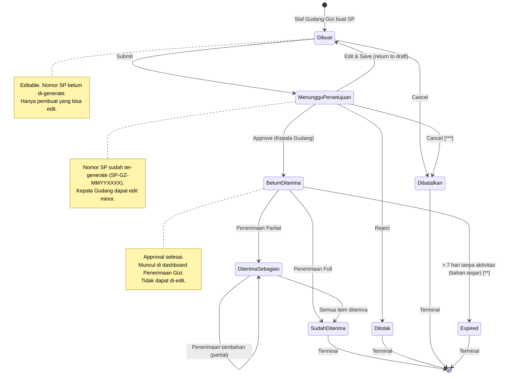
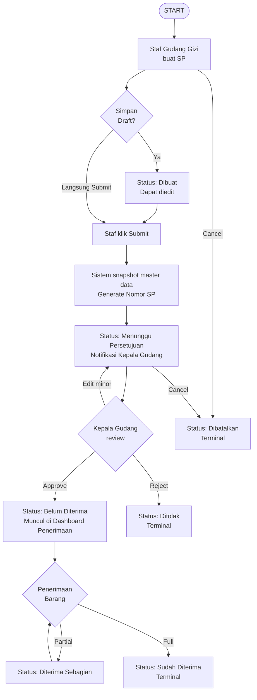
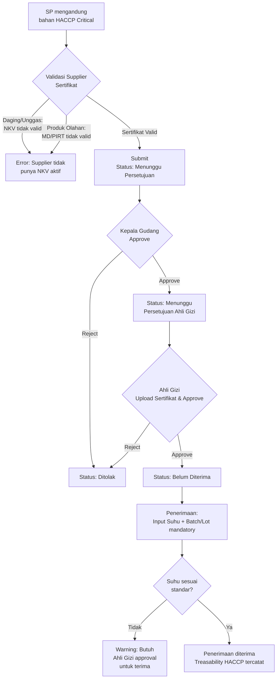

# Product Requirement Document
## Pemesanan Barang — Barang Gizi

**Related Document:**

| Dokumen | Link |
|---|---|
| PRD Pemisahan SP RJ-RI `[**]` | https://docs.google.com/document/d/1Q_pL3qZNCS6JxVR293rvlEUSbeF79Z_S0E_ufgbC0xM/edit?tab=t.0 |
| Template SP `[**]` | https://docs.google.com/document/d/1ZJvnoVpGlGbBu9f8Kcpk2yX2AqeOlfhs/edit |

**Document Version:**

| Tanggal | Versi | Keterangan |
|---|---|---|
| 12 Juni 2026 | 1.0 | Pembuatan fitur Pemesanan Barang untuk mengelola data Surat Pemesanan pada proses pemesanan bahan pangan ke supplier |

**Approval:**

| PRD approved by | Nama/Jabatan | Signature, Date |
|---|---|---|
| [1] | M. Sulthan Farras Nanz — Chief Strategy & Growth Officer, Tamtech International | |

---

**Legend Phase:**

| Simbol | Phase |
|---|---|
| *(tanpa simbol)* | Phase 1 |
| `[**]` | Phase 2 |
| `[***]` | Phase 3 |
| `[****]` | Phase 4 |

---

## 1. Overview / Brief Summary

Fitur **Pemesanan Barang — Barang Gizi** adalah modul untuk mengelola proses pembuatan, persetujuan, dan pelacakan Surat Pemesanan (SP) bahan pangan dan bahan gizi (bahan segar, bahan kering, formula enteral, susu, BHP dapur) ke supplier/vendor bahan pangan, yang dirancang khusus untuk **RS Tipe C dan Tipe D** di Indonesia.

**Konteks RS Tipe C dan D:**

- **RS Tipe C:** pelayanan medik spesialistik dasar, kapasitas 100–200 tempat tidur, umumnya RS daerah/swasta tingkat kabupaten.
- **RS Tipe D:** pelayanan medik dasar, kapasitas < 100 tempat tidur.
- Karakteristik Instalasi Gizi: struktur ramping. 1 Ahli Gizi/Nutrisionis Penanggung Jawab (sering merangkap pelayanan klinik), 1–2 Kepala Gudang/Dapur, 3–8 Staf Pelaksana Gizi.
- Volume transaksi: 50–300 SP/bulan — lebih tinggi dari kategori lain karena pemesanan bahan segar bersifat harian/mingguan.

**Karakteristik khusus Gizi yang dihandle fitur ini (berbeda dengan kategori barang lain):**

- Workflow khusus untuk **HACCP Critical Items** (daging mentah, ikan segar, susu pasteurisasi, telur, produk olahan) sesuai PP 86/2019 Keamanan Pangan.
- Approval mandatory oleh **Ahli Gizi / Nutrisionis Penanggung Jawab Instalasi Gizi** sesuai Permenkes 78/2013 PGRS.
- Validasi **Standar Menu RS** — bahan di luar Standar Menu memerlukan justifikasi Ahli Gizi.
- Validasi **Sertifikat Halal** untuk produk olahan (mandatory untuk RS yang melayani pasien Muslim, sesuai UU 33/2014).
- Validasi **NKV** (Nomor Kontrol Veteriner) untuk daging dan unggas — mandatory.
- Validasi **MD/PIRT** untuk produk olahan kemasan (BPOM).
- Validasi minimum **ED at delivery** yang berbeda per kategori: segar (1–3 hari), semi-perishable (1–2 minggu), kering (3–6 bulan), formula enteral (6–12 bulan).
- **Cold chain awareness** multi-level: Frozen (−18°C), Chilled (0–4°C), Cool (5–10°C), Ambient (< 25°C).
- Tracking batch/lot bahan pangan saat Penerimaan untuk traceability jika ada keluhan/kontaminasi.

**Penyesuaian untuk RS Tipe C/D:**

- Struktur Unit Gudang Gizi sederhana: hanya 2 role operasional — Staf Gudang Gizi dan Kepala Gudang Gizi.
- Approval flow 2-tier: Staf Gudang Gizi → Kepala Gudang Gizi (→ Ahli Gizi sebagai final approver).
- Validasi CPPB Supplier diserahkan ke Ahli Gizi secara operasional/manual (bukan otomatisasi sistem).
- Validasi HACCP, Standar Menu, Sertifikat Halal, NKV, ED, dan Cold Chain tetap ada karena merupakan standar keamanan pangan yang berlaku universal.

**Ruang lingkup penerapan:**

- RS Tipe C dan D yang menggunakan SIMRS Neurovi.
- Pemesanan barang dengan kategori Gizi (bahan segar, bahan kering, formula enteral, susu, telur, daging, ikan, sayur, buah, bumbu, BHP dapur).
- Role yang diberikan akses: Staf Gudang Gizi (pembuat), Kepala Gudang Gizi (approver tier 1), Ahli Gizi / Nutrisionis Penanggung Jawab (final approver).

---

## 2. Background

Pengadaan bahan pangan dan bahan gizi di RS adalah proses operasional yang sangat dinamis dan kritikal karena berkaitan langsung dengan keselamatan pangan pasien. Volume tinggi, frekuensi pesanan harian/mingguan, banyak supplier (lokal-regional), dan ED bahan yang sangat pendek membuat tata kelola pengadaan gizi membutuhkan workflow yang efisien namun tetap compliant terhadap standar keamanan pangan.

**Pain point kondisi saat ini (manual/sistem lama):**

- Pembuatan SP Gizi manual dengan buku catatan/Excel/WhatsApp ke supplier — sering ada miskomunikasi qty dan tanggal pengiriman.
- Validasi keamanan pangan manual: Ahli Gizi harus cek sertifikat halal, NKV, MD/PIRT dari arsip fisik supplier — rawan terlewat saat audit STARKES.
- Tracking stok bahan segar sulit: ED pendek (1–3 hari) menyebabkan banyak bahan basi/terbuang karena tidak ada visibility stok real-time.
- Duplikasi pemesanan: tanpa visibility PO outstanding, sering terjadi pemesanan ganda atau missing untuk bahan harian (sayur, daging segar).
- Tidak ada link ke menu pasien: Staf Gudang sulit perkirakan kebutuhan harian karena tidak tahu jumlah pasien dengan diet tertentu.
- Approval routing manual: SP di-print, dijalankan dari meja Staf ke Kepala Gudang lalu ke Ahli Gizi — yang sering tidak di tempat karena kunjungan ke pasien rawat inap.
- Audit STARKES sulit: arsip fisik tersebar, sertifikat halal & NKV vendor sulit di-trace.
- Tidak ada alert untuk bahan yang mendekati expired atau over-stock, terutama bahan segar yang harus FIFO ketat.

**Pertimbangan khusus RS Tipe C/D:**

- Tim Instalasi Gizi kecil (5–15 orang total termasuk juru masak): 1 Ahli Gizi (sering merangkap pelayanan klinik), 1–2 Kepala Gudang/Dapur, 3–8 Staf Pelaksana.
- Ahli Gizi sering tidak full-time di gudang (kunjungan ke pasien untuk asuhan gizi) — workflow approval harus mengakomodasi mobile review.
- Supplier banyak dan kecil (pasar tradisional, vendor lokal): tidak semua punya sertifikat lengkap.
- Volume pesanan harian (bahan segar) sangat tinggi dengan nilai per-transaksi kecil — workflow tidak boleh terlalu birokratis.
- Budget gizi terbatas dan ketat — perlu visibility budget realtime.

**Target kondisi setelah implementasi:**

- Workflow 2-tier yang cepat sesuai konteks operasional dapur dan gudang gizi RS Tipe C/D.
- Compliant terhadap Permenkes 78/2013 PGRS, UU 18/2012 Pangan, PP 86/2019 Keamanan Pangan, UU 33/2014 Halal, dan STARKES Standar PAP.5.
- Audit trail lengkap untuk akreditasi STARKES dan audit Komite Mutu RS.
- Otomasi validasi HACCP Critical Items, Standar Menu RS, Sertifikat Halal, NKV, ED kategori-dependent, dan Cold Chain awareness.

---

## 3. In Scope

### Scope Definition

| No | Scope / Area | Phase |
|---|---|---|
| 1 | Dashboard Pemesanan Barang Gizi dengan filter & search | Phase 1 |
| 2 | Buat Surat Pemesanan (SP) baru dengan multi-item bahan gizi | Phase 1 |
| 3 | Edit Surat Pemesanan (status Dibuat / Menunggu Persetujuan) | Phase 1 |
| 4 | Lihat Detail SP (read-only untuk status Belum Diterima dan seterusnya) | Phase 1 |
| 5 | State Machine dengan 9 status (Dibuat, Menunggu Persetujuan, Belum Diterima, Diterima Sebagian, Sudah Diterima, Ditolak, Dibatalkan, Expired) | Phase 1 |
| 6 | Snapshot Master Data (Bahan Gizi, Supplier, Harga) saat SP submit | Phase 1 |
| 7 | Workflow approval 2-tier: Staf Gudang Gizi → Kepala Gudang Gizi | Phase 1 |
| 8 | Cetak SP dalam format PDF resmi RS | Phase 1 |
| 9 | Batalkan SP (sebelum status Diterima Sebagian) | Phase 1 |
| 10 | Audit Trail / Riwayat Aktivitas | Phase 1 |
| 11 | Drag and Drop List Bahan Pemesanan | Phase 1 |
| 12 | `[**]` Role & Otorisasi (RBAC) | Phase 2 |
| 13 | `[**]` Kategorisasi bahan (Segar, Semi-perishable, Kering, Formula Enteral, Susu, BHP Dapur) | Phase 2 |
| 14 | `[**]` Kategorisasi Cold Chain (Frozen / Chilled / Cool / Ambient) | Phase 2 |
| 15 | `[**]` Workflow khusus HACCP Critical Items dengan validasi supplier khusus & approval ganda | Phase 2 |
| 16 | `[**]` Validasi Standar Menu RS dengan override Ahli Gizi | Phase 2 |
| 17 | `[**]` Validasi Sertifikat Halal attachment untuk produk olahan | Phase 2 |
| 18 | `[**]` Validasi NKV untuk daging & unggas | Phase 2 |
| 19 | `[**]` Validasi minimum ED at delivery (kategori-dependent: segar 80% remaining, kering 75% remaining) | Phase 2 |
| 20 | `[**]` Konfirmasi Penerimaan langsung dari Detail SP (shortcut UX) | Phase 2 |
| 21 | `[**]` Tracking batch/lot bahan pangan saat Penerimaan | Phase 2 |
| 22 | `[**]` Export data SP ke Excel/CSV | Phase 2 |
| 23 | `[**]` Notifikasi push & email untuk approval & status change | Phase 2 |
| 24 | `[**]` Integrasi otomatis dengan modul Rencana Pengadaan (generate SP harian dari Rencana Menu) | Phase 2 |
| 25 | `[**]` Integrasi dengan jumlah pasien rawat inap (estimasi qty berdasarkan jumlah pasien per diet) | Phase 2 |
| 26 | `[**]` Pemisahan SP per Kelas Perawatan (VIP / Kelas 1 / 2 / 3) | Phase 2 |
| 27 | `[***]` Dashboard Visual analisis pengadaan gizi (waste rate, supplier performance, biaya per pasien) | Phase 3 |
| 28 | `[***]` Riwayat Transaksi terkonsolidasi per supplier & per kategori bahan | Phase 3 |
| 29 | `[***]` Persetujuan Direktur RS untuk SP bernilai besar atau bulk procurement | Phase 3 |
| 30 | `[****]` Vendor scoring & auto-recommendation supplier berdasarkan performance | Phase 4 |
| 31 | `[****]` Predictive ordering berdasarkan ML demand forecast | Phase 4 |

### Out Scope

| No | Scope |
|---|---|
| 1 | Pemesanan Barang Farmasi (PRD terpisah) |
| 2 | Pemesanan Barang Rumah Tangga (PRD terpisah) |
| 3 | Modul Rencana Pengadaan Gizi (PRD terpisah, akan terintegrasi di Phase 2) |
| 4 | Modul Penerimaan Barang Gizi (PRD terpisah, integrasi via API) |
| 5 | Modul Perencanaan Menu RS (PRD terpisah — Master Standar Menu) |
| 6 | Modul Asuhan Gizi Pasien & Diet Order (PRD terpisah — link ke EMR) |
| 7 | Modul Keuangan (Persediaan & Pembayaran) — integrasi via API only |
| 8 | Validasi CPPB Supplier otomatis — validasi dilakukan Ahli Gizi secara operasional/manual |
| 9 | Negosiasi harga dengan supplier (manual offline) |
| 10 | Kontrak supplier jangka panjang (handled by Modul Master Supplier) |
| 11 | Resep menu / recipe management (handled by Modul Master Menu) |
| 12 | Pelaporan keamanan pangan ke Komite Mutu RS otomatis (Phase 3) |
| 13 | Multi-currency procurement (default Rupiah saja) |
| 14 | Workflow Manajer Logistik & Manajer Keuangan terpisah — di RS Tipe C/D fungsi merged ke Kepala Gudang Gizi & Direktur RS |
| 15 | Integrasi E-Katalog LKPP (tidak relevan untuk RS Tipe C/D swasta) |
| 16 | Auction / tender otomatis dengan multiple supplier |

---

## 4. Goals and Metrics

**Goals:**

- Memudahkan Staf Gudang Gizi membuat, mencetak, dan memantau SP pengadaan bahan pangan dengan workflow yang disesuaikan untuk operasional dapur dan gudang gizi RS Tipe C/D yang dinamis.
- Memastikan compliance terhadap regulasi keamanan pangan dan pelayanan gizi RS (Permenkes 78/2013 PGRS, UU 18/2012 Pangan, PP 86/2019 Keamanan Pangan, UU 33/2014 Halal).
- Menyediakan audit trail lengkap untuk akreditasi STARKES Standar PAP.5 Pelayanan Gizi.
- Mengotomasi validasi HACCP Critical Items, Standar Menu RS, Sertifikat Halal, NKV, ED kategori-dependent, dan Cold Chain awareness.
- Mengintegrasikan data dengan Rencana Pengadaan Menu, Penerimaan Barang, dan Keuangan untuk menghindari duplikasi & inkonsistensi.
- Mempercepat proses approval 2-tier untuk pesanan harian bahan segar, dengan SLA jelas yang mengakomodasi Ahli Gizi yang mobile.

**Metrics:**

| No | Metric | Success Criteria |
|---|---|---|
| 1 | Compliance HACCP | 100% SP bahan HACCP Critical (daging, ikan, susu, telur, produk olahan) melalui workflow khusus dengan approval Kepala Gudang + Ahli Gizi |
| 2 | Compliance Halal | 100% SP produk olahan dengan Sertifikat Halal attachment (untuk RS yang melayani pasien Muslim) |
| 3 | Akurasi Data Antar Modul | 100% data SP konsisten dengan Rencana Menu, Penerimaan, dan Persediaan; selisih < 1% |
| 4 | Transparansi Audit Trail | 100% transaksi SP tercatat dengan field: user, role, action, before-after, timestamp, IP |
| 5 | Waktu Pembuatan SP | Staf dapat membuat & submit SP dengan ≤ 50 items dalam ≤ 5 menit |
| 6 | Waktu Approval Kepala Gudang (P95) | P95 ≤ 1 jam untuk SP Normal; ≤ 15 menit untuk Cito |
| 7 | Waktu Approval Ahli Gizi (P95) | P95 ≤ 4 jam untuk SP Normal; ≤ 30 menit untuk Cito (mengakomodasi Ahli Gizi mobile) |
| 8 | Waktu Cetak SP | PDF SP dapat di-download/cetak dalam ≤ 30 detik setelah Approved |
| 9 | Reduction in Food Waste | Reduksi food waste minimum 50% dari baseline manual (melalui visibility stok & ED) |
| 10 | Standar Menu Compliance | 100% SP untuk bahan Standar Menu tanpa override; SP non-Standar dengan justifikasi Ahli Gizi |

---

## 5. Related Feature

| Module | Feature | Integration Detail |
|---|---|---|
| Master Data | Bahan Gizi | Sumber data master bahan: nama, kode, ED requirements per kategori, harga, satuan, preferred supplier |
| Master Data | Unit | Menentukan Gudang Gizi tujuan pemesanan (untuk RS dengan multi-gudang) |
| Master Data | Supplier | Sumber data supplier: nama vendor, tipe (pasar tradisional/distributor/produsen), sertifikat (Halal, NKV, MD/PIRT, CPPB), is_active, lead_time, payment_terms |
| Master Data | User & Role | Untuk RBAC: role Staf Gudang Gizi, Kepala Gudang Gizi, Ahli Gizi / Nutrisionis, Direktur RS, Auditor |
| Master Data | Menu Makanan | Daftar Menu Makanan yang dapat dipesan; Phase 2: integrasi penuh untuk validasi otomatis di SP |
| Inventory | Rencana Pengadaan Gizi | Phase 2: generate SP otomatis dari Rencana Menu harian/mingguan. Phase 1: manual reference |
| Inventory | Penerimaan Barang Gizi | Downstream: SP Approved muncul di dashboard Penerimaan. Saat Penerimaan disimpan, status SP auto-update. Penerimaan validate suhu & batch |
| Keuangan | Persediaan & Pembelian | API ke Modul Keuangan: validasi budget kategori gizi (warning only); commit budget saat SP Approved |

---

## 6. Business Process

### A. As-Is (Kondisi Saat Ini — Manual)

- Staf Gudang Gizi mencatat kebutuhan harian di buku catatan atau Excel berdasarkan estimasi jumlah pasien & menu hari itu.
- Komunikasi ke supplier via telepon atau WhatsApp — sering terjadi miskomunikasi qty atau jadwal pengiriman.
- Validasi sertifikat supplier (Halal, NKV, MD) manual dengan check arsip fisik — terutama saat audit STARKES sulit dicari.
- Approval routing manual: SP fisik di-print, dijalankan dari meja Staf ke meja Kepala Gudang, lalu ke Ahli Gizi.
- Ahli Gizi yang mobile (visit ke pasien) menyebabkan SP sering menunggu kembali ke instalasi.
- Tidak ada visibility status SP: Staf harus follow up manual via WhatsApp atau ketemu langsung.
- Audit trail sulit: saat audit STARKES, harus cari arsip fisik SP yang tersebar.
- Duplikasi pesanan harian sering terjadi karena tidak ada visibility PO outstanding — rawan over-order bahan segar dengan ED pendek.
- Food waste tinggi karena tidak ada link ke jumlah pasien actual.

### B. To-Be (Kondisi yang Diharapkan dengan Fitur Pemesanan Gizi)

- Staf Gudang Gizi buka menu Inventaris → Pemesanan Barang Gizi.
- Dashboard menampilkan list SP dengan filter status, supplier, daterange, dan search by nomor SP.
- Klik tombol [+] untuk Buat SP baru.
- Form Tambah SP: pilih Supplier, tambah items dengan auto-fill harga, satuan, dan kategori.
- Staf klik Simpan Draft → SP tersimpan dengan status "Dibuat" dan masih dapat diedit.
- Staf klik Submit → Sistem snapshot master data, generate Nomor SP unik (format SP-GZ-MMYYXXXX). Status → "Menunggu Persetujuan". Notifikasi otomatis ke Kepala Gudang Gizi.
- Kepala Gudang Gizi buka SP, validasi kebutuhan & qty sesuai jumlah pasien hari ini. Approve atau reject dengan alasan.
- Setelah Kepala Gudang approve → Status → "Belum Diterima". SP otomatis muncul di Dashboard Penerimaan Barang.
- Staf cetak SP PDF untuk dikirim ke supplier.
- Setelah barang diterima via modul Penerimaan: status SP auto-update ke "Diterima Sebagian" atau "Sudah Diterima". Suhu & batch/lot di-record saat Penerimaan untuk traceability HACCP.
- `[**]` Ahli Gizi review compliance (HACCP, sertifikat halal, kesesuaian menu, ED requirement) dan approve sebagai final.

---

## 7. Main Flow / State Diagram

### State Machine — Alur Status SP Gizi

### Alur Approval Normal (Bukan HACCP Critical)

### Alur Khusus HACCP Critical Items `[**]`

### Role & Otorisasi

| Role | Buat Draft | Submit | Edit Draft | Edit Submitted | Approve KG | Batal | Lihat | Cetak |
|---|---|---|---|---|---|---|---|---|
| Staf Gudang Gizi | ✓ | ✓ | ✓ | ✗ | ✗ | ✓ (own SP, sebelum approved) | ✓ (own SP) | ✓ |
| Kepala Gudang Gizi | ✓ | ✓ | ✓ (own) | ✓ (during approval) | ✓ | ✓ (any SP Gudang, justifikasi) | ✓ (semua SP Gudang) | ✓ |
| Direktur RS / Manajemen | ✗ | ✗ | ✗ | ✗ | ✗ | ✓ (emergency override) | ✓ (semua) | ✓ |
| Auditor Internal | ✗ | ✗ | ✗ | ✗ | ✗ | ✗ | ✓ (read-only) | ✓ (read-only) |

---

## 8. Requirement

**User Story Utama:**
> Sebagai Staf Gudang Gizi, Kepala Gudang Gizi, dan Ahli Gizi di RS Tipe C/D, kami dapat mengelola data pemesanan bahan pangan dan bahan gizi ke supplier dengan workflow approval 2-tier yang efisien dan compliant terhadap regulasi pelayanan gizi RS (Permenkes 78/2013 PGRS, UU 18/2012 Pangan, PP 86/2019 Keamanan Pangan), agar proses pengadaan gizi menjadi efisien, transparan, akuntabel, dan menjamin keamanan pangan untuk pasien.

### User Stories Detail

| Kode | User Story | Priority |
|---|---|---|
| US-001 | Sebagai Staf Gudang Gizi, saya ingin melihat dashboard daftar Surat Pemesanan (SP) dengan filter dan search, agar data SP pengadaan bahan pangan bisa terpantau dengan baik. | P0 |
| US-002 | Sebagai Staf Gudang Gizi, saya ingin membuat Surat Pemesanan (SP) baru, agar pemesanan bahan pangan ke supplier dapat dilakukan secara digital. | P0 |
| US-003 | Sebagai Staf Gudang Gizi, saya ingin menyimpan SP sebagai Draft (status Dibuat), agar saya dapat melengkapi data sebelum submit. | P0 |
| US-004 | Sebagai Staf Gudang Gizi, saya ingin submit SP untuk approval, agar SP dapat diproses oleh Kepala Gudang Gizi. | P0 |
| US-005 | Sebagai Kepala Gudang Gizi, saya ingin mereview, menyetujui, atau menolak SP yang masuk, agar kebutuhan stok dan qty dapat divalidasi sesuai jumlah pasien sebelum pemesanan ke supplier. | P0 |
| US-006 | Sebagai Staf Gudang Gizi, saya ingin mengedit SP dengan status Dibuat atau Menunggu Persetujuan, agar data SP dapat disesuaikan kembali. | P0 |
| US-007 | Sebagai user dengan akses, saya ingin melihat detail SP dengan status apapun, agar dapat memantau dan menelusuri history pemesanan. | P1 |
| US-008 | Sebagai pembuat atau approver, saya ingin membatalkan SP dengan justifikasi, agar SP yang tidak relevan dapat di-void tanpa menghapus history. | P1 |
| US-009 | Sebagai user dengan akses, saya ingin mencetak SP dalam format PDF resmi RS, agar dapat dikirim ke supplier secara fisik/email/WhatsApp. | P1 |
| US-010 | Sebagai Admin/Ahli Gizi/Auditor, saya ingin melihat riwayat aktivitas setiap SP (siapa, kapan, aksi apa), agar audit trail tersedia untuk keperluan akreditasi STARKES atau internal review. | P0 |
| US-011 | `[**]` Sebagai Staf Gudang Gizi, saya ingin melakukan konfirmasi Penerimaan langsung dari halaman Detail SP, agar tidak perlu membuka menu Penerimaan secara terpisah. | P2 |
| US-012 | `[**]` Sebagai sistem, dapat memproses SP yang berisi bahan HACCP Critical dengan workflow khusus, agar memastikan compliance keamanan pangan dan rantai dingin (cold chain). | P1 |

### Functional Requirements

| Kode | Fitur | User Story | Acceptance Criteria |
|---|---|---|---|
| FR1 | Dashboard Pemesanan Barang Gizi | US-001 | **AC 1:** Dashboard load ≤ 2 detik untuk 500 records dengan pagination. **AC 2:** Filter: daterange (default 7 hari — sesuai operasional gizi harian), Nama Supplier, Status SP (multi-select). **AC 3:** Search by Nomor SP, Nama Supplier, Nama Item — real-time dengan debounce 300ms. **AC 4:** Default sort: Nomor SP descending. **AC 5:** Setiap kolom dapat diklik untuk sorting ascending/descending. **AC 6:** Color coding status: Dibuat (abu), Menunggu Persetujuan (kuning), Belum Diterima (biru), Diterima Sebagian (hijau muda), Sudah Diterima (hijau), Ditolak/Dibatalkan (merah), Expired (oranye). **AC 7:** Kolom Aksi conditional: Detail (semua status), Edit (Dibuat/Menunggu Persetujuan only), Cetak SP (Belum Diterima+), Batal (sesuai matriks), Konfirmasi Penerimaan (Belum Diterima/Diterima Sebagian). **AC 8:** Visibility per role: Staf Gudang Gizi hanya lihat SP yang dia buat; Kepala Gudang & Auditor lihat semua SP Gizi. **AC 9:** Tidak menampilkan SP kategori non-Gizi. `[**]` **AC 10:** Badge khusus untuk SP HACCP Critical Items dan SP non-Standar Menu. |
| FR2 | Tambah Pemesanan | US-002, US-003 | **AC 1:** Sistem real-time kalkulasi Sub Total = Qty × Harga. **AC 2:** Sistem tidak mengizinkan Qty dan Harga ≤ 0. **AC 3:** Saat pilih Bahan, otomatis auto-fill Kategori dan Suhu Storage Required dari Master Data Bahan Gizi. **AC 4:** Tombol "Simpan Draft" tidak memvalidasi mandatory field (kecuali Supplier). **AC 5:** Tombol "Submit" memvalidasi seluruh mandatory field. **AC 6:** `[**]` Grand Total = Sum(Sub Total) + PPN (default 11%). **AC 7:** Sistem menyimpan po_category = 'GIZI' hardcoded berdasarkan menu. **AC 8:** Tiap baris dapat dipindahkan melalui Drag and Drop. |
| FR3 | Submit SP | US-004 | **AC 1:** Tombol Submit aktif hanya bila semua mandatory field terisi & valid. **AC 2:** Dialog konfirmasi: "Submit SP ini untuk approval? Setelah submit tidak dapat di-edit pembuat." **AC 3:** Generate Nomor SP saat submit. Format: SP-GZ-MMYYXXXX. **AC 4:** Status berubah Dibuat → Menunggu Persetujuan. **AC 5:** `[**]` Notifikasi otomatis ke Kepala Gudang Gizi (in-app Phase 1; email & push Phase 2). **AC 6:** Audit trail: SP_SUBMITTED dengan user, role, timestamp, IP. **AC 7:** Setelah submit: redirect ke Dashboard dengan SP baru highlighted di atas. |
| FR4 | Approval / Reject SP — Kepala Gudang | US-005 | **AC 1:** Kepala Gudang dapat lihat semua SP status Menunggu Persetujuan di dashboard (filter default). **AC 2:** Edit by Kepala Gudang dapat dilakukan untuk semua field. Dicatat di audit trail. **AC 3:** Approve: dialog konfirmasi. Status → Belum Diterima. **AC 4:** Reject: dialog dengan input mandatory "Alasan Penolakan" (min 20 char). Status → Ditolak. **AC 5:** Audit trail: APPROVED_KEPALA_GUDANG / REJECTED_KEPALA_GUDANG dengan user, alasan, timestamp. |
| FR5 | Edit Pemesanan | US-006 | **AC 1:** Staf Gudang Gizi (pembuat): dapat edit SP status Dibuat & Menunggu Persetujuan. **AC 2:** Kepala Gudang Gizi: dapat edit SP selama status Menunggu Persetujuan. **AC 3:** Setelah status Belum Diterima: tidak dapat diedit. **AC 4:** Audit trail untuk setiap edit: field name, before-after, user, role, timestamp. **AC 5:** `[**]` Auto-save draft setiap 30 detik. **AC 6:** Concurrent edit detection: optimistic locking dengan version field. Konflik: prompt merge. |
| FR6 | Detail Pemesanan | US-007 | **AC 1:** Section header SP (read-only untuk Belum Diterima+). **AC 2:** Section Items: tabel items & subtotal. **AC 3:** Section Approval History: tabel chronological dengan Tanggal, User, Role, Aksi, Alasan/Catatan. **AC 4:** `[**]` Section Penerimaan Barang: list Nomor Faktur, Tanggal Penerimaan, Batch/Lot, Status. Multiple data untuk Diterima Sebagian. **AC 5:** Tombol Cetak SP di bottom (aktif Belum Diterima+, hidden untuk Draft/Ditolak). **AC 6:** `[**]` Tombol Konfirmasi Penerimaan: aktif untuk Belum Diterima & Diterima Sebagian. **AC 7:** Tombol Batal: aktif sesuai matriks role/status. |
| FR7 | Batal Pemesanan | US-008 | **AC 1:** Staf Gudang Gizi (pembuat): dapat Batal SP status Dibuat & Menunggu Persetujuan. **AC 2:** Kepala Gudang Gizi: dapat Batal SP status Menunggu Persetujuan / Belum Diterima. **AC 3:** TIDAK boleh Batal: status Diterima Sebagian, Sudah Diterima. **AC 4:** Dialog Batal: "Yakin batal SP ini? Aksi ini tidak dapat di-undo." + textarea "Alasan Pembatalan" (mandatory, min 20 char). **AC 5:** Setelah Batal: status → Dibatalkan (terminal). Tidak ada efek ke modul lain. **AC 6:** Audit trail: CANCELLED dengan user, role, alasan, timestamp. |
| FR8 | Cetak SP | US-009 | **AC 1:** Tombol Cetak SP aktif untuk status Belum Diterima+, hidden untuk Draft/Ditolak. **AC 2:** Format PDF: A4, kop surat RS otomatis, Nomor SP, Tanggal, Supplier info, Tabel items dengan kategori & suhu storage required, Approval signatures. **AC 3:** Tanda tangan area: nama & posisi Kepala Gudang Gizi dan Ahli Gizi, tanggal approval autofill. **AC 4:** Watermark "COPY" untuk re-print. **AC 5:** File name: SP_[Nomor]_[Tanggal].pdf. **AC 6:** Generation time: ≤ 30 detik. **AC 7:** File terunduh ke internal storage device user. **AC 8:** Audit trail: PRINTED dengan user, timestamp. |
| FR9 | Riwayat Aktivitas / Audit Trail | US-010 | **AC 1:** Riwayat aktivitas ditampilkan untuk setiap SP. **AC 2:** Format: "Dibuat oleh [user_id]/[nama] (Role: [role]) pada [DD/MM/YYYY HH:MM]". Field changes: "Field [X]: [before] → [after]". **AC 3:** Kategori aktivitas: CREATE, UPDATE, SUBMIT, APPROVE, REJECT, CANCEL, PRINT. **AC 4:** Retention minimum 5 tahun (sesuai STARKES). **AC 5:** Immutable: hanya INSERT allowed, tidak ada UPDATE/DELETE. **AC 6:** Dapat di-export PDF/CSV untuk audit STARKES atau Komite Mutu RS. |
| FR10 | `[**]` Konfirmasi Penerimaan dari Detail SP | US-011 | **AC 1:** Tombol Konfirmasi Penerimaan aktif untuk status Belum Diterima atau Diterima Sebagian. **AC 2:** Klik: navigate ke halaman Buat Penerimaan dengan sp_id dan items ter-prefill. **AC 3:** Input mandatory tambahan untuk HACCP Critical Items: Suhu Saat Diterima, Batch/Lot Number, Kondisi Fisik. **AC 4:** Status SP auto-update: full → Sudah Diterima; partial → Diterima Sebagian. |
| FR11 | `[**]` Workflow Khusus HACCP Critical Items | US-012 | **AC 1:** Auto-flag: jika ada ≥ 1 item dengan is_haccp_critical = true, SP otomatis flagged SP-HACCP. **AC 2:** Validasi Supplier: daging/unggas → wajib NKV aktif; produk olahan → wajib MD/PIRT aktif. **AC 3:** Untuk RS Muslim: validasi Sertifikat Halal tambahan untuk produk olahan. **AC 4:** Approval ganda WAJIB: Kepala Gudang + Ahli Gizi — tidak boleh skip Kepala Gudang. **AC 5:** Ahli Gizi approval: upload sertifikat (Halal/NKV/MD) sebagai attachment bila supplier belum upload di master. **AC 6:** Tracking suhu di Penerimaan: wajib input suhu saat diterima vs suhu standar. Bila tidak sesuai: butuh approval Ahli Gizi. **AC 7:** Tracking batch/lot wajib untuk traceability. **AC 8:** Audit trail extended: tambahan field HACCP_VALIDATION, SUHU_TERIMA, BATCH_LOT. |

---

## 9. Data Requirements (Spesifikasi Field)

### A. Dashboard Pemesanan Barang Gizi

| No | Field / Kolom | Keterangan |
|---|---|---|
| 1 | Tanggal Pemesanan | Sumber Data: Detail Pemesanan — Tanggal Pemesanan. Format DD/MM/YYYY. |
| 2 | Nomor SP | Sumber Data: Detail Pemesanan — No. Pemesanan. Format: SP-GZ-MMYYXXXX. |
| 3 | Nama Supplier | Sumber Data: Detail Pemesanan — Supplier. |
| 4 | Total Item | Sum count dari items |
| 5 | Perkiraan Biaya | Sumber Data: Detail Pemesanan — Perkiraan Biaya |
| 6 | Status SP | Sesuai State Machine. 9 status. |
| 7 | Aksi | Buttons dihitung berdasarkan role + status: Detail / Edit / Cetak / Batal / Konfirmasi Penerimaan |

### B. Tambah Pemesanan — Section Data Pemesanan (Header)

| No | Field | Tipe | Keterangan |
|---|---|---|---|
| — | Gudang Tujuan | Dropdown (auto-set) | Sumber: Master Data Unit — flag "Gudang Gizi". Auto-set ke Gudang Gizi unit user yang login. Mandatory. |
| 1 | Tanggal Pemesanan | Datepicker | Format: DD/MM/YYYY. Default: hari ini. Tidak boleh backdate. Mandatory. |
| — | Nomor SP | Auto-generated | Format: SP-GZ-MMYYXXXX. Counter reset bulanan. Unique global. Generated saat submit (status → Menunggu Persetujuan). |
| 2 | Nama Supplier | Single Dropdown | Sumber: Master Data Supplier (kategori gizi/pangan, is_active = true). Search by nama supplier. Mandatory. |
| — | Perkiraan Biaya | Auto-calculated | = SUM [Sub Total]. Noneditable. Format: Rp 99.999,99. |
| 5 | Keterangan | Text Input | Min: 0 char. Max: 500 char. Mandatory bila Urgensi == Urgent atau Cito (min 20 char). |

### B.2. Tambah Pemesanan — Section Data Bahan

| No | Field | Tipe | Keterangan |
|---|---|---|---|
| 1 | Nama Bahan | Single Dropdown | Sumber: Master Data Bahan Gizi (is_active = true). Format: `<Nama Bahan> <Kategori> <Satuan Default>`. Search by nama atau kode. Mandatory. |
| 2 | Jumlah Pemesanan (Qty) | Numerik Input | Min: 0.001 (untuk satuan kg/liter dengan desimal). Max: 999.999. Boleh desimal. Mandatory. `[**]` Jika ada konfigurasi Kategori SP, field dipecah per kategori (misal RJ/RI) dengan Total = sum semua kategori. |
| 3 | Satuan | Single Dropdown | Sumber: Master Data Satuan (kg, gram, liter, ml, pcs, butir, ikat, dll). Default: dari Master Bahan Gizi — satuan_default. Mandatory. |
| 4 | Harga Satuan | Autofill | Dari Master Bahan Gizi — harga_unit untuk supplier yang dipilih. Editable dengan justifikasi (min 10 char). Format: Rp 99.999,99. |
| 5 | Sub Total | Auto-calculated | = Qty × Harga Satuan. Format: Rp 99.999,99. |

### B.3. `[**]` Tambah Pemesanan — Section Form Total

| Field | Keterangan |
|---|---|
| Total | Auto-calculated: Sum [Sub Total] |
| PPN (%) | Checkbox: Jika Cek → 11%; Jika Uncek → 0%. Default: Cek (11%). |
| Total PPN | Auto-calculated: Total × PPN (%) |
| Grand Total | Auto-calculated: Total + Total PPN |

### C. Update Pemesanan

Detail Data Requirement sama seperti pada point B (Tambah Pemesanan).

### D. Detail Pemesanan

Detail Data Requirement sama seperti pada point B (Tambah Pemesanan), semua field dalam mode read-only untuk status Belum Diterima ke atas.

### E. Approve dan Reject Pemesanan

| Field | Tipe | Keterangan |
|---|---|---|
| Alasan Penolakan | Freetext Input | Min: 0 char. Max: 200 char. Mandatory saat Reject (min 20 char). |

---

## 10. Lampiran / Catatan

### Validasi

| ID | Konteks | Field/Aspek | Rule | Error Message | Trigger |
|---|---|---|---|---|---|
| V.1 | Header SP | Tanggal Pemesanan | Tidak boleh backdate (< today) | *Tanggal pemesanan tidak boleh sebelum hari ini.* | Submit |
| V.2 | Header SP | Tanggal Pengiriman | Tidak boleh > today + 30 hari | *Tanggal pengiriman terlalu jauh ke depan. Maksimum 30 hari.* | Submit |
| V.3 | Header SP | Supplier | is_active = true required | *Supplier tidak aktif. Tidak dapat dipilih.* | Submit |
| V.4 | Header SP | Urgency Urgent/Cito | Keterangan mandatory min 20 char | *Urgensi Urgent/Cito requires alasan min 20 karakter.* | Submit |
| V.5 | Header SP | HACCP Critical Detection | Jika ada item HACCP Critical, Supplier wajib punya sertifikat sesuai (NKV untuk daging, MD/PIRT untuk produk olahan) | *Supplier tidak punya sertifikat valid untuk bahan HACCP Critical ini.* | Add Item / Submit |
| V.6 | Header SP | Halal Validation | Jika RS Muslim & ada item produk olahan, Supplier wajib punya Sertifikat Halal aktif | *Supplier tidak punya Sertifikat Halal valid. Tambahkan justifikasi atau ganti supplier.* | Add Item / Submit |
| V.7 | Items | Qty | Min 0.001, Max 999.999 | *Qty tidak valid. Range: 0.001 - 999.999.* | Real-time |
| V.8 | Items | Qty | Tidak boleh 0 atau negatif | *Qty harus > 0.* | Real-time |
| V.9 | Items | Harga Satuan | Tidak boleh 0 atau negatif | *Harga harus > 0.* | Real-time |
| V.10 | Items | Duplicate Bahan | Tidak boleh duplikat bahan dalam satu SP | *Bahan sudah ada di SP. Akan otomatis di-merge qty?* | Add Item |
| V.11 | Items | Min 1 row | SP harus berisi minimal 1 item | *SP harus berisi minimal 1 bahan.* | Submit |
| V.12 | Items | Max 200 rows | Maksimum 200 items per SP | *SP melebihi 200 items. Pisah menjadi multiple SP.* | Add Item |
| V.13 | Items | Non-Standar Menu | Justifikasi mandatory min 20 char | *Bahan di luar Standar Menu memerlukan justifikasi minimal 20 karakter.* | Submit |
| V.14 | Items | Override Harga | Justifikasi mandatory min 10 char | *Override harga memerlukan justifikasi minimal 10 karakter.* | Submit |
| V.15 | Items | Cold Chain Mismatch | Warning saat tambah bahan dengan suhu storage berbeda dalam SP yang sama | *Bahan ini butuh suhu storage berbeda dari bahan lain di SP. Konfirmasi supplier dapat handle.* | Add Item |
| V.16 | SP-HACCP | Approval Ganda | WAJIB approve Kepala Gudang + Ahli Gizi untuk SP-HACCP | *SP-HACCP wajib approval ganda. Kepala Gudang tidak dapat di-skip.* | Approval Flow |
| V.17 | SP-HACCP | Sertifikat Attachment | Upload Sertifikat (Halal/NKV/MD) mandatory untuk Ahli Gizi approve produk olahan | *Upload sertifikat supplier (Halal/NKV/MD) wajib untuk lanjutkan approval.* | Ahli Gizi Approve |
| V.18 | Budget | Total > Budget Kategori | Warning only (tidak blocking) | *Total SP [Rp X] melebihi sisa budget gizi [Rp Y]. Lanjutkan?* | Submit / Approval |
| V.19 | ED Bahan | ED kategori-dependent | Sistem display min ED at delivery yang diharapkan saat pilih bahan (segar: 1–3 hari; kering: > 75% remaining) | *Pastikan supplier deliver bahan dengan ED tidak kurang dari requirement: [X hari/bulan].* | Add Item |
| V.20 | Concurrent Edit | Version Mismatch | Optimistic locking dengan version field | *SP ini telah diubah oleh user lain. Refresh untuk lihat versi terbaru.* | Save |
| V.21 | Status Transition | Invalid Transition | Validate against State Machine rules | *Transisi status tidak valid. Status saat ini: [X], target: [Y].* | Action |
| V.22 | Role Permission | Insufficient Permission | Validate role x action di RBAC matrix | *Anda tidak memiliki permission untuk aksi ini.* | Action |
| V.23 | Editing After Approval | Immutability | SP Belum Diterima+ tidak boleh diedit | *SP sudah disetujui. Untuk perubahan, batalkan & buat SP baru.* | Edit |
| V.24 | Cancel Restriction | Cannot cancel after partial received | Status Diterima Sebagian / Sudah Diterima tidak boleh dicancel | *SP sudah ada bahan yang diterima. Tidak dapat dibatalkan.* | Cancel |
| V.25 | Audit Trail | Mandatory action logging | Semua aksi WAJIB di-log ke audit trail | *(System error — log failed)* | Any Action |

### Edge Cases

| No | Case | Dampak | Mitigasi |
|---|---|---|---|
| C.1 | Supplier dinonaktifkan setelah SP dibuat (Draft) | Pembuat tidak dapat submit | Re-validate Supplier status saat submit. Jika inactive: error, field Supplier di-clear. |
| C.2 | Bahan dinonaktifkan setelah SP dibuat (Draft) | Item tidak dapat diprocess | Re-validate item status saat submit. Jika inactive: error per row. |
| C.3 | Harga master berubah setelah SP submit (fluktuasi harga sayur pasar) | Inkonsistensi nilai SP | Snapshot harga saat submit (JSONB snapshot_master_data). Penerimaan pakai harga snapshot. |
| C.4 | Ahli Gizi tidak available (sedang asuhan gizi pasien) | SP stuck menunggu approval | Sistem support Ahli Gizi Pengganti via SK Penunjukan (master_user). Auto-reroute setelah > 4 jam SLA breach. Phase 2: mobile push notif. |
| C.5 | Network failure saat submit | Data partial saved | Transactional save: rollback jika gagal. Idempotency key untuk hindari double-submit. |
| C.6 | Concurrent edit oleh 2 user | Data loss | Optimistic locking dengan version field. Konflik: prompt "Lihat changes / Overwrite / Cancel". |
| C.7 | SP untuk bahan yang ada PO outstanding | Double stock; risk over-stock bahan segar yang basi | Warning di submit: "Sudah ada PO outstanding [Nomor] untuk bahan [X] dengan qty [Y]. Lanjutkan?" Phase 2: blocking. |
| C.8 | SP-HACCP tapi Supplier kehilangan sertifikat (Halal/NKV/MD expired) di tengah workflow | SP tidak valid; risk keamanan pangan | Re-validate at approval. Ahli Gizi tidak boleh approve. Reject mandatory atau Ahli Gizi upload sertifikat baru. |
| C.9 | Bahan non-Standar Menu di SP | Compliance STARKES PAP.5 | Ahli Gizi override allowed dengan justifikasi & checkbox approval. Phase 2: integrasi Komite Gizi review queue. |
| C.10 | Pemesanan emergency Cito (formula enteral khusus pasien baru ICU) | Ahli Gizi tidak available; SLA breach | Phase 1: log pending. Phase 2: SMS/WhatsApp alert ke Ahli Gizi on-call. Phase 3: override Direktur RS dengan post-facto review. |
| C.11 | SP di-submit duplikat (klik 2x cepat) | 2 SP duplikat | Idempotency key di backend; tombol submit disabled setelah klik sampai response. |
| C.12 | Master Supplier inactive di tengah workflow | SP tidak dapat ditrack | Cancel SP otomatis bila supplier inactive > 24 jam selama approval. Notify pembuat & approver. |
| C.13 | Penerimaan partial mismatch dengan SP | Stok tidak balance; menu pasien terganggu | Modul Penerimaan handle: qty_received ≠ qty_ordered → status SP → Diterima Sebagian. Notify Ahli Gizi untuk decision. |
| C.14 | User role berubah di tengah workflow | Approval pending tidak valid | Re-validate role di setiap action. Jika role berubah: pending approval di-clear, notify re-assign. |
| C.15 | Kepala Gudang Gizi dan Ahli Gizi adalah orang yang sama (RS Tipe D kecil) | Conflict of interest | Sistem WAJIB user berbeda untuk approve Kepala Gudang vs Ahli Gizi. Jika sama: blocking error. Wajib SK Ahli Gizi eksternal. |
| C.16 | Bahan formula enteral life-saving urgent tapi supplier khusus unavailable | Procurement gagal; risk life-threatening pasien ICU | Phase 2: emergency procurement protocol. Direktur RS dapat override dengan justifikasi dokumenter. Post-facto Ahli Gizi review. |
| C.17 | Bahan Cold Chain tapi supplier tidak support cold chain delivery | Bahan rusak; food safety risk | Phase 2: validasi cold_chain_supported di master_supplier. Phase 3: tracking cold chain temperature di Penerimaan. |
| C.18 | SP > 7 hari untuk bahan segar tanpa Penerimaan | Stale data; supplier commitment lost; menu pasien terganggu | Phase 2: auto-expire ke status Expired (window pendek untuk bahan segar). Notify pembuat, Kepala Gudang, Ahli Gizi. |
| C.19 | ED yang diterima < ED minimum yang disepakati | Food safety & quality risk | Modul Penerimaan: warning + butuh Ahli Gizi approval untuk terima. Untuk bahan risiko tinggi: reject by default. |
| C.20 | Format Nomor SP collision (race condition) | 2 SP nomor sama | Generate dengan DB sequence (atomic). Unique constraint di DB. Retry dengan increment jika collision. |
| C.21 | PDF generation timeout | User tidak dapat download SP | Async generation: queue job. Notify user via in-app saat ready. Retry mechanism. |
| C.22 | Audit log storage full | Aksi gagal karena audit log tidak bisa write | Monitoring + alert. Auto-archive audit log lama (> 1 tahun) ke cold storage. Tidak boleh continue without audit. |
| C.23 | Supplier daging kirim bahan dengan suhu tidak sesuai cold chain | Risk kontaminasi bakteri; food safety violation HACCP | Penerimaan: input suhu mandatory. Bila tidak sesuai: warning + Ahli Gizi decision (reject atau accept dengan QA action). |
| C.24 | RS Tipe D dengan Ahli Gizi merangkap Kepala Gudang & Pelayanan Klinik | Tidak ada role separation | Phase 1: tetap support skenario ini, audit trail tetap detail. Phase 2: simplified workflow 1-tier untuk RS Tipe D micro. SK Penunjukan eksternal mandatory. |
| C.25 | Jumlah pasien berkurang drastis (banyak BLPL) setelah SP submit | Bahan over-stock; food waste tinggi | Phase 2: integrasi EMR untuk update jumlah pasien real-time. Alert Kepala Gudang bila ada perubahan > 20% saat SP belum diterima. |

### Compliance & Regulatory Notes

| Regulasi | Ringkasan Aturan | Implementasi di Fitur | Tingkat Compliance |
|---|---|---|---|
| Permenkes 78/2013 tentang PGRS | Standar pelayanan gizi RS termasuk pengadaan bahan, pengolahan, distribusi, dan asuhan gizi pasien. Wajib ada Ahli Gizi Penanggung Jawab. | (1) Ahli Gizi sebagai FINAL APPROVER untuk semua SP Gizi. (2) Tidak boleh skip Ahli Gizi. (3) Identifikasi via master_user.role = 'AHLI_GIZI'. (4) Ahli Gizi Pengganti dengan SK formal. | **CRITICAL** |
| UU 18/2012 tentang Pangan | Mengatur sistem pangan nasional termasuk keamanan pangan, mutu, dan gizi. Wajib comply untuk semua tempat pengelolaan pangan termasuk RS. | (1) Validasi sertifikat supplier (Halal/NKV/MD). (2) Tracking ED kategori-dependent. (3) Tracking batch/lot untuk traceability. (4) Audit trail lengkap. | **CRITICAL** |
| PP 86/2019 tentang Keamanan Pangan | Mengatur keamanan pangan termasuk standar sanitasi, cold chain, dan kontrol HACCP. Wajib untuk RS. | (1) Workflow khusus HACCP Critical Items dengan approval ganda. (2) Tracking suhu storage (frozen/chilled/cool/ambient). (3) Tracking suhu saat Penerimaan. | **CRITICAL** |
| UU 33/2014 tentang Jaminan Produk Halal | Kewajiban Sertifikat Halal untuk produk yang dikonsumsi masyarakat Muslim. Untuk RS yang melayani pasien Muslim: produk olahan wajib bersertifikat halal. | (1) Field halal_required di master_bahan. (2) Filter supplier dengan Sertifikat Halal aktif. (3) Sertifikat Halal attachment mandatory di approval Ahli Gizi. (4) Configurable per-RS. | **HIGH** |
| STARKES Standar PAP.5 — Pelayanan Gizi | Standar akreditasi RS. PAP.5 mengatur pelayanan gizi termasuk perencanaan menu, pengadaan bahan, pengolahan, dan distribusi makanan ke pasien. | (1) Standar Menu integration. (2) Full audit trail retention 5 tahun. (3) Compliance reporting. (4) Workflow yang traceable untuk audit STARKES. | **CRITICAL** |
| Permenkes 41/2014 tentang Gizi Seimbang | Pedoman komposisi gizi seimbang untuk menu RS. Berkaitan dengan Standar Menu RS yang ditetapkan Komite Gizi. | Integrasi dengan Master Standar Menu RS (Phase 2). Validasi otomatis bahan in/out of Standar Menu. | **HIGH** |
| Peraturan BPOM No. 11/2016 tentang Pangan Olahan | Mengatur Pangan Olahan Tertentu (formula enteral, susu formula) — standar produksi dan distribusi. MD wajib untuk produk olahan dalam negeri. | (1) Field MD_required di master_bahan. (2) Validasi supplier punya MD/PIRT untuk produk olahan. (3) Sertifikat MD sebagai attachment. | **HIGH** |
| Permenkes 11/2017 tentang Keselamatan Pasien | Keselamatan pasien termasuk safety pangan & gizi. Risk: kontaminasi bahan, alergi, kesalahan diet. | Validasi HACCP, audit trail batch/lot untuk traceability, validasi kesesuaian diet pasien (Phase 2). | **HIGH** |
| Permenkes 56/2014 tentang Klasifikasi RS | RS Tipe C/D dengan struktur Instalasi Gizi yang ramping. | PRD disesuaikan untuk struktur RS Tipe C/D: 2-tier approval (Kepala Gudang Gizi + Ahli Gizi) tanpa Manajer Logistik Gizi terpisah. | **INFO** |

### Rancangan Tabel Database (Developer Reference)

**Tabel `purchase_orders` — Header Surat Pemesanan**

| Nama Kolom | Tipe Data | Nullable | Notes |
|---|---|---|---|
| id | uuid | FALSE | Primary Key |
| po_number | varchar(50) | FALSE | Unique. Generate otomatis. Format: SP-GZ-MMYYXXXX |
| po_category | varchar(10) | FALSE | Value: "RJ", "RI", atau "GIZI" |
| supplier_id | uuid | FALSE | FK ke tabel master supplier |
| warehouse_id | uuid | FALSE | FK ke tabel master unit (flag gudang) |
| po_date | date | FALSE | Tanggal pemesanan dibuat |
| status | varchar(30) | FALSE | Enum: 'DRAFT', 'WAITING_APPROVAL', 'APPROVED', 'PARTIAL_RECEIVED', 'FULL_RECEIVED', 'REJECTED', 'CANCELLED' |
| subtotal | numeric(15,2) | FALSE | Total harga bahan sebelum pajak |
| discount_global | numeric(15,2) | FALSE | Diskon total nominal rupiah (Default 0) |
| tax_ppn | numeric(15,2) | FALSE | Nominal PPN (Default 0) |
| additional_cost | numeric(15,2) | FALSE | Biaya tambahan/ongkir (Default 0) |
| grand_total | numeric(15,2) | FALSE | = subtotal − discount_global + tax_ppn + additional_cost |
| notes | text | TRUE | Keterangan pemesanan |
| reject_reason | text | TRUE | Diisi jika status = 'REJECTED' |
| cancel_reason | text | TRUE | Diisi jika status = 'CANCELLED' |
| approved_by | uuid | TRUE | ID Kepala Gudang yang menyetujui |
| approved_at | timestamp | TRUE | Waktu persetujuan |
| created_by | varchar(255) | FALSE | |
| created_at | timestamp | FALSE | Default NOW() |

**Tabel `purchase_order_items` — Detail Bahan Pemesanan**

| Nama Kolom | Tipe Data | Nullable | Notes |
|---|---|---|---|
| id | uuid | FALSE | Primary Key |
| purchase_order_id | uuid | FALSE | FK ke purchase_orders.id (ON DELETE CASCADE) |
| item_id | uuid | FALSE | FK ke master data bahan Gizi |
| unit_id | uuid | FALSE | FK ke master data satuan |
| qty_ordered | int | FALSE | Jumlah yang dipesan (Min 1) |
| qty_received | int | FALSE | Default 0. Di-update otomatis saat penerimaan untuk tracking Diterima Sebagian |
| unit_price | numeric(15,2) | FALSE | Harga satuan |
| discount_percent | numeric(5,2) | FALSE | Default 0. Max 100.00 |
| discount_amount | numeric(15,2) | FALSE | Nominal diskon per baris item |
| subtotal | numeric(15,2) | FALSE | = (qty_ordered × unit_price) − discount_amount |

**Tabel `document_approval_logs` — Polymorphic Approval Log**

| Nama Kolom | Tipe Data | Nullable | Notes |
|---|---|---|---|
| id | uuid | FALSE | Primary Key |
| document_type | varchar(50) | FALSE | Penanda modul: "PURCHASE_ORDER" |
| document_id | uuid | FALSE | FK ke ID dokumen (purchase_orders.id) |
| approver_id | uuid | FALSE | FK ke user ID yang melakukan approval/reject |
| approver_role | varchar(50) | FALSE | Role saat approve: "KEPALA_GUDANG", "AHLI_GIZI" |
| action | varchar(20) | FALSE | Enum: 'APPROVED', 'REJECTED' |
| notes | text | TRUE | Alasan penolakan / catatan persetujuan |
| created_at | timestamp | FALSE | Waktu approve/reject |

### Change Log

| Kode | Item | Perubahan | Event |
|---|---|---|---|
| CHG-001 | Versi PRD | Draft awal PRD Pemesanan Barang Gizi v1.0 untuk RS Tipe C/D | 19 Juni 2026 |
