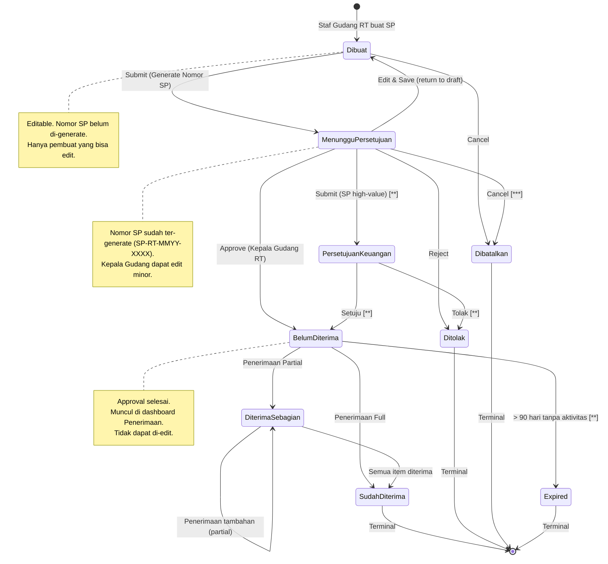
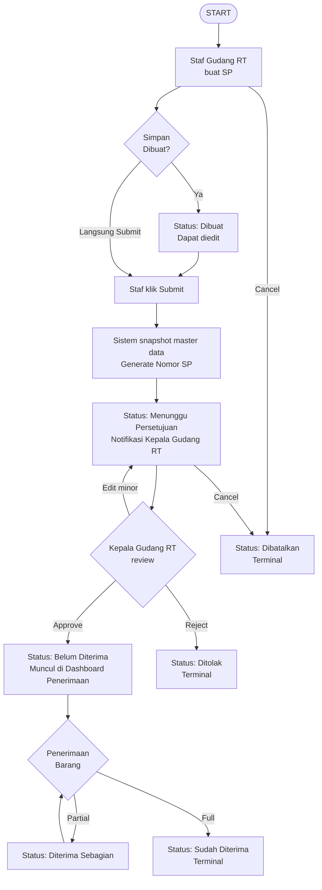
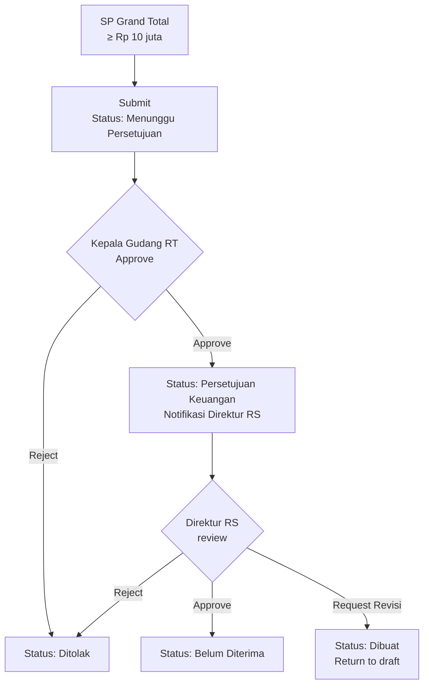

# Product Requirement Document
## Pemesanan Barang — Barang Rumah Tangga

**Related Document:**

| Dokumen | Link |
|---|---|
| PRD Pemisahan SP RJ-RI `[**]` | https://docs.google.com/document/d/1Q_pL3qZNCS6JxVR293rvlEUSbeF79Z_S0E_ufgbC0xM/edit?tab=t.0 |
| Template SP `[**]` | https://docs.google.com/document/d/1ZJvnoVpGlGbBu9f8Kcpk2yX2AqeOlfhs/edit |

**Document Version:**

| Tanggal | Versi | Keterangan |
|---|---|---|
| 12 Juni 2026 | 1.0 | Pembuatan fitur Pemesanan Barang untuk mengelola data Surat Pemesanan pada proses pemesanan barang ke supplier |

**Approval:**

| PRD approved by | Nama/Jabatan | Signature, Date |
|---|---|---|
| [1] | M. Sulthan Farras Nanz — Chief Strategy & Growth Officer, Tamtech International | |

---

**Legend Phase:**

| Simbol | Phase |
|---|---|
| *(tanpa simbol)* | Phase 1 |
| `[**]` | Phase 2 |
| `[***]` | Phase 3 |
| `[****]` | Phase 4 |

---

## 1. Overview / Brief Summary

Fitur **Pemesanan Barang — Barang Rumah Tangga** adalah modul untuk mengelola proses pembuatan, persetujuan, dan pelacakan Surat Pemesanan (SP) barang rumah tangga, ATK, perlengkapan kebersihan, perlengkapan kantor, dan barang non-medis lainnya ke supplier, yang dirancang khusus untuk **RS Tipe C dan Tipe D** di Indonesia.

**Konteks RS Tipe C dan D:**

- **RS Tipe C:** pelayanan medik spesialistik dasar, kapasitas 100–200 tempat tidur, umumnya RS daerah/swasta tingkat kabupaten.
- **RS Tipe D:** pelayanan medik dasar, kapasitas < 100 tempat tidur.
- Karakteristik operasional: struktur organisasi lebih ramping dibanding RS Tipe A/B. Bagian Logistik & Umum sering merged.
- Volume transaksi: 30–100 SP/bulan untuk RT, dengan nilai per-SP yang bisa lebih besar untuk barang capex.

**Karakteristik khusus Barang Rumah Tangga (berbeda dari Farmasi & Gizi):**

- Cakupan barang sangat luas (ATK, cleaning supplies, linen, perabot, elektronik, perlengkapan umum RS).
- Tidak ada regulated supplier — tidak butuh sertifikasi khusus seperti PBF di Farmasi.
- `[**]` Tracking garansi & warranty untuk barang elektronik dan high-value items (Phase 2).
- Asset tracking untuk barang non-consumable yang masuk kategori inventaris RS.
- Quality check at delivery: verifikasi spesifikasi detail (merk, model, ukuran, kondisi fisik) saat penerimaan.
- **Tidak ada** workflow khusus seperti NPP, APJ approval, atau Formularium — workflow procurement standar.
- **Tidak ada** validasi compliance regulasi farmasi (tidak applicable untuk RT).

**Penyesuaian fitur untuk RS Tipe C/D:**

- Struktur Unit Gudang sederhana: hanya 2 role — Staf Gudang RT dan Kepala Gudang RT.
- Approval flow **1-tier**: Staf Gudang RT → Kepala Gudang RT (FINAL approver).
- `[**]` Untuk SP high-value (≥ Rp 10 juta atau threshold konfigurasi): eskalasi opsional ke Direktur RS (Phase 2).
- Tidak ada validasi CDOB, Formularium, NPP, ED at delivery, cold chain — tidak applicable untuk Barang Rumah Tangga.

**Ruang lingkup penerapan:**

- RS Tipe C dan D yang menggunakan SIMRS Neurovi.
- Pemesanan barang dengan kategori Rumah Tangga (ATK, cleaning supplies, linen, perabot, elektronik kantor, perlengkapan umum RS).
- Role yang diberikan akses: Staf Gudang Rumah Tangga (pembuat), Kepala Gudang Rumah Tangga (approver FINAL), Direktur RS (eskalasi untuk high-value).
- Sumber dana: APBD/APBN (RS pemerintah) atau Operasional RS (RS swasta), bukan klaim BPJS/asuransi.

---

## 2. Background

Pengadaan barang rumah tangga di RS adalah proses operasional yang volume tinggi tapi nilai per item bervariasi. Untuk RS Tipe C dan D dengan struktur organisasi yang ramping, workflow procurement yang terlalu kompleks akan membebani operasional.

**Pain point kondisi saat ini (manual/sistem lama):**

- Pembuatan SP manual dengan typewriter/Excel/Word — sering ada typo dan inkonsistensi terutama untuk spesifikasi detail (merk, model, kapasitas).
- Tidak ada visibility ke stok current saat order — sering terjadi over-stock atau order duplicate untuk barang yang masih tersedia.
- Tracking garansi & warranty manual dengan Excel/buku catatan — klaim warranty sering terlewat.
- Audit trail lemah: saat audit internal atau eksternal, sulit traceback siapa approve apa kapan, terutama untuk barang capex.
- Duplikasi pemesanan: tanpa visibility PO outstanding, sering terjadi pemesanan ganda.
- Tidak ada visibility status: Staf sering follow-up status SP via telepon ke supplier atau cek arsip manual.
- Specification mismatch saat penerimaan: barang yang datang tidak sesuai spek karena SP tidak detail.
- Audit STARKES & internal audit sulit karena dokumen tersebar di berbagai unit.

**Pertimbangan khusus RS Tipe C/D:**

- Tim Gudang Rumah Tangga kecil (2–5 orang): 1 Kepala Gudang RT + 1–4 Staf Gudang RT. Kadang Kepala Gudang RT merangkap Kepala Logistik Umum.
- Resource IT terbatas — sistem harus simple, intuitif, dan minimal training.
- Budget terbatas: tidak ada Manajer Logistik dan Manajer Keuangan terpisah — fungsi merged ke Direktur RS dan Bagian Administrasi.
- Mix barang RT: 70% consumable rutin (ATK, cleaning) + 30% capex/asset (elektronik, perabot) — butuh handling berbeda.

**Target kondisi setelah implementasi:**

- Workflow sederhana 1-tier yang efisien sesuai konteks RS Tipe C/D.
- Audit trail lengkap untuk akreditasi STARKES dan audit internal RS.
- Governance procurement yang baik melalui snapshot master data dan eskalasi approval untuk SP high-value.
- Specification accuracy melalui detail spesifikasi barang saat order untuk hindari mismatch di penerimaan.

---

## 3. In Scope

### Scope Definition

| No | Scope / Area | Phase |
|---|---|---|
| 1 | Dashboard Pemesanan Barang Rumah Tangga dengan filter & search | Phase 1 |
| 2 | Buat Surat Pemesanan (SP) baru | Phase 1 |
| 3 | Edit Surat Pemesanan | Phase 1 |
| 4 | Lihat Detail SP (read-only untuk status yang sudah Approved) | Phase 1 |
| 5 | State Machine dengan 8 status (Dibuat, Menunggu Persetujuan, Belum Diterima, Diterima Sebagian, Sudah Diterima, Ditolak, Dibatalkan, Expired) | Phase 1 |
| 6 | Snapshot Master Data (Barang, Supplier, Harga) saat SP submit | Phase 1 |
| 7 | Workflow approval 1-tier: Staf Gudang RT → Kepala Gudang RT FINAL | Phase 1 |
| 8 | Cetak SP dalam format PDF resmi RS | Phase 1 |
| 9 | Batalkan SP | Phase 1 |
| 10 | Audit Trail / Riwayat Aktivitas | Phase 1 |
| 11 | Drag and Drop List Barang Pemesanan | Phase 1 |
| 12 | `[**]` Spesifikasi barang detail (merk, model, kondisi, kapasitas) saat tambah item | Phase 2 |
| 13 | `[**]` Konfirmasi Penerimaan langsung dari Detail SP (shortcut UX) | Phase 2 |
| 14 | `[**]` Eskalasi otomatis ke Direktur RS untuk SP high-value (≥ Rp 10 juta atau threshold konfigurasi) | Phase 2 |
| 15 | `[**]` Tracking garansi & warranty untuk barang elektronik | Phase 2 |
| 16 | `[**]` Asset tracking dengan serial number untuk barang capex | Phase 2 |
| 17 | `[**]` Quality Check checklist saat penerimaan barang RT | Phase 2 |
| 18 | `[**]` Export data SP ke Excel/CSV | Phase 2 |
| 19 | `[**]` Notifikasi push & email untuk approval & status change | Phase 2 |
| 20 | `[**]` Integrasi otomatis dengan modul Rencana Pengadaan | Phase 2 |
| 21 | `[**]` Validasi PO outstanding (warning jika sudah ada PO untuk barang yang sama) | Phase 2 |
| 22 | `[**]` Persetujuan Keuangan untuk SP bernilai besar | Phase 2 |
| 23 | `[***]` Dashboard Visual untuk analisis pemesanan (trend, supplier performance) | Phase 3 |
| 24 | `[***]` Riwayat Transaksi terkonsolidasi per supplier | Phase 3 |
| 25 | `[***]` Reminder otomatis untuk barang yang masuk masa garansi habis | Phase 3 |
| 26 | `[****]` Vendor scoring & auto-recommendation supplier | Phase 4 |
| 27 | `[****]` Integrasi E-Catalog LKPP untuk RS BLU/Pemerintah | Phase 4 |

### Out Scope

| No | Scope |
|---|---|
| 1 | Pemesanan Barang Farmasi (PRD terpisah — regulasi NPP, APJ, Formularium, CDOB tidak applicable untuk RT) |
| 2 | Pemesanan Barang Gizi (PRD terpisah) |
| 3 | Modul Rencana Pengadaan (PRD terpisah, akan terintegrasi di Phase 2) |
| 4 | Modul Penerimaan Barang (PRD terpisah, integrasi via API) |
| 5 | Modul Keuangan (Persediaan & Pembayaran) — integrasi via API only |
| 6 | Pembayaran DP / Down Payment ke supplier (handled by Modul Keuangan) |
| 7 | Workflow APJ approval, Formularium, NPP — tidak applicable untuk RT |
| 8 | Negosiasi harga dengan supplier (manual offline) |
| 9 | Kontrak supplier jangka panjang (handled by Modul Master Supplier) |
| 10 | Modul Manajemen Aset/Inventaris (lifecycle management barang capex) — integrasi di Phase 3 |
| 11 | Klaim garansi/warranty ke supplier (manual offline; sistem hanya tracking) |
| 12 | Multi-currency procurement (default Rupiah saja) |
| 13 | Workflow Manajer Logistik & Manajer Keuangan terpisah — di RS Tipe C/D fungsi merged ke Kepala Gudang & Direktur RS |
| 14 | Integrasi E-Katalog LKPP (Phase 4, hanya untuk RS BLU) |
| 15 | Auction / tender otomatis dengan multiple supplier |

---

## 4. Goals and Metrics

**Goals:**

- Memudahkan Staf Gudang Rumah Tangga membuat, mencetak, dan memantau SP dengan workflow yang disesuaikan dengan struktur RS Tipe C/D yang ramping.
- Memastikan governance procurement yang baik melalui audit trail lengkap, snapshot master data, dan eskalasi approval untuk SP high-value.
- Mengintegrasikan data dengan Rencana Pengadaan, Penerimaan Barang, dan Keuangan untuk menghindari duplikasi & inkonsistensi.
- Mempercepat proses approval 1-tier yang efisien dengan SLA jelas untuk Kepala Gudang Rumah Tangga.
- `[**]` Mendukung tracking garansi & warranty untuk barang elektronik high-value sehingga klaim warranty tidak terlewat.
- Menjamin specification accuracy melalui detail spesifikasi barang (merk, model, kondisi) saat order untuk hindari mismatch di penerimaan.

**Metrics:**

| No | Metric | Success Criteria |
|---|---|---|
| 1 | Akurasi Data Antar Modul | 100% data SP konsisten dengan Rencana, Penerimaan, dan Persediaan; selisih < 1% |
| 2 | Transparansi Audit Trail | 100% transaksi SP tercatat dengan field: user, role, action, before-after, timestamp, IP |
| 3 | Waktu Pembuatan SP | Staf dapat membuat & submit SP dengan ≤ 30 items dalam ≤ 5 menit |
| 4 | Waktu Approval Kepala Gudang (P95) | P95 ≤ 4 jam untuk SP Normal; ≤ 1 jam untuk Urgent; ≤ 30 menit untuk Cito |
| 5 | Waktu Cetak SP | PDF SP dapat di-download/cetak dalam ≤ 30 detik setelah Approved |
| 6 | Reduction in Order Errors | Reduksi error pemesanan (typo, spec mismatch) minimum 70% dari baseline manual |
| 7 | Penghematan Waktu Operasional | Reduksi waktu admin pengadaan dari rata-rata 1.5 jam/SP (manual) menjadi ≤ 15 menit/SP |
| 8 | Specification Accuracy | Reduksi mismatch saat penerimaan barang dari baseline minimum 80% |
| 9 | Budget Compliance | 100% SP > Rp 10 juta mendapat warning budget; SP > threshold dieskalasi ke Direktur RS (Phase 2) |
| 10 | Warranty Tracking | `[**]` Phase 2: 100% barang elektronik dengan garansi tercatat di sistem dengan reminder otomatis |

---

## 5. Related Feature

| Module | Feature | Integration Detail |
|---|---|---|
| Master Data | Barang Rumah Tangga | Sumber data master barang: nama, kode, kategori RT (ATK, cleaning, linen, perabot, elektronik), spesifikasi default (merk, model, kapasitas), satuan, preferred supplier, harga referensi, is_capex flag |
| Master Data | Unit | Menentukan gudang tujuan pemesanan |
| Master Data | Supplier | Sumber data supplier: nama, status aktif, kategori (general merchandise, elektronik, ATK, dll), lead_time, payment_terms, bank info |
| Master Data | User & Role | Untuk RBAC: role Staf Gudang Rumah Tangga, Kepala Gudang Rumah Tangga, Direktur RS, Auditor |
| Inventory | Rencana Pengadaan | Phase 2: generate SP otomatis dari Rencana yang Approved. Phase 1: manual reference Nomor Rencana di field optional |
| Inventory | Penerimaan Barang | Downstream: SP Approved muncul di dashboard Penerimaan. Saat Penerimaan disimpan, status SP auto-update ke Diterima Sebagian / Sudah Diterima |
| `[**]` Inventory | Manajemen Aset (Phase 3) | Untuk barang capex/asset: auto-create asset record setelah Penerimaan. Tracking lifecycle, depresiasi, garansi |
| Keuangan | Persediaan & Pembelian | API ke Modul Keuangan: validasi budget (warning only); commit budget saat SP Approved |

---

## 6. Business Process

### A. As-Is (Kondisi Saat Ini — Manual)

- Staf Gudang Rumah Tangga mengetik SP manual di Word/Excel/dokumen fisik.
- Data barang, supplier, dan harga diinput berulang kali — sering ada typo dan inkonsistensi terutama untuk spesifikasi detail (merk, model, kapasitas).
- Spesifikasi barang tidak cukup detail di SP → sering mismatch saat penerimaan.
- Tracking garansi & warranty manual dengan Excel/buku catatan → klaim sering terlewat.
- Approval routing manual: SP di-print, dijalankan dari meja Staf ke meja Kepala Gudang.
- Tidak ada visibility status: Staf tidak tahu SP stuck di approver mana.
- Audit trail sulit: saat audit internal/eksternal, harus cari arsip fisik SP yang tercecer.
- Duplikasi pemesanan sering terjadi karena tidak ada visibility PO outstanding.
- Tidak ada eskalasi otomatis untuk SP high-value (capex) — sering bypass approval Direktur RS.

### B. To-Be (Kondisi yang Diharapkan dengan Fitur Pemesanan RT)

- Staf Gudang Rumah Tangga buka menu Inventaris → Pemesanan Barang Rumah Tangga.
- Dashboard menampilkan list SP dengan filter status, supplier, daterange, dan search by nomor SP.
- Klik tombol [+] untuk Buat SP baru.
- Form Tambah SP: pilih Supplier (filter: status aktif), tambah items dengan auto-fill spesifikasi & harga referensi.
- Staf klik Simpan Dibuat → SP tersimpan dengan status "Dibuat" dan masih dapat diedit.
- Staf klik Submit → Sistem snapshot master data, generate Nomor SP unik (format SP-RT-MMYY-XXXX). Status → "Menunggu Persetujuan". Notifikasi otomatis ke Kepala Gudang RT.
- Kepala Gudang RT buka SP, validasi kebutuhan & qty & spesifikasi. Approve atau reject dengan alasan.
- `[**]` Untuk SP high-value (≥ Rp 10 juta, Phase 2): otomatis route ke Direktur RS untuk approval kedua.
- Setelah approve → Status → "Belum Diterima". SP otomatis muncul di Dashboard Penerimaan Barang.
- Staf cetak SP PDF untuk dikirim ke supplier.
- `[**]` Untuk barang elektronik: saat penerimaan, sistem prompt input serial number & masa garansi untuk tracking (Phase 2).
- Setelah barang diterima via modul Penerimaan: status SP auto-update ke "Diterima Sebagian" atau "Sudah Diterima".

---

## 7. Main Flow / State Diagram

### State Machine — Alur Status SP Rumah Tangga

### Alur Approval Normal (Phase 1 — 1-Tier)

### `[**]` Alur Eskalasi SP High-Value (Phase 2)

### Role & Otorisasi

| Role | Buat Dibuat | Submit | Edit Dibuat | Edit Submitted | Approve KG | Batal | Lihat | Cetak |
|---|---|---|---|---|---|---|---|---|
| Staf Gudang Rumah Tangga | ✓ | ✓ | ✓ | ✗ | ✗ | ✓ (own SP, sebelum approved) | ✓ (own SP) | ✓ |
| Kepala Gudang Rumah Tangga | ✓ | ✓ | ✓ | ✓ (during approval) | ✓ | ✓ (any SP Gudang, justifikasi) | ✓ (semua SP Gudang) | ✓ |
| Direktur RS / Manajemen | ✗ | ✗ | ✗ | ✗ | ✓ (SP high-value, Phase 2) | ✓ (emergency override) | ✓ (semua) | ✓ |
| Auditor Internal | ✗ | ✗ | ✗ | ✗ | ✗ | ✗ | ✓ (read-only) | ✓ (read-only) |

**Catatan struktur organisasi:**
- Unit Gudang RT memiliki struktur sederhana: Staf Gudang RT dan Kepala Gudang RT.
- Tidak ada Manajer Logistik terpisah — fungsi merged ke Kepala Gudang RT. Eskalasi nilai besar ke Direktur RS.
- Tidak ada Manajer Keuangan dalam workflow approval default — validasi budget hanya sebagai warning.
- Tidak ada APJ dalam workflow RT karena tidak ada compliance kefarmasian.
- Kepala Gudang Rumah Tangga adalah **FINAL APPROVER** untuk SP RT default (1-tier approval).

---

## 8. Requirement

**User Story Utama:**
> Sebagai Admin Gudang Rumah Tangga, saya dapat mengelola data pemesanan barang ke supplier, agar proses pemesanan barang menjadi lebih efisien, transparan, dan akuntabel.

### User Stories Detail

| Kode | User Story | Priority |
|---|---|---|
| US-001 | Sebagai Admin Gudang Rumah Tangga, saya ingin melihat dashboard daftar Surat Pemesanan (SP) dengan filter dan search, agar data SP bisa terpantau dengan baik. | P0 |
| US-002 | Sebagai Admin Gudang Rumah Tangga, saya ingin membuat Surat Pemesanan (SP) baru, agar pemesanan barang RT ke supplier dapat dilakukan secara digital. | P0 |
| US-003 | Sebagai Staf Gudang Rumah Tangga, saya ingin menyimpan SP sebagai Draft (status Dibuat), agar saya dapat melengkapi data sebelum submit. | P0 |
| US-004 | Sebagai Staf Gudang Rumah Tangga, saya ingin submit SP untuk approval, agar SP dapat diproses oleh Kepala Gudang RT. | P0 |
| US-005 | Sebagai Kepala Gudang Rumah Tangga, saya ingin mereview, menyetujui, atau menolak SP RT sebagai final approver, agar memastikan kebutuhan & spesifikasi barang sesuai operasional gudang. | P0 |
| US-006 | Sebagai Admin Gudang Rumah Tangga, saya ingin mengedit SP dengan status Dibuat atau Menunggu Persetujuan, agar data SP dapat disesuaikan kembali. | P0 |
| US-007 | Sebagai Admin Gudang Rumah Tangga, saya ingin melihat detail SP yang sudah Approved/Ditolak/Dibatalkan dalam mode read-only, agar saya dapat memantau status pemesanan. | P1 |
| US-008 | Sebagai pembuat atau approver, saya ingin membatalkan SP dengan justifikasi, agar SP yang tidak relevan dapat di-void tanpa menghapus history. | P1 |
| US-009 | Sebagai Admin Gudang, saya ingin mencetak SP dalam format PDF resmi RS, agar pihak di luar Gudang dapat melihat tanpa mengakses sistem. | P1 |
| US-010 | Sebagai admin dan user gudang, saya ingin melihat riwayat aktivitas dan keterkaiatan dokumen SP dengan dokumen lain (Penerimaan, Pembayaran DP, dll), agar history lengkap dapat ditelusuri. | P3 |
| US-011 | `[**]` Sebagai Admin Gudang Rumah Tangga, saya ingin melakukan konfirmasi Penerimaan langsung dari halaman Detail SP, agar tidak perlu membuka menu Penerimaan terpisah. | P2 |
| US-012 | `[**]` Sebagai Direktur RS, saya ingin mereview & menyetujui SP RT yang bernilai besar (≥ Rp 10 juta), agar governance procurement untuk capex/asset tetap terjaga. | P2 |
| US-013 | `[**]` Sebagai Admin Gudang Rumah Tangga, saya ingin mencatat informasi garansi & warranty saat penerimaan barang elektronik, agar klaim warranty tidak terlewat. | P2 |

### Functional Requirements

| Kode | Fitur | User Story | Acceptance Criteria |
|---|---|---|---|
| FR1 | Dashboard Pemesanan Barang Rumah Tangga | US-001 | **AC 1:** Dashboard load ≤ 2 detik untuk 500 records dengan pagination. **AC 2:** Filter: daterange Tanggal Pemesanan (default 30 hari terakhir), Nama Supplier (dropdown multi-select), Status SP (multi-select). **AC 3:** Search by Nomor SP, Nama Supplier — real-time dengan debounce 300ms. **AC 4:** Default sort: Nomor SP descending (terbaru di atas). **AC 5:** Setiap kolom dapat diklik untuk sorting ascending/descending. **AC 6:** Color coding status: Dibuat (abu), Menunggu Persetujuan (kuning), Belum Diterima (biru), Diterima Sebagian (hijau muda), Sudah Diterima (hijau), Ditolak/Dibatalkan (merah). **AC 7:** Kolom Aksi conditional: Detail (semua status), Edit (Dibuat/Menunggu Persetujuan only), Cetak SP (Approved+), Batal (sesuai matriks), `[**]` Konfirmasi Penerimaan (Belum Diterima/Diterima Sebagian). **AC 8:** Visibility per role: Staf Gudang RT hanya lihat SP yang dia buat; Kepala Gudang & Auditor lihat semua SP RT. **AC 9:** Tidak menampilkan SP barang selain Rumah Tangga. |
| FR2 | Tambah Pemesanan | US-002, US-003 | **AC 1:** Sistem real-time kalkulasi Sub Total = Qty × Harga. **AC 2:** Sistem tidak mengizinkan Qty dan Harga ≤ 0 atau minus. **AC 3:** Tombol "Simpan Dibuat" tidak memvalidasi mandatory field (kecuali Supplier). **AC 4:** Tombol "Submit" memvalidasi seluruh mandatory field. **AC 5:** `[**]` Grand Total = Sum(Sub Total) + PPN. **AC 6:** Sistem menyimpan kategori sebagai "RUMAH_TANGGA" hardcoded berdasarkan menu. **AC 7:** Tiap baris dapat dipindahkan melalui Drag and Drop. **AC 8:** Visibility per user: user yang login sebagai Admin Gudang RT hanya bisa melihat pemesanan barang Gudang RT. |
| FR3 | Submit SP | US-004 | **AC 1:** Tombol Submit aktif hanya bila semua mandatory field terisi & valid. **AC 2:** Dialog konfirmasi: "Submit SP ini untuk approval?" **AC 3:** Sistem snapshot master data saat submit: nama supplier, nama barang, satuan, harga referensi, spesifikasi default — stored di JSONB snapshot_master_data. **AC 4:** Generate Nomor SP final saat submit. Format: SP-RT-MMYY-XXXX. Counter reset bulanan. UNIQUE global. **AC 5:** Status berubah Dibuat → Menunggu Persetujuan. **AC 6:** `[**]` Notifikasi otomatis ke Kepala Gudang RT (in-app Phase 1; email & push Phase 2). **AC 7:** Validasi pre-submit: warning jika total > sisa budget; warning jika ada PO outstanding untuk barang yang sama dalam 30 hari terakhir. **AC 8:** Audit trail: SP_SUBMITTED dengan user, timestamp, IP. **AC 9:** Redirect ke Dashboard dengan SP baru highlighted di atas. |
| FR4 | Approval / Reject SP | US-005 | **AC 1:** Kepala Gudang RT dapat lihat semua SP status Menunggu Persetujuan di dashboard (filter default). **AC 2:** Detail SP menampilkan: header info, items dengan spesifikasi detail, total nilai, pembuat info. **AC 3:** Kepala Gudang dapat edit minor (qty, satuan, harga, spesifikasi) sebelum approve, dengan justifikasi. **AC 4:** Edit oleh Kepala Gudang dicatat audit: "Edited by Kepala Gudang: field X dari Y ke Z". **AC 5:** Approve: konfirmasi dialog. Status → Belum Diterima. Otomatis appear di Dashboard Penerimaan. **AC 6:** Reject: dialog dengan input mandatory "Alasan Penolakan" (min 20 char). Status → Ditolak. **AC 7:** Audit trail: APPROVED / REJECTED dengan user_id, alasan, timestamp. **AC 8:** `[**]` Untuk SP high-value (≥ Rp 10 juta, Phase 2): setelah Kepala Gudang approve, route ke Direktur RS untuk approval kedua. |
| FR5 | Edit Pemesanan | US-006 | **AC 1:** Staf Gudang RT (pembuat): dapat edit SP status Dibuat & Menunggu Persetujuan. **AC 2:** Kepala Gudang RT: dapat edit SP selama status Menunggu Persetujuan. **AC 3:** Audit trail untuk setiap edit: action, field name, before-after, user, timestamp. **AC 4:** `[**]` Auto-save draft setiap 30 detik (Phase 2). **AC 5:** Concurrent edit detection: optimistic locking dengan version field. Konflik: prompt merge. |
| FR6 | Detail Pemesanan | US-007 | **AC 1:** Section header SP (read-only untuk Belum Diterima+). **AC 2:** Section Items: tabel items & subtotal dengan spesifikasi detail. **AC 3:** `[**]` Section Penerimaan Barang: list Nomor Faktur, Tanggal Penerimaan, Status. Multiple data untuk Diterima Sebagian. **AC 4:** Tombol Cetak SP di bottom (aktif untuk Approved+, hidden untuk Dibuat & Ditolak). **AC 5:** `[**]` Tombol Konfirmasi Penerimaan: aktif untuk Belum Diterima & Diterima Sebagian. **AC 6:** Tombol Batal: aktif sesuai matriks role/status. |
| FR7 | Batal Pemesanan | US-008 | **AC 1:** Staf Gudang RT (pembuat): dapat Batal SP status Dibuat & Menunggu Persetujuan (sebelum Kepala Gudang action). **AC 2:** Kepala Gudang RT: dapat Batal SP status Menunggu Persetujuan atau `[**]` Menunggu Persetujuan Direktur. **AC 3:** TIDAK boleh Batal: status Diterima Sebagian, Sudah Diterima. **AC 4:** Dialog Batal: "Yakin batal SP ini? Aksi ini tidak dapat di-undo." + textarea "Alasan Pembatalan" (mandatory, min 100 char). **AC 5:** Setelah Batal: status → Dibatalkan (terminal). **AC 6:** Audit trail: CANCELLED dengan user, role, alasan, timestamp. |
| FR8 | Cetak SP | US-009 | **AC 1:** Tombol Cetak SP pada Detail SP dengan status Belum Diterima. **AC 2:** Tombol Cetak SP pada kolom Aksi Dashboard dengan status Belum Diterima. **AC 3:** Format cetak SP sesuai format resmi sistem RS. **AC 4:** File terunduh ke internal storage device user. **AC 5:** File berformat PDF. |
| FR9 | Riwayat Aktivitas | US-010 | **AC 1:** Riwayat aktivitas ditampilkan untuk setiap dokumen pemesanan. **AC 2:** Data terintegrasi jika tautkan pada: Penerimaan Barang (No Faktur), Pembayaran DP (No Pembayaran DP), Pembayaran Tagihan (No Transaksi Pembayaran), Retur Pembelian (No Transaksi Retur). **AC 3:** Aktivitas tercatat sesuai action user. |
| FR10 | `[**]` Konfirmasi Penerimaan dari Detail SP | US-011 | **AC 1:** Tombol Konfirmasi Penerimaan aktif untuk status Belum Diterima atau Diterima Sebagian. **AC 2:** Klik: navigate ke halaman Penerimaan Barang dengan konteks SP ter-prefill. **AC 3:** Status SP auto-update: qty_received ≥ qty_ordered → Sudah Diterima; qty_received < qty_ordered → Diterima Sebagian. |
| FR11 | `[**]` Eskalasi Approval SP High-Value | US-012 | **AC 1:** Threshold default: Rp 10 juta (configurable per RS). **AC 2:** Setelah Kepala Gudang RT approve SP dengan grand_total ≥ threshold: status → Persetujuan Keuangan. **AC 3:** Direktur RS menerima notifikasi (email + in-app). **AC 4:** Direktur dapat Approve, Reject (dengan alasan), atau Request Revisi (kembalikan ke Dibuat). **AC 5:** Setelah Direktur approve: status → Belum Diterima. **AC 6:** Audit trail dengan Direktur user_id dan timestamp. **AC 7:** SLA Direktur: ≤ 24 jam Normal; ≤ 4 jam Urgent; ≤ 1 jam Cito. |
| FR12 | `[**]` Tracking Garansi & Warranty Barang Elektronik | US-013 | **AC 1:** Fields garansi muncul saat Konfirmasi Penerimaan untuk barang flag is_elektronik = true. **AC 2:** Serial number: mandatory, unique per item. **AC 3:** Tanggal mulai garansi: default tanggal penerimaan, editable. **AC 4:** Durasi garansi: dropdown (6, 12, 24, 36 bulan) atau custom input. **AC 5:** Sistem auto-calculate tanggal akhir garansi. **AC 6:** Phase 3: reminder otomatis 30 hari sebelum garansi habis. **AC 7:** Phase 3: integrasi dengan modul Manajemen Aset untuk lifecycle tracking. |

---

## 9. Data Requirements (Spesifikasi Field)

### A. Dashboard Pemesanan Barang

| No | Field / Kolom | Keterangan |
|---|---|---|
| 1 | Tanggal Pemesanan | Sumber Data: Detail Pemesanan — Tanggal Pemesanan |
| 2 | Nomor SP | Sumber Data: Detail Pemesanan — No. Pemesanan. Format: SP-RT-MMYY-XXXX |
| 3 | Nama Supplier | Sumber Data: Detail Pemesanan — Supplier |
| `[**]` | Total Item | Sum [Total Item Barang] |
| 4 | Perkiraan Biaya | Sumber Data: Detail Pemesanan — Perkiraan Biaya |
| 5 | Status SP | Sesuai State Machine |
| 6 | Aksi | Buttons dihitung berdasarkan role + status: Setuju / Tolak / Detail / Edit / Cetak / Batal / `[**]` Konfirmasi Penerimaan |

### B. Tambah Pemesanan — Section Data Pemesanan (Header)

| No | Field | Tipe | Keterangan |
|---|---|---|---|
| — | Gudang Tujuan | Dropdown (auto-set) | Sumber: Master Data Unit — flag "Gudang". Auto-set ke Gudang RT unit user yang login. Mandatory. Tidak dapat diedit user. |
| 1 | Tanggal Pemesanan | Datepicker | Format: DD/MM/YYYY. Default: hari ini. Tidak boleh backdate. Mandatory. |
| — | Nomor SP | Auto-generated | Format: SP-RT-MMYY-XXXX. Counter reset bulanan. UNIQUE global. Generated saat submit (status → Menunggu Persetujuan). |
| 2 | Nama Supplier | Single Dropdown | Sumber: Master Data Supplier — Nama Supplier (is_aktif = true). Mandatory. |
| — | Perkiraan Biaya | Auto-calculated | = SUM [Sub Total]. Noneditable. Format: Rp 99.999,99. |
| 5 | Keterangan | Text Input | Min: 0 char. Max: 200 char. Optional. |

### B.2. Tambah Pemesanan — Section Data Barang

| No | Field | Tipe | Keterangan |
|---|---|---|---|
| 1 | Nama Barang | Single Dropdown | Sumber: Master Data Barang Rumah Tangga (is_active = true). Format: `<Nama Barang> <Kategori>`. Search by nama barang. Mandatory. |
| 2 | Jumlah Pemesanan | Numerik Input | Min: 0 (tidak boleh 0 atau negatif). Max: 99.999. Boleh desimal. Mandatory. `[**]` Jika ada konfigurasi Kategori SP, field dipecah per kategori (RJ/RI) dengan Total = sum semua kategori. |
| 3 | Satuan | Single Dropdown | Sumber: Master Data Barang RT — Satuan. Mandatory. |
| 4 | Harga | Autofill / Editable | Sumber: Master Data Barang RT — Harga Referensi. Format: Rp 99.999,99. Dapat di-override dengan justifikasi (min 10 char). |
| `[**]` | Diskon | Autofill | Default 0. Dapat di-override per row. |
| 5 | Sub Total | Auto-calculated | = (Jumlah Pemesanan × Harga) − Diskon. Format: Rp 99.999,99. |

### B.3. `[**]` Tambah Pemesanan — Section Form Total

| Field | Keterangan |
|---|---|
| Total | Auto-calculated: Sum [Sub Total] |
| PPN (%) | Checkbox: Jika Cek → 11%; Jika Uncek → 0% |
| Total PPN | Auto-calculated: Total × PPN (%) |
| Grand Total | Auto-calculated: Total + Total PPN |

### C. Update Pemesanan

Detail Data Requirement sama seperti pada point B (Tambah Pemesanan).

### D. Detail Pemesanan

Detail Data Requirement sama seperti pada point B (Tambah Pemesanan), semua field dalam mode read-only.

### E. Approve dan Reject Pemesanan

| Field | Tipe | Keterangan |
|---|---|---|
| Alasan Penolakan | Freetext Input | Min: 0 char. Max: 200 char. Mandatory saat Reject (min 20 char). |

---

## 10. Lampiran / Catatan

### Validasi

| ID | Konteks | Field/Aspek | Rule | Error Message | Trigger |
|---|---|---|---|---|---|
| V.1 | Header SP | Tanggal Pemesanan | Tidak boleh backdate (< today) | *Tanggal pemesanan tidak boleh sebelum hari ini.* | Submit |
| V.2 | Header SP | Tanggal Pemesanan | Tidak boleh > today + 7 hari | *Tanggal pemesanan maksimum 7 hari ke depan.* | Submit |
| V.3 | Header SP | Supplier | is_active = true required | *Supplier tidak aktif. Tidak dapat dipilih.* | Submit |
| V.4 | Header SP | Urgency Cito | Keterangan mandatory min 20 char | *Cito requires justification min 20 characters.* | Submit |
| V.5 | Items | Qty | Min 0.001, Max 999.999 | *Qty tidak valid. Range: 0.001 - 999.999.* | Real-time |
| V.6 | Items | Qty | Tidak boleh 0 atau negatif | *Qty harus > 0.* | Real-time |
| V.7 | Items | Harga Unit | Tidak boleh 0 atau negatif | *Harga harus > 0.* | Real-time |
| V.8 | Items | Duplicate Barang | Tidak boleh duplikat barang dalam satu SP | *Barang sudah ada di SP. Akan otomatis di-merge qty?* | Add Item |
| V.9 | Items | Min 1 row | SP harus berisi minimal 1 item | *SP harus berisi minimal 1 barang.* | Submit |
| V.10 | Items | Max 200 rows | Maksimum 200 items per SP | *SP melebihi 200 items. Pisah menjadi multiple SP.* | Add Item |
| V.11 | Items | Spesifikasi Capex/Elektronik | Mandatory min 30 char untuk barang flag is_capex = true atau is_elektronik = true | *Barang capex/elektronik memerlukan spesifikasi detail minimum 30 karakter.* | Submit |
| V.12 | Items | Override Harga | Justifikasi mandatory min 10 char | *Override harga memerlukan justifikasi minimal 10 karakter.* | Submit |
| V.13 | Budget | Total > Budget | Warning only (tidak blocking) | *Total SP [Rp X] melebihi sisa budget [Rp Y]. Lanjutkan?* | Submit / Approval |
| V.14 | Budget | `[**]` Total ≥ High-Value Threshold | Phase 2: warning eskalasi ke Direktur RS | *SP dengan nilai [Rp X] akan dieskalasi ke Direktur RS untuk approval kedua. Lanjutkan?* | Submit / Approval |
| V.15 | Concurrent Edit | Version Mismatch | Optimistic locking dengan version field | *SP ini telah diubah oleh user lain. Refresh untuk lihat versi terbaru.* | Save |
| V.16 | Status Transition | Invalid Transition | Validate against State Machine rules | *Transisi status tidak valid. Status saat ini: [X], target: [Y].* | Action |
| V.17 | Role Permission | Insufficient Permission | Validate role x action di RBAC matrix | *Anda tidak memiliki permission untuk aksi ini.* | Action |
| V.18 | Editing After Approval | Immutability | SP Approved+ tidak boleh diedit oleh Staf | *SP sudah Approved. Untuk perubahan, batalkan & buat SP baru.* | Edit |
| V.19 | Cancel Restriction | Cannot cancel after partial received | Status Diterima Sebagian / Sudah Diterima tidak boleh dicancel | *SP sudah ada barang yang diterima. Tidak dapat dibatalkan.* | Cancel |
| V.20 | Audit Trail | Mandatory action logging | Semua aksi WAJIB di-log ke audit trail | *(System error — log failed)* | Any Action |

### Edge Cases

| No | Case | Dampak | Mitigasi |
|---|---|---|---|
| C.1 | Supplier dinonaktifkan setelah SP dibuat (Draft) | Pembuat tidak dapat submit | Re-validate Supplier status saat submit. Jika inactive: error, field Supplier di-clear. |
| C.2 | Barang dinonaktifkan setelah SP dibuat (Draft) | Item tidak dapat diprocess | Re-validate item status saat submit. Jika inactive: error per row. |
| C.3 | Harga master berubah setelah SP submit | Inkonsistensi nilai SP | Snapshot harga saat submit (JSONB snapshot_master_data). Penerimaan pakai harga snapshot. |
| C.4 | Kepala Gudang RT tidak available (sakit/cuti) | SP stuck menunggu approval | Sistem support Kepala Gudang Pengganti via SK Penunjukan (master_user). Auto-reroute approval. Audit: "Approved by [Pengganti] as delegate of [Kepala Gudang utama]". |
| C.5 | Network failure saat submit | Data partial saved | Transactional save: rollback jika gagal. Idempotency key untuk hindari double-submit. |
| C.6 | Concurrent edit oleh 2 user | Data loss | Optimistic locking dengan version field. Konflik: prompt "Lihat changes / Overwrite / Cancel". |
| C.7 | SP untuk barang yang ada PO outstanding | Double stock; risk over-stock barang space-consuming | Warning di submit: "Sudah ada PO outstanding [Nomor] untuk barang [X] dengan qty [Y]. Lanjutkan?" Phase 2: blocking. |
| C.8 | Spesifikasi barang capex/elektronik tidak detail | Mismatch saat penerimaan | Validasi V.11: mandatory spesifikasi min 30 char untuk barang flag is_capex/is_elektronik. |
| C.9 | Pemesanan emergency Cito jam non-working hours | Kepala Gudang tidak available; SLA breach | Phase 1: log pending. Phase 2: WhatsApp/SMS alert ke Kepala Gudang on-call. Phase 3: override Direktur RS. |
| C.10 | SP di-submit duplikat (klik 2x cepat) | 2 SP duplikat | Idempotency key di backend; tombol submit disabled setelah klik sampai response. |
| C.11 | Master Supplier inactive di tengah workflow | SP tidak dapat ditrack | Cancel SP otomatis bila supplier inactive > 24 jam selama approval. Notify pembuat & approver. |
| C.12 | Penerimaan partial mismatch dengan SP | Stok tidak balance | Modul Penerimaan handle: qty_received ≠ qty_ordered → status SP → Diterima Sebagian. |
| C.13 | User role berubah di tengah workflow | Approval pending tidak valid | Re-validate role di setiap action. Jika role berubah: pending approval di-clear, notify re-assign. |
| C.14 | `[**]` SP high-value tapi Direktur RS tidak available (Phase 2) | SP capex stuck | SK Penunjukan Wakil Direktur. Reroute ke Wadir otomatis. SLA tracking dengan alert. |
| C.15 | `[**]` Barang elektronik tiba tanpa serial number atau garansi | Warranty tracking gagal | Phase 2: validasi mandatory serial number & garansi saat penerimaan untuk barang is_elektronik. Block penerimaan jika tidak lengkap. |
| C.16 | `[**]` SP > 90 hari tanpa Penerimaan | Stale data | Phase 2: auto-expire ke status Expired. Notify pembuat, Kepala Gudang. |
| C.17 | Mismatch spesifikasi yang diterima vs SP | Barang received tidak sesuai spek yang dipesan | Modul Penerimaan: warning + Kepala Gudang dapat reject penerimaan atau accept dengan justifikasi. |
| C.18 | Format Nomor SP collision (race condition) | 2 SP nomor sama | Generate dengan DB sequence (atomic). Unique constraint di DB. Retry dengan increment jika collision. |
| C.19 | PDF generation timeout | User tidak dapat download SP | Async generation: queue job. Notify user via in-app saat ready. Retry mechanism. |
| C.20 | Audit log storage full | Aksi gagal karena audit log tidak bisa write | Monitoring + alert. Auto-archive audit log lama (> 1 tahun) ke cold storage. Tidak boleh continue without audit. |
| C.21 | RS Tipe D dengan Kepala Gudang RT merangkap Staf | Tidak ada role separation | Phase 1: tetap support skenario ini; Direktur RS sebagai second-tier untuk SP high-value. Audit trail tetap detail. |
| C.22 | SP untuk barang impor dengan harga fluktuasi tinggi | Harga di SP berbeda jauh saat barang tiba | Phase 2: field "Harga Estimasi" vs "Harga Final" di penerimaan. Toleransi delta default 10%, di luar itu butuh approval ulang Kepala Gudang. |
| C.23 | Barang RT yang di-order ternyata obsolete / discontinued | Supplier tidak bisa supply | Pembuat dapat cancel SP dengan reason "Barang discontinued". Update master_barang.is_active = false. |

### Compliance & Regulatory Notes

| Regulasi | Ringkasan Aturan | Implementasi di Fitur | Tingkat Compliance |
|---|---|---|---|
| UU 36/2009 tentang Kesehatan | Mengatur pelayanan kesehatan umum termasuk penyediaan logistik & sarana prasarana RS. | Fitur mendukung ketersediaan barang RT untuk operasional RS (cleaning, ATK, perlengkapan kantor) yang menunjang pelayanan kesehatan. | **HIGH** |
| Permenkes 3/2020 tentang Klasifikasi RS | RS Tipe C/D dengan struktur organisasi yang lebih ramping. | PRD disesuaikan untuk RS Tipe C/D: 1-tier approval (Kepala Gudang RT FINAL) tanpa Manajer Logistik & Manajer Keuangan terpisah. | **INFO** |
| STARKES — Standar Akreditasi RS Indonesia | Standar Tata Kelola RS termasuk Tata Kelola Logistik & Manajemen Fasilitas (MFK). | (1) Full audit trail dengan retention 5 tahun. (2) Compliance reporting untuk procurement governance. (3) Asset tracking untuk barang capex (Phase 3) mendukung MFK. | **CRITICAL** |
| UU 8/1999 tentang Perlindungan Konsumen | Mengatur hak konsumen termasuk garansi/warranty barang. RS sebagai konsumen institusional berhak atas garansi yang dijanjikan supplier. | Tracking garansi & warranty (Phase 2) untuk klaim warranty yang efektif. | **HIGH** |
| PP 47/2021 tentang Penyelenggaraan Bidang Perumahsakitan | Detail penyelenggaraan RS termasuk pengelolaan logistik & manajemen rantai pasok. | PRD mendukung pengelolaan logistik RT yang terstandarisasi dengan audit trail lengkap. | **HIGH** |
| Permenkes 11/2017 tentang Keselamatan Pasien | Pengelolaan fasilitas & lingkungan RS yang aman, termasuk kebersihan & sanitasi. | Penyediaan barang RT (cleaning supplies, perlengkapan sanitasi) yang adekuat menunjang keselamatan pasien & petugas. | **HIGH** |
| Perpres 12/2021 tentang Pengadaan Barang/Jasa Pemerintah (untuk RS BLU) | Mengatur pengadaan untuk RS BLU/Pemerintah melalui E-Katalog LKPP dan mekanisme tender. | Phase 4: integrasi E-Katalog LKPP. Hanya untuk RS BLU/Pemerintah. | **HIGH (Phase 4, untuk RS BLU)** |
| Standar Internal RS — Tata Kelola Logistik | Standar internal masing-masing RS untuk procurement governance: approval matrix, SLA, budget control. | Fitur mendukung implementasi standar internal RS dengan workflow approval yang configurable per RS. | **INFO** |

### Rancangan Tabel Database (Developer Reference)

**Tabel `purchase_orders` — Header Surat Pemesanan**

| Nama Kolom | Tipe Data | Nullable | Notes |
|---|---|---|---|
| id | uuid | FALSE | Primary Key |
| po_number | varchar(50) | FALSE | Unique. Generate otomatis. Format: SP-RT-MMYY-XXXX |
| po_category | varchar(10) | FALSE | Value: "RJ", "RI", atau "RUMAH_TANGGA" |
| supplier_id | uuid | FALSE | FK ke tabel master supplier |
| warehouse_id | uuid | FALSE | FK ke tabel master unit (flag gudang) |
| po_date | date | FALSE | Tanggal pemesanan dibuat |
| status | varchar(30) | FALSE | Enum: 'DRAFT', 'WAITING_APPROVAL', 'APPROVED', 'PARTIAL_RECEIVED', 'FULL_RECEIVED', 'REJECTED', 'CANCELLED' |
| subtotal | numeric(15,2) | FALSE | Total harga barang sebelum diskon/pajak |
| discount_global | numeric(15,2) | FALSE | Diskon total nominal rupiah (Default 0) |
| tax_ppn | numeric(15,2) | FALSE | Nominal PPN (Default 0) |
| additional_cost | numeric(15,2) | FALSE | Biaya tambahan/ongkir (Default 0) |
| grand_total | numeric(15,2) | FALSE | = subtotal − discount_global + tax_ppn + additional_cost |
| notes | text | TRUE | Keterangan pemesanan |
| reject_reason | text | TRUE | Diisi jika status = 'REJECTED' |
| cancel_reason | text | TRUE | Diisi jika status = 'CANCELLED' |
| approved_by | uuid | TRUE | ID Kepala Gudang yang menyetujui |
| approved_at | timestamp | TRUE | Waktu persetujuan |
| created_by | varchar(255) | FALSE | |
| created_at | timestamp | FALSE | Default NOW() |

**Tabel `purchase_order_items` — Detail Barang Pemesanan**

| Nama Kolom | Tipe Data | Nullable | Notes |
|---|---|---|---|
| id | uuid | FALSE | Primary Key |
| purchase_order_id | uuid | FALSE | FK ke purchase_orders.id (ON DELETE CASCADE) |
| item_id | uuid | FALSE | FK ke master data barang RT |
| unit_id | uuid | FALSE | FK ke master data satuan |
| qty_ordered | int | FALSE | Jumlah yang dipesan (Min 1) |
| qty_received | int | FALSE | Default 0. Di-update otomatis saat penerimaan untuk tracking Diterima Sebagian |
| unit_price | numeric(15,2) | FALSE | Harga satuan |
| `[**]` discount_percent | numeric(5,2) | FALSE | Default 0. Max 100.00 |
| `[**]` discount_amount | numeric(15,2) | FALSE | Nominal diskon per baris item |
| subtotal | numeric(15,2) | FALSE | = (qty_ordered × unit_price) − discount_amount |

**Tabel `document_approval_logs` — Polymorphic Approval Log**

| Nama Kolom | Tipe Data | Nullable | Notes |
|---|---|---|---|
| id | uuid | FALSE | Primary Key |
| document_type | varchar(50) | FALSE | Penanda modul: "PURCHASE_ORDER" |
| document_id | uuid | FALSE | FK ke ID dokumen (purchase_orders.id) |
| approver_id | uuid | FALSE | FK ke user ID yang melakukan approval/reject |
| approver_role | varchar(50) | FALSE | Role saat approve: "KEPALA_GUDANG", "DIREKTUR_RS" |
| action | varchar(20) | FALSE | Enum: 'APPROVED', 'REJECTED' |
| notes | text | TRUE | Alasan penolakan / catatan persetujuan |
| created_at | timestamp | FALSE | Waktu approve/reject |
