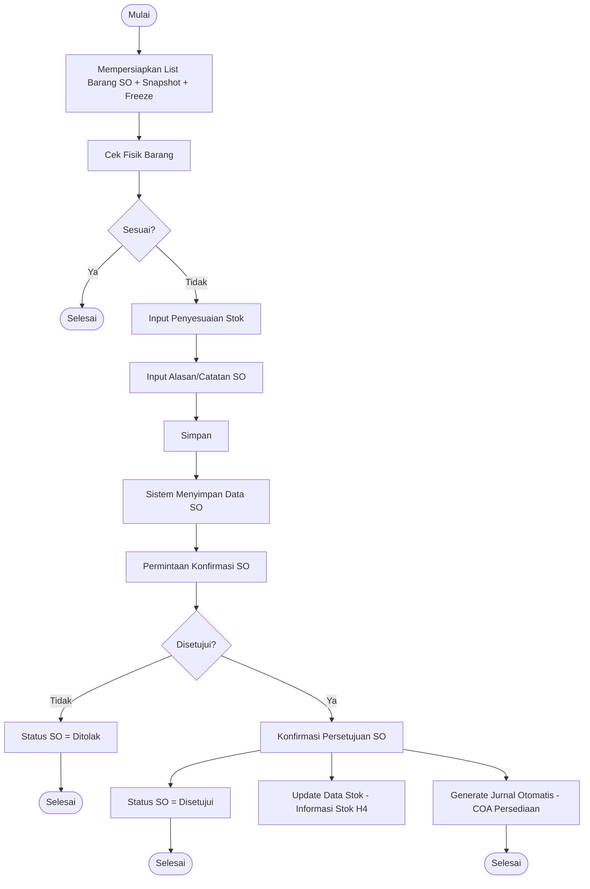

# PRD — Inventory: Stok Opname

**Related Document:** Design Figma; PRD Master Modul Inventory & Pengelolaan Stok (modul induk); PRD Detail Informasi Stok (H4), Distribusi Barang (H3), Mutasi Stok (H5), Penerimaan Barang (H2); PRD Master Data Unit (A3), Barang Farmasi (A4), Barang Rumah Tangga (A5), Bahan Makanan/Gizi (A6); PRD Modul Akuntansi — Jurnal Otomatis & Chart of Account (COA); BPMN g-backoffice-inventory-stok-opname.json
**Versi:** 1.4 - Konfirmasi stakeholder SO Parsial: approval & penyesuaian berkala per gelombang, update stok+jurnal saat di-approve (bukan saat tgl_selesai), tgl_selesai sebagai penanda penutup (BR-017, FR-019, US-015, status Sebagian Disetujui); definisi gelombang = satu sesi cek fisik atas subset barang, gelombang berikutnya tampil barang sisa; lanjutan v1.3

## 1. Overview / Brief Summary

Fitur **Stok Opname (SO)** — kode fitur **H6**, cluster **Backoffice > Inventory** — adalah proses penghitungan fisik persediaan barang secara berkala atau insidental di **Unit Gudang** dan **Unit Non Gudang** Rumah Sakit, kemudian membandingkannya dengan catatan stok di sistem untuk mengidentifikasi **selisih (variance)** dan melakukan **penyesuaian stok serta nilai persediaan (HPP)**.

Fitur ditujukan untuk **RS Tipe C dan D** (cakupan MVP sesuai List Fitur; menggantikan acuan Tipe B & C pada lampiran PRD_Stok_Opname) dengan logika yang sama namun skala data berbeda. Target tipe RS dikonfirmasi mengikuti modul induk Inventory.

**Peran yang terlibat** (gabungan BPMN lane "Unit" + lampiran):
- **Petugas Penghitung** — melakukan hitung fisik di gudang/unit.
- **Petugas Input** — memasukkan hasil hitung fisik ke sistem (sering kali sama dengan Petugas Penghitung).
- **Kepala Unit** — memberi approval atau reject hasil opname sebelum penyesuaian dilakukan.
- **Bagian Keuangan/Akuntansi** — penerima jurnal otomatis dari hasil opname yang disetujui.

**Tujuan utama:** menjamin akurasi data stok antara fisik dan sistem, mengidentifikasi kehilangan/pemborosan, mendukung penyesuaian HPP (FIFO / Moving Average), dan menghasilkan jurnal akuntansi otomatis yang ter-link ke COA yang tepat.

**Skenario umum:** Akhir bulan, Gudang Farmasi melakukan SO penuh selama 2 hari dengan transaksi dibekukan. Setelah hitung selesai, ditemukan selisih kurang 3 strip antibiotik dan selisih lebih 1 box masker. Kepala Gudang Farmasi me-review, menyetujui, lalu sistem otomatis menyesuaikan stok di **Informasi Stok (H4)**, memperbarui nilai persediaan dengan HPP relevan, dan menghasilkan jurnal koreksi ke modul Akuntansi.

## 2. Background

Sebelum adanya fitur Stok Opname terintegrasi, proses opname di RS memiliki banyak kendala (sumber: lampiran PRD_Stok_Opname):

- Hitung fisik dilakukan dengan kertas dan spreadsheet, lalu diinput ulang ke sistem secara manual — memakan waktu hingga seminggu untuk gudang besar.
- Tidak ada **freeze transaksi** selama opname, sehingga stok di sistem terus berubah dan opname menjadi tidak akurat.
- Penyesuaian selisih dilakukan satu per satu tanpa workflow approval, rawan penyalahgunaan.
- Nilai persediaan (HPP) tidak otomatis ter-update saat ada selisih, menyebabkan laporan keuangan tidak sinkron dengan stok aktual.
- Jurnal akuntansi koreksi opname disusun manual di Excel, rawan kesalahan dan tidak ter-trace ke transaksi sumbernya.
- Tidak ada **Berita Acara Opname** sistematis untuk keperluan audit eksternal.

Dengan fitur Stok Opname terintegrasi, seluruh siklus opname (**Persiapan → Hitung Fisik → Approval → Penyesuaian → Jurnal**) dilakukan dalam satu sistem dengan freeze transaksi otomatis, audit trail lengkap, dan integrasi langsung ke modul Akuntansi.

**Konsentrasi sistem yang menjadi satu kesatuan:**
- **Snapshot Stok Sistem** diambil saat opname dibuat agar perbandingan stok fisik vs sistem konsisten.
- **Freeze transaksi** inventori (Penerimaan/H2, Distribusi/H3, Mutasi/H5, Pemakaian/H11) otomatis untuk unit yang sedang dalam SO penuh.
- **Penyesuaian Stok & HPP** mengikuti metode persediaan yang dikonfigurasi di Pengaturan Inventaris (FIFO, LIFO, atau Moving Average).
- **Jurnal otomatis** menggunakan mapping COA dari Kategori Barang: Persediaan (asset), Kerugian/Keuntungan Selisih Stok (P&L).
- **Audit trail** mencatat siapa membuat, menghitung, menyetujui, kapan, dan diskrepansi per item.

**Catatan keterbatasan RS Tipe C & D** [ASUMSI]: SDM dan infrastruktur terbatas — proses harus tetap dapat dijalankan tanpa barcode scanner (input manual sebagai default), dan tahan terhadap koneksi internet yang tidak stabil (pertimbangkan simpan draft lokal sebelum submit).

## 3. In Scope

### Scope Definition (per Phase, sumber: lampiran)

| Scope/Area | Phase |
|---|---|
| Fitur Stok Opname (Access Menu: Inventaris → Stok Opname) | Phase 1 |
| Dashboard Stok Opname | Phase 1 |
| Buat Dokumen Stok Opname (Rentang Waktu, Tipe Opname, Daftar Barang) | Phase 1 |
| Snapshot Stok Sistem otomatis saat dokumen dibuat | Phase 1 |
| Freeze transaksi inventori untuk unit/barang ber-SO tipe Penuh | Phase 1 |
| Input Hasil Hitung Fisik per barang per batch (farmasi) | Phase 1 |
| Approval / Reject Kepala Unit | Phase 1 |
| Penyesuaian Stok otomatis setelah approval | Phase 1 |
| Penyesuaian Nilai HPP sesuai metode persediaan (FIFO / Moving Average) | Phase 1 |
| Impor Hasil Perhitungan Fisik dari Excel/CSV | Phase 2 |
| Berita Acara Stok Opname (PDF) untuk audit | Phase 2 |
| Stok Opname dengan Barcode Scanner | Phase 2 |
| Notifikasi otomatis ke Kepala Unit saat ada SO perlu approval | Phase 2 |
| Jurnal Otomatis ke modul Akuntansi | Phase 3 |
| Stok Opname Siklus terjadwal (ABC analysis) | Phase 3 |
| Laporan Tren Selisih SO per Periode | Phase 3 |
| Dashboard Visual Selisih SO antar Unit/Periode | Phase 4 |

> Fokus PRD ini adalah **Phase 1 (MVP)**; phase berikutnya didokumentasikan untuk roadmap.

### Out Scope

| No | Scope |
|---|---|
| 1 | Pengelolaan stok aktif harian (ditangani fitur Informasi Stok / H4). |
| 2 | Pemusnahan barang kadaluarsa atau rusak (ditangani fitur Pemusnahan Barang / H9). |
| 3 | Penyesuaian stok ad-hoc tanpa proses opname — tidak diizinkan; semua penyesuaian harus melalui SO. |
| 4 | Pengaturan metode persediaan & mapping COA (ditangani modul Pengaturan Inventaris & Master Data Kategori Barang). |
| 5 | Posting jurnal ke Buku Besar (ditangani modul Akuntansi; SO hanya men-generate jurnal). [ASUMSI — kalimat lampiran terpotong] |

## 4. Goals and Metrics

| Tujuan | Metrik Terukur | Target [ASUMSI] |
|---|---|---|
| Akurasi stok fisik vs sistem | Tingkat akurasi stok = (item tanpa selisih / total item) × 100% | ≥ 98% setelah penyesuaian |
| Mempercepat siklus opname | Rata-rata waktu siklus SO (buat → approval) | < 2 hari kerja untuk gudang besar (turun dari ±1 minggu) |
| Mengeliminasi penyesuaian tanpa kontrol | % penyesuaian stok yang melalui workflow approval SO | 100% |
| Sinkronisasi nilai persediaan | Selisih nilai persediaan stok vs buku besar pasca SO | ≤ Rp0 / sesuai toleransi pembulatan |
| Otomasi jurnal koreksi | % jurnal selisih SO yang ter-generate otomatis & ter-trace ke dokumen SO | 100% (Phase 3) |
| Kesiapan audit | % dokumen SO yang memiliki Berita Acara + audit trail lengkap | 100% (Phase 2) |
| Efisiensi input | % barang yang diinput via impor Excel/scanner vs manual | meningkat per periode (Phase 2) |

## 5. Related Feature

Fitur terkait dalam cluster **Backoffice > Inventory** (sumber: List Fitur sheet MVP) dan dependensinya pada Stok Opname:

| Code | Menu | Hubungan dengan Stok Opname |
|---|---|---|
| H1 | Inventory > Pemesanan Barang | Hulu siklus pengadaan; tidak langsung. |
| H2 | Inventory > Penerimaan Barang | Transaksi penambah stok — **dibekukan** saat SO penuh berjalan. |
| H3 | Inventory > Distribusi Barang | Transaksi pengurang stok — **dibekukan** saat SO penuh. |
| H4 | Inventory > Informasi Stok | **Sumber snapshot stok sistem** & target update stok pasca approval. |
| H5 | Inventory > Mutasi Stok | Transaksi pemindahan stok — **dibekukan** saat SO penuh. |
| **H6** | **Inventory > Stok Opname** | **Modul ini.** |
| H7 | Inventory > Peminjaman & Pengembalian Barang | Mempengaruhi posisi stok aktual: barang hasil peminjaman yang **masuk** & fisik ada tetap dihitung dalam stok **dan SO**; barang yang dipinjamkan **keluar** sudah tidak ada secara fisik dan **tidak** diperhitungkan dalam SO. Transaksi H7 tidak dibekukan tersendiri — snapshot mengambil posisi stok bersih saat dokumen dibuat (BR-015). |
| H8 | Inventory > Retur Pembelian | Transaksi pengurang stok — dibekukan saat SO. |
| H9 | Inventory > Pemusnahan Barang | Out of scope SO; selisih akibat rusak ditangani di H9. |
| H10 | Inventory > Rencana Pengadaan Barang | Hilir; data selisih SO bisa jadi input perencanaan. |
| H11 | Inventory > Penggunaan Barang Unit | Transaksi pemakaian — dibekukan saat SO penuh. |

**Lintas modul (luar cluster):** Master Data Unit (A3), Barang Farmasi (A4), Barang Rumah Tangga (A5), Bahan Makanan/Gizi (A6) sebagai referensi item; Modul Akuntansi (Jurnal Otomatis & COA) sebagai penerima jurnal; Pengaturan Inventaris (metode persediaan).

## 6. Business Process (As-Is / To-Be)

### A. As-Is (kondisi saat ini) [ASUMSI — diturunkan dari Background lampiran]
1. Tim opname mencetak daftar barang, menghitung fisik manual di gudang/unit.
2. Hasil ditulis di kertas/spreadsheet, lalu diinput ulang ke sistem belakangan.
3. Tidak ada freeze — stok sistem terus berubah selama hitung berlangsung → selisih tidak valid.
4. Penyesuaian dilakukan per item tanpa approval terstruktur.
5. HPP & nilai persediaan tidak otomatis ter-update; jurnal koreksi dibuat manual di Excel.
6. Tidak ada Berita Acara sistematis untuk audit.

### B. To-Be (kondisi diharapkan) — turunan langsung dari BPMN `g-backoffice-inventory-stok-opname.json`
1. **Mempersiapkan List Barang SO** — Unit menyiapkan dokumen SO (tipe, rentang waktu, daftar barang); sistem mengambil **snapshot stok sistem** dan membekukan transaksi terkait (tipe Penuh).
2. **Cek Fisik Barang** — petugas menghitung fisik dan membandingkan dengan snapshot.
3. **Gateway "Sesuai?"**:
   - **Ya** → proses **Selesai** (tidak ada selisih, tidak perlu penyesuaian).
   - **Tidak** → lanjut **Input Penyesuaian Stok**.
4. **Input Penyesuaian Stok** → **Input Alasan/Catatan Stock Opname** → **Simpan**.
5. **Sistem Menyimpan Data Stock Opname** → memunculkan **Permintaan Konfirmasi Stock Opname** ke Kepala Unit.
6. **Gateway "Disetujui?"**:
   - **Tidak** → **Status Stock Opname = "Ditolak"** → **Status SO = Ditolak** → Selesai.
   - **Ya** → **Konfirmasi Persetujuan Stock Opname**, yang memicu tiga aksi:
     - **Status SO = Disetujui** → Selesai.
     - **Update Data Stok → Informasi Stok (H4)** (stok aktual disesuaikan).
     - **Generate Jurnal Otomatis Penyesuaian Stok → Penyesuaian Nilai pada COA Persediaan** → Selesai.

> Catatan: BPMN hanya mendefinisikan satu lane **"Unit"**. Pemisahan peran Petugas Penghitung / Petugas Input / Kepala Unit / Keuangan diambil dari lampiran PRD dan ditandai sebagai pelengkap. [ASUMSI]

## 7. Main Flow / Mindmap

Narasi alur per skenario (urut dari Start BPMN):

**Skenario 1 — Stok sesuai (tanpa selisih):**
1. Mulai → **Mempersiapkan List Barang SO**.
2. **Cek Fisik Barang**.
3. Gateway **Sesuai? = Ya** → **Selesai**. (Tidak ada penyesuaian, tidak ada jurnal.)

**Skenario 2 — Ada selisih, DISETUJUI:**
1. Mulai → Mempersiapkan List Barang SO → Cek Fisik Barang.
2. Gateway **Sesuai? = Tidak** → **Input Penyesuaian Stok**.
3. **Input Alasan/Catatan Stock Opname** → **Simpan**.
4. **Sistem Menyimpan Data Stock Opname** → **Permintaan Konfirmasi Stock Opname** (ke Kepala Unit).
5. Gateway **Disetujui? = Ya** → **Konfirmasi Persetujuan Stock Opname**, lalu paralel:
   - **Status SO = Disetujui** → Selesai.
   - **Update Data Stok → Informasi Stok (H4)** → (loop balik mempersiapkan/menyegarkan list stok terbaru).
   - **Generate Jurnal Otomatis → Penyesuaian Nilai pada COA Persediaan** → Selesai.

**Skenario 3 — Ada selisih, DITOLAK:**
1. ... s/d Permintaan Konfirmasi Stock Opname.
2. Gateway **Disetujui? = Tidak** → **Status Stock Opname = "Ditolak"** → event → **Status SO = Ditolak** → Selesai. (Freeze transaksi **langsung dilepas**; tidak ada update stok, tidak ada jurnal — hasil SO **void/tidak memengaruhi apa pun**. Opname ulang via dokumen SO baru.)

**Skenario 4 — SO Parsial, approval berkala per gelombang (BR-017):**
1. Mulai → Mempersiapkan List Barang SO (Tipe = **Parsial**, rentang `tgl_mulai`–`tgl_selesai`, mis. **10 barang**).
2. **Gelombang 1** — Cek Fisik **6 barang** → Input Penyesuaian + Alasan → Simpan → Permintaan Konfirmasi.
3. Gateway **Disetujui? = Ya (gelombang 1)** → sistem **langsung** Update Stok (H4) + Generate Jurnal untuk **6 barang** itu **pada saat itu** (tidak menunggu `tgl_selesai`). Status dokumen → **Sebagian Disetujui**. Ke-6 barang ditandai **selesai**.
4. **Gelombang 2** — sistem hanya menampilkan **4 barang sisa** (yang belum disetujui) → Cek Fisik → approve → Update Stok + Generate Jurnal lagi.
5. Seluruh barang tertutup → **SO dapat ditutup** (`Status SO = Selesai`). `tgl_selesai` berperan sebagai **penanda penutup** agar barang yang sudah di-SO tidak masuk gelombang/dokumen SO berikutnya.

## 8. Business Rules

| ID | Aturan | Sumber/Traceability |
|---|---|---|
| BR-001 | Semua penyesuaian stok **wajib** melalui dokumen Stok Opname; penyesuaian ad-hoc di luar SO tidak diizinkan. | Out Scope #3 (lampiran) |
| BR-002 | Saat dokumen SO dibuat, sistem mengambil **snapshot stok sistem** per item/batch sebagai dasar perbandingan; snapshot tidak berubah meski ada transaksi lanjutan. | Aktivitas BPMN "Mempersiapkan List Barang SO"; lampiran |
| BR-003 | Untuk **Tipe Opname Penuh**, transaksi inventori (Penerimaan H2, Distribusi H3, Mutasi H5, Retur H8, Pemakaian H11) pada barang di Unit yang melakukan SO **dibekukan** hingga SO selesai/dibatalkan. | Lampiran In Scope Phase 1 |
| BR-004 | Jika **Sesuai? = Ya** (qty fisik = qty sistem untuk semua item) → proses Selesai tanpa penyesuaian & tanpa jurnal. | Gateway BPMN "Sesuai?" |
| BR-005 | Jika ada selisih → **wajib** mengisi Penyesuaian Stok dan **Alasan/Catatan** sebelum dapat Simpan. | Aktivitas BPMN "Input Alasan/Catatan Stock Opname" |
| BR-006 | Dokumen SO dengan selisih hanya dapat diproses lebih lanjut setelah **Konfirmasi/Approval Kepala Unit** (Disetujui/Ditolak). | Gateway BPMN "Disetujui?" |
| BR-007 | Jika **Disetujui = Tidak** → Status SO = "Ditolak"; **freeze transaksi langsung dilepas** dan **hasil SO tidak memengaruhi apa pun** (stok, nilai persediaan, dan jurnal tidak berubah/dibuat — dokumen menjadi void). | Cabang BPMN "Tidak"; konfirmasi stakeholder |
| BR-008 | Jika **Disetujui = Ya** → sistem (a) set Status SO = Disetujui, (b) update stok aktual ke Informasi Stok (H4), (c) generate jurnal otomatis penyesuaian ke COA Persediaan. Ketiganya satu transaksi atomik. **Untuk SO Parsial, transaksi atomik ini berlaku per gelombang yang disetujui (BR-017) — tidak menunggu seluruh dokumen selesai.** | Cabang BPMN "Ya" + tiga edge keluaran |
| BR-009 | Penyesuaian nilai persediaan/HPP mengikuti metode persediaan yang dikonfigurasi (FIFO / Moving Average / LIFO) di Pengaturan Inventaris. | Lampiran; Phase 2 |
| BR-010 | Jurnal otomatis memakai mapping COA dari Kategori Barang: **Persediaan** (asset) lawan **Kerugian/Keuntungan Selisih Stok** (P&L); selisih kurang = kerugian, selisih lebih = keuntungan. | Lampiran; Phase 3 |
| BR-011 | Setiap aksi (buat, hitung, simpan, setuju, tolak) tercatat pada **audit trail** beserta user & timestamp. | Lampiran |
| BR-012 | Status dokumen SO mengikuti enum (urutan dikonfirmasi): Draft → Menunggu Persetujuan → Disetujui / Ditolak → Selesai / Batal. **Untuk SO Parsial, dokumen dapat berada pada status antara "Sebagian Disetujui"** (sebagian gelombang sudah disetujui & ter-posting ke stok/jurnal) sebelum seluruh barang tertutup dan dokumen menjadi Selesai (BR-017). | BPMN status SO |
| BR-013 | Dokumen SO yang **Ditolak** bersifat **void** (tidak dapat dilanjutkan/diedit). Freeze dilepas seketika saat penolakan. Bila masih perlu opname, buat **dokumen SO baru**. Freeze juga dilepas saat SO Selesai atau Dibatalkan. | Konfirmasi stakeholder |
| BR-014 | Untuk farmasi, hitung fisik & penyesuaian dilakukan **per batch** (No. Batch + tgl kadaluarsa) bukan agregat item. | Lampiran In Scope Phase 1 |
| BR-015 | Peminjaman/pengembalian barang (H7) **tidak** dibekukan tersendiri saat SO. Snapshot mengambil **posisi stok bersih**: **barang hasil peminjaman (dipinjam masuk ke unit) yang secara fisik ada — tetap dihitung dalam stok & stok opname**; sedangkan barang yang dipinjamkan keluar (sedang berada di pihak lain) sudah tidak ada secara fisik dan **tidak** diperhitungkan dalam SO. | Konfirmasi stakeholder (H7) |
| BR-016 | **Segregation of duty (SoD)**: secara umum pembuat dokumen SO berbeda dari approver. **Pengecualian (dikonfirmasi stakeholder): pembuat dokumen SO BOLEH sekaligus menjadi approver bila yang bersangkutan merangkap/menjabat Kepala Unit** pada unit tersebut. Approval tetap hanya untuk role Kepala Unit pada unit-nya dan tetap tercatat di audit trail (BR-011, NFR-004). | Konfirmasi stakeholder |
| BR-017 | **SO Parsial — approval & penyesuaian berkala (per gelombang):** untuk Tipe Opname **Parsial**, persetujuan dapat dilakukan **bertahap/berkala** atas subset barang (satu **gelombang**) **tanpa menunggu** seluruh dokumen SO selesai. **Definisi gelombang = satu kali sesi pengecekan fisik atas sebagian barang dalam satu dokumen SO**; gelombang berikutnya **hanya menampilkan barang yang belum dihitung fisik pada gelombang sebelumnya/disetujui (sisa)**. *Contoh: dokumen 10 barang → gelombang 1 cek & approve 6 barang (stok ter-update) → gelombang 2 menampilkan 4 barang sisa, approve (stok ter-update) → seluruh barang tertutup → SO dapat ditutup.* **Setiap kali sebuah gelombang disetujui, sistem langsung menjalankan update stok (H4) + generate jurnal otomatis** untuk barang pada gelombang itu (transaksi atomik per BR-008) — pada **saat disetujui**, bukan saat `tgl_selesai`. **`tgl_selesai` (waktu SO selesai) berfungsi utama sebagai penanda penutup**: barang yang sudah di-SO pada dokumen ini ditandai selesai sehingga **tidak muncul lagi pada gelombang/dokumen SO berikutnya**. **Koreksi atas barang yang sudah disetujui (sudah ter-posting stok+jurnal) dilakukan via dokumen SO baru, bukan reversal di dokumen yang sama** (sejalan BR-013). Tidak berlaku untuk Tipe Penuh (yang di-approve sekali untuk seluruh barang, BR-003). | Konfirmasi stakeholder |

## 9. User Stories

| ID | User Story | Traceability (Activity BPMN) |
|---|---|---|
| US-001 | Sebagai **Petugas Input**, saya ingin membuat dokumen Stok Opname (tipe, rentang waktu, daftar barang) agar proses opname terstruktur dan terdokumentasi. | Mempersiapkan List Barang SO |
| US-002 | Sebagai **Petugas Input**, saya ingin sistem otomatis mengambil snapshot stok saat dokumen dibuat agar perbandingan fisik vs sistem konsisten. | Mempersiapkan List Barang SO |
| US-003 | Sebagai **Admin Inventory**, saya ingin transaksi inventori dibekukan otomatis untuk unit ber-SO penuh agar stok tidak berubah selama hitung. | Mempersiapkan List Barang SO (snapshot/freeze) |
| US-004 | Sebagai **Petugas Penghitung**, saya ingin menginput hasil hitung fisik per barang (per batch untuk farmasi) agar selisih terhitung akurat. | Cek Fisik Barang |
| US-005 | Sebagai **Petugas Input**, saya ingin sistem menandai item yang sesuai/tidak sesuai agar saya fokus pada item berselisih. | Gateway "Sesuai?" |
| US-006 | Sebagai **Petugas Input**, saya ingin mengisi penyesuaian stok beserta alasan/catatan agar setiap selisih punya justifikasi. | Input Penyesuaian Stok; Input Alasan/Catatan SO |
| US-007 | Sebagai **Petugas Input**, saya ingin menyimpan dan mengirim dokumen untuk konfirmasi agar Kepala Unit dapat me-review. | Simpan; Permintaan Konfirmasi SO |
| US-008 | Sebagai **Kepala Unit**, saya ingin menyetujui atau menolak hasil opname agar penyesuaian terkontrol. | Gateway "Disetujui?" |
| US-009 | Sebagai **Kepala Unit**, saat menolak saya ingin status menjadi "Ditolak" dan stok tidak berubah agar tidak ada penyesuaian tanpa persetujuan. | Status SO = Ditolak |
| US-010 | Sebagai **Admin Inventory**, saat SO disetujui saya ingin stok aktual otomatis ter-update ke Informasi Stok agar data stok mutakhir. | Update Data Stok → Informasi Stok |
| US-011 | Sebagai **Bagian Keuangan**, saya ingin jurnal penyesuaian otomatis ter-generate dan ter-link ke COA Persediaan agar laporan keuangan sinkron. | Generate Jurnal Otomatis → Penyesuaian Nilai COA |
| US-012 | Sebagai **Manajemen**, saya ingin dashboard ringkasan status & selisih SO agar dapat memantau akurasi stok antar unit. | [ASUMSI] Dashboard Stok Opname |
| US-013 | Sebagai **Auditor/Kepala Unit**, saya ingin Berita Acara SO (PDF) dan audit trail agar siap audit eksternal. | [ASUMSI/Phase 2] lampiran |
| US-014 | Sebagai **Petugas Input**, saya ingin mengimpor hasil hitung fisik dari Excel/CSV agar input cepat untuk gudang besar. | [Phase 2] lampiran |
| US-015 | Sebagai **Kepala Unit**, untuk SO Parsial saya ingin menyetujui hasil opname **secara berkala per gelombang** agar stok & jurnal langsung ter-update tanpa menunggu seluruh periode opname selesai. | Konfirmasi stakeholder; BR-017 |

## 10. Functional Requirements

| ID | Functional Requirement | Prioritas | Traceability |
|---|---|---|---|
| FR-001 | Sistem menyediakan menu **Inventaris → Stok Opname** dengan akses berbasis peran (Petugas Input, Kepala Unit, Admin). | MVP | Lampiran |
| FR-002 | Sistem dapat membuat **Dokumen SO** dengan field: nomor SO (auto), unit, tipe opname (Penuh/Parsial), rentang waktu, daftar barang. | MVP | US-001 |
| FR-003 | Saat dokumen dibuat, sistem mengambil **snapshot qty & nilai stok sistem** per item/batch dari Informasi Stok (H4). | MVP | US-002; BR-002 |
| FR-004 | Untuk tipe Penuh, sistem **membekukan transaksi** H2/H3/H5/H8/H11 pada unit/barang terkait sampai SO selesai/batal. | MVP | US-003; BR-003 |
| FR-005 | Sistem menyediakan layar **input hasil hitung fisik** per barang, mendukung per batch (No. Batch + ED) untuk farmasi. | MVP | US-004; BR-014 |
| FR-006 | Sistem menghitung **selisih = qty fisik − qty sistem** dan menandai status Sesuai/Selisih per item secara otomatis. | MVP | US-005; BR-004 |
| FR-007 | Bila ada selisih, sistem **mewajibkan** pengisian penyesuaian + alasan/catatan sebelum Simpan. | MVP | US-006; BR-005 |
| FR-008 | Sistem menyimpan dokumen (status Draft/Menunggu Persetujuan) dan mengirim **Permintaan Konfirmasi** ke Kepala Unit. | MVP | US-007; BR-006 |
| FR-009 | Kepala Unit dapat **Menyetujui / Menolak** dengan catatan; aksi tercatat di audit trail. | MVP | US-008; BR-006/011 |
| FR-010 | Bila **Ditolak**, status SO = "Ditolak", stok & nilai tidak berubah, jurnal tidak dibuat, dan **freeze langsung dilepas**; dokumen menjadi void. Opname ulang dilakukan via dokumen SO baru. | MVP | US-009; BR-007/013 |
| FR-011 | Bila **Disetujui**, sistem secara atomik: set status Disetujui, **update stok** ke Informasi Stok (H4), dan men-generate jurnal penyesuaian. | MVP | US-010/011; BR-008 |
| FR-012 | Sistem menghitung **penyesuaian nilai HPP** sesuai metode persediaan terkonfigurasi (FIFO/Moving Average). | Phase 2 | BR-009 |
| FR-013 | Sistem men-generate **jurnal otomatis** dengan mapping COA (Persediaan vs Kerugian/Keuntungan Selisih Stok) dan mengirim ke modul Akuntansi. | Phase 3 | BR-010 |
| FR-014 | Sistem menyediakan **Dashboard Stok Opname** (ringkasan status, jumlah selisih, nilai selisih). | MVP | US-012 |
| FR-015 | Sistem dapat menghasilkan **Berita Acara SO (PDF)** dan menampilkan **audit trail** lengkap. | Phase 2 | US-013; BR-011 |
| FR-016 | Sistem mendukung **impor hasil hitung** dari Excel/CSV sesuai template. | Phase 2 | US-014 |
| FR-017 | Sistem mendukung input hitung via **barcode scanner** (opsional, fallback ke manual). | Phase 2 | Lampiran |
| FR-018 | Sistem mengirim **notifikasi** ke Kepala Unit saat ada SO menunggu approval. | Phase 2 | Lampiran |
| FR-019 | Untuk Tipe Opname **Parsial**, sistem mendukung **approval bertahap per gelombang** (subset barang dari satu dokumen SO). Setiap approval gelombang **langsung** memicu update stok (H4) + jurnal otomatis untuk barang pada gelombang itu (BR-008), tanpa menunggu `tgl_selesai`. Barang yang gelombangnya sudah disetujui ditandai **selesai** dan tidak ditawarkan lagi pada gelombang berikutnya. | MVP | US-015; BR-017 |

## 11. Data Requirements (Spesifikasi Field)

### 11.1 Layar INPUT — Form Buat Dokumen Stok Opname (FR-002)

| Field | Label | Tipe | Wajib | Validasi/Format | Sumber/Default | Catatan |
|---|---|---|---|---|---|---|
| no_so | Nomor SO | text | Ya | **unik global** (lintas unit), auto; pola `SO-{YYYYMMDD}-{####}` dengan counter berjalan global | auto-generate | read-only; penomoran global, bukan per unit |
| unit | Unit/Gudang | dropdown(lookup) | Ya | dari master Unit (A3) | lookup A3 | konsisten field kanonik `unit` |
| tipe_opname | Tipe Opname | dropdown | Ya | enum: Penuh / Parsial (Default) | enum | Penuh memicu freeze (BR-003); **Parsial → approval berkala per gelombang** (BR-017) |
| tgl_mulai | Tanggal Mulai | date | Ya | ≤ tgl_selesai | manual | rentang waktu opname |
| tgl_selesai | Tanggal Selesai | date | Ya | ≥ tgl_mulai | manual | **penanda penutup SO**: barang yang sudah di-SO tidak masuk gelombang/dokumen SO berikutnya (Parsial, BR-017); bukan syarat posting stok/jurnal |
| kategori_barang | Kategori/Jenis Barang | dropdown(multi) | Tidak | Farmasi(A4)/RT(A5)/Gizi(A6) | lookup | filter daftar barang (Parsial) |
| daftar_barang | Daftar Barang SO | lookup(multi) | Ya | item ada di unit terpilih | dari Informasi Stok (H4) | snapshot saat simpan |
| petugas_penghitung | Petugas Penghitung | lookup | Tidak | dari master Staff | lookup Staff | nama autofill |
| keterangan | Keterangan | text | Tidak | maks 255 char | manual | field kanonik `keterangan` |

### 11.2 Layar INPUT — Hasil Hitung Fisik per Barang (FR-005/006, per batch farmasi)

| Field | Label | Tipe | Wajib | Validasi/Format | Sumber/Default | Catatan |
|---|---|---|---|---|---|---|
| kode_barang | Kode Barang | text | Ya | RT → pola `RT-#####`; Farmasi → mengikuti **pola kode barang farmasi** dari master Barang Farmasi (A4) | auto dari item | field kanonik `kode_barang`; pola berbeda per kategori |
| nama_barang | Nama Barang | text | Ya | maks 150 char | autofill master | field kanonik `nama_barang` |
| satuan | Satuan | text | Ya | dari master item | autofill | field kanonik `satuan` |
| no_batch | No. Batch | text | Ya (farmasi) | sesuai batch stok | dari snapshot H4 | BR-014; kosong utk non-farmasi |
| tgl_kadaluarsa | Tanggal Kadaluarsa | date | Ya (farmasi) | format tanggal | dari snapshot H4 | |
| qty_sistem | Qty Sistem (Snapshot) | number | Ya | ≥ 0 | snapshot H4 | read-only |
| qty_fisik | Qty Fisik | number | Ya | ≥ 0, integer/desimal sesuai satuan | input manual/scanner | dasar selisih |
| selisih | Selisih | number | – | = qty_fisik − qty_sistem | auto-hitung | read-only; +/− |
| hpp_satuan | HPP Satuan | number(currency) | Tidak | ≥ 0, format Rp | dari nilai persediaan (Phase 2) | utk nilai selisih |
| nilai_selisih | Nilai Selisih | number(currency) | – | = selisih × hpp_satuan | auto | read-only |
| alasan | Alasan/Catatan | text | Ya jika selisih ≠ 0 | maks 255 char | manual | BR-005; FR-007 |

### 11.3 Layar INPUT — Approval Kepala Unit (FR-009)

| Field | Label | Tipe | Wajib | Validasi/Format | Sumber/Default | Catatan |
|---|---|---|---|---|---|---|
| keputusan | Keputusan | dropdown/boolean | Ya | enum: Disetujui / Ditolak | manual | gateway "Disetujui?" |
| lingkup_approval | Lingkup Persetujuan | dropdown | Ya (Parsial) | enum: Seluruh Dokumen / Gelombang (subset barang) | default Seluruh (Penuh) | **Parsial**: approval per gelombang langsung posting stok+jurnal (BR-017; FR-019) |
| catatan_approval | Catatan Persetujuan | text | Ya jika Ditolak | maks 255 char | manual | alasan reject |
| approver | Approver | lookup | Ya | role Kepala Unit | session/login | audit trail |
| waktu_approval | Waktu Keputusan | datetime | – | auto | sistem | read-only |

### 11.4 Layar TAMPIL — Dashboard / List Stok Opname (FR-014)

| Kolom | Sumber Data | Format Tampilan | Filter/Sort | Catatan |
|---|---|---|---|---|
| Total SO Berjalan | count dokumen status ≠ Selesai/Ditolak | angka besar (kartu) | – | ringkasan |
| Menunggu Persetujuan | count status = Menunggu Persetujuan | angka besar (kartu) | – | actionable |
| Total Nilai Selisih (periode) | sum nilai_selisih | Rp | filter periode | kartu |
| No. SO | dokumen_so.no_so | text | sort terbaru | link ke detail |
| Unit | dokumen_so.unit | text | filter | |
| Tipe Opname | dokumen_so.tipe_opname | badge | filter | Penuh/Parsial |
| Periode | tgl_mulai – tgl_selesai | tanggal | sort | |
| Jml Item Selisih | count item selisih≠0 | angka | sort | |
| Nilai Selisih | sum nilai_selisih per dokumen | Rp (merah jika kurang) | sort | |
| Status | dokumen_so.status | badge (Draft/Menunggu/Sebagian Disetujui/Disetujui/Ditolak/Selesai) | filter | warna per status; **Sebagian Disetujui** utk Parsial (BR-012/017) |
| Dibuat Oleh | audit.created_by (nama) | text | – | field kanonik `nama` |

### 11.5 Layar TAMPIL — Detail SO & Audit Trail (FR-015)

| Kolom | Sumber Data | Format Tampilan | Filter/Sort | Catatan |
|---|---|---|---|---|
| Item / Batch | item_so.nama_barang + no_batch | text | sort/filter selisih | |
| Qty Sistem vs Fisik | qty_sistem / qty_fisik | angka berdampingan | – | |
| Selisih | item_so.selisih | angka (+/−, badge warna) | filter selisih≠0 | |
| Nilai Selisih | item_so.nilai_selisih | Rp | sort | Phase 2 |
| Aksi | audit_trail (buat/hitung/setuju/tolak) | timeline (user + timestamp) | sort waktu | BR-011 |
| No. Jurnal | ref jurnal modul Akuntansi | link | – | Phase 3 |

## 12. Non-Functional Requirements

| ID | Kategori | Requirement |
|---|---|---|
| NFR-001 | Performansi | Snapshot stok & pembuatan dokumen SO untuk hingga 5.000 item selesai < 30 detik. [ASUMSI] |
| NFR-002 | Integritas/Atomicity | Update stok (H4) + generate jurnal saat approval harus **transaksi atomik** — bila salah satu gagal, seluruhnya di-rollback (BR-008). |
| NFR-003 | Audit & Compliance | Audit trail immutable mencatat user, aksi, timestamp untuk setiap perubahan dokumen SO (BR-011). |
| NFR-004 | Keamanan/Otorisasi | Approval hanya dapat dilakukan role Kepala Unit pada unit-nya. Segregation of duty diterapkan antara pembuat & penyetuju, **dengan pengecualian terkonfirmasi**: pembuat dokumen SO **boleh** merangkap sebagai approver bila ia **menjabat Kepala Unit** (BR-016). |
| NFR-005 | Ketahanan Koneksi (RS Tipe C&D) | **WAJIB** (dikonfirmasi stakeholder): input hitung fisik dapat disimpan sebagai draft lokal saat offline dan disinkronkan otomatis ke server saat koneksi pulih, tanpa kehilangan data. Mendukung RS dengan koneksi internet tidak stabil. |
| NFR-006 | Usability | Layar input hitung fisik dapat dioperasikan tanpa scanner (input manual), mendukung navigasi keyboard untuk input massal cepat. |
| NFR-007 | Konsistensi Data | Freeze transaksi mencegah race-condition antara opname dan transaksi inventori lain (BR-003). |
| NFR-008 | Skalabilitas | Logika sama untuk RS Tipe C & D, hanya volume data berbeda. |
| NFR-009 | Ketertelusuran | Setiap jurnal otomatis ter-link balik ke dokumen SO sumber (BR-010). |
| NFR-010 | Retensi/Cetak | Berita Acara SO dapat diunduh ulang (PDF) untuk keperluan audit kapan pun. |

## 13. Integrasi Eksternal

Modul Stok Opname **tidak berintegrasi dengan sistem eksternal nasional** (tidak ada BPJS/SATUSEHAT/Disdukcapil pada alur ini). Integrasi bersifat **internal antar-modul SIMRS**:

| Integrasi | Arah | Tujuan | Traceability |
|---|---|---|---|
| **Informasi Stok (H4)** | Baca & Tulis | Sumber snapshot stok saat dokumen dibuat; tujuan update stok aktual pasca approval. | FR-003, FR-011; BPMN "Update Data Stok → Informasi Stok" |
| **Transaksi Inventori (H2/H3/H5/H8/H11)** | Kontrol | Freeze/unfreeze transaksi untuk unit/barang ber-SO penuh. | FR-004; BR-003 |
| **Master Data Item (A4/A5/A6) & Unit (A3)** | Baca | Referensi kode/nama/satuan barang & unit. | FR-002/005 |
| **Pengaturan Inventaris** | Baca | Metode persediaan (FIFO/LIFO/Moving Average) untuk perhitungan HPP. | FR-012; BR-009 |
| **Modul Akuntansi — Jurnal Otomatis & COA** | Tulis | Kirim jurnal penyesuaian (Persediaan vs Kerugian/Keuntungan Selisih Stok) ter-link ke dokumen SO. | FR-013; BR-010; BPMN "Penyesuaian Nilai pada COA Persediaan" |
| **Modul Notifikasi** | Tulis | Notifikasi ke Kepala Unit untuk approval (Phase 2). | FR-018 |

> [PERLU KONFIRMASI] Mekanisme teknis integrasi (API internal / shared DB / event) ke modul Akuntansi & Informasi Stok mengikuti standar arsitektur SIMRS induk.

## Asumsi
- [ASUMSI] Pemisahan peran Petugas Penghitung / Petugas Input / Kepala Unit / Keuangan diambil dari lampiran PRD; BPMN hanya mendefinisikan satu lane 'Unit'.
- [KEPUTUSAN] Segregation of duty: pembuat dokumen SO BOLEH merangkap sebagai approver bila yang bersangkutan menjabat Kepala Unit pada unit tersebut (dikonfirmasi stakeholder) — BR-016, NFR-004. Approval tetap terbatas role Kepala Unit pada unit-nya & tercatat di audit trail.
- [KEPUTUSAN] SO Parsial: approval dapat dilakukan berkala/bertahap per gelombang (subset barang). Setiap approval gelombang LANGSUNG memicu update stok (H4) + jurnal otomatis pada saat disetujui, tanpa menunggu tgl_selesai. tgl_selesai berfungsi utama sebagai penanda penutup agar barang yang sudah di-SO tidak muncul pada gelombang/dokumen SO berikutnya (dikonfirmasi stakeholder) — BR-017, FR-019, US-015.
- [ASUMSI] Kondisi As-Is diturunkan dari bagian Background lampiran, bukan observasi langsung.
- [ASUMSI] Target metrik (akurasi ≥98%, siklus <2 hari, dll.) adalah usulan awal dan perlu divalidasi manajemen RS.
- [ASUMSI] Untuk RS Tipe C & D, input hitung fisik default manual (tanpa scanner). Dukungan draft lokal & sinkronisasi offline dikonfirmasi WAJIB (NFR-005), bukan lagi asumsi.
- [ASUMSI] Posting jurnal ke Buku Besar berada di modul Akuntansi; Stok Opname hanya men-generate jurnal (kalimat Out Scope #5 pada lampiran terpotong).
- [ASUMSI] Penyesuaian HPP & jurnal otomatis (Phase 2/3) mengikuti mapping COA dari Kategori Barang sesuai lampiran.
- Field kanonik lintas-PRD (unit, kode_barang, nama_barang, satuan, keterangan, nama) direuse dengan definisi yang sama sesuai blok Konteks PRD terkait.

## Pertanyaan Terbuka
- Mekanisme teknis integrasi ke modul Akuntansi (Jurnal Otomatis/COA) dan Informasi Stok — API, event, atau shared DB?
- Terkonfirmasi (v1.2): Nomor SO unik global (pola SO-{YYYYMMDD}-{####}); kode barang farmasi mengikuti pola master Barang Farmasi (A4); peminjaman/pengembalian (H7) tidak dibekukan tersendiri — barang hasil peminjaman yang fisik ada tetap dihitung dalam SO, barang yang dipinjamkan keluar tidak dihitung (BR-015); dukungan offline/sinkronisasi WAJIB (NFR-005); SO Ditolak → freeze langsung dilepas, hasil SO void/tidak memengaruhi apa pun, opname ulang via dokumen baru (BR-007/013).
- Terkonfirmasi (v1.4): SO Parsial dapat di-approve berkala per gelombang; setiap approval gelombang langsung update stok + jurnal pada saat disetujui (tidak menunggu tgl_selesai); tgl_selesai = penanda penutup agar barang yang sudah di-SO tidak masuk gelombang berikutnya; status antara 'Sebagian Disetujui' (BR-017, FR-019, US-015).
- Terkonfirmasi (v1.4): Definisi 'gelombang' = satu kali sesi pengecekan fisik atas sebagian barang dalam satu dokumen SO. Barang per gelombang bersifat subset (bebas, tidak terikat kategori/lokasi). Gelombang berikutnya hanya menampilkan barang sisa yang belum disetujui; barang yang sudah disetujui keluar dari pool dan tidak ditampilkan lagi. Contoh: 10 barang → gelombang 1 approve 6 (update stok) → gelombang 2 tampil 4 sisa → approve (update stok) → SO ditutup (BR-017, FR-019).
- Terkonfirmasi (v1.4): SO Parsial — koreksi atas barang yang sudah disetujui pada gelombang sebelumnya (sudah ter-posting stok+jurnal) dilakukan via DOKUMEN SO BARU, bukan reversal di dalam dokumen yang sama (sejalan BR-013/BR-017).